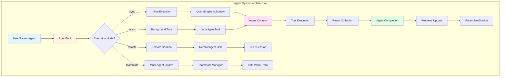
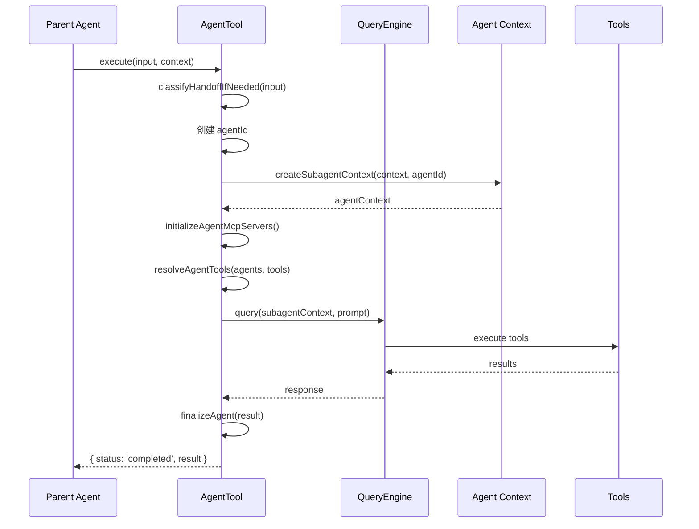
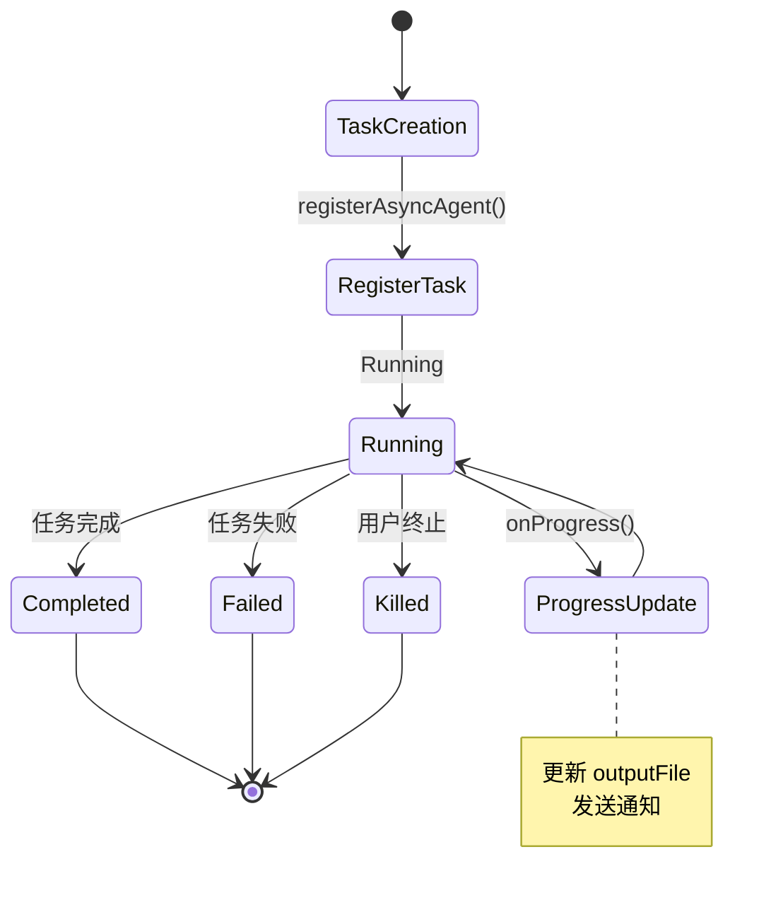
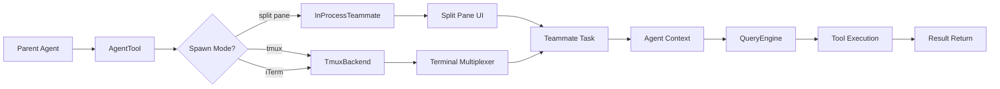
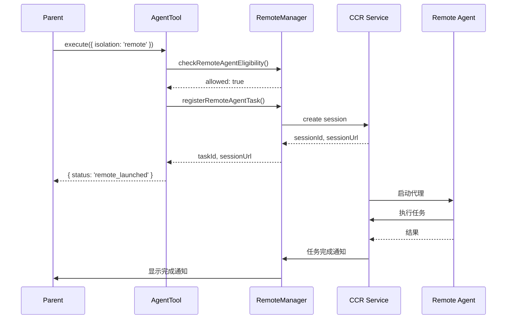

# 第11章 Agent System 代理系统

## 概述

Claude Code 的代理系统是其实现复杂任务自动化和并行处理的核心机制。通过 AgentTool，用户可以创建专门的子代理来处理特定任务，支持同步执行、后台运行、远程执行和团队协作等多种模式。本章将深入分析代理系统的架构设计、生命周期管理、策略模式应用和源码实现。

**本章要点：**

- **代理架构**：AgentTool、AgentDefinition、AgentTask
- **生命周期管理**：创建、执行、监控、完成
- **执行模式**：同步、后台（async）、远程（remote）、队友（teammate）
- **隔离机制**：工作树（worktree）、远程会话
- **进度追踪**：实时进度更新、状态通知
- **策略模式**：专用代理、通用代理、内置代理

## 架构概览

### 整体架构



### 核心组件

1. **AgentTool**: 工具定义，负责参数验证和权限检查
2. **AgentDefinition**: 代理定义，包含配置、工具、系统提示词
3. **AgentTask**: 任务实例，管理执行状态和生命周期
4. **AgentContext**: 代理上下文，隔离的状态和资源
5. **ProgressTracker**: 进度追踪器，实时更新任务状态

## 代理工具实现

### AgentTool 定义

```typescript
// src/tools/AgentTool/AgentTool.tsx
export const AgentTool = buildTool({
  async prompt({
    agents,
    tools,
    getToolPermissionContext,
  }) {
    return getPrompt({
      agents,
      tools,
      getToolPermissionContext,
    });
  },
  
  inputSchema,
  outputSchema,
  
  async checkPermissions(input, context) {
    // 1. 检查代理是否被拒绝
    const denyRule = getDenyRuleForAgent(input.subagent_type);
    if (denyRule) {
      return {
        behavior: 'deny',
        message: denyRule,
      };
    }
    
    // 2. 检查远程执行权限
    if (input.isolation === 'remote') {
      const canRemote = await checkRemoteAgentEligibility(context);
      if (!canRemote.allowed) {
        return {
          behavior: 'deny',
          message: formatPreconditionError(canRemote.reason),
        };
      }
    }
    
    return { behavior: 'allow' };
  },
  
  async execute(input, context) {
    // 1. 分类执行模式
    const classification = classifyHandoffIfNeeded(input, context);
    
    // 2. 根据分类执行
    switch (classification.type) {
      case 'sync':
        return await runSyncAgent(input, context);
      
      case 'async':
        return await runAsyncAgent(input, context);
      
      case 'teammate':
        return await spawnTeammate(input, context);
      
      case 'remote':
        return await launchRemoteAgent(input, context);
      
      case 'fork':
        return await runForkSubagent(input, context);
    }
  },
});
```

### 输入模式

```typescript
/**
 * 代理工具输入
 */
interface AgentToolInput {
  // 任务描述（3-5个词）
  description: string;
  
  // 任务提示词
  prompt: string;
  
  // 专用代理类型（可选）
  subagent_type?: string;
  
  // 模型覆盖（可选）
  model?: 'sonnet' | 'opus' | 'haiku';
  
  // 后台运行（可选）
  run_in_background?: boolean;
  
  // 代理名称（可选，用于 SendMessage 寻址）
  name?: string;
  
  // 团队名称（可选）
  team_name?: string;
  
  // 权限模式（可选）
  mode?: PermissionMode;
  
  // 隔离模式（可选）
  isolation?: 'worktree' | 'remote';
  
  // 工作目录（可选）
  cwd?: string;
}
```

### 输出模式

```typescript
/**
 * 同步执行输出
 */
interface SyncOutput {
  status: 'completed';
  prompt: string;  // 原始任务描述
  result: string;  // 执行结果
}

/**
 * 后台执行输出
 */
interface AsyncOutput {
  status: 'async_launched';
  agentId: string;              // 代理 ID
  description: string;          // 任务描述
  prompt: string;               // 任务提示词
  outputFile: string;           // 输出文件路径
  canReadOutputFile?: boolean;  // 是否可读取输出文件
}

/**
 * 队友代理输出
 */
interface TeammateSpawnedOutput {
  status: 'teammate_spawned';
  prompt: string;
  teammate_id: string;          // 队友 ID
  agent_id: string;              // 代理 ID
  agent_type?: string;           // 代理类型
  model?: string;                // 使用的模型
  name: string;                  // 显示名称
  color?: string;                // 显示颜色
  tmux_session_name: string;     // Tmux 会话名
  tmux_window_name: string;      // Tmux 窗口名
  tmux_pane_id: string;          // Tmux 面板 ID
  team_name?: string;            // 团队名称
  is_splitpane?: boolean;        // 是否为分屏
  plan_mode_required?: boolean;  // 是否需要计划模式
}

/**
 * 远程执行输出
 */
interface RemoteLaunchedOutput {
  status: 'remote_launched';
  taskId: string;                // 任务 ID
  sessionUrl: string;            // 会话 URL
  description: string;            // 任务描述
  prompt: string;                // 任务提示词
  outputFile: string;             // 输出文件路径
}
```

## 同步代理执行

### 执行流程



### 实现代码

```typescript
/**
 * 运行同步代理
 */
async function runSyncAgent(
  input: AgentToolInput,
  parentContext: ToolUseContext
): Promise<SyncOutput> {
  // 1. 创建代理 ID
  const agentId = createAgentId();
  
  // 2. 创建子代理上下文
  const agentContext = await createSubagentContext(
    parentContext,
    agentId,
    {
      description: input.description,
      agentType: input.subagent_type,
      model: input.model,
    }
  );
  
  // 3. 初始化代理专用 MCP 服务器
  const { tools: mcpTools, cleanup: cleanupMcp } = 
    await initializeAgentMcpServers(
      getAgentDefinition(input.subagent_type),
      parentContext.mcpClients || []
    );
  
  try {
    // 4. 解析工具集
    const agentTools = await resolveAgentTools(
      input.subagent_type,
      parentContext.tools,
      mcpTools
    );
    
    // 5. 构建系统提示词
    const systemPrompt = await buildAgentSystemPrompt(
      input.subagent_type,
      agentContext
    );
    
    // 6. 执行查询
    const response = await query(agentContext, {
      messages: [
        createUserMessage({
          content: input.prompt,
        }),
      ],
      systemPrompt,
      tools: agentTools,
      model: getAgentModel(input.subagent_type, input.model),
    });
    
    // 7. 提取结果
    const result = extractTextContent(response);
    
    // 8. 最终化代理
    await finalizeAgent({
      agentId,
      agentType: input.subagent_type,
      status: 'completed',
      result,
    });
    
    return {
      status: 'completed',
      prompt: input.prompt,
      result,
    };
    
  } finally {
    // 9. 清理 MCP 服务器
    await cleanupMcp();
  }
}
```

### 上下文隔离

```typescript
/**
 * 创建子代理上下文
 */
export async function createSubagentContext(
  parentContext: ToolUseContext,
  agentId: AgentId,
  options: {
    description?: string;
    agentType?: string;
    model?: string;
  }
): Promise<ToolUseContext> {
  // 1. 克隆文件状态缓存
  const readFileState = cloneFileStateCache(
    parentContext.readFileState
  );
  
  // 2. 创建受限的缓存（大小限制）
  const limitedCache = createFileStateCacheWithSizeLimit(
    READ_FILE_STATE_CACHE_SIZE
  );
  
  // 3. 创建新的上下文
  const agentContext: ToolUseContext = {
    ...parentContext,
    
    // 代理专用属性
    agentId,
    agentType: options.agentType,
    parentMessage: parentContext.currentMessage,
    
    // 隔离的状态
    readFileState: limitedCache,
    loadedNestedMemoryPaths: new Set(),
    
    // 清空的钩子（避免继承父钩子）
    options: {
      ...parentContext.options,
      hooks: undefined,
    },
  };
  
  // 4. 注册代理前端钩子
  const agentDefinition = getAgentDefinition(options.agentType);
  if (agentDefinition) {
    await registerFrontmatterHooks(
      agentDefinition,
      agentContext
    );
  }
  
  return agentContext;
}
```

## 后台代理执行

### 异步任务管理



### 实现代码

```typescript
/**
 * 运行后台代理
 */
async function runAsyncAgent(
  input: AgentToolInput,
  parentContext: ToolUseContext
): Promise<AsyncOutput> {
  // 1. 创建代理 ID
  const agentId = createAgentId();
  
  // 2. 生成输出文件路径
  const outputFile = getTaskOutputPath(agentId);
  
  // 3. 创建进度追踪器
  const progressTracker = createProgressTracker(
    agentId,
    input.description
  );
  
  // 4. 注册后台任务
  await registerAsyncAgent({
    agentId,
    agentType: input.subagent_type,
    description: input.description,
    prompt: input.prompt,
    model: input.model,
    outputFile,
    parentContext,
    progressTracker,
  });
  
  // 5. 启动异步执行
  const executionPromise = runAsyncAgentLifecycle({
    agentId,
    agentType: input.subagent_type,
    prompt: input.prompt,
    model: input.model,
    parentContext,
    progressTracker,
  });
  
  // 6. 不等待完成，立即返回
  executionPromise.catch((error) => {
    logEvent('agent_task_failed', {
      agentId,
      agentType: input.subagent_type,
      error: errorMessage(error),
    });
    
    failAsyncAgent(agentId, error);
  });
  
  // 7. 确定是否可读取输出文件
  const canReadOutputFile = await canAgentReadOutput(
    parentContext.tools
  );
  
  return {
    status: 'async_launched',
    agentId,
    description: input.description,
    prompt: input.prompt,
    outputFile,
    canReadOutputFile,
  };
}

/**
 * 异步代理生命周期
 */
async function runAsyncAgentLifecycle(params: {
  agentId: AgentId;
  agentType?: string;
  prompt: string;
  model?: string;
  parentContext: ToolUseContext;
  progressTracker: ProgressTracker;
}): Promise<void> {
  const { agentId, agentType, prompt, model, parentContext, progressTracker } = params;
  
  try {
    // 1. 创建代理上下文
    const agentContext = await createSubagentContext(
      parentContext,
      agentId,
      { agentType, model }
    );
    
    // 2. 初始化 MCP 服务器
    const { tools: mcpTools, cleanup: cleanupMcp } = 
      await initializeAgentMcpServers(
        getAgentDefinition(agentType),
        parentContext.mcpClients || []
      );
    
    try {
      // 3. 解析工具
      const agentTools = await resolveAgentTools(
        agentType,
        parentContext.tools,
        mcpTools
      );
      
      // 4. 构建系统提示词
      const systemPrompt = await buildAgentSystemPrompt(
        agentType,
        agentContext
      );
      
      // 5. 执行查询（带进度追踪）
      const response = await query(agentContext, {
        messages: [createUserMessage({ content: prompt })],
        systemPrompt,
        tools: agentTools,
        model: getAgentModel(agentType, model),
        onProgress: (progress) => {
          // 更新进度
          updateAsyncAgentProgress(agentId, progress);
          
          // 写入输出文件
          writeAgentProgress(outputFile, progress);
        },
      });
      
      // 6. 提取结果
      const result = extractTextContent(response);
      
      // 7. 标记完成
      await completeAsyncAgent(agentId, {
        status: 'completed',
        result,
      });
      
      // 8. 发送通知
      await enqueueAgentNotification({
        agentId,
        type: 'completed',
        message: `Task "${params.description}" completed`,
      });
      
    } finally {
      await cleanupMcp();
    }
    
  } catch (error) {
    // 处理错误
    await failAsyncAgent(agentId, error);
    throw error;
  }
}
```

### 进度追踪

```typescript
/**
 * 进度追踪器
 */
export function createProgressTracker(
  agentId: AgentId,
  description: string
): ProgressTracker {
  const tracker = {
    agentId,
    description,
    startTime: Date.now(),
    
    steps: [] as ProgressStep[],
    currentStep: 0,
    
    // 添加步骤
    addStep(step: Omit<ProgressStep, 'timestamp'>) {
      const progressStep: ProgressStep = {
        ...step,
        timestamp: Date.now(),
      };
      this.steps.push(progressStep);
      this.currentStep++;
      
      // 写入输出文件
      this.writeProgress();
    },
    
    // 更新当前步骤
    updateStep(update: Partial<ProgressStep>) {
      if (this.steps.length > 0) {
        this.steps[this.steps.length - 1] = {
          ...this.steps[this.steps.length - 1],
          ...update,
        };
        this.writeProgress();
      }
    },
    
    // 写入进度文件
    writeProgress() {
      const outputPath = getTaskOutputPath(this.agentId);
      const progress = {
        agentId: this.agentId,
        description: this.description,
        startTime: this.startTime,
        currentTime: Date.now(),
        steps: this.steps,
        currentStep: this.currentStep,
      };
      
      writeFile(outputPath, JSON.stringify(progress, null, 2));
    },
  };
  
  return tracker;
}

/**
 * 更新异步代理进度
 */
export async function updateAsyncAgentProgress(
  agentId: AgentId,
  progress: Message
): Promise<void> {
  // 1. 提取进度信息
  const progressUpdate = extractProgressUpdate(progress);
  
  // 2. 更新追踪器
  const tracker = getProgressTracker(agentId);
  if (tracker && progressUpdate) {
    tracker.updateStep(progressUpdate);
  }
  
  // 3. 发送 SDK 事件
  enqueueSdkEvent({
    type: 'agent_progress',
    agentId,
    progress: progressUpdate,
  });
}

/**
 * 提取进度更新
 */
function extractProgressUpdate(
  message: Message
): ProgressStep | null {
  if (message.type === 'progress') {
    return {
      type: 'info',
      message: message.message.content,
    };
  }
  
  if (message.type === 'assistant') {
    // 检查工具使用
    const toolUse = getLastToolUse(message);
    if (toolUse) {
      return {
        type: 'tool_use',
        tool: toolUse.name,
        input: toolUse.input,
      };
    }
  }
  
  return null;
}
```

## 队友代理（多代理系统）

### 队友生成



### 实现代码

```typescript
/**
 * 生成队友代理
 */
async function spawnTeammate(
  input: AgentToolInput,
  parentContext: ToolUseContext
): Promise<TeammateSpawnedOutput> {
  // 1. 检查是否启用代理群
  if (!isAgentSwarmsEnabled()) {
    throw new Error(
      'Agent swarms are not enabled. Please enable the AGENT_SWARMS feature flag.'
    );
  }
  
  // 2. 创建代理 ID
  const teammateId = createAgentId();
  const agentId = createAgentId();
  
  // 3. 确定显示属性
  const name = input.name || input.subagent_type || 'teammate';
  const color = setAgentColor(teammateId, getRandomColor());
  
  // 4. 生成队友任务
  const task = await createTeammateTask({
    teammateId,
    agentId,
    agentType: input.subagent_type,
    description: input.description,
    prompt: input.prompt,
    model: input.model,
    mode: input.mode,
    parentContext,
  });
  
  // 5. 启动队友
  const result = await spawnTeammate(task);
  
  return {
    status: 'teammate_spawned',
    prompt: input.prompt,
    teammate_id: teammateId,
    agent_id: agentId,
    agent_type: input.subagent_type,
    model: input.model,
    name,
    color,
    tmux_session_name: result.sessionName,
    tmux_window_name: result.windowName,
    tmux_pane_id: result.paneId,
    team_name: input.team_name,
    is_splitpane: result.isSplitpane,
    plan_mode_required: result.planModeRequired,
  };
}

/**
 * 创建队友任务
 */
async function createTeammateTask(params: {
  teammateId: AgentId;
  agentId: AgentId;
  agentType?: string;
  description: string;
  prompt: string;
  model?: string;
  mode?: PermissionMode;
  parentContext: ToolUseContext;
}): Promise<TeammateTask> {
  const {
    teammateId,
    agentId,
    agentType,
    description,
    prompt,
    model,
    mode,
    parentContext,
  } = params;
  
  // 1. 创建代理上下文
  const agentContext = await createSubagentContext(
    parentContext,
    agentId,
    { agentType, model }
  );
  
  // 2. 初始化 MCP 服务器
  const { tools: mcpTools } = await initializeAgentMcpServers(
    getAgentDefinition(agentType),
    parentContext.mcpClients || []
  );
  
  // 3. 解析工具
  const agentTools = await resolveAgentTools(
    agentType,
    parentContext.tools,
    mcpTools
  );
  
  // 4. 构建系统提示词
  const systemPrompt = await buildAgentSystemPrompt(
    agentType,
    agentContext
  );
  
  // 5. 创建队友任务
  const task: TeammateTask = {
    type: 'local_agent',
    agentId: teammateId,
    
    // 任务属性
    description,
    status: 'running',
    startTime: Date.now(),
    
    // 执行上下文
    agentContext,
    systemPrompt,
    tools: agentTools,
    model: getAgentModel(agentType, model),
    
    // 消息历史
    messages: [
      createUserMessage({ content: prompt }),
    ],
    
    // 进度回调
    onProgress: (progress) => {
      updateProgressFromMessage(teammateId, progress);
    },
  };
  
  return task;
}
```

### Tmux 集成

```typescript
/**
 * Tmux 后端实现
 */
export class TmuxBackend {
  /**
   * 在 Tmux 中创建新窗口
   */
  async createWindow(options: {
    sessionName: string;
    windowName: string;
    command: string;
  }): Promise<{
    sessionName: string;
    windowName: string;
    paneId: string;
  }> {
    const { sessionName, windowName, command } = options;
    
    // 1. 创建新会话（如果不存在）
    await this.exec(`tmux new-session -d -s ${sessionName}`);
    
    // 2. 创建新窗口
    await this.exec(`tmux new-window -d -t ${sessionName} -n ${windowName}`);
    
    // 3. 执行命令
    const result = await this.exec(
      `tmux send-keys -t ${sessionName}:${windowName} "${command}" C-m`
    );
    
    // 4. 获取面板 ID
    const paneId = await this.getPaneId(sessionName, windowName);
    
    return { sessionName, windowName, paneId };
  }
  
  /**
   * 在 Tmux 中创建分屏
   */
  async createSplitPane(options: {
    sessionName: string;
    windowName: string;
    command: string;
    vertical?: boolean;
  }): Promise<{
    paneId: string;
  }> {
    const { sessionName, windowName, command, vertical = false } = options;
    
    // 1. 创建分屏
    const splitFlag = vertical ? '-h' : '-v';
    await this.exec(
      `tmux split-window ${splitFlag} -t ${sessionName}:${windowName}`
    );
    
    // 2. 在新面板中执行命令
    await this.exec(
      `tmux send-keys -t ${sessionName}:${windowName} "${command}" C-m`
    );
    
    // 3. 获取新面板 ID
    const paneId = await this.getPaneId(sessionName, windowName);
    
    return { paneId };
  }
  
  /**
   * 执行 Tmux 命令
   */
  private async exec(command: string): Promise<string> {
    return await execCommand(command, {
      env: {
        ...process.env,
        TMUX: os.homedir() + '/.tmux.conf',
      },
    });
  }
  
  /**
   * 获取面板 ID
   */
  private async getPaneId(
    sessionName: string,
    windowName: string
  ): Promise<string> {
    const format = '#{pane_id}';
    const result = await this.exec(
      `tmux display -t ${sessionName}:${windowName} -p "${format}"`
    );
    return result.trim();
  }
}
```

## 远程代理执行

### Remote Agent 部署



### 实现代码

```typescript
/**
 * 启动远程代理
 */
async function launchRemoteAgent(
  input: AgentToolInput,
  parentContext: ToolUseContext
): Promise<RemoteLaunchedOutput> {
  // 1. 检查远程执行资格
  const eligibility = await checkRemoteAgentEligibility(parentContext);
  if (!eligibility.allowed) {
    throw new Error(formatPreconditionError(eligibility.reason));
  }
  
  // 2. 创建代理 ID
  const agentId = createAgentId();
  
  // 3. 生成输出文件路径
  const outputFile = getTaskOutputPath(agentId);
  
  // 4. 注册远程任务
  const { taskId, sessionUrl } = await registerRemoteAgentTask({
    agentId,
    agentType: input.subagent_type,
    description: input.description,
    prompt: input.prompt,
    model: input.model,
    outputFile,
    parentContext,
  });
  
  return {
    status: 'remote_launched',
    taskId,
    sessionUrl,
    description: input.description,
    prompt: input.prompt,
    outputFile,
  };
}

/**
 * 检查远程代理资格
 */
export async function checkRemoteAgentEligibility(
  context: ToolUseContext
): Promise<{
  allowed: boolean;
  reason?: string;
}> {
  // 1. 检查功能开关
  const isEnabled = getFeatureValue_CACHED_MAY_BE_STALE(
    'tengu_malort_pedway',
    false
  );
  
  if (!isEnabled) {
    return {
      allowed: false,
      reason: 'Remote agents are not enabled',
    };
  }
  
  // 2. 检查环境配置
  const ccrConfig = getCcrConfig();
  if (!ccrConfig) {
    return {
      allowed: false,
      reason: 'CCR configuration not found',
    };
  }
  
  // 3. 检查认证状态
  const isAuthenticated = await checkCcrAuthentication();
  if (!isAuthenticated) {
    return {
      allowed: false,
      reason: 'Not authenticated with CCR',
    };
  }
  
  return { allowed: true };
}
```

## 工作树隔离

### 工作树创建

```typescript
/**
 * 创建代理工作树
 */
export async function createAgentWorktree(
  agentId: AgentId,
  parentContext: ToolUseContext
): Promise<{
  worktreePath: string;
  cleanup: () => Promise<void>;
}> {
  // 1. 获取当前 git 仓库根目录
  const repoRoot = await getProjectRoot();
  const currentBranch = await getCurrentBranch(repoRoot);
  
  // 2. 生成工作树名称
  const worktreeName = `agent-${agentId.slice(0, 8)}`;
  const worktreePath = path.join(repoRoot, '.git', 'worktrees', worktreeName);
  
  // 3. 创建工作树
  await execCommand('git', [
    'worktree',
    'add',
    '--detach',
    '--no-checkout',
    '-b',
    worktreeName,
  ], { cwd: repoRoot });
  
  // 4. 创建清理函数
  const cleanup = async () => {
    try {
      // 检查是否有更改
      const hasChanges = await hasWorktreeChanges(worktreePath);
      
      if (!hasChanges) {
        // 无更改，删除工作树
        await execCommand('git', [
          'worktree',
          'remove',
          worktreeName,
        ], { cwd: repoRoot });
      } else {
        // 有更改，保留并通知
        logEvent('agent_worktree_preserved', {
          agentId,
          worktreePath,
        });
      }
    } catch (error) {
      logError(error);
    }
  };
  
  return { worktreePath, cleanup };
}
```

### 工作树使用

```typescript
/**
 * 在工作树中运行代理
 */
async function runAgentInWorktree(
  input: AgentToolInput,
  parentContext: ToolUseContext
): Promise<SyncOutput> {
  // 1. 创建代理 ID
  const agentId = createAgentId();
  
  // 2. 创建工作树
  const { worktreePath, cleanup } = await createAgentWorktree(
    agentId,
    parentContext
  );
  
  try {
    // 3. 覆盖工作目录
    const agentContext = await runWithCwdOverride(
      parentContext,
      worktreePath,
      async (context) => {
        // 4. 在工作树中运行代理
        return await runSyncAgent(input, context);
      }
    );
    
    return agentContext;
    
  } finally {
    // 5. 清理工作树
    await cleanup();
  }
}
```

## 代理定义系统

### 代理定义文件

```yaml
---
# .claude/agents/code-reviewer.md
description: Expert code reviewer
agentType: code_reviewer

# 模型配置
model: sonnet

# 系统提示词
systemPrompt: |
  You are an expert code reviewer. Analyze code for:
  1. Bug risks and edge cases
  2. Performance issues
  3. Security vulnerabilities
  4. Code style and consistency
  5. Test coverage gaps
  
  Provide actionable feedback with specific examples.

# 工具配置
tools:
  - Read
  - Grep
  - FileSearch

# MCP 服务器
mcpServers:
  - postgres

# 权限模式
permissionMode: plan

# 其他配置
color: blue
alwaysAllow:
  - Grep(*:*)
  - FileSearch(*:*)
```

### 代理加载

```typescript
/**
 * 加载代理定义
 */
export async function loadAgentsDir(): Promise<AgentDefinition[]> {
  const agentsDir = getClaudeConfigPath('agents');
  
  // 1. 扫描代理文件
  const agentFiles = await glob('**/*.md', {
    cwd: agentsDir,
    absolute: false,
  });
  
  // 2. 加载每个代理定义
  const agents: AgentDefinition[] = [];
  
  for (const file of agentFiles) {
    try {
      const filePath = path.join(agentsDir, file);
      const content = await readFile(filePath, 'utf-8');
      
      // 3. 解析 frontmatter
      const { data, content: systemPrompt } = parseFrontmatter(content);
      
      // 4. 创建代理定义
      const agent: AgentDefinition = {
        agentType: path.basename(file, '.md'),
        source: 'user',
        description: data.description || '',
        systemPrompt: systemPrompt || data.systemPrompt || '',
        model: data.model,
        tools: data.tools || [],
        mcpServers: data.mcpServers || [],
        permissionMode: data.permissionMode,
        color: data.color,
        alwaysAllow: data.alwaysAllow || [],
        alwaysDeny: data.alwaysDeny || [],
        frontmatterHooks: data.hooks,
      };
      
      agents.push(agent);
    } catch (error) {
      logError(error);
    }
  }
  
  return agents;
}

/**
 * 解析工具解析
 */
export function resolveAgentTools(
  agentType: string | undefined,
  parentTools: Tools,
  mcpTools: Tools
): Tools {
  // 1. 获取代理定义
  const agentDef = getAgentDefinition(agentType);
  
  if (!agentDef) {
    // 2. 默认使用所有工具
    return parentTools;
  }
  
  // 3. 解析工具列表
  const toolNames = agentDef.tools || [];
  const resolvedTools: Tools = [];
  
  for (const toolName of toolNames) {
    // 检查父工具
    const parentTool = parentTools.find(t => t.name === toolName);
    if (parentTool) {
      resolvedTools.push(parentTool);
      continue;
    }
    
    // 检查 MCP 工具
    const mcpTool = mcpTools.find(t => t.name === toolName);
    if (mcpTool) {
      resolvedTools.push(mcpTool);
      continue;
    }
    
    // 检查内置工具
    const builtInTool = getBuiltinTool(toolName);
    if (builtInTool) {
      resolvedTools.push(builtInTool);
    }
  }
  
  return resolvedTools;
}
```

## 内置代理

### 通用代理

```typescript
/**
 * 通用代理
 */
export const GENERAL_PURPOSE_AGENT: AgentDefinition = {
  agentType: 'general',
  source: 'built-in',
  description: 'General purpose agent for any task',
  
  systemPrompt: `You are a helpful AI assistant.`,
  
  tools: [],  // 使用所有可用工具
  
  model: undefined,  // 继承父代理模型
};

/**
 * 代码审查代理
 */
export const CODE_REVIEWER_AGENT: AgentDefinition = {
  agentType: 'code_reviewer',
  source: 'built-in',
  description: 'Expert code reviewer',
  
  systemPrompt: `You are an expert code reviewer. Analyze code for:
1. Bug risks and edge cases
2. Performance issues
3. Security vulnerabilities
4. Code style and consistency
5. Test coverage gaps

Provide actionable feedback with specific examples.`,
  
  tools: ['Read', 'Grep', 'FileSearch'],
  
  permissionMode: 'plan',
};
```

### 专用代理工厂

```typescript
/**
 * 创建专用代理
 */
export function createSpecializedAgent(type: string): AgentDefinition {
  switch (type) {
    case 'debugger':
      return {
        agentType: 'debugger',
        source: 'built-in',
        description: 'Debugging specialist',
        systemPrompt: getDebuggerPrompt(),
        tools: ['Read', 'Grep', 'Bash'],
      };
    
    case 'refactor':
      return {
        agentType: 'refactor',
        source: 'built-in',
        description: 'Code refactoring specialist',
        systemPrompt: getRefactorPrompt(),
        tools: ['Read', 'FileEdit', 'FileWrite', 'Bash'],
      };
    
    case 'tester':
      return {
        agentType: 'tester',
        source: 'built-in',
        description: 'Testing specialist',
        systemPrompt: getTesterPrompt(),
        tools: ['Read', 'Bash', 'Grep'],
      };
    
    default:
      throw new Error(`Unknown agent type: ${type}`);
  }
}
```

## 策略模式应用

### 代理选择策略

```typescript
/**
 * 代理选择策略
 */
export class AgentSelectionStrategy {
  /**
   * 根据任务特征选择代理
   */
  async selectAgent(task: {
    description: string;
    prompt: string;
    context: ToolUseContext;
  }): Promise<string> {
    // 1. 分析任务类型
    const taskType = await this.classifyTask(task);
    
    // 2. 根据任务类型选择代理
    switch (taskType) {
      case 'code_review':
        return 'code_reviewer';
      
      case 'debugging':
        return 'debugger';
      
      case 'refactoring':
        return 'refactor';
      
      case 'testing':
        return 'tester';
      
      case 'documentation':
        return 'doc_writer';
      
      default:
        return 'general';
    }
  }
  
  /**
   * 任务分类
   */
  private async classifyTask(task: {
    description: string;
    prompt: string;
    context: ToolUseContext;
  }): Promise<string> {
    const { description, prompt } = task;
    const text = `${description} ${prompt}`.toLowerCase();
    
    // 关键词匹配
    if (text.includes('review') || text.includes('audit')) {
      return 'code_review';
    }
    
    if (text.includes('debug') || text.includes('fix bug')) {
      return 'debugging';
    }
    
    if (text.includes('refactor') || text.includes('rewrite')) {
      return 'refactoring';
    }
    
    if (text.includes('test') || text.includes('spec')) {
      return 'testing';
    }
    
    if (text.includes('document') || text.includes('readme')) {
      return 'documentation';
    }
    
    return 'general';
  }
}
```

## 最佳实践

### 1. 代理粒度

```typescript
// ✅ 好的做法：任务专注、代理专用
const agent = await runAgent({
  description: 'Debug user authentication',
  prompt: 'Investigate why login fails for user@test.com',
  subagent_type: 'debugger',
});

// ❌ 不好的做法：任务模糊、代理通用
const agent = await runAgent({
  description: 'Fix some issues',
  prompt: 'Look at the code and fix things',
  // 没有指定 subagent_type
});
```

### 2. 进度追踪

```typescript
// ✅ 好的做法：后台任务带进度追踪
const agent = await runAgent({
  description: 'Run full test suite',
  prompt: 'Execute all tests and generate coverage report',
  run_in_background: true,
});

// 监控进度
const progress = await readAgentProgress(agent.agentId);

// ❌ 不好的做法：后台任务无进度信息
const agent = await runAgent({
  description: 'Run full test suite',
  prompt: 'Execute all tests and generate coverage report',
  run_in_background: true,
});

// 无法知道任务状态
```

### 3. 隔离策略

```typescript
// ✅ 好的做法：危险操作使用工作树隔离
const agent = await runAgent({
  description: 'Experiment with database schema',
  prompt: 'Try new database schema changes',
  isolation: 'worktree',  // 隔离环境
});

// ❌ 不好的做法：危险操作直接在主分支运行
const agent = await runAgent({
  description: 'Experiment with database schema',
  prompt: 'Try new database schema changes',
  // 无隔离，可能破坏主分支
});
```

## 总结

Agent System 是 Claude Code 实现任务自动化和并行处理的核心，通过以下机制提供强大的代理能力：

1. **多样化执行模式**：同步、后台、远程、队友
2. **完善的生命周期管理**：创建、执行、监控、完成
3. **强大的隔离机制**：上下文隔离、工作树隔离、远程会话
4. **实时进度追踪**：进度更新、状态通知、输出文件
5. **灵活的策略模式**：专用代理、通用代理、自动选择
6. **多代理协作**：队友系统、团队协作、任务分配

**关键设计原则：**

- **任务专注**：每个代理专注于特定任务类型
- **隔离优先**：代理操作相互隔离，不干扰主流程
- **进度可见**：后台任务提供实时进度反馈
- **安全可控**：权限检查、工作树隔离、认证保护
- **灵活组合**：代理可嵌套、可并行、可协作

Agent System 的实现展示了如何通过多代理系统实现复杂的任务自动化和并行处理，这对于构建强大的 AI 助手系统具有重要的参考价值。

## 扩展阅读

- **代理工具**：`src/tools/AgentTool/AgentTool.tsx`
- **代理运行**：`src/tools/AgentTool/runAgent.ts`
- **任务管理**：`src/tasks/LocalAgentTask/LocalAgentTask.tsx`
- **代理定义**：`src/tools/AgentTool/loadAgentsDir.ts`

## 下一章

第 12 章将深入探讨 **AppState Store（状态管理）**，介绍状态结构、流转图、持久化机制和事件订阅。
