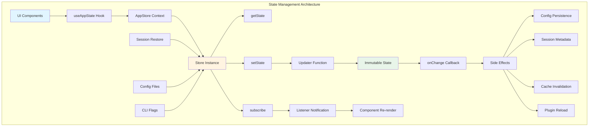
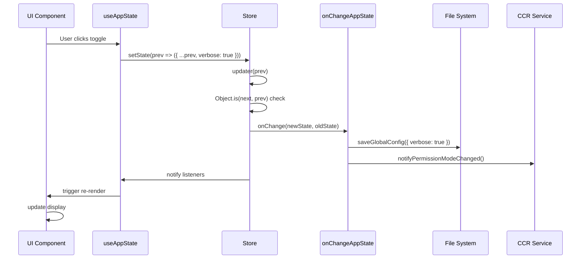

# 第12章 AppState Store 状态管理

## 概述

Claude Code 的状态管理系统是其实现响应式UI和跨模块状态同步的核心机制。通过基于不可变数据和观察者模式的 Store 架构，系统实现了高效的状态更新、订阅通知和持久化。本章将深入分析 AppState Store 的设计原理、实现细节和最佳实践。

**本章要点：**

- **Store 架构**：不可变状态、setState 更新器、订阅机制
- **AppState 结构**：300+ 字段的全局状态树
- **状态更新模式**：函数式更新器、不可变更新
- **订阅通知**：useAppState Hook、事件监听
- **持久化机制**：配置持久化、会话恢复、状态快照
- **事件驱动架构**：onChangeAppState、副作用处理

## 架构概览

### 整体架构



### 核心概念

**1. 单一数据源（Single Source of Truth）**

```typescript
// src/state/AppStateStore.ts
export type AppState = DeepImmutable<{
  // 300+ 字段的全局状态树
  settings: SettingsJson           // 用户配置
  verbose: boolean                  // 详细输出模式
  mainLoopModel: ModelSetting       // 主循环模型
  toolPermissionContext: ToolPermissionContext  // 权限上下文
  mcp: MCPState                     // MCP 客户端状态
  plugins: PluginsState             // 插件状态
  tasks: TaskState[]                // 后台任务列表
  agent: string | undefined         // 当前代理
  todos: { [agentId: string]: TodoList }
  fileHistory: FileHistoryState     // 文件历史
  attribution: AttributionState     // 归因信息
  notifications: NotificationState  // 通知队列
  speculation: SpeculationState     // 推测执行状态
  replBridgeEnabled: boolean        // REPL 桥接状态
  remoteSessionUrl: string | undefined  // 远程会话URL
  // ... 300+ 更多字段
}>
```

**2. 不可变更新（Immutable Updates）**

```typescript
// 错误方式：直接修改状态（禁止！）
function badUpdate(prev: AppState) {
  prev.verbose = true  // ❌ 违反不可变性
  return prev
}

// 正确方式：创建新对象
function goodUpdate(prev: AppState): AppState {
  return {
    ...prev,                    // 复制所有字段
    verbose: true,             // 覆盖目标字段
  }
}

// 嵌套更新
function nestedUpdate(prev: AppState): AppState {
  return {
    ...prev,
    toolPermissionContext: {
      ...prev.toolPermissionContext,
      mode: 'auto',            // 深度更新
    },
  }
}
```

## Store 实现

### createStore 函数

`createStore` 是状态管理的核心函数，实现了完整的订阅-发布模式。

```typescript
// src/state/store.ts
type Listener = () => void
type OnChange<T> = (args: { newState: T; oldState: T }) => void

export type Store<T> = {
  getState: () => T
  setState: (updater: (prev: T) => T) => void
  subscribe: (listener: Listener) => () => void
}

export function createStore<T>(
  initialState: T,
  onChange?: OnChange<T>,
): Store<T> {
  let state = initialState
  const listeners = new Set<Listener>()

  return {
    getState: () => state,

    setState: (updater: (prev: T) => T) => {
      const prev = state
      const next = updater(prev)

      // 引用相等性检查：避免不必要的更新
      if (Object.is(next, prev)) return

      state = next

      // 触发副作用（持久化、通知等）
      onChange?.({ newState: next, oldState: prev })

      // 通知所有订阅者
      for (const listener of listeners) {
        listener()
      }
    },

    subscribe: (listener: Listener) => {
      listeners.add(listener)
      // 返回取消订阅函数
      return () => listeners.delete(listener)
    },
  }
}
```

### 关键设计决策

**1. 引用相等性优化**

```typescript
if (Object.is(next, prev)) return
```

使用 `Object.is` 而非 `===` 确保正确处理 `NaN` 和 `+0/-0`。如果更新器返回相同引用，跳过所有通知和副作用。

**2. 函数式更新器**

```typescript
setState: (updater: (prev: T) => T) => void
```

使用函数而非直接值支持基于当前状态的更新，避免竞态条件：

```typescript
// 错误方式：竞态条件
const current = store.getState()
store.setState({ ...current, count: current.count + 1 })

// 正确方式：函数式更新
store.setState(prev => ({ ...prev, count: prev.count + 1 }))
```

**3. 订阅取消机制**

```typescript
subscribe: (listener: Listener) => {
  listeners.add(listener)
  return () => listeners.delete(listener)
}
```

返回取消订阅函数，符合 JavaScript 惯例：

```typescript
// 组件挂载时订阅
const unsubscribe = store.subscribe(() => {
  console.log('State updated')
})

// 组件卸载时取消订阅
unsubscribe()
```

## React 集成

### AppStateProvider

`AppStateProvider` 是 React 应用的根组件，负责创建 Store 并通过 Context 注入。

```typescript
// src/state/AppState.tsx (简化)
export function AppStateProvider({ children, initialState, onChangeAppState }) {
  const hasAppStateContext = useContext(HasAppStateContext)

  // 防止嵌套
  if (hasAppStateContext) {
    throw new Error("AppStateProvider can not be nested")
  }

  // 创建 Store（仅初始化一次）
  const store = useMemo(
    () => createStore(initialState ?? getDefaultAppState(), onChangeAppState),
    [initialState, onChangeAppState]
  )

  return (
    <AppStoreContext.Provider value={store}>
      <HasAppStateContext.Provider value={true}>
        {children}
      </HasAppStateContext.Provider>
    </AppStoreContext.Provider>
  )
}
```

### useAppState Hook

`useAppState` 实现了精确的订阅机制，仅在选择值变化时触发重新渲染。

```typescript
// src/state/AppState.tsx
export function useAppState(selector) {
  const store = useAppStore()

  // 获取当前选择值
  const get = useMemo(
    () => () => {
      const state = store.getState()
      const selected = selector(state)

      // 防御性检查：确保返回子属性
      if (state === selected) {
        throw new Error(
          `Your selector returned the original state, ` +
          `which is not allowed. Return a property instead.`
        )
      }
      return selected
    },
    [selector, store]
  )

  // 使用 React 18 的 useSyncExternalStore
  return useSyncExternalStore(store.subscribe, get, get)
}
```

### 选择器模式

**单字段选择（推荐）**

```typescript
// 每个字段独立订阅，精确追踪变化
const verbose = useAppState(s => s.verbose)
const model = useAppState(s => s.mainLoopModel)
const tasks = useAppState(s => s.tasks)

// 组件仅在 verbose 变化时重新渲染
function VerboseToggle() {
  const verbose = useAppState(s => s.verbose)
  const setAppState = useSetAppState()

  return (
    <Switch
      checked={verbose}
      onChange={() => setAppState(prev => ({ ...prev, verbose: !prev.verbose }))}
    />
  )
}
```

**多字段选择（谨慎使用）**

```typescript
// 解构多字段：任一字段变化都会触发重渲染
const { text, promptId } = useAppState(s => s.promptSuggestion)

// ❌ 错误：创建新对象，每次都变化
const { verbose, model } = useAppState(s => ({
  verbose: s.verbose,
  model: s.mainLoopModel,
}))

// ✅ 正确：多次调用 useAppState
const verbose = useAppState(s => s.verbose)
const model = useAppState(s => s.mainLoopModel)
```

### useSetAppState Hook

`useSetAppState` 提供不触发重渲染的状态更新器。

```typescript
export function useSetAppState() {
  return useAppStore().setState
}

// 使用场景：事件处理器中更新状态
function ResetButton() {
  const setAppState = useSetAppState()  // 稳定引用，不触发重渲染

  const handleClick = () => {
    setAppState(prev => ({
      ...prev,
      tasks: [],
      todos: {},
    }))
  }

  return <button onClick={handleClick}>Reset</button>
}
```

## 状态更新模式

### 批量更新

使用函数式更新器实现原子性批量更新：

```typescript
// ❌ 错误：多次 setState，触发多次渲染
setAppState(prev => ({ ...prev, verbose: true }))
setAppState(prev => ({ ...prev, expandedView: 'tasks' }))

// ✅ 正确：单次批量更新
setAppState(prev => ({
  ...prev,
  verbose: true,
  expandedView: 'tasks',
}))
```

### 条件更新

在更新器内执行条件逻辑：

```typescript
setAppState(prev => {
  // 仅在值实际变化时创建新对象
  if (prev.verbose === newValue) {
    return prev  // 返回相同引用，跳过更新
  }

  return {
    ...prev,
    verbose: newValue,
  }
})
```

### 派生状态计算

避免在 AppState 中存储派生值，实时计算：

```typescript
// ❌ 错误：存储派生状态
setAppState(prev => ({
  ...prev,
  displayTasks: prev.tasks.filter(t => !t.completed),
}))

// ✅ 正确：实时计算派生值
function ActiveTasks() {
  const tasks = useAppState(s => s.tasks)
  const displayTasks = tasks.filter(t => !t.completed)  // 每次渲染计算
  return <TaskList tasks={displayTasks} />
}
```

## 副作用处理

### onChangeAppState 钩子

`onChangeAppState` 是状态更新的单一副作用入口点，处理所有持久化、通知和缓存失效。

```typescript
// src/state/onChangeAppState.ts
export function onChangeAppState({
  newState,
  oldState,
}: {
  newState: AppState
  oldState: AppState
}) {
  // 1. 权限模式同步到 CCR
  if (newState.toolPermissionContext.mode !== oldState.toolPermissionContext.mode) {
    const newMode = newState.toolPermissionContext.mode
    const prevMode = oldState.toolPermissionContext.mode

    // 转换为外部模式
    const newExternal = toExternalPermissionMode(newMode)
    const prevExternal = toExternalPermissionMode(prevMode)

    if (prevExternal !== newExternal) {
      notifySessionMetadataChanged({ permission_mode: newExternal })
    }
    notifyPermissionModeChanged(newMode)
  }

  // 2. 配置持久化
  if (newState.expandedView !== oldState.expandedView) {
    const showExpandedTodos = newState.expandedView === 'tasks'
    const showSpinnerTree = newState.expandedView === 'teammates'

    saveGlobalConfig(current => ({
      ...current,
      showExpandedTodos,
      showSpinnerTree,
    }))
  }

  // 3. verbose 持久化
  if (newState.verbose !== oldState.verbose) {
    saveGlobalConfig(current => ({
      ...current,
      verbose: newState.verbose,
    }))
  }

  // 4. 设置变更时清除缓存
  if (newState.settings !== oldState.settings) {
    clearApiKeyHelperCache()
    clearAwsCredentialsCache()
    clearGcpCredentialsCache()

    // 重新应用环境变量
    if (newState.settings.env !== oldState.settings.env) {
      applyConfigEnvironmentVariables()
    }
  }

  // 5. 主循环模型覆盖
  if (newState.mainLoopModel !== oldState.mainLoopModel) {
    setMainLoopModelOverride(newState.mainLoopModel)
  }

  // ... 更多副作用处理
}
```

### 副作用设计原则

**1. 单一入口点**

所有副作用集中在 `onChangeAppState` 中，避免分散在组件内：

```typescript
// ❌ 错误：副作用分散在组件中
function ModeSelector() {
  const mode = useAppState(s => s.toolPermissionContext.mode)

  useEffect(() => {
    saveGlobalConfig(current => ({ ...current, permissionMode: mode }))
  }, [mode])

  return <Select value={mode} />
}

// ✅ 正确：副作用集中在 onChangeAppState
function ModeSelector() {
  const mode = useAppState(s => s.toolPermissionContext.mode)
  const setAppState = useSetAppState()

  const handleChange = (newMode) => {
    setAppState(prev => ({
      ...prev,
      toolPermissionContext: {
        ...prev.toolPermissionContext,
        mode: newMode,
      },
    }))
  }

  return <Select value={mode} onChange={handleChange} />
}

// 副作用在 onChangeAppState 中统一处理
if (newState.toolPermissionContext.mode !== oldState.toolPermissionContext.mode) {
  saveGlobalConfig(current => ({ ...current, permissionMode: newState.toolPermissionContext.mode }))
}
```

**2. 幂等性**

副作用应该是幂等的，相同输入产生相同输出：

```typescript
// ❌ 非幂等：每次都追加
if (newState.tasks !== oldState.tasks) {
  logEvent('tasks_changed', { count: newState.tasks.length })
}

// ✅ 幂等：仅在值变化时记录
if (newState.tasks.length !== oldState.tasks.length) {
  logEvent('tasks_changed', { count: newState.tasks.length })
}
```

**3. 错误隔离**

副作用失败不应影响状态更新：

```typescript
if (newState.settings !== oldState.settings) {
  try {
    clearApiKeyHelperCache()
    clearAwsCredentialsCache()
  } catch (error) {
    logError(error)  // 记录错误但不中断
  }
}
```

## 持久化机制

### 配置持久化

用户配置通过 `saveGlobalConfig` 自动持久化到 `~/.claude/settings.json`。

```typescript
// 配置结构（~/.claude/settings.json）
interface SettingsJson {
  verbose?: boolean
  showExpandedTodos?: boolean
  showSpinnerTree?: boolean
  permissionMode?: 'default' | 'auto' | 'bypass'
  env?: Record<string, string>
  // ... 更多配置项
}

// 保存配置
function saveGlobalConfig(updater: (current: SettingsJson) => SettingsJson): void {
  const configPath = getClaudeConfigHomeDir('settings.json')
  const current = readGlobalConfig()
  const updated = updater(current)

  // 原子写入
  const tmpPath = `${configPath}.tmp`
  writeFileSync(tmpPath, JSON.stringify(updated, null, 2))
  renameSync(tmpPath, configPath)
}

// onChangeAppState 中自动保存
if (newState.verbose !== oldState.verbose) {
  saveGlobalConfig(current => ({
    ...current,
    verbose: newState.verbose,
  }))
}
```

### 会话恢复

会话状态从转录文件（transcript）恢复，包括文件历史、任务列表和归因信息。

```typescript
// src/utils/sessionRestore.ts
export function restoreSessionStateFromLog(
  result: ResumeResult,
  setAppState: (f: (prev: AppState) => AppState) => void,
): void {
  // 1. 恢复文件历史
  if (result.fileHistorySnapshots && result.fileHistorySnapshots.length > 0) {
    fileHistoryRestoreStateFromLog(result.fileHistorySnapshots, newState => {
      setAppState(prev => ({ ...prev, fileHistory: newState }))
    })
  }

  // 2. 恢复归因信息
  if (result.messages && result.messages.length > 0) {
    const attribution = computeAttributionFromMessages(result.messages)
    setAppState(prev => ({ ...prev, attribution }))
  }

  // 3. 恢复任务列表（仅 SDK 模式）
  if (!isTodoV2Enabled() && result.messages && result.messages.length > 0) {
    const todos = extractTodosFromTranscript(result.messages)
    if (todos.length > 0) {
      const agentId = getSessionId()
      setAppState(prev => ({
        ...prev,
        todos: { ...prev.todos, [agentId]: todos },
      }))
    }
  }
}

// 启动时调用
async function main() {
  const result = loadTranscript(transcriptPath)
  restoreSessionStateFromLog(result, setAppState)

  // 渲染 UI
  render(<App />)
}
```

### 状态快照

文件历史使用快照机制实现增量存储：

```typescript
// src/utils/fileHistory.ts
export interface FileHistorySnapshot {
  sequence: number
  timestamp: number
  files: Array<{
    path: string
    hash: string
  }>
}

export interface FileHistoryState {
  snapshots: FileHistorySnapshot[]
  trackedFiles: Set<string>
  snapshotSequence: number
}

// 创建新快照
function createSnapshot(files: Map<string, string>): FileHistorySnapshot {
  return {
    sequence: nextSequence++,
    timestamp: Date.now(),
    files: Array.from(files.entries()).map(([path, hash]) => ({ path, hash })),
  }
}

// 存储到 AppState
setAppState(prev => ({
  ...prev,
  fileHistory: {
    ...prev.fileHistory,
    snapshots: [...prev.fileHistory.snapshots, snapshot],
    snapshotSequence: prev.fileHistory.snapshotSequence + 1,
  },
}))
```

## 事件驱动架构

### 事件流图



### 通知同步

状态变化通过 `notifySessionMetadataChanged` 同步到 CCR（Web UI）。

```typescript
// src/utils/sessionState.ts
export function notifySessionMetadataChanged(
  metadata: Partial<SessionExternalMetadata>
): void {
  // 通过 REPL 桥接发送到 CCR
  if (replBridgeSessionActive) {
    replBridgeSendEvent({
      type: 'session_metadata_changed',
      metadata,
    })
  }

  // 更新外部元数据
  externalMetadata = { ...externalMetadata, ...metadata }
}

// 在 onChangeAppState 中调用
if (newState.toolPermissionContext.mode !== oldState.toolPermissionContext.mode) {
  notifySessionMetadataChanged({
    permission_mode: toExternalPermissionMode(newState.toolPermissionContext.mode),
  })
}
```

### 插件重载

插件状态变更时标记 `needsRefresh`，触发用户手动重载或自动重载。

```typescript
// onChangeAppState 中检测插件变更
if (newState.plugins.needsRefresh && !oldState.plugins.needsRefresh) {
  if (isHeadlessMode()) {
    // 无头模式：自动重载
    refreshActivePlugins()
  } else {
    // 交互模式：显示通知提示用户重载
    showNotification({
      type: 'info',
      message: 'Plugin state changed. Run /reload-plugins to refresh.',
    })
  }
}

// 用户执行 /reload-plugins 时
async function reloadPlugins() {
  await refreshActivePlugins()

  setAppState(prev => ({
    ...prev,
    plugins: {
      ...prev.plugins,
      needsRefresh: false,
    },
  }))
}
```

## 性能优化

### 订阅优化

**精确选择器**

```typescript
// ❌ 订阅整个 AppState
const state = useAppState(s => s)  // 任何字段变化都触发重渲染

// ✅ 订阅特定字段
const verbose = useAppState(s => s.verbose)  // 仅 verbose 变化时重渲染
const tasks = useAppState(s => s.tasks)      // 仅 tasks 变化时重渲染
```

**选择器备忘**

```typescript
// 选择器函数应该稳定
const selector = useCallback(
  (state: AppState) => state.tasks.filter(t => t.agentId === currentAgent),
  [currentAgent]
)

const tasks = useAppState(selector)
```

### 更新优化

**避免不必要更新**

```typescript
// ✅ 返回相同引用跳过更新
setAppState(prev => {
  if (prev.verbose === newValue) {
    return prev
  }
  return { ...prev, verbose: newValue }
})
```

**批量深层更新**

使用工具函数简化深层更新：

```typescript
// 工具函数
function updateToolPermissionContext(
  prev: AppState,
  updates: Partial<ToolPermissionContext>
): AppState {
  return {
    ...prev,
    toolPermissionContext: {
      ...prev.toolPermissionContext,
      ...updates,
    },
  }
}

// 使用
setAppState(prev =>
  updateToolPermissionContext(prev, { mode: 'auto' })
)
```

### 渲染优化

**组件拆分**

```typescript
// ❌ 单个组件订阅多个字段
function StatusPanel() {
  const verbose = useAppState(s => s.verbose)
  const model = useAppState(s => s.mainLoopModel)
  const tasks = useAppState(s => s.tasks)

  return (
    <>
      <VerboseDisplay verbose={verbose} />
      <ModelDisplay model={model} />
      <TaskList tasks={tasks} />
    </>
  )
}

// ✅ 拆分为独立组件
function StatusPanel() {
  return (
    <>
      <VerboseDisplay />  {/* 内部订阅 verbose */}
      <ModelDisplay />    {/* 内部订阅 model */}
      <TaskList />        {/* 内部订阅 tasks */}
    </>
  )
}
```

**React.memo**

```typescript
const TaskItem = React.memo(({ task }: { task: Task }) => {
  return <div>{task.summary}</div>
}, (prev, next) => {
  // 自定义比较函数
  return prev.task.id === next.task.id && prev.task.status === next.task.status
})
```

## 最佳实践

### 1. 状态设计原则

**保持最小状态**

```typescript
// ❌ 存储派生值
interface AppState {
  tasks: Task[]
  completedTasks: Task[]     // 派生值
  pendingTasks: Task[]       // 派生值
  taskCount: number          // 派生值
}

// ✅ 仅存储源数据
interface AppState {
  tasks: Task[]
}

// 派生值实时计算
const completedTasks = tasks.filter(t => t.completed)
const pendingTasks = tasks.filter(t => !t.completed)
const taskCount = tasks.length
```

**避免状态冗余**

```typescript
// ❌ 冗余状态
interface AppState {
  tasks: Task[]
  selectedTaskId: string | null
  selectedTask: Task | null  // 冗余！可通过 selectedTaskId 查找
}

// ✅ 单一数据源
interface AppState {
  tasks: Task[]
  selectedTaskId: string | null
}

// 派生 selectedTask
const selectedTask = tasks.find(t => t.id === selectedTaskId)
```

### 2. 更新模式

**使用不可变更新**

```typescript
// ❌ 可变更新
setAppState(prev => {
  prev.tasks.push(newTask)  // 直接修改
  return prev
})

// ✅ 不可变更新
setAppState(prev => ({
  ...prev,
  tasks: [...prev.tasks, newTask],
}))
```

**深层更新工具**

```typescript
// 使用 immer 简化深层更新（如项目已集成）
import { produce } from 'immer'

setAppState(prev =>
  produce(prev, draft => {
    draft.mcp.clients[0].tools.push(newTool)
  })
)

// 或使用自定义工具函数
function updateMCPClients(
  prev: AppState,
  updater: (clients: MCPClient[]) => MCPClient[]
): AppState {
  return {
    ...prev,
    mcp: {
      ...prev.mcp,
      clients: updater(prev.mcp.clients),
    },
  }
}
```

### 3. 副作用隔离

**副作用放在 onChangeAppState**

```typescript
// ❌ 副作用分散
function ModelSelector() {
  const model = useAppState(s => s.mainLoopModel)

  useEffect(() => {
    saveGlobalConfig(current => ({ ...current, model }))
    logEvent('model_changed', { model })
    clearModelCache()
  }, [model])

  return <Select value={model} />
}

// ✅ 副作用集中
function ModelSelector() {
  const model = useAppState(s => s.mainLoopModel)
  const setAppState = useSetAppState()

  return (
    <Select
      value={model}
      onChange={newModel =>
        setAppState(prev => ({ ...prev, mainLoopModel: newModel }))
      }
    />
  )
}

// 在 onChangeAppState 中统一处理
if (newState.mainLoopModel !== oldState.mainLoopModel) {
  saveGlobalConfig(current => ({ ...current, model: newState.mainLoopModel }))
  logEvent('model_changed', { model: newState.mainLoopModel })
  clearModelCache()
}
```

### 4. 类型安全

**使用 DeepImmutable**

```typescript
// AppState 标记为 DeepImmutable，TypeScript 会防止直接修改
export type AppState = DeepImmutable<{
  tasks: Task[]
  // ...
}>

// TypeScript 编译错误
setAppState(prev => {
  prev.tasks.push(newTask)  // ❌ 类型错误：Cannot assign to 'tasks' because it is a read-only property
  return prev
})

// 正确方式
setAppState(prev => ({
  ...prev,
  tasks: [...prev.tasks, newTask],
}))
```

## 调试技巧

### 状态变化追踪

在开发环境中启用状态变化日志：

```typescript
// src/state/store.ts (调试版本)
export function createStore<T>(initialState: T, onChange?: OnChange<T>): Store<T> {
  let state = initialState
  const listeners = new Set<Listener>()

  return {
    getState: () => state,

    setState: (updater: (prev: T) => T) => {
      const prev = state
      const next = updater(prev)

      if (Object.is(next, prev)) {
        console.log('[Store] Update skipped (same reference)')
        return
      }

      console.log('[Store] State updated:', {
        prev,
        next,
        diff: computeDiff(prev, next),
      })

      state = next
      onChange?.({ newState: next, oldState: prev })
      for (const listener of listeners) listener()
    },

    subscribe: (listener: Listener) => {
      listeners.add(listener)
      return () => listeners.delete(listener)
    },
  }
}
```

### 订阅者监控

追踪哪些组件订阅了哪些状态：

```typescript
// src/state/AppState.tsx (调试版本)
export function useAppState<T>(selector: (state: AppState) => T): T {
  const store = useAppStore()

  // 记录选择器调用栈
  const selectorName = getFunctionName(selector)
  const caller = getCallerInfo()

  console.log(`[useAppState] Component ${caller} subscribed to ${selectorName}`)

  const get = () => selector(store.getState())
  return useSyncExternalStore(store.subscribe, get, get)
}
```

### 性能分析

测量状态更新和渲染性能：

```typescript
// src/state/store.ts (性能监控)
export function createStore<T>(initialState: T, onChange?: OnChange<T>): Store<T> {
  let state = initialState
  const listeners = new Set<Listener>()

  return {
    getState: () => state,

    setState: (updater: (prev: T) => T) => {
      const startTime = performance.now()
      const prev = state
      const next = updater(prev)

      if (Object.is(next, prev)) return

      state = next

      // 测量副作用执行时间
      const sideEffectStart = performance.now()
      onChange?.({ newState: next, oldState: prev })
      const sideEffectDuration = performance.now() - sideEffectStart

      // 测量通知执行时间
      const notifyStart = performance.now()
      for (const listener of listeners) {
        const listenerStart = performance.now()
        listener()
        const listenerDuration = performance.now() - listenerStart
        console.log(`[Store] Listener took ${listenerDuration.toFixed(2)}ms`)
      }
      const notifyDuration = performance.now() - notifyStart

      const totalDuration = performance.now() - startTime
      console.log(`[Store] Total update took ${totalDuration.toFixed(2)}ms ` +
                  `(side effects: ${sideEffectDuration.toFixed(2)}ms, ` +
                  `notifications: ${notifyDuration.toFixed(2)}ms)`)
    },

    subscribe: (listener: Listener) => {
      listeners.add(listener)
      return () => listeners.delete(listener)
    },
  }
}
```

## 总结

Claude Code 的状态管理系统基于不可变数据和观察者模式，实现了高效、可靠的状态同步机制。核心要点：

1. **单一数据源**：AppState 作为全局唯一状态树
2. **不可变更新**：使用函数式更新器确保状态不可变
3. **订阅机制**：useAppState 实现精确订阅和高效渲染
4. **副作用隔离**：onChangeAppState 集中处理持久化和通知
5. **性能优化**：引用相等性检查、精确选择器、组件拆分

理解状态管理系统的设计原理和最佳实践，对于构建响应式、高性能的 React 应用至关重要。通过合理设计状态结构、遵循不可变更新模式、集中处理副作用，可以构建出易维护、可扩展的应用架构。
