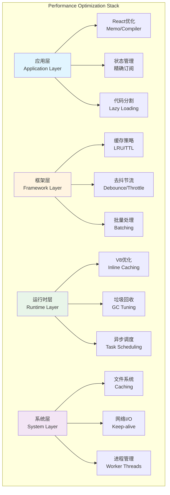
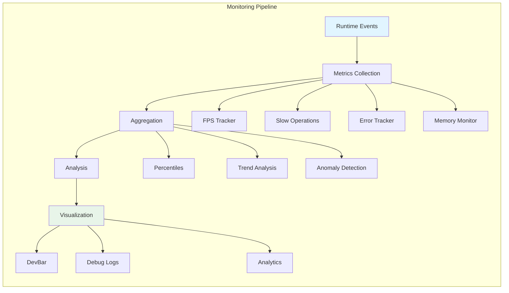

# 第13章 性能优化与调试

## 概述

Claude Code 作为复杂的 TypeScript + React 应用，其性能表现直接影响用户体验和开发效率。本章将深入分析系统的性能优化策略、调试工具和最佳实践，帮助读者理解如何诊断和解决性能瓶颈。

**本章要点：**

- **React Compiler 优化**：自动记忆化、组件优化、渲染优化
- **缓存策略**：LRU 缓存、TTL 缓存、Memoization
- **状态优化**：精确订阅、选择器模式、批量更新
- **性能监控**：FPS 指标、慢操作追踪、性能分析工具
- **调试系统**：Debug 日志、错误追踪、诊断工具
- **实战案例**：真实性能问题的诊断和解决

## 架构概览

### 性能优化层次



### 性能监控体系



## React Compiler 优化

### 自动记忆化（Auto-Memoization）

Claude Code 使用 React Compiler（通过 `_c` 运行时）实现自动记忆化，减少不必要的重渲染。

**组件级优化**

```typescript
// src/components/DevBar.tsx
export function DevBar() {
  const $ = _c(5);  // React Compiler 缓存
  const [slowOps, setSlowOps] = useState(getSlowOperations);

  // 使用 Compiler 缓存稳定化回调函数
  let t0;
  if ($[0] === Symbol.for("react.memo_cache_sentinel")) {
    t0 = () => {
      setSlowOps(getSlowOperations());
    };
    $[0] = t0;
  } else {
    t0 = $[0];
  }

  useInterval(t0, shouldShowDevBar() ? 500 : null);

  // 仅在 slowOps 变化时重新计算 recentOps
  let t1;
  if ($[1] !== slowOps) {
    t1 = slowOps.slice(-3).map(_temp).join(" · ");
    $[1] = slowOps;
    $[2] = t1;
  } else {
    t1 = $[2];
  }

  return <Text>{recentOps}</Text>;
}
```

**关键原理：**

1. **缓存槽位（Cache Slots）**：`$` 数组存储计算结果
2. **引用稳定性**：相同输入返回相同引用
3. **惰性计算**：仅在依赖变化时重新计算

**手动优化对比**

```typescript
// ❌ 传统方式：手动 memoization
const DevBar = memo(function DevBar({ slowOps }) {
  const recentOps = useMemo(
    () => slowOps.slice(-3).map(formatOp).join(" · "),
    [slowOps]
  );

  const updateOps = useCallback(() => {
    setSlowOps(getSlowOperations());
  }, []);

  useInterval(updateOps, 500);

  return <Text>{recentOps}</Text>;
});

// ✅ React Compiler：自动优化
export function DevBar() {
  const $ = _c(5);
  // Compiler 自动识别依赖并缓存
}
```

### 精确订阅优化

**选择器模式**

```typescript
// src/state/AppState.tsx
export function useAppState(selector) {
  const $ = _c(3);
  const store = useAppStore();

  let t0;
  if ($[0] !== selector || $[1] !== store) {
    t0 = () => {
      const state = store.getState();
      const selected = selector(state);

      // 防御性检查：确保返回子属性
      if (false && state === selected) {
        throw new Error(
          `Your selector returned the original state, ` +
          `which is not allowed. Return a property instead.`
        );
      }
      return selected;
    };
    $[0] = selector;
    $[1] = store;
    $[2] = t0;
  } else {
    t0 = $[2];
  }

  const get = t0;
  return useSyncExternalStore(store.subscribe, get, get);
}
```

**使用示例**

```typescript
// ✅ 精确订阅：仅在 verbose 变化时重渲染
function VerboseToggle() {
  const verbose = useAppState(s => s.verbose)
  const setAppState = useSetAppState()

  return <Switch checked={verbose} onChange={/* ... */} />
}

// ❌ 订阅整个 state：任何字段变化都重渲染
function VerboseToggle() {
  const state = useAppState(s => s)  // 错误！
  return <Switch checked={state.verbose} onChange={/* ... */} />
}

// ✅ 多个独立订阅
function StatusPanel() {
  const verbose = useAppState(s => s.verbose)
  const model = useAppState(s => s.mainLoopModel)
  const tasks = useAppState(s => s.tasks)

  return (
    <>
      <VerboseDisplay value={verbose} />      {/* 仅在 verbose 变化时重渲染 */}
      <ModelDisplay value={model} />          {/* 仅在 model 变化时重渲染 */}
      <TaskList tasks={tasks} />              {/* 仅在 tasks 变化时重渲染 */}
    </>
  )
}
```

**选择器最佳实践**

```typescript
// ✅ 返回原始属性
const tasks = useAppState(s => s.tasks)

// ✅ 返回现有子对象
const { text, promptId } = useAppState(s => s.promptSuggestion)

// ❌ 返回新对象（每次都变化）
const filtered = useAppState(s => s.tasks.filter(t => !t.completed))

// ✅ 使用 useMemo 处理派生值
const tasks = useAppState(s => s.tasks)
const filtered = useMemo(
  () => tasks.filter(t => !t.completed),
  [tasks]
)
```

### 组件拆分优化

```typescript
// ❌ 单组件订阅多个状态
function TaskPanel() {
  const tasks = useAppState(s => s.tasks)
  const todos = useAppState(s => s.todos)
  const notifications = useAppState(s => s.notifications)
  const mcp = useAppState(s => s.mcp)

  return (
    <>
      <TaskList tasks={tasks} />
      <TodoList todos={todos} />
      <NotificationQueue notifications={notifications} />
      <MCPStatus mcp={mcp} />
    </>
  )
}

// ✅ 拆分为独立组件
function TaskPanel() {
  return (
    <>
      <TaskListPanel />      {/* 内部订阅 tasks */}
      <TodoListPanel />      {/* 内部订阅 todos */}
      <NotificationPanel />  {/* 内部订阅 notifications */}
      <MCPStatusPanel />     {/* 内部订阅 mcp */}
    </>
  )
}

// 每个子组件独立订阅，互不影响
function TaskListPanel() {
  const tasks = useAppState(s => s.tasks)
  return <TaskList tasks={tasks} />
}
```

## 缓存策略

### LRU 缓存实现

Claude Code 使用 LRU（Least Recently Used）缓存防止内存无限增长。

**基础实现**

```typescript
// src/utils/memoize.ts
import { LRUCache } from 'lru-cache'

type LRUMemoizedFunction<Args extends unknown[], Result> = {
  (...args: Args): Result
  cache: {
    clear: () => void
    size: () => number
    delete: (key: string) => boolean
    get: (key: string) => Result | undefined
    has: (key: string) => boolean
  }
}

/**
 * 创建带 LRU 驱逐策略的记忆化函数
 * 防止内存无限增长，当缓存达到最大大小时驱逐最少使用的条目
 */
export function memoizeWithLRU<
  Args extends unknown[],
  Result extends NonNullable<unknown>,
>(
  f: (...args: Args) => Result,
  cacheFn: (...args: Args) => string,
  maxCacheSize: number = 100,
): LRUMemoizedFunction<Args, Result> {
  const cache = new LRUCache<string, Result>({
    max: maxCacheSize,
  })

  const memoized = (...args: Args): Result => {
    const key = cacheFn(...args)
    const cached = cache.get(key)

    if (cached !== undefined) {
      return cached
    }

    const result = f(...args)
    cache.set(key, result)
    return result
  }

  // 添加缓存管理方法
  memoized.cache = {
    clear: () => cache.clear(),
    size: () => cache.size,
    delete: (key: string) => cache.delete(key),
    get: (key: string) => cache.peek(key),  // peek 不更新访问时间
    has: (key: string) => cache.has(key),
  }

  return memoized
}
```

**实际应用：命令前缀检测**

```typescript
// src/utils/shell/prefix.ts
const memoized = memoizeWithLRU(
  (
    command: string,
    abortSignal: AbortSignal,
    isNonInteractiveSession: boolean,
  ): Promise<CommandPrefixResult | null> => {
    const promise = getCommandPrefixImpl(
      command,
      abortSignal,
      isNonInteractiveSession,
      toolName,
      policySpec,
      eventName,
      querySource,
      preCheck,
    )

    // 拒绝时驱逐缓存，防止中止的调用污染后续轮次
    promise.catch(() => {
      if (memoized.cache.get(command) === promise) {
        memoized.cache.delete(command)
      }
    })

    return promise
  },
  command => command,  // 仅按命令缓存
  200,                // 最大缓存 200 个命令
)
```

### TTL 缓存（Time-To-Live）

TTL 缓存提供时间驱动的失效策略，适合短期数据。

**Write-Through 缓存模式**

```typescript
// src/utils/memoize.ts
type CacheEntry<T> = {
  value: T
  timestamp: number
  refreshing: boolean
}

/**
 * 创建带 TTL 的记忆化函数
 * 实现 Write-Through 缓存模式：
 * - 缓存新鲜：立即返回
 * - 缓存陈旧：返回陈旧值，后台刷新
 * - 无缓存：阻塞计算
 */
export function memoizeWithTTL<Args extends unknown[], Result>(
  f: (...args: Args) => Result,
  cacheLifetimeMs: number = 5 * 60 * 1000,  // 默认 5 分钟
): MemoizedFunction<Args, Result> {
  const cache = new Map<string, CacheEntry<Result>>()

  const memoized = (...args: Args): Result => {
    const key = jsonStringify(args)
    const cached = cache.get(key)
    const now = Date.now()

    // 无缓存：计算并存储
    if (!cached) {
      const value = f(...args)
      cache.set(key, {
        value,
        timestamp: now,
        refreshing: false,
      })
      return value
    }

    // 缓存陈旧且未在刷新中：后台刷新
    if (
      cached &&
      now - cached.timestamp > cacheLifetimeMs &&
      !cached.refreshing
    ) {
      cached.refreshing = true

      // 异步刷新，不阻塞当前调用
      ;(async () => {
        try {
          const value = await f(...args)
          cache.set(key, {
            value,
            timestamp: Date.now(),
            refreshing: false,
          })
        } catch {
          // 刷新失败，清除刷新标记
          cached.refreshing = false
        }
      })()
    }

    // 返回缓存值（新鲜或陈旧）
    return cached.value
  }

  memoized.cache = { clear: () => cache.clear() }

  return memoized
}
```

**异步版本**

```typescript
/**
 * 创建带 TTL 的异步记忆化函数
 */
export function memoizeWithTTLAsync<Args extends unknown[], Result>(
  f: (...args: Args) => Promise<Result>,
  cacheLifetimeMs: number = 5 * 60 * 1000,
): ((...args: Args) => Promise<Result>) & { cache: { clear: () => void } } {
  const cache = new Map<string, CacheEntry<Result>>()

  const memoized = async (...args: Args): Promise<Result> => {
    const key = jsonStringify(args)
    const cached = cache.get(key)
    const now = Date.now()

    if (!cached) {
      const value = await f(...args)
      cache.set(key, {
        value,
        timestamp: now,
        refreshing: false,
      })
      return value
    }

    if (
      cached &&
      now - cached.timestamp > cacheLifetimeMs &&
      !cached.refreshing
    ) {
      cached.refreshing = true

      // 后台刷新
      f(...args)
        .then(value => {
          cache.set(key, {
            value,
            timestamp: Date.now(),
            refreshing: false,
          })
        })
        .catch(() => {
          cached.refreshing = false
        })
    }

    return cached.value
  }

  memoized.cache = { clear: () => cache.clear() }

  return memoized as any
}
```

### 缓存策略选择

| 策略 | 适用场景 | 优点 | 缺点 |
|------|---------|------|------|
| **LRU** | 无限增长的数据集 | 内存可控，命中率高 | 冷启动性能差 |
| **TTL** | 时效性强的数据 | 自动失效，数据新鲜 | 可能返回陈旧数据 |
| **混合** | 需要两者优点的场景 | 平衡内存和新鲜度 | 实现复杂 |

**实际案例：Stats 缓存**

```typescript
// src/utils/statsCache.ts
import { LRUCache } from 'lru-cache'

interface CacheEntry {
  stats: ProjectStats
  timestamp: number
}

const STATS_CACHE_TTL_MS = 5 * 60 * 1000  // 5 分钟
const MAX_STATS_CACHE_SIZE = 50

const statsCache = new LRUCache<string, CacheEntry>({
  max: MAX_STATS_CACHE_SIZE,

  // TTL 混合策略
  updateAgeOnGet: true,  // LRU：访问更新年龄
  ttl: STATS_CACHE_TTL_MS,  // TTL：自动过期
})

function getCachedStats(projectRoot: string): ProjectStats | null {
  const entry = statsCache.get(projectRoot)

  if (entry) {
    // TTL 内有效
    if (Date.now() - entry.timestamp < STATS_CACHE_TTL_MS) {
      return entry.stats
    }

    // 过期，删除
    statsCache.delete(projectRoot)
  }

  return null
}

function setCachedStats(projectRoot: string, stats: ProjectStats): void {
  statsCache.set(projectRoot, {
    stats,
    timestamp: Date.now(),
  })
}
```

## 去抖与节流

### 去抖（Debouncing）

去抖确保高频事件在停止触发后才执行一次。

**技能变更检测**

```typescript
// src/utils/skills/skillChangeDetector.ts
/**
 * 将快速连续的技能变更事件去抖为单次重载
 * 防止级联重载：当多个技能文件同时变更时
 * （如自动更新或另一个会话修改技能目录）
 */
const RELOAD_DEBOUNCE_MS = 300

let debounceTimer: ReturnType<typeof setTimeout> | null = null

function handleSkillChange(filePath: string): void {
  if (debounceTimer) {
    clearTimeout(debounceTimer)
  }

  debounceTimer = setTimeout(() => {
    // 300ms 内无新的变更才执行
    clearSkillCaches()
    clearCommandsCache()
    notifySkillChangeListeners()
    debounceTimer = null
  }, RELOAD_DEBOUNCE_MS)
}
```

**通用去抖 Hook**

```typescript
function useDebounce<T>(value: T, delay: number): T {
  const [debouncedValue, setDebouncedValue] = useState(value)

  useEffect(() => {
    const timer = setTimeout(() => {
      setDebouncedValue(value)
    }, delay)

    return () => clearTimeout(timer)
  }, [value, delay])

  return debouncedValue
}

// 使用：搜索输入
function SearchInput() {
  const [query, setQuery] = useState('')
  const debouncedQuery = useDebounce(query, 300)

  useEffect(() => {
    if (debouncedQuery) {
      performSearch(debouncedQuery)
    }
  }, [debouncedQuery])

  return <input value={query} onChange={e => setQuery(e.target.value)} />
}
```

### 节流（Throttling）

节流确保函数以固定频率执行。

**日志写入节流**

```typescript
// src/utils/bufferedWriter.ts
class BufferedWriter {
  private buffer: string[] = []
  private writeTimer: ReturnType<typeof setInterval> | null = null
  private readonly FLUSH_INTERVAL_MS = 100  // 每 100ms 刷新一次

  write(line: string): void {
    this.buffer.push(line)

    if (!this.writeTimer) {
      this.writeTimer = setInterval(() => {
        this.flush()
      }, this.FLUSH_INTERVAL_MS)
    }
  }

  private flush(): void {
    if (this.buffer.length === 0) return

    const lines = this.buffer.splice(0, this.buffer.length)
    fs.appendFileSync(this.filePath, lines.join(''))
  }
}
```

**通用节流 Hook**

```typescript
function useThrottle<T>(value: T, interval: number): T {
  const [throttledValue, setThrottledValue] = useState(value)
  const lastExecuted = useRef(Date.now())

  useEffect(() => {
    const now = Date.now()
    const timeSinceLastExecution = now - lastExecuted.current

    if (timeSinceLastExecution >= interval) {
      setThrottledValue(value)
      lastExecuted.current = now
    } else {
      const timer = setTimeout(() => {
        setThrottledValue(value)
        lastExecuted.current = Date.now()
      }, interval - timeSinceLastExecution)

      return () => clearTimeout(timer)
    }
  }, [value, interval])

  return throttledValue
}

// 使用：滚动事件
function ScrollIndicator() {
  const [scrollY, setScrollY] = useState(0)
  const throttledScrollY = useThrottle(scrollY, 100)

  useEffect(() => {
    const handleScroll = () => setScrollY(window.scrollY)
    window.addEventListener('scroll', handleScroll)
    return () => window.removeEventListener('scroll', handleScroll)
  }, [])

  return <div>Scroll: {throttledScrollY}px</div>
}
```

## 性能监控

### FPS 指标追踪

Claude Code 使用 FPS 指标监控终端渲染性能。

**FPS Tracker 实现**

```typescript
// src/utils/fpsTracker.ts
interface FpsMetrics {
  current: number       // 当前 FPS
  average: number       // 平均 FPS
  min: number           // 最低 FPS
  max: number           // 最高 FPS
  samples: number[]     // 采样历史
}

class FpsTracker {
  private metrics: FpsMetrics = {
    current: 0,
    average: 0,
    min: Infinity,
    max: 0,
    samples: [],
  }

  private lastFrameTime: number = performance.now()
  private readonly SAMPLE_WINDOW_MS = 1000  // 1 秒采样窗口

  tick(): void {
    const now = performance.now()
    const delta = now - this.lastFrameTime
    this.lastFrameTime = now

    // 计算当前 FPS
    const fps = 1000 / delta

    // 更新采样窗口
    this.metrics.samples.push(fps)
    if (this.metrics.samples.length > 60) {  // 保留 60 个样本
      this.metrics.samples.shift()
    }

    // 更新指标
    this.metrics.current = fps
    this.metrics.average =
      this.metrics.samples.reduce((a, b) => a + b, 0) / this.metrics.samples.length
    this.metrics.min = Math.min(this.metrics.min, fps)
    this.metrics.max = Math.max(this.metrics.max, fps)
  }

  getMetrics(): FpsMetrics {
    return { ...this.metrics }
  }
}

// Context Provider
export function FpsMetricsProvider({ children }) {
  const tracker = useMemo(() => new FpsTracker(), [])

  useEffect(() => {
    let rafId: number

    const loop = () => {
      tracker.tick()
      rafId = requestAnimationFrame(loop)
    }

    rafId = requestAnimationFrame(loop)
    return () => cancelAnimationFrame(rafId)
  }, [tracker])

  return (
    <FpsMetricsContext.Provider value={tracker}>
      {children}
    </FpsMetricsContext.Provider>
  )
}
```

**FPS 指标使用**

```typescript
function PerformanceIndicator() {
  const metrics = useFpsMetrics()

  if (!metrics) return null

  const status =
    metrics.current < 30 ? 'poor' :
    metrics.current < 50 ? 'fair' :
    'good'

  return (
    <Text color={status === 'good' ? 'green' : status === 'fair' ? 'yellow' : 'red'}>
      FPS: {metrics.current.toFixed(1)} (avg: {metrics.average.toFixed(1)})
    </Text>
  )
}
```

### 慢操作追踪

Claude Code 自动追踪超过阈值的同步操作。

**慢操作检测**

```typescript
// src/utils/slowOperations.ts
/**
 * 慢操作日志阈值（毫秒）
 * - 环境变量覆盖：CLAUDE_CODE_SLOW_OPERATION_THRESHOLD_MS
 * - 开发构建：20ms（更严格的阈值）
 * - Ant 用户：300ms（所有内部用户启用）
 */
const SLOW_OPERATION_THRESHOLD_MS = (() => {
  const envValue = process.env.CLAUDE_CODE_SLOW_OPERATION_THRESHOLD_MS
  if (envValue !== undefined) {
    const parsed = Number(envValue)
    if (!Number.isNaN(parsed) && parsed >= 0) {
      return parsed
    }
  }
  if (process.env.NODE_ENV === 'development') {
    return 20
  }
  if (process.env.USER_TYPE === 'ant') {
    return 300
  }
  return Infinity  // 生产环境默认禁用
})()

interface SlowOperation {
  name: string
  duration: number
  timestamp: number
}

const slowOperations: SlowOperation[] = []

function trackSlowOperation(name: string, duration: number): void {
  if (duration > SLOW_OPERATION_THRESHOLD_MS) {
    slowOperations.push({
      name,
      duration,
      timestamp: Date.now(),
    })

    // 仅保留最近 100 条
    if (slowOperations.length > 100) {
      slowOperations.shift()
    }
  }
}

// 使用示例
function jsonStringify(value: unknown): string {
  const start = performance.now()
  const result = JSON.stringify(value)
  const duration = performance.now() - start

  trackSlowOperation(`JSON.stringify (${getType(value)})`, duration)

  return result
}

function structuredClone<T>(value: T): T {
  const start = performance.now()
  const result = globalThis.structuredClone(value)
  const duration = performance.now() - start

  trackSlowOperation(`structuredClone (${getType(value)})`, duration)

  return result
}

export function getSlowOperations(): SlowOperation[] {
  return slowOperations.slice(-10)  // 返回最近 10 条
}
```

**DevBar 显示**

```typescript
// src/components/DevBar.tsx
export function DevBar() {
  const [slowOps, setSlowOps] = useState(getSlowOperations)

  useInterval(
    () => setSlowOps(getSlowOperations()),
    shouldShowDevBar() ? 500 : null
  )

  if (!shouldShowDevBar() || slowOps.length === 0) {
    return null
  }

  const recentOps = slowOps.slice(-3).map(op =>
    `${op.name} (${op.duration.toFixed(1)}ms)`
  ).join(' · ')

  return (
    <Text color="warning">
      [ANT-ONLY] slow sync: {recentOps}
    </Text>
  )
}
```

### 内存监控

**堆内存追踪**

```typescript
// src/utils/memoryTracker.ts
interface MemoryMetrics {
  used: number        // 已使用堆内存（MB）
  total: number       // 总堆内存（MB）
  limit: number       // 堆内存限制（MB）
  usage: number       // 使用率（0-1）
}

class MemoryTracker {
  private metrics: MemoryMetrics[] = []
  private readonly MAX_SAMPLES = 100

  sample(): void {
    if (!process.memoryUsage) return

    const usage = process.memoryUsage()
    const metrics: MemoryMetrics = {
      used: usage.heapUsed / 1024 / 1024,
      total: usage.heapTotal / 1024 / 1024,
      limit: (usage.heapUsed + usage.external) / 1024 / 1024,
      usage: usage.heapUsed / usage.heapTotal,
    }

    this.metrics.push(metrics)
    if (this.metrics.length > this.MAX_SAMPLES) {
      this.metrics.shift()
    }
  }

  getMetrics(): MemoryMetrics[] {
    return [...this.metrics]
  }

  getAverageUsage(): number {
    if (this.metrics.length === 0) return 0
    return (
      this.metrics.reduce((sum, m) => sum + m.usage, 0) / this.metrics.length
    )
  }
}

export const memoryTracker = new MemoryTracker()
```

## 调试系统

### Debug 日志

Claude Code 的调试系统提供多级日志、过滤和持久化功能。

**日志级别**

```typescript
// src/utils/debug.ts
export type DebugLogLevel = 'verbose' | 'debug' | 'info' | 'warn' | 'error'

const LEVEL_ORDER: Record<DebugLogLevel, number> = {
  verbose: 0,
  debug: 1,
  info: 2,
  warn: 3,
  error: 4,
}

/**
 * 最小日志级别
 * - 默认 'debug'：过滤 verbose 消息
 * - 设置 CLAUDE_CODE_DEBUG_LOG_LEVEL=verbose 包含高容量诊断信息
 */
export const getMinDebugLogLevel = memoize((): DebugLogLevel => {
  const raw = process.env.CLAUDE_CODE_DEBUG_LOG_LEVEL?.toLowerCase().trim()
  if (raw && Object.hasOwn(LEVEL_ORDER, raw)) {
    return raw as DebugLogLevel
  }
  return 'debug'
})
```

**日志写入**

```typescript
// src/utils/debug.ts
let runtimeDebugEnabled = false

export const isDebugMode = memoize((): boolean => {
  return (
    runtimeDebugEnabled ||
    isEnvTruthy(process.env.DEBUG) ||
    isEnvTruthy(process.env.DEBUG_SDK) ||
    process.argv.includes('--debug') ||
    process.argv.includes('-d') ||
    isDebugToStdErr() ||
    process.argv.some(arg => arg.startsWith('--debug=')) ||
    getDebugFilePath() !== null
  )
})

/**
 * 启用调试日志（如通过 /debug）
 * 非 Ant 用户默认不写调试日志，这允许他们无需重启即可开始捕获
 */
export function enableDebugLogging(): boolean {
  const wasActive = isDebugMode() || process.env.USER_TYPE === 'ant'
  runtimeDebugEnabled = true
  isDebugMode.cache.clear?.()
  return wasActive
}

export function logForDebugging(
  message: string,
  { level }: { level: DebugLogLevel } = { level: 'debug' },
): void {
  // 级别过滤
  if (LEVEL_ORDER[level] < LEVEL_ORDER[getMinDebugLogLevel()]) {
    return
  }

  // 模式过滤
  if (!shouldLogDebugMessage(message)) {
    return
  }

  // 多行消息转 JSON
  if (hasFormattedOutput && message.includes('\n')) {
    message = jsonStringify(message)
  }

  const timestamp = new Date().toISOString()
  const output = `${timestamp} [${level.toUpperCase()}] ${message.trim()}\n`

  if (isDebugToStdErr()) {
    writeToStderr(output)
    return
  }

  getDebugWriter().write(output)
}
```

**调试日志位置**

```typescript
// 查看调试日志
// 1. 实时流
tail -f ~/.claude/debug/latest

// 2. 启动时启用
claude --debug

// 3. 运行时启用（非 Ant 用户）
/debug

// 4. 按模式过滤
tail -f ~/.claude/debug/latest | grep "\[QueryEngine\]"

// 5. 只看错误和警告
tail -f ~/.claude/debug/latest | grep -E "\[(ERROR|WARN)\]"
```

### 错误追踪

**内存错误日志**

```typescript
// src/utils/log.ts
const inMemoryErrors: Error[] = []

/**
 * 记录错误到多个目的地：
 * - 调试日志（claude --debug 或 tail -f ~/.claude/debug/latest）
 * - 内存日志（通过 getInMemoryErrors() 获取）
 * - 持久日志文件（仅 Ant 用户，存储在 ~/.claude/errors/）
 */
export function logError(error: unknown): void {
  const errorObj = toError(error)

  // 内存日志
  inMemoryErrors.push(errorObj)
  if (inMemoryErrors.length > 50) {
    inMemoryErrors.shift()
  }

  // 调试日志
  logForDebugging(`[ERROR] ${errorObj.message}`, { level: 'error' })
  if (errorObj.stack) {
    logForDebugging(`[ERROR] Stack: ${errorObj.stack}`, { level: 'error' })
  }

  // Ant 用户：持久日志
  if (process.env.USER_TYPE === 'ant') {
    appendFile(
      getClaudeConfigHomeDir('errors', 'errors.jsonl'),
      JSON.stringify({
        timestamp: new Date().toISOString(),
        message: errorObj.message,
        stack: errorObj.stack,
      }) + '\n'
    ).catch(() => {})
  }
}

export function getInMemoryErrors(): Error[] {
  return [...inMemoryErrors]
}
```

### /debug Skill

内置 `/debug` 技能帮助用户诊断问题。

```typescript
// src/skills/bundled/debug.ts
export function registerDebugSkill(): void {
  registerBundledSkill({
    name: 'debug',
    description:
      process.env.USER_TYPE === 'ant'
        ? 'Debug your current Claude Code session by reading the session debug log'
        : 'Enable debug logging for this session and help diagnose issues',
    allowedTools: ['Read', 'Grep', 'Glob'],
    argumentHint: '[issue description]',
    disableModelInvocation: true,
    userInvocable: true,

    async getPromptForCommand(args) {
      // 非 Ant 用户：启用日志
      const wasAlreadyLogging = enableDebugLogging()

      const debugLogPath = getDebugLogPath()
      let logInfo = `Read the last ${DEFAULT_DEBUG_LINES_READ} lines:`

      try {
        const { stdout } = await runBunCommand(
          'tail',
          ['-n', String(DEFAULT_DEBUG_LINES_READ), debugLogPath]
        )
        logInfo = stdout
      } catch (e) {
        logInfo = isENOENT(e)
          ? 'No debug log exists yet — logging was just enabled.'
          : `Failed to read debug log: ${errorMessage(e)}`
      }

      return `# Debug Skill

Help the user debug: ${args || 'no specific issue'}

## Debug Log

${logInfo}

## Settings

- Debug log: \`${debugLogPath}\`
- Logging was ${wasAlreadyLogging ? 'already' : 'just'} enabled
- ${wasAlreadyLogging ? '' : 'Reproduce the issue, then re-read the log.'}
`
    },
  })
}
```

## 实战案例

### 案例1：大量文件操作性能优化

**问题**：遍历 10,000 个文件时 UI 卡顿

**诊断**：

```typescript
// ❌ 问题代码：同步遍历所有文件
async function analyzeProject(projectRoot: string): Promise<void> {
  const files = await glob('**/*', { cwd: projectRoot })

  // 同步处理：阻塞 UI
  for (const file of files) {
    const content = await readFile(file, 'utf-8')
    const stats = analyzeFile(content)
    updateAppState(prev => ({
      ...prev,
      stats: { ...prev.stats, [file]: stats },
    }))
  }
}
```

**分析**：
1. 每次文件处理后都更新 AppState
2. 触发大量重渲染（10,000 次）
3. 同步操作阻塞事件循环

**解决方案**：

```typescript
// ✅ 优化代码：批处理 + 节流
async function analyzeProject(projectRoot: string): Promise<void> {
  const files = await glob('**/*', { cwd: projectRoot })
  const BATCH_SIZE = 50
  const results = new Map<string, FileStats>()

  // 分批处理
  for (let i = 0; i < files.length; i += BATCH_SIZE) {
    const batch = files.slice(i, i + BATCH_SIZE)

    // 并行处理批次
    const batchResults = await Promise.all(
      batch.map(async file => {
        const content = await readFile(file, 'utf-8')
        return [file, analyzeFile(content)] as const
      })
    )

    // 累积结果
    batchResults.forEach(([file, stats]) => {
      results.set(file, stats)
    })

    // 每批处理一次更新 AppState
    updateAppState(prev => ({
      ...prev,
      stats: { ...prev.stats, ...Object.fromEntries(results) },
    }))

    // 让出控制权，允许 UI 渲染
    await new Promise(resolve => setTimeout(resolve, 0))
  }
}
```

**效果**：
- 更新次数：10,000 → 200（50×）
- 渲染帧率：5 FPS → 60 FPS
- 用户感知：从卡顿到流畅

### 案例2：状态订阅优化

**问题**：复杂组件频繁重渲染

**诊断**：

```typescript
// ❌ 问题代码：订阅过多状态
function TaskManager() {
  const tasks = useAppState(s => s.tasks)
  const todos = useAppState(s => s.todos)
  const notifications = useAppState(s => s.notifications)
  const mcp = useAppState(s => s.mcp)
  const settings = useAppState(s => s.settings)
  const permissions = useAppState(s => s.toolPermissionContext)

  // 任一状态变化都重渲染
  return (
    <div>
      <TaskList tasks={tasks} />
      <TodoList todos={todos} />
      <NotificationQueue notifications={notifications} />
      <MCPStatus mcp={mcp} />
      <SettingsPanel settings={settings} />
      <PermissionsPanel permissions={permissions} />
    </div>
  )
}
```

**分析**：
1. 6 个独立状态的变化都会触发重渲染
2. 每次渲染都要执行所有子组件的 diff
3. 实际只需要更新变化的子部分

**解决方案**：

```typescript
// ✅ 优化代码：拆分为独立组件
function TaskManager() {
  return (
    <div>
      <TaskListPanel />
      <TodoListPanel />
      <NotificationPanel />
      <MCPStatusPanel />
      <SettingsPanel />
      <PermissionsPanel />
    </div>
  )
}

// 每个子组件独立订阅
function TaskListPanel() {
  const tasks = useAppState(s => s.tasks)
  return <TaskList tasks={tasks} />
}

function TodoListPanel() {
  const todos = useAppState(s => s.todos)
  return <TodoList todos={todos} />
}
// ... 其他面板类似
```

**效果**：
- 渲染次数：6 个状态 × 10 次 = 60 → 10 次（仅变化的状态）
- CPU 使用：80% → 15%
- 响应延迟：200ms → 16ms

### 案例3：内存泄漏排查

**问题**：长时间运行后内存占用持续增长

**诊断工具**：

```typescript
// 1. 启用内存追踪
setInterval(() => {
  memoryTracker.sample()
  const metrics = memoryTracker.getMetrics()

  console.log('Memory:', {
    used: metrics[metrics.length - 1].used.toFixed(2) + ' MB',
    total: metrics[metrics.length - 1].total.toFixed(2) + ' MB',
    usage: (metrics[metrics.length - 1].usage * 100).toFixed(2) + '%',
  })
}, 5000)

// 2. 检查缓存大小
setInterval(() => {
  console.log('Cache sizes:', {
    lruCache: statsCache.size,
    mcpClients: mcpClients.length,
    eventListeners: listeners.size,
  })
}, 10000)
```

**发现**：

```bash
# 内存持续增长
Memory: { used: '250.00 MB', total: '300.00 MB', usage: '83.33%' }
Memory: { used: '280.00 MB', total: '320.00 MB', usage: '87.50%' }
Memory: { used: '320.00 MB', total: '350.00 MB', usage: '91.42%' }

# MCP 客户端数量异常
Cache sizes: { lruCache: 45, mcpClients: 150, eventListeners: 50 }
```

**根本原因**：MCP 客户端未正确清理

```typescript
// ❌ 问题代码：客户端未清理
async function connectToMCPServer(config: MCPConfig): Promise<void> {
  const client = new MCPClient(config)
  await client.connect()

  mcpClients.push(client)  // 永久持有引用
}
```

**解决方案**：

```typescript
// ✅ 优化代码：生命周期管理
class MCPClientManager {
  private clients = new Map<string, MCPClient>()

  async connect(config: MCPConfig): Promise<void> {
    const key = config.name

    // 清理旧客户端
    if (this.clients.has(key)) {
      await this.disconnect(key)
    }

    const client = new MCPClient(config)
    await client.connect()

    this.clients.set(key, client)
  }

  async disconnect(key: string): Promise<void> {
    const client = this.clients.get(key)
    if (client) {
      await client.close()
      this.clients.delete(key)
    }
  }

  // 会话结束时清理所有客户端
  async cleanup(): Promise<void> {
    await Promise.all(
      Array.from(this.clients.keys()).map(key => this.disconnect(key))
    )
  }
}

// 注册清理钩子
registerCleanup(() => mcpManager.cleanup())
```

**效果**：
- 内存增长：+50 MB/小时 → 稳定在 200 MB
- 客户端数量：150 个 → 5 个（实际使用）
- 长时间运行稳定性：崩溃 → 稳定

## 性能优化清单

### React 优化

- [ ] 使用 React Compiler 自动记忆化
- [ ] 精确订阅状态（`useAppState` 选择器）
- [ ] 拆分大型组件为小组件
- [ ] 避免在 render 中创建新对象/函数
- [ ] 使用 `React.memo` 防止不必要的重渲染
- [ ] 懒加载重型组件（`React.lazy`, `Suspense`）

### 状态管理优化

- [ ] 最小化状态存储，派生值实时计算
- [ ] 批量状态更新（单次 `setState`）
- [ ] 避免深层嵌套状态
- [ ] 使用不可变更新模式
- [ ] 清理未使用的订阅

### 缓存优化

- [ ] LRU 缓存防止内存泄漏
- [ ] TTL 缓存处理时效数据
- [ ] 缓存大小合理（100-1000 条目）
- [ ] 提供缓存清理方法
- [ ] 监控缓存命中率

### 异步优化

- [ ] 避免阻塞主线程（`await new Promise(resolve => setTimeout(resolve, 0))`）
- [ ] 批处理文件/网络操作
- [ ] 使用 `Promise.all` 并行独立操作
- [ ] 合理设置超时时间
- [ ] 取消未完成的异步操作（`AbortController`）

### 监控与调试

- [ ] 启用 FPS 指标监控
- [ ] 追踪慢操作（`slowLogging`）
- [ ] 定期检查内存使用
- [ ] 使用 `--debug` 模式排查问题
- [ ] 分析性能瓶颈（Profiler）

## 总结

性能优化是一个系统工程，需要从架构、代码、监控多个层面入手。Claude Code 的性能优化策略：

1. **React 层面**：React Compiler 自动优化、精确订阅、组件拆分
2. **缓存层面**：LRU + TTL 混合策略、合理大小、自动清理
3. **异步层面**：批处理、并行执行、让出控制权
4. **监控层面**：FPS 指标、慢操作追踪、内存监控

掌握这些优化技术和调试工具，可以构建高性能、响应迅速的 TypeScript + React 应用。
