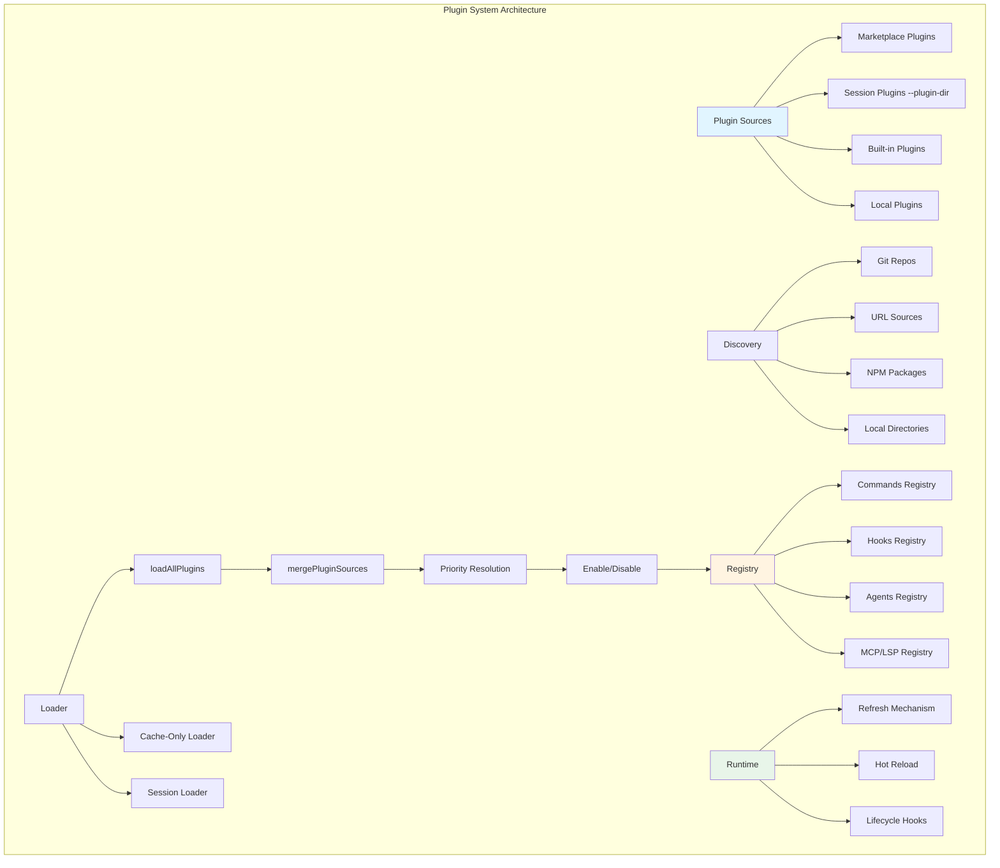

# 第15章 插件系统与扩展

## 概述

Claude Code 的插件系统是其最具扩展性的特性之一，允许开发者通过插件、Skills 和 Marketplace 扩展核心功能。本章将深入分析插件系统的架构设计、发现机制、加载流程和生命周期管理。

**本章要点：**

- **插件架构**：插件类型、目录结构、元数据定义
- **发现机制**：Marketplace、本地插件、内置插件
- **加载流程**：loadAllPlugins、缓存策略、依赖解析
- **生命周期管理**：初始化、热重载、清理
- **Skills 系统**：命令扩展、自定义技能
- **Marketplace 集成**：源管理、版本控制、自动更新

## 架构概览

### 插件系统架构



### 插件类型

```typescript
// src/types/plugin.ts
export type LoadedPlugin = {
  // === 元数据 ===
  name: string                      // 插件名称
  manifest: PluginManifest          // 插件清单
  path: string                      // 插件路径（内置插件为特殊标记）
  source: string                    // 来源标识（如 "git:repo" 或 ".claude-plugin/name"）
  repository: string                // 向后兼容的仓库字段

  // === 状态 ===
  enabled: boolean                 // 是否启用

  // === 扩展组件 ===
  commands?: Command[]              // 自定义命令
  hooksConfig?: HooksConfig         // Hooks 配置
  agents?: AgentDefinition[]        // 代理定义
  mcpServers?: MCPServersConfig     // MCP 服务器配置
  lspServers?: LSPServersConfig     // LSP 服务器配置

  // === 特殊标记 ===
  isBuiltin?: boolean               // 是否内置插件
}

export type PluginManifest = {
  name: string                      // 插件名称
  description?: string               // 插件描述
  version?: string                   // 版本号
  author?: string                   // 作者
  license?: string                  // 许可证
  homepage?: string                  // 主页
  repository?: string                // 仓库地址
}
```

## 插件发现机制

### Marketplace 插件

Marketplace 是插件的主要来源，支持多种源类型。

**源类型定义**

```typescript
// src/utils/plugins/marketplaceManager.ts
export type MarketplaceSource =
  | { type: 'url'; url: string }                    // URL 源
  | { type: 'github'; owner: string; repo: string }  // GitHub 仓库
  | { type: 'git'; url: string }                     // Git 仓库
  | { type: 'file'; path: string }                   // 本地文件
  | { type: 'npm'; package: string }                 // NPM 包（未实现）

export type Marketplace = {
  name: string                      // Marketplace 名称
  displayName?: string              // 显示名称
  description?: string               // 描述
  source: MarketplaceSource          // 源配置
  lastUpdated?: number               // 最后更新时间
  plugins: MarketplacedPlugin[]     // 插件列表
}

export type MarketplacedPlugin = {
  name: string                      // 插件名称
  description?: string               // 描述
  version?: string                   // 版本要求
  path?: string                     // 插件路径（相对于 marketplace 根目录）
  schemaVersion?: number             // Schema 版本
  settings?: Record<string, unknown> // 默认设置
}
```

**加载 Marketplace**

```typescript
// src/utils/plugins/marketplaceManager.ts
export async function loadMarketplace(
  name: string,
  source: MarketplaceSource,
  options?: { onProgress?: MarketplaceProgressCallback }
): Promise<Marketplace> {
  // 1. 根据 source 类型加载
  let marketplace: Marketplace

  switch (source.type) {
    case 'url':
      marketplace = await loadFromURL(source.url)
      break

    case 'github':
      marketplace = await loadFromGitHub(source.owner, source.repo)
      break

    case 'git':
      marketplace = await loadFromGit(source.url)
      break

    case 'file':
      marketplace = await loadFromFile(source.path)
      break

    case 'npm':
      throw new Error('NPM source not yet implemented')
  }

  // 2. 验证 marketplace schema
  validateMarketplaceSchema(marketplace)

  // 3. 缓存到本地
  const cachePath = getMarketplaceCachePath(name)
  await cacheMarketplace(marketplace, cachePath)

  // 4. 更新时间戳
  marketplace.lastUpdated = Date.now()

  return marketplace
}

async function loadFromGitHub(owner: string, repo: string): Promise<Marketplace> {
  const repoUrl = `https://github.com/${owner}/${repo}`
  const cacheDir = getMarketplaceCacheDir(`${owner}-${repo}`)

  // 克隆或更新仓库
  await ensureRepoCloned(repoUrl, cacheDir)

  // 读取 marketplace.json
  const manifestPath = join(cacheDir, '.claude-plugin', 'marketplace.json')
  const marketplace = JSON.parse(await readFile(manifestPath, 'utf-8'))

  return marketplace
}

async function loadFromURL(url: string): Promise<Marketplace> {
  // 直接下载 marketplace.json
  const response = await fetch(url)
  if (!response.ok) {
    throw new Error(`Failed to load marketplace from URL: ${response.statusText}`)
  }

  const marketplace = await response.json()

  // 验证 schema
  validateMarketplaceSchema(marketplace)

  return marketplace
}
```

### 本地插件

从本地文件系统发现插件。

```typescript
// src/utils/plugins/pluginLoader.ts
async function loadSessionOnlyPlugins(
  inlinePlugins: InlinePlugin[]
): Promise<{
  plugins: LoadedPlugin[]
  errors: PluginError[]
}> {
  const plugins: LoadedPlugin[] = []
  const errors: PluginError[] = []

  for (const inlinePlugin of inlinePlugins) {
    try {
      const pluginPath = inlinePlugin.path

      // 加载插件清单
      const manifestPath = join(pluginPath, '.claude-plugin', 'plugin.json')
      const manifest = await loadPluginManifest(manifestPath, inlinePlugin.name, 'session')

      // 创建插件对象
      const plugin: LoadedPlugin = {
        name: manifest.name,
        manifest,
        path: pluginPath,
        source: 'session',
        repository: 'session',
        enabled: true,  // Session 插件默认启用
      }

      plugins.push(plugin)
    } catch (error) {
      errors.push({
        plugin: inlinePlugin.name,
        error: errorMessage(error),
        source: 'session',
      })
    }
  }

  return { plugins, errors }
}
```

### 内置插件

随 CLI 分发的插件。

```typescript
// src/plugins/builtinPlugins.ts
const BUILTIN_PLUGINS: Record<
  string,
  {
    description: string
    version?: string
    defaultEnabled?: boolean
    isAvailable?: () => boolean
    hooks?: HooksConfig
    mcpServers?: MCPServersConfig
  }
> = {
  anthropicOfficial: {
    description: 'Official Anthropic plugins',
    version: '1.0.0',
    defaultEnabled: true,
    hooks: {
      PreToolUse: [
        {
          pattern: 'Bash',
          enabled: true,
          hooks: [
            {
              pattern: 'npm install|npm rebuild',
              enabled: true,
              description: 'Wait for package.json to be saved',
              execute: async ({ input, hookArgs }) => {
                const { waitForFileChange } = await import('../utils/fileChanged.js')
                await waitForFileChange(join(getOriginalCwd(), 'package.json'), 3000)
              },
            },
          ],
        },
      ],
    },
  },

  memoryKernel: {
    description: 'Memory and auto-memorization features',
    defaultEnabled: false,
    isAvailable: () => feature('MEMORY_KERNEL_ENABLED'),
    hooks: {
      Stop: [
        {
          pattern: '*',
          enabled: true,
          hooks: [
            {
              pattern: '*',
              enabled: true,
              description: 'Extract memories from conversation',
              execute: async extractMemories,
            },
          ],
        },
      ],
    },
  },
}

function getBuiltinPlugins(): {
  enabled: LoadedPlugin[]
  disabled: LoadedPlugin[]
} {
  const settings = getSettings_DEPRECATED()
  const enabled: LoadedPlugin[] = []
  const disabled: LoadedPlugin[] = []

  for (const [name, definition] of BUILTIN_PLUGINS) {
    if (definition.isAvailable && !definition.isAvailable()) {
      continue
    }

    const pluginId = `${name}@builtin`
    const userSetting = settings?.enabledPlugins?.[pluginId]

    // 用户偏好 > 插件默认 > true
    const isEnabled =
      userSetting !== undefined
        ? userSetting === true
        : (definition.defaultEnabled ?? true)

    const plugin: LoadedPlugin = {
      name,
      manifest: {
        name,
        description: definition.description,
        version: definition.version,
      },
      path: BUILTIN_MARKETPLACE_NAME,
      source: pluginId,
      repository: pluginId,
      enabled: isEnabled,
      isBuiltin: true,
      hooksConfig: definition.hooks,
      mcpServers: definition.mcpServers,
    }

    if (isEnabled) {
      enabled.push(plugin)
    } else {
      disabled.push(plugin)
    }
  }

  return { enabled, disabled }
}
```

## 加载流程

### loadAllPlugins 主流程

```typescript
// src/utils/plugins/pluginLoader.ts
export const loadAllPlugins = memoize(async (): Promise<PluginLoadResult> => {
  const result = await assemblePluginLoadResult(() =>
    loadPluginsFromMarketplaces({ cacheOnly: false })
  )

  return result
})

export const loadAllPluginsCacheOnly = memoize(async (): Promise<PluginLoadResult> => {
  const result = await assemblePluginLoadResult(() =>
    loadPluginsFromMarketplaces({ cacheOnly: true })
  )

  return result
})

async function assemblePluginLoadResult(
  marketplaceLoader: () => Promise<{
    plugins: LoadedPlugin[]
    errors: PluginError[]
  }>
): Promise<PluginLoadResult> {
  // 1. 并行加载 marketplace 插件和 session 插件
  const inlinePlugins = getInlinePlugins()
  const [marketplaceResult, sessionResult] = await Promise.all([
    marketplaceLoader(),
    inlinePlugins.length > 0
      ? loadSessionOnlyPlugins(inlinePlugins)
      : Promise.resolve({ plugins: [], errors: [] }),
  ])

  // 2. 加载内置插件
  const builtinResult = getBuiltinPlugins()

  // 3. 合并所有插件源
  const { plugins: allPlugins, errors: mergeErrors } = mergePluginSources({
    session: sessionResult.plugins,
    marketplace: marketplaceResult.plugins,
    builtin: [...builtinResult.enabled, ...builtinResult.disabled],
    managedNames: getManagedPluginNames(),
  })

  const allErrors = [
    ...marketplaceResult.errors,
    ...sessionResult.errors,
    ...mergeErrors,
  ]

  // 4. 验证并降级插件
  const { enabled, disabled } = await verifyAndDemotePlugins(allPlugins)

  // 5. 缓存插件设置
  await cachePluginSettings(enabled)

  return {
    enabled,
    disabled,
    errors: allErrors,
  }
}
```

### 插件合并策略

```typescript
// src/utils/plugins/pluginLoader.ts
async function mergePluginSources(sources: {
  session: LoadedPlugin[]
  marketplace: LoadedPlugin[]
  builtin: LoadedPlugin[]
  managedNames: Set<string>
}): Promise<{
  plugins: LoadedPlugin[]
  errors: PluginError[]
}> {
  const plugins: LoadedPlugin[] = []
  const errors: PluginError[] = []

  // 按名称索引所有插件
  const index = new Map<string, LoadedPlugin[]>()

  // 索引 session 插件
  for (const plugin of sources.session) {
    addToIndex(index, 'session', plugin)
  }

  // 索引 marketplace 插件
  for (const plugin of sources.marketplace) {
    addToIndex(index, 'marketplace', plugin)
  }

  // 索引内置插件
  for (const plugin of sources.builtin) {
    addToIndex(index, 'builtin', plugin)
  }

  // 解决冲突
  for (const [name, variants] of index) {
    const selected = selectPluginVariant(name, variants, sources.managedNames)

    if (selected) {
      plugins.push(selected.plugin)
    } else {
      // 记录冲突错误
      errors.push({
        plugin: name,
        error: `Plugin conflict: multiple variants with no clear priority`,
        source: 'merge',
      })
    }
  }

  return { plugins, errors }
}

function selectPluginVariant(
  name: string,
  variants: LoadedPlugin[],
  managedNames: Set<string>
): { plugin: LoadedPlugin; source: string } | null {
  // 优先级：
  // 1. Session 插件（--plugin-dir）
  // 2. Marketplace 插件
  // 3. 内置插件

  const sessionVariant = variants.find(v => v.source === 'session')
  const marketplaceVariant = variants.find(v => v.source.startsWith('marketplace'))
  const builtinVariant = variants.find(v => v.isBuiltin)

  // 检查 managed 锁定
  if (managedNames.has(name)) {
    // Managed 插件不能被 session 插件覆盖
    if (sessionVariant) {
      return marketplaceVariant || builtinVariant || null
    }
  }

  return (
    sessionVariant ||
    marketplaceVariant ||
    builtinVariant ||
    null
  )
}
```

### 缓存策略

**三级缓存**

```typescript
// 1. 内存缓存（最快）
const inMemoryCache = new Map<string, LoadedPlugin[]>()

// 2. 磁盘缓存（已安装插件）
// ~/.claude/plugins/installed_plugins.json
const installedPluginsPath = getInstalledPluginsPath()

// 3. Marketplace 缓存
// ~/.claude/plugins/marketplaces/
const marketplaceCacheDir = getMarketplaceCacheDir()

async function loadPluginsFromMarketplaces({
  cacheOnly,
}: {
  cacheOnly: boolean
}): Promise<{
  plugins: LoadedPlugin[]
  errors: PluginError[]
}> {
  const settings = getSettings_DEPRECATED()
  const enabledPlugins = {
    ...getAddDirEnabledPlugins(),
    ...(settings.enabledPlugins || {}),
  }

  // 获取所有 marketplace
  const marketplaceNames = Object.keys(enabledPlugins)
  const uniqueMarketplaces = [...new Set(marketplaceNames)]

  // 并行加载所有 marketplace catalogs
  const marketplaceCatalogs = new Map<string, Awaited<Marketplace>>()
  await Promise.all(
    [...uniqueMarketplaces].map(async name => {
      marketplaceCatalogs.set(name, await getMarketplaceCacheOnly(name))
    })
  )

  // 加载每个 marketplace 的插件
  const plugins: LoadedPlugin[] = []
  const errors: PluginError[] = []

  for (const [marketplaceName, marketplace] of marketplaceCatalogs) {
    for (const pluginDef of marketplace.plugins) {
      try {
        // 从已安装路径加载（cache-only）
        const plugin = await loadPluginFromMarketplace(
          marketplaceName,
          pluginDef,
          cacheOnly
        )

        if (plugin) {
          plugins.push(plugin)
        }
      } catch (error) {
        errors.push({
          plugin: pluginDef.name,
          error: errorMessage(error),
          source: marketplaceName,
        })
      }
    }
  }

  return { plugins, errors }
}

async function getMarketplaceCacheOnly(name: string): Promise<Marketplace> {
  // 检查缓存
  const cachePath = join(getMarketplaceCacheDir(), `${name}.json`)

  try {
    const cached = JSON.parse(await readFile(cachePath, 'utf-8'))
    return cached
  } catch {
    throw new Error(`Marketplace cache not found: ${name}`)
  }
}
```

## 生命周期管理

### 初始化流程

```typescript
// src/hooks/useManagePlugins.ts
export function useManagePlugins(): PluginManagementResult {
  const { addNotification } = useNotifications()
  const setAppState = useSetAppState()

  // 初始插件加载
  const initialPluginLoad = useCallback(async () => {
    try {
      // 加载所有插件
      const { enabled, disabled, errors } = await loadAllPlugins()

      // 检测并卸载已删除的插件
      await detectAndUninstallDelistedPlugins()

      // 检测标记的插件
      const flaggedPlugins = await getFlaggedPlugins(enabled)

      // 加载插件组件
      const [commands, agents, hooks] = await Promise.all([
        getPluginCommands(),
        loadPluginAgents(enabled),
        loadPluginHooks(),
      ])

      // 更新 AppState
      setAppState(prev => ({
        ...prev,
        plugins: {
          enabled,
          disabled,
          commands,
          errors: mergePluginErrors(prev.plugins.errors, errors),
          needsRefresh: false,
        },
        agentDefinitions: agents,
      }))

      // 显示标记的插件通知
      for (const flagged of flaggedPlugins) {
        addNotification({
          type: 'warning',
          title: 'Flagged Plugin',
          message: flagged.reason,
        })
      }

    } catch (error) {
      addNotification({
        type: 'error',
        title: 'Plugin Load Failed',
        message: errorMessage(error),
      })
    }
  }, [setAppState, addNotification])

  // 组件挂载时执行一次
  useEffect(() => {
    initialPluginLoad()
  }, [initialPluginLoad])

  return {
    enabled: useAppState(s => s.plugins.enabled),
    disabled: useAppState(s => s.plugins.disabled),
    errors: useAppState(s => s.plugins.errors),
    needsRefresh: useAppState(s => s.plugins.needsRefresh),
    refresh: () => refreshActivePlugins(setAppState),
  }
}
```

### 热重载机制

**文件监听**

```typescript
// src/utils/skills/skillChangeDetector.ts
export async function initialize(): Promise<void> {
  if (initialized || disposed) return
  initialized = true

  // 获取监听路径
  const paths = await getWatchPaths()

  // 创建文件监听器
  watcher = chokidar.watch(paths, {
    persistent: true,
    ignoreInitial: true,
    depth: 2,  // Skills 使用 skill-name/SKILL.md 格式
    awaitWriteFinish: {
      stabilityThreshold: FILE_STABILITY_THRESHOLD_MS,
      pollInterval: FILE_STABILITY_POLL_INTERVAL_MS,
    },
    ignored: (path, stats) => {
      // 忽略 .git 目录
      return path.split(platformPath.sep).some(dir => dir === '.git')
    },
  })

  // 监听文件变化
  watcher.on('all', (event, path) => {
    if (path) {
      handleChange(path)
    }
  })

  logForDebugging(`Skill change detector initialized for ${paths.length} paths`)
}

function handleChange(path: string): void {
  logForDebugging(`Detected skill change: ${path}`)

  // 添加到待处理队列
  pendingChangedPaths.add(path)

  // 调度重载（去抖）
  scheduleReload(path)
}
```

**去抖重载**

```typescript
const RELOAD_DEBOUNCE_MS = 300  // 300ms 去抖

let reloadTimer: ReturnType<typeof setTimeout> | null = null
const pendingChangedPaths = new Set<string>()

function scheduleReload(_path: string): void {
  if (reloadTimer) {
    clearTimeout(reloadTimer)
  }

  reloadTimer = setTimeout(async () => {
    const paths = Array.from(pendingChangedPaths)
    pendingChangedPaths.clear()
    reloadTimer = null

    logForDebugging(`Reloading skills after changes: ${paths.join(', ')}`)

    // 执行 ConfigChange hooks
    const results = await executeConfigChangeHooks('skills', paths[0]!)

    if (hasBlockingResult(results)) {
      logForDebugging(`ConfigChange hook blocked skill reload (${paths.length} paths)`)
      return
    }

    // 清除缓存
    clearSkillCaches()
    clearCommandsCache()
    resetSentSkillNames()

    // 通知监听器
    skillsChanged.emit()
  }, RELOAD_DEBOUNCE_MS)
}
```

### 刷新机制

```typescript
// src/utils/plugins/refresh.ts
export async function refreshActivePlugins(
  setAppState: SetAppState,
): Promise<RefreshActivePluginsResult> {
  logForDebugging('refreshActivePlugins called')

  // 1. 清除所有插件缓存
  clearAllCaches()

  // 2. 加载插件
  const { enabled, disabled } = await loadAllPlugins()

  // 3. 加载组件
  const errors: PluginError[] = []
  const pluginCommands = await getPluginCommands()
  const agentDefinitions = await loadPluginAgents(enabled)
  const mcpCounts = await Promise.all(
    enabled.map(async p => {
      const servers = await loadPluginMcpServers(p, errors)
      if (servers) p.mcpServers = servers
      return servers ? Object.keys(servers).length : 0
    })
  )
  const mcp_count = mcpCounts.reduce((sum, n) => sum + n, 0)

  // 4. 更新 AppState
  setAppState(prev => ({
    ...prev,
    plugins: {
      ...prev.plugins,
      enabled,
      disabled,
      commands: pluginCommands,
      errors: mergePluginErrors(prev.plugins.errors, errors),
      needsRefresh: false,
    },
    agentDefinitions,
    mcp: {
      ...prev.mcp,
      pluginReconnectKey: prev.mcp.pluginReconnectKey + 1,  // 触发 MCP 重连
    },
  }))

  // 5. 加载 hooks
  try {
    await loadPluginHooks()
  } catch (e) {
    logError(e)
    logForDebugging(`refreshActivePlugins: loadPluginHooks failed: ${errorMessage(e)}`)
  }

  // 6. 返回统计信息
  return {
    plugin_count: enabled.length,
    command_count: pluginCommands.length,
    agent_count: agentDefinitions.allAgents.length,
    hook_count: enabled.reduce((sum, p) => sum + (p.hooksConfig ? 1 : 0), 0),
    mcp_count,
  }
}
```

## Skills 系统

### Skills 发现

```typescript
// src/skills/loadSkillsDir.ts
export const getSkillDirCommands = memoize(
  async (cwd: string): Promise<Command[]> => {
    // 1. 用户技能目录
    const userSkillsDir = join(getClaudeConfigHomeDir(), 'skills')

    // 2. 托管技能目录
    const managedSkillsDir = join(getManagedFilePath(), '.claude', 'skills')

    // 3. 项目技能目录
    const projectSkillsDirs = getProjectSkillsDirs(cwd)

    // 4. 额外技能目录（--add-dir）
    const additionalDirs = getAdditionalDirectoriesForClaudeMd()

    // 5. 遗留命令目录
    const commandsDir = join(cwd, 'commands')

    // 并行加载所有技能
    const [
      managedSkills,
      userSkills,
      projectSkills,
      additionalSkills,
      legacyCommands,
    ] = await Promise.all([
      loadSkillsFromSkillsDir(managedSkillsDir, 'policySettings'),
      loadSkillsFromSkillsDir(userSkillsDir, 'userSettings'),
      ...projectSkills.map(dir => loadSkillsFromSkillsDir(dir, 'projectSettings')),
      ...additionalDirs.map(dir =>
        loadSkillsFromSkillsDir(join(dir, '.claude', 'skills'), 'projectSettings')
      ),
      loadSkillsFromCommandsDir(commandsDir),
    ])

    // 合并所有技能
    const allSkills = [
      ...managedSkills,
      ...userSkills,
      ...projectSkills.flat(),
      ...additionalSkills.flat(),
      ...legacyCommands,
    ]

    return allSkills
  }
)
```

### Skill 结构

```typescript
// 技能目录结构
my-skill/
├── SKILL.md              # 技能定义（必需）
├── README.md             # 文档（可选）
└── tools/               # 工具定义（可选）
    └── custom-tool.ts

// SKILL.md 格式
---
name: my_skill
description: My custom skill for specific task
userInvocable: true  # 用户可调用
enabled: true         # 是否启用
---

## Skill Description

This skill provides custom functionality for...

### Usage

Simply type \`/my-skill\` in the chat to invoke this skill.

### Parameters

- \`param1\`: Description of parameter 1
- \`param2\`: Description of parameter 2
```

### 加载 Skill

```typescript
async function loadSkillsFromSkillsDir(
  skillsDir: string,
  source: 'policySettings' | 'userSettings' | 'projectSettings'
): Promise<Command[]> {
  const skills: Command[] = []

  try {
    const entries = await readdir(skillsDir, { withFileTypes: true })

    for (const entry of entries) {
      if (entry.isDirectory()) {
        // 目录格式：skill-name/SKILL.md
        const skillPath = join(entry.name, 'SKILL.md')
        const skill = await loadSkillFromMarkdown(skillPath, source)
        if (skill) skills.push(skill)
      } else if (entry.isFile() && entry.name.endsWith('.md')) {
        // 单文件格式：直接读取 .md 文件
        const skill = await loadSkillFromMarkdown(
          join(skillsDir, entry.name),
          source
        )
        if (skill) skills.push(skill)
      }
    }
  } catch (error) {
    logForDebugging(`Failed to load skills from ${skillsDir}: ${errorMessage(error)}`)
  }

  return skills
}
```

## Marketplace 集成

### 添加 Marketplace

```typescript
// src/commands/plugin/AddMarketplace.tsx
export async function addMarketplaceSource(
  source: MarketplaceSource,
  onProgress?: MarketplaceProgressCallback
): Promise<{
  name: string
  pluginCount: number
}> {
  // 1. 验证 source 格式
  const validatedSource = validateMarketplaceSource(source)

  // 2. 加载 marketplace
  const marketplace = await loadMarketplace(
    validatedSource.name,
    validatedSource,
    { onProgress }
  )

  // 3. 添加到已知 marketplaces
  await addMarketplaceToConfig(marketplace)

  // 4. 清除缓存
  clearMarketplacesCache()

  return {
    name: marketplace.name,
    pluginCount: marketplace.plugins.length,
  }
}

// 使用示例
await addMarketplaceSource(
  {
    type: 'github',
    owner: 'anthropics',
    repo: 'claude-code-marketplace',
  },
  (event) => {
    console.log(`[${event.type}] ${event.name}: ${event.progress || ''}`)
  }
)
```

### 自动更新

```typescript
// src/utils/plugins/pluginAutoupdate.ts
export async function performBackgroundPluginInstallations(
  setAppState: SetAppState,
): Promise<void> {
  // 1. 计算差异
  const declared = getDeclaredMarketplaces()
  const materialized = await loadKnownMarketplacesConfig()
  const diff = diffMarketplaces(declared, materialized)

  const pendingNames = [
    ...diff.missing,
    ...diff.sourceChanged.map(c => c.name),
  ]

  // 2. 初始化 AppState
  setAppState(prev => ({
    ...prev,
    plugins: {
      ...prev.plugins,
      installationStatus: {
        marketplaces: pendingNames.map(name => ({
          name,
          status: 'pending',
        })),
        plugins: [],
      },
    },
  }))

  // 3. 协调并安装
  const result = await reconcileMarketplaces({
    onProgress: event => {
      switch (event.type) {
        case 'installing':
          updateMarketplaceStatus(setAppState, event.name, 'installing')
          break
        case 'installed':
          updateMarketplaceStatus(setAppState, event.name, 'installed')
          break
        case 'failed':
          updateMarketplaceStatus(setAppState, event.name, 'failed', event.error)
          break
      }
    },
  })

  // 4. 新安装的 marketplaces 自动刷新插件
  if (result.installed.length > 0) {
    clearMarketplacesCache()
    logForDebugging(`Auto-refreshing plugins after ${result.installed.length} new marketplace(s) installed`)

    // 交互模式：自动刷新
    if (!isNonInteractiveSession()) {
      await refreshActivePlugins(setAppState)
    }
  }
}
```

## 最佳实践

### 插件开发建议

1. **明确职责**：每个插件专注单一功能领域
2. **版本管理**：使用语义化版本号
3. **文档完整**：README、示例、使用说明
4. **错误处理**：优雅降级，清晰的错误消息
5. **性能优化**：避免阻塞操作，使用缓存

### Marketplace 设计建议

1. **精选质量**：只包含高质量插件
2. **版本兼容**：明确版本要求
3. **依赖声明**：列出所有依赖
4. **定期更新**：保持插件最新

### Skills 开发建议

1. **简洁描述**：清晰说明技能功能
2. **合理命名**：使用易记的命令名称
3. **用户可控**：用户可禁用不需要的技能
4. **热重载友好**：支持文件监听

## 总结

Claude Code 的插件系统提供了强大的扩展能力：

1. **多源支持**：Marketplace、本地插件、内置插件、Session 插件
2. **灵活加载**：缓存策略、并行加载、智能合并
3. **生命周期管理**：初始化、热重载、清理
4. **Skills 集成**：命令扩展、自定义技能、热更新
5. **Marketplace 生态**：第三方插件、版本管理、自动更新

掌握插件系统，可以无限扩展 Claude Code 的能力，构建定制化的开发环境。
