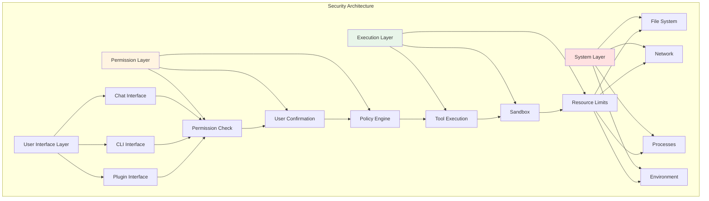

# 第17章 安全最佳实践

## 概述

安全是 Claude Code 最重要的考量因素之一。作为一个与 AI 交互、执行 shell 命令、管理文件系统的工具，Claude Code 必须确保用户数据的安全、系统权限的合理控制、以及潜在安全风险的防护。本章将全面介绍 Claude Code 的安全架构、最佳实践和常见安全问题的防范措施。

**本章要点：**

- **安全架构**：权限系统、沙箱机制、安全边界
- **权限控制**：文件系统、网络、进程、环境变量
- **数据安全**：敏感数据处理、加密存储、安全传输
- **代码安全**：输入验证、输出编码、注入防护
- **审计与监控**：操作日志、安全事件、异常检测
- **安全清单**：开发、部署、运维安全检查

## 安全架构

### 安全边界设计



### 权限系统架构

```typescript
// src/types/permission.ts
export type PermissionScope =
  | 'file_read'      // 文件读取
  | 'file_write'     // 文件写入
  | 'file_delete'    // 文件删除
  | 'network'        // 网络访问
  | 'process'        // 进程操作
  | 'env'            // 环境变量
  | 'cli'            // CLI 命令
  | 'plugin'         // 插件操作

export type PermissionResult =
  | 'allow'          // 允许
  | 'deny'           // 拒绝
  | 'ask'            // 询问用户
  | 'passthrough'    // 传递给下一层

export type PermissionRequest = {
  scope: PermissionScope
  action: string     // 具体操作
  resource?: string  // 涉及的资源
  tool?: string      // 涉及的工具
  details?: Record<string, unknown>
}

export type PermissionPolicy = {
  scopes: PermissionScope[]
  defaultAction: PermissionResult
  exceptions: Record<string, PermissionResult>
  userConfirmRequired: boolean
}
```

## 权限控制

### 文件系统权限

#### 读权限控制

```typescript
// src/permissions/filePermissions.ts
export function checkFileReadPermission(
  filePath: string,
  context: PermissionContext
): PermissionResult {
  // 1. 检查路径白名单
  if (isPathWhitelisted(filePath)) {
    return 'allow'
  }

  // 2. 检查路径黑名单
  if (isPathBlacklisted(filePath)) {
    return 'deny'
  }

  // 3. 检查敏感路径
  if (isSensitivePath(filePath)) {
    // 敏感路径需要用户确认
    return 'ask'
  }

  // 4. 检查工作目录范围
  if (!isWithinWorkingDirectory(filePath)) {
    // 工作目录外的访问需要确认
    return 'ask'
  }

  // 5. 检查文件大小限制
  const fileSize = getFileSize(filePath)
  if (fileSize > MAX_FILE_SIZE) {
    // 超大文件需要确认
    context.details = { fileSize, maxSize: MAX_FILE_SIZE }
    return 'ask'
  }

  return 'allow'
}

function isSensitivePath(filePath: string): boolean {
  const sensitivePatterns = [
    '**/.env',
    '**/*secret*',
    '**/*password*',
    '**/.ssh/**',
    '**/.gnupg/**',
    '**/.aws/**',
    '**/.kube/**',
    '**/node_modules/.cache/**',
  ]

  return matchesAnyPattern(filePath, sensitivePatterns)
}

function isPathBlacklisted(filePath: string): boolean {
  const blacklistedPaths = [
    '/etc/shadow',
    '/etc/passwd',
    '/etc/sudoers',
    '/root/.ssh/id_rsa',
    process.env.HOME + '/.ssh/id_rsa',
  ]

  const normalized = normalizePath(filePath)
  return blacklistedPaths.some(path => normalized.startsWith(path))
}
```

#### 写权限控制

```typescript
// src/permissions/filePermissions.ts
export function checkFileWritePermission(
  filePath: string,
  context: PermissionContext
): PermissionResult {
  // 1. 写权限比读权限更严格
  const readPermission = checkFileReadPermission(filePath, context)
  if (readPermission === 'deny') {
    return 'deny'
  }

  // 2. 检查文件扩展名
  const ext = extname(filePath)
  if (DANGEROUS_EXTENSIONS.includes(ext)) {
    context.details = { reason: 'Dangerous file extension', extension: ext }
    return 'ask'
  }

  // 3. 检查系统关键目录
  if (isSystemDirectory(filePath)) {
    return 'deny'
  }

  // 4. 检查是否覆盖现有文件
  if (existsSync(filePath)) {
    context.details = { reason: 'File overwrite' }
    return 'ask'
  }

  return 'allow'
}

const DANGEROUS_EXTENSIONS = [
  '.exe', '.dll', '.so', '.dylib',
  '.sh', '.bash', '.zsh',
  '.bat', '.cmd', '.ps1',
  '.app', '.dmg',
  '.deb', '.rpm',
  '.scr', '.vbs',
]
```

### 网络权限控制

```typescript
// src/permissions/networkPermissions.ts
export function checkNetworkPermission(
  url: string,
  context: PermissionContext
): PermissionResult {
  const parsed = new URL(url)

  // 1. 检查协议白名单
  const allowedProtocols = ['https:', 'http:', 'ws:', 'wss:']
  if (!allowedProtocols.includes(parsed.protocol)) {
    context.details = { reason: 'Disallowed protocol', protocol: parsed.protocol }
    return 'deny'
  }

  // 2. 检查内网地址
  if (isPrivateAddress(parsed.hostname)) {
    context.details = { reason: 'Private network access' }
    return 'ask'
  }

  // 3. 检查域名黑名单
  if (isDomainBlacklisted(parsed.hostname)) {
    return 'deny'
  }

  // 4. 检查端口
  const port = parseInt(parsed.port) || (parsed.protocol === 'https:' ? 443 : 80)
  if (isRestrictedPort(port)) {
    context.details = { reason: 'Restricted port', port }
    return 'deny'
  }

  return 'allow'
}

function isPrivateAddress(hostname: string): boolean {
  // 检查 localhost
  if (hostname === 'localhost' || hostname === '127.0.0.1') {
    return true
  }

  // 检查内网 IP
  const privatePatterns = [
    /^10\./,
    /^172\.(1[6-9]|2[0-9]|3[0-1])\./,
    /^192\.168\./,
    /^127\./,
    /^::1$/,
    /^fe80:/,
  ]

  return privatePatterns.some(pattern => pattern.test(hostname))
}

const RESTRICTED_PORTS = [
  22,   // SSH
  23,   // Telnet
  25,   // SMTP
  3306, // MySQL
  5432, // PostgreSQL
  6379, // Redis
  27017, // MongoDB
]
```

### 进程权限控制

```typescript
// src/permissions/processPermissions.ts
export function checkProcessPermission(
  command: string,
  args: string[],
  context: PermissionContext
): PermissionResult {
  // 1. 检查命令黑名单
  if (isCommandBlacklisted(command)) {
    context.details = { reason: 'Blacklisted command', command }
    return 'deny'
  }

  // 2. 检查危险参数
  if (containsDangerousArgs(args)) {
    context.details = { reason: 'Dangerous arguments', args }
    return 'deny'
  }

  // 3. 检查需要交互的命令
  if (requiresInteraction(command, args)) {
    context.details = { reason: 'Interactive command' }
    return 'deny'
  }

  // 4. 检查系统管理命令
  if (isSystemAdminCommand(command)) {
    return 'ask'
  }

  return 'allow'
}

function isCommandBlacklisted(command: string): boolean {
  const blacklistedCommands = [
    'rm', 'dd', 'mkfs',
    'sudo', 'su',
    'chmod', 'chown',
    'passwd',
    'crontab',
    'iptables',
    'systemctl',
  ]

  const basename = path.basename(command)
  return blacklistedCommands.includes(basename)
}

function containsDangerousArgs(args: string[]): boolean {
  const dangerousPatterns = [
    /^-rf?$/,          // rm -rf
    /^--force$/,       // 各种 --force
    /^--no-confirm$/,  // 跳过确认
    /^yes\|/,          // yes | command
    /^>.*\/dev\/(null|zero)/,  // 重定向到设备
  ]

  return args.some(arg =>
    dangerousPatterns.some(pattern => pattern.test(arg))
  )
}
```

### 环境变量权限

```typescript
// src/permissions/envPermissions.ts
export function checkEnvPermission(
  name: string,
  operation: 'read' | 'write' | 'delete',
  context: PermissionContext
): PermissionResult {
  // 1. 检查敏感环境变量
  if (isSensitiveEnv(name)) {
    if (operation === 'read') {
      context.details = { reason: 'Sensitive environment variable' }
      return 'ask'
    } else {
      // 写入/删除敏感变量需要严格确认
      return 'ask'
    }
  }

  // 2. 检查系统环境变量
  if (isSystemEnv(name)) {
    if (operation !== 'read') {
      return 'deny'
    }
  }

  return 'allow'
}

function isSensitiveEnv(name: string): boolean {
  const sensitivePatterns = [
    /API.?KEY/i,
    /SECRET/i,
    /PASSWORD/i,
    /TOKEN/i,
    /AUTH/i,
    /CREDENTIAL/i,
    /PRIVATE.?KEY/i,
  ]

  return sensitivePatterns.some(pattern => pattern.test(name))
}

function isSystemEnv(name: string): boolean {
  const systemEnvs = [
    'PATH', 'HOME', 'USER', 'SHELL',
    'TERM', 'LANG', 'LC_ALL',
    'DISPLAY', 'XAUTHORITY',
  ]

  return systemEnvs.includes(name)
}
```

## 数据安全

### 敏感数据识别

```typescript
// src/security/sensitiveData.ts
export function detectSensitiveData(
  text: string,
  context: SecurityContext
): SensitiveDataMatch[] {
  const matches: SensitiveDataMatch[] = []

  // 1. API Keys
  const apiKeyPatterns = [
    { pattern: /(?:api[_-]?key|apikey)\s*[:=]\s*['"]?([a-zA-Z0-9_\-]{20,})/gi, type: 'api_key' },
    { pattern: /sk-[a-zA-Z0-9]{48}/g, type: 'openai_key' },
    { pattern: /AKIA[0-9A-Z]{16}/g, type: 'aws_key' },
  ]

  // 2. Tokens
  const tokenPatterns = [
    { pattern: /(?:token|access[_-]?token)\s*[:=]\s*['"]?([a-zA-Z0-9_\-\.]{20,})/gi, type: 'token' },
    { pattern: /Bearer\s+([a-zA-Z0-9_\-\.]{20,})/gi, type: 'bearer_token' },
  ]

  // 3. 密码
  const passwordPatterns = [
    { pattern: /(?:password|passwd|pwd)\s*[:=]\s*['"]?([^\s'"]{8,})/gi, type: 'password' },
  ]

  // 4. 私钥
  const keyPatterns = [
    { pattern: /-----BEGIN\s+(RSA\s+)?PRIVATE\s+KEY-----/g, type: 'private_key' },
    { pattern: /-----BEGIN\s+EC\s+PRIVATE\s+KEY-----/g, type: 'private_key' },
  ]

  const allPatterns = [
    ...apiKeyPatterns,
    ...tokenPatterns,
    ...passwordPatterns,
    ...keyPatterns,
  ]

  for (const { pattern, type } of allPatterns) {
    let match
    while ((match = pattern.exec(text)) !== null) {
      matches.push({
        type,
        value: match[1] || match[0],
        position: { start: match.index, end: match.index + match[0].length },
      })
    }
  }

  return matches
}

export function redactSensitiveData(
  text: string,
  matches: SensitiveDataMatch[]
): string {
  let redacted = text

  // 从后向前替换，保持位置正确
  for (const match of matches.reverse()) {
    const before = redacted.substring(0, match.position.start)
    const after = redacted.substring(match.position.end)
    const replacement = `[REDACTED ${match.type.toUpperCase()}]`
    redacted = before + replacement + after
  }

  return redacted
}
```

### 加密存储

```typescript
// src/security/encryption.ts
import { createCipher, createDecipher } from 'crypto'

export async function encryptSensitiveData(
  data: string,
  key: string
): Promise<string> {
  const algorithm = 'aes-256-gcm'
  const iv = crypto.randomBytes(16)
  const cipher = createCipher(algorithm, key)

  let encrypted = cipher.update(data, 'utf8', 'hex')
  encrypted += cipher.final('hex')

  const authTag = cipher.getAuthTag()

  // 组合: iv + authTag + encrypted
  return iv.toString('hex') + ':' + authTag.toString('hex') + ':' + encrypted
}

export async function decryptSensitiveData(
  encrypted: string,
  key: string
): Promise<string> {
  const parts = encrypted.split(':')
  const iv = Buffer.from(parts[0], 'hex')
  const authTag = Buffer.from(parts[1], 'hex')
  const encryptedData = parts[2]

  const decipher = createDecipher('aes-256-gcm', key)
  decipher.setAuthTag(authTag)

  let decrypted = decipher.update(encryptedData, 'hex', 'utf8')
  decrypted += decipher.final('utf8')

  return decrypted
}

// 使用示例
async function storeAPIKey(key: string, value: string): Promise<void> {
  // 检测是否为敏感数据
  const matches = detectSensitiveData(value, {})
  if (matches.length > 0) {
    // 加密存储
    const encryptionKey = getEncryptionKey()
    const encrypted = await encryptSensitiveData(value, encryptionKey)

    await setConfig(key, encrypted, { encrypted: true })
  } else {
    await setConfig(key, value)
  }
}
```

## 代码安全

### 输入验证

```typescript
// src/security/inputValidation.ts
import { z } from 'zod'

// 文件路径验证
export const FilePathSchema = z.string().refine(
  (path) => {
    // 1. 防止路径遍历
    if (path.includes('..')) {
      return false
    }

    // 2. 检查绝对路径
    if (path.startsWith('/')) {
      return false
    }

    // 3. 检查特殊字符
    if (/[<>:"|?*]/.test(path)) {
      return false
    }

    return true
  },
  { message: 'Invalid file path' }
)

// URL 验证
export const URLSchema = z.string().url().refine(
  (url) => {
    const parsed = new URL(url)

    // 1. 只允许特定协议
    const allowedProtocols = ['https:', 'http:', 'ws:', 'wss:']
    if (!allowedProtocols.includes(parsed.protocol)) {
      return false
    }

    // 2. 禁止内网地址
    if (isPrivateAddress(parsed.hostname)) {
      return false
    }

    return true
  },
  { message: 'Invalid or unsafe URL' }
)

// Shell 命令验证
export const ShellCommandSchema = z.object({
  command: z.string().refine(
    (cmd) => {
      // 1. 不允许管道
      if (cmd.includes('|')) {
        return false
      }

      // 2. 不允许命令链
      if (/[;&]/.test(cmd)) {
        return false
      }

      // 3. 不允许替换
      if (/\$|`/.test(cmd)) {
        return false
      }

      return true
    },
    { message: 'Invalid shell command' }
  ),
  args: z.array(z.string()).max(100),
})
```

### 输出编码

```typescript
// src/security/outputEncoding.ts
export function encodeShellOutput(output: string): string {
  // 转义特殊字符
  return output
    .replace(/\\/g, '\\\\')   // 反斜杠
    .replace(/\$/g, '\\$')     // 美元符号
    .replace(/`/g, '\\`')     // 反引号
    .replace(/"/g, '\\"')     // 双引号
    .replace(/\n/g, '\\n')    // 换行
    .replace(/\r/g, '\\r')    // 回车
    .replace(/\t/g, '\\t')    // 制表符
}

export function encodeHTMLOutput(output: string): string {
  return output
    .replace(/&/g, '&amp;')
    .replace(/</g, '&lt;')
    .replace(/>/g, '&gt;')
    .replace(/"/g, '&quot;')
    .replace(/'/g, '&#x27;')
}

export function encodeJSONOutput(output: string): string {
  // JSON.stringify 自动处理转义
  return JSON.stringify(output)
}
```

### 注入防护

```typescript
// src/security/injectionProtection.ts
export function sanitizeShellInput(input: string): string {
  // 1. 移除危险字符
  let sanitized = input.replace(/[;&|`$()]/g, '')

  // 2. 转义特殊字符
  sanitized = sanitized.replace(/([<>!"'&])/g, '\\$1')

  // 3. 限制长度
  if (sanitized.length > 1000) {
    sanitized = sanitized.substring(0, 1000)
  }

  return sanitized
}

export function sanitizePathInput(input: string): string {
  // 1. 防止路径遍历
  let sanitized = input.replace(/\.\./g, '')

  // 2. 移除绝对路径
  sanitized = sanitized.replace(/^\/+/, '')

  // 3. 规范化路径分隔符
  sanitized = sanitized.replace(/\\/g, '/')

  return sanitized
}

// 使用示例：安全的命令执行
export async function executeCommandSafely(
  command: string,
  args: string[]
): Promise<string> {
  // 1. 验证命令
  const validated = ShellCommandSchema.parse({ command, args })

  // 2. 清理参数
  const sanitizedArgs = args.map(arg => sanitizeShellInput(arg))

  // 3. 执行（使用参数化方式，不使用 shell）
  const { stdout } = await exec(validated.command, sanitizedArgs)

  // 4. 编码输出
  return encodeShellOutput(stdout)
}
```

## 审计与监控

### 操作日志

```typescript
// src/audit/operationLog.ts
export interface AuditLogEntry {
  timestamp: number
  user?: string
  operation: string
  resource?: string
  result: 'success' | 'failure' | 'blocked'
  details?: Record<string, unknown>
  securityContext?: SecurityContext
}

export class AuditLogger {
  private logs: AuditLogEntry[] = []
  private maxLogs = 10000

  log(entry: AuditLogEntry): void {
    // 1. 添加时间戳
    entry.timestamp = Date.now()

    // 2. 记录用户信息
    if (!entry.user) {
      entry.user = getCurrentUser()
    }

    // 3. 记录安全上下文
    if (!entry.securityContext) {
      entry.securityContext = getSecurityContext()
    }

    // 4. 添加到日志
    this.logs.push(entry)

    // 5. 保持日志大小
    if (this.logs.length > this.maxLogs) {
      this.logs.shift()
    }

    // 6. 持久化到文件
    this.persistLog(entry)

    // 7. 安全事件告警
    if (this.isSecurityEvent(entry)) {
      this.alertSecurityEvent(entry)
    }
  }

  private isSecurityEvent(entry: AuditLogEntry): boolean {
    // 1. 阻止的操作
    if (entry.result === 'blocked') {
      return true
    }

    // 2. 失败的敏感操作
    if (entry.result === 'failure' && this.isSensitiveOperation(entry)) {
      return true
    }

    // 3. 异常模式
    if (this.detectAnomalousPattern(entry)) {
      return true
    }

    return false
  }

  private isSensitiveOperation(entry: AuditLogEntry): boolean {
    const sensitiveOperations = [
      'file_write',
      'file_delete',
      'network',
      'process',
      'env_write',
    ]

    return sensitiveOperations.includes(entry.operation)
  }

  private detectAnomalousPattern(entry: AuditLogEntry): boolean {
    // 检测异常模式，例如：
    // - 短时间内大量失败操作
    // - 尝试访问敏感资源
    // - 异常的命令序列

    const recentLogs = this.getRecentLogs(60000) // 最近 1 分钟

    // 检查失败率
    const failures = recentLogs.filter(log => log.result === 'failure')
    if (failures.length > 10) {
      return true
    }

    // 检查敏感资源访问
    const sensitiveAccess = recentLogs.filter(log =>
      log.resource?.includes('.env') ||
      log.resource?.includes('secret') ||
      log.resource?.includes('password')
    )
    if (sensitiveAccess.length > 5) {
      return true
    }

    return false
  }
}

// 全局审计日志记录器
export const auditLogger = new AuditLogger()

// 使用示例
export async function readFileWithAudit(
  filePath: string
): Promise<string> {
  const permission = checkFileReadPermission(filePath, {})

  auditLogger.log({
    operation: 'file_read',
    resource: filePath,
    result: permission === 'allow' ? 'success' : 'blocked',
    details: { permission },
  })

  if (permission !== 'allow') {
    throw new Error('Permission denied')
  }

  return readFile(filePath, 'utf-8')
}
```

## 安全清单

### 开发安全清单

#### 代码审查
- [ ] 所有用户输入都经过验证和清理
- [ ] 所有文件操作都经过权限检查
- [ ] 所有网络请求都经过 URL 验证
- [ ] 敏感数据都经过加密存储
- [ ] 所有命令执行都使用参数化方式
- [ ] 错误消息不泄露敏感信息

#### 测试
- [ ] 安全测试覆盖所有权限检查
- [ ] 渗透测试覆盖常见漏洞
- [ ] 模糊测试覆盖输入验证
- [ ] 性能测试覆盖资源限制

#### 依赖管理
- [ ] 所有依赖都来自可信来源
- [ ] 定期更新依赖到安全版本
- [ ] 使用 `npm audit` 检查漏洞
- [ ] 使用 Snyk 或类似工具监控依赖

### 部署安全清单

#### 环境配置
- [ ] 生产环境不包含调试接口
- [ ] 所有敏感配置使用环境变量
- [ ] 日志不包含敏感数据
- [ ] 错误堆栈不暴露给用户

#### 权限配置
- [ ] 使用最小权限原则
- [ ] 文件权限正确设置
- [ ] 网络访问正确限制
- [ ] 进程运行在非特权用户

#### 加密配置
- [ ] 传输层使用 TLS
- [ ] 存储数据加密
- [ ] 密钥管理安全
- [ ] 证书验证启用

### 运维安全清单

#### 监控
- [ ] 安全事件实时告警
- [ ] 异常行为自动检测
- [ ] 审计日志定期审查
- [ ] 安全指标仪表板

#### 响应
- [ ] 安全事件响应流程
- [ ] 应急联系人清单
- [ ] 恢复备份可用
- [ ] 事件分析报告

#### 更新
- [ ] 定期安全更新
- [ ] 漏洞修复优先级
- [ ] 变更管理流程
- [ ] 回滚计划准备

## 常见安全问题

### 问题1：路径遍历漏洞

**风险**：攻击者可以访问系统任意文件。

**防护**：

```typescript
// 不安全的代码
const filePath = userInput
const content = readFile(filePath) // 危险！

// 安全的代码
const validated = FilePathSchema.parse(userInput)
const resolved = resolve(validated)
if (!isWithinWorkingDirectory(resolved)) {
  throw new Error('Path traversal detected')
}
const content = readFile(resolved)
```

### 问题2：命令注入漏洞

**风险**：攻击者可以执行任意命令。

**防护**：

```typescript
// 不安全的代码
const command = `ls ${userInput}`
exec(command) // 危险！

// 安全的代码
const sanitized = sanitizeShellInput(userInput)
await exec('ls', [sanitized])
```

### 问题3：敏感数据泄露

**风险**：API 密钥、密码等敏感数据泄露。

**防护**：

```typescript
// 检测敏感数据
const matches = detectSensitiveData(output, {})
if (matches.length > 0) {
  // 脱敏处理
  output = redactSensitiveData(output, matches)
}

// 加密存储
await storeAPIKey('api_key', apiKey)
```

### 问题4：权限提升

**风险**：普通用户获得管理员权限。

**防护**：

```typescript
// 检查当前用户权限
if (isPrivilegedUser()) {
  // 降级权限
  dropPrivileges()
}

// 执行操作前验证
if (!hasRequiredPermission(operation)) {
  throw new Error('Insufficient permissions')
}
```

## 最佳实践

### 1. 纵深防御

不要依赖单一安全措施，多层防护：

```typescript
// 第一层：输入验证
const validated = await validateInput(input)

// 第二层：权限检查
const permission = checkPermission(validated)
if (permission !== 'allow') {
  throw new Error('Permission denied')
}

// 第三层：执行监控
auditLogger.log({ operation: 'execute', input: validated })

// 第四层：结果清理
const result = await execute(validated)
return sanitizeOutput(result)
```

### 2. 最小权限原则

只授予必要的权限：

```typescript
// 不好的做法：授予所有权限
const permissions = ['*']

// 好的做法：授予特定权限
const permissions = [
  'file_read:./src/**',
  'file_write:./dist/**',
  'network:api.example.com',
]
```

### 3. 安全默认值

默认配置应该是安全的：

```typescript
// 不好的做法：默认允许所有操作
const defaultPermission = 'allow'

// 好的做法：默认拒绝，显式允许
const defaultPermission = 'deny'
```

### 4. 失败安全

安全机制失败时应该保持安全：

```typescript
try {
  const permission = checkPermission(resource)
  if (permission === 'allow') {
    return executeOperation(resource)
  } else {
    throw new Error('Permission denied')
  }
} catch (error) {
  // 权限检查失败时，拒绝操作
  logError(error)
  throw new Error('Operation blocked')
}
```

## 总结

Claude Code 的安全实践：

1. **完善的安全架构**：多层防护、权限系统、沙箱机制
2. **细粒度权限控制**：文件、网络、进程、环境变量
3. **数据安全保护**：敏感数据识别、加密存储、安全传输
4. **代码安全规范**：输入验证、输出编码、注入防护
5. **全面的审计监控**：操作日志、安全事件、异常检测
6. **实用的安全清单**：开发、部署、运维安全检查

安全是一个持续的过程，需要不断学习、改进和警惕。掌握这些安全实践，可以构建更加安全可靠的 AI 辅助开发工具。
