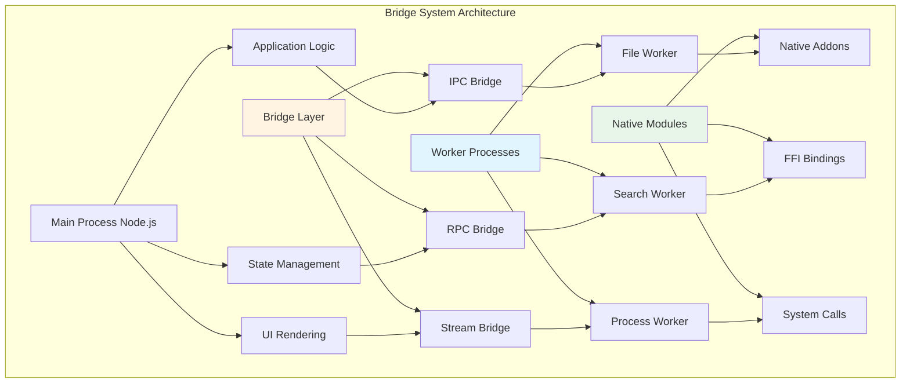

# 第19章 Bridge System（桥接系统）

## 概述

Bridge System 是 Claude Code 中负责跨语言通信的核心组件。由于 Claude Code 主进程运行在 Node.js 环境，而某些功能（如复杂的文件操作、系统调用）可能需要调用原生模块或外部进程，Bridge System 提供了高效的桥接机制。本章将深入分析桥接系统的架构设计、序列化协议、通信机制和性能优化。

**本章要点：**

- **桥接架构**：进程间通信、跨语言调用、协议设计
- **序列化协议**：数据格式、类型映射、安全传输
- **通信机制**：消息传递、事件驱动、错误处理
- **性能优化**：连接池、批处理、缓存策略
- **源码分析**：核心模块深度解析
- **实战案例**：常见桥接场景

## 桥接架构

### 架构概览



### 核心组件

```typescript
// src/bridge/types.ts
export type BridgeMessageType =
  | 'request'      // 请求消息
  | 'response'     // 响应消息
  | 'event'        // 事件消息
  | 'error'        // 错误消息
  | 'stream'       // 流消息

export type BridgeMessage<T = unknown> = {
  id: string              // 消息ID
  type: BridgeMessageType // 消息类型
  method?: string         // 方法名（request/response）
  event?: string          // 事件名（event）
  payload?: T             // 消息负载
  error?: BridgeError     // 错误信息
  metadata?: Record<string, unknown> // 元数据
}

export type BridgeError = {
  code: string            // 错误码
  message: string         // 错误消息
  stack?: string          // 堆栈信息
  details?: Record<string, unknown>
}

export type BridgeOptions = {
  timeout?: number        // 超时时间（ms）
  retries?: number        // 重试次数
  serializer?: Serializer // 序列化器
  deserializer?: Deserializer // 反序列化器
}
```

## 序列化协议

### 数据格式

```typescript
// src/bridge/serialization.ts
export interface Serializer {
  serialize<T>(value: T): Buffer
  deserialize<T>(buffer: Buffer): T
}

// JSON 序列化器
export class JSONSerializer implements Serializer {
  serialize<T>(value: T): Buffer {
    return Buffer.from(JSON.stringify(value), 'utf-8')
  }

  deserialize<T>(buffer: Buffer): T {
    return JSON.parse(buffer.toString('utf-8')) as T
  }
}

// MessagePack 序列化器（更高效）
export class MessagePackSerializer implements Serializer {
  serialize<T>(value: T): Buffer {
    return MessagePack.encode(value)
  }

  deserialize<T>(buffer: Buffer): T {
    return MessagePack.decode(buffer) as T
  }
}
```

### 类型映射

```typescript
// src/bridge/types.ts
export type BridgeTypeMapping = {
  // 基础类型
  string: string
  number: number
  boolean: boolean
  null: null
  undefined: void

  // 复杂类型
  array: Array<unknown>
  object: Record<string, unknown>

  // 特殊类型
  buffer: Buffer
  date: Date
  error: Error
  regexp: RegExp

  // 流类型
  readable: NodeJS.ReadableStream
  writable: NodeJS.WritableStream
}

// 类型转换器
export class TypeConverter {
  static toBridge<T>(value: T): unknown {
    if (value === null || value === undefined) {
      return value
    }

    if (Buffer.isBuffer(value)) {
      return { type: 'buffer', data: value.toString('base64') }
    }

    if (value instanceof Date) {
      return { type: 'date', value: value.toISOString() }
    }

    if (value instanceof Error) {
      return {
        type: 'error',
        name: value.name,
        message: value.message,
        stack: value.stack,
      }
    }

    if (value instanceof RegExp) {
      return { type: 'regexp', source: value.source, flags: value.flags }
    }

    if (Array.isArray(value)) {
      return value.map(v => this.toBridge(v))
    }

    if (typeof value === 'object') {
      const result: Record<string, unknown> = {}
      for (const [key, val] of Object.entries(value)) {
        result[key] = this.toBridge(val)
      }
      return result
    }

    return value
  }

  static fromBridge<T>(value: unknown): T {
    if (value === null || value === undefined) {
      return value as T
    }

    if (typeof value === 'object' && value !== null) {
      const obj = value as Record<string, unknown>

      if (obj.type === 'buffer' && typeof obj.data === 'string') {
        return Buffer.from(obj.data, 'base64') as T
      }

      if (obj.type === 'date' && typeof obj.value === 'string') {
        return new Date(obj.value) as T
      }

      if (obj.type === 'error') {
        const error = new Error(obj.message as string)
        error.name = obj.name as string
        error.stack = obj.stack as string
        return error as T
      }

      if (obj.type === 'regexp') {
        return new RegExp(obj.source as string, obj.flags as string) as T
      }

      // 处理嵌套对象
      const result: Record<string, unknown> = {}
      for (const [key, val] of Object.entries(obj)) {
        result[key] = this.fromBridge(val)
      }
      return result as T
    }

    if (Array.isArray(value)) {
      return value.map(v => this.fromBridge(v)) as T
    }

    return value as T
  }
}
```

## 通信机制

### IPC Bridge

```typescript
// src/bridge/ipc.ts
export class IPCBridge {
  private worker: Worker | ChildProcess
  private messageHandlers = new Map<string, MessageHandler>()
  private pendingRequests = new Map<string, PendingRequest>()
  private messageId = 0

  constructor(worker: Worker | ChildProcess) {
    this.worker = worker
    this.setupMessageHandler()
  }

  private setupMessageHandler(): void {
    this.worker.on('message', (message: BridgeMessage) => {
      this.handleMessage(message)
    })

    this.worker.on('error', (error) => {
      this.handleError(error)
    })

    this.worker.on('exit', (code) => {
      this.handleExit(code)
    })
  }

  private handleMessage(message: BridgeMessage): void {
    switch (message.type) {
      case 'request':
        this.handleRequest(message)
        break

      case 'response':
        this.handleResponse(message)
        break

      case 'event':
        this.handleEvent(message)
        break

      case 'error':
        this.handleError(message)
        break
    }
  }

  async request<T>(
    method: string,
    payload?: unknown,
    options?: BridgeOptions
  ): Promise<T> {
    const id = this.generateMessageId()

    const message: BridgeMessage = {
      id,
      type: 'request',
      method,
      payload,
    }

    return new Promise((resolve, reject) => {
      const timeout = options?.timeout || 30000

      const timer = setTimeout(() => {
        this.pendingRequests.delete(id)
        reject(new Error(`Request timeout: ${method}`))
      }, timeout)

      this.pendingRequests.set(id, {
        resolve,
        reject,
        timer,
      })

      this.worker.send(message)
    })
  }

  private handleRequest(message: BridgeMessage): void {
    const handler = this.messageHandlers.get(message.method || '')

    if (!handler) {
      this.sendError(message.id, {
        code: 'METHOD_NOT_FOUND',
        message: `Method not found: ${message.method}`,
      })
      return
    }

    handler(message.payload || {})
      .then(result => {
        this.sendResponse(message.id, result)
      })
      .catch(error => {
        this.sendError(message.id, {
          code: 'EXECUTION_ERROR',
          message: error.message,
          stack: error.stack,
        })
      })
  }

  private handleResponse(message: BridgeMessage): void {
    const pending = this.pendingRequests.get(message.id)

    if (!pending) {
      return
    }

    clearTimeout(pending.timer)
    this.pendingRequests.delete(message.id)

    if (message.error) {
      pending.reject(new BridgeError(message.error))
    } else {
      pending.resolve(message.payload)
    }
  }

  private handleEvent(message: BridgeMessage): void {
    const listeners = this.eventListeners.get(message.event || '')
    listeners?.forEach(listener => {
      listener(message.payload)
    })
  }

  private sendResponse(id: string, payload: unknown): void {
    const message: BridgeMessage = {
      id,
      type: 'response',
      payload,
    }

    this.worker.send(message)
  }

  private sendError(id: string, error: BridgeError): void {
    const message: BridgeMessage = {
      id,
      type: 'error',
      error,
    }

    this.worker.send(message)
  }

  registerMethod(name: string, handler: MessageHandler): void {
    this.messageHandlers.set(name, handler)
  }

  private generateMessageId(): string {
    return `${Date.now()}-${this.messageId++}`
  }
}

type MessageHandler = (payload: unknown) => Promise<unknown>

type PendingRequest = {
  resolve: (value: unknown) => void
  reject: (error: Error) => void
  timer: NodeJS.Timeout
}
```

### RPC Bridge

```typescript
// src/bridge/rpc.ts
export class RPCBridge extends IPCBridge {
  private services = new Map<string, RemoteService>()

  registerService(name: string, service: RemoteService): void {
    this.services.set(name, service)

    // 注册所有方法
    for (const method of Object.keys(service)) {
      if (typeof service[method] === 'function') {
        this.registerMethod(`${name}.${method}`, async (payload) => {
          return service[method](payload)
        })
      }
    }
  }

  async call<T>(
    service: string,
    method: string,
    params?: unknown,
    options?: BridgeOptions
  ): Promise<T> {
    return this.request<T>(`${service}.${method}`, params, options)
  }

  getServiceProxy<T>(name: string): T {
    const proxy = new Proxy({}, {
      get: (_target, prop) => {
        return async (...args: unknown[]) => {
          return this.call(name, String(prop), args)
        }
      },
    })

    return proxy as T
  }
}

type RemoteService = Record<string, (...args: unknown[]) => unknown>
```

### Stream Bridge

```typescript
// src/bridge/stream.ts
export class StreamBridge extends IPCBridge {
  private streams = new Map<string, Duplex>()

  createStream(id: string): Duplex {
    const stream = new Duplex({
      write: (chunk, encoding, callback) => {
        this.sendMessage({
          id: `${id}-write`,
          type: 'stream',
          payload: { chunk: chunk.toString('base64'), encoding },
        })
        callback()
      },
      read: () => {
        // 数据通过 message 事件到达
      },
    })

    this.streams.set(id, stream)
    return stream
  }

  handleStreamData(message: BridgeMessage): void {
    const streamId = message.id.split('-')[0]
    const stream = this.streams.get(streamId)

    if (stream && message.payload) {
      const { chunk, encoding } = message.payload as {
        chunk: string
        encoding: BufferEncoding
      }
      stream.push(Buffer.from(chunk, 'base64'), encoding)
    }
  }

  endStream(id: string): void {
    const stream = this.streams.get(id)
    if (stream) {
      stream.end()
      this.streams.delete(id)
    }

    this.sendMessage({
      id: `${id}-end`,
      type: 'stream',
    })
  }
}
```

## 性能优化

### 连接池

```typescript
// src/bridge/pool.ts
export class WorkerPool {
  private workers: Worker[] = []
  private availableWorkers: Worker[] = []
  private taskQueue: Array<{
    task: () => Promise<unknown>
    resolve: (value: unknown) => void
    reject: (error: Error) => void
  }> = []

  constructor(
    private workerScript: string,
    private poolSize: number = 4
  ) {
    this.initializePool()
  }

  private initializePool(): void {
    for (let i = 0; i < this.poolSize; i++) {
      const worker = new Worker(this.workerScript)
      this.workers.push(worker)
      this.availableWorkers.push(worker)

      worker.on('message', (result) => {
        this.handleWorkerMessage(worker, result)
      })

      worker.on('error', (error) => {
        this.handleWorkerError(worker, error)
      })
    }
  }

  async execute<T>(task: () => Promise<T>): Promise<T> {
    return new Promise((resolve, reject) => {
      this.taskQueue.push({
        task,
        resolve: resolve as (value: unknown) => void,
        reject,
      })

      this.processNextTask()
    })
  }

  private processNextTask(): void {
    if (this.availableWorkers.length === 0 || this.taskQueue.length === 0) {
      return
    }

    const worker = this.availableWorkers.shift()!
    const taskItem = this.taskQueue.shift()!

    worker.once('message', (result) => {
      taskItem.resolve(result)
      this.availableWorkers.push(worker)
      this.processNextTask()
    })

    worker.once('error', (error) => {
      taskItem.reject(error)
      this.availableWorkers.push(worker)
      this.processNextTask()
    })

    taskItem.task()
  }

  private handleWorkerMessage(worker: Worker, result: unknown): void {
    // 消息已在 execute 中处理
  }

  private handleWorkerError(worker: Worker, error: Error): void {
    // 错误已在 execute 中处理
  }

  terminate(): void {
    for (const worker of this.workers) {
      worker.terminate()
    }

    this.workers = []
    this.availableWorkers = []
  }
}
```

### 批处理

```typescript
// src/bridge/batch.ts
export class BatchProcessor {
  private batch: Array<{
    id: string
    method: string
    payload?: unknown
  }> = []

  private batchTimer: NodeJS.Timeout | null = null
  private readonly batchTimeout = 100 // 100ms
  private readonly maxBatchSize = 100

  constructor(private bridge: IPCBridge) {}

  async request<T>(
    method: string,
    payload?: unknown,
    options?: { priority?: 'high' | 'low' }
  ): Promise<T> {
    // 高优先级请求立即发送
    if (options?.priority === 'high') {
      return this.bridge.request<T>(method, payload)
    }

    return new Promise((resolve, reject) => {
      const id = this.bridge['generateMessageId']()

      this.batch.push({ id, method, payload })
      this.bridge['pendingRequests'].set(id, { resolve, reject, timer: null as unknown as NodeJS.Timeout })

      // 达到批次大小或超时，发送请求
      if (this.batch.length >= this.maxBatchSize) {
        this.flush()
      } else {
        this.scheduleFlush()
      }
    })
  }

  private scheduleFlush(): void {
    if (this.batchTimer) {
      return
    }

    this.batchTimer = setTimeout(() => {
      this.flush()
    }, this.batchTimeout)
  }

  private flush(): void {
    if (this.batchTimer) {
      clearTimeout(this.batchTimer)
      this.batchTimer = null
    }

    if (this.batch.length === 0) {
      return
    }

    // 发送批量请求
    this.bridge.worker.send({
      type: 'batch',
      requests: this.batch,
    })

    this.batch = []
  }
}
```

### 缓存策略

```typescript
// src/bridge/cache.ts
export class BridgeCache {
  private cache = new Map<string, CacheEntry>()
  private readonly maxCacheSize = 1000
  private readonly defaultTTL = 60000 // 60 seconds

  get<T>(key: string): T | undefined {
    const entry = this.cache.get(key)

    if (!entry) {
      return undefined
    }

    // 检查是否过期
    if (Date.now() > entry.expiresAt) {
      this.cache.delete(key)
      return undefined
    }

    // 更新访问时间
    entry.lastAccessedAt = Date.now()

    return entry.value as T
  }

  set<T>(key: string, value: T, ttl?: number): void {
    // 缓存大小限制
    if (this.cache.size >= this.maxCacheSize) {
      this.evictLRU()
    }

    this.cache.set(key, {
      value,
      createdAt: Date.now(),
      lastAccessedAt: Date.now(),
      expiresAt: Date.now() + (ttl || this.defaultTTL),
    })
  }

  private evictLRU(): void {
    // 找到最少使用的条目
    let lruKey: string | null = null
    let lruTime = Infinity

    for (const [key, entry] of this.cache) {
      if (entry.lastAccessedAt < lruTime) {
        lruTime = entry.lastAccessedAt
        lruKey = key
      }
    }

    if (lruKey) {
      this.cache.delete(lruKey)
    }
  }

  clear(): void {
    this.cache.clear()
  }
}

type CacheEntry = {
  value: unknown
  createdAt: number
  lastAccessedAt: number
  expiresAt: number
}
```

## 源码分析

### Worker 进程实现

```typescript
// src/bridge/worker.ts
export class BridgeWorker {
  private bridge: IPCBridge
  private services: Map<string, RemoteService> = new Map()

  constructor() {
    this.bridge = new IPCBridge(process as unknown as ChildProcess)
    this.setupDefaultHandlers()
  }

  private setupDefaultHandlers(): void {
    // 健康检查
    this.bridge.registerMethod('health', async () => {
      return {
        status: 'ok',
        uptime: process.uptime(),
        memory: process.memoryUsage(),
      }
    })

    // 元数据
    this.bridge.registerMethod('metadata', async () => {
      return {
        version: process.version,
        platform: process.platform,
        arch: process.arch,
      }
    })

    // 终止
    this.bridge.registerMethod('terminate', async () => {
      process.exit(0)
    })
  }

  registerService(name: string, service: RemoteService): void {
    this.services.set(name, service)

    for (const method of Object.keys(service)) {
      if (typeof service[method] === 'function') {
        this.bridge.registerMethod(`${name}.${method}`, async (params) => {
          return service[method](params)
        })
      }
    }
  }

  start(): void {
    // 监听进程消息
    process.on('message', (message: BridgeMessage) => {
      this.bridge['handleMessage'](message)
    })

    // 通知就绪
    this.sendMessage({
      id: 'ready',
      type: 'event',
      event: 'ready',
      payload: { pid: process.pid },
    })
  }

  private sendMessage(message: BridgeMessage): void {
    process.send?.(message)
  }
}
```

### 文件操作桥接

```typescript
// src/bridge/fileService.ts
export class FileService {
  private cache: BridgeCache = new BridgeCache()

  async readFile(path: string, options?: { encoding?: BufferEncoding; cache?: boolean }): Promise<string> {
    const cacheKey = `file:${path}`

    // 检查缓存
    if (options?.cache !== false) {
      const cached = this.cache.get<string>(cacheKey)
      if (cached !== undefined) {
        return cached
      }
    }

    // 读取文件
    const content = await fs.readFile(path, { encoding: options?.encoding || 'utf-8' })

    // 缓存结果
    if (options?.cache !== false) {
      this.cache.set(cacheKey, content)
    }

    return content
  }

  async writeFile(path: string, content: string): Promise<void> {
    await fs.writeFile(path, content, { encoding: 'utf-8' })

    // 清除缓存
    this.cache.set(`file:${path}`, undefined)
  }

  async stat(path: string): Promise<fs.Stats> {
    return fs.stat(path)
  }

  async readdir(path: string): Promise<string[]> {
    return fs.readdir(path)
  }

  // 批量读取
  async readBatch(paths: string[]): Promise<string[]> {
    return Promise.all(paths.map(path => this.readFile(path)))
  }

  // 流式读取
  createReadStream(path: string): fs.ReadStream {
    return fs.createReadStream(path)
  }

  createWriteStream(path: string): fs.WriteStream {
    return fs.createWriteStream(path)
  }
}
```

## 实战案例

### 案例1：文件搜索桥接

```typescript
// examples/fileSearchBridge.ts
// 主进程
class MainProcess {
  private bridge: IPCBridge

  constructor() {
    const worker = new Worker('./fileSearchWorker.js')
    this.bridge = new IPCBridge(worker)
  }

  async searchFiles(
    pattern: string,
    directory: string
  ): Promise<string[]> {
    return this.bridge.request('search', {
      pattern,
      directory,
    })
  }
}

// Worker 进程
class FileSearchWorker extends BridgeWorker {
  constructor() {
    super()
    this.registerService('search', {
      search: async ({ pattern, directory }) => {
        return this.performSearch(pattern, directory)
      },
    })
  }

  private async performSearch(
    pattern: string,
    directory: string
  ): Promise<string[]> {
    const results: string[] = []

    for await (const entry of walk(directory)) {
      if (entry.isFile() && entry.name.match(pattern)) {
        results.push(entry.path)
      }
    }

    return results
  }

  start(): void {
    super.start()
  }
}

new FileSearchWorker().start()
```

### 案例2：流式数据处理

```typescript
// examples/streamBridge.ts
// 主进程
class StreamProcessor {
  private bridge: StreamBridge

  constructor() {
    const worker = new Worker('./streamWorker.js')
    this.bridge = new StreamBridge(worker)
  }

  processStream(input: ReadableStream): Promise<ReadableStream> {
    const streamId = 'process-stream'
    const output = this.bridge.createStream(streamId)

    // 发送流数据
    input.on('data', (chunk) => {
      this.bridge.sendMessage({
        id: `${streamId}-write`,
        type: 'stream',
        payload: { chunk: chunk.toString('base64') },
      })
    })

    input.on('end', () => {
      this.bridge.endStream(streamId)
    })

    return output as unknown as ReadableStream
  }
}
```

## 最佳实践

### 1. 错误处理

- **超时控制**：为所有请求设置合理的超时时间
- **错误传播**：确保错误信息正确传播到主进程
- **重试机制**：对暂时性错误实现自动重试

### 2. 性能优化

- **批量操作**：合并小请求为批量请求
- **缓存策略**：缓存频繁访问的数据
- **连接复用**：使用连接池避免频繁创建/销毁

### 3. 安全考虑

- **数据验证**：验证所有输入数据
- **权限控制**：限制 worker 进程的权限
- **资源限制**：防止内存泄漏和资源耗尽

## 总结

Bridge System 的核心特性：

1. **高效通信**：IPC、RPC、Stream 多种通信方式
2. **灵活序列化**：支持 JSON、MessagePack 等多种格式
3. **类型安全**：完整的类型映射和转换
4. **性能优化**：连接池、批处理、缓存策略
5. **错误处理**：完善的错误处理和重试机制
6. **易于扩展**：简单注册自定义服务

掌握 Bridge System，可以高效实现跨语言通信和复杂功能的桥接。
