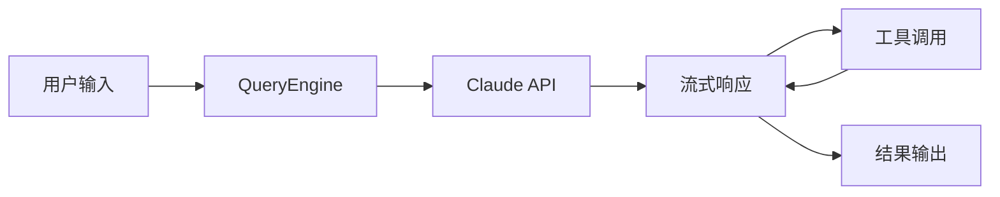
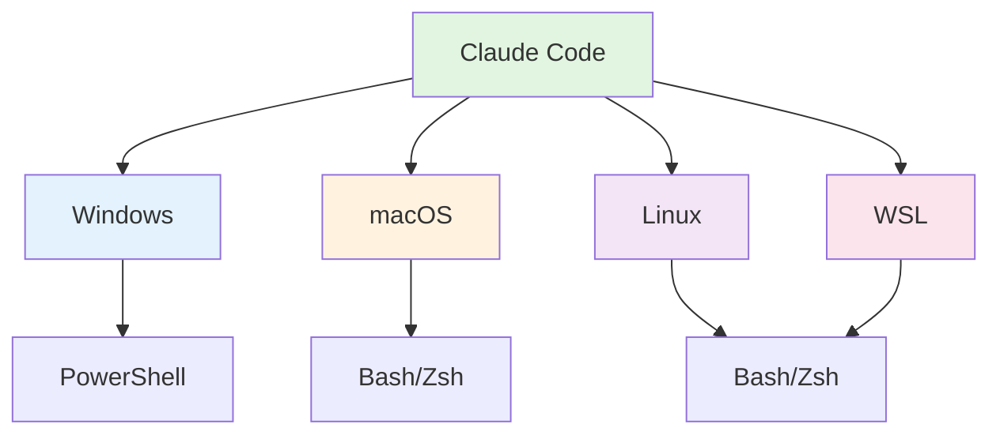
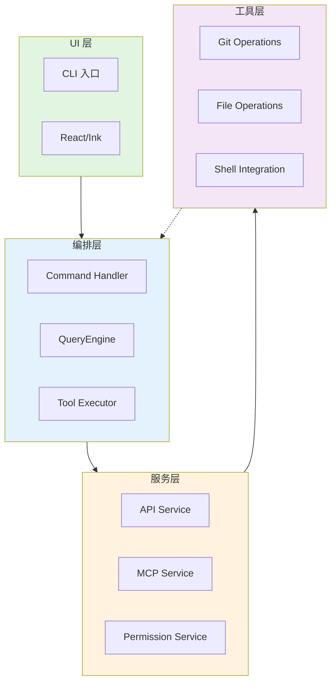
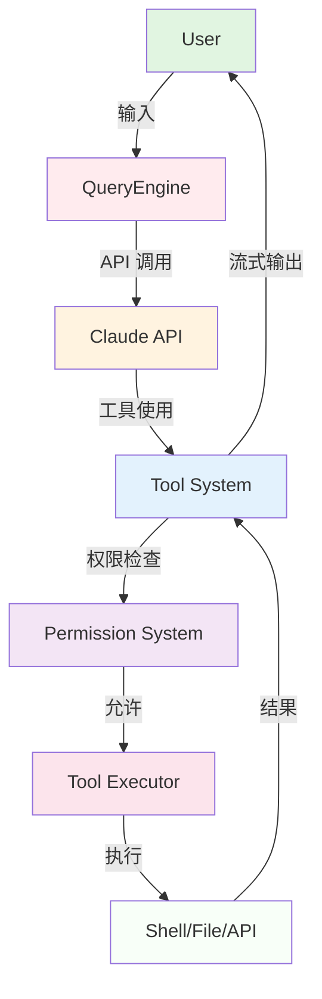

# 第1章：项目概述与背景

> **本章目标**：理解 Claude Code 的历史背景、设计理念和核心特性，掌握其与其他 AI 编程助手的区别

---

## 📚 学习目标

完成本章后，你将能够：

- [ ] 理解 Claude Code 的历史背景和设计理念
- [ ] 掌握 Claude Code 的核心特性和能力
- [ ] 了解 Claude Code 与其他 AI 编程助手的区别
- [ ] 理解项目的整体架构和技术栈选择

---

## 🔑 前置知识

**必备知识**：
- 基本的编程概念
- 对 AI 助手工具有基本了解
- 终端命令行操作经验

**可选知识**：
- TypeScript/JavaScript 基础
- React 框架了解
- Git 版本控制

**依赖章节**：无（首章）

---

## 📖 引言

在 AI 辅助编程日益普及的今天，Claude Code 作为一款由 Anthropic 开发的先进 AI 编程助手，正在改变开发者的工作方式。本章将带你深入了解 Claude Code 的诞生背景、设计理念、核心特性以及技术架构，为后续深入学习奠定基础。

---

## 1.1 项目背景

### 1.1.1 诞生原因

Claude Code 的诞生源于一个简单的愿景：**让 AI 成为开发者的真正伙伴**，而不仅仅是一个问答工具。

**解决的核心问题**：

1. **上下文理解局限**
   - 传统 AI 助手缺乏对代码库的深度理解
   - 无法理解项目的整体架构和设计意图
   - 难以提供符合项目上下文的建议

2. **工具集成不足**
   - 无法直接操作开发者环境
   - 缺少与开发工具链的无缝集成
   - 无法执行实际的开发任务

3. **学习曲线陡峭**
   - 新手难以快速上手
   - 缺少系统的学习路径
   - 最佳实践难以传递

### 1.1.2 发展历程

**关键里程碑**：

```
2023年 - 概念验证阶段
  ├─ AI 编程助手概念提出
  └─ 初步原型开发

2024年 - 核心功能开发
  ├─ QueryEngine 架构设计
  ├─ Tool System 实现
  └─ MCP 协议制定

2025年 - 公开测试阶段
  ├─ Beta 版本发布
  ├─ 社区反馈收集
  └─ 功能迭代优化

2026年 - 正式发布与持续演进
  ├─ v1.0 正式版发布
  ├─ 插件系统上线
  └─ 生态系统扩展
```

### 1.1.3 设计理念

Claude Code 的设计遵循以下核心理念：

**KISS 原则（简单至上）**
- 界面简洁直观
- 操作流程清晰
- 避免过度设计

**用户至上**
- 优先考虑开发者体验
- 尊重用户工作流程
- 提供有价值的帮助

**可扩展性**
- 模块化架构
- 插件化扩展
- 社区生态

---

## 1.2 技术栈选择

Claude Code 的技术栈选择经过深思熟虑，每个选择都有其特定理由。

### 1.2.1 为什么选择 TypeScript？

**关键原因**：

1. **类型安全**
   ```typescript
   interface Tool<Input, Output> {
     name: string
     execute(input: Input): Promise<Output>
   }
   ```
   - 编译时类型检查
   - 更好的 IDE 支持
   - 减少运行时错误

2. **生态成熟**
   - 丰富的类型定义
   - 活跃的社区支持
   - 完善的工具链

3. **渐进增强**
   - 可以使用现有的 JavaScript 代码
   - 逐步引入类型系统
   - 学习曲线平缓

### 1.2.2 为什么选择 Bun？

**关键优势**：

1. **卓越的性能**
   - 更快的启动速度
   - 更低的内存占用
   - 原生支持 TypeScript

2. **统一的工具链**
   - 包管理器、运行时、测试工具一体化
   - 简化开发流程
   - 提升开发效率

3. **现代化特性**
   - 原生支持 ES Module
   - 内置 WebSocket 支持
   - 更好的并发处理

### 1.2.3 为什么选择 React + Ink？

**独特优势**：

1. **终端渲染创新**
   - Ink 将 React 组件模型引入终端
   - 声明式 UI 定义
   - 组件化复用

2. **跨平台 UI**
   - 一套代码，多平台运行
   - 终端原生体验
   - 平台差异抽象

3. **开发生态**
   - React 生态丰富
   - 开发者熟悉
   - 持续维护更新

### 1.2.4 为什么自建框架？

**战略考量**：

1. **深度定制需求**
   - 终端 UI 的特殊需求
   - 与工具系统的深度集成
   - 性能优化空间

2. **技术控制力**
   - 完全掌控核心代码
   - 快速响应用户需求
   - 避免第三方限制

3. **创新可能**
   - 探索新的交互模式
   - 创新的设计模式
   - 引领行业发展

---

## 1.3 核心特性

Claude Code 拥有以下核心特性，使其区别于其他 AI 编程助手。

### 1.3.1 AI 对话能力

**Claude API 深度集成**



**特点**：
- 流式响应，实时反馈
- 上下文记忆，连贯对话
- 多轮交互，逐步优化

### 1.3.2 工具系统 (60+ 工具)

**工具分类**：

| 类别 | 工具数量 | 示例 |
|------|---------|------|
| 文件操作 | 8+ | FileReadTool, FileWriteTool, FileEditTool |
| 搜索工具 | 2+ | GlobTool, GrepTool |
| Shell 工具 | 2+ | BashTool, PowerShellTool |
| Web 工具 | 2+ | WebSearchTool, WebFetchTool |
| MCP 工具 | 4+ | MCPTool, ListMcpResourcesTool |
| 任务管理 | 5+ | TaskCreateTool, TaskUpdateTool |
| Agent 工具 | 1+ | AgentTool |

**工具接口**：
```typescript
interface Tool<Input, Output> {
  name: string                    // 工具名称
  description: string             // 工具描述
  inputSchema: z.ZodType<Input>  // 输入验证
  execute: (                      // 执行函数
    input: Input,
    context: ToolUseContext
  ) => AsyncGenerator<Result>
}
```

### 1.3.3 命令系统 (100+ 命令)

**命令分类**：

- **核心命令**：help, exit, clear
- **配置管理**：config, model, theme
- **会话管理**：session, resume, memory
- **Git 集成**：commit, review, diff, branch
- **功能命令**：agents, skills, plugins, mcp
- **开发命令**：ide, hooks, tasks

**命令接口**：
```typescript
interface Command {
  name: string
  description: string
  parameters?: z.ZodType
  execute: (params: any) => Promise<void>
}
```

### 1.3.4 跨平台支持

**平台覆盖**：



**平台特性**：
- 自动 Shell 检测
- 路径处理适配
- 终端特性支持

---

## 1.4 架构全景

Claude Code 采用**分层架构**和**事件驱动**的设计模式。

### 1.4.1 整体架构



### 1.4.2 核心组件关系



### 1.4.3 数据流向

**用户输入处理流程**：

```
用户输入 (文本/命令)
  ↓
命令解析器 (Command Parser)
  ↓
命令分发器 (Command Dispatcher)
  ├─ 斜杠命令 → 命令处理器 (Command Handler)
  └─ 自然语言 → 查询引擎 (Query Engine)
      ↓
    Claude API 调用
      ↓
    流式响应处理
      ↓
    工具使用检测
      ↓
    权限检查 (Permission Check)
      ↓
    工具执行 (Tool Execution)
      ↓
    结果返回
      ↓
    用户显示 (User Display)
```

---

## 1.5 与其他 AI 编程助手的区别

### 对比表格

| 特性 | Claude Code | GitHub Copilot | Cursor | Codeium |
|------|-------------|-------------|--------|---------|
| **AI 模型** | Claude 3/4 | GPT-4 | GPT-4 | GPT-4 |
| **集成方式** | 终端应用 | IDE 插件 | IDE 应用 | IDE 插件 |
| **上下文理解** | 深度代码库理解 | 文件级理解 | 项目级理解 | 文件级理解 |
| **工具调用** | 60+ 内置工具 | 有限工具 | 有限工具 | 有限工具 |
| **命令系统** | 100+ 斜杠命令 | 无 | 无 | 无 |
| **跨平台** | 全平台支持 | 主要 IDE | 主要 IDE | 主要 IDE |
| **可定制性** | 高度可定制 | 中等 | 低 | 低 |
| **开源** | 开源 | 闭源 | 开源 | 开源 |

### 核心差异

**1. 深度理解**
- Claude Code：理解整个代码库的架构和关系
- 其他：主要理解当前文件或光标附近代码

**2. 工具生态**
- Claude Code：60+ 内置工具，100+ 命令
- 其他：基础的代码补全和建议

**3. 交互模式**
- Claude Code：自然语言对话 + 命令行
- 其他：IDE 内嵌式交互

**4. 学习支持**
- Claude Code：教学指南，从0到1
- 其他：主要是工具，缺少系统性教学

---

## 1.6 应用场景

### 1.6.1 适合场景

✅ **强烈推荐**：
- 新项目从 0 到 1 开发
- 代码库重构和迁移
- 系统性学习 Claude Code
- 自动化脚本开发
- 代码审查和重构

### 1.6.2 使用建议

**最佳实践**：

1. **从小任务开始**
   - 先用简单任务熟悉工具
   - 逐步增加任务复杂度
   - 积累使用经验

2. **充分利用对话**
   - 提供充分的上下文
   - 多轮对话优化结果
   - 验证输出质量

3. **善用工具系统**
   - 使用 FileEditTool 批量修改
   - 使用 GrepTool 快速搜索
   - 使用 GlobTool 查找文件

4. **遵循最佳实践**
   - 编写清晰的提示词
   - 定期提交代码
   - 保持良好的代码风格

---

## 📊 本章小结

### 核心要点

1. **设计理念**：让 AI 成为开发者的真正伙伴
2. **技术栈**：TypeScript + Bun + React/Ink 的精心选择
3. **核心特性**：AI 对话、工具系统、命令系统、跨平台
4. **架构设计**：分层架构，模块化，事件驱动
5. **独特价值**：深度理解、丰富工具、系统教学

### 学习检查

完成本章后，你应该能够：

- [ ] 解释 Claude Code 的设计理念和背景
- [ ] 说明技术栈选择的理由
- [ ] 列举核心特性和能力
- [ ] 描述整体架构和数据流
- [ ] 对比其他 AI 编程助手

---

## 🚀 下一步

**下一章**：[第2章：环境搭建与快速开始](/claude-code-tutorial/cn/第2章-环境搭建-CN.md)

**学习路径**：

```
第1章：项目概述（本章）
  ↓
第2章：环境搭建 ← 下一章
  ↓
第3章：核心概念
  ↓
第4章：第一个应用
```

---

## 📚 扩展阅读

### 相关章节
- **后续章节**：[第2章：环境搭建](/claude-code-tutorial/cn/第2章-环境搭建-CN.md)
- **核心章节**：[第5章：QueryEngine 详解](/claude-code-tutorial/cn/第5章-QueryEngine详解-CN.md)
- **专题章节**：[第13章：性能优化](/claude-code-tutorial/cn/第13章-性能优化-CN.md)

### 外部资源
- [Claude Code 官网](https://claude.ai/claude-code)
- [Claude API 文档](https://docs.anthropic.com)
- [Bun 文档](https://bun.sh)

---

**版本**: 1.0.0  
**最后更新**: 2026-04-03  
**维护者**: Claude Code Tutorial Team
