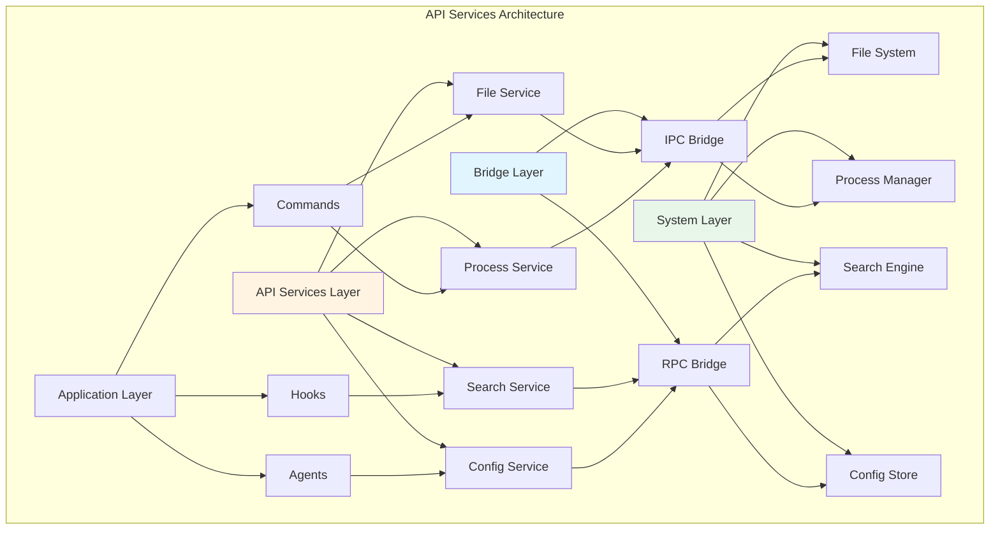

# 第20章 API Services 集成

## 概述

Claude Code 通过 API Services 与外部服务集成，实现代码分析、文件操作、进程管理等功能。API Services 层负责封装底层实现，提供统一的接口给上层调用。本章将深入分析 API Services 的设计模式、认证机制、错误处理和性能优化。

**本章要点：**

- **API 架构**：服务分层、接口设计、依赖注入
- **认证机制**：Token 管理、权限验证、安全传输
- **错误处理**：统一错误格式、重试策略、降级方案
- **性能优化**：连接复用、请求合并、缓存策略
- **源码分析**：核心 API 服务实现
- **实战案例**：常见集成场景

## API 架构

### 服务分层



### 服务接口定义

```typescript
// src/api/types.ts
export type APIServiceConfig = {
  name: string
  version: string
  timeout?: number
  retries?: number
  baseURL?: string
  auth?: AuthConfig
}

export type AuthConfig =
  | { type: 'none' }
  | { type: 'bearer'; token: string }
  | { type: 'basic'; username: string; password: string }
  | { type: 'api-key'; key: string; header?: string }
  | { type: 'oauth2'; accessToken: string; refreshToken?: string }

export type APIRequest<T = unknown> = {
  method: 'GET' | 'POST' | 'PUT' | 'DELETE' | 'PATCH'
  path: string
  params?: Record<string, string | number>
  query?: Record<string, string | number>
  body?: T
  headers?: Record<string, string>
  timeout?: number
}

export type APIResponse<T = unknown> = {
  status: number
  statusText: string
  headers: Record<string, string>
  data: T
  error?: APIError
}

export type APIError = {
  code: string
  message: string
  details?: Record<string, unknown>
  stack?: string
}
```

## 认证机制

### Token 管理

```typescript
// src/api/auth/tokenManager.ts
export class TokenManager {
  private tokens = new Map<string, TokenInfo>()

  async getToken(service: string): Promise<string | null> {
    const tokenInfo = this.tokens.get(service)

    if (!tokenInfo) {
      return null
    }

    // 检查是否过期
    if (tokenInfo.expiresAt && Date.now() > tokenInfo.expiresAt) {
      // 尝试刷新
      if (tokenInfo.refreshToken) {
        return this.refreshToken(service)
      }

      this.tokens.delete(service)
      return null
    }

    return tokenInfo.accessToken
  }

  async setToken(
    service: string,
    accessToken: string,
    options?: {
      refreshToken?: string
      expiresIn?: number
    }
  ): Promise<void> {
    const expiresAt = options?.expiresIn
      ? Date.now() + options.expiresIn * 1000
      : undefined

    this.tokens.set(service, {
      accessToken,
      refreshToken: options?.refreshToken,
      expiresAt,
      createdAt: Date.now(),
    })
  }

  async refreshToken(service: string): Promise<string> {
    const tokenInfo = this.tokens.get(service)

    if (!tokenInfo?.refreshToken) {
      throw new Error(`No refresh token for service: ${service}`)
    }

    // 调用刷新接口
    const response = await fetch(`${this.getBaseURL(service)}/auth/refresh`, {
      method: 'POST',
      headers: {
        'Content-Type': 'application/json',
      },
      body: JSON.stringify({
        refresh_token: tokenInfo.refreshToken,
      }),
    })

    if (!response.ok) {
      this.tokens.delete(service)
      throw new Error('Token refresh failed')
    }

    const data = await response.json()

    await this.setToken(service, data.access_token, {
      refreshToken: data.refresh_token,
      expiresIn: data.expires_in,
    })

    return data.access_token
  }

  private getBaseURL(service: string): string {
    // 从配置中获取 base URL
    return getServiceConfig(service)?.baseURL || ''
  }

  clearToken(service: string): void {
    this.tokens.delete(service)
  }

  clearAllTokens(): void {
    this.tokens.clear()
  }
}

type TokenInfo = {
  accessToken: string
  refreshToken?: string
  expiresAt?: number
  createdAt: number
}
```

### 认证中间件

```typescript
// src/api/auth/authMiddleware.ts
export class AuthMiddleware {
  constructor(private tokenManager: TokenManager) {}

  async authenticate(config: AuthConfig): Promise<Record<string, string>> {
    switch (config.type) {
      case 'none':
        return {}

      case 'bearer':
        return {
          'Authorization': `Bearer ${config.token}`,
        }

      case 'basic':
        const credentials = Buffer.from(
          `${config.username}:${config.password}`
        ).toString('base64')
        return {
          'Authorization': `Basic ${credentials}`,
        }

      case 'api-key':
        const header = config.header || 'X-API-Key'
        return {
          [header]: config.key,
        }

      case 'oauth2':
        return {
          'Authorization': `Bearer ${config.accessToken}`,
        }

      default:
        return {}
    }
  }

  async addAuthHeaders(
    service: string,
    headers: Record<string, string> = {}
  ): Promise<Record<string, string>> {
    const token = await this.tokenManager.getToken(service)

    if (token) {
      return {
        ...headers,
        'Authorization': `Bearer ${token}`,
      }
    }

    return headers
  }
}
```

### 权限验证

```typescript
// src/api/auth/permissionChecker.ts
export type PermissionScope =
  | 'read'
  | 'write'
  | 'delete'
  | 'admin'

export type Permission = {
  resource: string
  scope: PermissionScope
  conditions?: Record<string, unknown>
}

export class PermissionChecker {
  private permissions = new Map<string, Permission[]>()

  async checkPermission(
    service: string,
    resource: string,
    scope: PermissionScope
  ): Promise<boolean> {
    const permissions = this.permissions.get(service) || []

    return permissions.some(p =>
      p.resource === resource &&
      (p.scope === scope || p.scope === 'admin')
    )
  }

  async checkPermissionWithConditions(
    service: string,
    resource: string,
    scope: PermissionScope,
    context: Record<string, unknown>
  ): Promise<boolean> {
    const permissions = this.permissions.get(service) || []

    return permissions.some(p => {
      if (p.resource !== resource && p.resource !== '*') {
        return false
      }

      if (p.scope !== scope && p.scope !== 'admin') {
        return false
      }

      // 检查条件
      if (p.conditions) {
        return this.matchConditions(p.conditions, context)
      }

      return true
    })
  }

  private matchConditions(
    conditions: Record<string, unknown>,
    context: Record<string, unknown>
  ): boolean {
    for (const [key, value] of Object.entries(conditions)) {
      if (context[key] !== value) {
        return false
      }
    }

    return true
  }

  grantPermission(service: string, permission: Permission): void {
    const permissions = this.permissions.get(service) || []
    permissions.push(permission)
    this.permissions.set(service, permissions)
  }

  revokePermission(service: string, resource: string, scope: PermissionScope): void {
    const permissions = this.permissions.get(service) || []
    const filtered = permissions.filter(
      p => !(p.resource === resource && p.scope === scope)
    )
    this.permissions.set(service, filtered)
  }
}
```

## 错误处理

### 统一错误格式

```typescript
// src/api/errors.ts
export class APIError extends Error {
  constructor(
    public code: string,
    message: string,
    public details?: Record<string, unknown>,
    public status?: number
  ) {
    super(message)
    this.name = 'APIError'
  }

  static isAPIError(error: unknown): error is APIError {
    return error instanceof APIError
  }

  static fromResponse(response: APIResponse<unknown>): APIError {
    return new APIError(
      response.error?.code || 'UNKNOWN_ERROR',
      response.error?.message || 'An unknown error occurred',
      response.error?.details,
      response.status
    )
  }

  toJSON(): Record<string, unknown> {
    return {
      name: this.name,
      code: this.code,
      message: this.message,
      details: this.details,
      status: this.status,
      stack: this.stack,
    }
  }
}

export class NetworkError extends APIError {
  constructor(message: string, details?: Record<string, unknown>) {
    super('NETWORK_ERROR', message, details)
    this.name = 'NetworkError'
  }
}

export class AuthenticationError extends APIError {
  constructor(message: string, details?: Record<string, unknown>) {
    super('AUTHENTICATION_ERROR', message, details, 401)
    this.name = 'AuthenticationError'
  }
}

export class AuthorizationError extends APIError {
  constructor(message: string, details?: Record<string, unknown>) {
    super('AUTHORIZATION_ERROR', message, details, 403)
    this.name = 'AuthorizationError'
  }
}

export class NotFoundError extends APIError {
  constructor(resource: string, id?: string) {
    super(
      'NOT_FOUND',
      id ? `${resource} not found: ${id}` : `${resource} not found`,
      { resource, id },
      404
    )
    this.name = 'NotFoundError'
  }
}

export class ValidationError extends APIError {
  constructor(message: string, details?: Record<string, unknown>) {
    super('VALIDATION_ERROR', message, details, 400)
    this.name = 'ValidationError'
  }
}

export class RateLimitError extends APIError {
  constructor(retryAfter?: number) {
    super(
      'RATE_LIMIT_ERROR',
      'Rate limit exceeded',
      { retryAfter },
      429
    )
    this.name = 'RateLimitError'
  }
}

export class ServerError extends APIError {
  constructor(message: string, details?: Record<string, unknown>) {
    super('SERVER_ERROR', message, details, 500)
    this.name = 'ServerError'
  }
}
```

### 重试策略

```typescript
// src/api/retry.ts
export interface RetryOptions {
  maxAttempts?: number
  initialDelay?: number
  maxDelay?: number
  backoffMultiplier?: number
  retryableErrors?: string[]
  onRetry?: (attempt: number, error: Error) => void
}

export async function retryRequest<T>(
  request: () => Promise<T>,
  options: RetryOptions = {}
): Promise<T> {
  const {
    maxAttempts = 3,
    initialDelay = 1000,
    maxDelay = 10000,
    backoffMultiplier = 2,
    retryableErrors = ['NETWORK_ERROR', 'RATE_LIMIT_ERROR', 'SERVER_ERROR'],
    onRetry,
  } = options

  let lastError: Error | null = null

  for (let attempt = 1; attempt <= maxAttempts; attempt++) {
    try {
      return await request()
    } catch (error) {
      lastError = error as Error

      // 最后一次尝试，不再重试
      if (attempt === maxAttempts) {
        break
      }

      // 检查是否可重试
      if (!isRetryableError(error as APIError, retryableErrors)) {
        throw error
      }

      // 计算延迟
      const delay = Math.min(
        initialDelay * Math.pow(backoffMultiplier, attempt - 1),
        maxDelay
      )

      onRetry?.(attempt, lastError)

      // 等待后重试
      await sleep(delay)
    }
  }

  throw lastError
}

function isRetryableError(
  error: APIError,
  retryableErrors: string[]
): boolean {
  if (!(error instanceof APIError)) {
    return false
  }

  // 检查错误码
  if (retryableErrors.includes(error.code)) {
    return true
  }

  // 检查 HTTP 状态码
  if (error.status && error.status >= 500) {
    return true
  }

  if (error.status === 429) {
    return true
  }

  return false
}

function sleep(ms: number): Promise<void> {
  return new Promise(resolve => setTimeout(resolve, ms))
}
```

### 降级方案

```typescript
// src/api/fallback.ts
export interface FallbackOptions<T> {
  fallback: () => Promise<T> | T
  onFallback?: (error: Error) => void
  logFallback?: boolean
}

export async function withFallback<T>(
  primary: () => Promise<T>,
  options: FallbackOptions<T>
): Promise<T> {
  try {
    return await primary()
  } catch (error) {
    if (options.logFallback !== false) {
      console.error('Primary operation failed, using fallback:', error)
    }

    options.onFallback?.(error as Error)

    try {
      return await options.fallback()
    } catch (fallbackError) {
      // 降级也失败，抛出原始错误
      throw error
    }
  }
}

// 使用示例
export async function getServiceConfig(service: string): Promise<ServiceConfig | null> {
  return withFallback(
    // Primary: 从 API 获取
    async () => {
      const response = await fetch(`/api/services/${service}`)
      if (!response.ok) {
        throw new APIError('FETCH_ERROR', 'Failed to fetch service config')
      }
      return response.json()
    },
    // Fallback: 返回默认配置
    {
      fallback: () => {
        console.warn(`Using default config for ${service}`)
        return getDefaultServiceConfig(service)
      },
      onFallback: (error) => {
        logError('Service config fetch failed', error)
      },
    }
  )
}
```

## 性能优化

### 连接复用

```typescript
// src/api/connectionPool.ts
export interface ConnectionOptions {
  maxConnections?: number
  keepAlive?: boolean
  keepAliveTimeout?: number
}

export class ConnectionPool {
  private connections = new Map<string, HTTPConnection>()
  private activeCount = new Map<string, number>()

  constructor(private options: ConnectionOptions = {}) {
    const {
      maxConnections = 10,
      keepAlive = true,
      keepAliveTimeout = 30000,
    } = options

    this.options = { maxConnections, keepAlive, keepAliveTimeout }
  }

  async getConnection(baseURL: string): Promise<HTTPConnection> {
    let connection = this.connections.get(baseURL)

    if (!connection || !connection.isConnected()) {
      connection = new HTTPConnection(baseURL, this.options)
      this.connections.set(baseURL, connection)
    }

    const activeCount = this.activeCount.get(baseURL) || 0
    const maxConnections = this.options.maxConnections || 10

    if (activeCount >= maxConnections) {
      // 等待可用连接
      await this.waitForAvailableConnection(baseURL)
    }

    this.activeCount.set(baseURL, activeCount + 1)

    return connection
  }

  releaseConnection(baseURL: string): void {
    const activeCount = this.activeCount.get(baseURL) || 0
    this.activeCount.set(baseURL, Math.max(0, activeCount - 1))
  }

  private async waitForAvailableConnection(baseURL: string): Promise<void> {
    return new Promise(resolve => {
      const checkInterval = setInterval(() => {
        const activeCount = this.activeCount.get(baseURL) || 0
        const maxConnections = this.options.maxConnections || 10

        if (activeCount < maxConnections) {
          clearInterval(checkInterval)
          resolve()
        }
      }, 100)
    })
  }

  closeAll(): void {
    for (const connection of this.connections.values()) {
      connection.close()
    }

    this.connections.clear()
    this.activeCount.clear()
  }
}

class HTTPConnection {
  private socket?: net.Socket

  constructor(
    private baseURL: string,
    private options: ConnectionOptions
  ) {}

  isConnected(): boolean {
    return this.socket?.readyState === 'open'
  }

  async request(request: APIRequest): Promise<APIResponse> {
    // 实现请求逻辑
    const url = new URL(request.path, this.baseURL)

    if (request.query) {
      Object.entries(request.query).forEach(([key, value]) => {
        url.searchParams.set(key, String(value))
      })
    }

    const response = await fetch(url.toString(), {
      method: request.method,
      headers: request.headers,
      body: request.body ? JSON.stringify(request.body) : undefined,
    })

    return {
      status: response.status,
      statusText: response.statusText,
      headers: Object.fromEntries(response.headers.entries()),
      data: await response.json(),
    }
  }

  close(): void {
    if (this.socket) {
      this.socket.end()
      this.socket = undefined
    }
  }
}
```

### 请求合并

```typescript
// src/api/requestBatcher.ts
export interface BatchRequest<T> {
  id: string
  request: APIRequest<T>
  resolve: (value: APIResponse) => void
  reject: (error: Error) => void
}

export class RequestBatcher {
  private batch = new Map<string, BatchRequest<unknown>[]>()
  private batchTimers = new Map<string, NodeJS.Timeout>()
  private readonly batchTimeout = 100 // 100ms
  private readonly maxBatchSize = 50

  async request<T>(request: APIRequest<T>): Promise<APIResponse> {
    const batchKey = this.getBatchKey(request)

    return new Promise((resolve, reject) => {
      const batchItem: BatchRequest<T> = {
        id: `${Date.now()}-${Math.random()}`,
        request,
        resolve: resolve as (value: APIResponse) => void,
        reject: reject,
      }

      // 添加到批次
      if (!this.batch.has(batchKey)) {
        this.batch.set(batchKey, [])
      }

      const batch = this.batch.get(batchKey)!
      batch.push(batchItem)

      // 达到批次大小或超时，执行请求
      if (batch.length >= this.maxBatchSize) {
        this.executeBatch(batchKey)
      } else {
        this.scheduleBatch(batchKey)
      }
    })
  }

  private getBatchKey<T>(request: APIRequest<T>): string {
    // 根据请求特征生成批次键
    return `${request.method}:${request.path}`
  }

  private scheduleBatch(batchKey: string): void {
    if (this.batchTimers.has(batchKey)) {
      return
    }

    const timer = setTimeout(() => {
      this.executeBatch(batchKey)
    }, this.batchTimeout)

    this.batchTimers.set(batchKey, timer)
  }

  private async executeBatch(batchKey: string): void {
    // 清除定时器
    const timer = this.batchTimers.get(batchKey)
    if (timer) {
      clearTimeout(timer)
      this.batchTimers.delete(batchKey)
    }

    const batch = this.batch.get(batchKey)
    if (!batch || batch.length === 0) {
      return
    }

    this.batch.delete(batchKey)

    try {
      // 合并请求
      const mergedRequest = this.mergeRequests(batch)
      const response = await fetch(mergedRequest.url, mergedRequest.options)

      // 分解响应
      const responses = this.splitResponse(response, batch)

      // 通知所有等待者
      batch.forEach((item, index) => {
        item.resolve(responses[index])
      })
    } catch (error) {
      // 所有请求失败
      batch.forEach(item => {
        item.reject(error as Error)
      })
    }
  }

  private mergeRequests<T>(batch: BatchRequest<T>[]): {
    url: string
    options: RequestInit
  } {
    // 实现请求合并逻辑
    const firstRequest = batch[0].request

    return {
      url: firstRequest.path,
      options: {
        method: firstRequest.method,
        headers: firstRequest.headers,
        body: JSON.stringify({
          requests: batch.map(item => ({
            id: item.id,
            params: item.request.params,
            query: item.request.query,
            body: item.request.body,
          })),
        }),
      },
    }
  }

  private splitResponse(
    response: Response,
    batch: BatchRequest<unknown>[]
  ): APIResponse[] {
    // 实现响应分解逻辑
    const data = response.json() as { responses: Array<{ id: string; result: unknown }> }

    return batch.map(item => {
      const result = data.responses.find(r => r.id === item.id)
      return {
        status: response.status,
        statusText: response.statusText,
        headers: Object.fromEntries(response.headers.entries()),
        data: result?.result,
      }
    })
  }
}
```

## 源码分析

### File Service 实现

```typescript
// src/api/services/fileService.ts
export class FileService {
  private cache: LRUCache<string, string>
  private watcher?: FSWatcher

  constructor(
    private bridge: IPCBridge,
    private options: FileServiceOptions = {}
  ) {
    const {
      cacheSize = 1000,
      cacheTTL = 60000,
    } = options

    this.cache = new LRUCache(cacheSize, cacheTTL)
  }

  async readFile(path: string): Promise<string> {
    // 检查缓存
    const cached = this.cache.get(path)
    if (cached !== undefined) {
      return cached
    }

    // 通过 bridge 读取
    const content = await this.bridge.request<string>('fs.readFile', { path })

    // 缓存结果
    this.cache.set(path, content)

    return content
  }

  async writeFile(path: string, content: string): Promise<void> {
    await this.bridge.request('fs.writeFile', { path, content })

    // 清除缓存
    this.cache.delete(path)

    // 通知文件变更
    this.notifyFileChange(path)
  }

  async stat(path: string): Promise<FileStats> {
    return this.bridge.request<FileStats>('fs.stat', { path })
  }

  async readdir(path: string): Promise<string[]> {
    return this.bridge.request<string[]>('fs.readdir', { path })
  }

  // 批量读取
  async readBatch(paths: string[]): Promise<string[]> {
    return this.bridge.request<string[]>('fs.readBatch', { paths })
  }

  // 流式读取
  async createReadStream(path: string): Promise<Readable> {
    const streamId = `read-${path}-${Date.now()}`

    await this.bridge.request('fs.createReadStream', { path, streamId })

    return new Readable({
      read() {
        // 数据通过 bridge 事件到达
      },
    })
  }

  // 文件监听
  async watch(path: string, callback: (event: FileChangeEvent) => void): Promise<FSWatcher> {
    if (!this.watcher) {
      this.watcher = await this.setupWatcher()
    }

    return this.watcher.watch(path, callback)
  }

  private async setupWatcher(): Promise<FSWatcher> {
    return new FSWatcher(this.bridge)
  }

  private notifyFileChange(path: string): void {
    this.watcher?.notify(path)
  }
}

type FileServiceOptions = {
  cacheSize?: number
  cacheTTL?: number
}

type FileStats = {
  size: number
  mode: number
  atime: Date
  mtime: Date
  ctime: Date
}

type FileChangeEvent = {
  type: 'change' | 'rename' | 'delete'
  path: string
}
```

### Process Service 实现

```typescript
// src/api/services/processService.ts
export class ProcessService {
  private processes = new Map<string, ProcessHandle>()

  constructor(private bridge: IPCBridge) {}

  async spawn(command: string, args?: string[], options?: SpawnOptions): Promise<ProcessHandle> {
    const processId = `process-${Date.now()}-${Math.random()}`

    await this.bridge.request('process.spawn', {
      command,
      args,
      options,
      processId,
    })

    const handle = new ProcessHandle(processId, this.bridge)
    this.processes.set(processId, handle)

    return handle
  }

  async exec(command: string, options?: ExecOptions): Promise<ExecResult> {
    return this.bridge.request<ExecResult>('process.exec', {
      command,
      options,
    })
  }

  async kill(pid: number, signal?: string): Promise<void> {
    await this.bridge.request('process.kill', { pid, signal })
  }

  async list(): Promise<ProcessInfo[]> {
    return this.bridge.request<ProcessInfo[]>('process.list')
  }

  getProcess(processId: string): ProcessHandle | undefined {
    return this.processes.get(processId)
  }
}

export class ProcessHandle extends EventEmitter {
  constructor(
    private processId: string,
    private bridge: IPCBridge
  ) {
    super()
    this.setupEventHandlers()
  }

  private setupEventHandlers(): void {
    this.bridge.on('message', (message: BridgeMessage) => {
      if (message.event === 'process.stdout' && message.metadata?.processId === this.processId) {
        this.emit('stdout', message.payload)
      } else if (message.event === 'process.stderr' && message.metadata?.processId === this.processId) {
        this.emit('stderr', message.payload)
      } else if (message.event === 'process.exit' && message.metadata?.processId === this.processId) {
        this.emit('exit', message.payload)
        this.removeAllListeners()
      }
    })
  }

  async write(data: string): Promise<void> {
    return this.bridge.request('process.stdin', {
      processId: this.processId,
      data,
    })
  }

  async kill(signal?: string): Promise<void> {
    await this.bridge.request('process.kill', {
      processId: this.processId,
      signal,
    })

    this.removeAllListeners()
  }
}

type SpawnOptions = {
  cwd?: string
  env?: Record<string, string>
  stdio?: 'pipe' | 'inherit' | 'ignore'
}

type ExecOptions = {
  cwd?: string
  env?: Record<string, string>
  timeout?: number
  killSignal?: string
}

type ExecResult = {
  stdout: string
  stderr: string
  exitCode: number | null
}

type ProcessInfo = {
  pid: number
  ppid: number
  command: string
  args: string[]
  cpu: number
  memory: number
}
```

## 实战案例

### 案例1：文件搜索 API

```typescript
// examples/fileSearchAPI.ts
class FileSearchAPI {
  constructor(private apiService: APIService) {}

  async search(query: string, options?: SearchOptions): Promise<SearchResult[]> {
    return this.apiService.request<SearchResult[]>({
      method: 'POST',
      path: '/api/search',
      body: {
        query,
        options: {
          caseSensitive: false,
          includePattern: undefined,
          excludePattern: undefined,
          maxResults: 100,
          ...options,
        },
      },
    })
  }

  async searchInFile(
    filePath: string,
    pattern: string,
    options?: SearchInFileOptions
  ): Promise<SearchMatch[]> {
    return this.apiService.request<SearchMatch[]>({
      method: 'POST',
      path: '/api/search/file',
      body: {
        filePath,
        pattern,
        options: {
          caseSensitive: false,
          regex: false,
          ...options,
        },
      },
    })
  }
}

// 使用示例
const searchAPI = new FileSearchAPI(apiService)

const results = await searchAPI.search('function', {
  includePattern: '**/*.ts',
  excludePattern: '**/node_modules/**',
  maxResults: 50,
})

for (const result of results) {
  console.log(`${result.file}:${result.line}:${result.column}: ${result.text}`)
}
```

### 案例2：进程管理 API

```typescript
// examples/processAPI.ts
class ProcessAPI {
  constructor(private apiService: APIService) {}

  async startScript(script: string, args?: string[]): Promise<string> {
    const response = await this.apiService.request<{ processId: string }>({
      method: 'POST',
      path: '/api/process/start',
      body: { command: script, args },
    })

    return response.processId
  }

  async stopProcess(processId: string): Promise<void> {
    await this.apiService.request({
      method: 'POST',
      path: `/api/process/${processId}/stop`,
    })
  }

  async getProcessOutput(processId: string): Promise<ProcessOutput> {
    return this.apiService.request<ProcessOutput>({
      method: 'GET',
      path: `/api/process/${processId}/output`,
    })
  }

  async listProcesses(): Promise<ProcessInfo[]> {
    return this.apiService.request<ProcessInfo[]>({
      method: 'GET',
      path: '/api/processes',
    })
  }
}

// 使用示例
const processAPI = new ProcessAPI(apiService)

// 启动测试脚本
const processId = await processAPI.startScript('npm', ['test'])

// 等待完成
await sleep(5000)

// 获取输出
const output = await processAPI.getProcessOutput(processId)
console.log('stdout:', output.stdout)
console.log('stderr:', output.stderr)

// 停止进程
await processAPI.stopProcess(processId)
```

## 最佳实践

### 1. API 设计

- **RESTful 风格**：遵循 REST 设计原则
- **版本管理**：使用 API 版本控制
- **文档完整**：提供清晰的 API 文档

### 2. 错误处理

- **统一格式**：使用统一的错误响应格式
- **详细错误信息**：提供有用的错误消息和堆栈
- **适当的 HTTP 状态码**：正确使用 HTTP 状态码

### 3. 性能优化

- **连接复用**：使用 HTTP 连接池
- **请求批处理**：合并多个小请求
- **智能缓存**：缓存频繁访问的数据

### 4. 安全考虑

- **认证授权**：实现完善的认证和授权机制
- **数据验证**：验证所有输入数据
- **速率限制**：防止 API 滥用

## 总结

API Services 的核心特性：

1. **分层架构**：清晰的服务分层和职责划分
2. **统一接口**：一致的 API 设计和调用方式
3. **完善认证**：多种认证机制和权限验证
4. **错误处理**：统一的错误格式和处理策略
5. **性能优化**：连接复用、请求合并、智能缓存
6. **易于扩展**：简单添加新服务和功能

掌握 API Services，可以构建高效、可靠、易维护的服务集成层。
