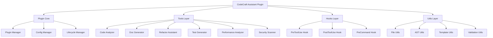

# 第22章 综合实战项目：智能代码助手

## 概述

本章将通过构建一个完整的智能代码助手插件，综合运用前面章节学习的所有核心概念。这个项目将涵盖插件开发、自定义工具、Hooks 系统、错误处理、性能优化、安全实践和平台兼容性等关键技能。

**本章要点：**

- **项目架构**：完整的插件架构设计
- **功能实现**：多个实用工具的完整实现
- **最佳实践**：综合运用各种最佳实践
- **代码质量**：完整的测试和文档
- **部署发布**：插件的打包和发布流程

## 项目简介

### 项目名称：CodeCraft Assistant

**项目定位**：一个智能代码助手插件，为开发者提供实用的代码分析和辅助功能。

**核心功能**：

1. **代码分析器**：分析代码复杂度、依赖关系、潜在问题
2. **文档生成器**：自动生成代码文档和注释
3. **重构助手**：提供智能重构建议
4. **测试生成器**：自动生成单元测试
5. **性能分析器**：分析代码性能瓶颈
6. **安全扫描器**：检测常见安全问题

**技术栈**：

- **运行时**：Node.js 18+
- **语言**：TypeScript 5+
- **框架**：Claude Code Plugin SDK
- **工具库**：AST Parser、Template Engine、File System
- **测试**：Jest、Testing Library
- **构建**：TSC、Rollup
- **文档**：TypeDoc

## 项目架构

### 整体架构



### 目录结构

```
codecraft-assistant/
├── src/
│   ├── core/
│   │   ├── plugin.ts          # 插件核心
│   │   ├── config.ts          # 配置管理
│   │   └── lifecycle.ts       # 生命周期管理
│   ├── tools/
│   │   ├── analyzer/
│   │   │   ├── index.ts       # 代码分析器
│   │   │   ├── complexity.ts  # 复杂度分析
│   │   │   └── dependencies.ts # 依赖分析
│   │   ├── generator/
│   │   │   ├── index.ts       # 文档生成器
│   │   │   └── templates.ts   # 模板引擎
│   │   ├── refactor/
│   │   │   ├── index.ts       # 重构助手
│   │   │   └── suggestions.ts # 重构建议
│   │   ├── testing/
│   │   │   ├── index.ts       # 测试生成器
│   │   │   └── frameworks.ts  # 测试框架适配
│   │   ├── performance/
│   │   │   ├── index.ts       # 性能分析器
│   │   │   └── profiler.ts    # 性能分析
│   │   └── security/
│   │       ├── index.ts       # 安全扫描器
│   │       └── patterns.ts    # 安全模式
│   ├── hooks/
│   │   ├── pre-tool.ts        # PreToolUse Hook
│   │   ├── post-tool.ts       # PostToolUse Hook
│   │   └── pre-command.ts     # PreCommand Hook
│   ├── utils/
│   │   ├── file.ts            # 文件工具
│   │   ├── ast.ts             # AST 工具
│   │   ├── template.ts        # 模板工具
│   │   └── validation.ts      # 验证工具
│   └── index.ts               # 入口文件
├── tests/
│   ├── unit/                  # 单元测试
│   ├── integration/           # 集成测试
│   └── fixtures/              # 测试数据
├── templates/                 # 文档模板
├── docs/                      # 文档
├── package.json
├── tsconfig.json
├── jest.config.js
└── README.md
```

## 插件核心实现

### 插件入口

```typescript
// src/index.ts
import { createPlugin } from '@claude-code/plugin-sdk'
import { PluginCore } from './core/plugin'
import { config } from './core/config'
import { tools } from './tools'
import { hooks } from './hooks'

const plugin = createPlugin({
  name: 'codecraft-assistant',
  version: '1.0.0',
  description: '智能代码助手插件',
  author: 'CodeCraft Team',

  // 配置
  config,

  // 工具
  tools: {
    analyzeCode: tools.analyzeCode,
    generateDoc: tools.generateDoc,
    suggestRefactor: tools.suggestRefactor,
    generateTest: tools.generateTest,
    analyzePerformance: tools.analyzePerformance,
    scanSecurity: tools.scanSecurity,
  },

  // Hooks
  hooksConfig: {
    PreToolUse: [
      {
        pattern: 'Bash',
        enabled: true,
        hooks: [
          {
            pattern: 'npm install|npm rebuild',
            enabled: true,
            description: '等待 package.json 更新',
            execute: hooks.waitForPackageJson,
          },
        ],
      },
    ],
    PostToolUse: [
      {
        pattern: 'Edit|Write',
        enabled: true,
        hooks: [
          {
            pattern: '*',
            enabled: true,
            description: '自动代码检查',
            execute: hooks.autoCodeCheck,
          },
        ],
      },
    ],
  },

  // 初始化
  async onLoad(core) {
    const pluginCore = new PluginCore(core)
    await pluginCore.initialize()

    core.logger.info('CodeCraft Assistant loaded successfully')
  },

  // 清理
  async onUnload(core) {
    const pluginCore = new PluginCore(core)
    await pluginCore.cleanup()

    core.logger.info('CodeCraft Assistant unloaded')
  },
})

export default plugin
```

### 插件核心

```typescript
// src/core/plugin.ts
import type { ClaudeCore } from '@claude-code/plugin-sdk'

export class PluginCore {
  private cache = new Map<string, any>()
  private performanceMetrics = new Map<string, number[]>()

  constructor(private core: ClaudeCore) {}

  async initialize(): Promise<void> {
    // 初始化缓存
    await this.initializeCache()

    // 初始化性能监控
    this.setupPerformanceMonitoring()

    // 初始化安全扫描
    await this.initializeSecurityScanner()

    this.core.logger.info('Plugin core initialized')
  }

  async cleanup(): Promise<void> {
    // 清理缓存
    this.cache.clear()

    // 保存性能指标
    this.savePerformanceMetrics()

    this.core.logger.info('Plugin core cleaned up')
  }

  // 缓存管理
  private async initializeCache(): Promise<void> {
    // 实现缓存初始化
  }

  get<T>(key: string): T | undefined {
    return this.cache.get(key)
  }

  set<T>(key: string, value: T): void {
    this.cache.set(key, value)
  }

  // 性能监控
  private setupPerformanceMonitoring(): void {
    // 实现性能监控
  }

  recordPerformance(operation: string, duration: number): void {
    if (!this.performanceMetrics.has(operation)) {
      this.performanceMetrics.set(operation, [])
    }
    this.performanceMetrics.get(operation)!.push(duration)
  }

  // 安全扫描
  private async initializeSecurityScanner(): Promise<void> {
    // 实现安全扫描初始化
  }

  private savePerformanceMetrics(): void {
    // 保存性能指标
  }
}
```

### 配置管理

```typescript
// src/core/config.ts
import type { PluginConfig } from '@claude-code/plugin-sdk'

export const config: PluginConfig = {
  // 默认配置
  defaults: {
    // 分析器配置
    analyzer: {
      maxComplexity: 10,
      maxDependencies: 20,
      excludePatterns: ['node_modules/**', 'dist/**', 'build/**'],
    },

    // 文档生成器配置
    docGenerator: {
      style: 'javadoc',
      includeTypes: true,
      includeExamples: true,
      language: 'zh-CN',
    },

    // 重构助手配置
    refactorAssistant: {
      severity: 'medium',
      autoFix: false,
      suggestions: 5,
    },

    // 测试生成器配置
    testGenerator: {
      framework: 'jest',
      coverage: 80,
      mocks: true,
    },

    // 性能分析器配置
    performanceAnalyzer: {
      threshold: 100,
      iterations: 1000,
    },

    // 安全扫描器配置
    securityScanner: {
      severity: 'high',
      patterns: 'owasp-top-10',
    },
  },

  // 配置schema
  schema: {
    type: 'object',
    properties: {
      analyzer: {
        type: 'object',
        properties: {
          maxComplexity: { type: 'number' },
          maxDependencies: { type: 'number' },
          excludePatterns: { type: 'array', items: { type: 'string' } },
        },
      },
      // ... 其他配置
    },
  },

  // 配置验证
  validate(config: unknown): boolean {
    // 实现配置验证
    return true
  },
}
```

## 工具实现

### 1. 代码分析器

```typescript
// src/tools/analyzer/index.ts
import { buildTool } from '@claude-code/plugin-sdk'
import { ComplexityAnalyzer } from './complexity'
import { DependencyAnalyzer } from './dependencies'
import { PluginCore } from '../../core/plugin'

export function createCodeAnalyzer(pluginCore: PluginCore) {
  return buildTool({
    name: 'analyze_code',
    description: '分析代码复杂度、依赖关系和潜在问题',
    parameters: {
      type: 'object',
      properties: {
        path: {
          type: 'string',
          description: '要分析的文件或目录路径',
        },
        type: {
          type: 'string',
          enum: ['complexity', 'dependencies', 'issues', 'all'],
          description: '分析类型',
          default: 'all',
        },
        output: {
          type: 'string',
          enum: ['console', 'json', 'markdown'],
          description: '输出格式',
          default: 'console',
        },
      },
      required: ['path'],
    },

    async execute(params) {
      const { path, type = 'all', output = 'console' } = params

      // 验证路径
      if (!existsSync(path)) {
        throw new Error(`路径不存在: ${path}`)
      }

      // 性能监控
      const startTime = Date.now()

      try {
        // 创建分析器
        const complexityAnalyzer = new ComplexityAnalyzer()
        const dependencyAnalyzer = new DependencyAnalyzer()

        const results: AnalysisResult = {
          path,
          timestamp: new Date().toISOString(),
          complexity: null,
          dependencies: null,
          issues: [],
        }

        // 执行分析
        if (type === 'complexity' || type === 'all') {
          results.complexity = await complexityAnalyzer.analyze(path)
        }

        if (type === 'dependencies' || type === 'all') {
          results.dependencies = await dependencyAnalyzer.analyze(path)
        }

        if (type === 'issues' || type === 'all') {
          results.issues = await this.detectIssues(path)
        }

        // 记录性能
        const duration = Date.now() - startTime
        pluginCore.recordPerformance('code_analysis', duration)

        // 格式化输出
        return this.formatOutput(results, output)
      } catch (error) {
        throw new Error(`代码分析失败: ${error.message}`)
      }
    },

    async formatOutput(results: AnalysisResult, format: string) {
      switch (format) {
        case 'json':
          return JSON.stringify(results, null, 2)

        case 'markdown':
          return this.generateMarkdown(results)

        case 'console':
        default:
          return this.generateConsoleOutput(results)
      }
    },

    async generateMarkdown(results: AnalysisResult): Promise<string> {
      const lines: string[] = []

      lines.push(`# 代码分析报告`)
      lines.push(`**路径**: ${results.path}`)
      lines.push(`**时间**: ${results.timestamp}`)
      lines.push('')

      // 复杂度分析
      if (results.complexity) {
        lines.push('## 复杂度分析')
        lines.push('')
        lines.push(`- 平均复杂度: ${results.complexity.average.toFixed(2)}`)
        lines.push(`- 最高复杂度: ${results.complexity.max}`)
        lines.push(`- 总函数数: ${results.complexity.functionCount}`)
        lines.push('')

        if (results.complexity.highComplexityFunctions.length > 0) {
          lines.push('### 高复杂度函数')
          results.complexity.highComplexityFunctions.forEach(fn => {
            lines.push(`- \`${fn.name}\`: ${fn.complexity}`)
          })
          lines.push('')
        }
      }

      // 依赖分析
      if (results.dependencies) {
        lines.push('## 依赖分析')
        lines.push('')
        lines.push(`- 总依赖数: ${results.dependencies.total}`)
        lines.push(`- 外部依赖: ${results.dependencies.external}`)
        lines.push(`- 内部依赖: ${results.dependencies.internal}`)
        lines.push('')
      }

      // 问题检测
      if (results.issues.length > 0) {
        lines.push('## 检测到的问题')
        lines.push('')
        results.issues.forEach(issue => {
          lines.push(`### ${issue.severity.toUpperCase()}: ${issue.message}`)
          lines.push(`**位置**: ${issue.file}:${issue.line}`)
          lines.push(`**建议**: ${issue.suggestion}`)
          lines.push('')
        })
      } else {
        lines.push('## 未检测到问题 ✅')
        lines.push('')
      }

      return lines.join('\n')
    },

    async generateConsoleOutput(results: AnalysisResult): Promise<string> {
      const lines: string[] = []

      lines.push('📊 代码分析结果')
      lines.push('─'.repeat(50))

      if (results.complexity) {
        lines.push(`\n🔍 复杂度分析:`)
        lines.push(`  平均: ${results.complexity.average.toFixed(2)}`)
        lines.push(`  最高: ${results.complexity.max}`)
        lines.push(`  函数数: ${results.complexity.functionCount}`)
      }

      if (results.dependencies) {
        lines.push(`\n📦 依赖分析:`)
        lines.push(`  总计: ${results.dependencies.total}`)
        lines.push(`  外部: ${results.dependencies.external}`)
        lines.push(`  内部: ${results.dependencies.internal}`)
      }

      if (results.issues.length > 0) {
        lines.push(`\n⚠️  检测到 ${results.issues.length} 个问题:`)
        results.issues.slice(0, 5).forEach(issue => {
          lines.push(`  [${issue.severity}] ${issue.message}`)
        })
      } else {
        lines.push(`\n✅ 未检测到问题`)
      }

      return lines.join('\n')
    },

    async detectIssues(path: string): Promise<Issue[]> {
      const issues: Issue[] = []

      // 实现问题检测逻辑
      // 1. 未使用的导入
      // 2. 未使用的变量
      // 3. 潜在的内存泄漏
      // 4. 不安全的模式
      // 5. 性能问题

      return issues
    },
  })
}

type AnalysisResult = {
  path: string
  timestamp: string
  complexity: ComplexityResult | null
  dependencies: DependencyResult | null
  issues: Issue[]
}

type ComplexityResult = {
  average: number
  max: number
  functionCount: number
  highComplexityFunctions: Array<{
    name: string
    complexity: number
    file: string
    line: number
  }>
}

type DependencyResult = {
  total: number
  external: number
  internal: number
  circular: Array<{
    from: string
    to: string
  }>
}

type Issue = {
  severity: 'error' | 'warning' | 'info'
  message: string
  file: string
  line: number
  suggestion: string
}
```

### 2. 文档生成器

```typescript
// src/tools/generator/index.ts
import { buildTool } from '@claude-code/plugin-sdk'
import { TemplateEngine } from './templates'
import { parseAST } from '../../utils/ast'

export function createDocGenerator() {
  return buildTool({
    name: 'generate_doc',
    description: '自动生成代码文档',
    parameters: {
      type: 'object',
      properties: {
        path: {
          type: 'string',
          description: '要生成文档的文件路径',
        },
        format: {
          type: 'string',
          enum: ['javadoc', 'jsdoc', 'tsdoc'],
          description: '文档格式',
          default: 'jsdoc',
        },
        includeTypes: {
          type: 'boolean',
          description: '是否包含类型信息',
          default: true,
        },
        includeExamples: {
          type: 'boolean',
          description: '是否包含使用示例',
          default: true,
        },
      },
      required: ['path'],
    },

    async execute(params) {
      const { path, format = 'jsdoc', includeTypes = true, includeExamples = true } = params

      // 验证路径
      if (!existsSync(path)) {
        throw new Error(`文件不存在: ${path}`)
      }

      try {
        // 解析 AST
        const ast = await parseAST(path)

        // 生成文档
        const templateEngine = new TemplateEngine()
        const documentation = await templateEngine.generate({
          ast,
          format,
          includeTypes,
          includeExamples,
        })

        return {
          success: true,
          documentation,
          stats: {
            functions: documentation.functions.length,
            classes: documentation.classes.length,
            interfaces: documentation.interfaces.length,
          },
        }
      } catch (error) {
        throw new Error(`文档生成失败: ${error.message}`)
      }
    },
  })
}
```

### 3. 重构助手

```typescript
// src/tools/refactor/index.ts
import { buildTool } from '@claude-code/plugin-sdk'
import { RefactorSuggestions } from './suggestions'

export function createRefactorAssistant() {
  return buildTool({
    name: 'suggest_refactor',
    description: '提供智能重构建议',
    parameters: {
      type: 'object',
      properties: {
        path: {
          type: 'string',
          description: '要分析的代码路径',
        },
        severity: {
          type: 'string',
          enum: ['low', 'medium', 'high'],
          description: '建议的严重程度',
          default: 'medium',
        },
        maxSuggestions: {
          type: 'number',
          description: '最大建议数量',
          default: 5,
        },
      },
      required: ['path'],
    },

    async execute(params) {
      const { path, severity = 'medium', maxSuggestions = 5 } = params

      try {
        // 分析代码
        const suggestions = new RefactorSuggestions()

        // 生成建议
        const recommendations = await suggestions.generate({
          path,
          severity,
          maxSuggestions,
        })

        return {
          success: true,
          recommendations,
          summary: {
            total: recommendations.length,
            bySeverity: this.groupBySeverity(recommendations),
          },
        }
      } catch (error) {
        throw new Error(`重构建议生成失败: ${error.message}`)
      }
    },

    groupBySeverity(recommendations: RefactorRecommendation[]) {
      return recommendations.reduce((acc, rec) => {
        acc[rec.severity] = (acc[rec.severity] || 0) + 1
        return acc
      }, {} as Record<string, number>)
    },
  })
}

type RefactorRecommendation = {
  severity: 'low' | 'medium' | 'high'
  title: string
  description: string
  code: string
  suggestion: string
  benefit: string
  file: string
  line: number
}
```

### 4. 测试生成器

```typescript
// src/tools/testing/index.ts
import { buildTool } from '@claude-code/plugin-sdk'
import { FrameworkAdapter } from './frameworks'

export function createTestGenerator() {
  return buildTool({
    name: 'generate_test',
    description: '自动生成单元测试',
    parameters: {
      type: 'object',
      properties: {
        path: {
          type: 'string',
          description: '要测试的文件路径',
        },
        framework: {
          type: 'string',
          enum: ['jest', 'mocha', 'vitest'],
          description: '测试框架',
          default: 'jest',
        },
        coverage: {
          type: 'number',
          description: '目标覆盖率（百分比）',
          default: 80,
        },
        includeMocks: {
          type: 'boolean',
          description: '是否包含 mock',
          default: true,
        },
      },
      required: ['path'],
    },

    async execute(params) {
      const { path, framework = 'jest', coverage = 80, includeMocks = true } = params

      try {
        // 获取框架适配器
        const adapter = new FrameworkAdapter(framework)

        // 生成测试
        const testCode = await adapter.generate({
          sourcePath: path,
          coverage,
          includeMocks,
        })

        return {
          success: true,
          testCode,
          framework,
          estimatedCoverage: coverage,
        }
      } catch (error) {
        throw new Error(`测试生成失败: ${error.message}`)
      }
    },
  })
}
```

### 5. 性能分析器

```typescript
// src/tools/performance/index.ts
import { buildTool } from '@claude-code/plugin-sdk'
import { Profiler } from './profiler'

export function createPerformanceAnalyzer() {
  return buildTool({
    name: 'analyze_performance',
    description: '分析代码性能瓶颈',
    parameters: {
      type: 'object',
      properties: {
        path: {
          type: 'string',
          description: '要分析的代码路径',
        },
        threshold: {
          type: 'number',
          description: '性能阈值（毫秒）',
          default: 100,
        },
        iterations: {
          type: 'number',
          description: '测试迭代次数',
          default: 1000,
        },
      },
      required: ['path'],
    },

    async execute(params) {
      const { path, threshold = 100, iterations = 1000 } = params

      try {
        const profiler = new Profiler()

        // 执行性能分析
        const results = await profiler.analyze({
          path,
          threshold,
          iterations,
        })

        return {
          success: true,
          results,
          bottlenecks: results.bottlenecks,
          recommendations: results.recommendations,
        }
      } catch (error) {
        throw new Error(`性能分析失败: ${error.message}`)
      }
    },
  })
}
```

### 6. 安全扫描器

```typescript
// src/tools/security/index.ts
import { buildTool } from '@claude-code/plugin-sdk'
import { SecurityPatterns } from './patterns'

export function createSecurityScanner() {
  return buildTool({
    name: 'scan_security',
    description: '扫描代码安全问题',
    parameters: {
      type: 'object',
      properties: {
        path: {
          type: 'string',
          description: '要扫描的代码路径',
        },
        severity: {
          type: 'string',
          enum: ['low', 'medium', 'high', 'critical'],
          description: '最低严重程度',
          default: 'high',
        },
        patterns: {
          type: 'string',
          enum: ['owasp-top-10', 'custom', 'all'],
          description: '扫描模式集',
          default: 'owasp-top-10',
        },
      },
      required: ['path'],
    },

    async execute(params) {
      const { path, severity = 'high', patterns = 'owasp-top-10' } = params

      try {
        const scanner = new SecurityPatterns()

        // 执行安全扫描
        const vulnerabilities = await scanner.scan({
          path,
          severity,
          patterns,
        })

        return {
          success: true,
          vulnerabilities,
          summary: {
            total: vulnerabilities.length,
            bySeverity: this.groupBySeverity(vulnerabilities),
            byType: this.groupByType(vulnerabilities),
          },
        }
      } catch (error) {
        throw new Error(`安全扫描失败: ${error.message}`)
      }
    },

    groupBySeverity(vulnerabilities: Vulnerability[]) {
      return vulnerabilities.reduce((acc, vuln) => {
        acc[vuln.severity] = (acc[vuln.severity] || 0) + 1
        return acc
      }, {} as Record<string, number>)
    },

    groupByType(vulnerabilities: Vulnerability[]) {
      return vulnerabilities.reduce((acc, vuln) => {
        acc[vuln.type] = (acc[vuln.type] || 0) + 1
        return acc
      }, {} as Record<string, number>)
    },
  })
}

type Vulnerability = {
  severity: 'low' | 'medium' | 'high' | 'critical'
  type: string
  message: string
  file: string
  line: number
  recommendation: string
  cwe?: string
}
```

## Hooks 实现

### PreToolUse Hook

```typescript
// src/hooks/pre-tool.ts
export async function waitForPackageJson({ input }: { input: any }) {
  const { waitForFileChange } = await import('../utils/fileChanged')
  const packageJsonPath = join(process.cwd(), 'package.json')

  try {
    await waitForFileChange(packageJsonPath, 3000)
    console.log('✅ package.json 已更新')
  } catch (error) {
    console.log('⏱️  package.json 更新超时，继续执行')
  }
}

export async function validateBeforeEdit({ toolUse }: { toolUse: any }) {
  // 在编辑前验证代码
  if (toolUse.name === 'Edit' || toolUse.name === 'Write') {
    // 执行代码验证
    console.log('🔍 执行代码验证...')

    // 验证逻辑
    const validation = await validateCode(toolUse.input)

    if (!validation.valid) {
      console.log('⚠️  验证失败:', validation.errors)
      // 可以选择阻止操作或仅警告
    }
  }
}
```

### PostToolUse Hook

```typescript
// src/hooks/post-tool.ts
export async function autoCodeCheck({ result }: { result: any }) {
  // 自动代码检查
  if (result.error) {
    console.log('❌ 操作失败，跳过代码检查')
    return
  }

  console.log('✅ 操作成功，执行代码检查...')

  // 执行代码检查
  const issues = await detectCodeIssues()

  if (issues.length > 0) {
    console.log(`⚠️  检测到 ${issues.length} 个问题:`)
    issues.slice(0, 3).forEach(issue => {
      console.log(`  - ${issue.message}`)
    })
  } else {
    console.log('✅ 代码检查通过')
  }
}

async function detectCodeIssues() {
  // 实现代码问题检测
  return []
}
```

## 工具函数实现

### 文件工具

```typescript
// src/utils/file.ts
import { promises as fs } from 'fs'
import { join, extname } from 'path'

export class FileUtils {
  static async readCodeFile(path: string): Promise<string> {
    try {
      return await fs.readFile(path, 'utf-8')
    } catch (error) {
      throw new Error(`无法读取文件: ${path}`)
    }
  }

  static async writeCodeFile(path: string, content: string): Promise<void> {
    try {
      await fs.writeFile(path, content, 'utf-8')
    } catch (error) {
      throw new Error(`无法写入文件: ${path}`)
    }
  }

  static async findCodeFiles(dir: string, extensions: string[] = ['.ts', '.js', '.tsx', '.jsx']): Promise<string[]> {
    const files: string[] = []

    async function traverse(currentDir: string) {
      const entries = await fs.readdir(currentDir, { withFileTypes: true })

      for (const entry of entries) {
        const fullPath = join(currentDir, entry.name)

        if (entry.isDirectory()) {
          // 跳过 node_modules 和 dist 目录
          if (entry.name !== 'node_modules' && entry.name !== 'dist') {
            await traverse(fullPath)
          }
        } else if (entry.isFile()) {
          const ext = extname(entry.name)
          if (extensions.includes(ext)) {
            files.push(fullPath)
          }
        }
      }
    }

    await traverse(dir)
    return files
  }

  static async getFileStats(path: string): Promise<FileStats> {
    try {
      const stats = await fs.stat(path)
      const content = await fs.readFile(path, 'utf-8')

      return {
        size: stats.size,
        lines: content.split('\n').length,
        functions: content.match(/function\s+\w+/g)?.length || 0,
        classes: content.match(/class\s+\w+/g)?.length || 0,
      }
    } catch (error) {
      throw new Error(`无法获取文件统计: ${path}`)
    }
  }
}

type FileStats = {
  size: number
  lines: number
  functions: number
  classes: number
}
```

### AST 工具

```typescript
// src/utils/ast.ts
import { parse } from '@babel/parser'
import traverse from '@babel/traverse'
import { promises as fs } from 'fs'

export class ASTUtils {
  static async parseFile(path: string) {
    const content = await fs.readFile(path, 'utf-8')

    return parse(content, {
      sourceType: 'module',
      plugins: ['typescript', 'jsx'],
    })
  }

  static extractFunctions(ast: any): FunctionInfo[] {
    const functions: FunctionInfo[] = []

    traverse(ast, {
      FunctionDeclaration(path) {
        functions.push({
          name: path.node.id?.name || 'anonymous',
          params: path.node.params.length,
          async: path.node.async,
          generator: path.node.generator,
          loc: path.node.loc,
        })
      },

      ArrowFunctionExpression(path) {
        const parent = path.parent
        if (parent.type === 'VariableDeclarator') {
          functions.push({
            name: parent.id.name,
            params: path.node.params.length,
            async: path.node.async,
            generator: false,
            loc: path.node.loc,
          })
        }
      },
    })

    return functions
  }

  static extractClasses(ast: any): ClassInfo[] {
    const classes: ClassInfo[] = []

    traverse(ast, {
      ClassDeclaration(path) {
        classes.push({
          name: path.node.id?.name || 'anonymous',
          methods: path.node.body.body.length,
          extends: path.node.superClass?.name || null,
          loc: path.node.loc,
        })
      },
    })

    return classes
  }

  static calculateComplexity(ast: any): number {
    let complexity = 1

    traverse(ast, {
      IfStatement() { complexity++ },
      WhileStatement() { complexity++ },
      ForStatement() { complexity++ },
      SwitchCase() { complexity++ },
      CatchClause() { complexity++ },
      ConditionalExpression() { complexity++ },
      LogicalExpression() { complexity++ },
    })

    return complexity
  }
}

type FunctionInfo = {
  name: string
  params: number
  async: boolean
  generator: boolean
  loc: any
}

type ClassInfo = {
  name: string
  methods: number
  extends: string | null
  loc: any
}
```

## 测试实现

### 单元测试

```typescript
// tests/unit/analyzer.test.ts
import { describe, it, expect } from '@jest/globals'
import { createCodeAnalyzer } from '../../src/tools/analyzer'
import { PluginCore } from '../../src/core/plugin'

describe('Code Analyzer', () => {
  let pluginCore: PluginCore
  let analyzer: any

  beforeEach(() => {
    pluginCore = new PluginCore({} as any)
    analyzer = createCodeAnalyzer(pluginCore)
  })

  it('should analyze code complexity', async () => {
    const result = await analyzer.execute({
      path: './fixtures/sample.ts',
      type: 'complexity',
    })

    expect(result.success).toBe(true)
    expect(result.complexity).toBeDefined()
  })

  it('should detect dependencies', async () => {
    const result = await analyzer.execute({
      path: './fixtures/sample.ts',
      type: 'dependencies',
    })

    expect(result.success).toBe(true)
    expect(result.dependencies).toBeDefined()
  })

  it('should handle non-existent paths', async () => {
    await expect(analyzer.execute({
      path: './non-existent.ts',
    })).rejects.toThrow('路径不存在')
  })
})
```

### 集成测试

```typescript
// tests/integration/plugin.test.ts
import { describe, it, expect, beforeAll, afterAll } from '@jest/globals'
import plugin from '../../src/index'

describe('Plugin Integration', () => {
  beforeAll(async () => {
    // 初始化插件
    await plugin.onLoad({} as any)
  })

  afterAll(async () => {
    // 清理插件
    await plugin.onUnload({} as any)
  })

  it('should load successfully', () => {
    expect(plugin.name).toBe('codecraft-assistant')
    expect(plugin.version).toBe('1.0.0')
  })

  it('should have all tools registered', () => {
    expect(plugin.tools).toHaveProperty('analyzeCode')
    expect(plugin.tools).toHaveProperty('generateDoc')
    expect(plugin.tools).toHaveProperty('suggestRefactor')
    expect(plugin.tools).toHaveProperty('generateTest')
    expect(plugin.tools).toHaveProperty('analyzePerformance')
    expect(plugin.tools).toHaveProperty('scanSecurity')
  })

  it('should execute code analysis', async () => {
    const result = await plugin.tools.analyzeCode({
      path: './fixtures/sample.ts',
    })

    expect(result.success).toBe(true)
  })
})
```

## 部署和发布

### 构建配置

```json
// package.json
{
  "name": "codecraft-assistant",
  "version": "1.0.0",
  "description": "智能代码助手插件",
  "main": "dist/index.js",
  "types": "dist/index.d.ts",
  "scripts": {
    "build": "tsc",
    "test": "jest",
    "lint": "eslint src/**/*.ts",
    "format": "prettier --write src/**/*.ts",
    "prepublishOnly": "npm run build && npm run test"
  },
  "keywords": [
    "claude-code",
    "plugin",
    "code-analysis",
    "documentation"
  ],
  "author": "CodeCraft Team",
  "license": "MIT",
  "dependencies": {
    "@claude-code/plugin-sdk": "^1.0.0",
    "@babel/parser": "^7.23.0",
    "@babel/traverse": "^7.23.0"
  },
  "devDependencies": {
    "@types/jest": "^29.5.0",
    "@types/node": "^20.0.0",
    "jest": "^29.5.0",
    "typescript": "^5.0.0"
  }
}
```

### TypeScript 配置

```json
// tsconfig.json
{
  "compilerOptions": {
    "target": "ES2020",
    "module": "commonjs",
    "lib": ["ES2020"],
    "declaration": true,
    "outDir": "./dist",
    "rootDir": "./src",
    "strict": true,
    "esModuleInterop": true,
    "skipLibCheck": true,
    "forceConsistentCasingInFileNames": true,
    "resolveJsonModule": true,
    "moduleResolution": "node"
  },
  "include": ["src/**/*"],
  "exclude": ["node_modules", "dist", "tests"]
}
```

### README 文档

```markdown
# CodeCraft Assistant

一个强大的 Claude Code 智能代码助手插件。

## 功能特性

- 🔍 **代码分析**：分析代码复杂度、依赖关系和潜在问题
- 📝 **文档生成**：自动生成代码文档和注释
- 🔧 **重构建议**：提供智能重构建议
- 🧪 **测试生成**：自动生成单元测试
- ⚡ **性能分析**：分析代码性能瓶颈
- 🔒 **安全扫描**：检测常见安全问题

## 安装

\`\`\`bash
npm install codecraft-assistant
\`\`\`

## 使用

### 代码分析

\`\`\`typescript
await analyzeCode({
  path: './src',
  type: 'all',
  output: 'console'
})
\`\`\`

### 文档生成

\`\`\`typescript
await generateDoc({
  path: './src/utils.ts',
  format: 'jsdoc',
  includeTypes: true,
  includeExamples: true
})
\`\`\`

## 配置

在 `.claude/config.json` 中配置插件：

\`\`\`json
{
  "plugins": {
    "codecraft-assistant": {
      "analyzer": {
        "maxComplexity": 10,
        "maxDependencies": 20
      },
      "docGenerator": {
        "style": "jsdoc",
        "includeTypes": true
      }
    }
  }
}
\`\`\`

## 开发

\`\`\`bash
# 安装依赖
npm install

# 构建
npm run build

# 测试
npm run test

# Lint
npm run lint
\`\`\`

## 许可证

MIT
```

## 最佳实践总结

### 1. 架构设计

- **分层架构**：清晰的分层（核心层、工具层、Hooks 层、工具层）
- **模块化**：每个功能独立模块
- **依赖注入**：使用依赖注入降低耦合

### 2. 代码质量

- **类型安全**：充分利用 TypeScript 类型系统
- **错误处理**：完善的错误处理和恢复
- **性能优化**：缓存、懒加载、性能监控

### 3. 用户体验

- **清晰反馈**：操作反馈清晰明确
- **容错设计**：优雅的错误处理
- **配置灵活**：丰富的配置选项

### 4. 安全性

- **权限检查**：严格的权限验证
- **数据验证**：输入数据验证
- **安全扫描**：常见安全问题检测

### 5. 可维护性

- **代码规范**：统一的代码风格
- **测试覆盖**：完整的测试覆盖
- **文档完善**：详细的文档说明

## 总结

通过这个综合实战项目，我们：

1. **整合了所有核心概念**：插件系统、工具开发、Hooks、错误处理、性能优化、安全实践
2. **实践了最佳实践**：架构设计、代码质量、用户体验、安全性
3. **掌握了完整流程**：从设计、开发、测试到部署发布
4. **提升了实战能力**：独立开发复杂插件的能力

这个项目展示了如何构建一个生产级别的 Claude Code 插件，为后续开发奠定了坚实基础。
