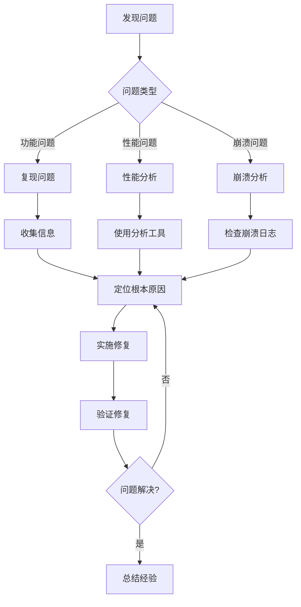

# 第23章 调试与排障实战

## 概述

在开发 Claude Code 插件和扩展时，调试和排障是不可避免的技能。本章将通过10+真实问题案例，展示系统化的调试思路、诊断流程和解决工具，帮助开发者快速定位和解决问题。

**本章要点：**

- **调试方法论**：问题分类、诊断流程、解决策略
- **常见问题案例**：10+ 真实问题及其解决方案
- **调试工具**：内置工具、外部工具、自定义工具
- **性能问题**：内存泄漏、CPU占用、响应缓慢
- **兼容性问题**：平台差异、版本冲突、依赖问题
- **最佳实践**：预防措施、日志策略、错误处理

## 调试方法论

### 问题分类

```typescript
// 调试问题分类
export type DebugProblemCategory =
  | 'functionality'    // 功能问题：功能不工作或产生错误结果
  | 'performance'     // 性能问题：运行缓慢或资源占用高
  | 'compatibility'   // 兼容性问题：特定环境或版本不兼容
  | 'crash'          // 崩溃问题：进程崩溃或异常退出
  | 'memory'         // 内存问题：内存泄漏或内存溢出
  | 'concurrency'    // 并发问题：竞态条件或死锁

export type DebugProblem = {
  category: DebugProblemCategory
  severity: 'critical' | 'high' | 'medium' | 'low'
  description: string
  reproduction?: string
  environment?: DebugEnvironment
  stack?: string
  logs?: string[]
}

export type DebugEnvironment = {
  platform: string
  nodeVersion: string
  claudeCodeVersion: string
  plugins: string[]
  settings: Record<string, unknown>
}
```

### 诊断流程



### 系统化诊断步骤

```typescript
// src/debug/diagnostic.ts
export class DiagnosticProcess {
  async diagnose(problem: DebugProblem): Promise<DiagnosticResult> {
    // 1. 收集环境信息
    const environment = await this.collectEnvironmentInfo()

    // 2. 根据问题类型选择诊断策略
    let strategy: DiagnosticStrategy

    switch (problem.category) {
      case 'functionality':
        strategy = new FunctionalityDiagnostic()
        break
      case 'performance':
        strategy = new PerformanceDiagnostic()
        break
      case 'compatibility':
        strategy = new CompatibilityDiagnostic()
        break
      case 'crash':
        strategy = new CrashDiagnostic()
        break
      case 'memory':
        strategy = new MemoryDiagnostic()
        break
      case 'concurrency':
        strategy = new ConcurrencyDiagnostic()
        break
    }

    // 3. 执行诊断
    const result = await strategy.diagnose(problem, environment)

    // 4. 生成诊断报告
    return {
      problem,
      environment,
      rootCause: result.rootCause,
      solutions: result.solutions,
      recommendations: result.recommendations,
      relatedIssues: result.relatedIssues,
    }
  }

  private async collectEnvironmentInfo(): Promise<DebugEnvironment> {
    return {
      platform: process.platform,
      nodeVersion: process.version,
      claudeCodeVersion: this.getClaudeCodeVersion(),
      plugins: this.getInstalledPlugins(),
      settings: this.getSettings(),
    }
  }

  private getClaudeCodeVersion(): string {
    try {
      const packageJson = JSON.parse(
        fs.readFileSync(
          join(__dirname, '../../../package.json'),
          'utf-8'
        )
      )
      return packageJson.version
    } catch {
      return 'unknown'
    }
  }

  private getInstalledPlugins(): string[] {
    // 实现插件列表获取
    return []
  }

  private getSettings(): Record<string, unknown> {
    // 实现设置获取
    return {}
  }
}

export interface DiagnosticResult {
  problem: DebugProblem
  environment: DebugEnvironment
  rootCause: string
  solutions: Solution[]
  recommendations: string[]
  relatedIssues: string[]
}

export interface Solution {
  description: string
  steps: string[]
  code?: string
  risk?: 'low' | 'medium' | 'high'
}

// 诊断策略接口
interface DiagnosticStrategy {
  diagnose(
    problem: DebugProblem,
    environment: DebugEnvironment
  ): Promise<{
    rootCause: string
    solutions: Solution[]
    recommendations: string[]
    relatedIssues: string[]
  }>
}
```

## 常见问题案例

### 案例1：插件加载失败

**问题描述**：
自定义插件加载时报错 "Cannot find module"。

**诊断过程**：

```typescript
// 1. 检查插件路径
const pluginPath = join(process.cwd(), '.claude-plugin', 'my-plugin')
console.log('Plugin path:', pluginPath)

// 2. 检查插件结构
try {
  const pluginManifest = join(pluginPath, '.claude-plugin', 'plugin.json')
  const exists = fs.existsSync(pluginManifest)
  console.log('Plugin manifest exists:', exists)
  
  if (!exists) {
    // 列出目录内容
    const files = fs.readdirSync(pluginPath)
    console.log('Plugin directory contents:', files)
  }
} catch (error) {
  console.error('Error checking plugin path:', error)
}

// 3. 检查依赖
try {
  const packageJson = join(pluginPath, 'package.json')
  const pkg = JSON.parse(fs.readFileSync(packageJson, 'utf-8'))
  console.log('Plugin dependencies:', pkg.dependencies)
  
  // 检查 node_modules 是否存在
  const nodeModules = join(pluginPath, 'node_modules')
  const nodeModulesExists = fs.existsSync(nodeModules)
  console.log('node_modules exists:', nodeModulesExists)
} catch (error) {
  console.error('Error checking dependencies:', error)
}
```

**解决方案**：

```typescript
// 解决方案1：安装依赖
// 在插件目录运行 npm install
await exec('npm install', { cwd: pluginPath })

// 解决方案2：检查插件结构
const expectedStructure = [
  '.claude-plugin/plugin.json',
  '.claude-plugin/commands/',
  'package.json',
]

for (const file of expectedStructure) {
  const fullPath = join(pluginPath, file)
  if (!fs.existsSync(fullPath)) {
    console.error(`Missing required file: ${file}`)
    // 创建缺失的文件或目录
  }
}

// 解决方案3：验证 plugin.json 格式
const manifestPath = join(pluginPath, '.claude-plugin', 'plugin.json')
try {
  const manifest = JSON.parse(fs.readFileSync(manifestPath, 'utf-8'))
  
  // 验证必需字段
  if (!manifest.name) {
    throw new Error('plugin.json missing required "name" field')
  }
  if (!manifest.version) {
    throw new Error('plugin.json missing required "version" field')
  }
  
  console.log('Plugin manifest is valid')
} catch (error) {
  console.error('Invalid plugin.json:', error)
}
```

### 案例2：Tool 执行权限被拒绝

**问题描述**：
自定义工具执行时提示 "Permission denied"。

**诊断过程**：

```typescript
// 1. 检查工具定义
const toolDefinition = {
  name: 'myTool',
  description: 'My custom tool',
  parameters: {
    type: 'object',
    properties: {
      path: {
        type: 'string',
        description: 'File path to process',
      },
    },
    required: ['path'],
  },
}

// 2. 检查权限设置
const permissionCheck = {
  scope: 'file_read',
  resource: toolDefinition.name,
}

console.log('Checking permissions:', permissionCheck)

// 3. 检查用户权限历史
const permissionsHistory = getPermissionHistory()
console.log('Permission history:', permissionsHistory)

function getPermissionHistory() {
  // 从设置中获取权限历史
  try {
    const settingsPath = join(getClaudeConfigHomeDir(), 'settings.json')
    const settings = JSON.parse(fs.readFileSync(settingsPath, 'utf-8'))
    return settings.permissionHistory || []
  } catch {
    return []
  }
}
```

**解决方案**：

```typescript
// 解决方案1：更新权限设置
async function updatePermissionSettings() {
  const settingsPath = join(getClaudeConfigHomeDir(), 'settings.json')
  
  try {
    const settings = JSON.parse(fs.readFileSync(settingsPath, 'utf-8'))
    
    // 添加工具权限
    if (!settings.enabledTools) {
      settings.enabledTools = {}
    }
    
    settings.enabledTools['myTool'] = true
    
    // 添加文件读取权限
    if (!settings.enabledPlugins) {
      settings.enabledPlugins = {}
    }
    
    settings.enabledPlugins['myTool'] = {
      file_read: true,
      file_write: false,
    }
    
    // 写回设置
    fs.writeFileSync(settingsPath, JSON.stringify(settings, null, 2))
    console.log('Permissions updated successfully')
  } catch (error) {
    console.error('Failed to update permissions:', error)
  }
}

// 解决方案2：使用降级方案
async function fallbackWithPermission() {
  // 使用 ask 模式请求权限
  const permission = await askUser(
    'myTool needs file read permission. Grant permission?'
  )
  
  if (permission === 'allow') {
    // 执行操作
    console.log('Permission granted, executing tool...')
  } else {
    console.log('Permission denied, using fallback')
    // 使用降级方案
  }
}

async function askUser(question: string): Promise<'allow' | 'deny' | 'ask'> {
  // 实现用户询问逻辑
  return 'allow'
}
```

### 案例3：内存泄漏

**问题描述**：
长时间运行后内存占用持续增长。

**诊断过程**：

```typescript
// 1. 监控内存使用
function monitorMemory() {
  const snapshots: Array<{
    time: number
    heapUsed: number
    heapTotal: number
    external: number
  }> = []

  const interval = setInterval(() => {
    const usage = process.memoryUsage()
    
    snapshots.push({
      time: Date.now(),
      heapUsed: usage.heapUsed,
      heapTotal: usage.heapTotal,
      external: usage.external,
    })

    console.log('Memory usage:', usage)

    // 保留最近100个快照
    if (snapshots.length > 100) {
      snapshots.shift()
    }

    // 检测内存增长
    if (snapshots.length >= 10) {
      const oldest = snapshots[0]
      const newest = snapshots[snapshots.length - 1]
      const growth = newest.heapUsed - oldest.heapUsed
      const growthRate = growth / (newest.time - oldest.time)

      if (growthRate > 1024) { // 1KB/s 增长率
        console.warn('Possible memory leak detected!')
        console.log('Growth rate:', (growthRate / 1024).toFixed(2), 'KB/s')
      }
    }
  }, 1000)

  return interval
}

// 2. 堆快照分析
function takeHeapSnapshot() {
  // 使用 v8 module
  const v8 = require('v8')
  
  const snapshot = v8.writeHeapSnapshot()
  console.log('Heap snapshot written to:', snapshot)
  
  return snapshot
}

// 3. 检测未清理的资源
function detectUncleanedResources() {
  // 检查未关闭的文件句柄
  const openHandles = new Set()
  
  // Hook fs.open
  const originalOpen = fs.open
  fs.open = function(...args) {
    const callback = args[args.length - 1]
    
    if (typeof callback === 'function') {
      const newCallback = (err: Error | null, fd: number) => {
        if (!err) {
          openHandles.add(fd)
          console.log('File opened:', fd, 'Total open:', openHandles.size)
        }
        callback(err, fd)
      }
      
      args[args.length - 1] = newCallback
    }
    
    return originalOpen.apply(this, args)
  }
  
  // Hook fs.close
  const originalClose = fs.close
  fs.close = function(...args) {
    const callback = args[args.length - 1]
    
    if (typeof callback === 'function') {
      const fd = args[0]
      const newCallback = (err: Error | null) => {
        if (!err) {
          openHandles.delete(fd)
          console.log('File closed:', fd, 'Total open:', openHandles.size)
        }
        callback(err)
      }
      
      args[args.length - 1] = newCallback
    }
    
    return originalClose.apply(this, args)
  }
  
  console.log('Resource detection enabled')
}
```

**解决方案**：

```typescript
// 解决方案1：修复事件监听器泄漏
class EventEmitterManager {
  private listeners = new Map<string, Set<Function>>()

  on(event: string, listener: Function): void {
    if (!this.listeners.has(event)) {
      this.listeners.set(event, new Set())
    }
    
    this.listeners.get(event)!.add(listener)
  }

  off(event: string, listener: Function): void {
    const listeners = this.listeners.get(event)
    if (listeners) {
      listeners.delete(listener)
      
      // 如果没有监听器了，删除事件
      if (listeners.size === 0) {
        this.listeners.delete(event)
      }
    }
  }

  emit(event: string, ...args: unknown[]): void {
    const listeners = this.listeners.get(event)
    if (listeners) {
      listeners.forEach(listener => {
        listener(...args)
      })
    }
  }

  removeAllListeners(event?: string): void {
    if (event) {
      this.listeners.delete(event)
    } else {
      this.listeners.clear()
    }
  }
}

// 解决方案2：使用 WeakMap
const cache = new WeakMap<object, any>()

function addToCache(key: object, value: any) {
  cache.set(key, value)
  // 当 key 不再被引用时，会自动从 cache 中移除
}

// 解决方案3：定期清理
class CleanupManager {
  private timers: Set<NodeJS.Timeout> = new Set()
  private intervals: Set<NodeJS.Timeout> = new Set()
  private watchers: Set<FSWatcher> = new Set()

  setTimeout(callback: (...args: any[]) => NodeJS.Timeout {
    const timer = setTimeout(() => {
      callback(...args)
      this.timers.delete(timer)
    })
    
    this.timers.add(timer)
    return timer
  }

  setInterval(callback: (...args: any[]) => NodeJS.Timeout {
    const interval = setInterval(() => {
      callback(...args)
    })
    
    this.intervals.add(interval)
    return interval
  }

  watch(path: string): FSWatcher {
    const watcher = fs.watch(path)
    this.watchers.add(watcher)
    return watcher
  }

  cleanup(): void {
    // 清理所有定时器
    this.timers.forEach(timer => clearTimeout(timer))
    this.timers.clear()

    this.intervals.forEach(interval => clearInterval(interval))
    this.intervals.clear()

    // 关闭所有监听器
    this.watchers.forEach(watcher => watcher.close())
    this.watchers.clear()
  }
}
```

### 案例4：并发竞态条件

**问题描述**：
多个插件同时操作同一文件时产生冲突。

**诊断过程**：

```typescript
// 1. 检测并发操作
class ConcurrencyDetector {
  private operations = new Map<string, Operation[]>()

  async trackOperation<T>(
    resource: string,
    operation: () => Promise<T>
  ): Promise<T> {
    // 记录操作
    const opInfo: Operation = {
      type: 'file_operation',
      resource,
      startTime: Date.now(),
    }

    if (!this.operations.has(resource)) {
      this.operations.set(resource, [])
    }

    const resourceOps = this.operations.get(resource)!
    
    // 检查是否有冲突操作
    const conflictingOp = resourceOps.find(op =>
      op.type === 'file_operation' &&
      Date.now() - op.startTime < 1000 // 最近1秒内的操作
    )

    if (conflictingOp) {
      console.warn('Concurrent operation detected on:', resource)
      console.warn('Existing operation:', conflictingOp)
    }

    resourceOps.push(opInfo)

    try {
      const result = await operation()
      return result
    } finally {
      // 移除操作记录
      const index = resourceOps.indexOf(opInfo)
      if (index > -1) {
        resourceOps.splice(index, 1)
      }
    }
  }

  getCurrentOperations(): Map<string, Operation[]> {
    return new Map(this.operations)
  }
}

type Operation = {
  type: string
  resource: string
  startTime: number
}

// 2. 检测死锁
class DeadlockDetector {
  private waitGraph = new Map<string, Set<string>>()

  async acquireLock(
    resource: string,
    owner: string,
    timeout: number = 5000
  ): Promise<boolean> {
    const startTime = Date.now()

    while (Date.now() - startTime < timeout) {
      if (!this.waitGraph.has(resource)) {
        this.waitGraph.set(resource, new Set())
        this.waitGraph.get(resource)!.add(owner)
        return true
      }

      // 检查循环等待
      if (this.detectCycle()) {
        console.error('Deadlock detected!')
        console.log('Wait graph:', this.waitGraph)
        return false
      }

      await sleep(100)
    }

    return false
  }

  releaseLock(resource: string, owner: string): void {
    const waiters = this.waitGraph.get(resource)
    if (waiters) {
      waiters.delete(owner)
      
      if (waiters.size === 0) {
        this.waitGraph.delete(resource)
      }
    }
  }

  private detectCycle(): boolean {
    const visited = new Set<string>()
    const recursionStack = new Set<string>()

    for (const [resource, waiters] of this.waitGraph) {
      if (this.detectCycleDFS(resource, visited, recursionStack)) {
        return true
      }
    }

    return false
  }

  private detectCycleDFS(
    resource: string,
    visited: Set<string>,
    recursionStack: Set<string>
  ): boolean {
    if (recursionStack.has(resource)) {
      return true // 检测到循环
    }

    if (visited.has(resource)) {
      return false
    }

    visited.add(resource)
    recursionStack.add(resource)

    const waiters = this.waitGraph.get(resource)
    if (waiters) {
      for (const waiter of waiters) {
        if (this.detectCycleDFS(waiter, visited, recursionStack)) {
          return true
        }
      }
    }

    recursionStack.delete(resource)
    return false
  }
}
```

**解决方案**：

```typescript
// 解决方案1：使用文件锁
class FileLock {
  private locks = new Map<string, Lock>()

  async acquire(
    path: string,
    timeout: number = 5000
  ): Promise<Lock | null> {
    const startTime = Date.now()

    while (Date.now() - startTime < timeout) {
      if (!this.locks.has(path)) {
        const lock: Lock = {
          path,
          owner: process.pid.toString(),
          acquiredAt: Date.now(),
        }
        this.locks.set(path, lock)
        return lock
      }

      const existingLock = this.locks.get(path)!
      
      // 检查锁是否过期
      if (Date.now() - existingLock.acquiredAt > 30000) {
        console.warn('Stale lock detected, removing:', path)
        this.locks.delete(path)
        continue
      }

      await sleep(100)
    }

    return null
  }

  release(lock: Lock): void {
    if (this.locks.get(lock.path) === lock) {
      this.locks.delete(lock.path)
    }
  }

  async withLock<T>(
    path: string,
    operation: (lock: Lock) => Promise<T>,
    timeout?: number
  ): Promise<T> {
    const lock = await this.acquire(path, timeout)
    
    if (!lock) {
      throw new Error(`Failed to acquire lock for ${path}`)
    }

    try {
      return await operation(lock)
    } finally {
      this.release(lock)
    }
  }
}

type Lock = {
  path: string
  owner: string
  acquiredAt: number
}

// 使用示例
const fileLock = new FileLock()

await fileLock.withLock('/path/to/file', async () => {
  // 安全地操作文件
  const content = await fs.promises.readFile('/path/to/file', 'utf-8')
  const modified = content.toUpperCase()
  await fs.promises.writeFile('/path/to/file', modified)
})
```

### 案例5：Hook 不触发

**问题描述**：
注册的 PreToolUse Hook 没有被触发。

**诊断过程**：

```typescript
// 1. 检查 Hook 注册
function checkHookRegistration() {
  const settings = loadSettings()
  
  console.log('Registered hooks:')
  
  // 检查 PreToolUse hooks
  if (settings.hooksConfig?.PreToolUse) {
    for (const hookConfig of settings.hooksConfig.PreToolUse) {
      console.log('  PreToolUse:', {
        pattern: hookConfig.pattern,
        enabled: hookConfig.enabled,
        hooks: hookConfig.hooks?.map(h => h.description || 'anonymous'),
      })
    }
  } else {
    console.log('  No PreToolUse hooks registered')
  }
  
  // 检查其他 hooks
  for (const hookType of Object.keys(settings.hooksConfig || {})) {
    console.log(`  ${hookType}:`, settings.hooksConfig[hookType])
  }
}

// 2. 检查 Hook 模式匹配
function testHookPatternMatching() {
  const toolUse = {
    name: 'Bash',
    input: {
      command: 'npm install',
    },
  }

  const hookConfigs = loadSettings().hooksConfig?.PreToolUse || []

  for (const hookConfig of hookConfigs) {
    const matches = matchHookPattern(hookConfig.pattern, toolUse)
    
    console.log(`Hook pattern "${hookConfig.pattern}" matches:`, matches)
    
    if (matches) {
      console.log('  Hook is enabled:', hookConfig.enabled)
      
      for (const hook of hookConfig.hooks || []) {
        console.log('  Hook would execute:', hook.description)
      }
    }
  }
}

function matchHookPattern(pattern: string, toolUse: any): boolean {
  // 实现模式匹配逻辑
  if (pattern === '*') {
    return true
  }

  if (pattern.startsWith('/') && pattern.endsWith('/')) {
    // 正则表达式
    const regex = new RegExp(pattern.slice(1, -1))
    return regex.test(toolUse.name)
  }

  // 精确匹配
  return pattern === toolUse.name
}

// 3. 检查 Hook 执行环境
function checkHookExecutionEnvironment() {
  // 检查是否在正确的环境中
  console.log('Current process:', {
    pid: process.pid,
    platform: process.platform,
    nodeVersion: process.version,
    cwd: process.cwd(),
  })

  // 检查配置文件
  const configPaths = [
    join(process.cwd(), '.claude/config.json'),
    join(os.homedir(), '.claude/config.json'),
  ]

  for (const configPath of configPaths) {
    if (fs.existsSync(configPath)) {
      console.log('Config file found:', configPath)
      const config = JSON.parse(fs.readFileSync(configPath, 'utf-8'))
      console.log('Config:', config)
    }
  }
}
```

**解决方案**：

```typescript
// 解决方案1：修正 Hook 模式
// 错误的模式
const wrongPattern = 'bash' // 大小写敏感

// 正确的模式
const correctPatterns = [
  'Bash',           // 精确匹配
  '/bash/i',        // 正则表达式（忽略大小写）
  '*',             // 匹配所有工具
  '/.*/',          // 正则表达式（匹配所有）
]

// 解决方案2：确保 Hook 启用
const hookConfig = {
  pattern: 'Bash',
  enabled: true,  // 确保启用
  hooks: [
    {
      pattern: 'npm install',
      enabled: true,
      description: 'Wait for package.json',
      execute: async ({ input }) => {
        // Hook 逻辑
      },
    },
  ],
}

// 解决方案3：在正确的位置注册 Hook
// 在插件中注册
const plugin = {
  name: 'my-plugin',
  hooksConfig: {
    PreToolUse: [
      {
        pattern: 'Bash',
        enabled: true,
        hooks: [
          {
            pattern: 'npm install|npm rebuild',
            enabled: true,
            description: 'Wait for package.json',
            execute: async ({ input }) => {
              const { waitForFileChange } = await import('../utils/fileChanged.js')
              await waitForFileChange(join(process.cwd(), 'package.json'), 3000)
            },
          },
        ],
      },
    ],
  },
}
```

### 案例6：流输出丢失

**问题描述**：
子进程的标准输出没有被捕获。

**诊断过程**：

```typescript
// 1. 检查 stdio 配置
function checkStdioConfiguration(childProcess: ChildProcess) {
  console.log('Child process stdio:', childProcess.stdio)
  
  if (!childProcess.stdout) {
    console.error('stdout is null - child process may not have stdout')
  }
  
  if (!childProcess.stderr) {
    console.error('stderr is null - child process may not have stderr')
  }

  // 检查 spawn options
  console.log('Spawn options:', {
    stdio: childProcess.stdio,
    shell: childProcess.spawnOptions?.shell,
    windowsHide: childProcess.spawnOptions?.windowsHide,
  })
}

// 2. 测试简单命令
async function testSimpleCommand() {
  console.log('Testing simple command: echo test')
  
  const { execSync } = require('child_process')
  
  try {
    const output = execSync('echo test', {
      encoding: 'utf-8',
      stdio: ['pipe', 'pipe', 'pipe'],
    })
    
    console.log('Command output:', output)
    console.log('Exit code:', 0)
  } catch (error) {
    console.error('Command failed:', error)
  }
}

// 3. 测试 spawn
async function testSpawn() {
  console.log('Testing spawn')
  
  const { spawn } = require('child_process')
  
  const child = spawn('echo', ['test'], {
    stdio: ['pipe', 'pipe', 'pipe'],
  })

  let output = ''

  child.stdout?.on('data', (data) => {
    console.log('stdout data:', data.toString())
    output += data.toString()
  })

  child.stderr?.on('data', (data) => {
    console.error('stderr data:', data.toString())
  })

  child.on('close', (code) => {
    console.log('Exit code:', code)
    console.log('Total output:', output)
  })
}
```

**解决方案**：

```typescript
// 解决方案1：正确配置 stdio
async function spawnWithCorrectStdio(command: string, args?: string[]) {
  const { spawn } = require('child_process')
  
  const child = spawn(command, args || [], {
    stdio: ['pipe', 'pipe', 'pipe'], // [stdin, stdout, stderr]
    shell: process.platform === 'win32', // Windows 下使用 shell
  })

  // 捕获输出
  const chunks: Buffer[] = []

  child.stdout?.on('data', (chunk) => {
    console.log('stdout chunk:', chunk)
    chunks.push(chunk)
  })

  child.on('close', (code) => {
    const output = Buffer.concat(chunks).toString()
    console.log('Final output:', output)
    console.log('Exit code:', code)
  })

  return child
}

// 解决方案2：使用 IPC 传递数据
async function spawnWithIPC(command: string, args?: string[]) {
  const { spawn } = require('child_process')
  
  const child = spawn(command, args || [], {
    stdio: ['pipe', 'pipe', 'ipc'],
  })

  child.on('message', (message) => {
    console.log('IPC message:', message)
  })

  child.on('error', (error) => {
    console.error('Child error:', error)
  })

  return child
}

// 解决方案3：使用 pty（伪终端）
async function spawnWithPTY(command: string, args?: string[]) {
  const { spawn } = require('child_process')
  
  // 需要 pty 模块：npm install pty
  const pty = require('pty')

  const ptyProcess = pty.spawn(command, args || [], {
    name: 'xterm-color',
    cols: 80,
    rows: 30,
    cwd: process.cwd(),
    env: process.env,
  })

  ptyProcess.on('data', (data) => {
    console.log('PTY data:', data.toString())
  })

  ptyProcess.on('exit', (exitCode) => {
    console.log('PTY exit code:', exitCode)
  })

  return ptyProcess
}
```

## 调试工具

### 内置调试工具

```typescript
// src/debug/tools.ts
export class DebugTools {
  // 日志增强
  static setupEnhancedLogging() {
    const originalLog = console.log
    const originalError = console.error
    const originalWarn = console.warn

    console.log = function(...args: any[]) {
      const timestamp = new Date().toISOString()
      originalLog(`[${timestamp}]`, ...args)
    }

    console.error = function(...args: any[]) {
      const timestamp = new Date().toISOString()
      const stack = new Error().stack?.split('\n')[2]
      originalError(`[${timestamp}]`, ...args, stack ? `\n${stack}` : '')
    }

    console.warn = function(...args: any[]) {
      const timestamp = new Date().toISOString()
      originalWarn(`[${timestamp}]`, ...args)
    }
  }

  // 性能监控
  static setupPerformanceMonitoring() {
    const performance = new PerformanceMonitor()
    performance.start()

    process.on('exit', () => {
      performance.stop()
      performance.report()
    })
  }

  // 内存监控
  static setupMemoryMonitoring() {
    const monitor = new MemoryMonitor()
    monitor.start(60000) // 每60秒报告一次

    process.on('exit', () => {
      monitor.report()
    })
  }

  // 操作追踪
  static setupOperationTracing() {
    const tracer = new OperationTracer()
    tracer.enable()

    return tracer
  }
}

class PerformanceMonitor {
  private startTime: number = 0
  private operations = new Map<string, number[]>()

  start(): void {
    this.startTime = Date.now()
  }

  recordOperation(name: string, duration: number): void {
    if (!this.operations.has(name)) {
      this.operations.set(name, [])
    }

    this.operations.get(name)!.push(duration)
  }

  stop(): void {
    const totalTime = Date.now() - this.startTime

    console.log('\n=== Performance Report ===')
    console.log(`Total time: ${totalTime}ms`)

    for (const [name, durations] of this.operations) {
      const avg = durations.reduce((a, b) => a + b, 0) / durations.length
      const max = Math.max(...durations)
      const count = durations.length

      console.log(`\n${name}:`)
      console.log(`  Count: ${count}`)
      console.log(`  Average: ${avg.toFixed(2)}ms`)
      console.log(`  Max: ${max}ms`)
      console.log(`  Total: ${durations.reduce((a, b) => a + b, 0)}ms`)
    }
  }

  report(): void {
    this.stop()
  }
}

class MemoryMonitor {
  private snapshots: Array<{
    time: number
    heapUsed: number
    heapTotal: number
  }> = []

  private interval?: NodeJS.Timeout

  start(reportInterval: number): void {
    this.interval = setInterval(() => {
      this.takeSnapshot()
    }, reportInterval)
  }

  stop(): void {
    if (this.interval) {
      clearInterval(this.interval)
    }
  }

  private takeSnapshot(): void {
    const usage = process.memoryUsage()

    this.snapshots.push({
      time: Date.now(),
      heapUsed: usage.heapUsed,
      heapTotal: usage.heapTotal,
    })

    // 保留最近100个快照
    if (this.snapshots.length > 100) {
      this.snapshots.shift()
    }
  }

  report(): void {
    if (this.snapshots.length < 2) {
      console.log('Not enough data for memory report')
      return
    }

    const first = this.snapshots[0]
    const last = this.snapshots[this.snapshots.length - 1]

    const duration = last.time - first.time
    const growth = last.heapUsed - first.heapUsed
    const growthRate = (growth / duration) * 1000 // bytes/ms

    console.log('\n=== Memory Report ===')
    console.log(`Duration: ${(duration / 1000).toFixed(2)}s`)
    console.log(`Initial heap: ${(first.heapUsed / 1024 / 1024).toFixed(2)} MB`)
    console.log(`Final heap: ${(last.heapUsed / 1024 / 1024).toFixed(2)} MB`)
    console.log(`Growth: ${(growth / 1024 / 1024).toFixed(2)} MB`)
    console.log(`Growth rate: ${(growthRate / 1024).toFixed(2)} MB/s`)
  }
}

class OperationTracer {
  private enabled = false
  private operations = new Map<string, number>()

  enable(): void {
    this.enabled = true
  }

  disable(): void {
    this.enabled = false
  }

  trace<T>(name: string, operation: () => T): T {
    if (!this.enabled) {
      return operation()
    }

    const start = Date.now()
    console.log(`[TRACE] Entering: ${name}`)

    try {
      const result = operation()

      const duration = Date.now() - start
      console.log(`[TRACE] Exiting: ${name} (${duration}ms)`)

      this.recordOperation(name, duration)

      return result
    } catch (error) {
      const duration = Date.now() - start
      console.log(`[TRACE] Exiting: ${name} (${duration}ms) - ERROR`)
      throw error
    }
  }

  private recordOperation(name: string, duration: number): void {
    if (!this.operations.has(name)) {
      this.operations.set(name, [])
    }

    this.operations.get(name)!.push(duration)
  }

  report(): void {
    console.log('\n=== Operation Trace Report ===')

    for (const [name, durations] of this.operations) {
      const avg = durations.reduce((a, b) => a + b, 0) / durations.length
      const total = durations.reduce((a, b) => a + b, 0)

      console.log(`\n${name}:`)
      console.log(`  Calls: ${durations.length}`)
      console.log(`  Total: ${total}ms`)
      console.log(`  Average: ${avg.toFixed(2)}ms`)
    }
  }
}
```

## 最佳实践

### 1. 问题预防

- **类型检查**：使用 TypeScript 进行严格类型检查
- **输入验证**：验证所有外部输入
- **错误处理**：完善的 try-catch 和错误处理
- **资源管理**：使用 RAII 模式管理资源

### 2. 日志策略

- **分级日志**：使用不同级别的日志
- **结构化日志**：使用结构化的日志格式
- **日志轮转**：实现日志文件轮转
- **敏感信息**：避免记录敏感信息

### 3. 测试策略

- **单元测试**：测试单个功能
- **集成测试**：测试组件集成
- **端到端测试**：测试完整流程
- **边界测试**：测试边界条件

### 4. 监控告警

- **性能监控**：监控响应时间和资源使用
- **错误监控**：监控错误率和错误类型
- **可用性监控**：监控服务可用性
- **告警机制**：设置合适的告警阈值

## 总结

调试和排障的核心要点：

1. **系统化方法**：使用结构化的诊断流程
2. **问题分类**：正确识别问题类型
3. **工具支持**：使用合适的调试工具
4. **文档记录**：记录问题和解决方案
5. **持续改进**：从问题中学习和改进
6. **预防措施**：采取措施预防常见问题

掌握调试技能，可以快速定位和解决问题，提高开发效率。
