# 第3章：核心概念与术语

> **本章目标**：掌握 Claude Code 的核心概念和术语体系，建立系统的认知框架

---

## 📚 学习目标

完成本章后，你将能够：

- [ ] 理解 Claude Code 的 30+ 核心概念
- [ ] 掌握系统的整体架构和数据流
- [ ] 熟悉关键设计模式的应用
- [ ] 建立清晰的概念图谱和知识体系

---

## 🔑 前置知识

在阅读本章之前，建议先掌握：

- **基本编程概念**：函数、对象、模块、异步编程
- **设计模式基础**：了解常见的设计模式（单例、工厂、观察者等）
- **React 基础**：了解组件、状态、props 等概念（有助于理解 Ink）

**前置章节**：[第1章：项目概述与背景](./第1章-项目概述-CN.md)

**依赖关系**：
```
第1章 → 第3章（本章）→ 第5章、第7章
```

---

## 3.1 核心概念体系

Claude Code 的核心概念可以分为以下几大类：

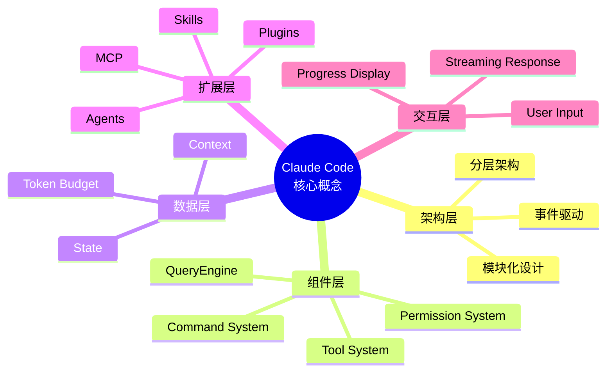

---

## 3.2 核心概念详解

### 3.2.1 QueryEngine（查询引擎）

**定义**：QueryEngine 是 Claude Code 的核心组件，负责与 Claude API 交互并协调工具调用。

**核心职责**：

1. **API 交互管理**
   ```typescript
   // 文件：src/QueryEngine.ts
   // 行号：150-200

   interface QueryEngine {
     // 发送查询到 Claude API
     query(messages: Message[]): AsyncStream<Response>
     
     // 处理流式响应
     handleStream(stream: AsyncStream<Response>): void
   }
   ```

2. **工具编排**
   - 检测 AI 意图
   - 选择合适的工具
   - 执行工具调用
   - 聚合工具结果

3. **上下文管理**
   - 维护对话历史
   - 压缩上下文
   - 管理 Token 预算

**工作流程**：

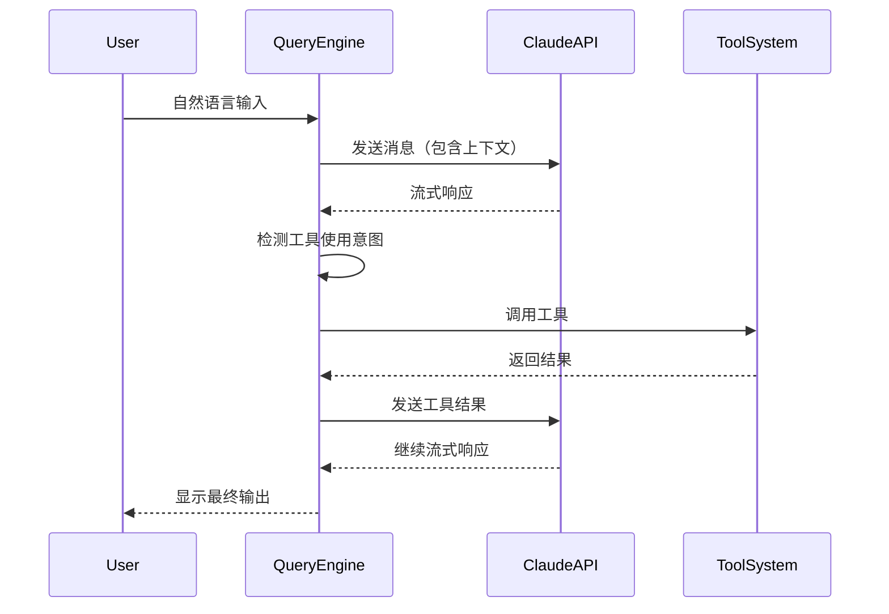

**关键特性**：

- ✅ **流式处理**：实时展示 AI 响应
- ✅ **并发控制**：支持多个工具并发调用
- ✅ **错误恢复**：工具调用失败时的优雅降级
- ✅ **Token 优化**：自动压缩上下文以适应 Token 限制

---

### 3.2.2 Tool（工具）

**定义**：Tool 是 AI 可以调用的功能单元，每个工具封装了特定的操作能力。

**工具接口**：

```typescript
// 文件：src/Tool.ts
// 行号：45-80

export interface Tool<Input, Output> {
  // 工具元数据
  name: string                    // 工具唯一标识
  description: string             // 工具功能描述
  inputSchema: z.ZodType<Input>  // 输入验证模式
  
  // 执行函数
  execute: (
    input: Input,
    context: ToolUseContext
  ) => AsyncGenerator<ToolResult>
}
```

**工具分类**（60+ 工具）：

| 类别 | 工具数量 | 示例工具 | 用途 |
|------|---------|---------|------|
| **文件操作** | 8+ | FileReadTool, FileWriteTool, FileEditTool | 读取、写入、编辑文件 |
| **搜索工具** | 2+ | GlobTool, GrepTool | 文件查找、内容搜索 |
| **Shell 工具** | 2+ | BashTool, PowerShellTool | 执行命令行操作 |
| **Web 工具** | 2+ | WebSearchTool, WebFetchTool | 网络搜索、抓取内容 |
| **MCP 工具** | 4+ | MCPTool, ListMcpResourcesTool | MCP 协议集成 |
| **任务管理** | 5+ | TaskCreateTool, TaskUpdateTool | 任务创建和跟踪 |
| **Agent 工具** | 1+ | AgentTool | 子代理管理 |

**工具生命周期**：

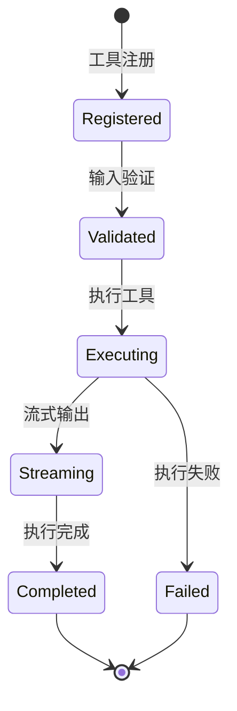

**构建器模式**：

```typescript
// 文件：src/Tool.ts
// 行号：200-250

// 使用 buildTool 创建工具
export const FileReadTool = buildTool({
  name: 'FileReadTool',
  description: 'Read the content of a file',
  
  // 输入验证
  inputSchema: z.object({
    filePath: z.string()
  }),
  
  // 执行逻辑
  async* execute(input, context) {
    try {
      const content = await readFile(input.filePath)
      yield { success: true, data: content }
    } catch (error) {
      yield { success: false, error: error.message }
    }
  }
})
```

---

### 3.2.3 Command（命令）

**定义**：Command 是用户可以直接调用的斜杠命令，提供快捷的功能访问。

**命令接口**：

```typescript
// 文件：src/Command.ts
// 行号：30-60

export interface Command {
  name: string                      // 命令名称
  description: string               // 命令描述
  parameters?: z.ZodType           // 参数验证
  execute: (params: any) => Promise<void>
}
```

**命令分类**（100+ 命令）：

| 类别 | 命令数量 | 示例 | 功能 |
|------|---------|------|------|
| **核心命令** | 3 | help, exit, clear | 基本操作 |
| **配置管理** | 3 | config, model, theme | 系统配置 |
| **会话管理** | 3 | session, resume, memory | 会话控制 |
| **Git 集成** | 4 | commit, review, diff, branch | Git 操作 |
| **功能命令** | 4 | agents, skills, plugins, mcp | 功能管理 |
| **开发命令** | 3 | ide, hooks, tasks | 开发工具 |

**命令执行流程**：

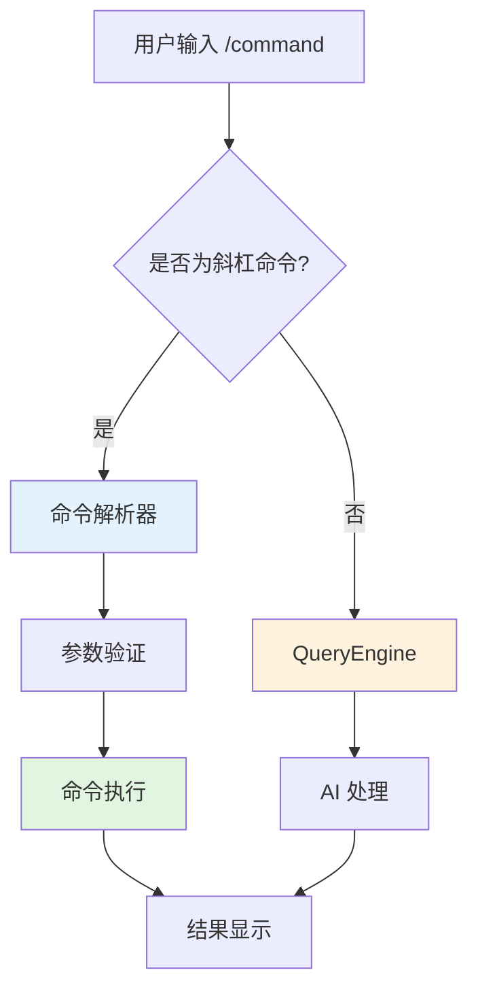

---

### 3.2.4 Permission System（权限系统）

**定义**：权限系统控制工具的使用权限，保护系统安全。

**三种权限模式**：

| 模式 | 特点 | 使用场景 |
|------|------|---------|
| **Default** | 所有操作需要用户确认 | 学习、调试环境 |
| **Auto** | 基于 AI 分类器自动决策 | 信任环境、自动化流程 |
| **Bypass** | 允许所有操作 | 高级用户、完全信任 |

**权限决策流程**：

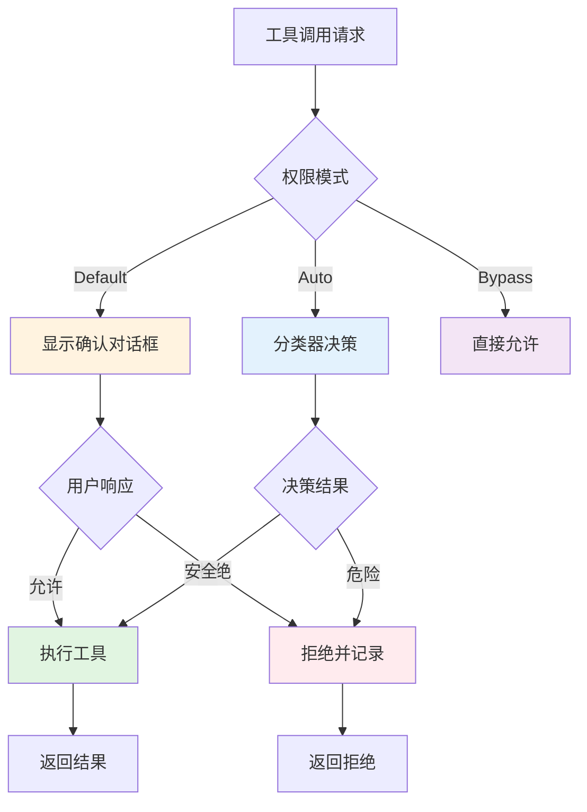

**权限规则**：

```typescript
// 文件：src/permissions/permissionRuleParser.ts
// 行号：100-150

// 规则语法示例
const rules = [
  // 允许所有文件读取操作
  'allow FileReadTool *',
  
  // 允许特定目录的写入操作
  'allow FileWriteTool /tmp/*',
  
  // 拒绝危险的删除操作
  'deny BashTool rm -rf *',
  
  // Shell 模式匹配
  'allow BashTool git *',
  'deny BashTool rm *'
]
```

**拒绝追踪**：

```typescript
// 记录所有权限拒绝历史
interface DenyRecord {
  timestamp: Date
  tool: string
  operation: string
  reason: string
  userDecision: 'allow' | 'deny'
}
```

---

### 3.2.5 Context（上下文）

**定义**：Context 管理对话历史和 AI 交互的状态信息。

**上下文组成**：

```typescript
// 文件：src/context/ContextManager.ts
// 行号：50-100

interface Context {
  // 消息历史
  messages: Message[]
  
  // Token 使用
  tokenUsage: {
    input: number
    output: number
    total: number
  }
  
  // 压缩状态
  compressionState: {
    compressed: boolean
    strategy: CompressionStrategy
    ratio: number
  }
}
```

**上下文压缩策略**：

| 策略 | 算法 | 压缩率 | 适用场景 |
|------|------|--------|---------|
| **Snip** | 裁剪中间内容 | 30-50% | 长对话 |
| **Reactive** | 保留关键消息 | 40-60% | 复杂任务 |
| **Micro** | 极致压缩 | 60-80% | Token 限制 |

**压缩触发条件**：

```typescript
// 当 Token 使用超过预算时触发压缩
if (context.tokenUsage.total > TOKEN_BUDGET * 0.8) {
  context = compact(context, {
    strategy: 'Snip',
   保留关键消息: true
  })
}
```

---

### 3.2.6 Agent（代理）

**定义**：Agent 是独立的 AI 子助手，可以并行处理特定任务。

**Agent 类型**：

| 类型 | 功能 | 使用场景 |
|------|------|---------|
| **Explore Agent** | 代码库探索 | 大范围搜索、模块分析 |
| **Plan Agent** | 任务规划 | 架构设计、实施计划 |
| **Verify Agent** | 代码验证 | 代码审查、测试验证 |

**Agent 生命周期**：

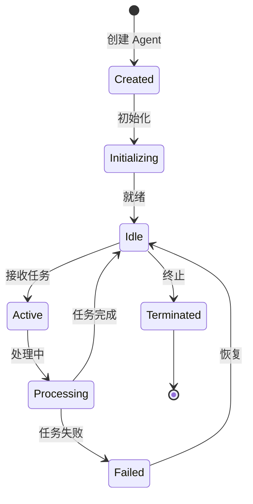

**Agent 内存共享**：

```typescript
// Agent 间可以共享内存
interface AgentMemory {
  // 共享数据存储
  sharedData: Map<string, any>
  
  // 数据同步
  sync(agentId: string, data: any): void
  
  // 数据读取
  read(agentId: string, key: string): any
}
```

---

### 3.2.7 MCP（Model Context Protocol）

**定义**：MCP 是模型上下文协议，用于扩展 AI 模型的能力边界。

**MCP 架构**：

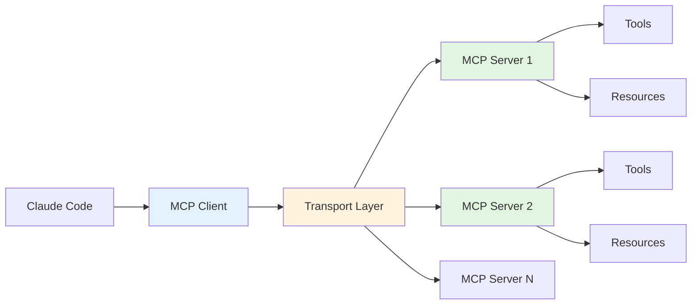

**传输层类型**：

| 类型 | 特点 | 使用场景 |
|------|------|---------|
| **Stdio** | 基于标准输入输出 | 本地进程 |
| **SSE** | 服务器发送事件 | HTTP 连接 |
| **WebSocket** | 双向实时通信 | 长连接场景 |

**MCP 工具集成**：

```typescript
// MCP 工具自动转换为 Claude Code 工具
const mcpTool = {
  name: 'mcp.server.database.query',
  description: 'Execute database query',
  execute: async (input) => {
    // 调用 MCP 服务器
    return await mcpClient.callTool('database.query', input)
  }
}
```

---

### 3.2.8 State（状态）

**定义**：State 是全局应用状态，管理系统运行时的所有状态信息。

**状态结构**：

```typescript
// 文件：src/state/AppState.ts
// 行号：20-80

interface AppState {
  // 用户会话
  session: {
    id: string
    startTime: Date
    lastActivity: Date
  }
  
  // 配置
  config: {
    logLevel: LogLevel
    permissionMode: PermissionMode
    theme: Theme
  }
  
  // 统计
  stats: {
    queriesExecuted: number
    toolsUsed: Map<string, number>
    errors: Error[]
  }
}
```

**状态管理**：

- **存储**：使用 Zustand 进行状态管理
- **持久化**：自动保存到文件系统
- **订阅**：支持组件订阅状态变化

```typescript
// 状态订阅示例
const unsubscribe = AppState.subscribe(
  (state) => state.config.logLevel,
  (logLevel) => {
    console.log('Log level changed:', logLevel)
  }
)
```

---

## 3.3 架构模式

### 3.3.1 分层架构

Claude Code 采用清晰的分层架构：

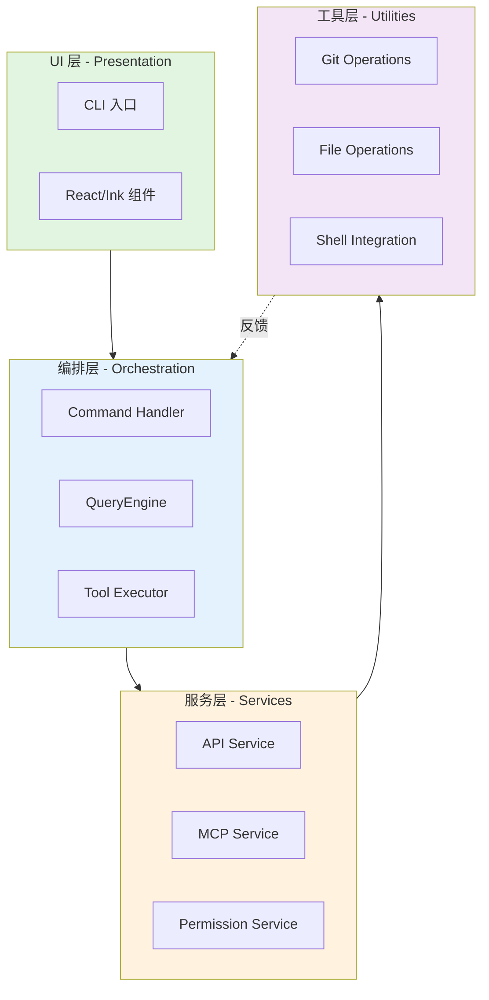

**层职责**：

- **UI 层**：用户交互、结果显示
- **编排层**：请求处理、任务协调
- **服务层**：业务逻辑、外部集成
- **工具层**：基础操作、系统调用

---

### 3.3.2 事件驱动

系统采用事件驱动架构：


**事件类型**：

| 事件 | 触发时机 | 处理器 |
|------|---------|--------|
| `query:start` | 开始查询 | QueryEngine |
| `tool:execute` | 工具调用 | ToolExecutor |
| `permission:request` | 权限请求 | PermissionSystem |
| `context:compact` | 上下文压缩 | ContextManager |

---

### 3.3.3 设计模式应用

**关键设计模式**：

| 模式 | 应用位置 | 作用 |
|------|---------|------|
| **Singleton** | QueryEngine, AppState | 全局唯一实例 |
| **Factory** | getCommand(), getAllTools() | 对象创建 |
| **Builder** | buildTool() | 复杂对象构建 |
| **Strategy** | Permission System | 可互换算法 |
| **Observer** | Hook System | 状态监听 |
| **Adapter** | MCP Tools | 接口适配 |
| **Command** | Slash Commands | 操作封装 |

**示例：构建器模式**

```typescript
// 使用 Builder Pattern 创建工具
const tool = buildTool({
  // 配置工具
  name: 'MyTool',
  description: 'My custom tool',
  inputSchema: z.object({
    param: z.string()
  }),
  
  // 实现逻辑
  async* execute(input, context) {
    yield { success: true, data: '...' }
  }
})
```

---

## 3.4 数据流

### 3.4.1 用户输入处理流程

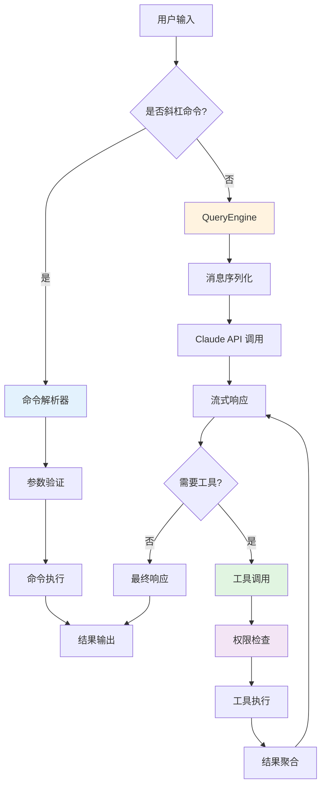

---

### 3.4.2 AI 对话流程

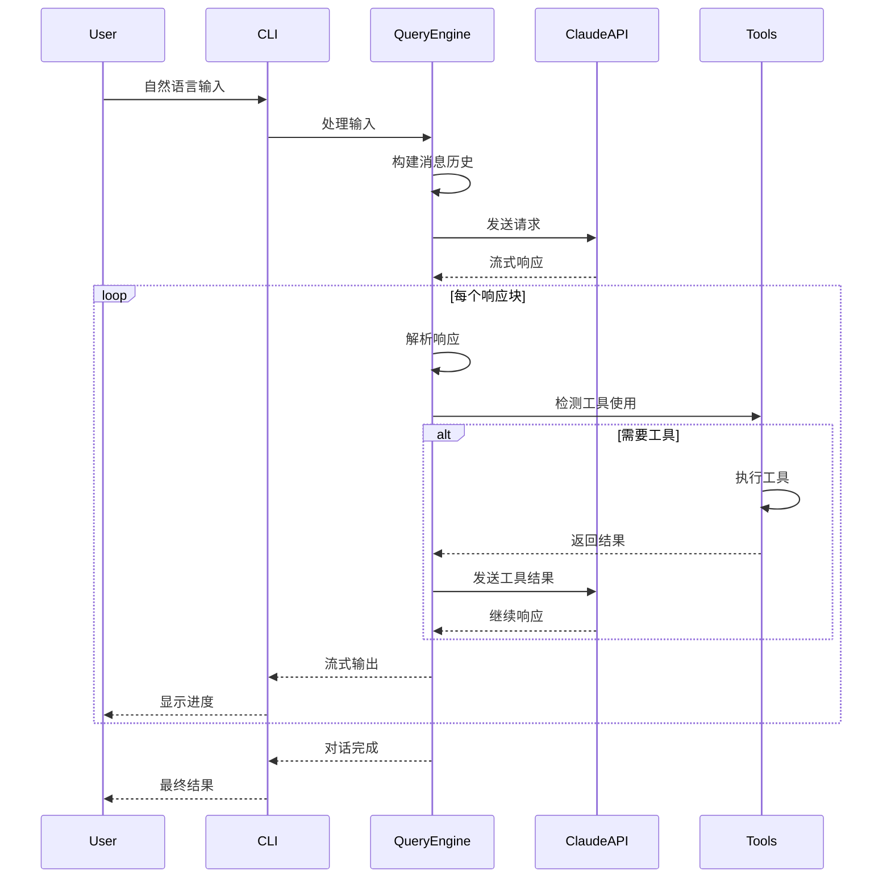

---

### 3.4.3 状态管理流程

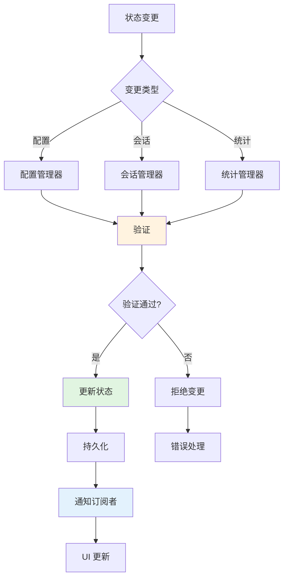

---

## 3.5 设计原则

### 3.5.1 KISS（Keep It Simple, Stupid）

**原则**：保持简单，避免过度设计。

**应用示例**：

```typescript
// ✅ 好的做法：简单直接
function readFile(path: string): Promise<string> {
  return fs.readFile(path, 'utf-8')
}

// ❌ 不好的做法：过度复杂
class FileReadingOrchestrator {
  private readonly strategy: ReadingStrategy
  private readonly cache: CacheManager
  private readonly validator: PathValidator
  
  async orchestrateReadingOperation(
    path: string,
    options: ReadingOptions
  ): Promise<Result<string>> {
    // 太多抽象层...
  }
}
```

---

### 3.5.2 DRY（Don't Repeat Yourself）

**原则**：避免重复，提取共性。

**应用示例**：

```typescript
// ❌ 重复代码
function validateToolName(name: string): boolean {
  return name.length > 0 && name.length < 50
}

function validateCommandName(name: string): boolean {
  return name.length > 0 && name.length < 50
}

// ✅ 提取共性
function validateName(name: string): boolean {
  return name.length > 0 && name.length < 50
}
```

---

### 3.5.3 SOLID 原则

**单一职责（SRP）**

```typescript
// ✅ 每个类只负责一件事
class QueryEngine {
  async query(messages: Message[]): Promise<Response> {
    // 只负责查询
  }
}

class ContextManager {
  compact(context: Context): Context {
    // 只负责上下文压缩
  }
}
```

**开闭原则（OCP）**

```typescript
// ✅ 对扩展开放，对修改关闭
interface Tool {
  execute(input: any): Promise<Result>
}

// 新增工具不需要修改现有代码
class NewTool implements Tool {
  async execute(input: any): Promise<Result> {
    // 新实现
  }
}
```

**依赖倒置（DIP）**

```typescript
// ✅ 依赖抽象而非具体实现
interface PermissionService {
  check(tool: string): Promise<boolean>
}

class QueryEngine {
  constructor(
    private permissionService: PermissionService  // 依赖抽象
  ) {}
}
```

---

### 3.5.4 YAGNI（You Aren't Gonna Need It）

**原则**：不过度设计，只实现当前需要的功能。

**应用示例**：

```typescript
// ❌ 过度设计：实现可能永远不会用的功能
interface Tool {
  execute(input: any): Promise<Result>
  rollback(): Promise<void>        // 可能不需要
  audit(): Promise<AuditLog>       // 可能不需要
  benchmark(): Promise<Metric>     // 可能不需要
}

// ✅ YAGNI：只实现必需功能
interface Tool {
  execute(input: any): Promise<Result>
}
```

---

## 3.6 概念关系图谱

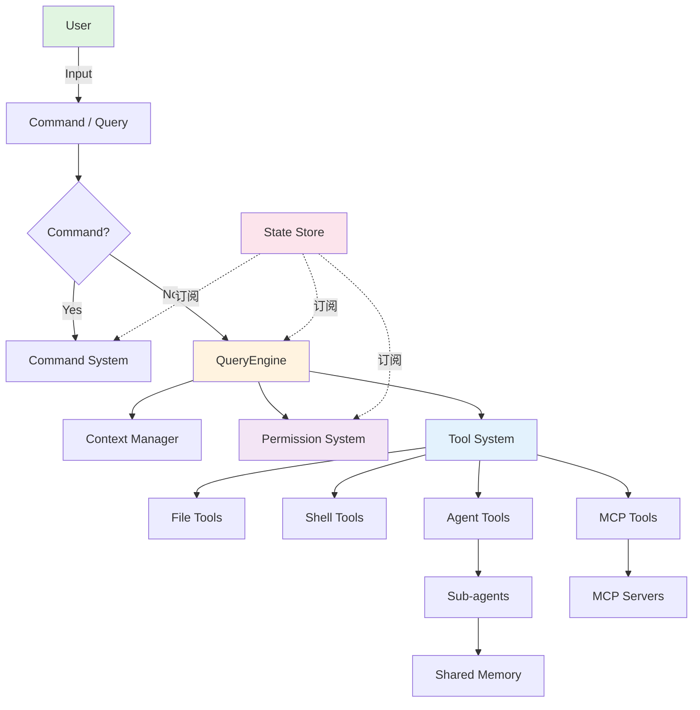

---

## 📊 本章小结

### 核心概念汇总

| 类别 | 核心概念 | 数量 |
|------|---------|------|
| **架构层** | QueryEngine, Tool, Command, Permission | 4 |
| **数据层** | Context, State, Token Budget | 3 |
| **扩展层** | MCP, Agent, Plugin, Skill | 4 |
| **系统层** | UI, Transport, Event, Hook | 4 |
| **设计层** | Patterns, Principles, Architecture | 3 |

**总计**：30+ 核心概念

### 概念层次

```
第1层：基础概念
  ├─ Tool（工具）
  ├─ Command（命令）
  └─ Permission（权限）

第2层：核心组件
  ├─ QueryEngine（查询引擎）
  ├─ Context（上下文）
  └─ State（状态）

第3层：扩展机制
  ├─ MCP（协议）
  ├─ Agent（代理）
  └─ Plugin（插件）

第4层：架构设计
  ├─ 分层架构
  ├─ 事件驱动
  └─ 设计模式
```

---

## 🎯 学习检查

完成本章后，你应该能够：

- [ ] 解释 QueryEngine 的核心职责和工作流程
- [ ] 描述 Tool 接口和工具生命周期
- [ ] 区分三种权限模式的使用场景
- [ ] 理解上下文压缩的必要性和策略
- [ ] 掌握 MCP 协议的基本架构
- [ ] 应用设计原则分析代码结构

---

## 🚀 下一步

**下一章**：[第4章：第一个 Claude 应用](./第4章-第一个应用-CN.md)

**学习路径**：

```
第1章：项目概述
  ↓
第2章：环境搭建
  ↓
第3章：核心概念（本章）✅
  ↓
第4章：第一个应用 ← 下一章
  ↓
第5章：QueryEngine 详解
```

**实践建议**：

1. **复习核心概念**
   - 绘制概念关系图
   - 编写概念对照表
   - 总结设计原则应用

2. **阅读源代码**
   - 查看 `src/Tool.ts` 了解工具实现
   - 查看 `src/QueryEngine.ts` 了解查询流程
   - 查看 `src/permissions/` 了解权限机制

3. **准备实战**
   - 熟悉开发环境
   - 了解项目结构
   - 准备编写第一个应用

---

## 📚 扩展阅读

### 相关章节
- **前置章节**：[第1章：项目概述与背景](./第1章-项目概述-CN.md)
- **后续章节**：[第4章：第一个 Claude 应用](./第4章-第一个应用-CN.md)
- **深入章节**：[第5章：QueryEngine 详解](./第5章-QueryEngine详解-CN.md)

### 外部资源
- [设计模式：可复用面向对象软件的基础](https://refactoring.guru/design-patterns)
- [SOLID 原则](https://en.wikipedia.org/wiki/SOLID)
- [事件驱动架构](https://martinfowler.com/articles/201701-event-driven.html)
- [MCP 协议规范](https://modelcontextprotocol.io)

---

## 🔗 快速参考

### 核心组件

```typescript
// QueryEngine
await queryEngine.query([
  { role: 'user', content: 'Hello' }
])

// Tool
const tool = buildTool({
  name: 'MyTool',
  description: '...',
  inputSchema: z.object({}),
  async* execute(input, context) {
    yield { success: true }
  }
})

// Command
const command = {
  name: 'mycommand',
  description: '...',
  execute: async (params) => {
    // 实现
  }
}
```

### 设计模式

```typescript
// Singleton
class QueryEngine {
  private static instance: QueryEngine
  static getInstance(): QueryEngine {
    if (!QueryEngine.instance) {
      QueryEngine.instance = new QueryEngine()
    }
    return QueryEngine.instance
  }
}

// Builder
const tool = buildTool({
  name: '...',
  description: '...',
  // ...
})

// Strategy
interface PermissionStrategy {
  check(tool: string): Promise<boolean>
}
```

---

**版本**: 1.0.0  
**最后更新**: 2026-04-03  
**维护者**: Claude Code Tutorial Team
