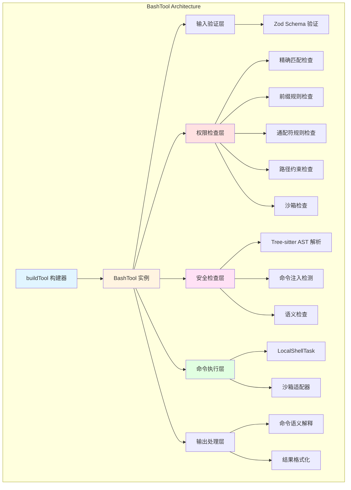
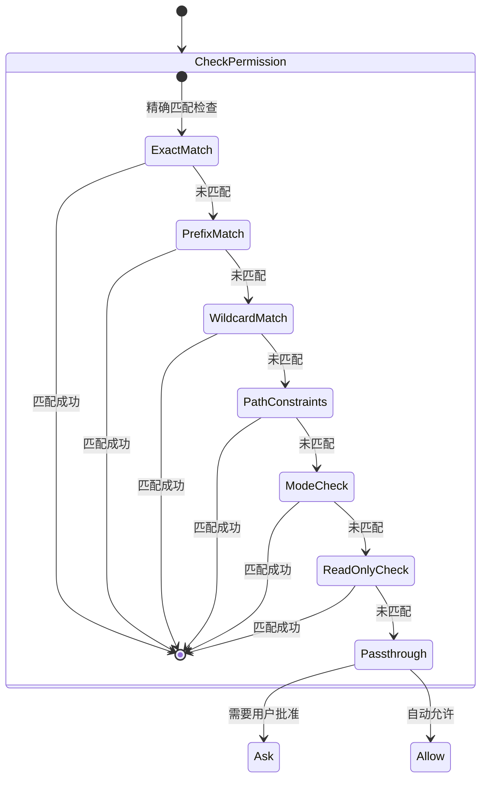
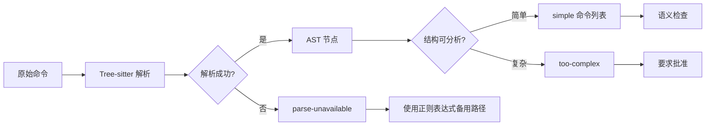
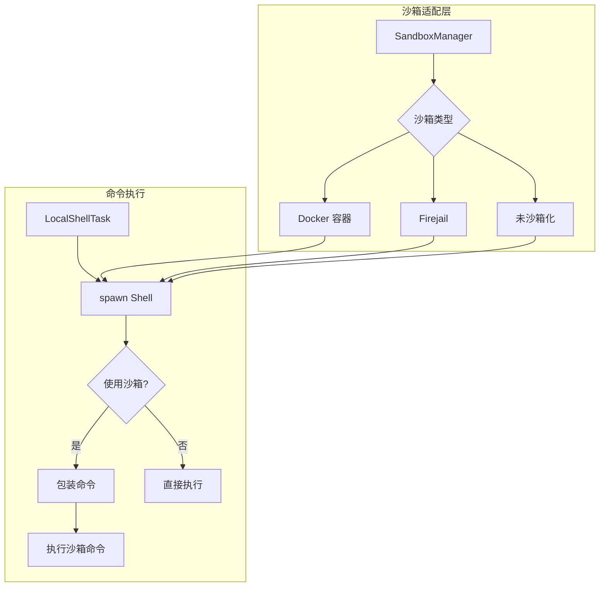
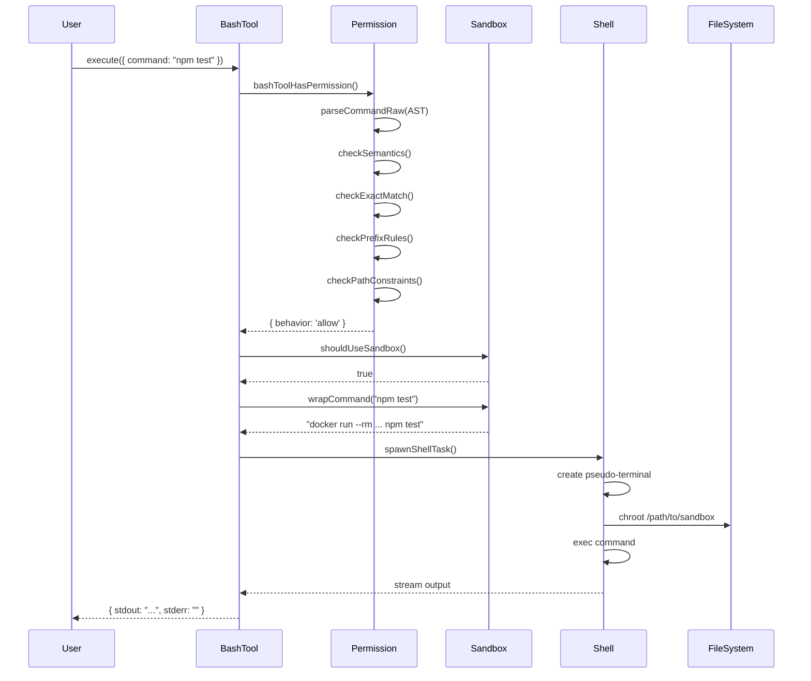

# 第6章 BashTool 与命令执行

## 概述

BashTool 是 Claude Code 中最核心的工具之一，负责安全地执行 Shell 命令。它不仅提供了命令执行能力，更重要的是构建了多层安全防护体系，确保 AI 助手在执行命令时不会对系统造成意外损害。

本章将深入分析 BashTool 的实现机制，包括：

- **命令解析与安全检查**：如何使用 Tree-sitter AST 解析命令并检测潜在注入
- **权限系统集成**：三层权限模式（default/auto/bypass）的实现
- **沙箱隔离机制**：如何在受限环境中执行命令
- **跨平台兼容性**：如何处理不同操作系统的差异
- **命令语义处理**：如何正确解释不同命令的退出码

## 架构设计

### 整体架构



### 核心组件

BashTool 由以下核心组件构成：

1. **BashTool.tsx**（约 1000 LOC）：主工具定义，使用 `buildTool` 构建器模式
2. **bashPermissions.ts**（约 2600 LOC）：完整的权限检查系统
3. **bashSecurity.ts**：命令注入检测和安全验证
4. **bashParser.ts**：命令解析和分词
5. **bashCommandHelpers.ts**：命令操作符处理
6. **commandSemantics.ts**：命令语义解释
7. **SandboxManager**：沙箱隔离管理

## 源码分析

### 1. BashTool 定义

```typescript
// src/tools/BashTool/BashTool.tsx
export const BashTool = buildTool({
  name: BASH_TOOL_NAME,
  searchHint: 'execute shell commands',
  maxResultSizeChars: 30_000,
  strict: true,
  
  // 动态描述生成
  async description({ description }) {
    return description || 'Run shell command';
  },
  
  // 并发安全性：只读命令可以并发执行
  isConcurrencySafe(input) {
    return this.isReadOnly?.(input) ?? false;
  },
  
  // 只读命令检测
  isReadOnly(input) {
    const compoundCommandHasCd = commandHasAnyCd(input.command);
    const result = checkReadOnlyConstraints(input, compoundCommandHasCd);
    return result.behavior === 'allow';
  },
  
  // 输入 Schema（使用 Zod 验证）
  get inputSchema() {
    return z.strictObject({
      command: z.string(),
      timeout: z.number().optional(),
      description: z.string().optional(),
      run_in_background: z.boolean().optional(),
      dangerouslyDisableSandbox: z.boolean().optional(),
    });
  },
  
  // 输出 Schema
  get outputSchema() {
    return z.object({
      stdout: z.string(),
      stderr: z.string(),
      rawOutputPath: z.string().optional(),
      interrupted: z.boolean(),
      backgroundTaskId: z.string().optional(),
      returnCodeInterpretation: z.string().optional(),
      noOutputExpected: z.boolean().optional(),
    });
  },
  
  // 权限检查钩子
  async hasPermission(input, context) {
    return bashToolHasPermission(input, context);
  },
  
  // 核心执行逻辑
  async *execute(input, context, options) {
    // 实现细节见下文
  },
});
```

**设计要点：**

- **Builder 模式**：使用 `buildTool` 构建器，提供统一的工具定义接口
- **Schema 验证**：使用 Zod 进行运行时类型验证，确保输入输出安全
- **并发控制**：只读命令可以并发执行，提高性能
- **权限钩子**：在执行前进行权限检查，实现安全防护

### 2. 输入 Schema 设计

```typescript
const fullInputSchema = z.strictObject({
  command: z.string().describe(
    'The command to execute'
  ),
  
  timeout: semanticNumber(z.number().optional()).describe(
    `Optional timeout in milliseconds (max ${getMaxTimeoutMs()})`
  ),
  
  description: z.string().optional().describe(
    `Clear, concise description of what this command does in active voice.`
  ),
  
  run_in_background: semanticBoolean(z.boolean().optional()).describe(
    'Set to true to run this command in the background.'
  ),
  
  dangerouslyDisableSandbox: semanticBoolean(z.boolean().optional()).describe(
    'Set this to true to dangerously override sandbox mode.'
  ),
  
  // 内部字段：模拟 sed 编辑结果
  _simulatedSedEdit: z.object({
    filePath: z.string(),
    newContent: z.string()
  }).optional(),
});
```

**设计要点：**

1. **语义验证**：使用 `semanticNumber` 和 `semanticBoolean`，支持自然语言输入（如 "yes", "true", "1"）
2. **危险操作标记**：`dangerouslyDisableSandbox` 字段名明确表示风险
3. **内部字段隐藏**：`_simulatedSedEdit` 不暴露给模型，防止绕过权限检查
4. **严格对象**：使用 `strictObject` 拒绝额外字段，防止注入攻击

## 权限检查系统

### 三层权限模式



### 权限检查流程

```typescript
// src/tools/BashTool/bashPermissions.ts
export async function bashToolHasPermission(
  input: z.infer<typeof BashTool.inputSchema>,
  context: ToolUseContext,
): Promise<PermissionResult> {
  
  // 1. AST 安全解析
  const astRoot = await parseCommandRaw(input.command);
  let astResult = astRoot 
    ? parseForSecurityFromAst(input.command, astRoot)
    : { kind: 'parse-unavailable' };
  
  // 2. 处理过于复杂的命令
  if (astResult.kind === 'too-complex') {
    return {
      behavior: 'ask',
      decisionReason: {
        type: 'other',
        reason: astResult.reason,
      },
      message: createPermissionRequestMessage(BashTool.name),
    };
  }
  
  // 3. 语义级别检查
  if (astResult.kind === 'simple') {
    const sem = checkSemantics(astResult.commands);
    if (!sem.ok) {
      return {
        behavior: 'ask',
        decisionReason: {
          type: 'other',
          reason: sem.reason,
        },
        message: createPermissionRequestMessage(BashTool.name),
      };
    }
  }
  
  // 4. 检查沙箱自动允许
  if (SandboxManager.isSandboxingEnabled() &&
      SandboxManager.isAutoAllowBashIfSandboxedEnabled()) {
    const sandboxResult = checkSandboxAutoAllow(
      input,
      appState.toolPermissionContext
    );
    if (sandboxResult.behavior !== 'passthrough') {
      return sandboxResult;
    }
  }
  
  // 5. 精确匹配检查
  const exactMatchResult = bashToolCheckExactMatchPermission(
    input,
    appState.toolPermissionContext
  );
  if (exactMatchResult.behavior === 'deny') {
    return exactMatchResult;
  }
  
  // 6. 分类器检查（使用 AI 模型）
  if (isClassifierPermissionsEnabled()) {
    const classifierResult = await classifyBashCommand(
      input.command,
      getCwd(),
      descriptions,
      behavior,
      signal
    );
    
    if (classifierResult.matches && 
        classifierResult.confidence === 'high') {
      return {
        behavior: behavior, // 'deny' or 'ask'
        decisionReason: {
          type: 'classifier',
          classifier: 'bash_allow',
          reason: `Allowed/Denied by prompt rule: "${classifierResult.matchedDescription}"`,
        },
      };
    }
  }
  
  // 7. 命令操作符检查（管道、重定向等）
  const operatorResult = await checkCommandOperatorPermissions(
    input,
    bashToolHasPermission,
    astRoot
  );
  if (operatorResult.behavior !== 'passthrough') {
    return operatorResult;
  }
  
  // 8. 分离子命令并逐个检查
  const subcommands = splitCommand(input.command);
  const subcommandResults = new Map<string, PermissionResult>();
  
  for (const subcommand of subcommands) {
    const result = await bashToolCheckPermission(
      { command: subcommand },
      appState.toolPermissionContext
    );
    subcommandResults.set(subcommand, result);
  }
  
  // 9. 汇总子命令结果
  const deniedSubresult = Array.from(subcommandResults.values())
    .find(r => r.behavior === 'deny');
  if (deniedSubresult) {
    return {
      behavior: 'deny',
      decisionReason: {
        type: 'subcommandResults',
        reasons: subcommandResults,
      },
    };
  }
  
  const askSubresult = Array.from(subcommandResults.values())
    .find(r => r.behavior === 'ask');
  if (askSubresult) {
    return {
      behavior: 'ask',
      decisionReason: {
        type: 'subcommandResults',
        reasons: subcommandResults,
      },
      suggestions: generateSuggestions(subcommandResults),
    };
  }
  
  // 10. 全部允许
  return {
    behavior: 'allow',
    updatedInput: input,
    decisionReason: {
      type: 'subcommandResults',
      reasons: subcommandResults,
    },
  };
}
```

**权限检查顺序（重要）：**

1. **Deny 规则优先**：任何匹配的 deny 规则立即返回
2. **Ask 规则次之**：没有 deny 但有 ask 规则
3. **Allow 规则最后**：没有 deny/ask 才检查 allow
4. **Path Constraints**：路径约束检查
5. **Mode 检查**：auto/bypass/default 模式
6. **只读检查**：只读命令自动允许

### 权限规则类型

```typescript
type ShellPermissionRule =
  | { type: 'exact'; command: string }
  | { type: 'prefix'; prefix: string }
  | { type: 'wildcard'; pattern: string }

// 示例：
// exact: "npm test"
// prefix: "npm run:*"
// wildcard: "git *"
```

**匹配逻辑：**

```typescript
function filterRulesByContentsMatchingInput(
  input: z.infer<typeof BashTool.inputSchema>,
  rules: Map<string, PermissionRule>,
  matchMode: 'exact' | 'prefix',
): PermissionRule[] {
  const command = input.command.trim();
  
  // 剥离输出重定向
  const { commandWithoutRedirections } = 
    extractOutputRedirections(command);
  
  // 剥离安全包装器（timeout, time, nice, nohup）
  const strippedCommand = stripSafeWrappers(commandWithoutRedirections);
  
  return Array.from(rules.entries()).filter(([ruleContent]) => {
    const bashRule = bashPermissionRule(ruleContent);
    
    switch (bashRule.type) {
      case 'exact':
        return bashRule.command === strippedCommand;
      
      case 'prefix':
        // 确保词边界：prefix 后必须是空格或字符串结束
        return strippedCommand === bashRule.prefix ||
               strippedCommand.startsWith(bashRule.prefix + ' ');
      
      case 'wildcard':
        return matchWildcardPattern(bashRule.pattern, strippedCommand);
    }
  }).map(([, rule]) => rule);
}
```

## 安全检查机制

### Tree-sitter AST 解析



**为什么使用 Tree-sitter？**

1. **正确性**：完整理解 Shell 语法，避免正则表达式的误判
2. **安全性**：检测命令注入（`$()`, `` ` ``, `\$(...)`）
3. **结构化**：提供 AST，便于精确分析
4. **跨平台**：支持 bash、zsh、fish 等多种 Shell

```typescript
// 使用 Tree-sitter 解析命令
const astRoot = await parseCommandRaw(input.command);

if (astResult.kind === 'simple') {
  // 成功解析为简单命令列表
  const commands = astResult.commands; // SimpleCommand[]
  
  // 每个命令包含：
  // - argv: 参数数组（已处理引用）
  // - redirects: 重定向列表
  // - envVars: 环境变量赋值
  // - text: 原始源代码片段
  
  for (const cmd of commands) {
    console.log('Command:', cmd.argv);
    console.log('Redirects:', cmd.redirects);
  }
}
```

### 命令注入检测

```typescript
// src/tools/BashTool/bashSecurity.ts
export async function bashCommandIsSafeAsync(
  command: string,
  onDivergence?: () => void,
): Promise<{
  behavior: 'allow' | 'ask' | 'passthrough';
  message?: string;
  isBashSecurityCheckForMisparsing?: boolean;
}> {
  const checks = [
    checkForBacktickSubstitution,
    checkForCommandSubstitution,
    checkForArithmeticExpansion,
    checkForTildeExpansion,
    checkForProcessSubstitution,
    checkForCommandChaining,
    checkForRedirectionInjection,
  ];
  
  for (const check of checks) {
    const result = await check(command);
    if (!result.safe) {
      return {
        behavior: 'ask',
        message: result.reason,
      };
    }
  }
  
  return {
    behavior: 'passthrough',
  };
}

// 检测命令替换 $(...)
function checkForCommandSubstitution(command: string): SafetyCheckResult {
  // 检测 $() 和 $((...)) 形式
  const pattern = /\$\([^)]*\)/;
  if (pattern.test(command)) {
    return {
      safe: false,
      reason: 'Command substitution detected. This could lead to command injection.',
    };
  }
  return { safe: true };
}

// 检测反引号命令替换
function checkForBacktickSubstitution(command: string): SafetyCheckResult {
  const pattern = /`[^`]*`/;
  if (pattern.test(command)) {
    return {
      safe: false,
      reason: 'Backtick command substitution detected.',
    };
  }
  return { safe: true };
}
```

### 语义级别检查

```typescript
// src/utils/bash/ast.ts - checkSemantics
export function checkSemantics(
  commands: SimpleCommand[]
): { ok: true } | { ok: false; reason: string } {
  
  for (const cmd of commands) {
    const baseCommand = cmd.argv[0];
    
    // 危险命令黑名单
    const DANGEROUS_COMMANDS = new Set([
      'eval',      // 执行任意代码
      'exec',      // 替换进程
      ':>',        // 空输出重定向（可能覆盖文件）
    ]);
    
    if (DANGEROUS_COMMANDS.has(baseCommand)) {
      return {
        ok: false,
        reason: `Command '${baseCommand}' is not allowed for security reasons.`,
      };
    }
    
    // 检测特定 Shell 的内置命令
    if (ZSH_BUILTINS.has(baseCommand)) {
      return {
        ok: false,
        reason: `Zsh-specific builtin '${baseCommand}' detected. Use bash-compatible commands.`,
      };
    }
  }
  
  return { ok: true };
}
```

### 安全包装器剥离

```typescript
// src/tools/BashTool/bashPermissions.ts
export function stripSafeWrappers(command: string): string {
  const SAFE_WRAPPER_PATTERNS = [
    // timeout: 支持各种标志组合
    /^timeout[ \t]+(?:(?:--(?:foreground|preserve-status|verbose)|...)+[ \t]+)*(?:--[ \t]+)?\d+(?:\.\d+)?[smhd]?[ \t]+/,
    /^time[ \t]+(?:--[ \t]+)?/,
    /^nice(?:[ \t]+-n[ \t]+-?\d+|[ \t]+-\d+)?[ \t]+(?:--[ \t]+)?/,
    /^stdbuf(?:[ \t]+-[ioe][LN0-9]+)+[ \t]+(?:--[ \t]+)?/,
    /^nohup[ \t]+(?:--[ \t]+)?/,
  ];
  
  const ENV_VAR_PATTERN = /^([A-Za-z_][A-Za-z0-9_]*)=([A-Za-z0-9_./:-]+)[ \t]+/;
  const SAFE_ENV_VARS = new Set([
    'NODE_ENV', 'RUST_BACKTRACE', 'LANG', 'TERM', 'TZ', ...
  ]);
  
  let stripped = command;
  let previousStripped = '';
  
  // Phase 1: 剥离环境变量
  while (stripped !== previousStripped) {
    previousStripped = stripped;
    const envVarMatch = stripped.match(ENV_VAR_PATTERN);
    if (envVarMatch) {
      const varName = envVarMatch[1];
      if (SAFE_ENV_VARS.has(varName)) {
        stripped = stripped.replace(ENV_VAR_PATTERN, '');
      }
    }
  }
  
  // Phase 2: 剥离包装命令
  previousStripped = '';
  while (stripped !== previousStripped) {
    previousStripped = stripped;
    for (const pattern of SAFE_WRAPPER_PATTERNS) {
      stripped = stripped.replace(pattern, '');
    }
  }
  
  return stripped.trim();
}
```

**为什么需要剥离包装器？**

- **timeout 10 npm install** → 实际命令是 `npm install`
- **NODE_ENV=prod node server** → 环境变量不影响权限检查
- 剥离后才能正确匹配 `Bash(npm install:*)` 规则

## 沙箱隔离机制

### 沙箱架构



### 沙箱自动允许

```typescript
function checkSandboxAutoAllow(
  input: z.infer<typeof BashTool.inputSchema>,
  toolPermissionContext: ToolPermissionContext,
): PermissionResult {
  const command = input.command.trim();
  
  // 1. 检查完整命令的显式 deny/ask 规则
  const { matchingDenyRules, matchingAskRules } = 
    matchingRulesForInput(input, toolPermissionContext, 'prefix');
  
  if (matchingDenyRules[0] !== undefined) {
    return {
      behavior: 'deny',
      message: `Permission denied for: ${command}`,
      decisionReason: { type: 'rule', rule: matchingDenyRules[0] },
    };
  }
  
  // 2. 对于复合命令，检查每个子命令
  const subcommands = splitCommand(command);
  if (subcommands.length > 1) {
    for (const sub of subcommands) {
      const subResult = matchingRulesForInput(
        { command: sub },
        toolPermissionContext,
        'prefix'
      );
      
      if (subResult.matchingDenyRules[0] !== undefined) {
        return {
          behavior: 'deny',
          message: `Permission denied for subcommand: ${sub}`,
        };
      }
    }
  }
  
  if (matchingAskRules[0] !== undefined) {
    return {
      behavior: 'ask',
      message: createPermissionRequestMessage(BashTool.name),
    };
  }
  
  // 3. 没有显式规则，沙箱自动允许
  return {
    behavior: 'allow',
    updatedInput: input,
    decisionReason: {
      type: 'other',
      reason: 'Auto-allowed with sandbox (autoAllowBashIfSandboxed enabled)',
    },
  };
}
```

**沙箱安全要点：**

1. **尊重显式规则**：即使用户设置了 `autoAllowBashIfSandboxed`，deny 规则仍然有效
2. **子命令检查**：复合命令的每个子命令都要检查
3. **沙箱逃逸防护**：禁止 `sudo`, `doas`, `pkexec` 等提权命令

## 命令执行流程

### 执行时序图



### 核心执行逻辑

```typescript
// 简化的执行流程
async function executeBashCommand(
  input: BashToolInput,
  context: ToolUseContext
): AsyncGenerator<ToolCallProgress, Out> {
  
  // 1. 检查是否使用沙箱
  const useSandbox = shouldUseSandbox(input);
  
  // 2. 准备命令
  let command = input.command;
  if (useSandbox) {
    command = SandboxManager.wrapCommand(command);
  }
  
  // 3. 创建 Shell 任务
  const task = await spawnShellTask({
    command,
    cwd: getCwd(),
    timeout: input.timeout || getDefaultTimeoutMs(),
    env: process.env,
  });
  
  // 4. 流式输出
  const accumulator = new EndTruncatingAccumulator({
    maxSize: TOOL_SUMMARY_MAX_LENGTH,
  });
  
  try {
    for await (const line of task.output) {
      accumulator.append(line);
      
      yield {
        type: 'progress',
        content: line,
      };
    }
    
    // 5. 获取最终结果
    const result = await task.waitForCompletion();
    
    return {
      stdout: accumulator.toString(),
      stderr: result.stderr,
      interrupted: result.interrupted,
      returnCodeInterpretation: interpretCommandResult(
        command,
        result.exitCode,
        result.stdout,
        result.stderr
      ).message,
    };
    
  } catch (error) {
    if (error instanceof ShellError) {
      return {
        stdout: accumulator.toString(),
        stderr: error.message,
        interrupted: false,
      };
    }
    throw error;
  }
}
```

## 命令语义处理

### 命令语义配置

```typescript
// src/tools/BashTool/commandSemantics.ts
const COMMAND_SEMANTICS: Map<string, CommandSemantic> = new Map([
  // grep: 0=找到, 1=未找到, 2+=错误
  ['grep', (exitCode, _stdout, _stderr) => ({
    isError: exitCode >= 2,
    message: exitCode === 1 ? 'No matches found' : undefined,
  })],
  
  // diff: 0=相同, 1=不同, 2+=错误
  ['diff', (exitCode, _stdout, _stderr) => ({
    isError: exitCode >= 2,
    message: exitCode === 1 ? 'Files differ' : undefined,
  })],
  
  // test/[: 0=条件真, 1=条件假, 2+=错误
  ['test', (exitCode, _stdout, _stderr) => ({
    isError: exitCode >= 2,
    message: exitCode === 1 ? 'Condition is false' : undefined,
  })],
]);
```

**为什么需要语义处理？**

- **grep 返回 1**：未找到匹配，不是错误
- **diff 返回 1**：文件有差异，不是错误
- **test 返回 1**：条件为假，不是错误

没有语义处理，这些正常情况会被错误地标记为失败。

## 跨平台兼容性

### 路径处理

```typescript
// Windows 路径转换
function windowsPathToPosixPath(path: string): string {
  // C:\Users\Ken → /c/Users/Ken
  return path.replace(/^([A-Z]):\\/, '/$1/')
               .replace(/\\/g, '/');
}

// 路径展开（支持 ~ 和 环境变量）
function expandPath(path: string): string {
  // ~/project → /home/user/project
  // $HOME/project → /home/user/project
  return path.replace(/^~\//, `${process.env.HOME}/`)
             .replace(/\$HOME\//g, `${process.env.HOME}/`);
}
```

### Shell 检测

```typescript
function detectShell(): string {
  if (process.platform === 'win32') {
    return process.env.COMSPEC || 'cmd.exe';
  }
  
  // 优先使用 bash
  if (process.env.SHELL?.includes('bash')) {
    return 'bash';
  }
  
  // 回退到 sh
  return 'sh';
}
```

## 安全最佳实践

### 1. 防御深度

BashTool 采用多层防御：

```
┌─────────────────────────────────────┐
│  用户确认层          │
├─────────────────────────────────────┤
│  权限规则层         │
├─────────────────────────────────────┤
│  AI 分类器层（Haiku）               │
├─────────────────────────────────────┤
│  语义检查层                          │
├─────────────────────────────────────┤
│  AST 解析层（Tree-sitter）           │
├─────────────────────────────────────┤
│  沙箱隔离层                         │
└─────────────────────────────────────┘
```

### 2. 最小权限原则

- **默认拒绝**：没有明确允许就是拒绝
- **只读优先**：只读命令可以自动允许
- **精确匹配**：精确规则优先于前缀规则

### 3. 失效安全

```typescript
// 无法解析 → 要求批准
if (astResult.kind === 'parse-unavailable') {
  return {
    behavior: 'ask',
    reason: 'Cannot verify command safety',
  };
}

// 检查超时 → 要求批准
if (parseTimeout) {
  return {
    behavior: 'ask',
    reason: 'Command analysis timed out',
  };
}
```

## 性能优化

### 1. 规则匹配优化

```typescript
// 预计算复合命令状态
const isCompoundCommand = new Map<string, boolean>();

for (const cmd of commandsToTry) {
  if (!isCompoundCommand.has(cmd)) {
    isCompoundCommand.set(cmd, splitCommand(cmd).length > 1);
  }
}

// 避免重复解析
```

### 2. 并行检查

```typescript
// Deny 和 Ask 检查并行执行
const [denyResult, askResult] = await Promise.all([
  classifyBashCommand(command, cwd, denyDescriptions, 'deny'),
  classifyBashCommand(command, cwd, askDescriptions, 'ask'),
]);
```

### 3. 早期退出

```typescript
// 一旦发现 deny，立即返回
if (matchingDenyRules[0] !== undefined) {
  return {
    behavior: 'deny',
    message: 'Permission denied',
  };
}
```

## 完整示例

### 示例 1：简单命令

```typescript
// 输入
{
  "command": "npm test",
  "description": "Run test suite"
}

// 权限检查流程
1. AST 解析: ✓ simple
2. 语义检查: ✓ (npm 是安全命令)
3. 精确匹配: ✗ (无精确规则)
4. 前缀匹配: ✓ (Bash(npm test:*) 存在)
5. 沙箱检查: ✓ (未启用)
6. 结果: allow

// 执行
$ npm test
> test
> PASS

// 输出
{
  "stdout": "> test\n> PASS\n",
  "stderr": "",
  "interrupted": false,
  "returnCodeInterpretation": undefined
}
```

### 示例 2：复合命令

```typescript
// 输入
{
  "command": "cd src && npm run build && cd ..",
  "description": "Build project"
}

// 权限检查流程
1. AST 解析: ✓ simple
2. 分离子命令: ["cd src", "npm run build", "cd .."]
3. 检查每个子命令:
   - "cd src": ✓ (在项目内)
   - "npm run build": ✓ (匹配 Bash(npm run:*) )
   - "cd ..": ✓ (相对路径)
4. 检查 cd+git: ✗ (无 git 命令)
5. 检查多 cd: ✓ (仅 2 个 cd)
6. 结果: ask (需要批准)

// 用户批准后执行
$ cd src && npm run build && cd ..
> build
> Built in 2.3s

// 输出
{
  "stdout": "> build\n> Built in 2.3s\n",
  "stderr": "",
  "interrupted": false
}
```

### 示例 3：管道命令

```typescript
// 输入
{
  "command": "cat file.txt | grep pattern | head -10",
  "description": "Search for pattern in file"
}

// 权限检查流程
1. 检测管道: ✓ (3 个段)
2. 分离段: ["cat file.txt", "grep pattern", "head -10"]
3. 检查每个段:
   - "cat file.txt": ✓ (只读)
   - "grep pattern": ✓ (只读)
   - "head -10": ✓ (只读)
4. 全部只读: allow
5. 结果: allow (自动允许)

// 执行
$ cat file.txt | grep pattern | head -10
line 1: pattern found
line 2: pattern found
...

// 输出
{
  "stdout": "line 1: pattern found\nline 2: pattern found\n...",
  "stderr": "",
  "interrupted": false
}
```

## 调试与故障排查

### 启用调试日志

```bash
# 设置环境变量
export CLAUDE_CODE_DEBUG=bash
export CLAUDE_CODE_DISABLE_COMMAND_INJECTION_CHECK=false

# 运行 Claude Code
claude-code
```

### 常见问题

**Q: 命令被拒绝，但没有明确原因？**

A: 检查以下几点：
1. 是否有 `Bash(*:*)` deny 规则
2. 命令是否包含危险的子命令
3. 命令是否试图访问项目外路径

**Q: 沙箱命令执行失败？**

A: 确认：
1. Docker/Firejail 是否正确安装
2. 沙箱配置是否正确
3. 命令是否在沙箱白名单中

**Q: 复合命令权限检查过慢？**

A: 可以考虑：
1. 使用前缀规则代替精确规则
2. 减少子命令数量
3. 启用沙箱自动允许

## 总结

BashTool 是一个设计精良的命令执行工具，它通过以下机制确保安全：

1. **多层安全检查**：权限规则 → AI 分类器 → 语义检查 → AST 解析 → 沙箱隔离
2. **Tree-sitter AST**：准确解析 Shell 语法，检测命令注入
3. **权限系统集成**：支持 exact/prefix/wildcard 三种规则
4. **沙箱隔离**：在受限环境中执行危险命令
5. **命令语义处理**：正确解释不同命令的退出码
6. **跨平台兼容**：处理 Windows/macOS/Linux 的差异

**关键设计原则：**

- **防御深度**：多层安全机制
- **最小权限**：默认拒绝，明确允许
- **失效安全**：无法验证时要求批准
- **用户控制**：提供细粒度的权限配置

BashTool 的实现展示了如何在提供强大功能的同时确保系统安全，这对于构建 AI 驱动的开发工具具有重要的参考价值。

## 扩展阅读

- **Tree-sitter 官方文档**：https://tree-sitter.github.io/tree-sitter/
- **Bash 参考手册**：https://www.gnu.org/software/bash/manual/
- **Docker 安全最佳实践**：https://docs.docker.com/engine/security/
- **Shell 脚本安全指南**：https://shellcheck.net/

## 下一章

第 7 章将深入探讨 **Tool System（工具系统架构）**，介绍 Claude Code 中 60+ 工具的设计和组织方式。
