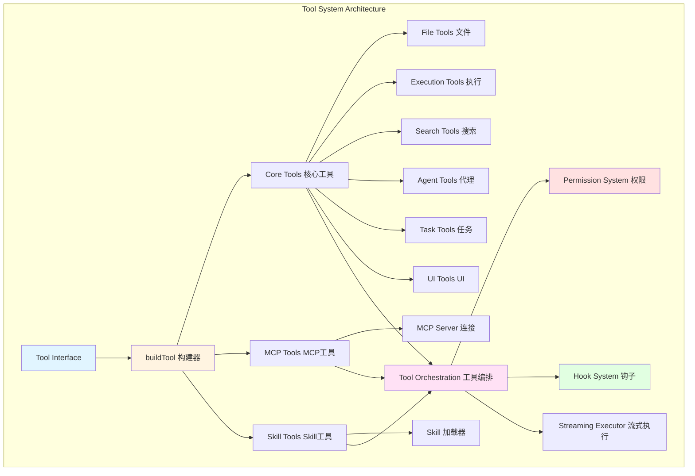
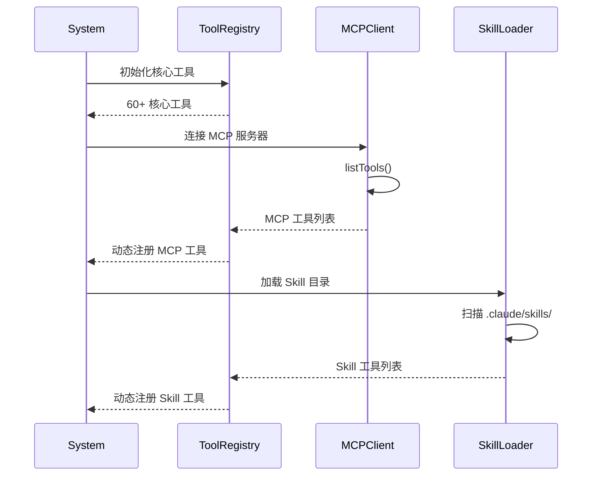
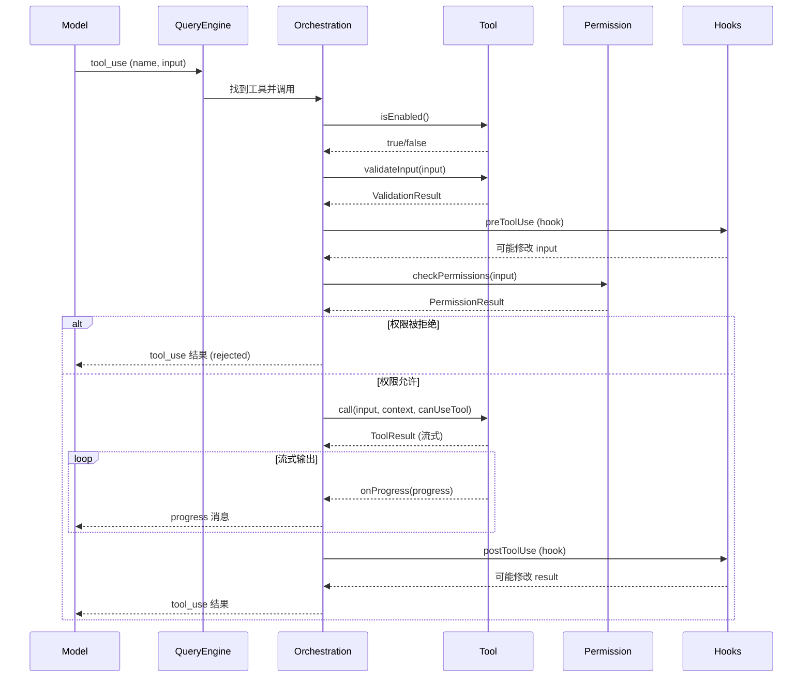
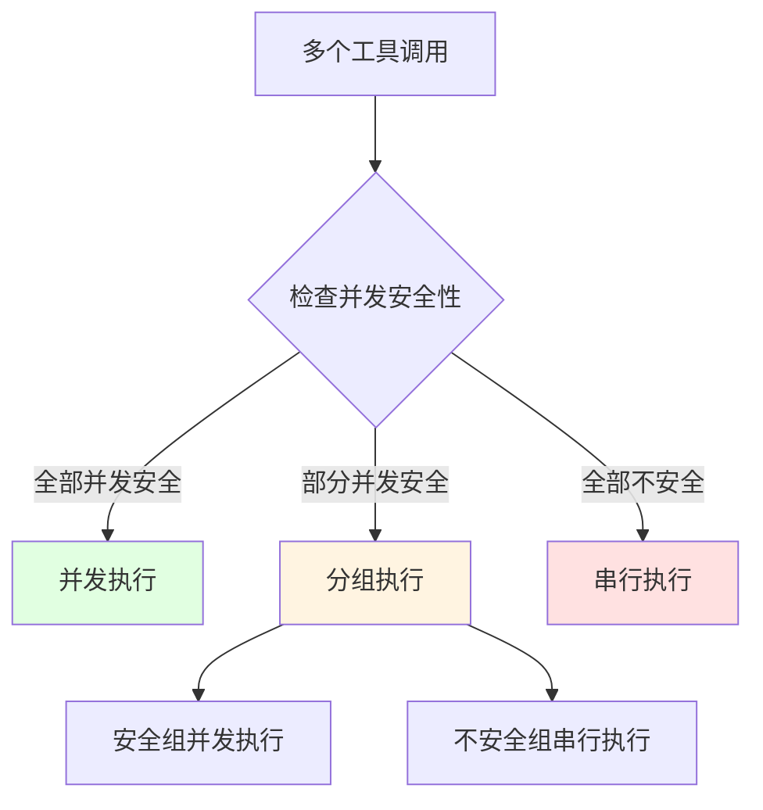

# 第7章 Tool System 工具系统架构

## 概述

Claude Code 的工具系统是其核心能力之一，提供了 60+ 个精心设计的工具，涵盖文件操作、命令执行、代码分析、团队协作、任务管理等多个领域。本章将深入分析工具系统的架构设计、接口定义、扩展机制以及最佳实践。

**本章要点：**

- **Tool 接口设计**：统一的工具定义接口和构建器模式
- **工具分类体系**：60+ 工具的功能分类和组织方式
- **生命周期管理**：工具的注册、查找、调用流程
- **权限系统集成**：工具级别的权限控制
- **扩展机制**：如何添加自定义工具（MCP、Skill）
- **并发控制**：工具执行的安全性保证

## 架构概览

### 整体架构



### 核心组件

1. **Tool.ts**：核心接口定义和类型系统
2. **buildTool**：工具构建器，提供默认实现
3. **toolOrchestration.ts**：工具编排和执行逻辑
4. **toolExecution.ts**：工具执行器
5. **toolHooks.ts**：工具钩子系统
6. **MCPTool**：MCP 协议适配器
7. **SkillTool**：Skill 加载器

## Tool 接口设计

### 核心 Tool 类型

```typescript
// src/Tool.ts
export type Tool<
  Input extends AnyObject = AnyObject,
  Output = unknown,
  P extends ToolProgressData = ToolProgressData,
> = {
  // 基础元数据
  name: string
  aliases?: string[]
  searchHint?: string
  
  // Schema 定义
  readonly inputSchema: Input
  readonly inputJSONSchema?: ToolInputJSONSchema
  outputSchema?: z.ZodType<unknown>
  
  // 核心方法
  call(
    args: z.infer<Input>,
    context: ToolUseContext,
    canUseTool: CanUseToolFn,
    parentMessage: AssistantMessage,
    onProgress?: ToolCallProgress<P>,
  ): Promise<ToolResult<Output>>
  
  description(
    input: z.infer<Input>,
    options: {
      isNonInteractiveSession: boolean
      toolPermissionContext: ToolPermissionContext
      tools: Tools
    },
  ): Promise<string>
  
  prompt(options: {
    getToolPermissionContext: () => Promise<ToolPermissionContext>
    tools: Tools
    agents: AgentDefinition[]
  }): Promise<string>
  
  // 安全性方法
  isEnabled(): boolean
  isConcurrencySafe(input: z.infer<Input>): boolean
  isReadOnly(input: z.infer<Input>): boolean
  isDestructive?(input: z.infer<Input>): boolean
  validateInput?(
    input: z.infer<Input>,
    context: ToolUseContext,
  ): Promise<ValidationResult>
  checkPermissions(
    input: z.infer<Input>,
    context: ToolUseContext,
  ): Promise<PermissionResult>
  
  // UI 渲染方法
  renderToolUseMessage(
    input: Partial<z.infer<Input>>,
    options: { theme: ThemeName; verbose: boolean },
  ): React.ReactNode
  
  renderToolResultMessage?(
    content: Output,
    progressMessages: ProgressMessage<P>[],
    options: {
      style?: 'condensed'
      theme: ThemeName
      tools: Tools
      verbose: boolean
    },
  ): React.ReactNode
  
  renderToolUseProgressMessage?(
    progressMessages: ProgressMessage<P>[],
    options: {
      tools: Tools
      verbose: boolean
    },
  ): React.ReactNode
  
  // 高级特性
  interruptBehavior?(): 'cancel' | 'block'
  isSearchOrReadCommand?(input: z.infer<Input>): {
    isSearch: boolean
    isRead: boolean
    isList?: boolean
  }
  isOpenWorld?(input: z.infer<Input>): boolean
  requiresUserInteraction?(): boolean
  shouldDefer?: boolean
  alwaysLoad?: boolean
  maxResultSizeChars: number
  strict?: boolean
}
```

### 设计要点

**1. 泛型设计**

```typescript
Tool<Input, Output, Progress>
```

- **Input**：输入参数的 Zod Schema
- **Output**：输出结果类型
- **Progress**：进度数据类型

**2. 可选方法**

大部分方法都是可选的，只有核心方法是必需的：

```typescript
// 必需方法
call()          // 执行工具
description()   // 生成描述
prompt()        // 生成提示词
inputSchema     // 输入 Schema

// 可选方法（有默认实现）
isEnabled()             // 默认 true
isConcurrencySafe()     // 默认 false
isReadOnly()            // 默认 false
checkPermissions()      // 默认 allow
userFacingName()        // 默认使用 name
```

**3. 类型安全**

```typescript
// 输入类型自动推断
type Input = z.infer<typeof tool.inputSchema>

// 输出类型在 call() 方法中明确
async function call(
  args: Input,  // 类型安全的输入
  ...
): Promise<ToolResult<Output>>
```

## buildTool 构建器

### 构建器模式

```typescript
// src/Tool.ts
type DefaultableToolKeys =
  | 'isEnabled'
  | 'isConcurrencySafe'
  | 'isReadOnly'
  | 'isDestructive'
  | 'checkPermissions'
  | 'toAutoClassifierInput'
  | 'userFacingName'

const TOOL_DEFAULTS = {
  isEnabled: () => true,
  isConcurrencySafe: (_input?: unknown) => false,
  isReadOnly: (_input?: unknown) => false,
  isDestructive: (_input?: unknown) => false,
  checkPermissions: (
    input: { [key: string]: unknown },
    _ctx?: ToolUseContext,
  ): Promise<PermissionResult> =>
    Promise.resolve({ behavior: 'allow', updatedInput: input }),
  toAutoClassifierInput: (_input?: unknown) => '',
  userFacingName: (_input?: unknown) => '',
}

export function buildTool<D extends AnyToolDef>(def: D): BuiltTool<D> {
  return {
    ...TOOL_DEFAULTS,
    userFacingName: () => def.name,
    ...def,
  } as BuiltTool<D>
}
```

**默认值策略（Fail-Closed）**

| 方法 | 默认值 | 理由 |
|------|--------|------|
| `isEnabled` | `true` | 默认启用，显式禁用 |
| `isConcurrencySafe` | `false` | 假设不安全，显式标记 |
| `isReadOnly` | `false` | 假设写入，需要标记只读 |
| `isDestructive` | `false` | 默认非破坏性 |
| `checkPermissions` | `allow` | 委托给全局权限系统 |

### 使用示例

```typescript
// 简单工具（只定义必需部分）
export const SimpleTool = buildTool({
  name: 'simple_tool',
  inputSchema: z.strictObject({
    message: z.string(),
  }),
  
  async call(input, context, canUseTool, parentMessage) {
    return {
      data: { result: `Hello ${input.message}` },
    };
  },
  
  async description() {
    return 'A simple example tool';
  },
  
  async prompt() {
    return 'Use this tool to greet users';
  },
});

// 完整工具（覆盖所有方法）
export const CompleteTool = buildTool({
  name: 'complete_tool',
  searchHint: 'perform complex operations',
  maxResultSizeChars: 30_000,
  strict: true,
  
  inputSchema: z.strictObject({
    path: z.string(),
    content: z.string(),
  }),
  
  outputSchema: z.object({
    success: z.boolean(),
    message: z.string(),
  }),
  
  // 核心方法
  async call(input, context, canUseTool, parentMessage, onProgress) {
    onProgress?.({
      toolUseID: parentMessage.id,
      data: { type: 'progress', message: 'Processing...' },
    });
    
    return {
      data: { success: true, message: 'Done' },
    };
  },
  
  async description(input) {
    return `Process file at ${input.path}`;
  },
  
  async prompt() {
    return 'Use this tool for file operations';
  },
  
  // 安全性方法
  isEnabled() {
    return process.env.FEATURE_ENABLED === 'true';
  },
  
  isConcurrencySafe(input) {
    // 只读操作可以并发
    return this.isReadOnly?.(input) ?? false;
  },
  
  isReadOnly(input) {
    return input.path.startsWith('/readonly/');
  },
  
  isDestructive(input) {
    return input.path.includes('delete');
  },
  
  async validateInput(input, context) {
    if (!input.path.startsWith('/')) {
      return {
        result: false,
        message: 'Path must be absolute',
        errorCode: 400,
      };
    }
    return { result: true };
  },
  
  async checkPermissions(input, context) {
    const permissionResult = await checkFileAccessPermission(
      input.path,
      context.getAppState().toolPermissionContext
    );
    return permissionResult;
  },
  
  // UI 方法
  renderToolUseMessage(input, options) {
    return <ToolUseMessage toolName="complete_tool" input={input} />;
  },
  
  renderToolResultMessage(content, progressMessages, options) {
    return <ToolResultMessage result={content} />;
  },
  
  renderToolUseProgressMessage(progressMessages, options) {
    return <ToolProgress progress={progressMessages} />;
  },
  
  // 高级特性
  interruptBehavior() {
    return 'block'; // 阻止中断
  },
  
  isSearchOrReadCommand(input) {
    return {
      isSearch: false,
      isRead: true,
    };
  },
  
  toAutoClassifierInput(input) {
    return `${input.path}: ${input.content.substring(0, 50)}`;
  },
});
```

## 工具分类体系

### 按功能分类

```mermaid
graph TD
    A[60+ Tools] --> B[文件操作 12个]
    A --> C[命令执行 5个]
    A --> D[搜索分析 8个]
    A --> E[代理系统 6个]
    A --> F[任务管理 7个]
    A --> G[团队协作 4个]
    A --> H[UI交互 8个]
    A --> I[MCP集成 动态]
    A --> J[Skill扩展 动态]
    
    B --> B1[FileRead]
    B --> B2[FileWrite]
    B --> B3[FileEdit]
    B --> B4[Glob]
    B --> B5[NotebookEdit]
    
    C --> C1[Bash]
    C --> C2[PowerShell]
    C --> C3[REPL]
    
    D --> D1[Grep]
    D --> D2[ToolSearch]
    D --> D3[LSP]
    D --> D4[WebSearch]
    D --> D5[WebFetch]
    
    E --> E1[AgentTool]
    E --> E2[AskUserQuestion]
    E --> E3[EnterPlanMode]
    E --> E4[ExitPlanMode]
    
    F --> F1[TaskCreate]
    F --> F2[TaskList]
    F --> F3[TaskGet]
    F --> F4[TaskUpdate]
    
    G --> G1[TeamCreate]
    G --> G2[TeamDelete]
    G --> G3[SendMessage]
```



### 核心工具列表

#### 1. 文件操作工具（File Operations）

| 工具 | 功能 | 只读 | 并发安全 |
|------|------|------|----------|
| **FileRead** | 读取文件内容 | ✓ | ✓ |
| **FileWrite** | 写入文件 | ✗ | ✗ |
| **FileEdit** | 编辑文件（字符串替换） | ✗ | ✗ |
| **Glob** | 文件模式匹配 | ✓ | ✓ |
| **NotebookEdit** | 编辑 Jupyter Notebook | ✗ | ✗ |

**示例：FileRead 工具**

```typescript
export const FileReadTool = buildTool({
  name: 'read_file',
  searchHint: 'read file contents',
  maxResultSizeChars: Infinity, // 不持久化，避免循环
  
  inputSchema: z.strictObject({
    file_path: z.string(),
    offset: z.number().optional(),
    limit: z.number().optional(),
  }),
  
  isReadOnly: () => true,  // 只读操作
  isConcurrencySafe: () => true,  // 可以并发执行
  
  isSearchOrReadCommand(input) {
    return { isRead: true, isSearch: false };
  },
  
  async call(input, context, canUseTool) {
    const content = await context.readFileState.read(
      input.file_path,
      { offset: input.offset, limit: input.limit }
    );
    
    return {
      data: { content },
    };
  },
  
  async description(input) {
    return `Read ${input.file_path}`;
  },
  
  async prompt() {
    return 'Read the contents of a file';
  },
});
```

#### 2. 命令执行工具（Execution Tools）

| 工具 | 功能 | 沙箱 | 权限 |
|------|------|------|------|
| **Bash** | 执行 Shell 命令 | ✓ | ✓ |
| **PowerShell** | 执行 PowerShell 命令 | ✓ | ✓ |
| **REPL** | 交互式 REPL | ✗ | ✓ |

**示例：Bash 工具特性**

```typescript
export const BashTool = buildTool({
  name: BASH_TOOL_NAME,
  searchHint: 'execute shell commands',
  maxResultSizeChars: 30_000,
  
  // 并发安全性：只读命令可并发
  isConcurrencySafe(input) {
    return this.isReadOnly?.(input) ?? false;
  },
  
  // 只读检测
  isReadOnly(input) {
    return checkReadOnlyConstraints(input);
  },
  
  // 破坏性操作检测
  isDestructive(input) {
    const DESTRUCTIVE_COMMANDS = ['rm', 'mv', 'cp', 'delete'];
    const cmd = input.command.split(' ')[0];
    return DESTRUCTIVE_COMMANDS.includes(cmd);
  },
  
  // 权限检查
  async checkPermissions(input, context) {
    return bashToolHasPermission(input, context);
  },
  
  // 分类器输入（用于安全分类）
  toAutoClassifierInput(input) {
    return input.command;
  },
  
  // 搜索/读命令检测
  isSearchOrReadCommand(input) {
    return isSearchOrReadBashCommand(input.command);
  },
});
```

#### 3. 搜索分析工具（Search & Analysis）

| 工具 | 功能 | 速度 | 用途 |
|------|------|------|------|
| **Grep** | 正则表达式搜索 | 快 | 代码搜索 |
| **Glob** | 文件模式匹配 | 快 | 文件查找 |
| **LSP** | 语言服务器协议 | 中 | 代码分析 |
| **WebSearch** | Web 搜索 | 慢 | 在线信息 |
| **WebFetch** | 获取网页 | 慢 | 内容提取 |

**示例：Grep 工具**

```typescript
export const GrepTool = buildTool({
  name: 'grep',
  searchHint: 'search files with regex patterns',
  maxResultSizeChars: 30_000,
  
  inputSchema: z.strictObject({
    pattern: z.string(),
    path: z.string().optional(),
    glob: z.string().optional(),
  }),
  
  isReadOnly: () => true,
  isConcurrencySafe: () => true,
  
  isSearchOrReadCommand() {
    return { isSearch: true, isRead: false };
  },
  
  async call(input, context) {
    const results = await ripgrepSearch({
      pattern: input.pattern,
      path: input.path,
      glob: input.glob,
    });
    
    return {
      data: { results },
    };
  },
  
  async description(input) {
    return `Search for "${input.pattern}"`;
  },
  
  async prompt() {
    return 'Search for a pattern in files using ripgrep';
  },
});
```

#### 4. 代理系统工具（Agent Tools）

| 工具 | 功能 | 用途 |
|------|------|------|
| **AgentTool** | 启动子代理 | 任务分解 |
| **AskUserQuestion** | 询问用户 | 收集信息 |
| **EnterPlanMode** | 进入规划模式 | 架构设计 |
| **ExitPlanMode** | 退出规划模式 | 执行实施 |

**示例：AgentTool**

```typescript
export const AgentTool = buildTool({
  name: 'agent',
  searchHint: 'delegate to specialized agents',
  maxResultSizeChars: 50_000,
  
  inputSchema: z.strictObject({
    name: z.string(),
    subagent_type: z.string(),
    prompt: z.string(),
    model: z.string().optional(),
  }),
  
  isConcurrencySafe: () => true,  // 代理可并发
  
  async call(input, context, canUseTool, parentMessage, onProgress) {
    const agent = await loadAgent(input.subagent_type);
    
    // 流式输出代理的进度
    for await (const progress of agent.run(input.prompt)) {
      onProgress?.({
        toolUseID: parentMessage.id,
        data: progress,
      });
    }
    
    return {
      data: { result: agent.finalResult },
    };
  },
  
  async description(input) {
    const agent = getAgentInfo(input.subagent_type);
    return `Delegate to ${agent.userFacingName}`;
  },
  
  async prompt() {
    return 'Use this tool to delegate work to specialized agents';
  },
});
```

#### 5. 任务管理工具（Task Management）

| 工具 | 功能 |
|------|------|
| **TaskCreate** | 创建任务 |
| **TaskList** | 列出任务 |
| **TaskGet** | 获取任务详情 |
| **TaskUpdate** | 更新任务状态 |
| **TaskOutput** | 读取任务输出 |

#### 6. 团队协作工具（Team Collaboration）

| 工具 | 功能 |
|------|------|
| **TeamCreate** | 创建团队 |
| **TeamDelete** | 删除团队 |
| **SendMessage** | 发送消息 |

#### 7. UI 交互工具（UI Tools）

| 工具 | 功能 |
|------|------|
| **AskUserQuestion** | 询问用户 |
| **ConfigTool** | 配置管理 |
| **BriefTool** | 附件管理 |
| **SyntheticOutputTool** | 合成输出 |

## 生命周期管理

### 工具注册流程



### 工具查找

```typescript
// src/Tool.ts
export function toolMatchesName(
  tool: { name: string; aliases?: string[] },
  name: string,
): boolean {
  return tool.name === name || (tool.aliases?.includes(name) ?? false)
}

export function findToolByName(tools: Tools, name: string): Tool | undefined {
  return tools.find(t => toolMatchesName(t, name))
}

// 使用示例
const bashTool = findToolByName(tools, 'bash');
const grepTool = findToolByName(tools, 'grep');
// 支持别名查找
const searchTool = findToolByName(tools, 'search'); // 'search' 是 'grep' 的别名
```

### 工具调用流程



## 权限系统集成

### 工具级别权限

```typescript
// 工具可以自定义权限检查
export const FileDeleteTool = buildTool({
  name: 'file_delete',
  
  // 自定义权限检查
  async checkPermissions(input, context) {
    // 1. 检查文件是否在允许的目录内
    const pathResult = checkPathConstraints(
      input.file_path,
      context.getAppState().toolPermissionContext
    );
    if (pathResult.behavior !== 'allow') {
      return pathResult;
    }
    
    // 2. 检查是否有明确的 delete 权限
    const explicitPermission = checkExplicitPermission(
      'file_delete',
      input.file_path,
      context.getAppState().toolPermissionContext
    );
    if (explicitPermission) {
      return explicitPermission;
    }
    
    // 3. 回退到全局权限系统
    return {
      behavior: 'passthrough',
      message: 'Requesting permission to delete file',
    };
  },
  
  // 破坏性操作标记
  isDestructive: () => true,
});
```

### 权限钩子匹配

```typescript
// 工具可以提供权限模式匹配器
export const BashTool = buildTool({
  name: 'bash',
  
  // 为钩子准备权限匹配器
  async preparePermissionMatcher(input) {
    const parsed = await parseForSecurity(input.command);
    if (parsed.kind !== 'simple') {
      return () => true;  // 无法解析，保守策略
    }
    
    const subcommands = parsed.commands.map(c => c.argv.join(' '));
    return (pattern) => {
      const prefix = permissionRuleExtractPrefix(pattern);
      return subcommands.some(cmd => {
        if (prefix !== null) {
          return cmd === prefix || cmd.startsWith(`${prefix} `);
        }
        return matchWildcardPattern(pattern, cmd);
      });
    };
  },
});
```

**使用场景：**

```typescript
// 用户配置权限钩子
{
  "hooks": {
    "pre_compact": [
      {
        "if": "Bash(git push)*",
        "then": "reject"
      },
      {
        "if": "Bash(npm test)*",
        "then": "accept"
      }
    ]
  }
}

// 钩子系统调用 preparePermissionMatcher
const matcher = await tool.preparePermissionMatcher(input);
const shouldReject = matcher("git push");
```

## 并发控制

### 并发安全性判断

```typescript
// 只读工具可以并发执行
export const FileReadTool = buildTool({
  isReadOnly: () => true,
  isConcurrencySafe: () => true,  // 只读操作默认并发安全
});

// Bash 工具根据命令内容判断
export const BashTool = buildTool({
  isConcurrencySafe(input) {
    // 如果工具本身是只读的，则并发安全
    if (this.isReadOnly?.(input)) {
      return true;
    }
    // 否则不安全
    return false;
  },
});
```

### 并发执行策略



**实际示例：**

```typescript
// 场景：模型同时调用多个工具
const toolUses = [
  { name: 'read_file', input: { file_path: 'a.txt' } },  // 并发安全
  { name: 'read_file', input: { file_path: 'b.txt' } },  // 并发安全
  { name: 'bash', input: { command: 'echo hello' } },     // 并发安全（只读）
  { name: 'bash', input: { command: 'npm install' } },   // 不安全
];

// 编排层分组
const safeTools = [
  toolUses[0],  // read_file
  toolUses[1],  // read_file
  toolUses[2],  // bash echo (只读)
];

const unsafeTools = [
  toolUses[3],  // bash npm install (写入)
];

// 并发执行安全工具
const safeResults = await Promise.all(
  safeTools.map(tool => executeTool(tool))
);

// 串行执行不安全工具
for (const tool of unsafeTools) {
  await executeTool(tool);
}
```

## 扩展机制

### MCP 工具扩展

**MCP (Model Context Protocol)** 是一种标准协议，允许动态扩展工具。

```typescript
// MCP 工具动态加载
class MCPClient {
  async connectToServer(serverConfig: MCPConfig) {
    const client = new Client(serverConfig.name, {
      capabilities: {}
    });
    
    await client.connect(transport);
    
    // 获取服务器提供的工具列表
    const toolsResult = await client.listTools();
    
    // 转换为 Claude Code 工具
    return toolsResult.tools.map(mcpTool => 
      this.createMCPTool(mcpTool, client)
    );
  }
  
  createMCPTool(mcpTool, client): Tool {
    return buildTool({
      name: `mcp__${this.serverName}__${mcpTool.name}`,
      mcpInfo: { 
        serverName: this.serverName, 
        toolName: mcpTool.name 
      },
      
      inputSchema: convertJSONSchemaToZod(mcpTool.inputSchema),
      inputJSONSchema: mcpTool.inputSchema,
      
      async call(input, context) {
        const result = await client.callTool({
          name: mcpTool.name,
          arguments: input,
        });
        
        return {
          data: result.content,
          mcpMeta: result._meta,
        };
      },
      
      async description() {
        return mcpTool.description;
      },
      
      async prompt() {
        return mcpTool.description;
      },
      
      isMcp: true,
    });
  }
}
```

### Skill 工具扩展

**Skill** 是用户自定义的工具脚本。

```typescript
// Skill 加载器
class SkillLoader {
  async loadSkillsFromDirectory(skillDir: string): Promise<Tool[]> {
    const skillFiles = await glob('**/*.md', { cwd: skillDir });
    
    return Promise.all(
      skillFiles.map(file => this.loadSkill(file))
    );
  }
  
  async loadSkill(skillFile: string): Promise<Tool> {
    const content = await fs.readFile(skillFile, 'utf-8');
    const frontmatter = extractFrontmatter(content);
    
    return buildTool({
      name: frontmatter.name,
      description: frontmatter.description,
      
      inputSchema: z.object({
        prompt: z.string(),
      }),
      
      async call(input, context) {
        // 执行 Skill 中的代码
        const result = await executeSkillCode(
          content,
          input.prompt,
          context
        );
        
        return { data: result };
      },
    });
  }
}
```

## 工具编排

### 编排层职责

```typescript
// src/services/tools/toolOrchestration.ts
export class ToolOrchestrator {
  async executeToolUse(
    toolUse: ToolUseBlockParam,
    context: ToolUseContext,
  ): Promise<{
    result: ToolResultBlockParam
    newMessages?: Message[]
  }> {
    // 1. 查找工具
    const tool = findToolByName(context.options.tools, toolUse.name);
    if (!tool) {
      throw new Error(`Tool not found: ${toolUse.name}`);
    }
    
    // 2. 验证输入
    if (tool.validateInput) {
      const validation = await tool.validateInput(
        toolUse.input,
        context
      );
      if (!validation.result) {
        return this.createRejectedResult(
          toolUse,
          validation.message
        );
      }
    }
    
    // 3. 检查是否启用
    if (!tool.isEnabled()) {
      throw new Error(`Tool is disabled: ${tool.name}`);
    }
    
    // 4. Pre-hook 钩子
    const hookResult = await this.runPreHooks(
      tool,
      toolUse.input,
      context
    );
    if (hookResult.behavior === 'reject') {
      return this.createRejectedResult(
        toolUse,
        hookResult.message
      );
    }
    
    // 5. 权限检查
    const permissionResult = await tool.checkPermissions(
      hookResult.updatedInput ?? toolUse.input,
      context
    );
    
    if (permissionResult.behavior === 'deny') {
      return this.createRejectedResult(
        toolUse,
        permissionResult.message
      );
    }
    
    if (permissionResult.behavior === 'ask') {
      // 请求用户批准
      const userDecision = await this.requestPermission(
        tool,
        permissionResult,
        context
      );
      
      if (userDecision === 'deny') {
        return this.createRejectedResult(
          toolUse,
          'User denied permission'
        );
      }
    }
    
    // 6. 执行工具
    const finalInput = permissionResult.updatedInput ?? toolUse.input;
    const result = await this.executeToolCall(
      tool,
      finalInput,
      context,
      hookResult.parentMessage
    );
    
    // 7. Post-hook 钩子
    const postHookResult = await this.runPostHooks(
      tool,
      finalInput,
      result,
      context
    );
    
    return {
      result: postHookResult.result,
      newMessages: postHookResult.newMessages,
    };
  }
  
  private async executeToolCall(
    tool: Tool,
    input: unknown,
    context: ToolUseContext,
    parentMessage: AssistantMessage,
  ): Promise<ToolResultBlockParam> {
    const canUseTool = this.createCanUseToolFn(context);
    const progressMessages: ProgressMessage[] = [];
    
    const onProgress: ToolCallProgress = (progress) => {
      progressMessages.push({
        type: 'progress',
        message_id: parentMessage.id,
        ...progress,
      });
      
      // 实时发送进度消息
      context.setToolJSX?.({
        jsx: tool.renderToolUseProgressMessage?.(
          progressMessages,
          { tools: context.options.tools, verbose: context.options.verbose }
        ),
        shouldHidePromptInput: false,
      });
    };
    
    // 调用工具
    const toolResult = await tool.call(
      input,
      context,
      canUseTool,
      parentMessage,
      onProgress
    );
    
    // 转换结果
    return tool.mapToolResultToToolResultBlockParam(
      toolResult.data,
      parentMessage.id
    );
  }
}
```

## 高级特性

### 1. 延迟加载（Deferred Loading）

```typescript
export const HeavyTool = buildTool({
  name: 'heavy_tool',
  shouldDefer: true,  // 延迟加载
  searchHint: 'perform heavy computation',
  
  inputSchema: z.strictObject({
    query: z.string(),
  }),
  
  // ... 其他方法
});
```

**工作原理：**

```typescript
// 在系统提示词中，延迟工具只显示摘要
{
  "name": "heavy_tool",
  "defer_loading": true,
  "description": "Use ToolSearch to find and load this tool"
}

// 当模型需要使用时，先调用 ToolSearch
{
  "name": "tool_search",
  "query": "heavy computation"
}

// ToolSearch 返回完整工具定义
{
  "name": "heavy_tool",
  "description": "Full description...",
  "input_schema": { ... }
}
```

### 2. 始终加载（Always Load）

```typescript
export const CriticalTool = buildTool({
  name: 'critical_tool',
  alwaysLoad: true,  // 始终在提示词中显示完整定义
  
  // ... 其他方法
});
```

**使用场景：**

- 模型必须在第一轮就能看到的工具
- 核心工具（Bash, FileRead 等）
- 安全关键工具

### 3. 分组渲染（Grouped Rendering）

```typescript
export const GrepTool = buildTool({
  name: 'grep',
  
  renderGroupedToolUse(toolUses, options) {
    // 多个 grep 调用可以分组显示
    const totalMatches = toolUses.reduce(
      (sum, t) => sum + (t.result?.output.matchCount || 0),
      0
    );
    
    return (
      <GrepGroupSummary
        toolUses={toolUses}
        totalMatches={totalMatches}
      />
    );
  },
});
```

### 4. 透明包装（Transparent Wrapper）

```typescript
export const REPLTool = buildTool({
  name: 'repl',
  isTransparentWrapper: () => true,  // 委托渲染给内部工具
  
  // renderToolUseMessage 返回 null
  // 内部工具的消息直接显示
});
```

## 最佳实践

### 1. 工具命名规范

```typescript
// ✅ 好的命名（清晰、描述性）
export const FileReadTool = buildTool({ name: 'read_file' });
export const GrepTool = buildTool({ name: 'grep' });
export const AgentTool = buildTool({ name: 'agent' });

// ❌ 避免的命名（模糊、简写）
export const FileTool = buildTool({ name: 'file_op' });  // 太泛
export const SearchTool = buildTool({ name: 'srch' });    // 简写
```

### 2. Schema 设计

```typescript
// ✅ 好的 Schema（详细、有描述）
export const GoodTool = buildTool({
  inputSchema: z.strictObject({
    file_path: z.string()
      .describe('Absolute path to the file')
      .min(1),
    max_results: z.number()
      .describe('Maximum number of results to return')
      .optional()
      .default(100),
  }),
});

// ❌ 避免的 Schema（缺少描述）
export const BadTool = buildTool({
  inputSchema: z.object({
    path: z.string(),  // 没有描述，相对路径还是绝对？
    n: z.number(),     // 缩写，不清楚含义
  }),
});
```

### 3. 错误处理

```typescript
export const RobustTool = buildTool({
  name: 'robust_tool',
  
  async call(input, context) {
    try {
      const result = await performOperation(input);
      return { data: result };
    } catch (error) {
      // 提供有用的错误信息
      if (error instanceof FileNotFoundError) {
        return {
          data: {
            error: `File not found: ${input.file_path}`,
            suggestion: 'Check the file path and try again',
          },
        };
      }
      
      // 未知错误也要处理
      return {
        data: {
          error: 'An unexpected error occurred',
          details: error.message,
        },
      };
    }
  },
});
```

### 4. 进度报告

```typescript
export const ProgressReportingTool = buildTool({
  name: 'progress_tool',
  
  async call(input, context, canUseTool, parentMessage, onProgress) {
    // 报告初始进度
    onProgress?.({
      toolUseID: parentMessage.id,
      data: { 
        type: 'progress', 
        message: 'Starting operation...',
        percentage: 0,
      },
    });
    
    // 执行操作并更新进度
    let progress = 0;
    for (const item of input.items) {
      await processItem(item);
      
      progress += 100 / input.items.length;
      onProgress?.({
        toolUseID: parentMessage.id,
        data: { 
          type: 'progress', 
          message: `Processed ${progress.toFixed(0)}%`,
          percentage: progress,
        },
      });
    }
    
    // 报告完成
    onProgress?.({
      toolUseID: parentMessage.id,
      data: { 
        type: 'complete', 
        message: 'Operation completed',
      },
    });
    
    return { data: { success: true } };
  },
  
  renderToolUseProgressMessage(progressMessages) {
    return (
      <ProgressBar 
        progress={progressMessages}
        showPercentage={true}
      />
    );
  },
});
```

### 5. 只读工具优化

```typescript
export const OptimizedReadTool = buildTool({
  name: 'optimized_read',
  
  // 标记为只读
  isReadOnly: () => true,
  
  // 只读工具可以并发执行
  isConcurrencySafe: () => true,
  
  // 搜索/读命令标记（可折叠显示）
  isSearchOrReadCommand() {
    return { isRead: true, isSearch: false };
  },
  
  // 不需要权限检查（只读操作）
  async checkPermissions(input, context) {
    return { behavior: 'allow', updatedInput: input };
  },
});
```

## 完整示例

### 示例：自定义文件监控工具

```typescript
// 自定义工具：监控文件变化
export const FileWatchTool = buildTool({
  name: 'file_watch',
  searchHint: 'monitor file changes',
  maxResultSizeChars: 10_000,
  
  inputSchema: z.strictObject({
    file_path: z.string().describe('Path to the file to watch'),
    duration_ms: z.number()
      .describe('How long to watch in milliseconds')
      .default(5000),
    pattern: z.string()
      .optional()
      .describe('Regex pattern to match changes'),
  }),
  
  outputSchema: z.object({
    changes: z.array(z.object({
      timestamp: z.number(),
      content: z.string(),
    })),
    totalChanges: z.number(),
  }),
  
  // 安全性方法
  isEnabled() {
    return process.platform !== 'win32';  // Unix only
  },
  
  isReadOnly: () => true,  // 只监控，不修改
  isConcurrencySafe: () => true,
  
  isSearchOrReadCommand() {
    return { isRead: true, isSearch: false };
  },
  
  // 权限检查
  async checkPermissions(input, context) {
    // 必须在项目目录内
    const projectRoot = getProjectRoot();
    if (!input.file_path.startsWith(projectRoot)) {
      return {
        behavior: 'deny',
        message: 'Can only watch files within project directory',
      };
    }
    return { behavior: 'allow', updatedInput: input };
  },
  
  // 核心执行
  async call(input, context, canUseTool, parentMessage, onProgress) {
    const watcher = fs.watch(input.file_path);
    const changes: Array<{ timestamp: number; content: string }> = [];
    const startTime = Date.now();
    
    onProgress?.({
      toolUseID: parentMessage.id,
      data: { type: 'progress', message: 'Watching for changes...' },
    });
    
    return new Promise((resolve, reject) => {
      const timeout = setTimeout(() => {
        watcher.close();
        resolve({
          data: { changes, totalChanges: changes.length },
        });
      }, input.duration_ms);
      
      watcher.on('change', () => {
        const content = fs.readFileSync(input.file_path, 'utf-8');
        changes.push({ timestamp: Date.now(), content });
        
        onProgress?.({
          toolUseID: parentMessage.id,
          data: { 
            type: 'progress', 
            message: `Detected ${changes.length} changes`,
          },
        });
      });
      
      watcher.on('error', (error) => {
        clearTimeout(timeout);
        reject(error);
      });
    });
  },
  
  // 元数据方法
  async description(input) {
    return `Watch ${input.file_path} for ${input.duration_ms}ms`;
  },
  
  async prompt() {
    return 'Monitor a file for changes over a period of time';
  },
  
  userFacingName(input) {
    return input ? `Watch ${path.basename(input.file_path)}` : 'File Watch';
  },
  
  getActivityDescription(input) {
    return `Watching ${path.basename(input.file_path)}`;
  },
  
  toAutoClassifierInput(input) {
    return `watch ${input.file_path}`;
  },
  
  // UI 渲染
  renderToolUseMessage(input, options) {
    return (
      <ToolUseMessage 
        toolName="file_watch"
        input={`file_path: ${input.file_path}, duration: ${input.duration_ms}ms`}
      />
    );
  },
  
  renderToolResultMessage(content, progressMessages) {
    return (
      <FileWatchResult 
        changes={content.data.changes}
        totalChanges={content.data.totalChanges}
        progressMessages={progressMessages}
      />
    );
  },
  
  renderToolUseProgressMessage(progressMessages) {
    const latest = progressMessages[progressMessages.length - 1];
    return (
      <FileWatchProgress 
        message={latest?.data.message || 'Watching...'}
        changes={latest?.data.changes || 0}
      />
    );
  },
});
```

## 调试与测试

### 工具测试

```typescript
import { describe, it, expect } from 'vitest';
import { FileReadTool } from './FileReadTool';

describe('FileReadTool', () => {
  it('should be read-only and concurrency-safe', () => {
    expect(FileReadTool.isReadOnly?.()).toBe(true);
    expect(FileReadTool.isConcurrencySafe?.()).toBe(true);
  });
  
  it('should be enabled by default', () => {
    expect(FileReadTool.isEnabled()).toBe(true);
  });
  
  it('should validate input', async () => {
    const context = createMockContext();
    const result = await FileReadTool.validateInput?.(
      { file_path: '/etc/passwd' },
      context
    );
    
    expect(result?.result).toBe(true);
  });
  
  it('should reject invalid input', async () => {
    const context = createMockContext();
    const result = await FileReadTool.validateInput?.(
      { file_path: '' },  // 空路径
      context
    );
    
    expect(result?.result).toBe(false);
    expect(result?.message).toContain('file path');
  });
});
```

### 调试工具

```typescript
// 列出所有工具
function listAllTools(tools: Tools) {
  return tools.map(tool => ({
    name: tool.name,
    aliases: tool.aliases,
    enabled: tool.isEnabled(),
    concurrencySafe: tool.isConcurrencySafe({}),
    readOnly: tool.isReadOnly({}),
    destructive: tool.isDestructive?.({}),
  }));
}

// 查找工具
function findToolsByPattern(tools: Tools, pattern: string) {
  return tools.filter(tool => 
    tool.name.includes(pattern) ||
    tool.searchHint?.includes(pattern) ||
    tool.aliases?.some(alias => alias.includes(pattern))
  );
}

// 测试工具调用
async function testTool(
  tool: Tool,
  input: unknown,
  context: ToolUseContext
) {
  console.log(`Testing tool: ${tool.name}`);
  console.log(`Input:`, input);
  
  // 检查权限
  const permission = await tool.checkPermissions(input, context);
  console.log(`Permission:`, permission.behavior);
  
  if (permission.behavior !== 'allow') {
    console.log('Permission denied, skipping execution');
    return;
  }
  
  // 执行工具
  const result = await tool.call(
    input,
    context,
    () => true,  // canUseTool
    {} as AssistantMessage,
    undefined    // onProgress
  );
  
  console.log(`Result:`, result.data);
  return result;
}
```

## 性能考虑

### 1. 延迟加载大型工具

```typescript
export const HeavyAnalysisTool = buildTool({
  name: 'heavy_analysis',
  shouldDefer: true,  // 只在需要时加载
  
  async call(input, context) {
    // 动态导入重型依赖
    const { analyze } = await import('./heavy-analyzer');
    const result = await analyze(input);
    return { data: result };
  },
});
```

### 2. 缓存工具描述

```typescript
class CachedDescriptionTool {
  private descriptionCache = new Map<string, string>();
  
  async description(input, options) {
    const cacheKey = JSON.stringify(input);
    
    if (this.descriptionCache.has(cacheKey)) {
      return this.descriptionCache.get(cacheKey)!;
    }
    
    const desc = await this.generateDescription(input, options);
    this.descriptionCache.set(cacheKey, desc);
    return desc;
  }
}
```

### 3. 批量操作优化

```typescript
export const BatchFileReadTool = buildTool({
  name: 'batch_read_files',
  
  inputSchema: z.strictObject({
    file_paths: z.array(z.string()),
  }),
  
  async call(input, context) {
    // 并发读取多个文件
    const results = await Promise.all(
      input.file_paths.map(async (filePath) => {
        try {
          const content = await context.readFileState.read(filePath);
          return { filePath, content, success: true };
        } catch (error) {
          return { filePath, error: error.message, success: false };
        }
      })
    );
    
    return { data: { results } };
  },
});
```

## 总结

Tool System 是 Claude Code 的核心能力之一，通过以下设计原则实现了强大的扩展性：

1. **统一接口**：所有工具实现相同的 Tool 接口
2. **Builder 模式**：buildTool 提供默认实现，简化工具开发
3. **类型安全**：泛型设计确保编译时类型检查
4. **权限集成**：工具级别的权限控制
5. **并发控制**：isConcurrencySafe 确保执行安全
6. **扩展机制**：MCP 和 Skill 支持动态扩展
7. **UI 集成**：丰富的渲染方法支持自定义 UI

**关键设计原则：**

- **Fail-Closed 默认值**：不安全的行为需要显式标记
- **渐进式增强**：简单工具只需实现核心方法
- **组合优于继承**：通过组合不同工具实现复杂功能
- **关注点分离**：编排、权限、钩子系统各司其职

Tool System 的实现展示了如何在保持简单性的同时支持 60+ 工具的复杂生态系统，这对于构建可扩展的 AI 助手系统具有重要的参考价值。

## 扩展阅读

- **工具开发指南**：`examples/simple-tool/CurrentTimeTool.ts`
- **MCP 协议规范**：https://modelcontextprotocol.io/
- **Zod 文档**：https://zod.dev/
- **React Ink 文档**：https://github.com/vadimdemedes/ink

## 下一章

第 8 章将深入探讨 **Permissions System（权限系统）**，介绍三级权限模式（default/auto/bypass）的实现细节。
