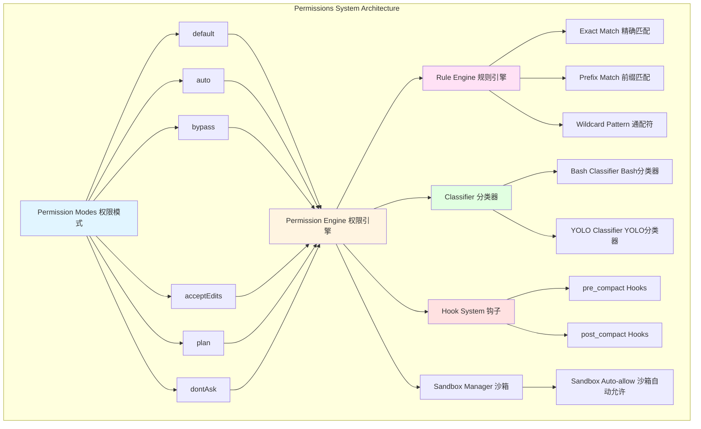
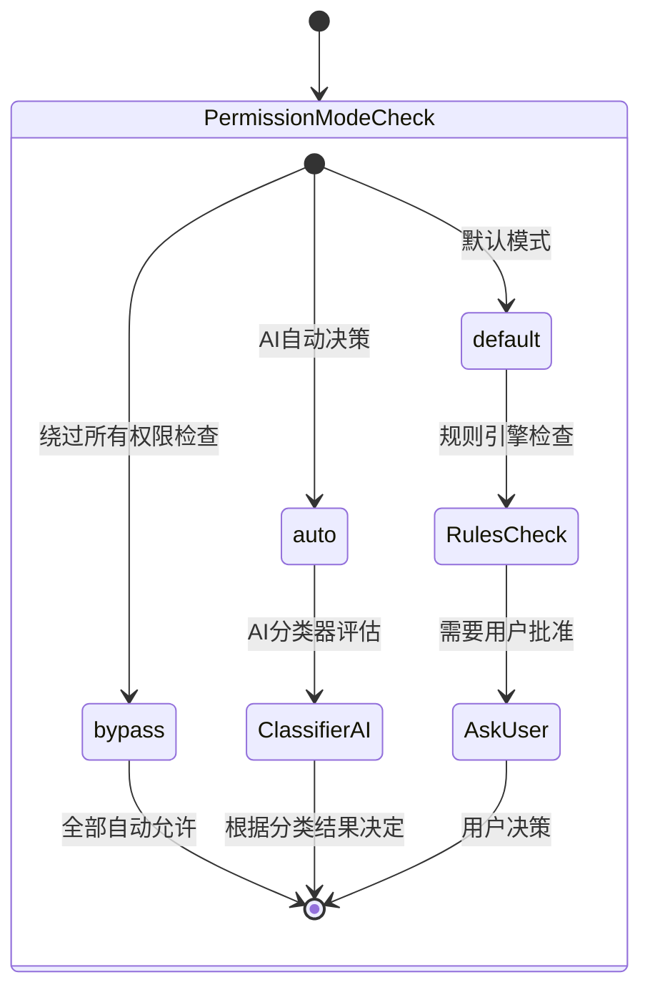
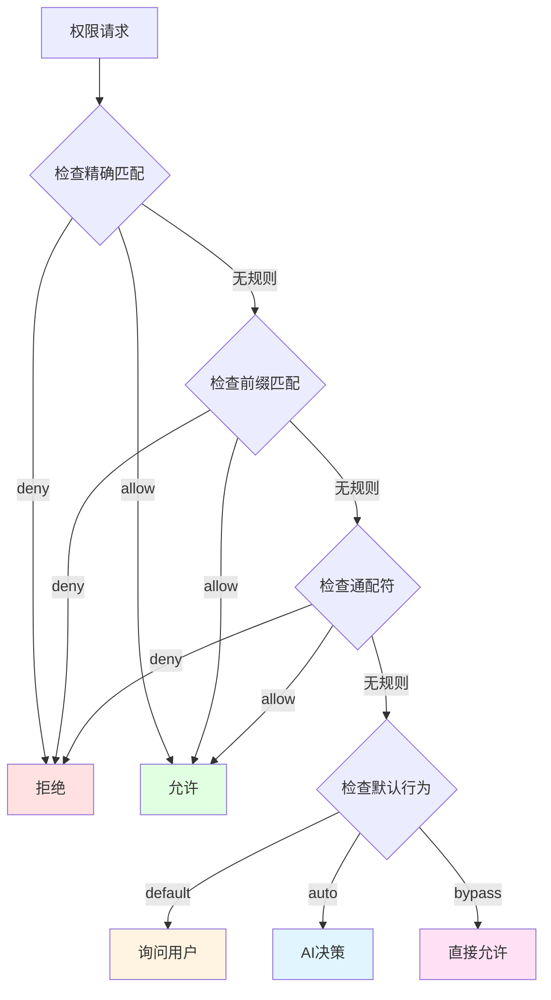
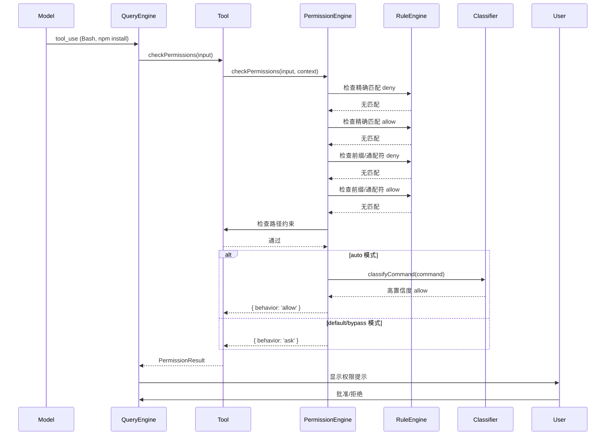
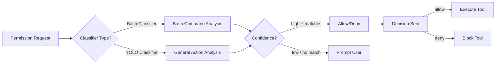

# 第8章 Permissions System 权限系统

## 概述

Claude Code 的权限系统是其安全模型的核心，通过多层防护机制确保 AI 助手在执行敏感操作时不会对系统造成意外损害。本章将深入分析权限系统的架构设计、三级权限模式、规则引擎、分类器集成以及最佳实践。

**本章要点：**

- **三级权限模式**：default、auto、bypass 的设计和使用场景
- **权限规则系统**：exact/prefix/wildcard 三种匹配模式
- **权限检查流程**：从工具调用到决策的完整链路
- **分类器集成**：AI 驱动的权限决策（Haiku）
- **拒绝追踪机制**：防止权限提示疲劳
- **钩子系统**：pre/post_compact 钩子集成
- **沙箱集成**：沙箱模式与权限的交互

## 架构概览

### 整体架构



### 核心组件

1. **PermissionMode**: 权限模式定义
2. **PermissionResult**: 权限决策结果
3. **PermissionRule**: 权限规则定义
4. **permissions.ts**: 权限检查核心逻辑
5. **classifierDecision**: AI 分类器决策
6. **denialTracking**: 拒绝追踪状态
7. **PermissionUpdate**: 权限更新机制

## 权限模式详解

### 三级权限模式



### 1. Default 模式（默认模式）

**特点：**
- ✅ 安全第一，需要明确批准
- ✅ 适合学习和开发环境
- ✅ 用户完全控制权限
- ❌ 需要频繁确认

**行为：**

```typescript
// default 模式的权限检查流程
async function checkPermissionInDefaultMode(
  tool: Tool,
  input: unknown,
  context: ToolUseContext
): Promise<PermissionResult> {
  // 1. 检查精确匹配的 deny 规则
  const denyResult = checkExactMatchDenyRules(tool, input, context);
  if (denyResult) {
    return { behavior: 'deny', decisionReason: denyResult };
  }
  
  // 2. 检查精确匹配的 allow 规则
  const allowResult = checkExactMatchAllowRules(tool, input, context);
  if (allowResult) {
    return { behavior: 'allow', updatedInput: allowResult.input };
  }
  
  // 3. 检查前缀和通配符规则
  const patternResult = checkPatternRules(tool, input, context);
  if (patternResult) {
    return patternResult;
  }
  
  // 4. 检查路径约束
  const pathResult = await checkPathConstraints(tool, input, context);
  if (pathResult) {
    return pathResult;
  }
  
  // 5. 询问用户
  return {
    behavior: 'ask',
    message: createPermissionRequestMessage(tool.name),
  };
}
```

**使用场景：**
- 初次使用 Claude Code
- 处理敏感文件（如 .env, config 文件）
- 执行破坏性操作（rm, git push）
- 不确定命令安全性时

### 2. Auto 模式（自动模式）

**特点：**
- ✅ AI 自动决策，减少用户干扰
- ✅ 基于规则和分类器的智能判断
- ✅ 安全操作自动允许
- ❌ 需要 GrowthBook 特性开关

**行为：**

```typescript
// auto 模式的权限检查流程
async function checkPermissionInAutoMode(
  tool: Tool,
  input: unknown,
  context: ToolUseContext
): Promise<PermissionResult> {
  // 1. 检查明确的 deny 规则（优先级最高）
  const denyResult = checkExactMatchDenyRules(tool, input, context);
  if (denyResult) {
    return { behavior: 'deny', decisionReason: denyResult };
  }
  
  // 2. 检查明确的 allow 规则
  const allowResult = checkExactMatchAllowRules(tool, input, context);
  if (allowResult) {
    return { behavior: 'allow', updatedInput: allowResult.input };
  }
  
  // 3. 调用 AI 分类器进行决策
  const classifierResult = await classifyBashCommand(
    tool.name,
    input,
    context,
    'allow',  // 询问分类器：应该允许吗？
    context.abortController.signal
  );
  
  if (classifierResult.matches && classifierResult.confidence === 'high') {
    // 高置信度允许
    return {
      behavior: 'allow',
      updatedInput: input,
      decisionReason: {
        type: 'classifier',
        classifier: 'bash_allow',
        reason: classifierResult.matchedDescription,
      },
    };
  }
  
  // 4. 低置信度或不确定，询问用户
  return {
    behavior: 'ask',
    message: createPermissionRequestMessage(tool.name),
  };
}
```

**分类器决策示例：**

```typescript
// 分类器评估：这是一个安全的读取操作吗？
const classifierInput = {
  tool: 'Bash',
  command: 'cat file.txt',
  context: {
    workingDirectory: '/home/user/project',
    recentHistory: ['ls -la', 'pwd'],
  },
};

// 分类器响应
const classifierResult = {
  matches: true,
  confidence: 'high',
  reason: 'This is a safe file read operation within the project directory',
  matchedDescription: 'Bash(cat file.txt:*) is a safe read operation',
};

// 结果：自动允许，无需用户确认
```

**使用场景：**
- 经验丰富的开发者
- 重复性任务（构建、测试）
- 只读操作
- 自动化脚本

### 3. Bypass 模式（绕过模式）

**特点：**
- ✅ 完全绕过权限检查
- ✅ 最高权限，完全信任
- ⚠️ 仅用于可信环境
- ❌ 安全风险极高

**行为：**

```typescript
// bypass 模式的权限检查流程
async function checkPermissionInBypassMode(
  tool: Tool,
  input: unknown,
  context: ToolUseContext
): Promise<PermissionResult> {
  // 直接返回 allow，不进行任何检查
  return {
    behavior: 'allow',
    updatedInput: input,
    decisionReason: {
      type: 'mode',
      mode: 'bypass',
    },
  };
}
```

**安全限制：**

```typescript
// bypass 模式的安全保护
function enableBypassModeSafely(): boolean {
  // 1. 检查 kill switch
  if (!isBypassPermissionsKillSwitchEnabled()) {
    console.warn('Bypass permissions mode is disabled by kill switch');
    return false;
  }
  
  // 2. 检查环境变量
  if (process.env.NODE_ENV === 'production') {
    console.warn('Bypass permissions mode is not allowed in production');
    return false;
  }
  
  // 3. 检查是否在本地开发环境
  if (!isLocalDevelopmentEnvironment()) {
    console.warn('Bypass permissions mode is only allowed in local development');
    return false;
  }
  
  return true;
}
```

**使用场景：**
- 本地开发环境
- CI/CD 管道（已隔离环境）
- 完全可信的个人项目
- **不推荐用于生产环境**

### 其他模式

#### acceptEdits 模式

```typescript
// acceptEdits 模式
{
  mode: 'acceptEdits',
  
  // 文件编辑工具自动允许
  'FileEdit*': 'allow',
  'FileWrite*': 'allow',
  
  // 其他工具仍需权限检查
  'Bash*': 'ask',
  'AgentTool*': 'ask',
}
```

#### plan 模式

```typescript
// plan 模式（规划模式）
{
  mode: 'plan',
  
  // 进入规划模式时保存原模式
  prePlanMode: 'default',
  
  // 规划模式下禁止某些操作
  'git push': 'deny',
  'rm -rf': 'deny',
  'FileWrite': 'ask',
  
  // 分析操作自动允许
  'Grep': 'allow',
  'Glob': 'allow',
}
```

#### dontAsk 模式

```typescript
// dontAsk 模式（不询问模式）
{
  mode: 'dontAsk',
  
  // 有明确规则则执行，否则拒绝
  'FileRead*': 'allow',
  'Bash(npm test)': 'allow',
  
  // 没有规则的操作拒绝（不询问）
  'Bash(rm *)': 'deny',  // 拒绝删除
  'Bash(git push)': 'deny',  // 拒绝推送
}
```

## 权限规则系统

### 规则类型

```mermaid
graph LR
    A[Permission Rule] --> B{Type?}
    
    B -->|exact| C[精确匹配<br/>Bash(npm test)]
    B -->|prefix| D[前缀匹配<br/>Bash(npm:*)]
    B -->|wildcard| E[通配符<br/>Bash(git *)]
    
    C --> F{Behavior?}
    D --> F
    E --> F
    
    F -->|allow| G[允许执行]
    F -->|deny| H[拒绝执行]
    F -->|ask| I[询问用户]
```

### 规则语法

#### 1. 精确匹配规则（Exact Match）

```typescript
// 规则格式
{
  toolName: 'Bash',
  ruleContent: 'npm test',
  behavior: 'allow'
}

// 匹配逻辑
function matchesExactRule(
  toolName: string,
  command: string,
  rule: PermissionRule
): boolean {
  if (toolName !== rule.toolName) return false;
  
  // 完全匹配
  return command === rule.ruleContent;
}

// 示例
{
  toolName: 'Bash',
  ruleContent: 'npm test',
  behavior: 'allow'
}
// ✅ 匹配: 'npm test'
// ❌ 不匹配: 'npm test --watch'
// ❌ 不匹配: 'npm run test'
```

#### 2. 前缀匹配规则（Prefix Match）

```typescript
// 规则格式
{
  toolName: 'Bash',
  ruleContent: 'npm test:*',
  behavior: 'allow'
}

// 匹配逻辑
function matchesPrefixRule(
  toolName: string,
  command: string,
  rule: PermissionRule
): boolean {
  const prefix = rule.ruleContent;
  
  // 检查是否以 prefix 开头，且后跟空格或结束
  if (command === prefix) return true;
  if (command.startsWith(prefix + ' ')) return true;
  
  return false;
}

// 示例
{
  toolName: 'Bash',
  ruleContent: 'npm test:*',
  behavior: 'allow'
}
// ✅ 匹配: 'npm test'
// ✅ 匹配: 'npm test --watch'
// ✅ 匹配: 'npm test -- --coverage'
// ❌ 不匹配: 'npm run test'
// ❌ 不匹配: 'npm build'
```

#### 3. 通配符规则（Wildcard Pattern）

```typescript
// 规则格式
{
  toolName: 'Bash',
  ruleContent: 'git *',
  behavior: 'allow'
}

// 匹配逻辑
function matchesWildcardRule(
  toolName: string,
  command: string,
  rule: PermissionRule
): boolean {
  const pattern = rule.ruleContent;
  
  // 将通配符模式转换为正则表达式
  // git * → /^git .*$/
  const regexPattern = pattern
    .replace('*', '.*')
    .replace('?', '.');
  
  const regex = new RegExp(`^${regexPattern}$`);
  return regex.test(command);
}

// 示例
{
  toolName: 'Bash',
  ruleContent: 'git *',
  behavior: 'allow'
}
// ✅ 匹配: 'git status'
// ✅ 匹配: 'git log'
// ✅ 匹配: 'git push origin main'
// ❌ 不匹配: 'git status && echo' (复合命令)
```

### 规则优先级



**优先级规则：**

1. **Deny 优先**：任何 deny 规则匹配立即拒绝
2. **精确匹配优先**：exact 优先于 prefix/wildcard
3. **用户设置优先**：userSettings > projectSettings > localSettings
4. **更具体规则优先**：`Bash(npm test:*)` 优先于 `Bash(npm:*)`

### 规则存储

```typescript
// 权限规则按来源分层
interface PermissionRulesBySource {
  // 用户全局设置（优先级最高）
  userSettings?: PermissionRule[]
  
  // 项目设置（.claude/settings.json）
  projectSettings?: PermissionRule[]
  
  // 本地设置
  localSettings?: PermissionRule[]
  
  // CLI 标志（命令行参数）
  flagSettings?: PermissionRule[]
  
  // 策略设置（企业策略）
  policySettings?: PermissionRule[]
  
  // 命令行参数
  cliArg?: PermissionRule[]
  
  // 会话规则（当前会话临时）
  session?: PermissionRule[]
}

// 示例配置
{
  "userSettings": {
    "Bash(npm test:*)": "allow",
    "Bash(rm *)": "deny"
  },
  
  "projectSettings": {
    "Bash(git push):*": "ask",
    "FileRead(.env:*)": "deny"
  },
  
  "localSettings": {
    "Bash(*test*)": "allow"
  }
}
```

## 权限检查流程

### 完整检查链路



### 核心检查函数

```typescript
// src/utils/permissions/permissions.ts
export async function checkPermission(
  tool: Tool,
  input: unknown,
  context: ToolUseContext,
): Promise<PermissionResult> {
  const toolName = getToolNameForPermissionCheck(tool);
  const mode = context.mode;
  
  // 1. bypass 模式：直接允许
  if (mode === 'bypass') {
    return {
      behavior: 'allow',
      updatedInput: input,
      decisionReason: { type: 'mode', mode: 'bypass' },
    };
  }
  
  // 2. 检查精确匹配的 deny 规则（所有模式都检查）
  const denyResult = checkExactMatchDenyRules(
    toolName,
    input,
    context
  );
  if (denyResult) {
    return {
      behavior: 'deny',
      message: `Permission denied by ${denyResult.source}`,
      decisionReason: denyResult.decisionReason,
    };
  }
  
  // 3. 检查精确匹配的 allow 规则（所有模式都检查）
  const allowResult = checkExactMatchAllowRules(
    toolName,
    input,
    context
  );
  if (allowResult) {
    return {
      behavior: 'allow',
      updatedInput: allowResult.updatedInput,
      decisionReason: allowResult.decisionReason,
    };
  }
  
  // 4. auto 模式：调用分类器
  if (mode === 'auto') {
    const classifierResult = await checkAutoModeClassifier(
      tool,
      input,
      context
    );
    
    if (classifierResult.behavior !== 'passthrough') {
      return classifierResult;
    }
  }
  
  // 5. 检查前缀和通配符规则
  const patternResult = checkPatternRules(tool, input, context);
  if (patternResult) {
    return patternResult;
  }
  
  // 6. 检查路径约束
  const pathResult = await checkPathConstraints(
    tool,
    input,
    context
  );
  if (pathResult) {
    return pathResult;
  }
  
  // 7. 钩子检查
  const hookResult = await checkHooks(tool, input, context);
  if (hookResult) {
    return hookResult;
  }
  
  // 8. 默认：询问用户
  return {
    behavior: 'ask',
    message: createPermissionRequestMessage(toolName),
    suggestions: generateSuggestions(tool, input),
  };
}

function checkExactMatchDenyRules(
  toolName: string,
  input: unknown,
  context: ToolPermissionContext
): PermissionResult | null {
  // 遍历所有来源的 deny 规则
  for (const source of PERMISSION_RULE_SOURCES) {
    const rules = context.alwaysDenyRules[source] || [];
    
    for (const ruleString of rules) {
      const rule = permissionRuleFromString(ruleString);
      
      // 工具名称必须匹配
      if (rule.toolName !== toolName) continue;
      
      // 精确匹配输入
      if (inputsAreEqual(input, rule.input)) {
        return {
          behavior: 'deny',
          message: `Permission denied by ${source}`,
          decisionReason: {
            type: 'rule',
            rule: { source, ruleBehavior: 'deny', ruleValue: rule },
          },
        };
      }
    }
  }
  
  return null; // 无匹配规则
}
```

## 分类器集成

### AI 分类器架构



### Bash 分类器

```typescript
// src/utils/permissions/bashClassifier.ts
export async function classifyBashCommand(
  toolName: string,
  input: BashToolInput,
  context: ToolPermissionContext,
  behavior: 'allow' | 'deny' | 'ask',
  signal: AbortSignal,
  isNonInteractiveSession: boolean
): Promise<ClassifierResult> {
  // 1. 构建分类器提示词
  const prompt = await buildBashClassifierPrompt({
    toolName,
    command: input.command,
    behavior,
    descriptions: getBashPromptDescriptions(context, behavior),
    cwd: getCwd(),
  });
  
  // 2. 调用 AI 模型
  const response = await anthropic.messages.create({
    model: 'claude-3-5-haiku-20241022',
    max_tokens: 100,
    messages: [{ role: 'user', content: prompt }],
  });
  
  // 3. 解析响应
  const content = response.content[0]?.text || '';
  return parseClassifierResponse(content);
}

// 构建分类器提示词
async function buildBashClassifierPrompt(params): Promise<string> {
  const { toolName, command, behavior, descriptions, cwd } = params;
  
  return `You are a permission classifier for ${toolName} commands.

Behavior: ${behavior}
Command: ${command}
Working Directory: ${cwd}

Available permission descriptions:
${descriptions.map(d => `- ${d}`).join('\n')}

Analyze this command and determine if it should be ${behavior}ed.
Respond in JSON format:
{
  "matches": true/false,
  "confidence": "high" | "medium" | "low",
  "reason": "Brief explanation of your decision"
}`;
}

// 解析分类器响应
function parseClassifierResponse(
  response: string
): ClassifierResult {
  try {
    const parsed = JSON.parse(response);
    return {
      matches: parsed.matches,
      confidence: parsed.confidence || 'medium',
      reason: parsed.reason || '',
    };
  } catch (error) {
    // 解析失败，返回默认值
    return {
      matches: false,
      confidence: 'low',
      reason: 'Failed to parse classifier response',
    };
  }
}
```

**分类器示例：**

```bash
# 输入命令
npm install --save-dev jest

# 分类器评估
{
  "matches": true,
  "confidence": "high",
  "reason": "This is a common development dependency installation command that is safe to auto-approve"
}

# 结果：自动允许
```

### YOLO 分类器

```typescript
// src/utils/permissions/yoloClassifier.ts
export async function classifyYoloAction(
  tool: Tool,
  input: unknown,
  context: ToolUseContext
): Promise<YoloClassifierResult> {
  // YOLO = "You Only Live Once" - 用于高风险操作的快速评估
  
  const prompt = `You are a safety classifier for ${tool.name}.

Action: ${formatActionForClassifier(tool, input)}

Evaluate if this action is SAFE or DANGEROUS.
- SAFE: Read operations, file creation in project
- DANGEROUS: File deletion, git push, system changes

Respond with JSON:
{
  "shouldBlock": true/false,
  "reason": "Explanation"
}`;

  const response = await anthropic.messages.create({
    model: 'claude-3-5-haiku-20241022',
    max_tokens: 200,
    messages: [{ role: 'user', content: prompt }],
  });
  
  const result = JSON.parse(response.content[0].text);
  
  return {
    shouldBlock: result.shouldBlock,
    reason: result.reason,
    model: 'claude-3-5-haiku-20241022',
    durationMs: Date.now() - startTime,
  };
}
```

**YOLO 分类器使用场景：**

- **acceptEdits 模式**：快速评估文件编辑是否安全
- **dontAsk 模式**：快速决定允许或拒绝
- **高风险操作**：评估破坏性操作的安全性

## 拒绝追踪机制

### 问题：权限提示疲劳

```typescript
// 问题：频繁的权限提示导致用户疲劳
// 场景：用户每次运行测试都被询问
1. bash: 'npm test' → 询问
2. 用户选择：允许
3. bash: 'npm test' → 再次询问
4. 用户选择：允许
5. ... 循环往复

// 结果：用户感到沮丧，可能选择"永远允许"，降低安全性
```

### 解决方案：拒绝追踪

```typescript
// src/utils/permissions/denialTracking.ts
export interface DenialTrackingState {
  // 拒绝计数
  denialCount: number
  
  // 成功计数
  successCount: number
  
  // 上次拒绝时间
  lastDenialTimestamp?: number
  
  // 上次成功时间
  lastSuccessTimestamp?: number
  
  // 拒绝的操作
  deniedOperations: Map<string, number>
}

const DENIAL_LIMITS = {
  // 3 次拒绝后回退到询问
  FALLBACK_TO_PROMPTING: 3,
  
  // 5 次成功后清除追踪
  CLEAR_AFTER_SUCCESSES: 5,
};

export function recordDenial(
  state: DenialState,
  operation: string
): void {
  state.denialCount++;
  state.lastDenialTimestamp = Date.now();
  
  const currentCount = state.deniedOperations.get(operation) || 0;
  state.deniedOperations.set(operation, currentCount + 1);
}

export function recordSuccess(
  state: DenialState,
  operation: string
): void {
  state.successCount++;
  state.lastSuccessTimestamp = Date.now();
  
  // 5 次成功后清除拒绝追踪
  if (state.successCount >= DENIAL_LIMITS.CLEAR_AFTER_SUCCESSES) {
    resetDenialTrackingState(state);
  }
}

export function shouldFallbackToPrompting(
  state: DenialStateState
): boolean {
  // 拒绝次数超过阈值，回退到询问
  return state.denialCount >= DENIAL_LIMITS.FALLBACK_TO_PROMPTING;
}
```

### 实际应用

```typescript
// 示例：Bash 工具的权限检查
async function checkBashPermissionWithTracking(
  input: BashToolInput,
  context: ToolUseContext
): Promise<PermissionResult> {
  const state = context.localDenialTracking;
  
  // 1. 检查是否有明确的规则
  const explicitResult = checkExplicitRules(input, context);
  if (explicitResult) {
    if (explicitResult.behavior === 'allow') {
      recordSuccess(state, input.command);
    } else {
      recordDenial(state, input.command);
    }
    return explicitResult;
  }
  
  // 2. 检查是否应该回退到询问
  if (shouldFallbackToPrompting(state)) {
    return {
      behavior: 'ask',
      message: createPermissionRequestMessage('Bash'),
    };
  }
  
  // 3. 拒绝次数较少，尝试自动允许
  if (state.denialCount < DENIAL_LIMITS.FALLBACK_TO_PROMPTING) {
    return {
      behavior: 'allow',
      updatedInput: input,
      decisionReason: {
        type: 'other',
        reason: 'Auto-allowed based on denial tracking state',
      },
    };
  }
  
  // 4. 询问用户
  return {
    behavior: 'ask',
    message: createPermissionRequestMessage('Bash'),
  };
}
```

**效果：**

```bash
# 场景：用户频繁运行 npm test

# 第1-2次：询问
$ npm test
❓ Permission to run 'npm test'? [Allow] [Deny]

# 第3次：检测到重复，开始追踪
$ npm test
ℹ️ Tracking permission requests for 'npm test'

# 第4-5次：仍然询问（收集数据）
$ npm test
❓ Permission to run 'npm test'? [Always Allow]

# 第6次：检测到 Always Allow 模式
$ npm test
✅ Auto-allowed based on denial tracking

# 后续：无提示自动执行
$ npm test
✅ Running tests...
```

## 钩子系统

### Pre-compact 钩子

```typescript
// 在权限检查前执行的钩子
export async function runPreCompactHooks(
  tool: Tool,
  input: unknown,
  context: ToolUseContext
): Promise<{
  behavior?: 'allow' | 'reject'
  updatedInput?: unknown
  parentMessage?: AssistantMessage
}> {
  const hooks = context.options.hooks?.pre_compact || [];
  
  for (const hook of hooks) {
    const result = await executeHook(hook, {
      toolName: tool.name,
      input,
      context,
    });
    
    // 钩子可以拒绝操作
    if (result.behavior === 'reject') {
      return {
        behavior: 'reject',
        decisionReason: {
          type: 'hook',
          hookName: hook.name,
          reason: result.reason,
        },
      };
    }
    
    // 钩子可以修改输入
    if (result.updatedInput) {
      input = result.updatedInput;
    }
  }
  
  return {};
}
```

**钩子配置示例：**

```json
{
  "hooks": {
    "pre_compact": [
      {
        "name": "block-dangerous-commands",
        "if": "Bash(rm -rf *)",
        "then": "reject",
        "reason": "Dangerous command blocked by policy"
      },
      {
        "name": "require-test-coverage",
        "if": "Bash(npm test)",
        "then": "accept",
        "reason": "Tests are required before deployment"
      }
    ]
  }
}
```

### Post-compact 钩子

```typescript
// 在权限检查后执行的钩子
export async function runPostCompactHooks(
  tool: Tool,
  input: unknown,
  result: PermissionResult,
  context: ToolUseContext
): Promise<void> {
  const hooks = context.options.hooks?.post_compact || [];
  
  for (const hook of hooks) {
    await executeHook(hook, {
      toolName: tool.name,
      input,
      result,
      context,
    });
  }
}
```

**使用场景：**

```json
{
  "hooks": {
    "post_compact": [
      {
        "name": "log-allowed-operations",
        "if": "Bash(npm install)",
        "then": "log",
        "reason": "Log all package installations for audit trail"
      },
      {
        "name": "notify-security-team",
        "if": "Bash(git push)",
        "then": "notify",
        "reason": "Alert security team on git push operations"
      }
    ]
  }
}
```

## 沙箱集成

### 沙箱自动允许

```typescript
// 沙箱模式下的权限检查
async function checkPermissionWithSandbox(
  tool: Tool,
  input: unknown,
  context: ToolUseContext
): Promise<PermissionResult> {
  // 1. 检查是否使用沙箱
  const useSandbox = await shouldUseSandbox(tool, input, context);
  if (!useSandbox) {
    // 未使用沙箱，正常权限检查
    return checkPermission(tool, input, context);
  }
  
  // 2. 沙箱模式下检查自动允许
  const autoAllowEnabled = SandboxManager.isAutoAllowBashIfSandboxedEnabled();
  if (autoAllowEnabled) {
    return checkSandboxAutoAllow(tool, input, context);
  }
  
  // 3. 正常权限检查
  return checkPermission(tool, input, context);
}

async function checkSandboxAutoAllow(
  tool: Tool,
  input: unknown,
  context: ToolPermissionContext
): Promise<PermissionResult> {
  // 1. 仍然检查显式的 deny 规则
  const denyResult = checkExactMatchDenyRules(tool, input, context);
  if (denyResult) {
    return denyResult;
  }
  
  // 2. 检查显式的 ask 规则
  const askResult = checkExactMatchAskRules(tool, input, context);
  if (askResult) {
    return askResult;
  }
  
  // 3. 沙箱自动允许（安全隔离环境）
  return {
    behavior: 'allow',
    updatedInput: input,
    decisionReason: {
      type: 'sandbox',
      reason: 'Auto-allowed in sandbox environment',
    },
  };
}
```

**沙箱配置：**

```json
{
  "sandbox": {
    "enabled": true,
    "autoAllowBashIfSandboxed": true,
    "excludedCommands": [
      "sudo",
      "doas",
      "pkexec"
    ],
    "allowedPaths": [
      "/home/user/project",
      "/tmp"
    ]
  }
}
```

## 权限更新机制

### 更新类型

```typescript
// 权限更新操作
type PermissionUpdate =
  // 添加规则
  | {
      type: 'addRules'
      destination: 'userSettings' | 'projectSettings' | 'localSettings'
      rules: PermissionRuleValue[]
      behavior: 'allow' | 'deny' | 'ask'
    }
  
  // 替换规则
  | {
      type: 'replaceRules'
      destination: 'userSettings' | 'projectSettings' | 'localSettings'
      rules: PermissionRuleValue[]
      behavior: 'allow' | 'deny' | 'ask'
    }
  
  // 删除规则
  | {
      type: 'removeRules'
      destination: 'userSettings' | 'projectSettings' | 'localSettings'
      rules: PermissionRuleValue[]
      behavior: 'allow' | 'deny' | 'ask'
    }
  
  // 切换模式
  | {
      type: 'setMode'
      destination: 'userSettings' | 'projectSettings' | 'localSettings'
      mode: 'default' | 'auto' | 'bypass'
    }
  
  // 添加工作目录
  | {
      type: 'addDirectories'
      destination: 'userSettings' | 'projectSettings'
      directories: string[]
    }
  
  // 删除工作目录
  | {
      type: 'removeDirectories'
      destination: 'userSettings' | 'projectSettings'
      directories: string[]
    }
```

### 更新示例

```typescript
// 示例：添加权限规则
async function addPermissionRules() {
  const update: PermissionUpdate = {
    type: 'addRules',
    destination: 'localSettings',
    rules: [
      { toolName: 'Bash', ruleContent: 'npm test:*' },
      { toolName: 'Bash', ruleContent: 'git status:*' },
      { toolName: 'Grep', ruleContent: '*' },
    ],
    behavior: 'allow',
  };
  
  await applyPermissionUpdate(update);
  await persistPermissionUpdates(update);
}

// 示例：切换权限模式
async function setPermissionMode() {
  const update: PermissionUpdate = {
    type: 'setMode',
    destination: 'projectSettings',
    mode: 'auto',
  };
  
  await applyPermissionUpdate(update);
  await persistPermissionUpdates(update);
}
```

### 权限建议生成

```typescript
// 根据工具和输入智能生成权限建议
export function generatePermissionSuggestions(
  tool: Tool,
  input: unknown,
  context: ToolUseContext
): PermissionUpdate[] {
  const suggestions: PermissionUpdate[] = [];
  
  // 1. 尝试提取前缀规则
  const prefix = extractCommandPrefix(tool, input);
  if (prefix) {
    suggestions.push({
      type: 'addRules',
      destination: 'localSettings',
      rules: [{ toolName: tool.name, ruleContent: `${prefix}:*` }],
      behavior: 'allow',
    });
  }
  
  // 2. 对于只读操作，建议允许规则
  if (tool.isReadOnly?.(input)) {
    suggestions.push({
      type: 'addRules',
      destination: 'localSettings',
      rules: [{ toolName: tool.name, ruleContent: `${extractInputSummary(input)}:*` }],
      behavior: 'allow',
    });
  }
  
  return suggestions;
}

// 示例
// 工具调用：Bash({ command: 'npm test --watch' })
// 生成的建议：
{
  suggestions: [{
    type: 'addRules',
    destination: 'localSettings',
    rules: [{ toolName: 'Bash', ruleContent: 'npm test --watch:*' }],
    behavior: 'allow'
  }]
}
```

## 完整示例

### 示例：复杂的权限检查流程

```typescript
// 场景：用户运行 'git push origin main'
async function examplePermissionCheck() {
  const tool = BashTool;
  const input = { command: 'git push origin main' };
  const context = createMockContext('default');
  
  // 1. 权限检查
  const result = await checkPermission(tool, input, context);
  
  console.log('Permission check result:', result.behavior);
  
  // 结果：
  // {
  //   behavior: 'ask',
  //   message: 'Permission rule \'Bash(git push:*)\' from localSettings requires approval',
  //   suggestions: [{
  //     type: 'addRules',
  //     destination: 'localSettings',
  //     rules: [{ toolName: 'Bash', ruleContent: 'git push:*' }],
  //     behavior: 'allow'
  //   }]
  // }
  // }
  
  // 2. 用户选择"Always Allow"
  // 3. 规则被保存到 localSettings
  
  // 4. 下次执行相同命令
  const result2 = await checkPermission(tool, input, context);
  
  // 结果：
  // {
  //   behavior: 'allow',
  //   updatedInput: input,
  //   decisionReason: {
  //     type: 'rule',
  //     rule: {
  //       source: 'localSettings',
  //       ruleBehavior: 'allow',
  //       ruleValue: { toolName: 'Bash', ruleContent: 'git push:*' }
  //     }
  //   }
  // }
}
```

## 调试与测试

### 权限检查调试

```typescript
// 启用权限调试日志
export function debugPermissionCheck(
  tool: Tool,
  input: unknown,
  context: ToolUseContext
): void {
  console.log('=== Permission Check Debug ===');
  console.log('Tool:', tool.name);
  console.log('Input:', input);
  console.log('Mode:', context.mode);
  
  // 显示所有匹配的规则
  console.log('\nDeny Rules:');
  for (const source of PERMISSION_RULE_SOURCES) {
    const rules = context.alwaysDenyRules[source] || [];
    const matching = rules.filter(r => r.toolName === tool.name);
    if (matching.length > 0) {
      console.log(`  ${source}:`, matching);
    }
  }
  
  console.log('\nAllow Rules:');
  for (const source of PERMISSION_RULE_SOURCES) {
    const rules = context.alwaysAllowRules[source] || [];
    const matching = rules.filter(r => r.toolName === tool.name);
    if (matching.length > 0) {
      console.log(`  ${source}:`, matching);
    }
  }
  
  console.log('=========================\n');
}

// 使用示例
debugPermissionCheck(BashTool, { command: 'npm test' }, context);
```

### 权限规则测试

```typescript
import { describe, it, expect } from 'vitest';
import { checkExactMatchPermissions } from './permissions';

describe('Permission Rules', () => {
  it('should match exact bash command', async () => {
    const context = createMockContext({
      alwaysAllowRules: {
        localSettings: ['Bash(npm test)'],
      },
    });
    
    const result = await checkExactMatchPermissions(
      BashTool,
      { command: 'npm test' },
      context
    );
    
    expect(result.behavior).toBe('allow');
  });
  
  it('should not match different command', async () => {
    const context = createMockContext({
      alwaysAllowRules: {
        localSettings: ['Bash(npm test)'],
      },
    });
    
    const result = await checkExactMatchPermissions(
      BashTool,
      { command: 'npm build' },
      context
    );
    
    expect(result.behavior).not.toBe('allow');
  });
  
  it('should match prefix rule', async () => {
    const context = createMockContext({
      alwaysAllowRules: {
        localSettings: ['Bash(npm:*)'],
      },
    });
    
    const result = await checkExactMatchPermissions(
      BashTool,
      { command: 'npm install' },
      context
    );
    
    expect(result.behavior).toBe('allow');
  });
});
```

## 安全最佳实践

### 1. 默认拒绝策略

```typescript
// ✅ 好的做法：默认需要批准
export const SecureTool = buildTool({
  async checkPermissions(input, context) {
    // 没有明确允许规则时，询问用户
    return {
      behavior: 'ask',
      message: 'This operation requires approval',
    };
  },
});

// ❌ 不好的做法：默认自动允许
export const InsecureTool = buildTool({
  async checkPermissions(input, context) {
    // 没有明确拒绝规则时，自动允许
    return {
      behavior: 'allow',
      updatedInput: input,
    };
  },
});
```

### 2. 分层规则设计

```typescript
// ✅ 好的做法：从通用到具体
{
  // 用户设置：通用规则（低优先级）
  "userSettings": {
    "Bash(*:*)": "ask",  // 大部分操作询问
    "Bash(npm:*)": "allow",  // NPM 操作允许
    "Bash(git:*)": "ask",   // Git 操作询问
  },
  
  // 项目设置：项目特定规则（中优先级）
  "projectSettings": {
    "Bash(npm test:*)": "allow",  // 测试自动允许
    "Bash(npm build:*)": "ask",   // 构建询问
    "Bash(npm install:*)": "ask", // 安装询问
  },
  
  // 本地设置：当前会话规则（高优先级）
  "localSettings": {
    "Bash(npm test --watch)": "allow",  // 当前会话自动允许
  },
}

// 优先级：localSettings > projectSettings > userSettings
```

### 3. 敏感操作额外验证

```typescript
export const FileDeleteTool = buildTool({
  async checkPermissions(input, context) {
    // 1. 检查基本权限规则
    const baseResult = await checkBasePermissions(input, context);
    if (baseResult.behavior === 'deny') {
      return baseResult;
    }
    
    // 2. 额外验证：敏感路径
    const sensitivePaths = [
      '.env',
      '.git',
      'node_modules',
      'dist',
      'build',
    ];
    
    const filePath = input.file_path.toLowerCase();
    for (const sensitive of sensitivePaths) {
      if (filePath.includes(sensitive)) {
        return {
          behavior: 'deny',
          message: `Cannot delete sensitive path: ${input.file_path}`,
          decisionReason: {
            type: 'safetyCheck',
            reason: 'Operation blocked: sensitive directory',
            classifierApprovable: false,
          },
        };
      }
    }
    
    // 3. 检查是否在项目目录内
    const projectRoot = getProjectRoot();
    if (!input.file_path.startsWith(projectRoot)) {
      return {
        behavior: 'deny',
        message: 'Cannot delete files outside project directory',
      };
    }
    
    return { behavior: 'ask' };
  },
});
```

### 4. 权限提示优化

```typescript
// ✅ 好的做法：清晰、可操作的提示
function createGoodPermissionMessage(
  tool: string,
  command: string,
  reason: string
): string {
  return `${tool} command requires approval: ${command}

Reason: ${reason}

Options:
[Allow] [Deny] [Always Allow for '${command}']`;
}

// ❌ 不好的做法：模糊、不友好的提示
function createBadPermissionMessage(
  tool: string,
  command: string,
  reason: string
): string {
  return `Permission required for ${tool}.
Command: ${command}.
This is for security purposes.`;
}
```

## 总结

Permissions System 是 Claude Code 安全模型的核心，通过以下机制确保系统安全：

1. **三级权限模式**：default、auto、bypass 适应不同使用场景
2. **灵活的规则系统**：exact/prefix/wildcard 三种匹配模式
3. **多层防护**：规则 → 分类器 → 钩子 → 沙箱
4. **智能决策**：AI 分类器在 auto 模式下减少用户干扰
5. **用户体验优化**：拒绝追踪机制防止提示疲劳
6. **可扩展性**：钩子系统允许自定义权限逻辑

**关键设计原则：**

- **Fail-Closed**：默认拒绝，明确允许
- **分层设计**：多级规则，逐级细化
- **用户控制**：用户始终有最终决定权
- **智能辅助**：AI 帮助减少决策负担
- **安全第一**：不明确的行为需要用户确认

Permissions System 的实现展示了如何在提供强大功能的同时保持系统安全，这对于构建安全可靠的 AI 助手系统具有重要的参考价值。

## 扩展阅读

- **权限模式配置**：`docs/permissions/modes.md`
- **规则语法参考**：`docs/permissions/syntax.md`
- **分类器 API**：`src/utils/permissions/bashClassifier.ts`
- **钩子系统**：`src/utils/hooks.ts`

## 下一章

第 9 章将深入探讨 **Context Management（上下文管理）**，介绍 Token 计算策略、上下文压缩算法和源码分析。
