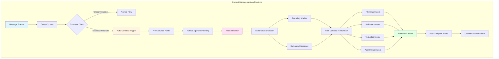
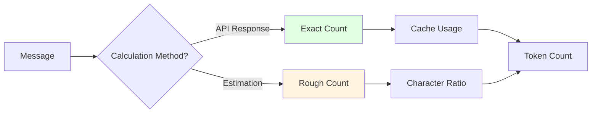
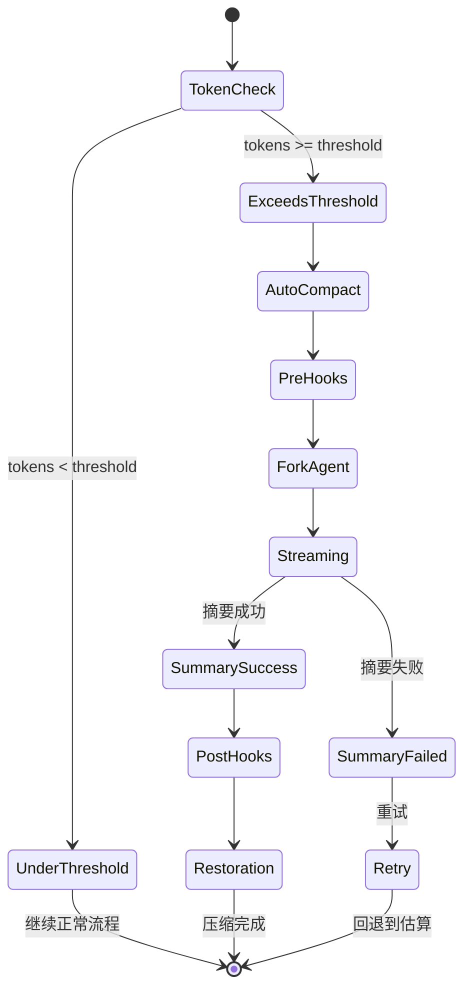

# 第9章 Context Management 上下文管理

## 概述

Claude Code 的上下文管理系统是其核心性能优化机制之一，负责智能管理对话历史、控制 Token 使用、并在接近上下文限制时自动压缩对话。本章将深入分析上下文管理的架构设计、Token 计算策略、压缩算法以及源码实现。

**本章要点：**

- **Token 计算策略**：精确计算与估算的结合
- **上下文压缩算法**：自动压缩与手动压缩
- **压缩触发机制**：基于 Token 阈值的自动触发
- **后压缩恢复**：文件状态、技能、工具的智能恢复
- **Prompt Cache 优化**：缓存共享与复用策略
- **部分压缩**：选择性保留历史消息

## 架构概览

### 整体架构



### 核心组件

1. **Token Counter**: Token 计数器
2. **Compaction Manager**: 压缩管理器
3. **Forked Agent**: 分支代理（用于缓存共享）
4. **Summary Generator**: 摘要生成器
5. **Attachment Builder**: 附件构建器
6. **Hook System**: 钩子系统
7. **State Cache**: 状态缓存

## Token 计算策略

### 计算方法



### 1. 精确计算（API Response）

```typescript
// src/utils/tokens.ts
export function tokenCountFromLastAPIResponse(
  messages: Message[]
): number {
  let totalTokens = 0;
  
  for (const message of messages) {
    if (message.type === 'assistant') {
      // 从 API 响应中提取准确的 token 计数
      const usage = message.usage;
      if (usage) {
        totalTokens += usage.input_tokens || 0;
        totalTokens += usage.cache_read_input_tokens || 0;
        totalTokens += usage.cache_creation_input_tokens || 0;
      }
    }
  }
  
  return totalTokens;
}
```

**特点：**
- ✅ 精确可靠
- ✅ 包含缓存统计
- ❌ 仅在 API 调用后可用
- ❌ 不适用于预计算

### 2. 粗略估算（Rough Estimation）

```typescript
// src/services/tokenEstimation.ts
const BYTES_PER_TOKEN = 4; // 平均每个 token 4 字节

export function roughTokenCountEstimation(text: string): number {
  if (!text) return 0;
  
  // 计算字节数
  const byteLength = Buffer.byteLength(text, 'utf8');
  
  // 粗略估算：字节数 / 4
  return Math.ceil(byteLength / BYTES_PER_TOKEN);
}

export function roughTokenCountEstimationForMessages(
  messages: Message[]
): number {
  let totalTokens = 0;
  
  for (const message of messages) {
    // 估算消息内容的 token 数
    const content = JSON.stringify(message);
    totalTokens += roughTokenCountEstimation(content);
  }
  
  return totalTokens;
}
```

**特点：**
- ✅ 快速计算
- ✅ 适用于预计算
- ⚠️ 精度较低（误差约 ±20%）
- ❌ 不考虑编码特性

### 3. 混合策略

```typescript
// src/utils/tokens.ts
export function tokenCountWithEstimation(
  messages: Message[]
): number {
  // 优先使用精确计数
  const exactCount = tokenCountFromLastAPIResponse(messages);
  if (exactCount > 0) {
    return exactCount;
  }
  
  // 回退到估算
  return roughTokenCountEstimationForMessages(messages);
}
```

**应用场景：**

| 场景 | 使用方法 | 原因 |
|------|---------|------|
| API 调用后 | 精确计数 | 有准确的 usage 数据 |
| 压缩触发检查 | 估算 | 需要快速决策 |
| 预算分配 | 估算 | 提前规划 |
| 成本统计 | 精确计数 | 准确计费 |

### 4. Token 计数 API

```typescript
// src/services/tokenEstimation.ts
export async function countTokensWithAPI(
  content: string
): Promise<number | null> {
  if (!content) {
    return 0;
  }
  
  const message: Anthropic.Beta.Messages.BetaMessageParam = {
    role: 'user',
    content: content,
  };
  
  return countMessagesTokensWithAPI([message], []);
}

export async function countMessagesTokensWithAPI(
  messages: Anthropic.Beta.Messages.BetaMessageParam[],
  tools: Anthropic.Beta.Messages.BetaToolUnion[],
): Promise<number | null> {
  try {
    const model = getMainLoopModel();
    const provider = getAPIProvider();
    
    // 根据不同的提供商选择计数方法
    if (provider === 'bedrock') {
      return await countTokensWithBedrock(messages, tools);
    } else if (provider === 'vertex') {
      return await countTokensWithVertex(messages, tools);
    } else {
      // Anthropic API
      return await countTokensWithAnthropic(messages, tools);
    }
  } catch (error) {
    logError(error);
    return null;
  }
}
```

**注意：**
- Token 计数 API 本身消耗配额
- 适用于需要高精度计数的场景
- 失败时回退到估算方法

## 上下文压缩算法

### 压缩触发机制



### 自动压缩触发

```typescript
// src/utils/context.ts
const AUTO_COMPACT_THRESHOLD = 150_000; // Token 阈值
const AUTO_COMPACT_HEADROOM = 20_000; // 预留空间

export function shouldAutoCompact(
  currentTokens: number,
  estimatedNextTurn: number
): boolean {
  // 当前 token + 下一轮估算 >= 阈值
  return (
    currentTokens + estimatedNextTurn >=
    AUTO_COMPACT_THRESHOLD - AUTO_COMPACT_HEADROOM
  );
}
```

### 完整压缩流程

```typescript
// src/services/compact/compact.ts
export async function compactConversation(
  messages: Message[],
  context: ToolUseContext,
  cacheSafeParams: CacheSafeParams,
  suppressFollowUpQuestions: boolean,
  customInstructions?: string,
  isAutoCompact: boolean = false,
  recompactionInfo?: RecompactionInfo,
): Promise<CompactionResult> {
  try {
    // 1. 检查消息数量
    if (messages.length === 0) {
      throw new Error(ERROR_MESSAGE_NOT_ENOUGH_MESSAGES);
    }
    
    // 2. 计算压缩前的 token 数
    const preCompactTokenCount = tokenCountWithEstimation(messages);
    
    // 3. 执行 pre_compact 钩子
    const hookResult = await executePreCompactHooks(
      {
        trigger: isAutoCompact ? 'auto' : 'manual',
        customInstructions: customInstructions ?? null,
      },
      context.abortController.signal,
    );
    
    // 4. 合并用户指令和钩子指令
    customInstructions = mergeHookInstructions(
      customInstructions,
      hookResult.newCustomInstructions,
    );
    
    // 5. 生成压缩提示词
    const compactPrompt = getCompactPrompt(customInstructions);
    const summaryRequest = createUserMessage({
      content: compactPrompt,
    });
    
    // 6. 调用 AI 生成摘要（使用 forked agent 或 streaming）
    const summaryResponse = await streamCompactSummary({
      messages: messages,
      summaryRequest,
      appState: context.getAppState(),
      context,
      preCompactTokenCount,
      cacheSafeParams,
    });
    
    // 7. 提取摘要文本
    const summary = getAssistantMessageText(summaryResponse);
    if (!summary) {
      throw new Error(
        'Failed to generate conversation summary - response did not contain valid text content'
      );
    }
    
    // 8. 保存当前文件状态
    const preCompactReadFileState = cacheToObject(context.readFileState);
    
    // 9. 清理缓存
    context.readFileState.clear();
    context.loadedNestedMemoryPaths?.clear();
    
    // 10. 生成后压缩附件（并行执行）
    const [
      fileAttachments,
      asyncAgentAttachments,
    ] = await Promise.all([
      createPostCompactFileAttachments(
        preCompactReadFileState,
        context,
        POST_COMPACT_MAX_FILES_TO_RESTORE,
      ),
      createAsyncAgentAttachmentsIfNeeded(context),
    ]);
    
    // 11. 添加其他附件
    const postCompactFileAttachments: AttachmentMessage[] = [
      ...fileAttachments,
      ...asyncAgentAttachments,
    ];
    
    // 添加计划附件
    const planAttachment = createPlanAttachmentIfNeeded(context.agentId);
    if (planAttachment) {
      postCompactFileAttachments.push(planAttachment);
    }
    
    // 添加技能附件
    const skillAttachment = createSkillAttachmentIfNeeded(context.agentId);
    if (skillAttachment) {
      postCompactFileAttachments.push(skillAttachment);
    }
    
    // 重新声明工具和代理
    // ... (工具 delta 附件、代理列表附件、MCP 指令附件)
    
    // 12. 执行 session_start 钩子
    const hookMessages = await processSessionStartHooks('compact', {
      model: context.options.mainLoopModel,
    });
    
    // 13. 创建压缩边界标记
    const boundaryMarker = createCompactBoundaryMessage(
      isAutoCompact ? 'auto' : 'manual',
      preCompactTokenCount ?? 0,
      messages.at(-1)?.uuid,
    );
    
    // 保留已发现的工具
    const preCompactDiscovered = extractDiscoveredToolNames(messages);
    if (preCompactDiscovered.size > 0) {
      boundaryMarker.compactMetadata.preCompactDiscoveredTools = [
        ...preCompactDiscovered,
      ].sort();
    }
    
    // 14. 创建摘要消息
    const transcriptPath = getTranscriptPath();
    const summaryMessages: UserMessage[] = [
      createUserMessage({
        content: getCompactUserSummaryMessage(
          summary,
          suppressFollowUpQuestions,
          transcriptPath,
        ),
        isCompactSummary: true,
        isVisibleInTranscriptOnly: true,
      }),
    ];
    
    // 15. 计算压缩后的 token 数
    const truePostCompactTokenCount = roughTokenCountEstimationForMessages([
      boundaryMarker,
      ...summaryMessages,
      ...postCompactFileAttachments,
      ...hookMessages,
    ]);
    
    // 16. 记录分析事件
    logEvent('tengu_compact', {
      preCompactTokenCount,
      postCompactTokenCount: tokenCountFromLastAPIResponse([summaryResponse]),
      truePostCompactTokenCount,
      isAutoCompact,
      // ... 其他指标
    });
    
    // 17. 重置缓存读取基线
    if (feature('PROMPT_CACHE_BREAK_DETECTION')) {
      notifyCompaction(
        context.options.querySource ?? 'compact',
        context.agentId,
      );
    }
    markPostCompaction();
    
    // 18. 重新附加会话元数据
    reAppendSessionMetadata();
    
    // 19. 写入会话转录片段
    if (feature('KAIROS')) {
      void sessionTranscriptModule?.writeSessionTranscriptSegment(messages);
    }
    
    // 20. 执行 post_compact 钩子
    const postCompactHookResult = await executePostCompactHooks(
      {
        trigger: isAutoCompact ? 'auto' : 'manual',
        compactSummary: summary,
      },
      context.abortController.signal,
    );
    
    return {
      boundaryMarker,
      summaryMessages,
      attachments: postCompactFileAttachments,
      hookResults: hookMessages,
      userDisplayMessage: postCompactHookResult.userDisplayMessage,
      preCompactTokenCount,
      postCompactTokenCount: tokenCountFromLastAPIResponse([summaryResponse]),
      truePostCompactTokenCount,
      compactionUsage: getTokenUsage(summaryResponse),
    };
  } catch (error) {
    // 仅对手动 /compact 显示错误通知
    if (!isAutoCompact) {
      addErrorNotificationIfNeeded(error, context);
    }
    throw error;
  } finally {
    context.setStreamMode?.('requesting');
    context.setResponseLength?.(() => 0);
    context.onCompactProgress?.({ type: 'compact_end' });
    context.setSDKStatus?.(null);
  }
}
```

### Prompt Cache 优化

```typescript
// 使用 forked agent 共享主对话的 prompt cache
const promptCacheSharingEnabled = getFeatureValue_CACHED_MAY_BE_STALE(
  'tengu_compact_cache_prefix',
  true,
);

if (promptCacheSharingEnabled) {
  try {
    // Forked agent 复用主对话的缓存前缀
    // (system prompt, tools, context messages)
    const result = await runForkedAgent({
      promptMessages: [summaryRequest],
      cacheSafeParams,
      canUseTool: createCompactCanUseTool(),
      querySource: 'compact',
      forkLabel: 'compact',
      maxTurns: 1,
      skipCacheWrite: true,
      overrides: { abortController: context.abortController },
    });
    
    const assistantMsg = getLastAssistantMessage(result.messages);
    if (assistantMsg && getAssistantMessageText(assistantMsg)) {
      // 成功：缓存命中，成本低
      logEvent('tengu_compact_cache_sharing_success', {
        preCompactTokenCount,
        outputTokens: result.totalUsage.output_tokens,
        cacheReadInputTokens: result.totalUsage.cache_read_input_tokens,
        cacheCreationInputTokens: result.totalUsage.cache_creation_input_tokens,
        cacheHitRate: result.totalUsage.cache_read_input_tokens > 0
          ? result.totalUsage.cache_read_input_tokens /
            (result.totalUsage.cache_read_input_tokens +
              result.totalUsage.cache_creation_input_tokens +
              result.totalUsage.input_tokens)
          : 0,
      });
      return assistantMsg;
    }
  } catch (error) {
    // 失败：回退到 streaming
    logError(error);
    logEvent('tengu_compact_cache_sharing_fallback', {
      reason: 'error',
      preCompactTokenCount,
    });
  }
}

// 回退：使用常规 streaming
// ... (streaming 逻辑)
```

**缓存共享优势：**
- ✅ 降低 API 成本（cache_read 便宜）
- ✅ 加速压缩响应（复用缓存）
- ✅ 减少 cache_creation（共享前缀）
- ⚠️ 需要 fork 机制支持

## 部分压缩

### 压缩方向

```mermaid
graph LR
    subgraph "Partial Compact Directions"
        A[All Messages] --> B{Direction?}
        
        B -->|from| C[Keep Earlier<br/>Summarize Later]
        B -->|up_to| D[Summarize Earlier<br/>Keep Later]
        
        C --> E[Prompt Cache Preserved]
        D --> F[Prompt Cache Invalidated]
    }
    
    style C fill:#e1ffe1
    style D fill:#fff4e1
    style E fill:#ffe1f5
    style F fill:#ffe1e1
```

### 部分压缩实现

```typescript
// src/services/compact/compact.ts
export async function partialCompactConversation(
  allMessages: Message[],
  pivotIndex: number,
  context: ToolUseContext,
  cacheSafeParams: CacheSafeParams,
  userFeedback?: string,
  direction: PartialCompactDirection = 'from',
): Promise<CompactionResult> {
  try {
    // 1. 根据方向分割消息
    const messagesToSummarize =
      direction === 'up_to'
        ? allMessages.slice(0, pivotIndex)
        : allMessages.slice(pivotIndex);
    
    // 2. 处理要保留的消息
    const messagesToKeep =
      direction === 'up_to'
        ? allMessages
            .slice(pivotIndex)
            .filter(
              m =>
                m.type !== 'progress' &&
                !isCompactBoundaryMessage(m) &&
                !(m.type === 'user' && m.isCompactSummary),
            )
        : allMessages.slice(0, pivotIndex).filter(m => m.type !== 'progress');
    
    // 3. 验证有足够消息可压缩
    if (messagesToSummarize.length === 0) {
      throw new Error(
        direction === 'up_to'
          ? 'Nothing to summarize before the selected message.'
          : 'Nothing to summarize after the selected message.',
      );
    }
    
    // 4. 计算压缩前 token 数
    const preCompactTokenCount = tokenCountWithEstimation(allMessages);
    
    // 5. 执行 pre_compact 钩子
    const hookResult = await executePreCompactHooks(
      {
        trigger: 'manual',
        customInstructions: null,
      },
      context.abortController.signal,
    );
    
    // 6. 合并用户反馈和钩子指令
    let customInstructions: string | undefined;
    if (hookResult.newCustomInstructions && userFeedback) {
      customInstructions = `${hookResult.newCustomInstructions}\n\nUser context: ${userFeedback}`;
    } else if (hookResult.newCustomInstructions) {
      customInstructions = hookResult.newCustomInstructions;
    } else if (userFeedback) {
      customInstructions = `User context: ${userFeedback}`;
    }
    
    // 7. 生成部分压缩提示词
    const compactPrompt = getPartialCompactPrompt(customInstructions, direction);
    const summaryRequest = createUserMessage({
      content: compactPrompt,
    });
    
    // 8. 调用 AI 生成摘要
    // ... (与完整压缩类似)
    
    // 9. 生成后压缩附件（跳过已保留的消息中的内容）
    const [
      fileAttachments,
      asyncAgentAttachments,
    ] = await Promise.all([
      createPostCompactFileAttachments(
        preCompactReadFileState,
        context,
        POST_COMPACT_MAX_FILES_TO_RESTORE,
        messagesToKeep, // 跳过保留消息中的文件
      ),
      createAsyncAgentAttachmentsIfNeeded(context),
    ]);
    
    // 10. 创建边界标记（包含保留段的元数据）
    const boundaryMarker = createCompactBoundaryMessage(
      'manual',
      preCompactTokenCount ?? 0,
      lastPreCompactUuid,
      userFeedback,
      messagesToSummarize.length,
    );
    
    // 11. 添加保留段的 relink 元数据
    const anchorUuid =
      direction === 'up_to'
        ? (summaryMessages.at(-1)?.uuid ?? boundaryMarker.uuid)
        : boundaryMarker.uuid;
    
    return {
      boundaryMarker: annotateBoundaryWithPreservedSegment(
        boundaryMarker,
        anchorUuid,
        messagesToKeep,
      ),
      summaryMessages,
      messagesToKeep, // 部分压缩特有的保留消息
      attachments: postCompactFileAttachments,
      hookResults: hookMessages,
      userDisplayMessage: postCompactHookResult.userDisplayMessage,
      preCompactTokenCount,
      postCompactTokenCount,
      compactionUsage,
    };
  } catch (error) {
    addErrorNotificationIfNeeded(error, context);
    throw error;
  } finally {
    context.setStreamMode?.('requesting');
    context.setResponseLength?.(() => 0);
    context.onCompactProgress?.({ type: 'compact_end' });
    context.setSDKStatus?.(null);
  }
}
```

**使用场景：**
- **from 方向**：保留早期上下文，压缩最近消息（适合长期项目）
- **up_to 方向**：保留最近上下文，压缩早期消息（适合当前任务）

## 后压缩恢复

### 文件状态恢复

```typescript
// src/services/compact/compact.ts
const POST_COMPACT_MAX_FILES_TO_RESTORE = 5;
const POST_COMPACT_TOKEN_BUDGET = 50_000;
const POST_COMPACT_MAX_TOKENS_PER_FILE = 5_000;

export async function createPostCompactFileAttachments(
  readFileState: Record<string, { content: string; timestamp: number }>,
  toolUseContext: ToolUseContext,
  maxFiles: number,
  preservedMessages: Message[] = [],
): Promise<AttachmentMessage[]> {
  // 1. 收集已保留消息中的文件路径（避免重复）
  const preservedReadPaths = collectReadToolFilePaths(preservedMessages);
  
  // 2. 按时间戳排序最近的文件
  const recentFiles = Object.entries(readFileState)
    .map(([filename, state]) => ({ filename, ...state }))
    .filter(
      file =>
        !shouldExcludeFromPostCompactRestore(
          file.filename,
          toolUseContext.agentId,
        ) && !preservedReadPaths.has(expandPath(file.filename)),
    )
    .sort((a, b) => b.timestamp - a.timestamp)
    .slice(0, maxFiles);
  
  // 3. 并行读取文件内容
  const results = await Promise.all(
    recentFiles.map(async file => {
      const attachment = await generateFileAttachment(
        file.filename,
        {
          ...toolUseContext,
          fileReadingLimits: {
            maxTokens: POST_COMPACT_MAX_TOKENS_PER_FILE,
          },
        },
        'tengu_post_compact_file_restore_success',
        'tengu_post_compact_file_restore_error',
        'compact',
      );
      return attachment ? createAttachmentMessage(attachment) : null;
    }),
  );
  
  // 4. 在 token 预算内筛选文件
  let usedTokens = 0;
  return results.filter((result): result is AttachmentMessage => {
    if (result === null) {
      return false;
    }
    const attachmentTokens = roughTokenCountEstimation(jsonStringify(result));
    if (usedTokens + attachmentTokens <= POST_COMPACT_TOKEN_BUDGET) {
      usedTokens += attachmentTokens;
      return true;
    }
    return false;
  });
}
```

**排除规则：**
- 计划文件（plan file）
- CLAUDE.md 文件（所有类型）
- 已在保留消息中的文件

### 技能内容恢复

```typescript
// src/services/compact/compact.ts
const POST_COMPACT_MAX_TOKENS_PER_SKILL = 5_000;
const POST_COMPACT_SKILLS_TOKEN_BUDGET = 25_000;

export function createSkillAttachmentIfNeeded(
  agentId?: string,
): AttachmentMessage | null {
  // 1. 获取已调用的技能
  const invokedSkills = getInvokedSkillsForAgent(agentId);
  
  if (invokedSkills.size === 0) {
    return null;
  }
  
  // 2. 按最近使用时间排序
  let usedTokens = 0;
  const skills = Array.from(invokedSkills.values())
    .sort((a, b) => b.invokedAt - a.invokedAt)
    .map(skill => ({
      name: skill.skillName,
      path: skill.skillPath,
      // 截断到预算限制
      content: truncateToTokens(
        skill.content,
        POST_COMPACT_MAX_TOKENS_PER_SKILL,
      ),
    }))
    .filter(skill => {
      // 3. 在总预算内筛选技能
      const tokens = roughTokenCountEstimation(skill.content);
      if (usedTokens + tokens > POST_COMPACT_SKILLS_TOKEN_BUDGET) {
        return false;
      }
      usedTokens += tokens;
      return true;
    });
  
  if (skills.length === 0) {
    return null;
  }
  
  return createAttachmentMessage({
    type: 'invoked_skills',
    skills,
  });
}

// 技能截断函数
const SKILL_TRUNCATION_MARKER =
  '\n\n[... skill content truncated for compaction; use Read on the skill path if you need the full text]';

function truncateToTokens(content: string, maxTokens: number): string {
  if (roughTokenCountEstimation(content) <= maxTokens) {
    return content;
  }
  const charBudget = maxTokens * 4 - SKILL_TRUNCATION_MARKER.length;
  return content.slice(0, charBudget) + SKILL_TRUNCATION_MARKER;
}
```

### 工具和代理恢复

```typescript
// 工具 delta 附件（仅声明新工具）
for (const att of getDeferredToolsDeltaAttachment(
  context.options.tools,
  context.options.mainLoopModel,
  messagesToKeep ?? [], // 跳过已声明的工具
  { callSite: 'compact_full' },
)) {
  postCompactFileAttachments.push(createAttachmentMessage(att));
}

// 代理列表附件（仅声明新代理）
for (const att of getAgentListingDeltaAttachment(context, [])) {
  postCompactFileAttachments.push(createAttachmentMessage(att));
}

// MCP 指令附件（仅声明新 MCP 工具）
for (const att of getMcpInstructionsDeltaAttachment(
  context.options.mcpClients,
  context.options.tools,
  context.options.mainLoopModel,
  [])) {
  postCompactFileAttachments.push(createAttachmentMessage(att));
}
```

### 异步代理恢复

```typescript
export async function createAsyncAgentAttachmentsIfNeeded(
  context: ToolUseContext,
): Promise<AttachmentMessage[]> {
  const appState = context.getAppState();
  const asyncAgents = Object.values(appState.tasks).filter(
    (task): task is LocalAgentTaskState => task.type === 'local_agent',
  );
  
  return asyncAgents.flatMap(agent => {
    // 跳过已检索的代理和当前代理
    if (
      agent.retrieved ||
      agent.status === 'pending' ||
      agent.agentId === context.agentId
    ) {
      return [];
    }
    
    return [
      createAttachmentMessage({
        type: 'task_status',
        taskId: agent.agentId,
        taskType: 'local_agent',
        description: agent.description,
        status: agent.status,
        deltaSummary:
          agent.status === 'running'
            ? (agent.progress?.summary ?? null)
            : (agent.error ?? null),
        outputFilePath: getTaskOutputPath(agent.agentId),
      }),
    ];
  });
}
```

## 压缩提示词工程

### 完整压缩提示词

```typescript
// src/services/compact/prompt.ts
export function getCompactPrompt(
  customInstructions?: string
): string {
  return `Please summarize the conversation so far. Focus on:
1. Key topics discussed
2. Important decisions made
3. Code changes and their rationale
4. Outstanding questions or tasks
5. Context needed for continuing the conversation

${customInstructions ? `Additional instructions: ${customInstructions}\n` : ''}

Provide a concise summary that would allow someone to understand the conversation without reading the entire transcript.`;
}
```

### 部分压缩提示词

```typescript
export function getPartialCompactPrompt(
  customInstructions?: string,
  direction: PartialCompactDirection = 'from',
): string {
  const directionText =
    direction === 'from'
      ? 'summarize the messages AFTER this point'
      : 'summarize the messages BEFORE this point';
  
  return `Please summarize ${directionText} in the conversation.

Focus on:
1. Key context from this portion
2. Important decisions or changes
3. Relevant code or configurations
4. Any pending tasks or questions

${customInstructions ? `Additional context: ${customInstructions}\n` : ''}

The summary should maintain continuity with the rest of the conversation.`;
}
```

### 用户摘要消息

```typescript
export function getCompactUserSummaryMessage(
  summary: string,
  suppressFollowUpQuestions: boolean,
  transcriptPath?: string
): string {
  let message = `Conversation summary:\n\n${summary}`;
  
  if (!suppressFollowUpQuestions) {
    message += `\n\nWhat would you like to do next?`;
  }
  
  if (transcriptPath) {
    message += `\n\n[Previous conversation context: ${transcriptPath}]`;
  }
  
  return message;
}
```

## 压缩边界标记

### 边界消息结构

```typescript
// src/utils/messages.ts
export function createCompactBoundaryMessage(
  trigger: 'auto' | 'manual',
  preCompactTokenCount: number,
  logicalParentUuid?: string,
  userContext?: string,
  messagesSummarized?: number,
): SystemCompactBoundaryMessage {
  const boundary: SystemCompactBoundaryMessage = {
    type: 'system',
    messageType: 'compact_boundary',
    timestamp: Date.now(),
    uuid: crypto.randomUUID(),
    isMeta: true,
    message: {
      type: 'compact_boundary',
      trigger,
      preCompactTokenCount,
      logicalParentUuid,
    },
    compactMetadata: {
      trigger,
      preCompactTokenCount,
      postCompactTokenCount: 0, // 稍后更新
      timestamp: Date.now(),
      ...(userContext && { userContext }),
      ...(messagesSummarized && { messagesSummarized }),
    },
  };
  
  return boundary;
}
```

### 保留段元数据

```typescript
export function annotateBoundaryWithPreservedSegment(
  boundary: SystemCompactBoundaryMessage,
  anchorUuid: UUID,
  messagesToKeep: readonly Message[] | undefined,
): SystemCompactBoundaryMessage {
  const keep = messagesToKeep ?? [];
  if (keep.length === 0) return boundary;
  
  return {
    ...boundary,
    compactMetadata: {
      ...boundary.compactMetadata,
      preservedSegment: {
        headUuid: keep[0]!.uuid,
        anchorUuid,
        tailUuid: keep.at(-1)!.uuid,
      },
    },
  };
}
```

**元数据用途：**
- **Relink**: 修复消息链（head → anchor → tail）
- **Dedup**: 跳过已保留的内容
- **Navigation**: 快速定位保留段

## 错误处理与重试

### Prompt Too Long 重试

```typescript
const MAX_PTL_RETRIES = 3;
const PTL_RETRY_MARKER = '[earlier conversation truncated for compaction retry]';

export function truncateHeadForPTLRetry(
  messages: Message[],
  ptlResponse: AssistantMessage,
): Message[] | null {
  // 1. 移除之前的重试标记
  const input =
    messages[0]?.type === 'user' &&
    messages[0].isMeta &&
    messages[0].message.content === PTL_RETRY_MARKER
      ? messages.slice(1)
      : messages;
  
  // 2. 按轮次分组
  const groups = groupMessagesByApiRound(input);
  if (groups.length < 2) return null;
  
  // 3. 计算需要删除的组数
  const tokenGap = getPromptTooLongTokenGap(ptlResponse);
  let dropCount: number;
  
  if (tokenGap !== undefined) {
    // 精确计算
    let acc = 0;
    dropCount = 0;
    for (const g of groups) {
      acc += roughTokenCountEstimationForMessages(g);
      dropCount++;
      if (acc >= tokenGap) break;
    }
  } else {
    // 回退：删除 20%
    dropCount = Math.max(1, Math.floor(groups.length * 0.2));
  }
  
  // 4. 至少保留一个组
  dropCount = Math.min(dropCount, groups.length - 1);
  if (dropCount < 1) return null;
  
  // 5. 删除最旧的组
  const sliced = groups.slice(dropCount).flat();
  
  // 6. 添加合成标记
  if (sliced[0]?.type === 'assistant') {
    return [
      createUserMessage({ content: PTL_RETRY_MARKER, isMeta: true }),
      ...sliced,
    ];
  }
  
  return sliced;
}
```

### Streaming 重试

```typescript
const MAX_COMPACT_STREAMING_RETRIES = 2;

// 在 streamCompactSummary 中
const retryEnabled = getFeatureValue_CACHED_MAY_BE_STALE(
  'tengu_compact_streaming_retry',
  false,
);
const maxAttempts = retryEnabled ? MAX_COMPACT_STREAMING_RETRIES : 1;

for (let attempt = 1; attempt <= maxAttempts; attempt++) {
  let hasStartedStreaming = false;
  let response: AssistantMessage | undefined;
  
  // ... streaming 逻辑
  
  if (response) {
    return response;
  }
  
  if (attempt < maxAttempts) {
    logEvent('tengu_compact_streaming_retry', {
      attempt,
      preCompactTokenCount,
      hasStartedStreaming,
    });
    
    // 指数退避
    await sleep(getRetryDelay(attempt), context.abortController.signal, {
      abortError: () => new APIUserAbortError(),
    });
    continue;
  }
  
  // 最终失败
  throw new Error(ERROR_MESSAGE_INCOMPLETE_RESPONSE);
}
```

## 性能优化

### 并行附件生成

```typescript
// 并行生成多个附件（非依赖）
const [
  fileAttachments,
  asyncAgentAttachments,
] = await Promise.all([
  createPostCompactFileAttachments(
    preCompactReadFileState,
    context,
    POST_COMPACT_MAX_FILES_TO_RESTORE,
  ),
  createAsyncAgentAttachmentsIfNeeded(context),
]);
```

### 图片剥离

```typescript
// 压缩前剥离图片（减少 token 消耗）
export function stripImagesFromMessages(messages: Message[]): Message[] {
  return messages.map(message => {
    if (message.type !== 'user') {
      return message;
    }
    
    const content = message.message.content;
    if (!Array.isArray(content)) {
      return message;
    }
    
    let hasMediaBlock = false;
    const newContent = content.flatMap(block => {
      if (block.type === 'image') {
        hasMediaBlock = true;
        return [{ type: 'text' as const, text: '[image]' }];
      }
      if (block.type === 'document') {
        hasMediaBlock = true;
        return [{ type: 'text' as const, text: '[document]' }];
      }
      // 处理 tool_result 中的图片
      if (block.type === 'tool_result' && Array.isArray(block.content)) {
        let toolHasMedia = false;
        const newToolContent = block.content.map(item => {
          if (item.type === 'image') {
            toolHasMedia = true;
            return { type: 'text' as const, text: '[image]' };
          }
          if (item.type === 'document') {
            toolHasMedia = true;
            return { type: 'text' as const, text: '[document]' };
          }
          return item;
        });
        
        if (toolHasMedia) {
          hasMediaBlock = true;
          return [{ ...block, content: newToolContent }];
        }
      }
      return [block];
    });
    
    if (!hasMediaBlock) {
      return message;
    }
    
    return {
      ...message,
      message: {
        ...message.message,
        content: newContent,
      },
    } as typeof message;
  });
}
```

### 缓存清理

```typescript
// 压缩后清理缓存（释放内存）
context.readFileState.clear();
context.loadedNestedMemoryPaths?.clear();
```

## 监控与分析

### 压缩事件记录

```typescript
logEvent('tengu_compact', {
  preCompactTokenCount,
  postCompactTokenCount: compactionCallTotalTokens,
  truePostCompactTokenCount,
  autoCompactThreshold: recompactionInfo?.autoCompactThreshold ?? -1,
  willRetriggerNextTurn:
    recompactionInfo !== undefined &&
    truePostCompactTokenCount >= recompactionInfo.autoCompactThreshold,
  isAutoCompact,
  querySource: querySourceForEvent,
  queryChainId: context.queryTracking?.chainId ?? '',
  queryDepth: context.queryTracking?.depth ?? -1,
  isRecompactionInChain: recompactionInfo?.isRecompactionInChain ?? false,
  turnsSincePreviousCompact: recompactionInfo?.turnsSincePreviousCompact ?? -1,
  previousCompactTurnId: recompactionInfo?.previousCompactTurnId ?? '',
  compactionInputTokens: compactionUsage?.input_tokens,
  compactionOutputTokens: compactionUsage?.output_tokens,
  compactionCacheReadTokens: compactionUsage?.cache_read_input_tokens ?? 0,
  compactionCacheCreationTokens: compactionUsage?.cache_creation_input_tokens ?? 0,
  compactionTotalTokens: compactionUsage
    ? compactionUsage.input_tokens +
      (compactionUsage.cache_creation_input_tokens ?? 0) +
      (compactionUsage.cache_read_input_tokens ?? 0) +
      compactionUsage.output_tokens
    : 0,
  promptCacheSharingEnabled,
  // 上下文分析指标
  ...tokenStatsToStatsigMetrics(analyzeContext(messages)),
});
```

### 上下文分析

```typescript
// src/utils/contextAnalysis.ts
export interface ContextAnalysis {
  totalMessages: number;
  totalTokens: number;
  userMessages: number;
  assistantMessages: number;
  toolUseMessages: number;
  toolResultMessages: number;
  systemMessages: number;
  imageBlocks: number;
  documentBlocks: number;
  textBlocks: number;
  thinkingBlocks: number;
}

export function analyzeContext(messages: Message[]): ContextAnalysis {
  const analysis: ContextAnalysis = {
    totalMessages: messages.length,
    totalTokens: 0,
    userMessages: 0,
    assistantMessages: 0,
    toolUseMessages: 0,
    toolResultMessages: 0,
    systemMessages: 0,
    imageBlocks: 0,
    documentBlocks: 0,
    textBlocks: 0,
    thinkingBlocks: 0,
  };
  
  for (const message of messages) {
    switch (message.type) {
      case 'user':
        analysis.userMessages++;
        break;
      case 'assistant':
        analysis.assistantMessages++;
        break;
      case 'system':
        analysis.systemMessages++;
        break;
    }
    
    // 分析内容块
    if (Array.isArray(message.message.content)) {
      for (const block of message.message.content) {
        switch (block.type) {
          case 'text':
            analysis.textBlocks++;
            break;
          case 'image':
            analysis.imageBlocks++;
            break;
          case 'document':
            analysis.documentBlocks++;
            break;
          case 'thinking':
            analysis.thinkingBlocks++;
            break;
          case 'tool_use':
            analysis.toolUseMessages++;
            break;
          case 'tool_result':
            analysis.toolResultMessages++;
            break;
        }
      }
    }
  }
  
  analysis.totalTokens = roughTokenCountEstimationForMessages(messages);
  
  return analysis;
}
```

## 最佳实践

### 1. 压缩时机

```typescript
// ✅ 好的做法：提前压缩，保留安全边距
const SAFE_HEADROOM = 20_000;

if (currentTokens + estimatedNext >= threshold - SAFE_HEADROOM) {
  await compactConversation(messages, context);
}

// ❌ 不好的做法：等到超过阈值才压缩
if (currentTokens >= threshold) {
  await compactConversation(messages, context); // 可能太晚
}
```

### 2. 附件预算管理

```typescript
// ✅ 好的做法：分级预算
const budgets = {
  files: 50_000,
  skills: 25_000,
  tools: 10_000,
  agents: 5_000,
};

// ❌ 不好的做法：无限恢复
const allFiles = await restoreAllFiles(readFileState); // 可能超预算
```

### 3. 缓存共享优先

```typescript
// ✅ 好的做法：优先尝试缓存共享
if (promptCacheSharingEnabled) {
  try {
    return await runForkedAgent({ ... });
  } catch (error) {
    logError(error);
    // 回退到 streaming
  }
}

// ❌ 不好的做法：直接使用 streaming
return await queryModelWithStreaming({ ... }); // 成本高
```

## 总结

Context Management 是 Claude Code 性能优化的核心，通过以下机制确保高效的对话管理：

1. **智能 Token 计算**：精确计算与估算的结合
2. **自动压缩触发**：基于阈值的自动压缩
3. **高效的压缩算法**：Forked Agent 缓存共享
4. **智能恢复机制**：文件、技能、工具的增量恢复
5. **灵活的部分压缩**：支持选择性保留历史
6. **完善的错误处理**：多层重试机制

**关键设计原则：**

- **性能优先**：缓存共享降低成本
- **用户体验**：自动压缩减少中断
- **增量恢复**：仅恢复必要内容
- **容错设计**：多层重试保证可靠性
- **监控完善**：详细的事件跟踪

Context Management 的实现展示了如何在大型语言模型应用中高效管理上下文，这对于构建高性能的 AI 助手系统具有重要的参考价值。

## 扩展阅读

- **Token 计算策略**：`src/utils/tokens.ts`
- **压缩提示词**：`src/services/compact/prompt.ts`
- **上下文分析**：`src/utils/contextAnalysis.ts`
- **Forked Agent**：`src/utils/forkedAgent.ts`

## 下一章

第 10 章将深入探讨 **MCP Integration（MCP 集成）**，介绍 MCP 协议解析、服务发现和源码分析。
