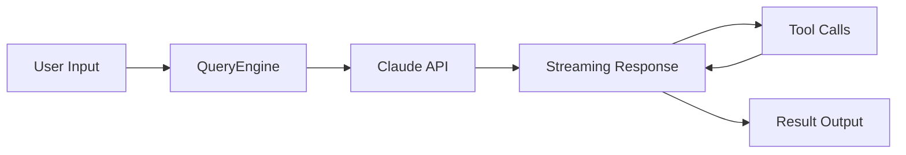
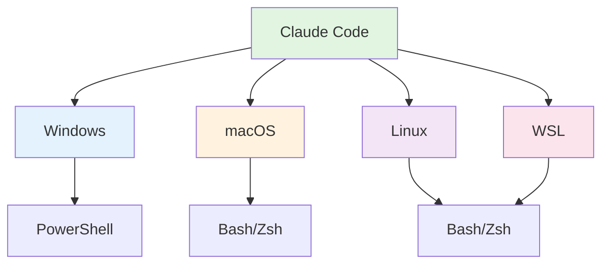
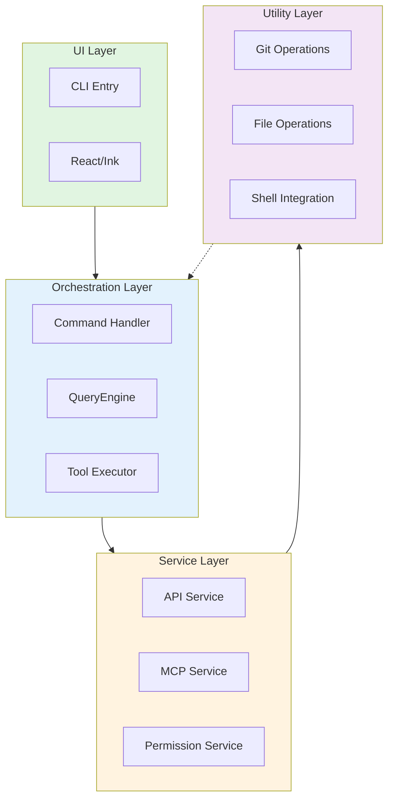
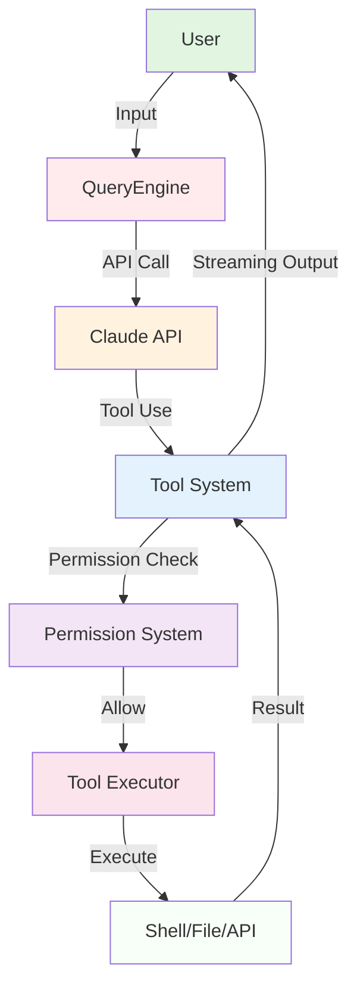

# Chapter 1: Project Overview and Background

> **Chapter Goal**: Understand Claude Code's historical background, design philosophy, and core features. Master what makes it different from other AI programming assistants.

---

## 📚 Learning Objectives

After completing this chapter, you will be able to:

- [ ] Understand Claude Code's historical background and design philosophy
- [ ] Master Claude Code's core features and capabilities
- [ ] Understand the differences between Claude Code and other AI programming assistants
- [ ] Comprehend the overall architecture and technology stack choices

---

## 🔑 Prerequisites

**Essential Knowledge**:
- Basic programming concepts
- Basic understanding of AI assistant tools
- Command-line experience

**Optional Knowledge**:
- TypeScript/JavaScript fundamentals
- React framework familiarity
- Git version control

**Dependencies**: None (First chapter)

---

## 📖 Introduction

In today's era of increasingly popular AI-assisted programming, Claude Code, as an advanced AI programming assistant developed by Anthropic, is transforming the way developers work. This chapter will take you deep into Claude Code's origins, design philosophy, core features, and technical architecture, laying the foundation for subsequent in-depth learning.

---

## 1.1 Project Background

### 1.1.1 Origins

Claude Code was born from a simple vision: **make AI a true partner for developers**, not just a Q&A tool.

**Core Problems Solved**:

1. **Limited Context Understanding**
   - Traditional AI assistants lack deep understanding of codebases
   - Cannot grasp overall project architecture and design intent
   - Struggle to provide contextually relevant suggestions

2. **Insufficient Tool Integration**
   - Cannot directly operate in developer environments
   - Lacks seamless integration with development toolchains
   - Cannot execute actual development tasks

3. **Steep Learning Curve**
   - Difficult for beginners to get started quickly
   - Lacks systematic learning paths
   - Best practices are hard to transfer

### 1.1.2 Development History

**Key Milestones**:

```
2023 - Concept Validation Phase
  ├─ AI programming assistant concept proposed
  └─ Initial prototype development

2024 - Core Feature Development
  ├─ QueryEngine architecture design
  ├─ Tool System implementation
  └─ MCP protocol formulation

2025 - Public Beta Phase
  ├─ Beta version release
  ├─ Community feedback collection
  └─ Feature iteration and optimization

2026 - Official Release and Continuous Evolution
  ├─ v1.0 official release
  ├─ Plugin system launch
  └─ Ecosystem expansion
```

### 1.1.3 Design Philosophy

Claude Code follows these core philosophies:

**KISS Principle (Keep It Simple, Stupid)**
- Clean and intuitive interface
- Clear operational workflows
- Avoid over-engineering

**User First**
- Prioritize developer experience
- Respect user workflows
- Provide valuable assistance

**Extensibility**
- Modular architecture
- Plugin-based extensions
- Community ecosystem

---

## 1.2 Technology Stack Choices

Claude Code's technology stack choices were made carefully, each with specific rationale.

### 1.2.1 Why TypeScript?

**Key Reasons**:

1. **Type Safety**
   ```typescript
   interface Tool<Input, Output> {
     name: string
     execute(input: Input): Promise<Output>
   }
   ```
   - Compile-time type checking
   - Better IDE support
   - Reduced runtime errors

2. **Mature Ecosystem**
   - Rich type definitions
   - Active community support
   - Comprehensive toolchain

3. **Gradual Enhancement**
   - Can use existing JavaScript code
   - Gradually introduce type system
   - Gentle learning curve

### 1.2.2 Why Bun?

**Key Advantages**:

1. **Superior Performance**
   - Faster startup speed
   - Lower memory footprint
   - Native TypeScript support

2. **Unified Toolchain**
   - Package manager, runtime, testing tools all-in-one
   - Simplified development workflow
   - Improved development efficiency

3. **Modern Features**
   - Native ES Module support
   - Built-in WebSocket support
   - Better concurrency handling

### 1.2.3 Why React + Ink?

**Unique Advantages**:

1. **Terminal Rendering Innovation**
   - Ink brings React component model to terminal
   - Declarative UI definition
   - Component-based reusability

2. **Cross-platform UI**
   - One codebase, runs on multiple platforms
   - Native terminal experience
   - Platform difference abstraction

3. **Development Ecosystem**
   - Rich React ecosystem
   - Developer familiarity
   - Continuous maintenance and updates

### 1.2.4 Why Build a Custom Framework?

**Strategic Considerations**:

1. **Deep Customization Needs**
   - Special requirements for terminal UI
   - Deep integration with tool system
   - Performance optimization opportunities

2. **Technical Control**
   - Complete control over core code
   - Rapid response to user needs
   - Avoid third-party limitations

3. **Innovation Possibilities**
   - Explore new interaction patterns
   - Innovative design patterns
   - Lead industry development

---

## 1.3 Core Features

Claude Code possesses the following core features that distinguish it from other AI programming assistants.

### 1.3.1 AI Conversation Capabilities

**Deep Claude API Integration**



**Characteristics**:
- Streaming responses, real-time feedback
- Context memory, coherent conversations
- Multi-turn interactions, iterative optimization

### 1.3.2 Tool System (60+ Tools)

**Tool Categories**:

| Category | Tool Count | Examples |
|----------|-----------|----------|
| File Operations | 8+ | FileReadTool, FileWriteTool, FileEditTool |
| Search Tools | 2+ | GlobTool, GrepTool |
| Shell Tools | 2+ | BashTool, PowerShellTool |
| Web Tools | 2+ | WebSearchTool, WebFetchTool |
| MCP Tools | 4+ | MCPTool, ListMcpResourcesTool |
| Task Management | 5+ | TaskCreateTool, TaskUpdateTool |
| Agent Tools | 1+ | AgentTool |

**Tool Interface**:
```typescript
interface Tool<Input, Output> {
  name: string                    // Tool name
  description: string             // Tool description
  inputSchema: z.ZodType<Input>  // Input validation
  execute: (                      // Execute function
    input: Input,
    context: ToolUseContext
  ) => AsyncGenerator<Result>
}
```

### 1.3.3 Command System (100+ Commands)

**Command Categories**:

- **Core Commands**: help, exit, clear
- **Configuration Management**: config, model, theme
- **Session Management**: session, resume, memory
- **Git Integration**: commit, review, diff, branch
- **Feature Commands**: agents, skills, plugins, mcp
- **Development Commands**: ide, hooks, tasks

**Command Interface**:
```typescript
interface Command {
  name: string
  description: string
  parameters?: z.ZodType
  execute: (params: any) => Promise<void>
}
```

### 1.3.4 Cross-platform Support

**Platform Coverage**:



**Platform Features**:
- Automatic shell detection
- Path handling adaptation
- Terminal feature support

---

## 1.4 Architecture Overview

Claude Code adopts a **layered architecture** and **event-driven** design pattern.

### 1.4.1 Overall Architecture



### 1.4.2 Core Component Relationships



### 1.4.3 Data Flow

**User Input Processing Flow**:

```
User Input (Text/Command)
  ↓
Command Parser
  ↓
Command Dispatcher
  ├─ Slash Command → Command Handler
  └─ Natural Language → Query Engine
      ↓
    Claude API Call
      ↓
    Streaming Response Processing
      ↓
    Tool Use Detection
      ↓
    Permission Check
      ↓
    Tool Execution
      ↓
    Result Return
      ↓
    User Display
```

---

## 1.5 Differences from Other AI Programming Assistants

### Comparison Table

| Feature | Claude Code | GitHub Copilot | Cursor | Codeium |
|---------|-------------|----------------|--------|---------|
| **AI Model** | Claude 3/4 | GPT-4 | GPT-4 | GPT-4 |
| **Integration** | Terminal App | IDE Plugin | IDE App | IDE Plugin |
| **Context Understanding** | Deep codebase understanding | File-level understanding | Project-level understanding | File-level understanding |
| **Tool Calls** | 60+ built-in tools | Limited tools | Limited tools | Limited tools |
| **Command System** | 100+ slash commands | None | None | None |
| **Cross-platform** | Full platform support | Major IDEs | Major IDEs | Major IDEs |
| **Customizability** | Highly customizable | Medium | Low | Low |
| **Open Source** | Open Source | Closed Source | Open Source | Open Source |

### Key Differentiators

**1. Deep Understanding**
- Claude Code: Understands entire codebase architecture and relationships
- Others: Mainly understand current file or code near cursor

**2. Tool Ecosystem**
- Claude Code: 60+ built-in tools, 100+ commands
- Others: Basic code completion and suggestions

**3. Interaction Modes**
- Claude Code: Natural language conversation + command line
- Others: IDE-embedded interaction

**4. Learning Support**
- Claude Code: Tutorial guide, from 0 to 1
- Others: Primarily tools, lack systematic teaching

---

## 1.6 Use Cases

### 1.6.1 Suitable Scenarios

✅ **Highly Recommended**:
- New project development from 0 to 1
- Codebase refactoring and migration
- Systematic learning of Claude Code
- Automated script development
- Code review and refactoring

### 1.6.2 Usage Recommendations

**Best Practices**:

1. **Start with Small Tasks**
   - Use simple tasks to familiarize yourself with tools
   - Gradually increase task complexity
   - Accumulate experience

2. **Fully Utilize Conversation**
   - Provide sufficient context
   - Multi-turn dialogue to optimize results
   - Verify output quality

3. **Leverage Tool System**
   - Use FileEditTool for batch modifications
   - Use GrepTool for quick searches
   - Use GlobTool to find files

4. **Follow Best Practices**
   - Write clear prompts
   - Commit code regularly
   - Maintain good code style

---

## 📊 Chapter Summary

### Key Points

1. **Design Philosophy**: Make AI a true partner for developers
2. **Technology Stack**: Carefully chosen TypeScript + Bun + React/Ink
3. **Core Features**: AI conversation, tool system, command system, cross-platform
4. **Architecture Design**: Layered architecture, modular, event-driven
5. **Unique Value**: Deep understanding, rich tools, systematic teaching

### Learning Check

After completing this chapter, you should be able to:

- [ ] Explain Claude Code's design philosophy and background
- [ ] Describe technology stack choices rationale
- [ ] List core features and capabilities
- [ ] Describe overall architecture and data flow
- [ ] Compare with other AI programming assistants

---

## 🚀 Next Steps

**Next Chapter**: [Chapter 2: Environment Setup and Quick Start](../cn/第2章-环境搭建-CN.md)

**Learning Path**:

```
Chapter 1: Project Overview (This Chapter)
  ↓
Chapter 2: Environment Setup ← Next
  ↓
Chapter 3: Core Concepts
  ↓
Chapter 4: First Application
```

---

## 📚 Further Reading

### Related Chapters
- **Following Chapter**: [Chapter 2: Environment Setup](../cn/第2章-环境搭建-CN.md)
- **Core Chapter**: [Chapter 5: QueryEngine Deep Dive](../cn/第5章-QueryEngine详解-CN.md)
- **Specialized Chapter**: [Chapter 13: Performance Optimization](../cn/第13章-性能优化-CN.md)

### External Resources
- [Claude Code Official Website](https://claude.ai/claude-code)
- [Claude API Documentation](https://docs.anthropic.com)
- [Bun Documentation](https://bun.sh)

---

**Version**: 1.0.0  
**Last Updated**: 2026-04-03  
**Maintainer**: Claude Code Tutorial Team
