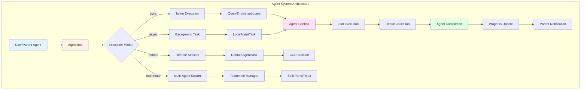
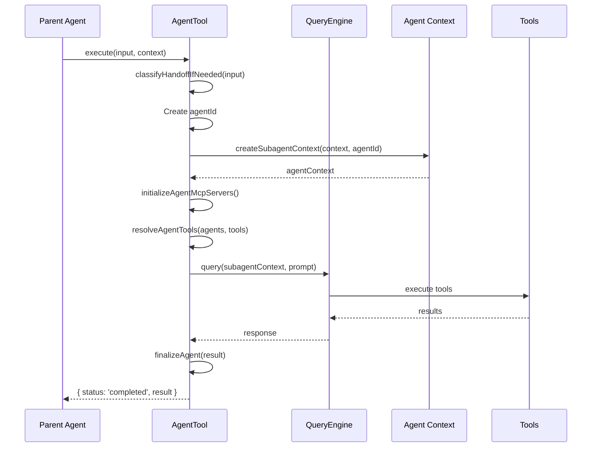
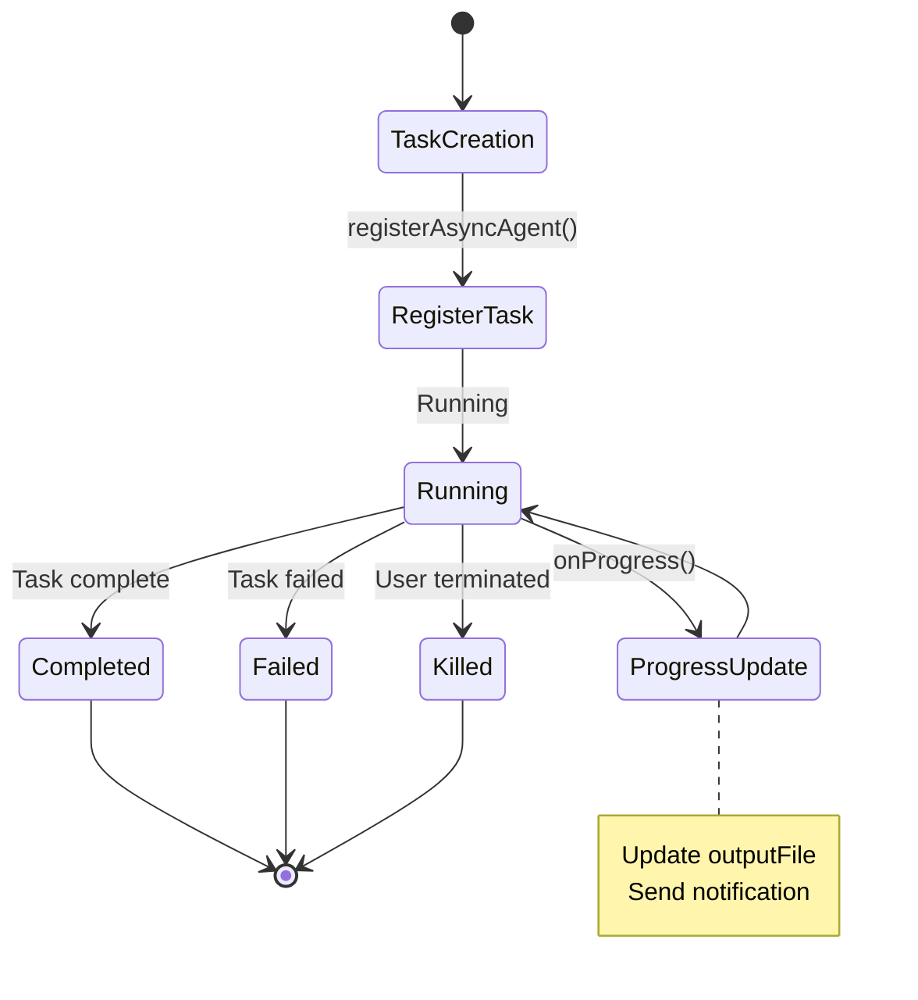
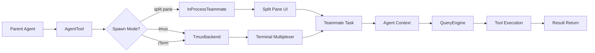
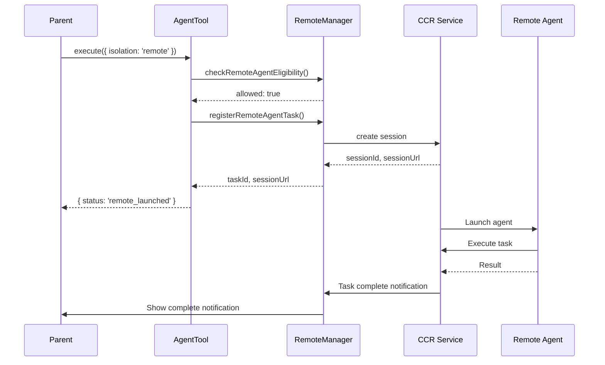

# Chapter 11: Agent System

## Overview

Claude Code's agent system is the core mechanism for implementing complex task automation and parallel processing. Through AgentTool, users can create specialized sub-agents to handle specific tasks, supporting multiple modes including synchronous execution, background running, remote execution, and team collaboration. This chapter will deeply analyze the agent system's architecture design, lifecycle management, strategy pattern application, and source code implementation.

**Key Points:**

- **Agent Architecture**: AgentTool, AgentDefinition, AgentTask
- **Lifecycle Management**: Creation, execution, monitoring, completion
- **Execution Modes**: sync, async, remote, teammate
- **Isolation Mechanisms**: worktree, remote session
- **Progress Tracking**: Real-time progress updates, status notifications
- **Strategy Pattern**: Specialized agents, general-purpose agent, built-in agents

## Architecture Overview

### Overall Architecture



### Core Components

1. **AgentTool**: Tool definition, handles parameter validation and permission checks
2. **AgentDefinition**: Agent definition, contains configuration, tools, system prompt
3. **AgentTask**: Task instance, manages execution state and lifecycle
4. **AgentContext**: Agent context, isolated state and resources
5. **ProgressTracker**: Progress tracker, real-time task status updates

## Agent Tool Implementation

### AgentTool Definition

```typescript
// src/tools/AgentTool/AgentTool.tsx
export const AgentTool = buildTool({
  async prompt({
    agents,
    tools,
    getToolPermissionContext,
  }) {
    return getPrompt({
      agents,
      tools,
      getToolPermissionContext,
    });
  },
  
  inputSchema,
  outputSchema,
  
  async checkPermissions(input, context) {
    // 1. Check if agent is denied
    const denyRule = getDenyRuleForAgent(input.subagent_type);
    if (denyRule) {
      return {
        behavior: 'deny',
        message: denyRule,
      };
    }
    
    // 2. Check remote execution permissions
    if (input.isolation === 'remote') {
      const canRemote = await checkRemoteAgentEligibility(context);
      if (!canRemote.allowed) {
        return {
          behavior: 'deny',
          message: formatPreconditionError(canRemote.reason),
        };
      }
    }
    
    return { behavior: 'allow' };
  },
  
  async execute(input, context) {
    // 1. Classify execution mode
    const classification = classifyHandoffIfNeeded(input, context);
    
    // 2. Execute based on classification
    switch (classification.type) {
      case 'sync':
        return await runSyncAgent(input, context);
      
      case 'async':
        return await runAsyncAgent(input, context);
      
      case 'teammate':
        return await spawnTeammate(input, context);
      
      case 'remote':
        return await launchRemoteAgent(input, context);
      
      case 'fork':
        return await runForkSubagent(input, context);
    }
  },
});
```

### Input Schema

```typescript
/**
 * Agent tool input
 */
interface AgentToolInput {
  // Task description (3-5 words)
  description: string;
  
  // Task prompt
  prompt: string;
  
  // Specialized agent type (optional)
  subagent_type?: string;
  
  // Model override (optional)
  model?: 'sonnet' | 'opus' | 'haiku';
  
  // Background running (optional)
  run_in_background?: boolean;
  
  // Agent name (optional, for SendMessage addressing)
  name?: string;
  
  // Team name (optional)
  team_name?: string;
  
  // Permission mode (optional)
  mode?: PermissionMode;
  
  // Isolation mode (optional)
  isolation?: 'worktree' | 'remote';
  
  // Working directory (optional)
  cwd?: string;
}
```

### Output Schema

```typescript
/**
 * Synchronous execution output
 */
interface SyncOutput {
  status: 'completed';
  prompt: string;  // Original task description
  result: string;  // Execution result
}

/**
 * Background execution output
 */
interface AsyncOutput {
  status: 'async_launched';
  agentId: string;              // Agent ID
  description: string;          // Task description
  prompt: string;               // Task prompt
  outputFile: string;           // Output file path
  canReadOutputFile?: boolean;  // Can read output file
}

/**
 * Teammate agent output
 */
interface TeammateSpawnedOutput {
  status: 'teammate_spawned';
  prompt: string;
  teammate_id: string;          // Teammate ID
  agent_id: string;              // Agent ID
  agent_type?: string;           // Agent type
  model?: string;                // Model used
  name: string;                  // Display name
  color?: string;                // Display color
  tmux_session_name: string;     // Tmux session name
  tmux_window_name: string;      // Tmux window name
  tmux_pane_id: string;          // Tmux pane ID
  team_name?: string;            // Team name
  is_splitpane?: boolean;        // Is split pane
  plan_mode_required?: boolean;  // Requires plan mode
}

/**
 * Remote execution output
 */
interface RemoteLaunchedOutput {
  status: 'remote_launched';
  taskId: string;                // Task ID
  sessionUrl: string;            // Session URL
  description: string;            // Task description
  prompt: string;                // Task prompt
  outputFile: string;             // Output file path
}
```

## Synchronous Agent Execution

### Execution Flow



### Implementation

```typescript
/**
 * Run synchronous agent
 */
async function runSyncAgent(
  input: AgentToolInput,
  parentContext: ToolUseContext
): Promise<SyncOutput> {
  // 1. Create agent ID
  const agentId = createAgentId();
  
  // 2. Create sub-agent context
  const agentContext = await createSubagentContext(
    parentContext,
    agentId,
    {
      description: input.description,
      agentType: input.subagent_type,
      model: input.model,
    }
  );
  
  // 3. Initialize agent-specific MCP servers
  const { tools: mcpTools, cleanup: cleanupMcp } = 
    await initializeAgentMcpServers(
      getAgentDefinition(input.subagent_type),
      parentContext.mcpClients || []
    );
  
  try {
    // 4. Resolve tools
    const agentTools = await resolveAgentTools(
      input.subagent_type,
      parentContext.tools,
      mcpTools
    );
    
    // 5. Build system prompt
    const systemPrompt = await buildAgentSystemPrompt(
      input.subagent_type,
      agentContext
    );
    
    // 6. Execute query
    const response = await query(agentContext, {
      messages: [
        createUserMessage({
          content: input.prompt,
        }),
      ],
      systemPrompt,
      tools: agentTools,
      model: getAgentModel(input.subagent_type, input.model),
    });
    
    // 7. Extract result
    const result = extractTextContent(response);
    
    // 8. Finalize agent
    await finalizeAgent({
      agentId,
      agentType: input.subagent_type,
      status: 'completed',
      result,
    });
    
    return {
      status: 'completed',
      prompt: input.prompt,
      result,
    };
    
  } finally {
    // 9. Cleanup MCP servers
    await cleanupMcp();
  }
}
```

### Context Isolation

```typescript
/**
 * Create sub-agent context
 */
export async function createSubagentContext(
  parentContext: ToolUseContext,
  agentId: AgentId,
  options: {
    description?: string;
    agentType?: string;
    model?: string;
  }
): Promise<ToolUseContext> {
  // 1. Clone file state cache
  const readFileState = cloneFileStateCache(
    parentContext.readFileState
  );
  
  // 2. Create limited cache (size limit)
  const limitedCache = createFileStateCacheWithSizeLimit(
    READ_FILE_STATE_CACHE_SIZE
  );
  
  // 3. Create new context
  const agentContext: ToolUseContext = {
    ...parentContext,
    
    // Agent-specific properties
    agentId,
    agentType: options.agentType,
    parentMessage: parentContext.currentMessage,
    
    // Isolated state
    readFileState: limitedCache,
    loadedNestedMemoryPaths: new Set(),
    
    // Cleared hooks (avoid inheriting parent hooks)
    options: {
      ...parentContext.options,
      hooks: undefined,
    },
  };
  
  // 4. Register agent frontmatter hooks
  const agentDefinition = getAgentDefinition(options.agentType);
  if (agentDefinition) {
    await registerFrontmatterHooks(
      agentDefinition,
      agentContext
    );
  }
  
  return agentContext;
}
```

## Background Agent Execution

### Async Task Management



### Implementation

```typescript
/**
 * Run background agent
 */
async function runAsyncAgent(
  input: AgentToolInput,
  parentContext: ToolUseContext
): Promise<AsyncOutput> {
  // 1. Create agent ID
  const agentId = createAgentId();
  
  // 2. Generate output file path
  const outputFile = getTaskOutputPath(agentId);
  
  // 3. Create progress tracker
  const progressTracker = createProgressTracker(
    agentId,
    input.description
  );
  
  // 4. Register background task
  await registerAsyncAgent({
    agentId,
    agentType: input.subagent_type,
    description: input.description,
    prompt: input.prompt,
    model: input.model,
    outputFile,
    parentContext,
    progressTracker,
  });
  
  // 5. Start async execution
  const executionPromise = runAsyncAgentLifecycle({
    agentId,
    agentType: input.subagent_type,
    prompt: input.prompt,
    model: input.model,
    parentContext,
    progressTracker,
  });
  
  // 6. Don't wait, return immediately
  executionPromise.catch((error) => {
    logEvent('agent_task_failed', {
      agentId,
      agentType: input.subagent_type,
      error: errorMessage(error),
    });
    
    failAsyncAgent(agentId, error);
  });
  
  // 7. Determine if output file is readable
  const canReadOutputFile = await canAgentReadOutput(
    parentContext.tools
  );
  
  return {
    status: 'async_launched',
    agentId,
    description: input.description,
    prompt: input.prompt,
    outputFile,
    canReadOutputFile,
  };
}

/**
 * Async agent lifecycle
 */
async function runAsyncAgentLifecycle(params: {
  agentId: AgentId;
  agentType?: string;
  prompt: string;
  model?: string;
  parentContext: ToolUseContext;
  progressTracker: ProgressTracker;
}): Promise<void> {
  const { agentId, agentType, prompt, model, parentContext, progressTracker } = params;
  
  try {
    // 1. Create agent context
    const agentContext = await createSubagentContext(
      parentContext,
      agentId,
      { agentType, model }
    );
    
    // 2. Initialize MCP servers
    const { tools: mcpTools, cleanup: cleanupMcp } = 
      await initializeAgentMcpServers(
        getAgentDefinition(agentType),
        parentContext.mcpClients || []
      );
    
    try {
      // 3. Resolve tools
      const agentTools = await resolveAgentTools(
        agentType,
        parentContext.tools,
        mcpTools
      );
      
      // 4. Build system prompt
      const systemPrompt = await buildAgentSystemPrompt(
        agentType,
        agentContext
      );
      
      // 5. Execute query (with progress tracking)
      const response = await query(agentContext, {
        messages: [createUserMessage({ content: prompt })],
        systemPrompt,
        tools: agentTools,
        model: getAgentModel(agentType, model),
        onProgress: (progress) => {
          // Update progress
          updateAsyncAgentProgress(agentId, progress);
          
          // Write to output file
          writeAgentProgress(outputFile, progress);
        },
      });
      
      // 6. Extract result
      const result = extractTextContent(response);
      
      // 7. Mark complete
      await completeAsyncAgent(agentId, {
        status: 'completed',
        result,
      });
      
      // 8. Send notification
      await enqueueAgentNotification({
        agentId,
        type: 'completed',
        message: `Task "${params.description}" completed`,
      });
      
    } finally {
      await cleanupMcp();
    }
    
  } catch (error) {
    // Handle error
    await failAsyncAgent(agentId, error);
    throw error;
  }
}
```

### Progress Tracking

```typescript
/**
 * Progress tracker
 */
export function createProgressTracker(
  agentId: AgentId,
  description: string
): ProgressTracker {
  const tracker = {
    agentId,
    description,
    startTime: Date.now(),
    
    steps: [] as ProgressStep[],
    currentStep: 0,
    
    // Add step
    addStep(step: Omit<ProgressStep, 'timestamp'>) {
      const progressStep: ProgressStep = {
        ...step,
        timestamp: Date.now(),
      };
      this.steps.push(progressStep);
      this.currentStep++;
      
      // Write to output file
      this.writeProgress();
    },
    
    // Update current step
    updateStep(update: Partial<ProgressStep>) {
      if (this.steps.length > 0) {
        this.steps[this.steps.length - 1] = {
          ...this.steps[this.steps.length - 1],
          ...update,
        };
        this.writeProgress();
      }
    },
    
    // Write progress file
    writeProgress() {
      const outputPath = getTaskOutputPath(this.agentId);
      const progress = {
        agentId: this.agentId,
        description: this.description,
        startTime: this.startTime,
        currentTime: Date.now(),
        steps: this.steps,
        currentStep: this.currentStep,
      };
      
      writeFile(outputPath, JSON.stringify(progress, null, 2));
    },
  };
  
  return tracker;
}

/**
 * Update async agent progress
 */
export async function updateAsyncAgentProgress(
  agentId: AgentId,
  progress: Message
): Promise<void> {
  // 1. Extract progress info
  const progressUpdate = extractProgressUpdate(progress);
  
  // 2. Update tracker
  const tracker = getProgressTracker(agentId);
  if (tracker && progressUpdate) {
    tracker.updateStep(progressUpdate);
  }
  
  // 3. Send SDK event
  enqueueSdkEvent({
    type: 'agent_progress',
    agentId,
    progress: progressUpdate,
  });
}

/**
 * Extract progress update
 */
function extractProgressUpdate(
  message: Message
): ProgressStep | null {
  if (message.type === 'progress') {
    return {
      type: 'info',
      message: message.message.content,
    };
  }
  
  if (message.type === 'assistant') {
    // Check tool use
    const toolUse = getLastToolUse(message);
    if (toolUse) {
      return {
        type: 'tool_use',
        tool: toolUse.name,
        input: toolUse.input,
      };
    }
  }
  
  return null;
}
```

## Teammate Agents (Multi-Agent System)

### Teammate Spawning



### Implementation

```typescript
/**
 * Spawn teammate agent
 */
async function spawnTeammate(
  input: AgentToolInput,
  parentContext: ToolUseContext
): Promise<TeammateSpawnedOutput> {
  // 1. Check if agent swarms enabled
  if (!isAgentSwarmsEnabled()) {
    throw new Error(
      'Agent swarms are not enabled. Please enable the AGENT_SWARMS feature flag.'
    );
  }
  
  // 2. Create agent IDs
  const teammateId = createAgentId();
  const agentId = createAgentId();
  
  // 3. Determine display properties
  const name = input.name || input.subagent_type || 'teammate';
  const color = setAgentColor(teammateId, getRandomColor());
  
  // 4. Create teammate task
  const task = await createTeammateTask({
    teammateId,
    agentId,
    agentType: input.subagent_type,
    description: input.description,
    prompt: input.prompt,
    model: input.model,
    mode: input.mode,
    parentContext,
  });
  
  // 5. Spawn teammate
  const result = await spawnTeammate(task);
  
  return {
    status: 'teammate_spawned',
    prompt: input.prompt,
    teammate_id: teammateId,
    agent_id: agentId,
    agent_type: input.subagent_type,
    model: input.model,
    name,
    color,
    tmux_session_name: result.sessionName,
    tmux_window_name: result.windowName,
    tmux_pane_id: result.paneId,
    team_name: input.team_name,
    is_splitpane: result.isSplitpane,
    plan_mode_required: result.planModeRequired,
  };
}

/**
 * Create teammate task
 */
async function createTeammateTask(params: {
  teammateId: AgentId;
  agentId: AgentId;
  agentType?: string;
  description: string;
  prompt: string;
  model?: string;
  mode?: PermissionMode;
  parentContext: ToolUseContext;
}): Promise<TeammateTask> {
  const {
    teammateId,
    agentId,
    agentType,
    description,
    prompt,
    model,
    mode,
    parentContext,
  } = params;
  
  // 1. Create agent context
  const agentContext = await createSubagentContext(
    parentContext,
    agentId,
    { agentType, model }
  );
  
  // 2. Initialize MCP servers
  const { tools: mcpTools } = await initializeAgentMcpServers(
    getAgentDefinition(agentType),
    parentContext.mcpClients || []
  );
  
  // 3. Resolve tools
  const agentTools = await resolveAgentTools(
    agentType,
    parentContext.tools,
    mcpTools
  );
  
  // 4. Build system prompt
  const systemPrompt = await buildAgentSystemPrompt(
    agentType,
    agentContext
  );
  
  // 5. Create teammate task
  const task: TeammateTask = {
    type: 'local_agent',
    agentId: teammateId,
    
    // Task properties
    description,
    status: 'running',
    startTime: Date.now(),
    
    // Execution context
    agentContext,
    systemPrompt,
    tools: agentTools,
    model: getAgentModel(agentType, model),
    
    // Message history
    messages: [
      createUserMessage({ content: prompt }),
    ],
    
    // Progress callback
    onProgress: (progress) => {
      updateProgressFromMessage(teammateId, progress);
    },
  };
  
  return task;
}
```

### Tmux Integration

```typescript
/**
 * Tmux backend implementation
 */
export class TmuxBackend {
  /**
   * Create new window in Tmux
   */
  async createWindow(options: {
    sessionName: string;
    windowName: string;
    command: string;
  }): Promise<{
    sessionName: string;
    windowName: string;
    paneId: string;
  }> {
    const { sessionName, windowName, command } = options;
    
    // 1. Create new session (if not exists)
    await this.exec(`tmux new-session -d -s ${sessionName}`);
    
    // 2. Create new window
    await this.exec(`tmux new-window -d -t ${sessionName} -n ${windowName}`);
    
    // 3. Execute command
    const result = await this.exec(
      `tmux send-keys -t ${sessionName}:${windowName} "${command}" C-m`
    );
    
    // 4. Get pane ID
    const paneId = await this.getPaneId(sessionName, windowName);
    
    return { sessionName, windowName, paneId };
  }
  
  /**
   * Create split pane in Tmux
   */
  async createSplitPane(options: {
    sessionName: string;
    windowName: string;
    command: string;
    vertical?: boolean;
  }): Promise<{
    paneId: string;
  }> {
    const { sessionName, windowName, command, vertical = false } = options;
    
    // 1. Create split
    const splitFlag = vertical ? '-h' : '-v';
    await this.exec(
      `tmux split-window ${splitFlag} -t ${sessionName}:${windowName}`
    );
    
    // 2. Execute command in new pane
    await this.exec(
      `tmux send-keys -t ${sessionName}:${windowName} "${command}" C-m`
    );
    
    // 3. Get new pane ID
    const paneId = await this.getPaneId(sessionName, windowName);
    
    return { paneId };
  }
  
  /**
   * Execute Tmux command
   */
  private async exec(command: string): Promise<string> {
    return await execCommand(command, {
      env: {
        ...process.env,
        TMUX: os.homedir() + '/.tmux.conf',
      },
    });
  }
  
  /**
   * Get pane ID
   */
  private async getPaneId(
    sessionName: string,
    windowName: string
  ): Promise<string> {
    const format = '#{pane_id}';
    const result = await this.exec(
      `tmux display -t ${sessionName}:${windowName} -p "${format}"`
    );
    return result.trim();
  }
}
```

## Remote Agent Execution

### Remote Agent Deployment



### Implementation

```typescript
/**
 * Launch remote agent
 */
async function launchRemoteAgent(
  input: AgentToolInput,
  parentContext: ToolUseContext
): Promise<RemoteLaunchedOutput> {
  // 1. Check remote eligibility
  const eligibility = await checkRemoteAgentEligibility(parentContext);
  if (!eligibility.allowed) {
    throw new Error(formatPreconditionError(eligibility.reason));
  }
  
  // 2. Create agent ID
  const agentId = createAgentId();
  
  // 3. Generate output file path
  const outputFile = getTaskOutputPath(agentId);
  
  // 4. Register remote task
  const { taskId, sessionUrl } = await registerRemoteAgentTask({
    agentId,
    agentType: input.subagent_type,
    description: input.description,
    prompt: input.prompt,
    model: input.model,
    outputFile,
    parentContext,
  });
  
  return {
    status: 'remote_launched',
    taskId,
    sessionUrl,
    description: input.description,
    prompt: input.prompt,
    outputFile,
  };
}

/**
 * Check remote agent eligibility
 */
export async function checkRemoteAgentEligibility(
  context: ToolUseContext
): Promise<{
  allowed: boolean;
  reason?: string;
}> {
  // 1. Check feature flag
  const isEnabled = getFeatureValue_CACHED_MAY_BE_STALE(
    'tengu_malort_pedway',
    false
  );
  
  if (!isEnabled) {
    return {
      allowed: false,
      reason: 'Remote agents are not enabled',
    };
  }
  
  // 2. Check environment config
  const ccrConfig = getCcrConfig();
  if (!ccrConfig) {
    return {
      allowed: false,
      reason: 'CCR configuration not found',
    };
  }
  
  // 3. Check authentication status
  const isAuthenticated = await checkCcrAuthentication();
  if (!isAuthenticated) {
    return {
      allowed: false,
      reason: 'Not authenticated with CCR',
    };
  }
  
  return { allowed: true };
}
```

## Worktree Isolation

### Worktree Creation

```typescript
/**
 * Create agent worktree
 */
export async function createAgentWorktree(
  agentId: AgentId,
  parentContext: ToolUseContext
): Promise<{
  worktreePath: string;
  cleanup: () => Promise<void>;
}> {
  // 1. Get current git repository root
  const repoRoot = await getProjectRoot();
  const currentBranch = await getCurrentBranch(repoRoot);
  
  // 2. Generate worktree name
  const worktreeName = `agent-${agentId.slice(0, 8)}`;
  const worktreePath = path.join(repoRoot, '.git', 'worktrees', worktreeName);
  
  // 3. Create worktree
  await execCommand('git', [
    'worktree',
    'add',
    '--detach',
    '--no-checkout',
    '-b',
    worktreeName,
  ], { cwd: repoRoot });
  
  // 4. Create cleanup function
  const cleanup = async () => {
    try {
      // Check for changes
      const hasChanges = await hasWorktreeChanges(worktreePath);
      
      if (!hasChanges) {
        // No changes, delete worktree
        await execCommand('git', [
          'worktree',
          'remove',
          worktreeName,
        ], { cwd: repoRoot });
      } else {
        // Has changes, preserve and notify
        logEvent('agent_worktree_preserved', {
          agentId,
          worktreePath,
        });
      }
    } catch (error) {
      logError(error);
    }
  };
  
  return { worktreePath, cleanup };
}
```

### Worktree Usage

```typescript
/**
 * Run agent in worktree
 */
async function runAgentInWorktree(
  input: AgentToolInput,
  parentContext: ToolUseContext
): Promise<SyncOutput> {
  // 1. Create agent ID
  const agentId = createAgentId();
  
  // 2. Create worktree
  const { worktreePath, cleanup } = await createAgentWorktree(
    agentId,
    parentContext
  );
  
  try {
    // 3. Override working directory
    const agentContext = await runWithCwdOverride(
      parentContext,
      worktreePath,
      async (context) => {
        // 4. Run agent in worktree
        return await runSyncAgent(input, context);
      }
    );
    
    return agentContext;
    
  } finally {
    // 5. Cleanup worktree
    await cleanup();
  }
}
```

## Agent Definition System

### Agent Definition Files

```yaml
---
# .claude/agents/code-reviewer.md
description: Expert code reviewer
agentType: code_reviewer

# Model configuration
model: sonnet

# System prompt
systemPrompt: |
  You are an expert code reviewer. Analyze code for:
  1. Bug risks and edge cases
  2. Performance issues
  3. Security vulnerabilities
  4. Code style and consistency
  5. Test coverage gaps
  
  Provide actionable feedback with specific examples.

# Tool configuration
tools:
  - Read
  - Grep
  - FileSearch

# MCP servers
mcpServers:
  - postgres

# Permission mode
permissionMode: plan

# Other configuration
color: blue
alwaysAllow:
  - Grep(*:*)
  - FileSearch(*:*)
```

### Agent Loading

```typescript
/**
 * Load agent definitions
 */
export async function loadAgentsDir(): Promise<AgentDefinition[]> {
  const agentsDir = getClaudeConfigPath('agents');
  
  // 1. Scan agent files
  const agentFiles = await glob('**/*.md', {
    cwd: agentsDir,
    absolute: false,
  });
  
  // 2. Load each agent definition
  const agents: AgentDefinition[] = [];
  
  for (const file of agentFiles) {
    try {
      const filePath = path.join(agentsDir, file);
      const content = await readFile(filePath, 'utf-8');
      
      // 3. Parse frontmatter
      const { data, content: systemPrompt } = parseFrontmatter(content);
      
      // 4. Create agent definition
      const agent: AgentDefinition = {
        agentType: path.basename(file, '.md'),
        source: 'user',
        description: data.description || '',
        systemPrompt: systemPrompt || data.systemPrompt || '',
        model: data.model,
        tools: data.tools || [],
        mcpServers: data.mcpServers || [],
        permissionMode: data.permissionMode,
        color: data.color,
        alwaysAllow: data.alwaysAllow || [],
        alwaysDeny: data.alwaysDeny || [],
        frontmatterHooks: data.hooks,
      };
      
      agents.push(agent);
    } catch (error) {
      logError(error);
    }
  }
  
  return agents;
}

/**
 * Resolve agent tools
 */
export function resolveAgentTools(
  agentType: string | undefined,
  parentTools: Tools,
  mcpTools: Tools
): Tools {
  // 1. Get agent definition
  const agentDef = getAgentDefinition(agentType);
  
  if (!agentDef) {
    // 2. Default to all tools
    return parentTools;
  }
  
  // 3. Resolve tool list
  const toolNames = agentDef.tools || [];
  const resolvedTools: Tools = [];
  
  for (const toolName of toolNames) {
    // Check parent tools
    const parentTool = parentTools.find(t => t.name === toolName);
    if (parentTool) {
      resolvedTools.push(parentTool);
      continue;
    }
    
    // Check MCP tools
    const mcpTool = mcpTools.find(t => t.name === toolName);
    if (mcpTool) {
      resolvedTools.push(mcpTool);
      continue;
    }
    
    // Check built-in tools
    const builtInTool = getBuiltinTool(toolName);
    if (builtInTool) {
      resolvedTools.push(builtInTool);
    }
  }
  
  return resolvedTools;
}
```

## Built-in Agents

### General Purpose Agent

```typescript
/**
 * General purpose agent
 */
export const GENERAL_PURPOSE_AGENT: AgentDefinition = {
  agentType: 'general',
  source: 'built-in',
  description: 'General purpose agent for any task',
  
  systemPrompt: `You are a helpful AI assistant.`,
  
  tools: [],  // Use all available tools
  
  model: undefined,  // Inherit from parent agent model
};

/**
 * Code reviewer agent
 */
export const CODE_REVIEWER_AGENT: AgentDefinition = {
  agentType: 'code_reviewer',
  source: 'built-in',
  description: 'Expert code reviewer',
  
  systemPrompt: `You are an expert code reviewer. Analyze code for:
1. Bug risks and edge cases
2. Performance issues
3. Security vulnerabilities
4. Code style and consistency
5. Test coverage gaps

Provide actionable feedback with specific examples.`,
  
  tools: ['Read', 'Grep', 'FileSearch'],
  
  permissionMode: 'plan',
};
```

### Specialized Agent Factory

```typescript
/**
 * Create specialized agent
 */
export function createSpecializedAgent(type: string): AgentDefinition {
  switch (type) {
    case 'debugger':
      return {
        agentType: 'debugger',
        source: 'built-in',
        description: 'Debugging specialist',
        systemPrompt: getDebuggerPrompt(),
        tools: ['Read', 'Grep', 'Bash'],
      };
    
    case 'refactor':
      return {
        agentType: 'refactor',
        source: 'built-in',
        description: 'Code refactoring specialist',
        systemPrompt: getRefactorPrompt(),
        tools: ['Read', 'FileEdit', 'FileWrite', 'Bash'],
      };
    
    case 'tester':
      return {
        agentType: 'tester',
        source: 'built-in',
        description: 'Testing specialist',
        systemPrompt: getTesterPrompt(),
        tools: ['Read', 'Bash', 'Grep'],
      };
    
    default:
      throw new Error(`Unknown agent type: ${type}`);
  }
}
```

## Strategy Pattern Application

### Agent Selection Strategy

```typescript
/**
 * Agent selection strategy
 */
export class AgentSelectionStrategy {
  /**
   * Select agent based on task characteristics
   */
  async selectAgent(task: {
    description: string;
    prompt: string;
    context: ToolUseContext;
  }): Promise<string> {
    // 1. Analyze task type
    const taskType = await this.classifyTask(task);
    
    // 2. Select agent based on task type
    switch (taskType) {
      case 'code_review':
        return 'code_reviewer';
      
      case 'debugging':
        return 'debugger';
      
      case 'refactoring':
        return 'refactor';
      
      case 'testing':
        return 'tester';
      
      case 'documentation':
        return 'doc_writer';
      
      default:
        return 'general';
    }
  }
  
  /**
   * Task classification
   */
  private async classifyTask(task: {
    description: string;
    prompt: string;
    context: ToolUseContext;
  }): Promise<string> {
    const { description, prompt } = task;
    const text = `${description} ${prompt}`.toLowerCase();
    
    // Keyword matching
    if (text.includes('review') || text.includes('audit')) {
      return 'code_review';
    }
    
    if (text.includes('debug') || text.includes('fix bug')) {
      return 'debugging';
    }
    
    if (text.includes('refactor') || text.includes('rewrite')) {
      return 'refactoring';
    }
    
    if (text.includes('test') || text.includes('spec')) {
      return 'testing';
    }
    
    if (text.includes('document') || text.includes('readme')) {
      return 'documentation';
    }
    
    return 'general';
  }
}
```

## Best Practices

### 1. Agent Granularity

```typescript
// ✅ Good: Task-focused, specialized agents
const agent = await runAgent({
  description: 'Debug user authentication',
  prompt: 'Investigate why login fails for user@test.com',
  subagent_type: 'debugger',
});

// ❌ Bad: Vague task, generic agent
const agent = await runAgent({
  description: 'Fix some issues',
  prompt: 'Look at the code and fix things',
  // No subagent_type specified
});
```

### 2. Progress Tracking

```typescript
// ✅ Good: Background tasks with progress tracking
const agent = await runAgent({
  description: 'Run full test suite',
  prompt: 'Execute all tests and generate coverage report',
  run_in_background: true,
});

// Monitor progress
const progress = await readAgentProgress(agent.agentId);

// ❌ Bad: Background tasks without progress info
const agent = await runAgent({
  description: 'Run full test suite',
  prompt: 'Execute all tests and generate coverage report',
  run_in_background: true,
});

// Cannot determine task status
```

### 3. Isolation Strategy

```typescript
// ✅ Good: Use worktree isolation for dangerous operations
const agent = await runAgent({
  description: 'Experiment with database schema',
  prompt: 'Try new database schema changes',
  isolation: 'worktree',  // Isolated environment
});

// ❌ Bad: Run dangerous operations directly on main branch
const agent = await runAgent({
  description: 'Experiment with database schema',
  prompt: 'Try new database schema changes',
  // No isolation, may break main branch
});
```

## Summary

Agent System is the core of Claude Code's task automation and parallel processing, providing powerful agent capabilities through the following mechanisms:

1. **Diverse Execution Modes**: sync, async, remote, teammate
2. **Complete Lifecycle Management**: creation, execution, monitoring, completion
3. **Strong Isolation**: context isolation, worktree isolation, remote sessions
4. **Real-time Progress Tracking**: progress updates, status notifications, output files
5. **Flexible Strategy Pattern**: specialized agents, general agents, auto-selection
6. **Multi-Agent Collaboration**: teammate system, team collaboration, task allocation

**Key Design Principles:**

- **Task Focus**: Each agent focuses on specific task types
- **Isolation First**: Agent operations are isolated, not interfering with main flow
- **Progress Visibility**: Background tasks provide real-time progress feedback
- **Security Controlled**: Permission checks, worktree isolation, authentication protection
- **Flexible Composition**: Agents can be nested, parallelized, and collaborated

The Agent System implementation demonstrates how to achieve complex task automation and parallel processing through a multi-agent system, which has important reference value for building powerful AI assistant systems.

## Further Reading

- **Agent Tool**: `src/tools/AgentTool/AgentTool.tsx`
- **Agent Execution**: `src/tools/AgentTool/runAgent.ts`
- **Task Management**: `src/tasks/LocalAgentTask/LocalAgentTask.tsx`
- **Agent Definition**: `src/tools/AgentTool/loadAgentsDir.ts`

## Next Chapter

Chapter 12 will explore **AppState Store (State Management)** in depth, covering state structure, flow diagrams, persistence mechanisms, and event subscriptions.
