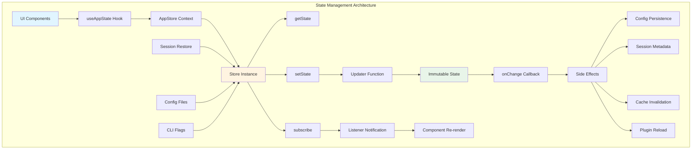
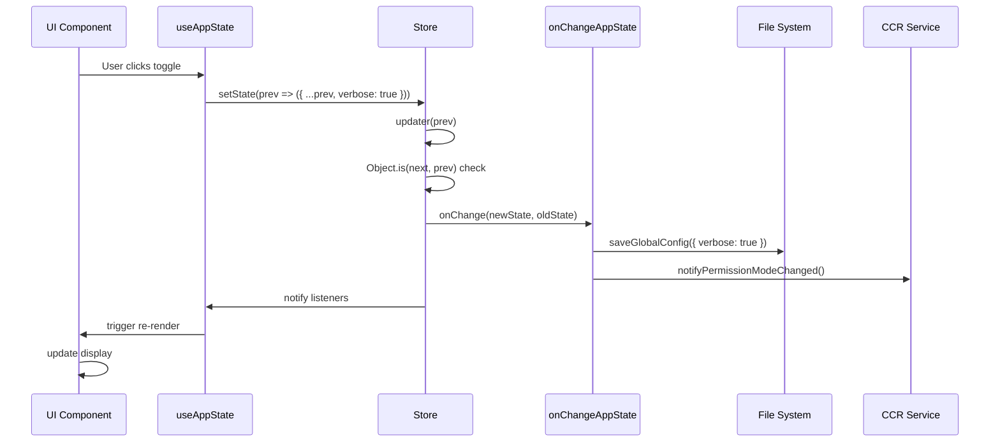

# Chapter 12 AppState Store State Management

## Overview

Claude Code's state management system is the core mechanism for implementing reactive UI and cross-module state synchronization. Through a Store architecture based on immutable data and the observer pattern, the system achieves efficient state updates, subscription notifications, and persistence. This chapter will deeply analyze the design principles, implementation details, and best practices of AppState Store.

**Chapter Highlights:**

- **Store Architecture**: Immutable state, setState updater, subscription mechanism
- **AppState Structure**: Global state tree with 300+ fields
- **State Update Patterns**: Functional updaters, immutable updates
- **Subscription Notifications**: useAppState Hook, event listeners
- **Persistence Mechanisms**: Config persistence, session restore, state snapshots
- **Event-Driven Architecture**: onChangeAppState, side effect handling

## Architecture Overview

### Overall Architecture



### Core Concepts

**1. Single Source of Truth**

```typescript
// src/state/AppStateStore.ts
export type AppState = DeepImmutable<{
  // Global state tree with 300+ fields
  settings: SettingsJson                      // User configuration
  verbose: boolean                            // Verbose output mode
  mainLoopModel: ModelSetting                 // Main loop model
  toolPermissionContext: ToolPermissionContext // Permission context
  mcp: MCPState                               // MCP client state
  plugins: PluginsState                       // Plugin state
  tasks: TaskState[]                          // Background task list
  agent: string | undefined                   // Current agent
  todos: { [agentId: string]: TodoList }
  fileHistory: FileHistoryState               // File history
  attribution: AttributionState               // Attribution info
  notifications: NotificationState            // Notification queue
  speculation: SpeculationState               // Speculative execution state
  replBridgeEnabled: boolean                  // REPL bridge state
  remoteSessionUrl: string | undefined        // Remote session URL
  // ... 300+ more fields
}>
```

**2. Immutable Updates**

```typescript
// Wrong way: direct mutation (forbidden!)
function badUpdate(prev: AppState) {
  prev.verbose = true  // ❌ Violates immutability
  return prev
}

// Correct way: create new object
function goodUpdate(prev: AppState): AppState {
  return {
    ...prev,                    // Copy all fields
    verbose: true,             // Override target field
  }
}

// Nested update
function nestedUpdate(prev: AppState): AppState {
  return {
    ...prev,
    toolPermissionContext: {
      ...prev.toolPermissionContext,
      mode: 'auto',            // Deep update
    },
  }
}
```

## Store Implementation

### createStore Function

`createStore` is the core function of state management, implementing a complete subscription-publish pattern.

```typescript
// src/state/store.ts
type Listener = () => void
type OnChange<T> = (args: { newState: T; oldState: T }) => void

export type Store<T> = {
  getState: () => T
  setState: (updater: (prev: T) => T) => void
  subscribe: (listener: Listener) => () => void
}

export function createStore<T>(
  initialState: T,
  onChange?: OnChange<T>,
): Store<T> {
  let state = initialState
  const listeners = new Set<Listener>()

  return {
    getState: () => state,

    setState: (updater: (prev: T) => T) => {
      const prev = state
      const next = updater(prev)

      // Reference equality check: avoid unnecessary updates
      if (Object.is(next, prev)) return

      state = next

      // Trigger side effects (persistence, notifications, etc.)
      onChange?.({ newState: next, oldState: prev })

      // Notify all subscribers
      for (const listener of listeners) {
        listener()
      }
    },

    subscribe: (listener: Listener) => {
      listeners.add(listener)
      // Return unsubscribe function
      return () => listeners.delete(listener)
    },
  }
}
```

### Key Design Decisions

**1. Reference Equality Optimization**

```typescript
if (Object.is(next, prev)) return
```

Using `Object.is` instead of `===` ensures correct handling of `NaN` and `+0/-0`. If the updater returns the same reference, skip all notifications and side effects.

**2. Functional Updater**

```typescript
setState: (updater: (prev: T) => T) => void
```

Using functions instead of direct values supports updates based on current state, avoiding race conditions:

```typescript
// Wrong way: race condition
const current = store.getState()
store.setState({ ...current, count: current.count + 1 })

// Correct way: functional update
store.setState(prev => ({ ...prev, count: prev.count + 1 }))
```

**3. Subscription Cancellation**

```typescript
subscribe: (listener: Listener) => {
  listeners.add(listener)
  return () => listeners.delete(listener)
}
```

Returns an unsubscribe function, following JavaScript conventions:

```typescript
// Subscribe on component mount
const unsubscribe = store.subscribe(() => {
  console.log('State updated')
})

// Unsubscribe on component unmount
unsubscribe()
```

## React Integration

### AppStateProvider

`AppStateProvider` is the root component of the React application, responsible for creating the Store and injecting it through Context.

```typescript
// src/state/AppState.tsx (simplified)
export function AppStateProvider({ children, initialState, onChangeAppState }) {
  const hasAppStateContext = useContext(HasAppStateContext)

  // Prevent nesting
  if (hasAppStateContext) {
    throw new Error("AppStateProvider can not be nested")
  }

  // Create Store (only initialize once)
  const store = useMemo(
    () => createStore(initialState ?? getDefaultAppState(), onChangeAppState),
    [initialState, onChangeAppState]
  )

  return (
    <AppStoreContext.Provider value={store}>
      <HasAppStateContext.Provider value={true}>
        {children}
      </HasAppStateContext.Provider>
    </AppStoreContext.Provider>
  )
}
```

### useAppState Hook

`useAppState` implements a precise subscription mechanism, triggering re-renders only when the selected value changes.

```typescript
// src/state/AppState.tsx
export function useAppState(selector) {
  const store = useAppStore()

  // Get current selected value
  const get = useMemo(
    () => () => {
      const state = store.getState()
      const selected = selector(state)

      // Defensive check: ensure returning sub-property
      if (state === selected) {
        throw new Error(
          `Your selector returned the original state, ` +
          `which is not allowed. Return a property instead.`
        )
      }
      return selected
    },
    [selector, store]
  )

  // Use React 18's useSyncExternalStore
  return useSyncExternalStore(store.subscribe, get, get)
}
```

### Selector Pattern

**Single Field Selection (Recommended)**

```typescript
// Subscribe to each field independently, track changes precisely
const verbose = useAppState(s => s.verbose)
const model = useAppState(s => s.mainLoopModel)
const tasks = useAppState(s => s.tasks)

// Component re-renders only when verbose changes
function VerboseToggle() {
  const verbose = useAppState(s => s.verbose)
  const setAppState = useSetAppState()

  return (
    <Switch
      checked={verbose}
      onChange={() => setAppState(prev => ({ ...prev, verbose: !prev.verbose }))}
    />
  )
}
```

**Multi-Field Selection (Use with Caution)**

```typescript
// Destructure multiple fields: re-render on any field change
const { text, promptId } = useAppState(s => s.promptSuggestion)

// ❌ Wrong: create new object, changes every time
const { verbose, model } = useAppState(s => ({
  verbose: s.verbose,
  model: s.mainLoopModel,
}))

// ✅ Correct: call useAppState multiple times
const verbose = useAppState(s => s.verbose)
const model = useAppState(s => s.mainLoopModel)
```

### useSetAppState Hook

`useSetAppState` provides a state updater that doesn't trigger re-renders.

```typescript
export function useSetAppState() {
  return useAppStore().setState
}

// Usage: update state in event handlers
function ResetButton() {
  const setAppState = useSetAppState()  // Stable reference, no re-render

  const handleClick = () => {
    setAppState(prev => ({
      ...prev,
      tasks: [],
      todos: {},
    }))
  }

  return <button onClick={handleClick}>Reset</button>
}
```

## State Update Patterns

### Batch Updates

Use functional updaters for atomic batch updates:

```typescript
// ❌ Wrong: multiple setState calls, multiple renders
setAppState(prev => ({ ...prev, verbose: true }))
setAppState(prev => ({ ...prev, expandedView: 'tasks' }))

// ✅ Correct: single batch update
setAppState(prev => ({
  ...prev,
  verbose: true,
  expandedView: 'tasks',
}))
```

### Conditional Updates

Execute conditional logic inside the updater:

```typescript
setAppState(prev => {
  // Only create new object if value actually changes
  if (prev.verbose === newValue) {
    return prev  // Return same reference, skip update
  }

  return {
    ...prev,
    verbose: newValue,
  }
})
```

### Derived State Computation

Avoid storing derived values in AppState, compute in real-time:

```typescript
// ❌ Wrong: store derived state
setAppState(prev => ({
  ...prev,
  displayTasks: prev.tasks.filter(t => !t.completed),
}))

// ✅ Correct: compute derived values in real-time
function ActiveTasks() {
  const tasks = useAppState(s => s.tasks)
  const displayTasks = tasks.filter(t => !t.completed)  // Compute on each render
  return <TaskList tasks={displayTasks} />
}
```

## Side Effect Handling

### onChangeAppState Hook

`onChangeAppState` is the single entry point for state update side effects, handling all persistence, notifications, and cache invalidation.

```typescript
// src/state/onChangeAppState.ts
export function onChangeAppState({
  newState,
  oldState,
}: {
  newState: AppState
  oldState: AppState
}) {
  // 1. Sync permission mode to CCR
  if (newState.toolPermissionContext.mode !== oldState.toolPermissionContext.mode) {
    const newMode = newState.toolPermissionContext.mode
    const prevMode = oldState.toolPermissionContext.mode

    // Convert to external mode
    const newExternal = toExternalPermissionMode(newMode)
    const prevExternal = toExternalPermissionMode(prevMode)

    if (prevExternal !== newExternal) {
      notifySessionMetadataChanged({ permission_mode: newExternal })
    }
    notifyPermissionModeChanged(newMode)
  }

  // 2. Config persistence
  if (newState.expandedView !== oldState.expandedView) {
    const showExpandedTodos = newState.expandedView === 'tasks'
    const showSpinnerTree = newState.expandedView === 'teammates'

    saveGlobalConfig(current => ({
      ...current,
      showExpandedTodos,
      showSpinnerTree,
    }))
  }

  // 3. verbose persistence
  if (newState.verbose !== oldState.verbose) {
    saveGlobalConfig(current => ({
      ...current,
      verbose: newState.verbose,
    }))
  }

  // 4. Clear caches when settings change
  if (newState.settings !== oldState.settings) {
    clearApiKeyHelperCache()
    clearAwsCredentialsCache()
    clearGcpCredentialsCache()

    // Re-apply environment variables
    if (newState.settings.env !== oldState.settings.env) {
      applyConfigEnvironmentVariables()
    }
  }

  // 5. Main loop model override
  if (newState.mainLoopModel !== oldState.mainLoopModel) {
    setMainLoopModelOverride(newState.mainLoopModel)
  }

  // ... more side effect handling
}
```

### Side Effect Design Principles

**1. Single Entry Point**

All side effects are centralized in `onChangeAppState`, avoiding dispersion in components:

```typescript
// ❌ Wrong: side effects scattered in components
function ModeSelector() {
  const mode = useAppState(s => s.toolPermissionContext.mode)

  useEffect(() => {
    saveGlobalConfig(current => ({ ...current, permissionMode: mode }))
  }, [mode])

  return <Select value={mode} />
}

// ✅ Correct: side effects centralized in onChangeAppState
function ModeSelector() {
  const mode = useAppState(s => s.toolPermissionContext.mode)
  const setAppState = useSetAppState()

  const handleChange = (newMode) => {
    setAppState(prev => ({
      ...prev,
      toolPermissionContext: {
        ...prev.toolPermissionContext,
        mode: newMode,
      },
    }))
  }

  return <Select value={mode} onChange={handleChange} />
}

// Side effects handled uniformly in onChangeAppState
if (newState.toolPermissionContext.mode !== oldState.toolPermissionContext.mode) {
  saveGlobalConfig(current => ({ ...current, permissionMode: newState.toolPermissionContext.mode }))
}
```

**2. Idempotency**

Side effects should be idempotent, same input produces same output:

```typescript
// ❌ Non-idempotent: appends every time
if (newState.tasks !== oldState.tasks) {
  logEvent('tasks_changed', { count: newState.tasks.length })
}

// ✅ Idempotent: log only when value changes
if (newState.tasks.length !== oldState.tasks.length) {
  logEvent('tasks_changed', { count: newState.tasks.length })
}
```

**3. Error Isolation**

Side effect failures should not affect state updates:

```typescript
if (newState.settings !== oldState.settings) {
  try {
    clearApiKeyHelperCache()
    clearAwsCredentialsCache()
  } catch (error) {
    logError(error)  // Log error but don't interrupt
  }
}
```

## Persistence Mechanisms

### Config Persistence

User configuration is automatically persisted to `~/.claude/settings.json` via `saveGlobalConfig`.

```typescript
// Config structure (~/.claude/settings.json)
interface SettingsJson {
  verbose?: boolean
  showExpandedTodos?: boolean
  showSpinnerTree?: boolean
  permissionMode?: 'default' | 'auto' | 'bypass'
  env?: Record<string, string>
  // ... more config items
}

// Save config
function saveGlobalConfig(updater: (current: SettingsJson) => SettingsJson): void {
  const configPath = getClaudeConfigHomeDir('settings.json')
  const current = readGlobalConfig()
  const updated = updater(current)

  // Atomic write
  const tmpPath = `${configPath}.tmp`
  writeFileSync(tmpPath, JSON.stringify(updated, null, 2))
  renameSync(tmpPath, configPath)
}

// Auto-save in onChangeAppState
if (newState.verbose !== oldState.verbose) {
  saveGlobalConfig(current => ({
    ...current,
    verbose: newState.verbose,
  }))
}
```

### Session Restore

Session state is restored from transcript files, including file history, task lists, and attribution info.

```typescript
// src/utils/sessionRestore.ts
export function restoreSessionStateFromLog(
  result: ResumeResult,
  setAppState: (f: (prev: AppState) => AppState) => void,
): void {
  // 1. Restore file history
  if (result.fileHistorySnapshots && result.fileHistorySnapshots.length > 0) {
    fileHistoryRestoreStateFromLog(result.fileHistorySnapshots, newState => {
      setAppState(prev => ({ ...prev, fileHistory: newState }))
    })
  }

  // 2. Restore attribution
  if (result.messages && result.messages.length > 0) {
    const attribution = computeAttributionFromMessages(result.messages)
    setAppState(prev => ({ ...prev, attribution }))
  }

  // 3. Restore task list (SDK mode only)
  if (!isTodoV2Enabled() && result.messages && result.messages.length > 0) {
    const todos = extractTodosFromTranscript(result.messages)
    if (todos.length > 0) {
      const agentId = getSessionId()
      setAppState(prev => ({
        ...prev,
        todos: { ...prev.todos, [agentId]: todos },
      }))
    }
  }
}

// Call on startup
async function main() {
  const result = loadTranscript(transcriptPath)
  restoreSessionStateFromLog(result, setAppState)

  // Render UI
  render(<App />)
}
```

### State Snapshots

File history uses snapshot mechanism for incremental storage:

```typescript
// src/utils/fileHistory.ts
export interface FileHistorySnapshot {
  sequence: number
  timestamp: number
  files: Array<{
    path: string
    hash: string
  }>
}

export interface FileHistoryState {
  snapshots: FileHistorySnapshot[]
  trackedFiles: Set<string>
  snapshotSequence: number
}

// Create new snapshot
function createSnapshot(files: Map<string, string>): FileHistorySnapshot {
  return {
    sequence: nextSequence++,
    timestamp: Date.now(),
    files: Array.from(files.entries()).map(([path, hash]) => ({ path, hash })),
  }
}

// Store to AppState
setAppState(prev => ({
  ...prev,
  fileHistory: {
    ...prev.fileHistory,
    snapshots: [...prev.fileHistory.snapshots, snapshot],
    snapshotSequence: prev.fileHistory.snapshotSequence + 1,
  },
}))
```

## Event-Driven Architecture

### Event Flow Diagram



### Notification Sync

State changes are synchronized to CCR (Web UI) via `notifySessionMetadataChanged`.

```typescript
// src/utils/sessionState.ts
export function notifySessionMetadataChanged(
  metadata: Partial<SessionExternalMetadata>
): void {
  // Send to CCR via REPL bridge
  if (replBridgeSessionActive) {
    replBridgeSendEvent({
      type: 'session_metadata_changed',
      metadata,
    })
  }

  // Update external metadata
  externalMetadata = { ...externalMetadata, ...metadata }
}

// Call in onChangeAppState
if (newState.toolPermissionContext.mode !== oldState.toolPermissionContext.mode) {
  notifySessionMetadataChanged({
    permission_mode: toExternalPermissionMode(newState.toolPermissionContext.mode),
  })
}
```

### Plugin Reload

Plugin state changes mark `needsRefresh`, triggering user manual reload or auto reload.

```typescript
// Detect plugin changes in onChangeAppState
if (newState.plugins.needsRefresh && !oldState.plugins.needsRefresh) {
  if (isHeadlessMode()) {
    // Headless mode: auto reload
    refreshActivePlugins()
  } else {
    // Interactive mode: show notification prompting user to reload
    showNotification({
      type: 'info',
      message: 'Plugin state changed. Run /reload-plugins to refresh.',
    })
  }
}

// When user runs /reload-plugins
async function reloadPlugins() {
  await refreshActivePlugins()

  setAppState(prev => ({
    ...prev,
    plugins: {
      ...prev.plugins,
      needsRefresh: false,
    },
  }))
}
```

## Performance Optimization

### Subscription Optimization

**Precise Selectors**

```typescript
// ❌ Subscribe to entire AppState
const state = useAppState(s => s)  // Re-render on any field change

// ✅ Subscribe to specific fields
const verbose = useAppState(s => s.verbose)  // Re-render only on verbose change
const tasks = useAppState(s => s.tasks)      // Re-render only on tasks change
```

**Selector Memoization**

```typescript
// Selector functions should be stable
const selector = useCallback(
  (state: AppState) => state.tasks.filter(t => t.agentId === currentAgent),
  [currentAgent]
)

const tasks = useAppState(selector)
```

### Update Optimization

**Avoid Unnecessary Updates**

```typescript
// ✅ Return same reference to skip update
setAppState(prev => {
  if (prev.verbose === newValue) {
    return prev
  }
  return { ...prev, verbose: newValue }
})
```

**Batch Deep Updates**

Use utility functions to simplify deep updates:

```typescript
// Utility function
function updateToolPermissionContext(
  prev: AppState,
  updates: Partial<ToolPermissionContext>
): AppState {
  return {
    ...prev,
    toolPermissionContext: {
      ...prev.toolPermissionContext,
      ...updates,
    },
  }
}

// Usage
setAppState(prev =>
  updateToolPermissionContext(prev, { mode: 'auto' })
)
```

### Render Optimization

**Component Splitting**

```typescript
// ❌ Single component subscribes to multiple fields
function StatusPanel() {
  const verbose = useAppState(s => s.verbose)
  const model = useAppState(s => s.mainLoopModel)
  const tasks = useAppState(s => s.tasks)

  return (
    <>
      <VerboseDisplay verbose={verbose} />
      <ModelDisplay model={model} />
      <TaskList tasks={tasks} />
    </>
  )
}

// ✅ Split into independent components
function StatusPanel() {
  return (
    <>
      <VerboseDisplay />  {/* Subscribes to verbose internally */}
      <ModelDisplay />    {/* Subscribes to model internally */}
      <TaskList />        {/* Subscribes to tasks internally */}
    </>
  )
}
```

**React.memo**

```typescript
const TaskItem = React.memo(({ task }: { task: Task }) => {
  return <div>{task.summary}</div>
}, (prev, next) => {
  // Custom comparison function
  return prev.task.id === next.task.id && prev.task.status === next.task.status
})
```

## Best Practices

### 1. State Design Principles

**Keep Minimal State**

```typescript
// ❌ Store derived values
interface AppState {
  tasks: Task[]
  completedTasks: Task[]     // Derived value
  pendingTasks: Task[]       // Derived value
  taskCount: number          // Derived value
}

// ✅ Store source data only
interface AppState {
  tasks: Task[]
}

// Derive values in real-time
const completedTasks = tasks.filter(t => t.completed)
const pendingTasks = tasks.filter(t => !t.completed)
const taskCount = tasks.length
```

**Avoid State Redundancy**

```typescript
// ❌ Redundant state
interface AppState {
  tasks: Task[]
  selectedTaskId: string | null
  selectedTask: Task | null  // Redundant! Can be found via selectedTaskId
}

// ✅ Single source of truth
interface AppState {
  tasks: Task[]
  selectedTaskId: string | null
}

// Derive selectedTask
const selectedTask = tasks.find(t => t.id === selectedTaskId)
```

### 2. Update Patterns

**Use Immutable Updates**

```typescript
// ❌ Mutable update
setAppState(prev => {
  prev.tasks.push(newTask)  // Direct mutation
  return prev
})

// ✅ Immutable update
setAppState(prev => ({
  ...prev,
  tasks: [...prev.tasks, newTask],
}))
```

**Deep Update Utilities**

```typescript
// Use immer to simplify deep updates (if integrated in project)
import { produce } from 'immer'

setAppState(prev =>
  produce(prev, draft => {
    draft.mcp.clients[0].tools.push(newTool)
  })
)

// Or use custom utility functions
function updateMCPClients(
  prev: AppState,
  updater: (clients: MCPClient[]) => MCPClient[]
): AppState {
  return {
    ...prev,
    mcp: {
      ...prev.mcp,
      clients: updater(prev.mcp.clients),
    },
  }
}
```

### 3. Side Effect Isolation

**Put Side Effects in onChangeAppState**

```typescript
// ❌ Side effects scattered
function ModelSelector() {
  const model = useAppState(s => s.mainLoopModel)

  useEffect(() => {
    saveGlobalConfig(current => ({ ...current, model }))
    logEvent('model_changed', { model })
    clearModelCache()
  }, [model])

  return <Select value={model} />
}

// ✅ Side effects centralized
function ModelSelector() {
  const model = useAppState(s => s.mainLoopModel)
  const setAppState = useSetAppState()

  return (
    <Select
      value={model}
      onChange={newModel =>
        setAppState(prev => ({ ...prev, mainLoopModel: newModel }))
      }
    />
  )
}

// Handle uniformly in onChangeAppState
if (newState.mainLoopModel !== oldState.mainLoopModel) {
  saveGlobalConfig(current => ({ ...current, model: newState.mainLoopModel }))
  logEvent('model_changed', { model: newState.mainLoopModel })
  clearModelCache()
}
```

### 4. Type Safety

**Use DeepImmutable**

```typescript
// AppState marked as DeepImmutable, TypeScript prevents direct mutation
export type AppState = DeepImmutable<{
  tasks: Task[]
  // ...
}>

// TypeScript compilation error
setAppState(prev => {
  prev.tasks.push(newTask)  // ❌ Type error: Cannot assign to 'tasks' because it is a read-only property
  return prev
})

// Correct way
setAppState(prev => ({
  ...prev,
  tasks: [...prev.tasks, newTask],
}))
```

## Debugging Techniques

### State Change Tracking

Enable state change logging in development environment:

```typescript
// src/state/store.ts (debug version)
export function createStore<T>(initialState: T, onChange?: OnChange<T>): Store<T> {
  let state = initialState
  const listeners = new Set<Listener>()

  return {
    getState: () => state,

    setState: (updater: (prev: T) => T) => {
      const prev = state
      const next = updater(prev)

      if (Object.is(next, prev)) {
        console.log('[Store] Update skipped (same reference)')
        return
      }

      console.log('[Store] State updated:', {
        prev,
        next,
        diff: computeDiff(prev, next),
      })

      state = next
      onChange?.({ newState: next, oldState: prev })
      for (const listener of listeners) listener()
    },

    subscribe: (listener: Listener) => {
      listeners.add(listener)
      return () => listeners.delete(listener)
    },
  }
}
```

### Subscriber Monitoring

Track which components subscribe to which state:

```typescript
// src/state/AppState.tsx (debug version)
export function useAppState<T>(selector: (state: AppState) => T): T {
  const store = useAppStore()

  // Log selector call stack
  const selectorName = getFunctionName(selector)
  const caller = getCallerInfo()

  console.log(`[useAppState] Component ${caller} subscribed to ${selectorName}`)

  const get = () => selector(store.getState())
  return useSyncExternalStore(store.subscribe, get, get)
}
```

### Performance Profiling

Measure state update and render performance:

```typescript
// src/state/store.ts (performance monitor)
export function createStore<T>(initialState: T, onChange?: OnChange<T>): Store<T> {
  let state = initialState
  const listeners = new Set<Listener>()

  return {
    getState: () => state,

    setState: (updater: (prev: T) => T) => {
      const startTime = performance.now()
      const prev = state
      const next = updater(prev)

      if (Object.is(next, prev)) return

      state = next

      // Measure side effect execution time
      const sideEffectStart = performance.now()
      onChange?.({ newState: next, oldState: prev })
      const sideEffectDuration = performance.now() - sideEffectStart

      // Measure notification execution time
      const notifyStart = performance.now()
      for (const listener of listeners) {
        const listenerStart = performance.now()
        listener()
        const listenerDuration = performance.now() - listenerStart
        console.log(`[Store] Listener took ${listenerDuration.toFixed(2)}ms`)
      }
      const notifyDuration = performance.now() - notifyStart

      const totalDuration = performance.now() - startTime
      console.log(`[Store] Total update took ${totalDuration.toFixed(2)}ms ` +
                  `(side effects: ${sideEffectDuration.toFixed(2)}ms, ` +
                  `notifications: ${notifyDuration.toFixed(2)}ms)`)
    },

    subscribe: (listener: Listener) => {
      listeners.add(listener)
      return () => listeners.delete(listener)
    },
  }
}
```

## Summary

Claude Code's state management system is based on immutable data and the observer pattern, achieving efficient and reliable state synchronization. Key points:

1. **Single Source of Truth**: AppState as the global unique state tree
2. **Immutable Updates**: Use functional updaters to ensure state immutability
3. **Subscription Mechanism**: useAppState implements precise subscription and efficient rendering
4. **Side Effect Isolation**: onChangeAppState centrally handles persistence and notifications
5. **Performance Optimization**: Reference equality checks, precise selectors, component splitting

Understanding the design principles and best practices of the state management system is crucial for building responsive, high-performance React applications. By properly designing state structure, following immutable update patterns, and centralizing side effects, you can build maintainable and scalable application architectures.
