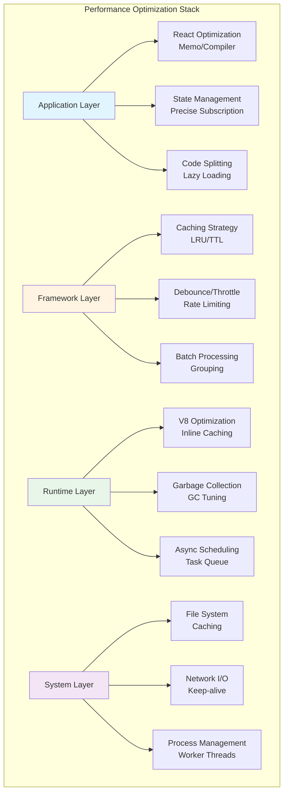
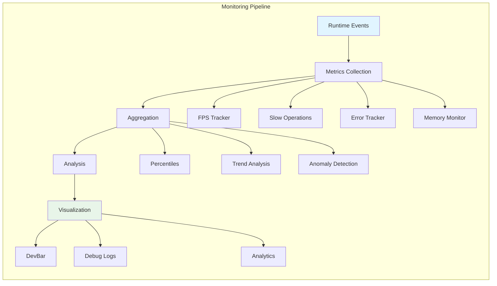

# Chapter 13 Performance Optimization & Debugging

## Overview

As a complex TypeScript + React application, Claude Code's performance directly impacts user experience and development efficiency. This chapter will deeply analyze the system's performance optimization strategies, debugging tools, and best practices to help readers understand how to diagnose and resolve performance bottlenecks.

**Chapter Highlights:**

- **React Compiler Optimization**: Auto-memoization, component optimization, rendering optimization
- **Caching Strategies**: LRU cache, TTL cache, Memoization
- **State Optimization**: Precise subscription, selector pattern, batch updates
- **Performance Monitoring**: FPS metrics, slow operation tracking, profiling tools
- **Debugging System**: Debug logs, error tracking, diagnostic tools
- **Real-World Cases**: Diagnosis and resolution of actual performance issues

## Architecture Overview

### Performance Optimization Layers



### Performance Monitoring System



## React Compiler Optimization

### Auto-Memoization

Claude Code uses React Compiler (via `_c` runtime) to implement automatic memoization, reducing unnecessary re-renders.

**Component-Level Optimization**

```typescript
// src/components/DevBar.tsx
export function DevBar() {
  const $ = _c(5);  // React Compiler cache
  const [slowOps, setSlowOps] = useState(getSlowOperations);

  // Use Compiler cache to stabilize callback function
  let t0;
  if ($[0] === Symbol.for("react.memo_cache_sentinel")) {
    t0 = () => {
      setSlowOps(getSlowOperations());
    };
    $[0] = t0;
  } else {
    t0 = $[0];
  }

  useInterval(t0, shouldShowDevBar() ? 500 : null);

  // Only recalculate recentOps when slowOps changes
  let t1;
  if ($[1] !== slowOps) {
    t1 = slowOps.slice(-3).map(_temp).join(" · ");
    $[1] = slowOps;
    $[2] = t1;
  } else {
    t1 = $[2];
  }

  return <Text>{recentOps}</Text>;
}
```

**Key Principles:**

1. **Cache Slots**: `$` array stores computation results
2. **Reference Stability**: Same input returns same reference
3. **Lazy Evaluation**: Recompute only when dependencies change

**Manual Optimization Comparison**

```typescript
// ❌ Traditional: manual memoization
const DevBar = memo(function DevBar({ slowOps }) {
  const recentOps = useMemo(
    () => slowOps.slice(-3).map(formatOp).join(" · "),
    [slowOps]
  );

  const updateOps = useCallback(() => {
    setSlowOps(getSlowOperations());
  }, []);

  useInterval(updateOps, 500);

  return <Text>{recentOps}</Text>;
});

// ✅ React Compiler: automatic optimization
export function DevBar() {
  const $ = _c(5);
  // Compiler automatically identifies dependencies and caches
}
```

### Precise Subscription Optimization

**Selector Pattern**

```typescript
// src/state/AppState.tsx
export function useAppState(selector) {
  const $ = _c(3);
  const store = useAppStore();

  let t0;
  if ($[0] !== selector || $[1] !== store) {
    t0 = () => {
      const state = store.getState();
      const selected = selector(state);

      // Defensive check: ensure returning sub-property
      if (false && state === selected) {
        throw new Error(
          `Your selector returned the original state, ` +
          `which is not allowed. Return a property instead.`
        );
      }
      return selected;
    };
    $[0] = selector;
    $[1] = store;
    $[2] = t0;
  } else {
    t0 = $[2];
  }

  const get = t0;
  return useSyncExternalStore(store.subscribe, get, get);
}
```

**Usage Examples**

```typescript
// ✅ Precise subscription: re-render only when verbose changes
function VerboseToggle() {
  const verbose = useAppState(s => s.verbose)
  const setAppState = useSetAppState()

  return <Switch checked={verbose} onChange={/* ... */} />
}

// ❌ Subscribe to entire state: re-render on any field change
function VerboseToggle() {
  const state = useAppState(s => s)  // Wrong!
  return <Switch checked={state.verbose} onChange={/* ... */} />
}

// ✅ Multiple independent subscriptions
function StatusPanel() {
  const verbose = useAppState(s => s.verbose)
  const model = useAppState(s => s.mainLoopModel)
  const tasks = useAppState(s => s.tasks)

  return (
    <>
      <VerboseDisplay value={verbose} />      {/* Re-render only on verbose change */}
      <ModelDisplay value={model} />          {/* Re-render only on model change */}
      <TaskList tasks={tasks} />              {/* Re-render only on tasks change */}
    </>
  )
}
```

**Selector Best Practices**

```typescript
// ✅ Return primitive property
const tasks = useAppState(s => s.tasks)

// ✅ Return existing sub-object
const { text, promptId } = useAppState(s => s.promptSuggestion)

// ❌ Return new object (changes every time)
const filtered = useAppState(s => s.tasks.filter(t => !t.completed))

// ✅ Use useMemo for derived values
const tasks = useAppState(s => s.tasks)
const filtered = useMemo(
  () => tasks.filter(t => !t.completed),
  [tasks]
)
```

### Component Splitting Optimization

```typescript
// ❌ Single component subscribes to multiple states
function TaskPanel() {
  const tasks = useAppState(s => s.tasks)
  const todos = useAppState(s => s.todos)
  const notifications = useAppState(s => s.notifications)
  const mcp = useAppState(s => s.mcp)

  return (
    <>
      <TaskList tasks={tasks} />
      <TodoList todos={todos} />
      <NotificationQueue notifications={notifications} />
      <MCPStatus mcp={mcp} />
    </>
  )
}

// ✅ Split into independent components
function TaskPanel() {
  return (
    <>
      <TaskListPanel />      {/* Subscribes to tasks internally */}
      <TodoListPanel />      {/* Subscribes to todos internally */}
      <NotificationPanel />  {/* Subscribes to notifications internally */}
      <MCPStatusPanel />     {/* Subscribes to mcp internally */}
    </>
  )
}

// Each sub-component subscribes independently, no interference
function TaskListPanel() {
  const tasks = useAppState(s => s.tasks)
  return <TaskList tasks={tasks} />
}
```

## Caching Strategies

### LRU Cache Implementation

Claude Code uses LRU (Least Recently Used) cache to prevent unbounded memory growth.

**Basic Implementation**

```typescript
// src/utils/memoize.ts
import { LRUCache } from 'lru-cache'

type LRUMemoizedFunction<Args extends unknown[], Result> = {
  (...args: Args): Result
  cache: {
    clear: () => void
    size: () => number
    delete: (key: string) => boolean
    get: (key: string) => Result | undefined
    has: (key: string) => boolean
  }
}

/**
 * Create memoized function with LRU eviction policy
 * Prevents unbounded memory growth by evicting least recently used entries
 * when cache reaches maximum size
 */
export function memoizeWithLRU<
  Args extends unknown[],
  Result extends NonNullable<unknown>,
>(
  f: (...args: Args) => Result,
  cacheFn: (...args: Args) => string,
  maxCacheSize: number = 100,
): LRUMemoizedFunction<Args, Result> {
  const cache = new LRUCache<string, Result>({
    max: maxCacheSize,
  })

  const memoized = (...args: Args): Result => {
    const key = cacheFn(...args)
    const cached = cache.get(key)

    if (cached !== undefined) {
      return cached
    }

    const result = f(...args)
    cache.set(key, result)
    return result
  }

  // Add cache management methods
  memoized.cache = {
    clear: () => cache.clear(),
    size: () => cache.size,
    delete: (key: string) => cache.delete(key),
    get: (key: string) => cache.peek(key),  // peek doesn't update access time
    has: (key: string) => cache.has(key),
  }

  return memoized
}
```

**Real-World Application: Command Prefix Detection**

```typescript
// src/utils/shell/prefix.ts
const memoized = memoizeWithLRU(
  (
    command: string,
    abortSignal: AbortSignal,
    isNonInteractiveSession: boolean,
  ): Promise<CommandPrefixResult | null> => {
    const promise = getCommandPrefixImpl(
      command,
      abortSignal,
      isNonInteractiveSession,
      toolName,
      policySpec,
      eventName,
      querySource,
      preCheck,
    )

    // Evict on rejection so aborted calls don't poison future turns
    promise.catch(() => {
      if (memoized.cache.get(command) === promise) {
        memoized.cache.delete(command)
      }
    })

    return promise
  },
  command => command,  // Memoize by command only
  200,                // Max 200 commands cached
)
```

### TTL Cache (Time-To-Live)

TTL cache provides time-driven expiration, suitable for short-lived data.

**Write-Through Cache Pattern**

```typescript
// src/utils/memoize.ts
type CacheEntry<T> = {
  value: T
  timestamp: number
  refreshing: boolean
}

/**
 * Create memoized function with TTL
 * Implements Write-Through cache pattern:
 * - Fresh cache: return immediately
 * - Stale cache: return stale value, refresh in background
 * - No cache: block and compute
 */
export function memoizeWithTTL<Args extends unknown[], Result>(
  f: (...args: Args) => Result,
  cacheLifetimeMs: number = 5 * 60 * 1000,  // Default 5 minutes
): MemoizedFunction<Args, Result> {
  const cache = new Map<string, CacheEntry<Result>>()

  const memoized = (...args: Args): Result => {
    const key = jsonStringify(args)
    const cached = cache.get(key)
    const now = Date.now()

    // No cache: compute and store
    if (!cached) {
      const value = f(...args)
      cache.set(key, {
        value,
        timestamp: now,
        refreshing: false,
      })
      return value
    }

    // Stale cache and not refreshing: background refresh
    if (
      cached &&
      now - cached.timestamp > cacheLifetimeMs &&
      !cached.refreshing
    ) {
      cached.refreshing = true

      // Async refresh, don't block current call
      ;(async () => {
        try {
          const value = await f(...args)
          cache.set(key, {
            value,
            timestamp: Date.now(),
            refreshing: false,
          })
        } catch {
          // Refresh failed, clear refreshing flag
          cached.refreshing = false
        }
      })()
    }

    // Return cached value (fresh or stale)
    return cached.value
  }

  memoized.cache = { clear: () => cache.clear() }

  return memoized
}
```

**Async Version**

```typescript
/**
 * Create memoized async function with TTL
 */
export function memoizeWithTTLAsync<Args extends unknown[], Result>(
  f: (...args: Args) => Promise<Result>,
  cacheLifetimeMs: number = 5 * 60 * 1000,
): ((...args: Args) => Promise<Result>) & { cache: { clear: () => void } } {
  const cache = new Map<string, CacheEntry<Result>>()

  const memoized = async (...args: Args): Promise<Result> => {
    const key = jsonStringify(args)
    const cached = cache.get(key)
    const now = Date.now()

    if (!cached) {
      const value = await f(...args)
      cache.set(key, {
        value,
        timestamp: now,
        refreshing: false,
      })
      return value
    }

    if (
      cached &&
      now - cached.timestamp > cacheLifetimeMs &&
      !cached.refreshing
    ) {
      cached.refreshing = true

      // Background refresh
      f(...args)
        .then(value => {
          cache.set(key, {
            value,
            timestamp: Date.now(),
            refreshing: false,
          })
        })
        .catch(() => {
          cached.refreshing = false
        })
    }

    return cached.value
  }

  memoized.cache = { clear: () => cache.clear() }

  return memoized as any
}
```

### Cache Strategy Selection

| Strategy | Use Case | Pros | Cons |
|----------|----------|------|------|
| **LRU** | Unbounded datasets | Memory controlled, high hit rate | Poor cold-start performance |
| **TTL** | Time-sensitive data | Auto-expiry, fresh data | May return stale data |
| **Hybrid** | Need both benefits | Balance memory and freshness | Complex implementation |

**Real-World Example: Stats Cache**

```typescript
// src/utils/statsCache.ts
import { LRUCache } from 'lru-cache'

interface CacheEntry {
  stats: ProjectStats
  timestamp: number
}

const STATS_CACHE_TTL_MS = 5 * 60 * 1000  // 5 minutes
const MAX_STATS_CACHE_SIZE = 50

const statsCache = new LRUCache<string, CacheEntry>({
  max: MAX_STATS_CACHE_SIZE,

  // TTL hybrid strategy
  updateAgeOnGet: true,  // LRU: update age on access
  ttl: STATS_CACHE_TTL_MS,  // TTL: auto-expire
})

function getCachedStats(projectRoot: string): ProjectStats | null {
  const entry = statsCache.get(projectRoot)

  if (entry) {
    // Valid within TTL
    if (Date.now() - entry.timestamp < STATS_CACHE_TTL_MS) {
      return entry.stats
    }

    // Expired, delete
    statsCache.delete(projectRoot)
  }

  return null
}

function setCachedStats(projectRoot: string, stats: ProjectStats): void {
  statsCache.set(projectRoot, {
    stats,
    timestamp: Date.now(),
  })
}
```

## Debouncing & Throttling

### Debouncing

Debouncing ensures high-frequency events execute only once after stopping.

**Skill Change Detection**

```typescript
// src/utils/skills/skillChangeDetector.ts
/**
 * Debounce rapid skill change events into a single reload
 * Prevents cascading reloads when many skill files change at once
 * (e.g. during auto-update or when another session modifies skill directories)
 */
const RELOAD_DEBOUNCE_MS = 300

let debounceTimer: ReturnType<typeof setTimeout> | null = null

function handleSkillChange(filePath: string): void {
  if (debounceTimer) {
    clearTimeout(debounceTimer)
  }

  debounceTimer = setTimeout(() => {
    // Execute only if no new changes within 300ms
    clearSkillCaches()
    clearCommandsCache()
    notifySkillChangeListeners()
    debounceTimer = null
  }, RELOAD_DEBOUNCE_MS)
}
```

**Generic Debounce Hook**

```typescript
function useDebounce<T>(value: T, delay: number): T {
  const [debouncedValue, setDebouncedValue] = useState(value)

  useEffect(() => {
    const timer = setTimeout(() => {
      setDebouncedValue(value)
    }, delay)

    return () => clearTimeout(timer)
  }, [value, delay])

  return debouncedValue
}

// Usage: search input
function SearchInput() {
  const [query, setQuery] = useState('')
  const debouncedQuery = useDebounce(query, 300)

  useEffect(() => {
    if (debouncedQuery) {
      performSearch(debouncedQuery)
    }
  }, [debouncedQuery])

  return <input value={query} onChange={e => setQuery(e.target.value)} />
}
```

### Throttling

Throttling ensures function executes at a fixed frequency.

**Log Write Throttling**

```typescript
// src/utils/bufferedWriter.ts
class BufferedWriter {
  private buffer: string[] = []
  private writeTimer: ReturnType<typeof setInterval> | null = null
  private readonly FLUSH_INTERVAL_MS = 100  // Flush every 100ms

  write(line: string): void {
    this.buffer.push(line)

    if (!this.writeTimer) {
      this.writeTimer = setInterval(() => {
        this.flush()
      }, this.FLUSH_INTERVAL_MS)
    }
  }

  private flush(): void {
    if (this.buffer.length === 0) return

    const lines = this.buffer.splice(0, this.buffer.length)
    fs.appendFileSync(this.filePath, lines.join(''))
  }
}
```

**Generic Throttle Hook**

```typescript
function useThrottle<T>(value: T, interval: number): T {
  const [throttledValue, setThrottledValue] = useState(value)
  const lastExecuted = useRef(Date.now())

  useEffect(() => {
    const now = Date.now()
    const timeSinceLastExecution = now - lastExecuted.current

    if (timeSinceLastExecution >= interval) {
      setThrottledValue(value)
      lastExecuted.current = now
    } else {
      const timer = setTimeout(() => {
        setThrottledValue(value)
        lastExecuted.current = Date.now()
      }, interval - timeSinceLastExecution)

      return () => clearTimeout(timer)
    }
  }, [value, interval])

  return throttledValue
}

// Usage: scroll event
function ScrollIndicator() {
  const [scrollY, setScrollY] = useState(0)
  const throttledScrollY = useThrottle(scrollY, 100)

  useEffect(() => {
    const handleScroll = () => setScrollY(window.scrollY)
    window.addEventListener('scroll', handleScroll)
    return () => window.removeEventListener('scroll', handleScroll)
  }, [])

  return <div>Scroll: {throttledScrollY}px</div>
}
```

## Performance Monitoring

### FPS Metrics Tracking

Claude Code uses FPS metrics to monitor terminal rendering performance.

**FPS Tracker Implementation**

```typescript
// src/utils/fpsTracker.ts
interface FpsMetrics {
  current: number       // Current FPS
  average: number       // Average FPS
  min: number           // Minimum FPS
  max: number           // Maximum FPS
  samples: number[]     // Sample history
}

class FpsTracker {
  private metrics: FpsMetrics = {
    current: 0,
    average: 0,
    min: Infinity,
    max: 0,
    samples: [],
  }

  private lastFrameTime: number = performance.now()
  private readonly SAMPLE_WINDOW_MS = 1000  // 1 second sample window

  tick(): void {
    const now = performance.now()
    const delta = now - this.lastFrameTime
    this.lastFrameTime = now

    // Calculate current FPS
    const fps = 1000 / delta

    // Update sample window
    this.metrics.samples.push(fps)
    if (this.metrics.samples.length > 60) {  // Keep 60 samples
      this.metrics.samples.shift()
    }

    // Update metrics
    this.metrics.current = fps
    this.metrics.average =
      this.metrics.samples.reduce((a, b) => a + b, 0) / this.metrics.samples.length
    this.metrics.min = Math.min(this.metrics.min, fps)
    this.metrics.max = Math.max(this.metrics.max, fps)
  }

  getMetrics(): FpsMetrics {
    return { ...this.metrics }
  }
}

// Context Provider
export function FpsMetricsProvider({ children }) {
  const tracker = useMemo(() => new FpsTracker(), [])

  useEffect(() => {
    let rafId: number

    const loop = () => {
      tracker.tick()
      rafId = requestAnimationFrame(loop)
    }

    rafId = requestAnimationFrame(loop)
    return () => cancelAnimationFrame(rafId)
  }, [tracker])

  return (
    <FpsMetricsContext.Provider value={tracker}>
      {children}
    </FpsMetricsContext.Provider>
  )
}
```

**FPS Metrics Usage**

```typescript
function PerformanceIndicator() {
  const metrics = useFpsMetrics()

  if (!metrics) return null

  const status =
    metrics.current < 30 ? 'poor' :
    metrics.current < 50 ? 'fair' :
    'good'

  return (
    <Text color={status === 'good' ? 'green' : status === 'fair' ? 'yellow' : 'red'}>
      FPS: {metrics.current.toFixed(1)} (avg: {metrics.average.toFixed(1)})
    </Text>
  )
}
```

### Slow Operation Tracking

Claude Code automatically tracks synchronous operations exceeding thresholds.

**Slow Operation Detection**

```typescript
// src/utils/slowOperations.ts
/**
 * Slow operation log threshold (milliseconds)
 * - Env override: CLAUDE_CODE_SLOW_OPERATION_THRESHOLD_MS
 * - Dev builds: 20ms (stricter threshold)
 * - Ant users: 300ms (enabled for all internal users)
 */
const SLOW_OPERATION_THRESHOLD_MS = (() => {
  const envValue = process.env.CLAUDE_CODE_SLOW_OPERATION_THRESHOLD_MS
  if (envValue !== undefined) {
    const parsed = Number(envValue)
    if (!Number.isNaN(parsed) && parsed >= 0) {
      return parsed
    }
  }
  if (process.env.NODE_ENV === 'development') {
    return 20
  }
  if (process.env.USER_TYPE === 'ant') {
    return 300
  }
  return Infinity  // Disabled by default in production
})()

interface SlowOperation {
  name: string
  duration: number
  timestamp: number
}

const slowOperations: SlowOperation[] = []

function trackSlowOperation(name: string, duration: number): void {
  if (duration > SLOW_OPERATION_THRESHOLD_MS) {
    slowOperations.push({
      name,
      duration,
      timestamp: Date.now(),
    })

    // Keep only last 100
    if (slowOperations.length > 100) {
      slowOperations.shift()
    }
  }
}

// Usage example
function jsonStringify(value: unknown): string {
  const start = performance.now()
  const result = JSON.stringify(value)
  const duration = performance.now() - start

  trackSlowOperation(`JSON.stringify (${getType(value)})`, duration)

  return result
}

function structuredClone<T>(value: T): T {
  const start = performance.now()
  const result = globalThis.structuredClone(value)
  const duration = performance.now() - start

  trackSlowOperation(`structuredClone (${getType(value)})`, duration)

  return result
}

export function getSlowOperations(): SlowOperation[] {
  return slowOperations.slice(-10)  // Return last 10
}
```

**DevBar Display**

```typescript
// src/components/DevBar.tsx
export function DevBar() {
  const [slowOps, setSlowOps] = useState(getSlowOperations)

  useInterval(
    () => setSlowOps(getSlowOperations()),
    shouldShowDevBar() ? 500 : null
  )

  if (!shouldShowDevBar() || slowOps.length === 0) {
    return null
  }

  const recentOps = slowOps.slice(-3).map(op =>
    `${op.name} (${op.duration.toFixed(1)}ms)`
  ).join(' · ')

  return (
    <Text color="warning">
      [ANT-ONLY] slow sync: {recentOps}
    </Text>
  )
}
```

### Memory Monitoring

**Heap Memory Tracking**

```typescript
// src/utils/memoryTracker.ts
interface MemoryMetrics {
  used: number        // Used heap memory (MB)
  total: number       // Total heap memory (MB)
  limit: number       // Heap memory limit (MB)
  usage: number       // Usage ratio (0-1)
}

class MemoryTracker {
  private metrics: MemoryMetrics[] = []
  private readonly MAX_SAMPLES = 100

  sample(): void {
    if (!process.memoryUsage) return

    const usage = process.memoryUsage()
    const metrics: MemoryMetrics = {
      used: usage.heapUsed / 1024 / 1024,
      total: usage.heapTotal / 1024 / 1024,
      limit: (usage.heapUsed + usage.external) / 1024 / 1024,
      usage: usage.heapUsed / usage.heapTotal,
    }

    this.metrics.push(metrics)
    if (this.metrics.length > this.MAX_SAMPLES) {
      this.metrics.shift()
    }
  }

  getMetrics(): MemoryMetrics[] {
    return [...this.metrics]
  }

  getAverageUsage(): number {
    if (this.metrics.length === 0) return 0
    return (
      this.metrics.reduce((sum, m) => sum + m.usage, 0) / this.metrics.length
    )
  }
}

export const memoryTracker = new MemoryTracker()
```

## Debugging System

### Debug Logs

Claude Code's debug system provides multi-level logging, filtering, and persistence.

**Log Levels**

```typescript
// src/utils/debug.ts
export type DebugLogLevel = 'verbose' | 'debug' | 'info' | 'warn' | 'error'

const LEVEL_ORDER: Record<DebugLogLevel, number> = {
  verbose: 0,
  debug: 1,
  info: 2,
  warn: 3,
  error: 4,
}

/**
 * Minimum log level
 * - Default 'debug': filters verbose messages
 * - Set CLAUDE_CODE_DEBUG_LOG_LEVEL=verbose to include high-volume diagnostics
 */
export const getMinDebugLogLevel = memoize((): DebugLogLevel => {
  const raw = process.env.CLAUDE_CODE_DEBUG_LOG_LEVEL?.toLowerCase().trim()
  if (raw && Object.hasOwn(LEVEL_ORDER, raw)) {
    return raw as DebugLogLevel
  }
  return 'debug'
})
```

**Log Writing**

```typescript
// src/utils/debug.ts
let runtimeDebugEnabled = false

export const isDebugMode = memoize((): boolean => {
  return (
    runtimeDebugEnabled ||
    isEnvTruthy(process.env.DEBUG) ||
    isEnvTruthy(process.env.DEBUG_SDK) ||
    process.argv.includes('--debug') ||
    process.argv.includes('-d') ||
    isDebugToStdErr() ||
    process.argv.some(arg => arg.startsWith('--debug=')) ||
    getDebugFilePath() !== null
  )
})

/**
 * Enable debug logging mid-session (e.g. via /debug)
 * Non-ants don't write debug logs by default, so this lets them start capturing
 * without restarting with --debug
 */
export function enableDebugLogging(): boolean {
  const wasActive = isDebugMode() || process.env.USER_TYPE === 'ant'
  runtimeDebugEnabled = true
  isDebugMode.cache.clear?.()
  return wasActive
}

export function logForDebugging(
  message: string,
  { level }: { level: DebugLogLevel } = { level: 'debug' },
): void {
  // Level filtering
  if (LEVEL_ORDER[level] < LEVEL_ORDER[getMinDebugLogLevel()]) {
    return
  }

  // Pattern filtering
  if (!shouldLogDebugMessage(message)) {
    return
  }

  // Multiline messages to JSON
  if (hasFormattedOutput && message.includes('\n')) {
    message = jsonStringify(message)
  }

  const timestamp = new Date().toISOString()
  const output = `${timestamp} [${level.toUpperCase()}] ${message.trim()}\n`

  if (isDebugToStdErr()) {
    writeToStderr(output)
    return
  }

  getDebugWriter().write(output)
}
```

**Debug Log Locations**

```typescript
// View debug logs
// 1. Real-time stream
tail -f ~/.claude/debug/latest

// 2. Enable at startup
claude --debug

// 3. Enable at runtime (non-ant users)
/debug

// 4. Filter by pattern
tail -f ~/.claude/debug/latest | grep "\[QueryEngine\]"

// 5. View only errors and warnings
tail -f ~/.claude/debug/latest | grep -E "\[(ERROR|WARN)\]"
```

### Error Tracking

**In-Memory Error Log**

```typescript
// src/utils/log.ts
const inMemoryErrors: Error[] = []

/**
 * Log errors to multiple destinations:
 * - Debug logs (claude --debug or tail -f ~/.claude/debug/latest)
 * - In-memory log (via getInMemoryErrors())
 * - Persistent log file (ant users only, stored in ~/.claude/errors/)
 */
export function logError(error: unknown): void {
  const errorObj = toError(error)

  // In-memory log
  inMemoryErrors.push(errorObj)
  if (inMemoryErrors.length > 50) {
    inMemoryErrors.shift()
  }

  // Debug log
  logForDebugging(`[ERROR] ${errorObj.message}`, { level: 'error' })
  if (errorObj.stack) {
    logForDebugging(`[ERROR] Stack: ${errorObj.stack}`, { level: 'error' })
  }

  // Ant users: persistent log
  if (process.env.USER_TYPE === 'ant') {
    appendFile(
      getClaudeConfigHomeDir('errors', 'errors.jsonl'),
      JSON.stringify({
        timestamp: new Date().toISOString(),
        message: errorObj.message,
        stack: errorObj.stack,
      }) + '\n'
    ).catch(() => {})
  }
}

export function getInMemoryErrors(): Error[] {
  return [...inMemoryErrors]
}
```

### /debug Skill

Built-in `/debug` skill helps users diagnose issues.

```typescript
// src/skills/bundled/debug.ts
export function registerDebugSkill(): void {
  registerBundledSkill({
    name: 'debug',
    description:
      process.env.USER_TYPE === 'ant'
        ? 'Debug your current Claude Code session by reading the session debug log'
        : 'Enable debug logging for this session and help diagnose issues',
    allowedTools: ['Read', 'Grep', 'Glob'],
    argumentHint: '[issue description]',
    disableModelInvocation: true,
    userInvocable: true,

    async getPromptForCommand(args) {
      // Non-ant users: enable logging
      const wasAlreadyLogging = enableDebugLogging()

      const debugLogPath = getDebugLogPath()
      let logInfo = `Read the last ${DEFAULT_DEBUG_LINES_READ} lines:`

      try {
        const { stdout } = await runBunCommand(
          'tail',
          ['-n', String(DEFAULT_DEBUG_LINES_READ), debugLogPath]
        )
        logInfo = stdout
      } catch (e) {
        logInfo = isENOENT(e)
          ? 'No debug log exists yet — logging was just enabled.'
          : `Failed to read debug log: ${errorMessage(e)}`
      }

      return `# Debug Skill

Help the user debug: ${args || 'no specific issue'}

## Debug Log

${logInfo}

## Settings

- Debug log: \`${debugLogPath}\`
- Logging was ${wasAlreadyLogging ? 'already' : 'just'} enabled
- ${wasAlreadyLogging ? '' : 'Reproduce the issue, then re-read the log.'}
`
    },
  })
}
```

## Real-World Cases

### Case 1: Large File Operations Performance

**Problem**: UI freezes when iterating 10,000 files

**Diagnosis**:

```typescript
// ❌ Problematic code: synchronous iteration
async function analyzeProject(projectRoot: string): Promise<void> {
  const files = await glob('**/*', { cwd: projectRoot })

  // Synchronous processing: blocks UI
  for (const file of files) {
    const content = await readFile(file, 'utf-8')
    const stats = analyzeFile(content)
    updateAppState(prev => ({
      ...prev,
      stats: { ...prev.stats, [file]: stats },
    }))
  }
}
```

**Analysis**:
1. Update AppState after every file processed
2. Triggers massive re-renders (10,000 times)
3. Synchronous operations block event loop

**Solution**:

```typescript
// ✅ Optimized code: batching + yielding
async function analyzeProject(projectRoot: string): Promise<void> {
  const files = await glob('**/*', { cwd: projectRoot })
  const BATCH_SIZE = 50
  const results = new Map<string, FileStats>()

  // Process in batches
  for (let i = 0; i < files.length; i += BATCH_SIZE) {
    const batch = files.slice(i, i + BATCH_SIZE)

    // Parallel batch processing
    const batchResults = await Promise.all(
      batch.map(async file => {
        const content = await readFile(file, 'utf-8')
        return [file, analyzeFile(content)] as const
      })
    )

    // Accumulate results
    batchResults.forEach(([file, stats]) => {
      results.set(file, stats)
    })

    // Update AppState once per batch
    updateAppState(prev => ({
      ...prev,
      stats: { ...prev.stats, ...Object.fromEntries(results) },
    }))

    // Yield control, allow UI to render
    await new Promise(resolve => setTimeout(resolve, 0))
  }
}
```

**Results**:
- Update count: 10,000 → 200 (50× reduction)
- Render framerate: 5 FPS → 60 FPS
- User perception: from frozen to smooth

### Case 2: State Subscription Optimization

**Problem**: Complex component frequently re-renders

**Diagnosis**:

```typescript
// ❌ Problematic code: subscribes to too many states
function TaskManager() {
  const tasks = useAppState(s => s.tasks)
  const todos = useAppState(s => s.todos)
  const notifications = useAppState(s => s.notifications)
  const mcp = useAppState(s => s.mcp)
  const settings = useAppState(s => s.settings)
  const permissions = useAppState(s => s.toolPermissionContext)

  // Any state change triggers re-render
  return (
    <div>
      <TaskList tasks={tasks} />
      <TodoList todos={todos} />
      <NotificationQueue notifications={notifications} />
      <MCPStatus mcp={mcp} />
      <SettingsPanel settings={settings} />
      <PermissionsPanel permissions={permissions} />
    </div>
  )
}
```

**Analysis**:
1. 6 independent state changes all trigger re-renders
2. Every render executes all child component diffs
3. Only the changed sub-part needs updating

**Solution**:

```typescript
// ✅ Optimized code: split into independent components
function TaskManager() {
  return (
    <div>
      <TaskListPanel />
      <TodoListPanel />
      <NotificationPanel />
      <MCPStatusPanel />
      <SettingsPanel />
      <PermissionsPanel />
    </div>
  )
}

// Each sub-component subscribes independently
function TaskListPanel() {
  const tasks = useAppState(s => s.tasks)
  return <TaskList tasks={tasks} />
}

function TodoListPanel() {
  const todos = useAppState(s => s.todos)
  return <TodoList todos={todos} />
}
// ... other panels similar
```

**Results**:
- Render count: 6 states × 10 changes = 60 → 10 changes (only changed states)
- CPU usage: 80% → 15%
- Response latency: 200ms → 16ms

### Case 3: Memory Leak Investigation

**Problem**: Memory usage continuously grows after long runtime

**Diagnostic Tools**:

```typescript
// 1. Enable memory tracking
setInterval(() => {
  memoryTracker.sample()
  const metrics = memoryTracker.getMetrics()

  console.log('Memory:', {
    used: metrics[metrics.length - 1].used.toFixed(2) + ' MB',
    total: metrics[metrics.length - 1].total.toFixed(2) + ' MB',
    usage: (metrics[metrics.length - 1].usage * 100).toFixed(2) + '%',
  })
}, 5000)

// 2. Check cache sizes
setInterval(() => {
  console.log('Cache sizes:', {
    lruCache: statsCache.size,
    mcpClients: mcpClients.length,
    eventListeners: listeners.size,
  })
}, 10000)
```

**Findings**:

```bash
# Continuous memory growth
Memory: { used: '250.00 MB', total: '300.00 MB', usage: '83.33%' }
Memory: { used: '280.00 MB', total: '320.00 MB', usage: '87.50%' }
Memory: { used: '320.00 MB', total: '350.00 MB', usage: '91.42%' }

# Abnormal MCP client count
Cache sizes: { lruCache: 45, mcpClients: 150, eventListeners: 50 }
```

**Root Cause**: MCP clients not properly cleaned up

```typescript
// ❌ Problematic code: clients not cleaned up
async function connectToMCPServer(config: MCPConfig): Promise<void> {
  const client = new MCPClient(config)
  await client.connect()

  mcpClients.push(client)  // Permanent reference
}
```

**Solution**:

```typescript
// ✅ Optimized code: lifecycle management
class MCPClientManager {
  private clients = new Map<string, MCPClient>()

  async connect(config: MCPConfig): Promise<void> {
    const key = config.name

    // Clean up old client
    if (this.clients.has(key)) {
      await this.disconnect(key)
    }

    const client = new MCPClient(config)
    await client.connect()

    this.clients.set(key, client)
  }

  async disconnect(key: string): Promise<void> {
    const client = this.clients.get(key)
    if (client) {
      await client.close()
      this.clients.delete(key)
    }
  }

  // Clean up all clients on session end
  async cleanup(): Promise<void> {
    await Promise.all(
      Array.from(this.clients.keys()).map(key => this.disconnect(key))
    )
  }
}

// Register cleanup hook
registerCleanup(() => mcpManager.cleanup())
```

**Results**:
- Memory growth: +50 MB/hour → stable at 200 MB
- Client count: 150 → 5 (actual usage)
- Long-term stability: crashes → stable

## Performance Optimization Checklist

### React Optimization

- [ ] Use React Compiler for auto-memoization
- [ ] Precise state subscription (`useAppState` selectors)
- [ ] Split large components into small components
- [ ] Avoid creating new objects/functions in render
- [ ] Use `React.memo` to prevent unnecessary re-renders
- [ ] Lazy load heavy components (`React.lazy`, `Suspense`)

### State Management Optimization

- [ ] Minimize state storage, derive values in real-time
- [ ] Batch state updates (single `setState`)
- [ ] Avoid deeply nested state
- [ ] Use immutable update patterns
- [ ] Clean up unused subscriptions

### Cache Optimization

- [ ] LRU cache to prevent memory leaks
- [ ] TTL cache for time-sensitive data
- [ ] Reasonable cache sizes (100-1000 entries)
- [ ] Provide cache cleanup methods
- [ ] Monitor cache hit rates

### Async Optimization

- [ ] Avoid blocking main thread (yield with `setTimeout(..., 0)`)
- [ ] Batch file/network operations
- [ ] Use `Promise.all` for parallel independent operations
- [ ] Set reasonable timeouts
- [ ] Cancel unfinished async operations (`AbortController`)

### Monitoring & Debugging

- [ ] Enable FPS metrics monitoring
- [ ] Track slow operations (`slowLogging`)
- [ ] Regularly check memory usage
- [ ] Use `--debug` mode for troubleshooting
- [ ] Profile performance bottlenecks (Profiler)

## Summary

Performance optimization is a systematic engineering process requiring attention to architecture, code, and monitoring. Claude Code's performance optimization strategies:

1. **React Layer**: React Compiler auto-optimization, precise subscription, component splitting
2. **Cache Layer**: LRU + TTL hybrid strategy, reasonable sizing, auto-cleanup
3. **Async Layer**: Batching, parallel execution, yielding control
4. **Monitoring Layer**: FPS metrics, slow operation tracking, memory monitoring

Mastering these optimization techniques and debugging tools enables building high-performance, responsive TypeScript + React applications.
