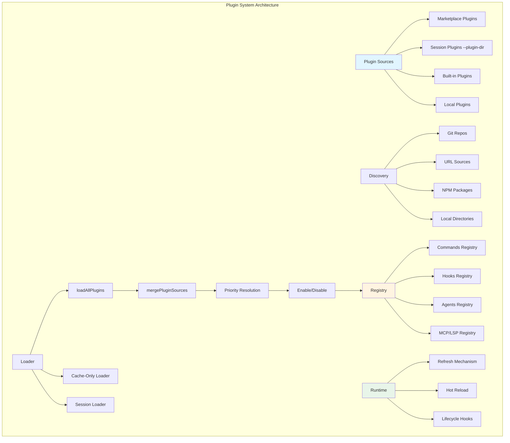

# Chapter 15: Plugin System & Extensions

## Overview

Claude Code's plugin system is one of its most extensible features, allowing developers to extend core functionality through plugins, Skills, and Marketplace. This chapter will deeply analyze the plugin system's architecture design, discovery mechanism, loading process, and lifecycle management.

**Chapter Highlights:**

- **Plugin Architecture**: Plugin types, directory structure, metadata definitions
- **Discovery Mechanism**: Marketplace, local plugins, built-in plugins
- **Loading Flow**: loadAllPlugins, caching strategies, dependency resolution
- **Lifecycle Management**: Initialization, hot reload, cleanup
- **Skills System**: Command extensions, custom skills
- **Marketplace Integration**: Source management, version control, auto-update

## Architecture Overview

### Plugin System Architecture



### Plugin Types

```typescript
// src/types/plugin.ts
export type LoadedPlugin = {
  // === Metadata ===
  name: string                      // Plugin name
  manifest: PluginManifest          // Plugin manifest
  path: string                      // Plugin path (special marker for built-in plugins)
  source: string                    // Source identifier (e.g., "git:repo" or ".claude-plugin/name")
  repository: string                // Backward-compatible repository field

  // === Status ===
  enabled: boolean                 // Whether enabled

  // === Extension Components ===
  commands?: Command[]              // Custom commands
  hooksConfig?: HooksConfig         // Hooks configuration
  agents?: AgentDefinition[]        // Agent definitions
  mcpServers?: MCPServersConfig     // MCP server configuration
  lspServers?: LSPServersConfig     // LSP server configuration

  // === Special Markers ===
  isBuiltin?: boolean               // Whether built-in plugin
}

export type PluginManifest = {
  name: string                      // Plugin name
  description?: string               // Plugin description
  version?: string                   // Version number
  author?: string                   // Author
  license?: string                  // License
  homepage?: string                  // Homepage
  repository?: string                // Repository URL
}
```

## Plugin Discovery Mechanism

### Marketplace Plugins

Marketplace is the primary source of plugins, supporting multiple source types.

**Source Type Definition**

```typescript
// src/utils/plugins/marketplaceManager.ts
export type MarketplaceSource =
  | { type: 'url'; url: string }                    // URL source
  | { type: 'github'; owner: string; repo: string }  // GitHub repository
  | { type: 'git'; url: string }                     // Git repository
  | { type: 'file'; path: string }                   // Local file
  | { type: 'npm'; package: string }                 // NPM package (not implemented)

export type Marketplace = {
  name: string                      // Marketplace name
  displayName?: string              // Display name
  description?: string               // Description
  source: MarketplaceSource          // Source configuration
  lastUpdated?: number               // Last update time
  plugins: MarketplacedPlugin[]     // Plugin list
}

export type MarketplacedPlugin = {
  name: string                      // Plugin name
  description?: string               // Description
  version?: string                   // Version requirement
  path?: string                     // Plugin path (relative to marketplace root)
  schemaVersion?: number             // Schema version
  settings?: Record<string, unknown> // Default settings
}
```

**Loading Marketplace**

```typescript
// src/utils/plugins/marketplaceManager.ts
export async function loadMarketplace(
  name: string,
  source: MarketplaceSource,
  options?: { onProgress?: MarketplaceProgressCallback }
): Promise<Marketplace> {
  // 1. Load based on source type
  let marketplace: Marketplace

  switch (source.type) {
    case 'url':
      marketplace = await loadFromURL(source.url)
      break

    case 'github':
      marketplace = await loadFromGitHub(source.owner, source.repo)
      break

    case 'git':
      marketplace = await loadFromGit(source.url)
      break

    case 'file':
      marketplace = await loadFromFile(source.path)
      break

    case 'npm':
      throw new Error('NPM source not yet implemented')
  }

  // 2. Validate marketplace schema
  validateMarketplaceSchema(marketplace)

  // 3. Cache to local
  const cachePath = getMarketplaceCachePath(name)
  await cacheMarketplace(marketplace, cachePath)

  // 4. Update timestamp
  marketplace.lastUpdated = Date.now()

  return marketplace
}

async function loadFromGitHub(owner: string, repo: string): Promise<Marketplace> {
  const repoUrl = `https://github.com/${owner}/${repo}`
  const cacheDir = getMarketplaceCacheDir(`${owner}-${repo}`)

  // Clone or update repository
  await ensureRepoCloned(repoUrl, cacheDir)

  // Read marketplace.json
  const manifestPath = join(cacheDir, '.claude-plugin', 'marketplace.json')
  const marketplace = JSON.parse(await readFile(manifestPath, 'utf-8'))

  return marketplace
}

async function loadFromURL(url: string): Promise<Marketplace> {
  // Direct download of marketplace.json
  const response = await fetch(url)
  if (!response.ok) {
    throw new Error(`Failed to load marketplace from URL: ${response.statusText}`)
  }

  const marketplace = await response.json()

  // Validate schema
  validateMarketplaceSchema(marketplace)

  return marketplace
}
```

### Local Plugins

Discover plugins from local filesystem.

```typescript
// src/utils/plugins/pluginLoader.ts
async function loadSessionOnlyPlugins(
  inlinePlugins: InlinePlugin[]
): Promise<{
  plugins: LoadedPlugin[]
  errors: PluginError[]
}> {
  const plugins: LoadedPlugin[] = []
  const errors: PluginError[] = []

  for (const inlinePlugin of inlinePlugins) {
    try {
      const pluginPath = inlinePlugin.path

      // Load plugin manifest
      const manifestPath = join(pluginPath, '.claude-plugin', 'plugin.json')
      const manifest = await loadPluginManifest(manifestPath, inlinePlugin.name, 'session')

      // Create plugin object
      const plugin: LoadedPlugin = {
        name: manifest.name,
        manifest,
        path: pluginPath,
        source: 'session',
        repository: 'session',
        enabled: true,  // Session plugins enabled by default
      }

      plugins.push(plugin)
    } catch (error) {
      errors.push({
        plugin: inlinePlugin.name,
        error: errorMessage(error),
        source: 'session',
      })
    }
  }

  return { plugins, errors }
}
```

### Built-in Plugins

Plugins distributed with the CLI.

```typescript
// src/plugins/builtinPlugins.ts
const BUILTIN_PLUGINS: Record<
  string,
  {
    description: string
    version?: string
    defaultEnabled?: boolean
    isAvailable?: () => boolean
    hooks?: HooksConfig
    mcpServers?: MCPServersConfig
  }
> = {
  anthropicOfficial: {
    description: 'Official Anthropic plugins',
    version: '1.0.0',
    defaultEnabled: true,
    hooks: {
      PreToolUse: [
        {
          pattern: 'Bash',
          enabled: true,
          hooks: [
            {
              pattern: 'npm install|npm rebuild',
              enabled: true,
              description: 'Wait for package.json to be saved',
              execute: async ({ input, hookArgs }) => {
                const { waitForFileChange } = await import('../utils/fileChanged.js')
                await waitForFileChange(join(getOriginalCwd(), 'package.json'), 3000)
              },
            },
          ],
        },
      ],
    },
  },

  memoryKernel: {
    description: 'Memory and auto-memorization features',
    defaultEnabled: false,
    isAvailable: () => feature('MEMORY_KERNEL_ENABLED'),
    hooks: {
      Stop: [
        {
          pattern: '*',
          enabled: true,
          hooks: [
            {
              pattern: '*',
              enabled: true,
              description: 'Extract memories from conversation',
              execute: async extractMemories,
            },
          ],
        },
      ],
    },
  },
}

function getBuiltinPlugins(): {
  enabled: LoadedPlugin[]
  disabled: LoadedPlugin[]
} {
  const settings = getSettings_DEPRECATED()
  const enabled: LoadedPlugin[] = []
  const disabled: LoadedPlugin[] = []

  for (const [name, definition] of BUILTIN_PLUGINS) {
    if (definition.isAvailable && !definition.isAvailable()) {
      continue
    }

    const pluginId = `${name}@builtin`
    const userSetting = settings?.enabledPlugins?.[pluginId]

    // User preference > plugin default > true
    const isEnabled =
      userSetting !== undefined
        ? userSetting === true
        : (definition.defaultEnabled ?? true)

    const plugin: LoadedPlugin = {
      name,
      manifest: {
        name,
        description: definition.description,
        version: definition.version,
      },
      path: BUILTIN_MARKETPLACE_NAME,
      source: pluginId,
      repository: pluginId,
      enabled: isEnabled,
      isBuiltin: true,
      hooksConfig: definition.hooks,
      mcpServers: definition.mcpServers,
    }

    if (isEnabled) {
      enabled.push(plugin)
    } else {
      disabled.push(plugin)
    }
  }

  return { enabled, disabled }
}
```

## Loading Flow

### loadAllPlugins Main Flow

```typescript
// src/utils/plugins/pluginLoader.ts
export const loadAllPlugins = memoize(async (): Promise<PluginLoadResult> => {
  const result = await assemblePluginLoadResult(() =>
    loadPluginsFromMarketplaces({ cacheOnly: false })
  )

  return result
})

export const loadAllPluginsCacheOnly = memoize(async (): Promise<PluginLoadResult> => {
  const result = await assemblePluginLoadResult(() =>
    loadPluginsFromMarketplaces({ cacheOnly: true })
  )

  return result
})

async function assemblePluginLoadResult(
  marketplaceLoader: () => Promise<{
    plugins: LoadedPlugin[]
    errors: PluginError[]
  }>
): Promise<PluginLoadResult> {
  // 1. Parallel load marketplace plugins and session plugins
  const inlinePlugins = getInlinePlugins()
  const [marketplaceResult, sessionResult] = await Promise.all([
    marketplaceLoader(),
    inlinePlugins.length > 0
      ? loadSessionOnlyPlugins(inlinePlugins)
      : Promise.resolve({ plugins: [], errors: [] }),
  ])

  // 2. Load built-in plugins
  const builtinResult = getBuiltinPlugins()

  // 3. Merge all plugin sources
  const { plugins: allPlugins, errors: mergeErrors } = mergePluginSources({
    session: sessionResult.plugins,
    marketplace: marketplaceResult.plugins,
    builtin: [...builtinResult.enabled, ...builtinResult.disabled],
    managedNames: getManagedPluginNames(),
  })

  const allErrors = [
    ...marketplaceResult.errors,
    ...sessionResult.errors,
    ...mergeErrors,
  ]

  // 4. Verify and demote plugins
  const { enabled, disabled } = await verifyAndDemotePlugins(allPlugins)

  // 5. Cache plugin settings
  await cachePluginSettings(enabled)

  return {
    enabled,
    disabled,
    errors: allErrors,
  }
}
```

### Plugin Merging Strategy

```typescript
// src/utils/plugins/pluginLoader.ts
async function mergePluginSources(sources: {
  session: LoadedPlugin[]
  marketplace: LoadedPlugin[]
  builtin: LoadedPlugin[]
  managedNames: Set<string>
}): Promise<{
  plugins: LoadedPlugin[]
  errors: PluginError[]
}> {
  const plugins: LoadedPlugin[] = []
  const errors: PluginError[] = []

  // Index all plugins by name
  const index = new Map<string, LoadedPlugin[]>()

  // Index session plugins
  for (const plugin of sources.session) {
    addToIndex(index, 'session', plugin)
  }

  // Index marketplace plugins
  for (const plugin of sources.marketplace) {
    addToIndex(index, 'marketplace', plugin)
  }

  // Index built-in plugins
  for (const plugin of sources.builtin) {
    addToIndex(index, 'builtin', plugin)
  }

  // Resolve conflicts
  for (const [name, variants] of index) {
    const selected = selectPluginVariant(name, variants, sources.managedNames)

    if (selected) {
      plugins.push(selected.plugin)
    } else {
      // Record conflict error
      errors.push({
        plugin: name,
        error: `Plugin conflict: multiple variants with no clear priority`,
        source: 'merge',
      })
    }
  }

  return { plugins, errors }
}

function selectPluginVariant(
  name: string,
  variants: LoadedPlugin[],
  managedNames: Set<string>
): { plugin: LoadedPlugin; source: string } | null {
  // Priority:
  // 1. Session plugins (--plugin-dir)
  // 2. Marketplace plugins
  // 3. Built-in plugins

  const sessionVariant = variants.find(v => v.source === 'session')
  const marketplaceVariant = variants.find(v => v.source.startsWith('marketplace'))
  const builtinVariant = variants.find(v => v.isBuiltin)

  // Check managed lock
  if (managedNames.has(name)) {
    // Managed plugins cannot be overridden by session plugins
    if (sessionVariant) {
      return marketplaceVariant || builtinVariant || null
    }
  }

  return (
    sessionVariant ||
    marketplaceVariant ||
    builtinVariant ||
    null
  )
}
```

### Caching Strategy

**Three-Tier Cache**

```typescript
// 1. Memory cache (fastest)
const inMemoryCache = new Map<string, LoadedPlugin[]>()

// 2. Disk cache (installed plugins)
// ~/.claude/plugins/installed_plugins.json
const installedPluginsPath = getInstalledPluginsPath()

// 3. Marketplace cache
// ~/.claude/plugins/marketplaces/
const marketplaceCacheDir = getMarketplaceCacheDir()

async function loadPluginsFromMarketplaces({
  cacheOnly,
}: {
  cacheOnly: boolean
}): Promise<{
  plugins: LoadedPlugin[]
  errors: PluginError[]
}> {
  const settings = getSettings_DEPRECATED()
  const enabledPlugins = {
    ...getAddDirEnabledPlugins(),
    ...(settings.enabledPlugins || {}),
  }

  // Get all marketplaces
  const marketplaceNames = Object.keys(enabledPlugins)
  const uniqueMarketplaces = [...new Set(marketplaceNames)]

  // Parallel load all marketplace catalogs
  const marketplaceCatalogs = new Map<string, Awaited<Marketplace>>()
  await Promise.all(
    [...uniqueMarketplaces].map(async name => {
      marketplaceCatalogs.set(name, await getMarketplaceCacheOnly(name))
    })
  )

  // Load plugins for each marketplace
  const plugins: LoadedPlugin[] = []
  const errors: PluginError[] = []

  for (const [marketplaceName, marketplace] of marketplaceCatalogs) {
    for (const pluginDef of marketplace.plugins) {
      try {
        // Load from installed path (cache-only)
        const plugin = await loadPluginFromMarketplace(
          marketplaceName,
          pluginDef,
          cacheOnly
        )

        if (plugin) {
          plugins.push(plugin)
        }
      } catch (error) {
        errors.push({
          plugin: pluginDef.name,
          error: errorMessage(error),
          source: marketplaceName,
        })
      }
    }
  }

  return { plugins, errors }
}

async function getMarketplaceCacheOnly(name: string): Promise<Marketplace> {
  // Check cache
  const cachePath = join(getMarketplaceCacheDir(), `${name}.json`)

  try {
    const cached = JSON.parse(await readFile(cachePath, 'utf-8'))
    return cached
  } catch {
    throw new Error(`Marketplace cache not found: ${name}`)
  }
}
```

## Lifecycle Management

### Initialization Flow

```typescript
// src/hooks/useManagePlugins.ts
export function useManagePlugins(): PluginManagementResult {
  const { addNotification } = useNotifications()
  const setAppState = useSetAppState()

  // Initial plugin load
  const initialPluginLoad = useCallback(async () => {
    try {
      // Load all plugins
      const { enabled, disabled, errors } = await loadAllPlugins()

      // Detect and uninstall delisted plugins
      await detectAndUninstallDelistedPlugins()

      // Detect flagged plugins
      const flaggedPlugins = await getFlaggedPlugins(enabled)

      // Load plugin components
      const [commands, agents, hooks] = await Promise.all([
        getPluginCommands(),
        loadPluginAgents(enabled),
        loadPluginHooks(),
      ])

      // Update AppState
      setAppState(prev => ({
        ...prev,
        plugins: {
          enabled,
          disabled,
          commands,
          errors: mergePluginErrors(prev.plugins.errors, errors),
          needsRefresh: false,
        },
        agentDefinitions: agents,
      }))

      // Show flagged plugin notifications
      for (const flagged of flaggedPlugins) {
        addNotification({
          type: 'warning',
          title: 'Flagged Plugin',
          message: flagged.reason,
        })
      }

    } catch (error) {
      addNotification({
        type: 'error',
        title: 'Plugin Load Failed',
        message: errorMessage(error),
      })
    }
  }, [setAppState, addNotification])

  // Execute once on component mount
  useEffect(() => {
    initialPluginLoad()
  }, [initialPluginLoad])

  return {
    enabled: useAppState(s => s.plugins.enabled),
    disabled: useAppState(s => s.plugins.disabled),
    errors: useAppState(s => s.plugins.errors),
    needsRefresh: useAppState(s => s.plugins.needsRefresh),
    refresh: () => refreshActivePlugins(setAppState),
  }
}
```

### Hot Reload Mechanism

**File Watching**

```typescript
// src/utils/skills/skillChangeDetector.ts
export async function initialize(): Promise<void> {
  if (initialized || disposed) return
  initialized = true

  // Get watch paths
  const paths = await getWatchPaths()

  // Create file watcher
  watcher = chokidar.watch(paths, {
    persistent: true,
    ignoreInitial: true,
    depth: 2,  // Skills use skill-name/SKILL.md format
    awaitWriteFinish: {
      stabilityThreshold: FILE_STABILITY_THRESHOLD_MS,
      pollInterval: FILE_STABILITY_POLL_INTERVAL_MS,
    },
    ignored: (path, stats) => {
      // Ignore .git directory
      return path.split(platformPath.sep).some(dir => dir === '.git')
    },
  })

  // Listen for file changes
  watcher.on('all', (event, path) => {
    if (path) {
      handleChange(path)
    }
  })

  logForDebugging(`Skill change detector initialized for ${paths.length} paths`)
}

function handleChange(path: string): void {
  logForDebugging(`Detected skill change: ${path}`)

  // Add to pending queue
  pendingChangedPaths.add(path)

  // Schedule reload (debounce)
  scheduleReload(path)
}
```

**Debounced Reload**

```typescript
const RELOAD_DEBOUNCE_MS = 300  // 300ms debounce

let reloadTimer: ReturnType<typeof setTimeout> | null = null
const pendingChangedPaths = new Set<string>()

function scheduleReload(_path: string): void {
  if (reloadTimer) {
    clearTimeout(reloadTimer)
  }

  reloadTimer = setTimeout(async () => {
    const paths = Array.from(pendingChangedPaths)
    pendingChangedPaths.clear()
    reloadTimer = null

    logForDebugging(`Reloading skills after changes: ${paths.join(', ')}`)

    // Execute ConfigChange hooks
    const results = await executeConfigChangeHooks('skills', paths[0]!)

    if (hasBlockingResult(results)) {
      logForDebugging(`ConfigChange hook blocked skill reload (${paths.length} paths)`)
      return
    }

    // Clear caches
    clearSkillCaches()
    clearCommandsCache()
    resetSentSkillNames()

    // Notify listeners
    skillsChanged.emit()
  }, RELOAD_DEBOUNCE_MS)
}
```

### Refresh Mechanism

```typescript
// src/utils/plugins/refresh.ts
export async function refreshActivePlugins(
  setAppState: SetAppState,
): Promise<RefreshActivePluginsResult> {
  logForDebugging('refreshActivePlugins called')

  // 1. Clear all plugin caches
  clearAllCaches()

  // 2. Load plugins
  const { enabled, disabled } = await loadAllPlugins()

  // 3. Load components
  const errors: PluginError[] = []
  const pluginCommands = await getPluginCommands()
  const agentDefinitions = await loadPluginAgents(enabled)
  const mcpCounts = await Promise.all(
    enabled.map(async p => {
      const servers = await loadPluginMcpServers(p, errors)
      if (servers) p.mcpServers = servers
      return servers ? Object.keys(servers).length : 0
    })
  )
  const mcp_count = mcpCounts.reduce((sum, n) => sum + n, 0)

  // 4. Update AppState
  setAppState(prev => ({
    ...prev,
    plugins: {
      ...prev.plugins,
      enabled,
      disabled,
      commands: pluginCommands,
      errors: mergePluginErrors(prev.plugins.errors, errors),
      needsRefresh: false,
    },
    agentDefinitions,
    mcp: {
      ...prev.mcp,
      pluginReconnectKey: prev.mcp.pluginReconnectKey + 1,  // Trigger MCP reconnect
    },
  }))

  // 5. Load hooks
  try {
    await loadPluginHooks()
  } catch (e) {
    logError(e)
    logForDebugging(`refreshActivePlugins: loadPluginHooks failed: ${errorMessage(e)}`)
  }

  // 6. Return statistics
  return {
    plugin_count: enabled.length,
    command_count: pluginCommands.length,
    agent_count: agentDefinitions.allAgents.length,
    hook_count: enabled.reduce((sum, p) => sum + (p.hooksConfig ? 1 : 0), 0),
    mcp_count,
  }
}
```

## Skills System

### Skills Discovery

```typescript
// src/skills/loadSkillsDir.ts
export const getSkillDirCommands = memoize(
  async (cwd: string): Promise<Command[]> => {
    // 1. User skills directory
    const userSkillsDir = join(getClaudeConfigHomeDir(), 'skills')

    // 2. Managed skills directory
    const managedSkillsDir = join(getManagedFilePath(), '.claude', 'skills')

    // 3. Project skills directories
    const projectSkillsDirs = getProjectSkillsDirs(cwd)

    // 4. Additional skills directories (--add-dir)
    const additionalDirs = getAdditionalDirectoriesForClaudeMd()

    // 5. Legacy commands directory
    const commandsDir = join(cwd, 'commands')

    // Parallel load all skills
    const [
      managedSkills,
      userSkills,
      projectSkills,
      additionalSkills,
      legacyCommands,
    ] = await Promise.all([
      loadSkillsFromSkillsDir(managedSkillsDir, 'policySettings'),
      loadSkillsFromSkillsDir(userSkillsDir, 'userSettings'),
      ...projectSkills.map(dir => loadSkillsFromSkillsDir(dir, 'projectSettings')),
      ...additionalDirs.map(dir =>
        loadSkillsFromSkillsDir(join(dir, '.claude', 'skills'), 'projectSettings')
      ),
      loadSkillsFromCommandsDir(commandsDir),
    ])

    // Merge all skills
    const allSkills = [
      ...managedSkills,
      ...userSkills,
      ...projectSkills.flat(),
      ...additionalSkills.flat(),
      ...legacyCommands,
    ]

    return allSkills
  }
)
```

### Skill Structure

```typescript
// Skill directory structure
my-skill/
├── SKILL.md              # Skill definition (required)
├── README.md             # Documentation (optional)
└── tools/               # Tool definitions (optional)
    └── custom-tool.ts

// SKILL.md format
---
name: my_skill
description: My custom skill for specific task
userInvocable: true  # User-invocable
enabled: true         # Whether enabled
---

## Skill Description

This skill provides custom functionality for...

### Usage

Simply type \`/my-skill\` in the chat to invoke this skill.

### Parameters

- \`param1\`: Description of parameter 1
- \`param2\`: Description of parameter 2
```

### Loading Skill

```typescript
async function loadSkillsFromSkillsDir(
  skillsDir: string,
  source: 'policySettings' | 'userSettings' | 'projectSettings'
): Promise<Command[]> {
  const skills: Command[] = []

  try {
    const entries = await readdir(skillsDir, { withFileTypes: true })

    for (const entry of entries) {
      if (entry.isDirectory()) {
        // Directory format: skill-name/SKILL.md
        const skillPath = join(entry.name, 'SKILL.md')
        const skill = await loadSkillFromMarkdown(skillPath, source)
        if (skill) skills.push(skill)
      } else if (entry.isFile() && entry.name.endsWith('.md')) {
        // Single file format: read .md file directly
        const skill = await loadSkillFromMarkdown(
          join(skillsDir, entry.name),
          source
        )
        if (skill) skills.push(skill)
      }
    }
  } catch (error) {
    logForDebugging(`Failed to load skills from ${skillsDir}: ${errorMessage(error)}`)
  }

  return skills
}
```

## Marketplace Integration

### Adding Marketplace

```typescript
// src/commands/plugin/AddMarketplace.tsx
export async function addMarketplaceSource(
  source: MarketplaceSource,
  onProgress?: MarketplaceProgressCallback
): Promise<{
  name: string
  pluginCount: number
}> {
  // 1. Validate source format
  const validatedSource = validateMarketplaceSource(source)

  // 2. Load marketplace
  const marketplace = await loadMarketplace(
    validatedSource.name,
    validatedSource,
    { onProgress }
  )

  // 3. Add to known marketplaces
  await addMarketplaceToConfig(marketplace)

  // 4. Clear caches
  clearMarketplacesCache()

  return {
    name: marketplace.name,
    pluginCount: marketplace.plugins.length,
  }
}

// Usage example
await addMarketplaceSource(
  {
    type: 'github',
    owner: 'anthropics',
    repo: 'claude-code-marketplace',
  },
  (event) => {
    console.log(`[${event.type}] ${event.name}: ${event.progress || ''}`)
  }
)
```

### Auto Update

```typescript
// src/utils/plugins/pluginAutoupdate.ts
export async function performBackgroundPluginInstallations(
  setAppState: SetAppState,
): Promise<void> {
  // 1. Calculate diff
  const declared = getDeclaredMarketplaces()
  const materialized = await loadKnownMarketplacesConfig()
  const diff = diffMarketplaces(declared, materialized)

  const pendingNames = [
    ...diff.missing,
    ...diff.sourceChanged.map(c => c.name),
  ]

  // 2. Initialize AppState
  setAppState(prev => ({
    ...prev,
    plugins: {
      ...prev.plugins,
      installationStatus: {
        marketplaces: pendingNames.map(name => ({
          name,
          status: 'pending',
        })),
        plugins: [],
      },
    },
  }))

  // 3. Reconcile and install
  const result = await reconcileMarketplaces({
    onProgress: event => {
      switch (event.type) {
        case 'installing':
          updateMarketplaceStatus(setAppState, event.name, 'installing')
          break
        case 'installed':
          updateMarketplaceStatus(setAppState, event.name, 'installed')
          break
        case 'failed':
          updateMarketplaceStatus(setAppState, event.name, 'failed', event.error)
          break
      }
    },
  })

  // 4. Auto-refresh plugins for newly installed marketplaces
  if (result.installed.length > 0) {
    clearMarketplacesCache()
    logForDebugging(`Auto-refreshing plugins after ${result.installed.length} new marketplace(s) installed`)

    // Interactive mode: auto-refresh
    if (!isNonInteractiveSession()) {
      await refreshActivePlugins(setAppState)
    }
  }
}
```

## Best Practices

### Plugin Development Recommendations

1. **Clear Responsibility**: Each plugin focuses on a single functional domain
2. **Version Management**: Use semantic versioning
3. **Complete Documentation**: README, examples, usage instructions
4. **Error Handling**: Graceful degradation, clear error messages
5. **Performance Optimization**: Avoid blocking operations, use caching

### Marketplace Design Recommendations

1. **Curated Quality**: Only include high-quality plugins
2. **Version Compatibility**: Clear version requirements
3. **Dependency Declaration**: List all dependencies
4. **Regular Updates**: Keep plugins up-to-date

### Skills Development Recommendations

1. **Concise Description**: Clearly explain skill functionality
2. **Reasonable Naming**: Use memorable command names
3. **User Control**: Users can disable unwanted skills
4. **Hot Reload Friendly**: Support file watching

## Summary

Claude Code's plugin system provides powerful extensibility:

1. **Multi-Source Support**: Marketplace, local plugins, built-in plugins, Session plugins
2. **Flexible Loading**: Caching strategies, parallel loading, intelligent merging
3. **Lifecycle Management**: Initialization, hot reload, cleanup
4. **Skills Integration**: Command extensions, custom skills, hot update
5. **Marketplace Ecosystem**: Third-party plugins, version management, auto-update

Mastering the plugin system allows infinite extension of Claude Code's capabilities to build a customized development environment.
