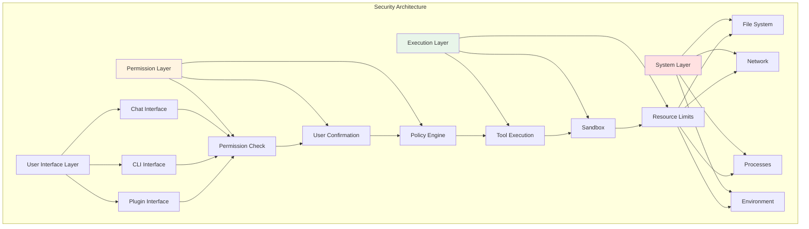

# Chapter 17: Security Best Practices

## Overview

Security is one of the most important considerations for Claude Code. As a tool that interacts with AI, executes shell commands, and manages the file system, Claude Code must ensure the security of user data, proper control of system permissions, and protection against potential security risks. This chapter will comprehensively introduce Claude Code's security architecture, best practices, and common security issue prevention measures.

**Chapter Highlights:**

- **Security Architecture**: Permission system, sandbox mechanism, security boundaries
- **Permission Control**: File system, network, processes, environment variables
- **Data Security**: Sensitive data handling, encryption storage, secure transmission
- **Code Security**: Input validation, output encoding, injection protection
- **Audit & Monitoring**: Operation logs, security events, anomaly detection
- **Security Checklist**: Development, deployment, operations security checks

## Security Architecture

### Security Boundary Design



### Permission System Architecture

```typescript
// src/types/permission.ts
export type PermissionScope =
  | 'file_read'      // File read
  | 'file_write'     // File write
  | 'file_delete'    // File deletion
  | 'network'        // Network access
  | 'process'        // Process operations
  | 'env'            // Environment variables
  | 'cli'            // CLI commands
  | 'plugin'         // Plugin operations

export type PermissionResult =
  | 'allow'          // Allow
  | 'deny'           // Deny
  | 'ask'            // Ask user
  | 'passthrough'    // Pass to next layer

export type PermissionRequest = {
  scope: PermissionScope
  action: string     // Specific operation
  resource?: string  // Involved resource
  tool?: string      // Involved tool
  details?: Record<string, unknown>
}

export type PermissionPolicy = {
  scopes: PermissionScope[]
  defaultAction: PermissionResult
  exceptions: Record<string, PermissionResult>
  userConfirmRequired: boolean
}
```

## Permission Control

### File System Permissions

#### Read Permission Control

```typescript
// src/permissions/filePermissions.ts
export function checkFileReadPermission(
  filePath: string,
  context: PermissionContext
): PermissionResult {
  // 1. Check path whitelist
  if (isPathWhitelisted(filePath)) {
    return 'allow'
  }

  // 2. Check path blacklist
  if (isPathBlacklisted(filePath)) {
    return 'deny'
  }

  // 3. Check sensitive paths
  if (isSensitivePath(filePath)) {
    // Sensitive paths require user confirmation
    return 'ask'
  }

  // 4. Check working directory scope
  if (!isWithinWorkingDirectory(filePath)) {
    // Access outside working directory requires confirmation
    return 'ask'
  }

  // 5. Check file size limit
  const fileSize = getFileSize(filePath)
  if (fileSize > MAX_FILE_SIZE) {
    // Oversized files require confirmation
    context.details = { fileSize, maxSize: MAX_FILE_SIZE }
    return 'ask'
  }

  return 'allow'
}

function isSensitivePath(filePath: string): boolean {
  const sensitivePatterns = [
    '**/.env',
    '**/*secret*',
    '**/*password*',
    '**/.ssh/**',
    '**/.gnupg/**',
    '**/.aws/**',
    '**/.kube/**',
    '**/node_modules/.cache/**',
  ]

  return matchesAnyPattern(filePath, sensitivePatterns)
}

function isPathBlacklisted(filePath: string): boolean {
  const blacklistedPaths = [
    '/etc/shadow',
    '/etc/passwd',
    '/etc/sudoers',
    '/root/.ssh/id_rsa',
    process.env.HOME + '/.ssh/id_rsa',
  ]

  const normalized = normalizePath(filePath)
  return blacklistedPaths.some(path => normalized.startsWith(path))
}
```

#### Write Permission Control

```typescript
// src/permissions/filePermissions.ts
export function checkFileWritePermission(
  filePath: string,
  context: PermissionContext
): PermissionResult {
  // 1. Write permissions are stricter than read
  const readPermission = checkFileReadPermission(filePath, context)
  if (readPermission === 'deny') {
    return 'deny'
  }

  // 2. Check file extension
  const ext = extname(filePath)
  if (DANGEROUS_EXTENSIONS.includes(ext)) {
    context.details = { reason: 'Dangerous file extension', extension: ext }
    return 'ask'
  }

  // 3. Check system critical directories
  if (isSystemDirectory(filePath)) {
    return 'deny'
  }

  // 4. Check if overwriting existing file
  if (existsSync(filePath)) {
    context.details = { reason: 'File overwrite' }
    return 'ask'
  }

  return 'allow'
}

const DANGEROUS_EXTENSIONS = [
  '.exe', '.dll', '.so', '.dylib',
  '.sh', '.bash', '.zsh',
  '.bat', '.cmd', '.ps1',
  '.app', '.dmg',
  '.deb', '.rpm',
  '.scr', '.vbs',
]
```

### Network Permission Control

```typescript
// src/permissions/networkPermissions.ts
export function checkNetworkPermission(
  url: string,
  context: PermissionContext
): PermissionResult {
  const parsed = new URL(url)

  // 1. Check protocol whitelist
  const allowedProtocols = ['https:', 'http:', 'ws:', 'wss:']
  if (!allowedProtocols.includes(parsed.protocol)) {
    context.details = { reason: 'Disallowed protocol', protocol: parsed.protocol }
    return 'deny'
  }

  // 2. Check private network addresses
  if (isPrivateAddress(parsed.hostname)) {
    context.details = { reason: 'Private network access' }
    return 'ask'
  }

  // 3. Check domain blacklist
  if (isDomainBlacklisted(parsed.hostname)) {
    return 'deny'
  }

  // 4. Check port
  const port = parseInt(parsed.port) || (parsed.protocol === 'https:' ? 443 : 80)
  if (isRestrictedPort(port)) {
    context.details = { reason: 'Restricted port', port }
    return 'deny'
  }

  return 'allow'
}

function isPrivateAddress(hostname: string): boolean {
  // Check localhost
  if (hostname === 'localhost' || hostname === '127.0.0.1') {
    return true
  }

  // Check private IP
  const privatePatterns = [
    /^10\./,
    /^172\.(1[6-9]|2[0-9]|3[0-1])\./,
    /^192\.168\./,
    /^127\./,
    /^::1$/,
    /^fe80:/,
  ]

  return privatePatterns.some(pattern => pattern.test(hostname))
}

const RESTRICTED_PORTS = [
  22,   // SSH
  23,   // Telnet
  25,   // SMTP
  3306, // MySQL
  5432, // PostgreSQL
  6379, // Redis
  27017, // MongoDB
]
```

### Process Permission Control

```typescript
// src/permissions/processPermissions.ts
export function checkProcessPermission(
  command: string,
  args: string[],
  context: PermissionContext
): PermissionResult {
  // 1. Check command blacklist
  if (isCommandBlacklisted(command)) {
    context.details = { reason: 'Blacklisted command', command }
    return 'deny'
  }

  // 2. Check dangerous arguments
  if (containsDangerousArgs(args)) {
    context.details = { reason: 'Dangerous arguments', args }
    return 'deny'
  }

  // 3. Check interactive commands
  if (requiresInteraction(command, args)) {
    context.details = { reason: 'Interactive command' }
    return 'deny'
  }

  // 4. Check system admin commands
  if (isSystemAdminCommand(command)) {
    return 'ask'
  }

  return 'allow'
}

function isCommandBlacklisted(command: string): boolean {
  const blacklistedCommands = [
    'rm', 'dd', 'mkfs',
    'sudo', 'su',
    'chmod', 'chown',
    'passwd',
    'crontab',
    'iptables',
    'systemctl',
  ]

  const basename = path.basename(command)
  return blacklistedCommands.includes(basename)
}

function containsDangerousArgs(args: string[]): boolean {
  const dangerousPatterns = [
    /^-rf?$/,          // rm -rf
    /^--force$/,       // Various --force
    /^--no-confirm$/,  // Skip confirmation
    /^yes\|/,          // yes | command
    /^>.*\/dev\/(null|zero)/,  // Redirect to device
  ]

  return args.some(arg =>
    dangerousPatterns.some(pattern => pattern.test(arg))
  )
}
```

### Environment Variable Permissions

```typescript
// src/permissions/envPermissions.ts
export function checkEnvPermission(
  name: string,
  operation: 'read' | 'write' | 'delete',
  context: PermissionContext
): PermissionResult {
  // 1. Check sensitive environment variables
  if (isSensitiveEnv(name)) {
    if (operation === 'read') {
      context.details = { reason: 'Sensitive environment variable' }
      return 'ask'
    } else {
      // Write/delete sensitive vars require strict confirmation
      return 'ask'
    }
  }

  // 2. Check system environment variables
  if (isSystemEnv(name)) {
    if (operation !== 'read') {
      return 'deny'
    }
  }

  return 'allow'
}

function isSensitiveEnv(name: string): boolean {
  const sensitivePatterns = [
    /API.?KEY/i,
    /SECRET/i,
    /PASSWORD/i,
    /TOKEN/i,
    /AUTH/i,
    /CREDENTIAL/i,
    /PRIVATE.?KEY/i,
  ]

  return sensitivePatterns.some(pattern => pattern.test(name))
}

function isSystemEnv(name: string): boolean {
  const systemEnvs = [
    'PATH', 'HOME', 'USER', 'SHELL',
    'TERM', 'LANG', 'LC_ALL',
    'DISPLAY', 'XAUTHORITY',
  ]

  return systemEnvs.includes(name)
}
```

## Data Security

### Sensitive Data Detection

```typescript
// src/security/sensitiveData.ts
export function detectSensitiveData(
  text: string,
  context: SecurityContext
): SensitiveDataMatch[] {
  const matches: SensitiveDataMatch[] = []

  // 1. API Keys
  const apiKeyPatterns = [
    { pattern: /(?:api[_-]?key|apikey)\s*[:=]\s*['"]?([a-zA-Z0-9_\-]{20,})/gi, type: 'api_key' },
    { pattern: /sk-[a-zA-Z0-9]{48}/g, type: 'openai_key' },
    { pattern: /AKIA[0-9A-Z]{16}/g, type: 'aws_key' },
  ]

  // 2. Tokens
  const tokenPatterns = [
    { pattern: /(?:token|access[_-]?token)\s*[:=]\s*['"]?([a-zA-Z0-9_\-\.]{20,})/gi, type: 'token' },
    { pattern: /Bearer\s+([a-zA-Z0-9_\-\.]{20,})/gi, type: 'bearer_token' },
  ]

  // 3. Passwords
  const passwordPatterns = [
    { pattern: /(?:password|passwd|pwd)\s*[:=]\s*['"]?([^\s'"]{8,})/gi, type: 'password' },
  ]

  // 4. Private Keys
  const keyPatterns = [
    { pattern: /-----BEGIN\s+(RSA\s+)?PRIVATE\s+KEY-----/g, type: 'private_key' },
    { pattern: /-----BEGIN\s+EC\s+PRIVATE\s+KEY-----/g, type: 'private_key' },
  ]

  const allPatterns = [
    ...apiKeyPatterns,
    ...tokenPatterns,
    ...passwordPatterns,
    ...keyPatterns,
  ]

  for (const { pattern, type } of allPatterns) {
    let match
    while ((match = pattern.exec(text)) !== null) {
      matches.push({
        type,
        value: match[1] || match[0],
        position: { start: match.index, end: match.index + match[0].length },
      })
    }
  }

  return matches
}

export function redactSensitiveData(
  text: string,
  matches: SensitiveDataMatch[]
): string {
  let redacted = text

  // Replace from back to front to maintain positions
  for (const match of matches.reverse()) {
    const before = redacted.substring(0, match.position.start)
    const after = redacted.substring(match.position.end)
    const replacement = `[REDACTED ${match.type.toUpperCase()}]`
    redacted = before + replacement + after
  }

  return redacted
}
```

### Encryption Storage

```typescript
// src/security/encryption.ts
import { createCipher, createDecipher } from 'crypto'

export async function encryptSensitiveData(
  data: string,
  key: string
): Promise<string> {
  const algorithm = 'aes-256-gcm'
  const iv = crypto.randomBytes(16)
  const cipher = createCipher(algorithm, key)

  let encrypted = cipher.update(data, 'utf8', 'hex')
  encrypted += cipher.final('hex')

  const authTag = cipher.getAuthTag()

  // Combine: iv + authTag + encrypted
  return iv.toString('hex') + ':' + authTag.toString('hex') + ':' + encrypted
}

export async function decryptSensitiveData(
  encrypted: string,
  key: string
): Promise<string> {
  const parts = encrypted.split(':')
  const iv = Buffer.from(parts[0], 'hex')
  const authTag = Buffer.from(parts[1], 'hex')
  const encryptedData = parts[2]

  const decipher = createDecipher('aes-256-gcm', key)
  decipher.setAuthTag(authTag)

  let decrypted = decipher.update(encryptedData, 'hex', 'utf8')
  decrypted += decipher.final('utf8')

  return decrypted
}

// Usage example
async function storeAPIKey(key: string, value: string): Promise<void> {
  // Detect sensitive data
  const matches = detectSensitiveData(value, {})
  if (matches.length > 0) {
    // Encrypt storage
    const encryptionKey = getEncryptionKey()
    const encrypted = await encryptSensitiveData(value, encryptionKey)

    await setConfig(key, encrypted, { encrypted: true })
  } else {
    await setConfig(key, value)
  }
}
```

## Code Security

### Input Validation

```typescript
// src/security/inputValidation.ts
import { z } from 'zod'

// File path validation
export const FilePathSchema = z.string().refine(
  (path) => {
    // 1. Prevent path traversal
    if (path.includes('..')) {
      return false
    }

    // 2. Check absolute path
    if (path.startsWith('/')) {
      return false
    }

    // 3. Check special characters
    if (/[<>:"|?*]/.test(path)) {
      return false
    }

    return true
  },
  { message: 'Invalid file path' }
)

// URL validation
export const URLSchema = z.string().url().refine(
  (url) => {
    const parsed = new URL(url)

    // 1. Only allow specific protocols
    const allowedProtocols = ['https:', 'http:', 'ws:', 'wss:']
    if (!allowedProtocols.includes(parsed.protocol)) {
      return false
    }

    // 2. Forbid private network addresses
    if (isPrivateAddress(parsed.hostname)) {
      return false
    }

    return true
  },
  { message: 'Invalid or unsafe URL' }
)

// Shell command validation
export const ShellCommandSchema = z.object({
  command: z.string().refine(
    (cmd) => {
      // 1. No pipes
      if (cmd.includes('|')) {
        return false
      }

      // 2. No command chains
      if (/[;&]/.test(cmd)) {
        return false
      }

      // 3. No substitution
      if (/\$|`/.test(cmd)) {
        return false
      }

      return true
    },
    { message: 'Invalid shell command' }
  ),
  args: z.array(z.string()).max(100),
})
```

### Output Encoding

```typescript
// src/security/outputEncoding.ts
export function encodeShellOutput(output: string): string {
  // Escape special characters
  return output
    .replace(/\\/g, '\\\\')   // Backslash
    .replace(/\$/g, '\\$')     // Dollar sign
    .replace(/`/g, '\\`')     // Backtick
    .replace(/"/g, '\\"')     // Double quote
    .replace(/\n/g, '\\n')    // Newline
    .replace(/\r/g, '\\r')    // Carriage return
    .replace(/\t/g, '\\t')    // Tab
}

export function encodeHTMLOutput(output: string): string {
  return output
    .replace(/&/g, '&amp;')
    .replace(/</g, '&lt;')
    .replace(/>/g, '&gt;')
    .replace(/"/g, '&quot;')
    .replace(/'/g, '&#x27;')
}

export function encodeJSONOutput(output: string): string {
  // JSON.stringify handles escaping automatically
  return JSON.stringify(output)
}
```

### Injection Protection

```typescript
// src/security/injectionProtection.ts
export function sanitizeShellInput(input: string): string {
  // 1. Remove dangerous characters
  let sanitized = input.replace(/[;&|`$()]/g, '')

  // 2. Escape special characters
  sanitized = sanitized.replace(/([<>!"'&])/g, '\\$1')

  // 3. Limit length
  if (sanitized.length > 1000) {
    sanitized = sanitized.substring(0, 1000)
  }

  return sanitized
}

export function sanitizePathInput(input: string): string {
  // 1. Prevent path traversal
  let sanitized = input.replace(/\.\./g, '')

  // 2. Remove absolute path
  sanitized = sanitized.replace(/^\/+/, '')

  // 3. Normalize path separators
  sanitized = sanitized.replace(/\\/g, '/')

  return sanitized
}

// Usage example: Safe command execution
export async function executeCommandSafely(
  command: string,
  args: string[]
): Promise<string> {
  // 1. Validate command
  const validated = ShellCommandSchema.parse({ command, args })

  // 2. Sanitize arguments
  const sanitizedArgs = args.map(arg => sanitizeShellInput(arg))

  // 3. Execute (using parameterized method, not shell)
  const { stdout } = await exec(validated.command, sanitizedArgs)

  // 4. Encode output
  return encodeShellOutput(stdout)
}
```

## Audit & Monitoring

### Operation Logs

```typescript
// src/audit/operationLog.ts
export interface AuditLogEntry {
  timestamp: number
  user?: string
  operation: string
  resource?: string
  result: 'success' | 'failure' | 'blocked'
  details?: Record<string, unknown>
  securityContext?: SecurityContext
}

export class AuditLogger {
  private logs: AuditLogEntry[] = []
  private maxLogs = 10000

  log(entry: AuditLogEntry): void {
    // 1. Add timestamp
    entry.timestamp = Date.now()

    // 2. Record user info
    if (!entry.user) {
      entry.user = getCurrentUser()
    }

    // 3. Record security context
    if (!entry.securityContext) {
      entry.securityContext = getSecurityContext()
    }

    // 4. Add to logs
    this.logs.push(entry)

    // 5. Maintain log size
    if (this.logs.length > this.maxLogs) {
      this.logs.shift()
    }

    // 6. Persist to file
    this.persistLog(entry)

    // 7. Security event alert
    if (this.isSecurityEvent(entry)) {
      this.alertSecurityEvent(entry)
    }
  }

  private isSecurityEvent(entry: AuditLogEntry): boolean {
    // 1. Blocked operations
    if (entry.result === 'blocked') {
      return true
    }

    // 2. Failed sensitive operations
    if (entry.result === 'failure' && this.isSensitiveOperation(entry)) {
      return true
    }

    // 3. Anomalous patterns
    if (this.detectAnomalousPattern(entry)) {
      return true
    }

    return false
  }

  private isSensitiveOperation(entry: AuditLogEntry): boolean {
    const sensitiveOperations = [
      'file_write',
      'file_delete',
      'network',
      'process',
      'env_write',
    ]

    return sensitiveOperations.includes(entry.operation)
  }

  private detectAnomalousPattern(entry: AuditLogEntry): boolean {
    // Detect anomalous patterns, such as:
    // - Many failed operations in short time
    // - Attempts to access sensitive resources
    // - Abnormal command sequences

    const recentLogs = this.getRecentLogs(60000) // Last 1 minute

    // Check failure rate
    const failures = recentLogs.filter(log => log.result === 'failure')
    if (failures.length > 10) {
      return true
    }

    // Check sensitive resource access
    const sensitiveAccess = recentLogs.filter(log =>
      log.resource?.includes('.env') ||
      log.resource?.includes('secret') ||
      log.resource?.includes('password')
    )
    if (sensitiveAccess.length > 5) {
      return true
    }

    return false
  }
}

// Global audit logger
export const auditLogger = new AuditLogger()

// Usage example
export async function readFileWithAudit(
  filePath: string
): Promise<string> {
  const permission = checkFileReadPermission(filePath, {})

  auditLogger.log({
    operation: 'file_read',
    resource: filePath,
    result: permission === 'allow' ? 'success' : 'blocked',
    details: { permission },
  })

  if (permission !== 'allow') {
    throw new Error('Permission denied')
  }

  return readFile(filePath, 'utf-8')
}
```

## Security Checklist

### Development Security Checklist

#### Code Review
- [ ] All user inputs are validated and sanitized
- [ ] All file operations go through permission checks
- [ ] All network requests go through URL validation
- [ ] Sensitive data is encrypted for storage
- [ ] All command executions use parameterized methods
- [ ] Error messages don't leak sensitive information

#### Testing
- [ ] Security tests cover all permission checks
- [ ] Penetration tests cover common vulnerabilities
- [ ] Fuzz testing covers input validation
- [ ] Performance tests cover resource limits

#### Dependency Management
- [ ] All dependencies are from trusted sources
- [ ] Regularly update dependencies to secure versions
- [ ] Use `npm audit` to check for vulnerabilities
- [ ] Use Snyk or similar tools to monitor dependencies

### Deployment Security Checklist

#### Environment Configuration
- [ ] Production environment has no debug interfaces
- [ ] All sensitive configurations use environment variables
- [ ] Logs don't contain sensitive data
- [ ] Error stacks are not exposed to users

#### Permission Configuration
- [ ] Use principle of least privilege
- [ ] File permissions are correctly set
- [ ] Network access is properly restricted
- [ ] Process runs under non-privileged user

#### Encryption Configuration
- [ ] Transport layer uses TLS
- [ ] Stored data is encrypted
- [ ] Key management is secure
- [ ] Certificate verification is enabled

### Operations Security Checklist

#### Monitoring
- [ ] Real-time security event alerts
- [ ] Automatic anomaly detection
- [ ] Regular audit log reviews
- [ ] Security metrics dashboard

#### Response
- [ ] Security incident response process
- [ ] Emergency contact list
- [ ] Recovery backups available
- [ ] Incident analysis reports

#### Updates
- [ ] Regular security updates
- [ ] Vulnerability fix prioritization
- [ ] Change management process
- [ ] Rollback plan preparation

## Common Security Issues

### Issue 1: Path Traversal Vulnerability

**Risk**: Attackers can access any file on the system.

**Protection**:

```typescript
// Unsafe code
const filePath = userInput
const content = readFile(filePath) // Dangerous!

// Safe code
const validated = FilePathSchema.parse(userInput)
const resolved = resolve(validated)
if (!isWithinWorkingDirectory(resolved)) {
  throw new Error('Path traversal detected')
}
const content = readFile(resolved)
```

### Issue 2: Command Injection Vulnerability

**Risk**: Attackers can execute arbitrary commands.

**Protection**:

```typescript
// Unsafe code
const command = `ls ${userInput}`
exec(command) // Dangerous!

// Safe code
const sanitized = sanitizeShellInput(userInput)
await exec('ls', [sanitized])
```

### Issue 3: Sensitive Data Leakage

**Risk**: API keys, passwords, and other sensitive data leakage.

**Protection**:

```typescript
// Detect sensitive data
const matches = detectSensitiveData(output, {})
if (matches.length > 0) {
  // Redact
  output = redactSensitiveData(output, matches)
}

// Encrypt storage
await storeAPIKey('api_key', apiKey)
```

### Issue 4: Privilege Escalation

**Risk**: Regular users gain administrator privileges.

**Protection**:

```typescript
// Check current user privileges
if (isPrivilegedUser()) {
  // Drop privileges
  dropPrivileges()
}

// Verify before executing operation
if (!hasRequiredPermission(operation)) {
  throw new Error('Insufficient permissions')
}
```

## Best Practices

### 1. Defense in Depth

Don't rely on single security measures, multi-layer protection:

```typescript
// Layer 1: Input validation
const validated = await validateInput(input)

// Layer 2: Permission check
const permission = checkPermission(validated)
if (permission !== 'allow') {
  throw new Error('Permission denied')
}

// Layer 3: Execution monitoring
auditLogger.log({ operation: 'execute', input: validated })

// Layer 4: Result sanitization
const result = await execute(validated)
return sanitizeOutput(result)
```

### 2. Principle of Least Privilege

Grant only necessary permissions:

```typescript
// Bad practice: Grant all permissions
const permissions = ['*']

// Good practice: Grant specific permissions
const permissions = [
  'file_read:./src/**',
  'file_write:./dist/**',
  'network:api.example.com',
]
```

### 3. Secure by Default

Default configurations should be secure:

```typescript
// Bad practice: Allow all operations by default
const defaultPermission = 'allow'

// Good practice: Deny by default, explicitly allow
const defaultPermission = 'deny'
```

### 4. Fail Secure

When security mechanisms fail, they should fail securely:

```typescript
try {
  const permission = checkPermission(resource)
  if (permission === 'allow') {
    return executeOperation(resource)
  } else {
    throw new Error('Permission denied')
  }
} catch (error) {
  // When permission check fails, deny operation
  logError(error)
  throw new Error('Operation blocked')
}
```

## Summary

Claude Code's security practices:

1. **Comprehensive Security Architecture**: Multi-layer protection, permission system, sandbox mechanism
2. **Fine-grained Permission Control**: Files, network, processes, environment variables
3. **Data Security Protection**: Sensitive data detection, encryption storage, secure transmission
4. **Code Security Standards**: Input validation, output encoding, injection protection
5. **Comprehensive Audit Monitoring**: Operation logs, security events, anomaly detection
6. **Practical Security Checklist**: Development, deployment, operations security checks

Security is a continuous process that requires constant learning, improvement, and vigilance. Mastering these security practices enables building more secure and reliable AI-assisted development tools.
