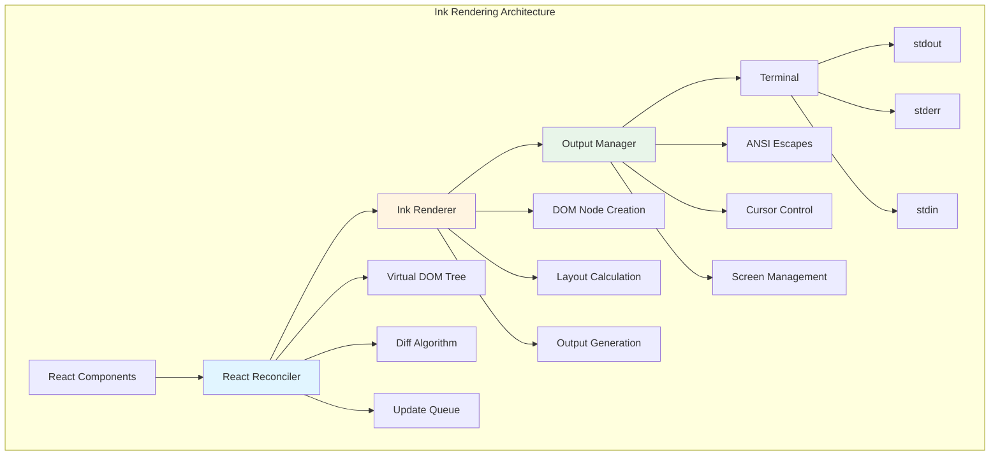

# Chapter 18: Ink Framework Deep Dive

## Overview

Ink is the React rendering framework used by Claude Code, specifically designed for CLI (Command Line Interface) environments. It adapts React's component model to terminal environments, building a declarative UI system. This chapter will deeply analyze Ink's rendering mechanism, component system, and how to implement complex CLI interfaces in Claude Code.

**Chapter Highlights:**

- **Ink Architecture**: Rendering flow, DOM tree management, output processing
- **Component System**: Hooks, Context, event handling
- **Rendering Mechanism**: Reconciliation, scheduling, diff algorithm
- **Output Processing**: Terminal control, ANSI escape sequences, layout calculation
- **Performance Optimization**: Rendering optimization, memory management, update strategy
- **Source Analysis**: Deep dive into 8000 LOC core code

## Ink Architecture Overview

### Rendering Flow



### Core Concepts

```typescript
// Ink core API
import { render, Box, Text } from 'ink'

// 1. Render root component
const App = () => (
  <Box flexDirection="column">
    <Text color="green">Hello, Ink!</Text>
  </Box>
)

// 2. Mount to terminal
const { rerender, unmount } = render(<App />)

// 3. Update component
rerender(<App />)

// 4. Unmount
unmount()
```

## Component System

### Built-in Components

#### Box Component

```typescript
// src/components/Box.tsx
export type BoxProps = {
  // Layout properties
  flexDirection?: 'row' | 'column' | 'row-reverse' | 'column-reverse'
  flexGrow?: number
  flexShrink?: number
  flexBasis?: number | string
  flex?: number

  // Alignment properties
  justifyContent?: 'flex-start' | 'flex-end' | 'center' | 'space-between' | 'space-around'
  alignItems?: 'flex-start' | 'flex-end' | 'center' | 'stretch'
  alignSelf?: 'flex-start' | 'flex-end' | 'center' | 'stretch'

  // Spacing properties
  padding?: number | string
  margin?: number | string
  gap?: number

  // Size properties
  width?: number | string
  height?: number | string
  minWidth?: number | string
  minHeight?: number | string
  maxWidth?: number | string
  maxHeight?: number | string

  // Style properties
  borderStyle?: 'single' | 'double' | 'round' | 'bold' | 'normal'
  borderColor?: 'red' | 'green' | 'blue' | 'yellow' | 'cyan' | 'magenta' | 'white' | 'black'
  backgroundColor?: 'red' | 'green' | 'blue' | 'yellow' | 'cyan' | 'magenta' | 'white' | 'black'
  dimBorder?: boolean
  hidden?: boolean

  // Text properties
  textWrap?: 'wrap' | 'end' | 'middle' | 'truncate'
  overflow?: 'wrap' | 'end' | 'middle' | 'truncate'

  // Other
  children?: React.ReactNode
}

// Box component implementation
export const Box: React.FC<BoxProps> = ({
  children,
  flexGrow = 0,
  flexShrink = 1,
  flexBasis = 'auto',
  flexDirection = 'row',
  justifyContent = 'flex-start',
  alignItems = 'flex-start',
  padding = 0,
  margin = 0,
  gap = 0,
  width,
  height,
  minWidth,
  minHeight,
  maxWidth,
  maxHeight,
  borderStyle,
  borderColor,
  backgroundColor,
  dimBorder = false,
  hidden = false,
  textWrap = 'wrap',
  overflow = 'wrap',
  ...props
}) => {
  // Calculate actual flex value
  const flex = flexGrow !== undefined ? `${flexGrow} ${flexShrink} ${flexBasis}` : undefined

  // Apply styles
  const style: React.CSSProperties = {
    display: 'flex',
    flexDirection,
    justifyContent,
    alignItems,
    flex,
    padding: typeof padding === 'number' ? padding : undefined,
    margin: typeof margin === 'number' ? margin : undefined,
    gap,
    width,
    height,
    minWidth,
    minHeight,
    maxWidth,
    maxHeight,
    borderStyle,
    borderColor,
    backgroundColor,
    opacity: dimBorder ? 0.5 : undefined,
    display: hidden ? 'none' : 'flex',
    textWrap,
    overflow,
    ...props,
  }

  return <div style={style}>{children}</div>
}
```

#### Text Component

```typescript
// src/components/Text.tsx
export type TextProps = {
  color?: 'red' | 'green' | 'blue' | 'yellow' | 'cyan' | 'magenta' | 'white' | 'black' | 'gray'
  backgroundColor?: 'red' | 'green' | 'blue' | 'yellow' | 'cyan' | 'magenta' | 'white' | 'black' | 'gray'
  bold?: boolean
  italic?: boolean
  underline?: boolean
  strikethrough?: boolean
  dim?: boolean
  children?: React.ReactNode
}

// Text component implementation
export const Text: React.FC<TextProps> = ({
  children,
  color,
  backgroundColor,
  bold = false,
  italic = false,
  underline = false,
  strikethrough = false,
  dim = false,
}) => {
  // Build ANSI styles
  const styles: string[] = []

  // Foreground color
  if (color) {
    const colorCode = getColorCode(color)
    styles.push(`\x1b[${colorCode}m`)
  }

  // Background color
  if (backgroundColor) {
    const bgColorCode = getBackgroundColorCode(backgroundColor)
    styles.push(`\x1b[${bgColorCode}m`)
  }

  // Text styles
  if (bold) styles.push('\x1b[1m')
  if (italic) styles.push('\x1b[3m')
  if (underline) styles.push('\x1b[4m')
  if (strikethrough) styles.push('\x1b[9m')
  if (dim) styles.push('\x1b[2m')

  // Reset styles
  const reset = '\x1b[0m'

  return (
    <span style={{ color, backgroundColor, fontWeight: bold ? 'bold' : undefined, fontStyle: italic ? 'italic' : undefined, textDecoration: underline ? 'underline' : undefined }}>
      {children}
    </span>
  )
}

// Color code mapping
function getColorCode(color: string): string {
  const codes: Record<string, string> = {
    black: '30',
    red: '31',
    green: '32',
    yellow: '33',
    blue: '34',
    magenta: '35',
    cyan: '36',
    white: '37',
    gray: '90',
  }

  return codes[color] || '37'
}

function getBackgroundColorCode(color: string): string {
  const codes: Record<string, string> = {
    black: '40',
    red: '41',
    green: '42',
    yellow: '43',
    blue: '44',
    magenta: '45',
    cyan: '46',
    white: '47',
    gray: '100',
  }

  return codes[color] || '47'
}
```

### Hooks System

#### useState Hook

```typescript
// src/hooks/useState.ts
export function useState<T>(
  initialValue: T | (() => T)
): [T, (value: T | ((prev: T) => T)) => void] {
  // Calculate initial value
  const [state, setState] = React.useState(() =>
    typeof initialValue === 'function'
      ? (initialValue as () => T)()
      : initialValue
  )

  return [
    state,
    (value) => {
      setState(prev => (typeof value === 'function' ? (value as (prev: T) => T)(prev) : value))
    },
  ]
}
```

#### useEffect Hook

```typescript
// src/hooks/useEffect.ts
export function useEffect(
  effect: () => void | (() => void),
  deps?: React.DependencyList
): void {
  React.useEffect(effect, deps)
}
```

#### useApp Hook

```typescript
// src/hooks/useApp.ts
export interface AppContext {
  exit: (error?: Error) => void
  readonly stdin: NodeJS.ReadStream
  readonly stdout: NodeJS.WriteStream
  readonly stderr: NodeJS.WriteStream
}

export function useApp(): AppContext {
  const context = React.useContext(AppContext)

  if (!context) {
    throw new Error('useApp must be used within <App> component')
  }

  return context
}
```

#### useInput Hook

```typescript
// src/hooks/useInput.ts
export type InputHandler = (input: string, key: Key) => void

export interface Key {
  name?: string
  sequence: string
  ctrl: boolean
  meta: boolean
  shift: boolean
  option: boolean
}

export function useInput(
  inputHandler: InputHandler,
  options?: {
    active?: boolean
  }
): void {
  const { stdin, setRawMode } = useApp()

  useEffect(() => {
    if (options?.active === false) {
      return
    }

    setRawMode(true)

    const handleData = (data: Buffer) => {
      const input = data.toString('utf8')
      const key = parseKey(input)

      inputHandler(input, key)
    }

    stdin.on('data', handleData)

    return () => {
      stdin.removeListener('data', handleData)
      setRawMode(false)
    }
  }, [inputHandler, options?.active, stdin, setRawMode])
}

function parseKey(input: string): Key {
  const key: Key = {
    sequence: input,
    ctrl: false,
    meta: false,
    shift: false,
    option: false,
  }

  // Parse control keys
  if (input.includes('\x1b')) {
    key.meta = true
  }

  if (input.charCodeAt(0) < 32) {
    key.ctrl = true
  }

  // Parse special keys
  const keyMap: Record<string, string> = {
    '\r': 'return',
    '\n': 'return',
    '\t': 'tab',
    '\x1b': 'escape',
    ' ': 'space',
  }

  key.name = keyMap[input] || undefined

  return key
}
```

#### useStdoutDimensions Hook

```typescript
// src/hooks/useStdoutDimensions.ts
export function useStdoutDimensions(): [number, number] {
  const { stdout } = useApp()
  const [dimensions, setDimensions] = React.useState(() => ({
    columns: stdout.columns,
    rows: stdout.rows,
  }))

  useEffect(() => {
    const handleResize = () => {
      setDimensions({
        columns: stdout.columns,
        rows: stdout.rows,
      })
    }

    stdout.on('resize', handleResize)

    return () => {
      stdout.removeListener('resize', handleResize)
    }
  }, [stdout])

  return [dimensions.columns, dimensions.rows]
}
```

## Rendering Mechanism

### Reconciliation Process

```typescript
// src/renderer/reconciler.ts
export function reconcile(
  element: React.ReactElement,
  container: DOMNode,
  callback?: () => void
): void {
  // 1. Create Fiber tree
  const fiber = createFiberFromElement(element)

  // 2. Schedule update
  scheduleUpdate(fiber)

  // 3. Execute work loop
  workLoop()

  // 4. Commit update
  commitRoot()

  // 5. Call callback
  callback?.()
}

function createFiberFromElement(element: React.ReactElement): FiberNode {
  return {
    type: element.type,
    key: element.key,
    props: element.props,
    stateNode: null,
    child: null,
    sibling: null,
    return: null,
    alternate: null,
    effectTag: 'PLACEMENT',
  }
}

function workLoop(): void {
  while (workInProgress !== null) {
    performUnitOfWork(workInProgress)
  }
}

function performUnitOfWork(unitOfWork: FiberNode): void {
  // 1. Begin phase
  const next = beginWork(unitOfWork)

  if (next === null) {
    // 2. Complete phase
    completeWork(unitOfWork)
  } else {
    workInProgress = next
  }
}
```

### Diff Algorithm

```typescript
// src/renderer/diff.ts
export function reconcileChildren(
  current: FiberNode | null,
  workInProgress: FiberNode,
  nextChildren: React.ReactNode
): void {
  // 1. If initial render
  if (current === null) {
    workInProgress.child = mountChildFibers(workInProgress, null, nextChildren)
    return
  }

  // 2. If has previous children
  workInProgress.child = reconcileChildFibers(
    workInProgress,
    current.child,
    nextChildren
  )
}

function reconcileChildFibers(
  returnFiber: FiberNode,
  currentFirstChild: FiberNode | null,
  newChild: React.ReactNode
): FiberNode | null {
  // 1. Handle single child
  if (typeof newChild === 'object' && newChild !== null && !Array.isArray(newChild)) {
    const element = newChild as React.ReactElement

    // Compare keys
    if (element.key === currentFirstChild?.key) {
      // Same key, update
      const existing = useFiber(currentFirstChild, element.props)
      return existing
    } else {
      // Different key, replace
      const created = createFiberFromElement(element)
      created.return = returnFiber
      return created
    }
  }

  // 2. Handle multiple children
  return reconcileChildrenArray(returnFiber, currentFirstChild, newChild as React.ReactNode[])
}

function reconcileChildrenArray(
  returnFiber: FiberNode,
  currentFirstChild: FiberNode | null,
  newChildren: React.ReactNode[]
): FiberNode | null {
  // 1. Build key index
  const existingChildren = mapRemainingChildren(returnFiber, currentFirstChild)

  // 2. Iterate through new children
  let resultingFirstChild: FiberNode | null = null
  let previousNewFiber: FiberNode | null = null
  let oldFiber: FiberNode | null = currentFirstChild
  let lastPlacedIndex = 0
  let newIdx = 0
  let nextOldFiber: FiberNode | null = null

  for (; oldFiber !== null && newIdx < newChildren.length; newIdx++) {
    const newChild = newChildren[newIdx] as React.ReactElement

    if (newChild.key !== oldFiber?.key) {
      nextOldFiber = oldFiber
      break
    }

    const newFiber = updateSlot(returnFiber, oldFiber, newChild)

    if (newFiber === null) {
      // Delete
      deleteChild(returnFiber, oldFiber)
      oldFiber = oldFiber.sibling
      continue
    }

    if (shouldTrackSideEffects) {
      newFiber.flags |= Placement
    }

    lastPlacedIndex = placeChild(newFiber, lastPlacedIndex, newIdx)

    if (previousNewFiber === null) {
      resultingFirstChild = newFiber
    } else {
      previousNewFiber.sibling = newFiber
    }

    previousNewFiber = newFiber
    oldFiber = oldFiber.sibling
  }

  // 3. Handle remaining new children
  if (newIdx < newChildren.length) {
    const newChildren2 = newChildren.slice(newIdx)
    for (; newIdx < newChildren.length; newIdx++) {
      const newFiber = createFiberFromElement(newChildren2[newIdx] as React.ReactElement)
      newFiber.return = returnFiber

      if (previousNewFiber === null) {
        resultingFirstChild = newFiber
      } else {
        previousNewFiber.sibling = newFiber
      }

      previousNewFiber = newFiber
    }
  }

  // 4. Delete remaining old children
  if (oldFiber !== null) {
    deleteRemainingChildren(returnFiber, oldFiber)
  }

  return resultingFirstChild
}
```

## Output Processing

### ANSI Escape Sequences

```typescript
// src/output/ansi.ts
export type ANSIStyle = {
  foreground?: string
  background?: string
  bold?: boolean
  dim?: boolean
  italic?: boolean
  underline?: boolean
  strikethrough?: boolean
}

export function applyANSIStyles(text: string, styles: ANSIStyle): string {
  let output = text
  const codes: string[] = []

  // Apply styles
  if (styles.foreground) {
    codes.push(getForegroundCode(styles.foreground))
  }

  if (styles.background) {
    codes.push(getBackgroundCode(styles.background))
  }

  if (styles.bold) codes.push('1')
  if (styles.dim) codes.push('2')
  if (styles.italic) codes.push('3')
  if (styles.underline) codes.push('4')
  if (styles.strikethrough) codes.push('9')

  // Apply escape sequences
  if (codes.length > 0) {
    output = `\x1b[${codes.join(';')}m${output}\x1b[0m`
  }

  return output
}

function getForegroundCode(color: string): string {
  const codes: Record<string, string> = {
    black: '30',
    red: '31',
    green: '32',
    yellow: '33',
    blue: '34',
    magenta: '35',
    cyan: '36',
    white: '37',
  }

  return codes[color] || '37'
}

function getBackgroundCode(color: string): string {
  const codes: Record<string, string> = {
    black: '40',
    red: '41',
    green: '42',
    yellow: '43',
    blue: '44',
    magenta: '45',
    cyan: '46',
    white: '47',
  }

  return codes[color] || '47'
}
```

### Cursor Control

```typescript
// src/output/cursor.ts
export type CursorPosition = {
  x: number
  y: number
}

export function moveCursorTo(position: CursorPosition): string {
  return `\x1b[${position.y + 1};${position.x + 1}H`
}

export function moveCursorUp(rows: number): string {
  return `\x1b[${rows}A`
}

export function moveCursorDown(rows: number): string {
  return `\x1b[${rows}B`
}

export function moveCursorLeft(columns: number): string {
  return `\x1b[${columns}D`
}

export function moveCursorRight(columns: number): string {
  return `\x1b[${columns}C`
}

export function hideCursor(): string {
  return '\x1b[?25l'
}

export function showCursor(): string {
  return '\x1b[?25h'
}

export function saveCursor(): string {
  return '\x1b[s'
}

export function restoreCursor(): string {
  return '\x1b[u'
}
```

### Screen Management

```typescript
// src/output/screen.ts
export function clearScreen(): string {
  return '\x1b[2J'
}

export function clearLine(): string {
  return '\x1b[2K'
}

export function clearLineDown(): string {
  return '\x1b[0J'
}

export function clearLineUp(): string {
  return '\x1b[1J'
}

export function eraseLines(count: number): string {
  let output = clearLine()

  for (let i = 1; i < count; i++) {
    output += moveCursorUp(1) + clearLine()
  }

  return output
}
```

### Layout Calculation

```typescript
// src/layout/layout.ts
export type LayoutNode = {
  type: string
  props: Record<string, unknown>
  children: LayoutNode[]
  dimensions: {
    x: number
    y: number
    width: number
    height: number
  }
}

export function calculateLayout(
  node: LayoutNode,
  parentDimensions: { width: number; height: number }
): void {
  const { flexDirection, justifyContent, alignItems, padding, gap } = node.props

  // 1. Calculate own dimensions
  const ownWidth = calculateWidth(node, parentDimensions.width)
  const ownHeight = calculateHeight(node, parentDimensions.height)

  // 2. Calculate child layout
  const children = node.children
  const availableWidth = ownWidth - (padding || 0) * 2
  const availableHeight = ownHeight - (padding || 0) * 2

  let currentX = padding || 0
  let currentY = padding || 0

  for (const child of children) {
    calculateLayout(child, { width: availableWidth, height: availableHeight })

    // Position child
    if (flexDirection === 'row') {
      child.dimensions.x = currentX
      child.dimensions.y = currentY
      currentX += child.dimensions.width + (gap || 0)
    } else if (flexDirection === 'column') {
      child.dimensions.x = currentX
      child.dimensions.y = currentY
      currentY += child.dimensions.height + (gap || 0)
    }

    // Apply alignment
    applyAlignment(child, justifyContent, alignItems, availableWidth, availableHeight)
  }

  // 3. Update node dimensions
  node.dimensions = {
    x: 0,
    y: 0,
    width: ownWidth,
    height: ownHeight,
  }
}

function calculateWidth(node: LayoutNode, availableWidth: number): number {
  const { width, minWidth, maxWidth, flexGrow, flexShrink, flexBasis } = node.props

  if (typeof width === 'number') {
    return Math.min(Math.max(width, minWidth || 0), maxWidth || availableWidth)
  }

  if (typeof width === 'string') {
    if (width.endsWith('%')) {
      const percentage = parseFloat(width) / 100
      return availableWidth * percentage
    }
  }

  // flex layout
  const basis = typeof flexBasis === 'number' ? flexBasis : availableWidth
  return Math.min(Math.max(basis, minWidth || 0), maxWidth || availableWidth)
}

function calculateHeight(node: LayoutNode, availableHeight: number): number {
  const { height, minHeight, maxHeight, flexGrow, flexShrink, flexBasis } = node.props

  if (typeof height === 'number') {
    return Math.min(Math.max(height, minHeight || 0), maxHeight || availableHeight)
  }

  if (typeof height === 'string') {
    if (height.endsWith('%')) {
      const percentage = parseFloat(height) / 100
      return availableHeight * percentage
    }
  }

  // flex layout
  const basis = typeof flexBasis === 'number' ? flexBasis : availableHeight
  return Math.min(Math.max(basis, minHeight || 0), maxHeight || availableHeight)
}

function applyAlignment(
  node: LayoutNode,
  justifyContent: string,
  alignItems: string,
  availableWidth: number,
  availableHeight: number
): void {
  const { dimensions } = node

  // Main axis alignment
  switch (justifyContent) {
    case 'center':
      dimensions.x = (availableWidth - dimensions.width) / 2
      break
    case 'flex-end':
      dimensions.x = availableWidth - dimensions.width
      break
    case 'space-between':
      // Need multiple children
      break
    case 'space-around':
      // Need multiple children
      break
  }

  // Cross axis alignment
  switch (alignItems) {
    case 'center':
      dimensions.y = (availableHeight - dimensions.height) / 2
      break
    case 'flex-end':
      dimensions.y = availableHeight - dimensions.height
      break
    case 'stretch':
      dimensions.height = availableHeight
      break
  }
}
```

## Performance Optimization

### Rendering Optimization

```typescript
// src/optimization/renderBatch.ts
export class RenderBatch {
  private pendingUpdates: Set<React.ReactNode> = new Set()
  private rafId: number | null = null

  schedule(update: React.ReactNode): void {
    this.pendingUpdates.add(update)

    if (this.rafId === null) {
      this.rafId = requestAnimationFrame(() => {
        this.flush()
      })
    }
  }

  private flush(): void {
    const updates = Array.from(this.pendingUpdates)
    this.pendingUpdates.clear()
    this.rafId = null

    // Batch render
    for (const update of updates) {
      render(update)
    }
  }
}
```

### Virtual Scrolling

```typescript
// src/optimization/virtualList.ts
export function VirtualList<T>({
  items,
  itemHeight,
  height,
  renderItem,
}: {
  items: T[]
  itemHeight: number
  height: number
  renderItem: (item: T, index: number) => React.ReactNode
}): React.ReactElement {
  const [scrollTop, setScrollTop] = React.useState(0)

  // Calculate visible range
  const visibleCount = Math.ceil(height / itemHeight)
  const startIndex = Math.floor(scrollTop / itemHeight)
  const endIndex = Math.min(startIndex + visibleCount, items.length - 1)

  // Render visible items
  const visibleItems = items.slice(startIndex, endIndex + 1)

  return (
    <Box height={height} overflowY="scroll" onScroll={(e) => setScrollTop(e.scrollTop)}>
      <Box height={items.length * itemHeight} position="relative">
        {visibleItems.map((item, index) => (
          <Box
            key={startIndex + index}
            position="absolute"
            top={(startIndex + index) * itemHeight}
            left={0}
            right={0}
            height={itemHeight}
          >
            {renderItem(item, startIndex + index)}
          </Box>
        ))}
      </Box>
    </Box>
  )
}
```

### Memory Management

```typescript
// src/optimization/memory.ts
export function cleanupUnusedNodes(): void {
  // Clean up unused nodes
  const nodes = getAllNodes()

  for (const node of nodes) {
    if (!isNodeUsed(node)) {
      destroyNode(node)
    }
  }
}

export function limitNodeCache(maxSize: number): void {
  const cache = getNodeCache()

  if (cache.size > maxSize) {
    const entries = Array.from(cache.entries())
    const toRemove = entries.slice(0, cache.size - maxSize)

    for (const [key] of toRemove) {
      cache.delete(key)
    }
  }
}
```

## Real-World Cases

### Case 1: Building Interactive Menu

```typescript
// examples/interactive-menu.tsx
import { render, Box, Text, useInput, useApp } from 'ink'

interface MenuItem {
  label: string
  action: () => void
}

const Menu = ({ items }: { items: MenuItem[] }) => {
  const [selectedIndex, setSelectedIndex] = React.useState(0)

  useInput((input, key) => {
    if (key.upArrow) {
      setSelectedIndex(Math.max(0, selectedIndex - 1))
    } else if (key.downArrow) {
      setSelectedIndex(Math.min(items.length - 1, selectedIndex + 1))
    } else if (key.return) {
      items[selectedIndex].action()
    }
  })

  return (
    <Box flexDirection="column" padding={1}>
      <Text bold color="cyan">
        Select an option:
      </Text>
      {items.map((item, index) => (
        <Box key={index}>
          <Text color={index === selectedIndex ? 'green' : 'white'}>
            {index === selectedIndex ? '> ' : '  '}
            {item.label}
          </Text>
        </Box>
      ))}
      <Text dimColor color="gray">
        Use arrow keys to navigate, Enter to select
      </Text>
    </Box>
  )
}

const App = () => {
  const { exit } = useApp()

  const menuItems: MenuItem[] = [
    { label: 'Option 1', action: () => console.log('Selected Option 1') },
    { label: 'Option 2', action: () => console.log('Selected Option 2') },
    { label: 'Option 3', action: () => console.log('Selected Option 3') },
    { label: 'Exit', action: () => exit() },
  ]

  return <Menu items={menuItems} />
}

render(<App />)
```

### Case 2: Progress Bar Component

```typescript
// examples/progress-bar.tsx
import { render, Box, Text, useEffect, useState } from 'ink'

interface ProgressBarProps {
  percent: number
  width?: number
  character?: string
}

const ProgressBar: React.FC<ProgressBarProps> = ({
  percent,
  width = 40,
  character = '█',
}) => {
  const filled = Math.round((percent / 100) * width)
  const empty = width - filled

  return (
    <Box>
      <Text color="cyan">
        {'['}
        <Text color="green">{character.repeat(filled)}</Text>
        {' '.repeat(empty)}
        {']'} {percent}%
      </Text>
    </Box>
  )
}

const App = () => {
  const [progress, setProgress] = useState(0)

  useEffect(() => {
    const interval = setInterval(() => {
      setProgress((prev) => Math.min(100, prev + 1))
    }, 100)

    return () => clearInterval(interval)
  }, [])

  return (
    <Box flexDirection="column" padding={1}>
      <Text>Downloading file...</Text>
      <ProgressBar percent={progress} />
    </Box>
  )
}

render(<App />)
```

## Best Practices

### 1. Component Design

- **Single Responsibility**: Each component handles one function
- **Props Interface**: Clearly define Props types
- **Reusability**: Design general, configurable components

### 2. Performance Optimization

- **Avoid Unnecessary Renders**: Use React.memo, useMemo
- **Batch Updates**: Use RenderBatch for batch processing
- **Virtualize Long Lists**: Use VirtualList component

### 3. Error Handling

- **Error Boundaries**: Catch component errors with ErrorBoundary
- **Graceful Degradation**: Provide fallback UI
- **Error Logging**: Record error information

## Summary

Core features of Ink framework:

1. **Declarative UI**: React-based component model
2. **Powerful Layout**: Flexbox layout system
3. **Rich Components**: Built-in components like Box, Text
4. **Custom Hooks**: Utility hooks like useInput, useApp
5. **Efficient Rendering**: Optimized reconciliation and diff algorithms
6. **Terminal Control**: ANSI escape sequences, cursor control, screen management

Mastering the Ink framework enables building complex, beautiful, high-performance CLI application interfaces.
