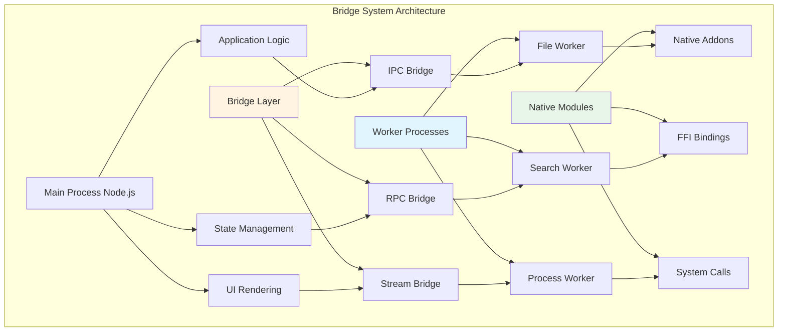

# Chapter 19: Bridge System

## Overview

The Bridge System is a core component in Claude Code responsible for cross-language communication. Since Claude Code's main process runs in a Node.js environment, and some features (like complex file operations, system calls) may need to call native modules or external processes, the Bridge System provides an efficient bridging mechanism. This chapter will deeply analyze the bridge system's architecture design, serialization protocol, communication mechanism, and performance optimization.

**Chapter Highlights:**

- **Bridge Architecture**: Inter-process communication, cross-language calls, protocol design
- **Serialization Protocol**: Data format, type mapping, secure transmission
- **Communication Mechanism**: Message passing, event-driven, error handling
- **Performance Optimization**: Connection pool, batch processing, cache strategy
- **Source Analysis**: Deep dive into core modules
- **Real-World Cases**: Common bridging scenarios

## Bridge Architecture

### Architecture Overview



### Core Components

```typescript
// src/bridge/types.ts
export type BridgeMessageType =
  | 'request'      // Request message
  | 'response'     // Response message
  | 'event'        // Event message
  | 'error'        // Error message
  | 'stream'       // Stream message

export type BridgeMessage<T = unknown> = {
  id: string              // Message ID
  type: BridgeMessageType // Message type
  method?: string         // Method name (request/response)
  event?: string          // Event name (event)
  payload?: T             // Message payload
  error?: BridgeError     // Error information
  metadata?: Record<string, unknown> // Metadata
}

export type BridgeError = {
  code: string            // Error code
  message: string         // Error message
  stack?: string          // Stack trace
  details?: Record<string, unknown>
}

export type BridgeOptions = {
  timeout?: number        // Timeout (ms)
  retries?: number        // Retry count
  serializer?: Serializer // Serializer
  deserializer?: Deserializer // Deserializer
}
```

## Serialization Protocol

### Data Format

```typescript
// src/bridge/serialization.ts
export interface Serializer {
  serialize<T>(value: T): Buffer
  deserialize<T>(buffer: Buffer): T
}

// JSON serializer
export class JSONSerializer implements Serializer {
  serialize<T>(value: T): Buffer {
    return Buffer.from(JSON.stringify(value), 'utf-8')
  }

  deserialize<T>(buffer: Buffer): T {
    return JSON.parse(buffer.toString('utf-8')) as T
  }
}

// MessagePack serializer (more efficient)
export class MessagePackSerializer implements Serializer {
  serialize<T>(value: T): Buffer {
    return MessagePack.encode(value)
  }

  deserialize<T>(buffer: Buffer): T {
    return MessagePack.decode(buffer) as T
  }
}
```

### Type Mapping

```typescript
// src/bridge/types.ts
export type BridgeTypeMapping = {
  // Basic types
  string: string
  number: number
  boolean: boolean
  null: null
  undefined: void

  // Complex types
  array: Array<unknown>
  object: Record<string, unknown>

  // Special types
  buffer: Buffer
  date: Date
  error: Error
  regexp: RegExp

  // Stream types
  readable: NodeJS.ReadableStream
  writable: NodeJS.WritableStream
}

// Type converter
export class TypeConverter {
  static toBridge<T>(value: T): unknown {
    if (value === null || value === undefined) {
      return value
    }

    if (Buffer.isBuffer(value)) {
      return { type: 'buffer', data: value.toString('base64') }
    }

    if (value instanceof Date) {
      return { type: 'date', value: value.toISOString() }
    }

    if (value instanceof Error) {
      return {
        type: 'error',
        name: value.name,
        message: value.message,
        stack: value.stack,
      }
    }

    if (value instanceof RegExp) {
      return { type: 'regexp', source: value.source, flags: value.flags }
    }

    if (Array.isArray(value)) {
      return value.map(v => this.toBridge(v))
    }

    if (typeof value === 'object') {
      const result: Record<string, unknown> = {}
      for (const [key, val] of Object.entries(value)) {
        result[key] = this.toBridge(val)
      }
      return result
    }

    return value
  }

  static fromBridge<T>(value: unknown): T {
    if (value === null || value === undefined) {
      return value as T
    }

    if (typeof value === 'object' && value !== null) {
      const obj = value as Record<string, unknown>

      if (obj.type === 'buffer' && typeof obj.data === 'string') {
        return Buffer.from(obj.data, 'base64') as T
      }

      if (obj.type === 'date' && typeof obj.value === 'string') {
        return new Date(obj.value) as T
      }

      if (obj.type === 'error') {
        const error = new Error(obj.message as string)
        error.name = obj.name as string
        error.stack = obj.stack as string
        return error as T
      }

      if (obj.type === 'regexp') {
        return new RegExp(obj.source as string, obj.flags as string) as T
      }

      // Handle nested objects
      const result: Record<string, unknown> = {}
      for (const [key, val] of Object.entries(obj)) {
        result[key] = this.fromBridge(val)
      }
      return result as T
    }

    if (Array.isArray(value)) {
      return value.map(v => this.fromBridge(v)) as T
    }

    return value as T
  }
}
```

## Communication Mechanism

### IPC Bridge

```typescript
// src/bridge/ipc.ts
export class IPCBridge {
  private worker: Worker | ChildProcess
  private messageHandlers = new Map<string, MessageHandler>()
  private pendingRequests = new Map<string, PendingRequest>()
  private messageId = 0

  constructor(worker: Worker | ChildProcess) {
    this.worker = worker
    this.setupMessageHandler()
  }

  private setupMessageHandler(): void {
    this.worker.on('message', (message: BridgeMessage) => {
      this.handleMessage(message)
    })

    this.worker.on('error', (error) => {
      this.handleError(error)
    })

    this.worker.on('exit', (code) => {
      this.handleExit(code)
    })
  }

  private handleMessage(message: BridgeMessage): void {
    switch (message.type) {
      case 'request':
        this.handleRequest(message)
        break

      case 'response':
        this.handleResponse(message)
        break

      case 'event':
        this.handleEvent(message)
        break

      case 'error':
        this.handleError(message)
        break
    }
  }

  async request<T>(
    method: string,
    payload?: unknown,
    options?: BridgeOptions
  ): Promise<T> {
    const id = this.generateMessageId()

    const message: BridgeMessage = {
      id,
      type: 'request',
      method,
      payload,
    }

    return new Promise((resolve, reject) => {
      const timeout = options?.timeout || 30000

      const timer = setTimeout(() => {
        this.pendingRequests.delete(id)
        reject(new Error(`Request timeout: ${method}`))
      }, timeout)

      this.pendingRequests.set(id, {
        resolve,
        reject,
        timer,
      })

      this.worker.send(message)
    })
  }

  private handleRequest(message: BridgeMessage): void {
    const handler = this.messageHandlers.get(message.method || '')

    if (!handler) {
      this.sendError(message.id, {
        code: 'METHOD_NOT_FOUND',
        message: `Method not found: ${message.method}`,
      })
      return
    }

    handler(message.payload || {})
      .then(result => {
        this.sendResponse(message.id, result)
      })
      .catch(error => {
        this.sendError(message.id, {
          code: 'EXECUTION_ERROR',
          message: error.message,
          stack: error.stack,
        })
      })
  }

  private handleResponse(message: BridgeMessage): void {
    const pending = this.pendingRequests.get(message.id)

    if (!pending) {
      return
    }

    clearTimeout(pending.timer)
    this.pendingRequests.delete(message.id)

    if (message.error) {
      pending.reject(new BridgeError(message.error))
    } else {
      pending.resolve(message.payload)
    }
  }

  private handleEvent(message: BridgeMessage): void {
    const listeners = this.eventListeners.get(message.event || '')
    listeners?.forEach(listener => {
      listener(message.payload)
    })
  }

  private sendResponse(id: string, payload: unknown): void {
    const message: BridgeMessage = {
      id,
      type: 'response',
      payload,
    }

    this.worker.send(message)
  }

  private sendError(id: string, error: BridgeError): void {
    const message: BridgeMessage = {
      id,
      type: 'error',
      error,
    }

    this.worker.send(message)
  }

  registerMethod(name: string, handler: MessageHandler): void {
    this.messageHandlers.set(name, handler)
  }

  private generateMessageId(): string {
    return `${Date.now()}-${this.messageId++}`
  }
}

type MessageHandler = (payload: unknown) => Promise<unknown>

type PendingRequest = {
  resolve: (value: unknown) => void
  reject: (error: Error) => void
  timer: NodeJS.Timeout
}
```

### RPC Bridge

```typescript
// src/bridge/rpc.ts
export class RPCBridge extends IPCBridge {
  private services = new Map<string, RemoteService>()

  registerService(name: string, service: RemoteService): void {
    this.services.set(name, service)

    // Register all methods
    for (const method of Object.keys(service)) {
      if (typeof service[method] === 'function') {
        this.registerMethod(`${name}.${method}`, async (payload) => {
          return service[method](payload)
        })
      }
    }
  }

  async call<T>(
    service: string,
    method: string,
    params?: unknown,
    options?: BridgeOptions
  ): Promise<T> {
    return this.request<T>(`${service}.${method}`, params, options)
  }

  getServiceProxy<T>(name: string): T {
    const proxy = new Proxy({}, {
      get: (_target, prop) => {
        return async (...args: unknown[]) => {
          return this.call(name, String(prop), args)
        }
      },
    })

    return proxy as T
  }
}

type RemoteService = Record<string, (...args: unknown[]) => unknown>
```

### Stream Bridge

```typescript
// src/bridge/stream.ts
export class StreamBridge extends IPCBridge {
  private streams = new Map<string, Duplex>()

  createStream(id: string): Duplex {
    const stream = new Duplex({
      write: (chunk, encoding, callback) => {
        this.sendMessage({
          id: `${id}-write`,
          type: 'stream',
          payload: { chunk: chunk.toString('base64'), encoding },
        })
        callback()
      },
      read: () => {
        // Data arrives through message events
      },
    })

    this.streams.set(id, stream)
    return stream
  }

  handleStreamData(message: BridgeMessage): void {
    const streamId = message.id.split('-')[0]
    const stream = this.streams.get(streamId)

    if (stream && message.payload) {
      const { chunk, encoding } = message.payload as {
        chunk: string
        encoding: BufferEncoding
      }
      stream.push(Buffer.from(chunk, 'base64'), encoding)
    }
  }

  endStream(id: string): void {
    const stream = this.streams.get(id)
    if (stream) {
      stream.end()
      this.streams.delete(id)
    }

    this.sendMessage({
      id: `${id}-end`,
      type: 'stream',
    })
  }
}
```

## Performance Optimization

### Connection Pool

```typescript
// src/bridge/pool.ts
export class WorkerPool {
  private workers: Worker[] = []
  private availableWorkers: Worker[] = []
  private taskQueue: Array<{
    task: () => Promise<unknown>
    resolve: (value: unknown) => void
    reject: (error: Error) => void
  }> = []

  constructor(
    private workerScript: string,
    private poolSize: number = 4
  ) {
    this.initializePool()
  }

  private initializePool(): void {
    for (let i = 0; i < this.poolSize; i++) {
      const worker = new Worker(this.workerScript)
      this.workers.push(worker)
      this.availableWorkers.push(worker)

      worker.on('message', (result) => {
        this.handleWorkerMessage(worker, result)
      })

      worker.on('error', (error) => {
        this.handleWorkerError(worker, error)
      })
    }
  }

  async execute<T>(task: () => Promise<T>): Promise<T> {
    return new Promise((resolve, reject) => {
      this.taskQueue.push({
        task,
        resolve: resolve as (value: unknown) => void,
        reject,
      })

      this.processNextTask()
    })
  }

  private processNextTask(): void {
    if (this.availableWorkers.length === 0 || this.taskQueue.length === 0) {
      return
    }

    const worker = this.availableWorkers.shift()!
    const taskItem = this.taskQueue.shift()!

    worker.once('message', (result) => {
      taskItem.resolve(result)
      this.availableWorkers.push(worker)
      this.processNextTask()
    })

    worker.once('error', (error) => {
      taskItem.reject(error)
      this.availableWorkers.push(worker)
      this.processNextTask()
    })

    taskItem.task()
  }

  private handleWorkerMessage(worker: Worker, result: unknown): void {
    // Message handled in execute
  }

  private handleWorkerError(worker: Worker, error: Error): void {
    // Error handled in execute
  }

  terminate(): void {
    for (const worker of this.workers) {
      worker.terminate()
    }

    this.workers = []
    this.availableWorkers = []
  }
}
```

### Batch Processing

```typescript
// src/bridge/batch.ts
export class BatchProcessor {
  private batch: Array<{
    id: string
    method: string
    payload?: unknown
  }> = []

  private batchTimer: NodeJS.Timeout | null = null
  private readonly batchTimeout = 100 // 100ms
  private readonly maxBatchSize = 100

  constructor(private bridge: IPCBridge) {}

  async request<T>(
    method: string,
    payload?: unknown,
    options?: { priority?: 'high' | 'low' }
  ): Promise<T> {
    // High priority requests sent immediately
    if (options?.priority === 'high') {
      return this.bridge.request<T>(method, payload)
    }

    return new Promise((resolve, reject) => {
      const id = this.bridge['generateMessageId']()

      this.batch.push({ id, method, payload })
      this.bridge['pendingRequests'].set(id, { resolve, reject, timer: null as unknown as NodeJS.Timeout })

      // Send when batch size reached or timeout
      if (this.batch.length >= this.maxBatchSize) {
        this.flush()
      } else {
        this.scheduleFlush()
      }
    })
  }

  private scheduleFlush(): void {
    if (this.batchTimer) {
      return
    }

    this.batchTimer = setTimeout(() => {
      this.flush()
    }, this.batchTimeout)
  }

  private flush(): void {
    if (this.batchTimer) {
      clearTimeout(this.batchTimer)
      this.batchTimer = null
    }

    if (this.batch.length === 0) {
      return
    }

    // Send batch request
    this.bridge.worker.send({
      type: 'batch',
      requests: this.batch,
    })

    this.batch = []
  }
}
```

### Cache Strategy

```typescript
// src/bridge/cache.ts
export class BridgeCache {
  private cache = new Map<string, CacheEntry>()
  private readonly maxCacheSize = 1000
  private readonly defaultTTL = 60000 // 60 seconds

  get<T>(key: string): T | undefined {
    const entry = this.cache.get(key)

    if (!entry) {
      return undefined
    }

    // Check if expired
    if (Date.now() > entry.expiresAt) {
      this.cache.delete(key)
      return undefined
    }

    // Update access time
    entry.lastAccessedAt = Date.now()

    return entry.value as T
  }

  set<T>(key: string, value: T, ttl?: number): void {
    // Cache size limit
    if (this.cache.size >= this.maxCacheSize) {
      this.evictLRU()
    }

    this.cache.set(key, {
      value,
      createdAt: Date.now(),
      lastAccessedAt: Date.now(),
      expiresAt: Date.now() + (ttl || this.defaultTTL),
    })
  }

  private evictLRU(): void {
    // Find least recently used entry
    let lruKey: string | null = null
    let lruTime = Infinity

    for (const [key, entry] of this.cache) {
      if (entry.lastAccessedAt < lruTime) {
        lruTime = entry.lastAccessedAt
        lruKey = key
      }
    }

    if (lruKey) {
      this.cache.delete(lruKey)
    }
  }

  clear(): void {
    this.cache.clear()
  }
}

type CacheEntry = {
  value: unknown
  createdAt: number
  lastAccessedAt: number
  expiresAt: number
}
```

## Source Analysis

### Worker Process Implementation

```typescript
// src/bridge/worker.ts
export class BridgeWorker {
  private bridge: IPCBridge
  private services: Map<string, RemoteService> = new Map()

  constructor() {
    this.bridge = new IPCBridge(process as unknown as ChildProcess)
    this.setupDefaultHandlers()
  }

  private setupDefaultHandlers(): void {
    // Health check
    this.bridge.registerMethod('health', async () => {
      return {
        status: 'ok',
        uptime: process.uptime(),
        memory: process.memoryUsage(),
      }
    })

    // Metadata
    this.bridge.registerMethod('metadata', async () => {
      return {
        version: process.version,
        platform: process.platform,
        arch: process.arch,
      }
    })

    // Terminate
    this.bridge.registerMethod('terminate', async () => {
      process.exit(0)
    })
  }

  registerService(name: string, service: RemoteService): void {
    this.services.set(name, service)

    for (const method of Object.keys(service)) {
      if (typeof service[method] === 'function') {
        this.bridge.registerMethod(`${name}.${method}`, async (params) => {
          return service[method](params)
        })
      }
    }
  }

  start(): void {
    // Listen for process messages
    process.on('message', (message: BridgeMessage) => {
      this.bridge['handleMessage'](message)
    })

    // Notify ready
    this.sendMessage({
      id: 'ready',
      type: 'event',
      event: 'ready',
      payload: { pid: process.pid },
    })
  }

  private sendMessage(message: BridgeMessage): void {
    process.send?.(message)
  }
}
```

### File Operation Bridge

```typescript
// src/bridge/fileService.ts
export class FileService {
  private cache: BridgeCache = new BridgeCache()

  async readFile(path: string, options?: { encoding?: BufferEncoding; cache?: boolean }): Promise<string> {
    const cacheKey = `file:${path}`

    // Check cache
    if (options?.cache !== false) {
      const cached = this.cache.get<string>(cacheKey)
      if (cached !== undefined) {
        return cached
      }
    }

    // Read file
    const content = await fs.readFile(path, { encoding: options?.encoding || 'utf-8' })

    // Cache result
    if (options?.cache !== false) {
      this.cache.set(cacheKey, content)
    }

    return content
  }

  async writeFile(path: string, content: string): Promise<void> {
    await fs.writeFile(path, content, { encoding: 'utf-8' })

    // Clear cache
    this.cache.set(`file:${path}`, undefined)
  }

  async stat(path: string): Promise<fs.Stats> {
    return fs.stat(path)
  }

  async readdir(path: string): Promise<string[]> {
    return fs.readdir(path)
  }

  // Batch read
  async readBatch(paths: string[]): Promise<string[]> {
    return Promise.all(paths.map(path => this.readFile(path)))
  }

  // Stream read
  createReadStream(path: string): fs.ReadStream {
    return fs.createReadStream(path)
  }

  createWriteStream(path: string): fs.WriteStream {
    return fs.createWriteStream(path)
  }
}
```

## Real-World Cases

### Case 1: File Search Bridge

```typescript
// examples/fileSearchBridge.ts
// Main process
class MainProcess {
  private bridge: IPCBridge

  constructor() {
    const worker = new Worker('./fileSearchWorker.js')
    this.bridge = new IPCBridge(worker)
  }

  async searchFiles(
    pattern: string,
    directory: string
  ): Promise<string[]> {
    return this.bridge.request('search', {
      pattern,
      directory,
    })
  }
}

// Worker process
class FileSearchWorker extends BridgeWorker {
  constructor() {
    super()
    this.registerService('search', {
      search: async ({ pattern, directory }) => {
        return this.performSearch(pattern, directory)
      },
    })
  }

  private async performSearch(
    pattern: string,
    directory: string
  ): Promise<string[]> {
    const results: string[] = []

    for await (const entry of walk(directory)) {
      if (entry.isFile() && entry.name.match(pattern)) {
        results.push(entry.path)
      }
    }

    return results
  }

  start(): void {
    super.start()
  }
}

new FileSearchWorker().start()
```

### Case 2: Stream Data Processing

```typescript
// examples/streamBridge.ts
// Main process
class StreamProcessor {
  private bridge: StreamBridge

  constructor() {
    const worker = new Worker('./streamWorker.js')
    this.bridge = new StreamBridge(worker)
  }

  processStream(input: ReadableStream): Promise<ReadableStream> {
    const streamId = 'process-stream'
    const output = this.bridge.createStream(streamId)

    // Send stream data
    input.on('data', (chunk) => {
      this.bridge.sendMessage({
        id: `${streamId}-write`,
        type: 'stream',
        payload: { chunk: chunk.toString('base64') },
      })
    })

    input.on('end', () => {
      this.bridge.endStream(streamId)
    })

    return output as unknown as ReadableStream
  }
}
```

## Best Practices

### 1. Error Handling

- **Timeout Control**: Set reasonable timeouts for all requests
- **Error Propagation**: Ensure errors propagate correctly to main process
- **Retry Mechanism**: Implement automatic retry for transient errors

### 2. Performance Optimization

- **Batch Operations**: Merge small requests into batch requests
- **Cache Strategy**: Cache frequently accessed data
- **Connection Reuse**: Use connection pool to avoid frequent create/destroy

### 3. Security Considerations

- **Data Validation**: Validate all input data
- **Permission Control**: Limit worker process permissions
- **Resource Limits**: Prevent memory leaks and resource exhaustion

## Summary

Core features of Bridge System:

1. **Efficient Communication**: IPC, RPC, Stream multiple communication methods
2. **Flexible Serialization**: Support JSON, MessagePack and other formats
3. **Type Safety**: Complete type mapping and conversion
4. **Performance Optimization**: Connection pool, batch processing, cache strategy
5. **Error Handling**: Comprehensive error handling and retry mechanism
6. **Easy Extension**: Simple registration of custom services

Mastering Bridge System enables efficient cross-language communication and complex feature bridging.
