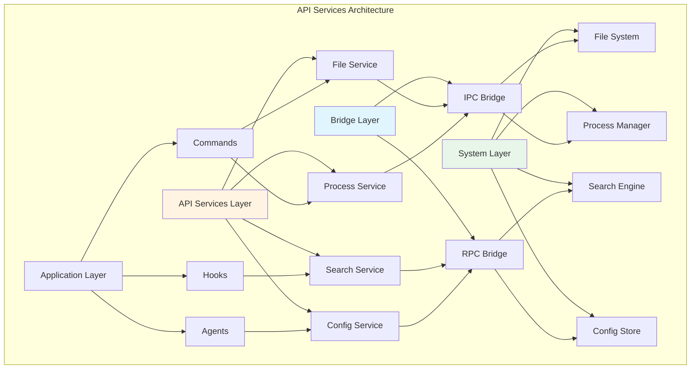

# Chapter 20: API Services Integration

## Overview

Claude Code integrates with external services through API Services, implementing features like code analysis, file operations, and process management. The API Services layer is responsible for encapsulating underlying implementations and providing unified interfaces for upper-layer calls. This chapter will deeply analyze API Services' design patterns, authentication mechanisms, error handling, and performance optimization.

**Chapter Highlights:**

- **API Architecture**: Service layering, interface design, dependency injection
- **Authentication Mechanism**: Token management, permission verification, secure transmission
- **Error Handling**: Unified error format, retry strategy, fallback schemes
- **Performance Optimization**: Connection reuse, request merging, cache strategy
- **Source Analysis**: Core API service implementation
- **Real-World Cases**: Common integration scenarios

## API Architecture

### Service Layering



### Service Interface Definition

```typescript
// src/api/types.ts
export type APIServiceConfig = {
  name: string
  version: string
  timeout?: number
  retries?: number
  baseURL?: string
  auth?: AuthConfig
}

export type AuthConfig =
  | { type: 'none' }
  | { type: 'bearer'; token: string }
  | { type: 'basic'; username: string; password: string }
  | { type: 'api-key'; key: string; header?: string }
  | { type: 'oauth2'; accessToken: string; refreshToken?: string }

export type APIRequest<T = unknown> = {
  method: 'GET' | 'POST' | 'PUT' | 'DELETE' | 'PATCH'
  path: string
  params?: Record<string, string | number>
  query?: Record<string, string | number>
  body?: T
  headers?: Record<string, string>
  timeout?: number
}

export type APIResponse<T = unknown> = {
  status: number
  statusText: string
  headers: Record<string, string>
  data: T
  error?: APIError
}

export type APIError = {
  code: string
  message: string
  details?: Record<string, unknown>
  stack?: string
}
```

## Authentication Mechanism

### Token Management

```typescript
// src/api/auth/tokenManager.ts
export class TokenManager {
  private tokens = new Map<string, TokenInfo>()

  async getToken(service: string): Promise<string | null> {
    const tokenInfo = this.tokens.get(service)

    if (!tokenInfo) {
      return null
    }

    // Check if expired
    if (tokenInfo.expiresAt && Date.now() > tokenInfo.expiresAt) {
      // Try to refresh
      if (tokenInfo.refreshToken) {
        return this.refreshToken(service)
      }

      this.tokens.delete(service)
      return null
    }

    return tokenInfo.accessToken
  }

  async setToken(
    service: string,
    accessToken: string,
    options?: {
      refreshToken?: string
      expiresIn?: number
    }
  ): Promise<void> {
    const expiresAt = options?.expiresIn
      ? Date.now() + options.expiresIn * 1000
      : undefined

    this.tokens.set(service, {
      accessToken,
      refreshToken: options?.refreshToken,
      expiresAt,
      createdAt: Date.now(),
    })
  }

  async refreshToken(service: string): Promise<string> {
    const tokenInfo = this.tokens.get(service)

    if (!tokenInfo?.refreshToken) {
      throw new Error(`No refresh token for service: ${service}`)
    }

    // Call refresh endpoint
    const response = await fetch(`${this.getBaseURL(service)}/auth/refresh`, {
      method: 'POST',
      headers: {
        'Content-Type': 'application/json',
      },
      body: JSON.stringify({
        refresh_token: tokenInfo.refreshToken,
      }),
    })

    if (!response.ok) {
      this.tokens.delete(service)
      throw new Error('Token refresh failed')
    }

    const data = await response.json()

    await this.setToken(service, data.access_token, {
      refreshToken: data.refresh_token,
      expiresIn: data.expires_in,
    })

    return data.access_token
  }

  private getBaseURL(service: string): string {
    // Get base URL from config
    return getServiceConfig(service)?.baseURL || ''
  }

  clearToken(service: string): void {
    this.tokens.delete(service)
  }

  clearAllTokens(): void {
    this.tokens.clear()
  }
}

type TokenInfo = {
  accessToken: string
  refreshToken?: string
  expiresAt?: number
  createdAt: number
}
```

### Authentication Middleware

```typescript
// src/api/auth/authMiddleware.ts
export class AuthMiddleware {
  constructor(private tokenManager: TokenManager) {}

  async authenticate(config: AuthConfig): Promise<Record<string, string>> {
    switch (config.type) {
      case 'none':
        return {}

      case 'bearer':
        return {
          'Authorization': `Bearer ${config.token}`,
        }

      case 'basic':
        const credentials = Buffer.from(
          `${config.username}:${config.password}`
        ).toString('base64')
        return {
          'Authorization': `Basic ${credentials}`,
        }

      case 'api-key':
        const header = config.header || 'X-API-Key'
        return {
          [header]: config.key,
        }

      case 'oauth2':
        return {
          'Authorization': `Bearer ${config.accessToken}`,
        }

      default:
        return {}
    }
  }

  async addAuthHeaders(
    service: string,
    headers: Record<string, string> = {}
  ): Promise<Record<string, string>> {
    const token = await this.tokenManager.getToken(service)

    if (token) {
      return {
        ...headers,
        'Authorization': `Bearer ${token}`,
      }
    }

    return headers
  }
}
```

### Permission Verification

```typescript
// src/api/auth/permissionChecker.ts
export type PermissionScope =
  | 'read'
  | 'write'
  | 'delete'
  | 'admin'

export type Permission = {
  resource: string
  scope: PermissionScope
  conditions?: Record<string, unknown>
}

export class PermissionChecker {
  private permissions = new Map<string, Permission[]>()

  async checkPermission(
    service: string,
    resource: string,
    scope: PermissionScope
  ): Promise<boolean> {
    const permissions = this.permissions.get(service) || []

    return permissions.some(p =>
      p.resource === resource &&
      (p.scope === scope || p.scope === 'admin')
    )
  }

  async checkPermissionWithConditions(
    service: string,
    resource: string,
    scope: PermissionScope,
    context: Record<string, unknown>
  ): Promise<boolean> {
    const permissions = this.permissions.get(service) || []

    return permissions.some(p => {
      if (p.resource !== resource && p.resource !== '*') {
        return false
      }

      if (p.scope !== scope && p.scope !== 'admin') {
        return false
      }

      // Check conditions
      if (p.conditions) {
        return this.matchConditions(p.conditions, context)
      }

      return true
    })
  }

  private matchConditions(
    conditions: Record<string, unknown>,
    context: Record<string, unknown>
  ): boolean {
    for (const [key, value] of Object.entries(conditions)) {
      if (context[key] !== value) {
        return false
      }
    }

    return true
  }

  grantPermission(service: string, permission: Permission): void {
    const permissions = this.permissions.get(service) || []
    permissions.push(permission)
    this.permissions.set(service, permissions)
  }

  revokePermission(service: string, resource: string, scope: PermissionScope): void {
    const permissions = this.permissions.get(service) || []
    const filtered = permissions.filter(
      p => !(p.resource === resource && p.scope === scope)
    )
    this.permissions.set(service, filtered)
  }
}
```

## Error Handling

### Unified Error Format

```typescript
// src/api/errors.ts
export class APIError extends Error {
  constructor(
    public code: string,
    message: string,
    public details?: Record<string, unknown>,
    public status?: number
  ) {
    super(message)
    this.name = 'APIError'
  }

  static isAPIError(error: unknown): error is APIError {
    return error instanceof APIError
  }

  static fromResponse(response: APIResponse<unknown>): APIError {
    return new APIError(
      response.error?.code || 'UNKNOWN_ERROR',
      response.error?.message || 'An unknown error occurred',
      response.error?.details,
      response.status
    )
  }

  toJSON(): Record<string, unknown> {
    return {
      name: this.name,
      code: this.code,
      message: this.message,
      details: this.details,
      status: this.status,
      stack: this.stack,
    }
  }
}

export class NetworkError extends APIError {
  constructor(message: string, details?: Record<string, unknown>) {
    super('NETWORK_ERROR', message, details)
    this.name = 'NetworkError'
  }
}

export class AuthenticationError extends APIError {
  constructor(message: string, details?: Record<string, unknown>) {
    super('AUTHENTICATION_ERROR', message, details, 401)
    this.name = 'AuthenticationError'
  }
}

export class AuthorizationError extends APIError {
  constructor(message: string, details?: Record<string, unknown>) {
    super('AUTHORIZATION_ERROR', message, details, 403)
    this.name = 'AuthorizationError'
  }
}

export class NotFoundError extends APIError {
  constructor(resource: string, id?: string) {
    super(
      'NOT_FOUND',
      id ? `${resource} not found: ${id}` : `${resource} not found`,
      { resource, id },
      404
    )
    this.name = 'NotFoundError'
  }
}

export class ValidationError extends APIError {
  constructor(message: string, details?: Record<string, unknown>) {
    super('VALIDATION_ERROR', message, details, 400)
    this.name = 'ValidationError'
  }
}

export class RateLimitError extends APIError {
  constructor(retryAfter?: number) {
    super(
      'RATE_LIMIT_ERROR',
      'Rate limit exceeded',
      { retryAfter },
      429
    )
    this.name = 'RateLimitError'
  }
}

export class ServerError extends APIError {
  constructor(message: string, details?: Record<string, unknown>) {
    super('SERVER_ERROR', message, details, 500)
    this.name = 'ServerError'
  }
}
```

### Retry Strategy

```typescript
// src/api/retry.ts
export interface RetryOptions {
  maxAttempts?: number
  initialDelay?: number
  maxDelay?: number
  backoffMultiplier?: number
  retryableErrors?: string[]
  onRetry?: (attempt: number, error: Error) => void
}

export async function retryRequest<T>(
  request: () => Promise<T>,
  options: RetryOptions = {}
): Promise<T> {
  const {
    maxAttempts = 3,
    initialDelay = 1000,
    maxDelay = 10000,
    backoffMultiplier = 2,
    retryableErrors = ['NETWORK_ERROR', 'RATE_LIMIT_ERROR', 'SERVER_ERROR'],
    onRetry,
  } = options

  let lastError: Error | null = null

  for (let attempt = 1; attempt <= maxAttempts; attempt++) {
    try {
      return await request()
    } catch (error) {
      lastError = error as Error

      // Last attempt, no more retries
      if (attempt === maxAttempts) {
        break
      }

      // Check if retryable
      if (!isRetryableError(error as APIError, retryableErrors)) {
        throw error
      }

      // Calculate delay
      const delay = Math.min(
        initialDelay * Math.pow(backoffMultiplier, attempt - 1),
        maxDelay
      )

      onRetry?.(attempt, lastError)

      // Wait before retry
      await sleep(delay)
    }
  }

  throw lastError
}

function isRetryableError(
  error: APIError,
  retryableErrors: string[]
): boolean {
  if (!(error instanceof APIError)) {
    return false
  }

  // Check error code
  if (retryableErrors.includes(error.code)) {
    return true
  }

  // Check HTTP status code
  if (error.status && error.status >= 500) {
    return true
  }

  if (error.status === 429) {
    return true
  }

  return false
}

function sleep(ms: number): Promise<void> {
  return new Promise(resolve => setTimeout(resolve, ms))
}
```

### Fallback Strategy

```typescript
// src/api/fallback.ts
export interface FallbackOptions<T> {
  fallback: () => Promise<T> | T
  onFallback?: (error: Error) => void
  logFallback?: boolean
}

export async function withFallback<T>(
  primary: () => Promise<T>,
  options: FallbackOptions<T>
): Promise<T> {
  try {
    return await primary()
  } catch (error) {
    if (options.logFallback !== false) {
      console.error('Primary operation failed, using fallback:', error)
    }

    options.onFallback?.(error as Error)

    try {
      return await options.fallback()
    } catch (fallbackError) {
      // Fallback also failed, throw original error
      throw error
    }
  }
}

// Usage example
export async function getServiceConfig(service: string): Promise<ServiceConfig | null> {
  return withFallback(
    // Primary: Fetch from API
    async () => {
      const response = await fetch(`/api/services/${service}`)
      if (!response.ok) {
        throw new APIError('FETCH_ERROR', 'Failed to fetch service config')
      }
      return response.json()
    },
    // Fallback: Return default config
    {
      fallback: () => {
        console.warn(`Using default config for ${service}`)
        return getDefaultServiceConfig(service)
      },
      onFallback: (error) => {
        logError('Service config fetch failed', error)
      },
    }
  )
}
```

## Performance Optimization

### Connection Reuse

```typescript
// src/api/connectionPool.ts
export interface ConnectionOptions {
  maxConnections?: number
  keepAlive?: boolean
  keepAliveTimeout?: number
}

export class ConnectionPool {
  private connections = new Map<string, HTTPConnection>()
  private activeCount = new Map<string, number>()

  constructor(private options: ConnectionOptions = {}) {
    const {
      maxConnections = 10,
      keepAlive = true,
      keepAliveTimeout = 30000,
    } = options

    this.options = { maxConnections, keepAlive, keepAliveTimeout }
  }

  async getConnection(baseURL: string): Promise<HTTPConnection> {
    let connection = this.connections.get(baseURL)

    if (!connection || !connection.isConnected()) {
      connection = new HTTPConnection(baseURL, this.options)
      this.connections.set(baseURL, connection)
    }

    const activeCount = this.activeCount.get(baseURL) || 0
    const maxConnections = this.options.maxConnections || 10

    if (activeCount >= maxConnections) {
      // Wait for available connection
      await this.waitForAvailableConnection(baseURL)
    }

    this.activeCount.set(baseURL, activeCount + 1)

    return connection
  }

  releaseConnection(baseURL: string): void {
    const activeCount = this.activeCount.get(baseURL) || 0
    this.activeCount.set(baseURL, Math.max(0, activeCount - 1))
  }

  private async waitForAvailableConnection(baseURL: string): Promise<void> {
    return new Promise(resolve => {
      const checkInterval = setInterval(() => {
        const activeCount = this.activeCount.get(baseURL) || 0
        const maxConnections = this.options.maxConnections || 10

        if (activeCount < maxConnections) {
          clearInterval(checkInterval)
          resolve()
        }
      }, 100)
    })
  }

  closeAll(): void {
    for (const connection of this.connections.values()) {
      connection.close()
    }

    this.connections.clear()
    this.activeCount.clear()
  }
}

class HTTPConnection {
  private socket?: net.Socket

  constructor(
    private baseURL: string,
    private options: ConnectionOptions
  ) {}

  isConnected(): boolean {
    return this.socket?.readyState === 'open'
  }

  async request(request: APIRequest): Promise<APIResponse> {
    // Implement request logic
    const url = new URL(request.path, this.baseURL)

    if (request.query) {
      Object.entries(request.query).forEach(([key, value]) => {
        url.searchParams.set(key, String(value))
      })
    }

    const response = await fetch(url.toString(), {
      method: request.method,
      headers: request.headers,
      body: request.body ? JSON.stringify(request.body) : undefined,
    })

    return {
      status: response.status,
      statusText: response.statusText,
      headers: Object.fromEntries(response.headers.entries()),
      data: await response.json(),
    }
  }

  close(): void {
    if (this.socket) {
      this.socket.end()
      this.socket = undefined
    }
  }
}
```

## Real-World Cases

### Case 1: File Search API

```typescript
// examples/fileSearchAPI.ts
class FileSearchAPI {
  constructor(private apiService: APIService) {}

  async search(query: string, options?: SearchOptions): Promise<SearchResult[]> {
    return this.apiService.request<SearchResult[]>({
      method: 'POST',
      path: '/api/search',
      body: {
        query,
        options: {
          caseSensitive: false,
          includePattern: undefined,
          excludePattern: undefined,
          maxResults: 100,
          ...options,
        },
      },
    })
  }

  async searchInFile(
    filePath: string,
    pattern: string,
    options?: SearchInFileOptions
  ): Promise<SearchMatch[]> {
    return this.apiService.request<SearchMatch[]>({
      method: 'POST',
      path: '/api/search/file',
      body: {
        filePath,
        pattern,
        options: {
          caseSensitive: false,
          regex: false,
          ...options,
        },
      },
    })
  }
}

// Usage example
const searchAPI = new FileSearchAPI(apiService)

const results = await searchAPI.search('function', {
  includePattern: '**/*.ts',
  excludePattern: '**/node_modules/**',
  maxResults: 50,
})

for (const result of results) {
  console.log(`${result.file}:${result.line}:${result.column}: ${result.text}`)
}
```

### Case 2: Process Management API

```typescript
// examples/processAPI.ts
class ProcessAPI {
  constructor(private apiService: APIService) {}

  async startScript(script: string, args?: string[]): Promise<string> {
    const response = await this.apiService.request<{ processId: string }>({
      method: 'POST',
      path: '/api/process/start',
      body: { command: script, args },
    })

    return response.processId
  }

  async stopProcess(processId: string): Promise<void> {
    await this.apiService.request({
      method: 'POST',
      path: `/api/process/${processId}/stop`,
    })
  }

  async getProcessOutput(processId: string): Promise<ProcessOutput> {
    return this.apiService.request<ProcessOutput>({
      method: 'GET',
      path: `/api/process/${processId}/output`,
    })
  }

  async listProcesses(): Promise<ProcessInfo[]> {
    return this.apiService.request<ProcessInfo[]>({
      method: 'GET',
      path: '/api/processes',
    })
  }
}

// Usage example
const processAPI = new ProcessAPI(apiService)

// Start test script
const processId = await processAPI.startScript('npm', ['test'])

// Wait for completion
await sleep(5000)

// Get output
const output = await processAPI.getProcessOutput(processId)
console.log('stdout:', output.stdout)
console.log('stderr:', output.stderr)

// Stop process
await processAPI.stopProcess(processId)
```

## Best Practices

### 1. API Design

- **RESTful Style**: Follow REST design principles
- **Version Management**: Use API versioning
- **Complete Documentation**: Provide clear API documentation

### 2. Error Handling

- **Unified Format**: Use consistent error response format
- **Detailed Error Info**: Provide helpful error messages and stack traces
- **Appropriate HTTP Status Codes**: Use HTTP status codes correctly

### 3. Performance Optimization

- **Connection Reuse**: Use HTTP connection pool
- **Request Batching**: Merge multiple small requests
- **Smart Caching**: Cache frequently accessed data

### 4. Security Considerations

- **Authentication & Authorization**: Implement comprehensive auth and permission mechanisms
- **Data Validation**: Validate all input data
- **Rate Limiting**: Prevent API abuse

## Summary

Core features of API Services:

1. **Layered Architecture**: Clear service layering and responsibility separation
2. **Unified Interface**: Consistent API design and calling conventions
3. **Comprehensive Authentication**: Multiple authentication mechanisms and permission verification
4. **Error Handling**: Unified error format and handling strategies
5. **Performance Optimization**: Connection reuse, request merging, smart caching
6. **Easy Extension**: Simple addition of new services and features

Mastering API Services enables building efficient, reliable, and maintainable service integration layers.
