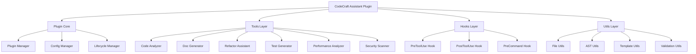

# Chapter 22: Comprehensive Project - Intelligent Code Assistant

## Overview

This chapter will build a complete intelligent code assistant plugin, comprehensively applying all core concepts learned in previous chapters. This project covers plugin development, custom tools, Hooks system, error handling, performance optimization, security practices, and platform compatibility.

**Chapter Highlights:**

- **Project Architecture**: Complete plugin architecture design
- **Feature Implementation**: Multiple practical tools fully implemented
- **Best Practices**: Comprehensive application of various best practices
- **Code Quality**: Complete testing and documentation
- **Deployment & Release**: Plugin packaging and release process

## Project Introduction

### Project Name: CodeCraft Assistant

**Project Positioning**: An intelligent code assistant plugin providing practical code analysis and assistance features for developers.

**Core Features**:

1. **Code Analyzer**: Analyze code complexity, dependencies, and potential issues
2. **Documentation Generator**: Automatically generate code documentation and comments
3. **Refactor Assistant**: Provide intelligent refactoring suggestions
4. **Test Generator**: Automatically generate unit tests
5. **Performance Analyzer**: Analyze code performance bottlenecks
6. **Security Scanner**: Detect common security issues

**Technology Stack**:

- **Runtime**: Node.js 18+
- **Language**: TypeScript 5+
- **Framework**: Claude Code Plugin SDK
- **Tools**: AST Parser, Template Engine, File System
- **Testing**: Jest, Testing Library
- **Build**: TSC, Rollup
- **Documentation**: TypeDoc

## Project Architecture

### Overall Architecture



### Directory Structure

```
codecraft-assistant/
├── src/
│   ├── core/
│   │   ├── plugin.ts          # Plugin core
│   │   ├── config.ts          # Configuration management
│   │   └── lifecycle.ts       # Lifecycle management
│   ├── tools/
│   │   ├── analyzer/
│   │   │   ├── index.ts       # Code analyzer
│   │   │   ├── complexity.ts  # Complexity analysis
│   │   │   └── dependencies.ts # Dependency analysis
│   │   ├── generator/
│   │   │   ├── index.ts       # Documentation generator
│   │   │   └── templates.ts   # Template engine
│   │   ├── refactor/
│   │   │   ├── index.ts       # Refactor assistant
│   │   │   └── suggestions.ts # Refactoring suggestions
│   │   ├── testing/
│   │   │   ├── index.ts       # Test generator
│   │   │   └── frameworks.ts  # Test framework adapters
│   │   ├── performance/
│   │   │   ├── index.ts       # Performance analyzer
│   │   │   └── profiler.ts    # Performance profiler
│   │   └── security/
│   │       ├── index.ts       # Security scanner
│   │       └── patterns.ts    # Security patterns
│   ├── hooks/
│   │   ├── pre-tool.ts        # PreToolUse Hook
│   │   ├── post-tool.ts       # PostToolUse Hook
│   │   └── pre-command.ts     # PreCommand Hook
│   ├── utils/
│   │   ├── file.ts            # File utilities
│   │   ├── ast.ts             # AST utilities
│   │   ├── template.ts        # Template utilities
│   │   └── validation.ts      # Validation utilities
│   └── index.ts               # Entry point
├── tests/
│   ├── unit/                  # Unit tests
│   ├── integration/           # Integration tests
│   └── fixtures/              # Test fixtures
├── templates/                 # Documentation templates
├── docs/                      # Documentation
├── package.json
├── tsconfig.json
├── jest.config.js
└── README.md
```

## Plugin Core Implementation

### Plugin Entry Point

```typescript
// src/index.ts
import { createPlugin } from '@claude-code/plugin-sdk'
import { PluginCore } from './core/plugin'
import { config } from './core/config'
import { tools } from './tools'
import { hooks } from './hooks'

const plugin = createPlugin({
  name: 'codecraft-assistant',
  version: '1.0.0',
  description: 'Intelligent Code Assistant Plugin',
  author: 'CodeCraft Team',

  // Configuration
  config,

  // Tools
  tools: {
    analyzeCode: tools.analyzeCode,
    generateDoc: tools.generateDoc,
    suggestRefactor: tools.suggestRefactor,
    generateTest: tools.generateTest,
    analyzePerformance: tools.analyzePerformance,
    scanSecurity: tools.scanSecurity,
  },

  // Hooks
  hooksConfig: {
    PreToolUse: [
      {
        pattern: 'Bash',
        enabled: true,
        hooks: [
          {
            pattern: 'npm install|npm rebuild',
            enabled: true,
            description: 'Wait for package.json update',
            execute: hooks.waitForPackageJson,
          },
        ],
      },
    ],
    PostToolUse: [
      {
        pattern: 'Edit|Write',
        enabled: true,
        hooks: [
          {
            pattern: '*',
            enabled: true,
            description: 'Automatic code check',
            execute: hooks.autoCodeCheck,
          },
        ],
      },
    ],
  },

  // Initialization
  async onLoad(core) {
    const pluginCore = new PluginCore(core)
    await pluginCore.initialize()

    core.logger.info('CodeCraft Assistant loaded successfully')
  },

  // Cleanup
  async onUnload(core) {
    const pluginCore = new PluginCore(core)
    await pluginCore.cleanup()

    core.logger.info('CodeCraft Assistant unloaded')
  },
})

export default plugin
```

### Plugin Core

```typescript
// src/core/plugin.ts
import type { ClaudeCore } from '@claude-code/plugin-sdk'

export class PluginCore {
  private cache = new Map<string, any>()
  private performanceMetrics = new Map<string, number[]>()

  constructor(private core: ClaudeCore) {}

  async initialize(): Promise<void> {
    // Initialize cache
    await this.initializeCache()

    // Initialize performance monitoring
    this.setupPerformanceMonitoring()

    // Initialize security scanner
    await this.initializeSecurityScanner()

    this.core.logger.info('Plugin core initialized')
  }

  async cleanup(): Promise<void> {
    // Clean up cache
    this.cache.clear()

    // Save performance metrics
    this.savePerformanceMetrics()

    this.core.logger.info('Plugin core cleaned up')
  }

  // Cache management
  private async initializeCache(): Promise<void> {
    // Implement cache initialization
  }

  get<T>(key: string): T | undefined {
    return this.cache.get(key)
  }

  set<T>(key: string, value: T): void {
    this.cache.set(key, value)
  }

  // Performance monitoring
  private setupPerformanceMonitoring(): void {
    // Implement performance monitoring
  }

  recordPerformance(operation: string, duration: number): void {
    if (!this.performanceMetrics.has(operation)) {
      this.performanceMetrics.set(operation, [])
    }
    this.performanceMetrics.get(operation)!.push(duration)
  }

  // Security scanning
  private async initializeSecurityScanner(): Promise<void> {
    // Implement security scanner initialization
  }

  private savePerformanceMetrics(): void {
    // Save performance metrics
  }
}
```

### Configuration Management

```typescript
// src/core/config.ts
import type { PluginConfig } from '@claude-code/plugin-sdk'

export const config: PluginConfig = {
  // Default configuration
  defaults: {
    // Analyzer configuration
    analyzer: {
      maxComplexity: 10,
      maxDependencies: 20,
      excludePatterns: ['node_modules/**', 'dist/**', 'build/**'],
    },

    // Documentation generator configuration
    docGenerator: {
      style: 'javadoc',
      includeTypes: true,
      includeExamples: true,
      language: 'en-US',
    },

    // Refactor assistant configuration
    refactorAssistant: {
      severity: 'medium',
      autoFix: false,
      suggestions: 5,
    },

    // Test generator configuration
    testGenerator: {
      framework: 'jest',
      coverage: 80,
      mocks: true,
    },

    // Performance analyzer configuration
    performanceAnalyzer: {
      threshold: 100,
      iterations: 1000,
    },

    // Security scanner configuration
    securityScanner: {
      severity: 'high',
      patterns: 'owasp-top-10',
    },
  },

  // Configuration schema
  schema: {
    type: 'object',
    properties: {
      analyzer: {
        type: 'object',
        properties: {
          maxComplexity: { type: 'number' },
          maxDependencies: { type: 'number' },
          excludePatterns: { type: 'array', items: { type: 'string' } },
        },
      },
      // ... other configurations
    },
  },

  // Configuration validation
  validate(config: unknown): boolean {
    // Implement configuration validation
    return true
  },
}
```

## Tool Implementation

### 1. Code Analyzer

```typescript
// src/tools/analyzer/index.ts
import { buildTool } from '@claude-code/plugin-sdk'
import { ComplexityAnalyzer } from './complexity'
import { DependencyAnalyzer } from './dependencies'
import { PluginCore } from '../../core/plugin'

export function createCodeAnalyzer(pluginCore: PluginCore) {
  return buildTool({
    name: 'analyze_code',
    description: 'Analyze code complexity, dependencies, and potential issues',
    parameters: {
      type: 'object',
      properties: {
        path: {
          type: 'string',
          description: 'File or directory path to analyze',
        },
        type: {
          type: 'string',
          enum: ['complexity', 'dependencies', 'issues', 'all'],
          description: 'Analysis type',
          default: 'all',
        },
        output: {
          type: 'string',
          enum: ['console', 'json', 'markdown'],
          description: 'Output format',
          default: 'console',
        },
      },
      required: ['path'],
    },

    async execute(params) {
      const { path, type = 'all', output = 'console' } = params

      // Validate path
      if (!existsSync(path)) {
        throw new Error(`Path does not exist: ${path}`)
      }

      // Performance monitoring
      const startTime = Date.now()

      try {
        // Create analyzers
        const complexityAnalyzer = new ComplexityAnalyzer()
        const dependencyAnalyzer = new DependencyAnalyzer()

        const results: AnalysisResult = {
          path,
          timestamp: new Date().toISOString(),
          complexity: null,
          dependencies: null,
          issues: [],
        }

        // Execute analysis
        if (type === 'complexity' || type === 'all') {
          results.complexity = await complexityAnalyzer.analyze(path)
        }

        if (type === 'dependencies' || type === 'all') {
          results.dependencies = await dependencyAnalyzer.analyze(path)
        }

        if (type === 'issues' || type === 'all') {
          results.issues = await this.detectIssues(path)
        }

        // Record performance
        const duration = Date.now() - startTime
        pluginCore.recordPerformance('code_analysis', duration)

        // Format output
        return this.formatOutput(results, output)
      } catch (error) {
        throw new Error(`Code analysis failed: ${error.message}`)
      }
    },

    async formatOutput(results: AnalysisResult, format: string) {
      switch (format) {
        case 'json':
          return JSON.stringify(results, null, 2)

        case 'markdown':
          return this.generateMarkdown(results)

        case 'console':
        default:
          return this.generateConsoleOutput(results)
      }
    },

    async generateMarkdown(results: AnalysisResult): Promise<string> {
      const lines: string[] = []

      lines.push(`# Code Analysis Report`)
      lines.push(`**Path**: ${results.path}`)
      lines.push(`**Timestamp**: ${results.timestamp}`)
      lines.push('')

      // Complexity analysis
      if (results.complexity) {
        lines.push('## Complexity Analysis')
        lines.push('')
        lines.push(`- Average Complexity: ${results.complexity.average.toFixed(2)}`)
        lines.push(`- Highest Complexity: ${results.complexity.max}`)
        lines.push(`- Total Functions: ${results.complexity.functionCount}`)
        lines.push('')

        if (results.complexity.highComplexityFunctions.length > 0) {
          lines.push('### High Complexity Functions')
          results.complexity.highComplexityFunctions.forEach(fn => {
            lines.push(`- \`${fn.name}\`: ${fn.complexity}`)
          })
          lines.push('')
        }
      }

      // Dependency analysis
      if (results.dependencies) {
        lines.push('## Dependency Analysis')
        lines.push('')
        lines.push(`- Total Dependencies: ${results.dependencies.total}`)
        lines.push(`- External: ${results.dependencies.external}`)
        lines.push(`- Internal: ${results.dependencies.internal}`)
        lines.push('')
      }

      // Issue detection
      if (results.issues.length > 0) {
        lines.push('## Detected Issues')
        lines.push('')
        results.issues.forEach(issue => {
          lines.push(`### ${issue.severity.toUpperCase()}: ${issue.message}`)
          lines.push(`**Location**: ${issue.file}:${issue.line}`)
          lines.push(`**Suggestion**: ${issue.suggestion}`)
          lines.push('')
        })
      } else {
        lines.push('## No Issues Detected ✅')
        lines.push('')
      }

      return lines.join('\n')
    },

    async generateConsoleOutput(results: AnalysisResult): Promise<string> {
      const lines: string[] = []

      lines.push('📊 Code Analysis Results')
      lines.push('─'.repeat(50))

      if (results.complexity) {
        lines.push(`\n🔍 Complexity Analysis:`)
        lines.push(`  Average: ${results.complexity.average.toFixed(2)}`)
        lines.push(`  Highest: ${results.complexity.max}`)
        lines.push(`  Functions: ${results.complexity.functionCount}`)
      }

      if (results.dependencies) {
        lines.push(`\n📦 Dependency Analysis:`)
        lines.push(`  Total: ${results.dependencies.total}`)
        lines.push(`  External: ${results.dependencies.external}`)
        lines.push(`  Internal: ${results.dependencies.internal}`)
      }

      if (results.issues.length > 0) {
        lines.push(`\n⚠️  Detected ${results.issues.length} issues:`)
        results.issues.slice(0, 5).forEach(issue => {
          lines.push(`  [${issue.severity}] ${issue.message}`)
        })
      } else {
        lines.push(`\n✅ No issues detected`)
      }

      return lines.join('\n')
    },

    async detectIssues(path: string): Promise<Issue[]> {
      const issues: Issue[] = []

      // Implement issue detection logic
      // 1. Unused imports
      // 2. Unused variables
      // 3. Potential memory leaks
      // 4. Unsafe patterns
      // 5. Performance issues

      return issues
    },
  })
}

type AnalysisResult = {
  path: string
  timestamp: string
  complexity: ComplexityResult | null
  dependencies: DependencyResult | null
  issues: Issue[]
}

type ComplexityResult = {
  average: number
  max: number
  functionCount: number
  highComplexityFunctions: Array<{
    name: string
    complexity: number
    file: string
    line: number
  }>
}

type DependencyResult = {
  total: number
  external: number
  internal: number
  circular: Array<{
    from: string
    to: string
  }>
}

type Issue = {
  severity: 'error' | 'warning' | 'info'
  message: string
  file: string
  line: number
  suggestion: string
}
```

### 2. Documentation Generator

```typescript
// src/tools/generator/index.ts
import { buildTool } from '@claude-code/plugin-sdk'
import { TemplateEngine } from './templates'
import { parseAST } from '../../utils/ast'

export function createDocGenerator() {
  return buildTool({
    name: 'generate_doc',
    description: 'Automatically generate code documentation',
    parameters: {
      type: 'object',
      properties: {
        path: {
          type: 'string',
          description: 'File path to generate documentation for',
        },
        format: {
          type: 'string',
          enum: ['javadoc', 'jsdoc', 'tsdoc'],
          description: 'Documentation format',
          default: 'jsdoc',
        },
        includeTypes: {
          type: 'boolean',
          description: 'Include type information',
          default: true,
        },
        includeExamples: {
          type: 'boolean',
          description: 'Include usage examples',
          default: true,
        },
      },
      required: ['path'],
    },

    async execute(params) {
      const { path, format = 'jsdoc', includeTypes = true, includeExamples = true } = params

      // Validate path
      if (!existsSync(path)) {
        throw new Error(`File does not exist: ${path}`)
      }

      try {
        // Parse AST
        const ast = await parseAST(path)

        // Generate documentation
        const templateEngine = new TemplateEngine()
        const documentation = await templateEngine.generate({
          ast,
          format,
          includeTypes,
          includeExamples,
        })

        return {
          success: true,
          documentation,
          stats: {
            functions: documentation.functions.length,
            classes: documentation.classes.length,
            interfaces: documentation.interfaces.length,
          },
        }
      } catch (error) {
        throw new Error(`Documentation generation failed: ${error.message}`)
      }
    },
  })
}
```

### 3. Refactor Assistant

```typescript
// src/tools/refactor/index.ts
import { buildTool } from '@claude-code/plugin-sdk'
import { RefactorSuggestions } from './suggestions'

export function createRefactorAssistant() {
  return buildTool({
    name: 'suggest_refactor',
    description: 'Provide intelligent refactoring suggestions',
    parameters: {
      type: 'object',
      properties: {
        path: {
          type: 'string',
          description: 'Code path to analyze',
        },
        severity: {
          type: 'string',
          enum: ['low', 'medium', 'high'],
          description: 'Suggestion severity level',
          default: 'medium',
        },
        maxSuggestions: {
          type: 'number',
          description: 'Maximum number of suggestions',
          default: 5,
        },
      },
      required: ['path'],
    },

    async execute(params) {
      const { path, severity = 'medium', maxSuggestions = 5 } = params

      try {
        // Analyze code
        const suggestions = new RefactorSuggestions()

        // Generate suggestions
        const recommendations = await suggestions.generate({
          path,
          severity,
          maxSuggestions,
        })

        return {
          success: true,
          recommendations,
          summary: {
            total: recommendations.length,
            bySeverity: this.groupBySeverity(recommendations),
          },
        }
      } catch (error) {
        throw new Error(`Refactoring suggestion generation failed: ${error.message}`)
      }
    },

    groupBySeverity(recommendations: RefactorRecommendation[]) {
      return recommendations.reduce((acc, rec) => {
        acc[rec.severity] = (acc[rec.severity] || 0) + 1
        return acc
      }, {} as Record<string, number>)
    },
  })
}

type RefactorRecommendation = {
  severity: 'low' | 'medium' | 'high'
  title: string
  description: string
  code: string
  suggestion: string
  benefit: string
  file: string
  line: number
}
```

### 4. Test Generator

```typescript
// src/tools/testing/index.ts
import { buildTool } from '@claude-code/plugin-sdk'
import { FrameworkAdapter } from './frameworks'

export function createTestGenerator() {
  return buildTool({
    name: 'generate_test',
    description: 'Automatically generate unit tests',
    parameters: {
      type: 'object',
      properties: {
        path: {
          type: 'string',
          description: 'File path to test',
        },
        framework: {
          type: 'string',
          enum: ['jest', 'mocha', 'vitest'],
          description: 'Test framework',
          default: 'jest',
        },
        coverage: {
          type: 'number',
          description: 'Target coverage percentage',
          default: 80,
        },
        includeMocks: {
          type: 'boolean',
          description: 'Include mocks',
          default: true,
        },
      },
      required: ['path'],
    },

    async execute(params) {
      const { path, framework = 'jest', coverage = 80, includeMocks = true } = params

      try {
        // Get framework adapter
        const adapter = new FrameworkAdapter(framework)

        // Generate tests
        const testCode = await adapter.generate({
          sourcePath: path,
          coverage,
          includeMocks,
        })

        return {
          success: true,
          testCode,
          framework,
          estimatedCoverage: coverage,
        }
      } catch (error) {
        throw new Error(`Test generation failed: ${error.message}`)
      }
    },
  })
}
```

### 5. Performance Analyzer

```typescript
// src/tools/performance/index.ts
import { buildTool } from '@claude-code/plugin-sdk'
import { Profiler } from './profiler'

export function createPerformanceAnalyzer() {
  return buildTool({
    name: 'analyze_performance',
    description: 'Analyze code performance bottlenecks',
    parameters: {
      type: 'object',
      properties: {
        path: {
          type: 'string',
          description: 'Code path to analyze',
        },
        threshold: {
          type: 'number',
          description: 'Performance threshold in milliseconds',
          default: 100,
        },
        iterations: {
          type: 'number',
          description: 'Test iterations',
          default: 1000,
        },
      },
      required: ['path'],
    },

    async execute(params) {
      const { path, threshold = 100, iterations = 1000 } = params

      try {
        const profiler = new Profiler()

        // Execute performance analysis
        const results = await profiler.analyze({
          path,
          threshold,
          iterations,
        })

        return {
          success: true,
          results,
          bottlenecks: results.bottlenecks,
          recommendations: results.recommendations,
        }
      } catch (error) {
        throw new Error(`Performance analysis failed: ${error.message}`)
      }
    },
  })
}
```

### 6. Security Scanner

```typescript
// src/tools/security/index.ts
import { buildTool } from '@claude-code/plugin-sdk'
import { SecurityPatterns } from './patterns'

export function createSecurityScanner() {
  return buildTool({
    name: 'scan_security',
    description: 'Scan code for security issues',
    parameters: {
      type: 'object',
      properties: {
        path: {
          type: 'string',
          description: 'Code path to scan',
        },
        severity: {
          type: 'string',
          enum: ['low', 'medium', 'high', 'critical'],
          description: 'Minimum severity level',
          default: 'high',
        },
        patterns: {
          type: 'string',
          enum: ['owasp-top-10', 'custom', 'all'],
          description: 'Pattern set to scan',
          default: 'owasp-top-10',
        },
      },
      required: ['path'],
    },

    async execute(params) {
      const { path, severity = 'high', patterns = 'owasp-top-10' } = params

      try {
        const scanner = new SecurityPatterns()

        // Execute security scan
        const vulnerabilities = await scanner.scan({
          path,
          severity,
          patterns,
        })

        return {
          success: true,
          vulnerabilities,
          summary: {
            total: vulnerabilities.length,
            bySeverity: this.groupBySeverity(vulnerabilities),
            byType: this.groupByType(vulnerabilities),
          },
        }
      } catch (error) {
        throw new Error(`Security scan failed: ${error.message}`)
      }
    },

    groupBySeverity(vulnerabilities: Vulnerability[]) {
      return vulnerabilities.reduce((acc, vuln) => {
        acc[vuln.severity] = (acc[vuln.severity] || 0) + 1
        return acc
      }, {} as Record<string, number>)
    },

    groupByType(vulnerabilities: Vulnerability[]) {
      return vulnerabilities.reduce((acc, vuln) => {
        acc[vuln.type] = (acc[vuln.type] || 0) + 1
        return acc
      }, {} as Record<string, number>)
    },
  })
}

type Vulnerability = {
  severity: 'low' | 'medium' | 'high' | 'critical'
  type: string
  message: string
  file: string
  line: number
  recommendation: string
  cwe?: string
}
```

## Hooks Implementation

### PreToolUse Hook

```typescript
// src/hooks/pre-tool.ts
export async function waitForPackageJson({ input }: { input: any }) {
  const { waitForFileChange } = await import('../utils/fileChanged')
  const packageJsonPath = join(process.cwd(), 'package.json')

  try {
    await waitForFileChange(packageJsonPath, 3000)
    console.log('✅ package.json updated')
  } catch (error) {
    console.log('⏱️  package.json update timeout, continuing')
  }
}

export async function validateBeforeEdit({ toolUse }: { toolUse: any }) {
  // Validate code before editing
  if (toolUse.name === 'Edit' || toolUse.name === 'Write') {
    // Execute code validation
    console.log('🔍 Executing code validation...')

    // Validation logic
    const validation = await validateCode(toolUse.input)

    if (!validation.valid) {
      console.log('⚠️  Validation failed:', validation.errors)
      // Can choose to block operation or just warn
    }
  }
}
```

### PostToolUse Hook

```typescript
// src/hooks/post-tool.ts
export async function autoCodeCheck({ result }: { result: any }) {
  // Automatic code check
  if (result.error) {
    console.log('❌ Operation failed, skipping code check')
    return
  }

  console.log('✅ Operation successful, executing code check...')

  // Execute code check
  const issues = await detectCodeIssues()

  if (issues.length > 0) {
    console.log(`⚠️  Detected ${issues.length} issues:`)
    issues.slice(0, 3).forEach(issue => {
      console.log(`  - ${issue.message}`)
    })
  } else {
    console.log('✅ Code check passed')
  }
}

async function detectCodeIssues() {
  // Implement code issue detection
  return []
}
```

## Utility Implementation

### File Utilities

```typescript
// src/utils/file.ts
import { promises as fs } from 'fs'
import { join, extname } from 'path'

export class FileUtils {
  static async readCodeFile(path: string): Promise<string> {
    try {
      return await fs.readFile(path, 'utf-8')
    } catch (error) {
      throw new Error(`Cannot read file: ${path}`)
    }
  }

  static async writeCodeFile(path: string, content: string): Promise<void> {
    try {
      await fs.writeFile(path, content, 'utf-8')
    } catch (error) {
      throw new Error(`Cannot write file: ${path}`)
    }
  }

  static async findCodeFiles(dir: string, extensions: string[] = ['.ts', '.js', '.tsx', '.jsx']): Promise<string[]> {
    const files: string[] = []

    async function traverse(currentDir: string) {
      const entries = await fs.readdir(currentDir, { withFileTypes: true })

      for (const entry of entries) {
        const fullPath = join(currentDir, entry.name)

        if (entry.isDirectory()) {
          // Skip node_modules and dist directories
          if (entry.name !== 'node_modules' && entry.name !== 'dist') {
            await traverse(fullPath)
          }
        } else if (entry.isFile()) {
          const ext = extname(entry.name)
          if (extensions.includes(ext)) {
            files.push(fullPath)
          }
        }
      }
    }

    await traverse(dir)
    return files
  }

  static async getFileStats(path: string): Promise<FileStats> {
    try {
      const stats = await fs.stat(path)
      const content = await fs.readFile(path, 'utf-8')

      return {
        size: stats.size,
        lines: content.split('\n').length,
        functions: content.match(/function\s+\w+/g)?.length || 0,
        classes: content.match(/class\s+\w+/g)?.length || 0,
      }
    } catch (error) {
      throw new Error(`Cannot get file stats: ${path}`)
    }
  }
}

type FileStats = {
  size: number
  lines: number
  functions: number
  classes: number
}
```

### AST Utilities

```typescript
// src/utils/ast.ts
import { parse } from '@babel/parser'
import traverse from '@babel/traverse'
import { promises as fs } from 'fs'

export class ASTUtils {
  static async parseFile(path: string) {
    const content = await fs.readFile(path, 'utf-8')

    return parse(content, {
      sourceType: 'module',
      plugins: ['typescript', 'jsx'],
    })
  }

  static extractFunctions(ast: any): FunctionInfo[] {
    const functions: FunctionInfo[] = []

    traverse(ast, {
      FunctionDeclaration(path) {
        functions.push({
          name: path.node.id?.name || 'anonymous',
          params: path.node.params.length,
          async: path.node.async,
          generator: path.node.generator,
          loc: path.node.loc,
        })
      },

      ArrowFunctionExpression(path) {
        const parent = path.parent
        if (parent.type === 'VariableDeclarator') {
          functions.push({
            name: parent.id.name,
            params: path.node.params.length,
            async: path.node.async,
            generator: false,
            loc: path.node.loc,
          })
        }
      },
    })

    return functions
  }

  static extractClasses(ast: any): ClassInfo[] {
    const classes: ClassInfo[] = []

    traverse(ast, {
      ClassDeclaration(path) {
        classes.push({
          name: path.node.id?.name || 'anonymous',
          methods: path.node.body.body.length,
          extends: path.node.superClass?.name || null,
          loc: path.node.loc,
        })
      },
    })

    return classes
  }

  static calculateComplexity(ast: any): number {
    let complexity = 1

    traverse(ast, {
      IfStatement() { complexity++ },
      WhileStatement() { complexity++ },
      ForStatement() { complexity++ },
      SwitchCase() { complexity++ },
      CatchClause() { complexity++ },
      ConditionalExpression() { complexity++ },
      LogicalExpression() { complexity++ },
    })

    return complexity
  }
}

type FunctionInfo = {
  name: string
  params: number
  async: boolean
  generator: boolean
  loc: any
}

type ClassInfo = {
  name: string
  methods: number
  extends: string | null
  loc: any
}
```

## Testing Implementation

### Unit Tests

```typescript
// tests/unit/analyzer.test.ts
import { describe, it, expect } from '@jest/globals'
import { createCodeAnalyzer } from '../../src/tools/analyzer'
import { PluginCore } from '../../src/core/plugin'

describe('Code Analyzer', () => {
  let pluginCore: PluginCore
  let analyzer: any

  beforeEach(() => {
    pluginCore = new PluginCore({} as any)
    analyzer = createCodeAnalyzer(pluginCore)
  })

  it('should analyze code complexity', async () => {
    const result = await analyzer.execute({
      path: './fixtures/sample.ts',
      type: 'complexity',
    })

    expect(result.success).toBe(true)
    expect(result.complexity).toBeDefined()
  })

  it('should detect dependencies', async () => {
    const result = await analyzer.execute({
      path: './fixtures/sample.ts',
      type: 'dependencies',
    })

    expect(result.success).toBe(true)
    expect(result.dependencies).toBeDefined()
  })

  it('should handle non-existent paths', async () => {
    await expect(analyzer.execute({
      path: './non-existent.ts',
    })).rejects.toThrow('Path does not exist')
  })
})
```

### Integration Tests

```typescript
// tests/integration/plugin.test.ts
import { describe, it, expect, beforeAll, afterAll } from '@jest/globals'
import plugin from '../../src/index'

describe('Plugin Integration', () => {
  beforeAll(async () => {
    // Initialize plugin
    await plugin.onLoad({} as any)
  })

  afterAll(async () => {
    // Cleanup plugin
    await plugin.onUnload({} as any)
  })

  it('should load successfully', () => {
    expect(plugin.name).toBe('codecraft-assistant')
    expect(plugin.version).toBe('1.0.0')
  })

  it('should have all tools registered', () => {
    expect(plugin.tools).toHaveProperty('analyzeCode')
    expect(plugin.tools).toHaveProperty('generateDoc')
    expect(plugin.tools).toHaveProperty('suggestRefactor')
    expect(plugin.tools).toHaveProperty('generateTest')
    expect(plugin.tools).toHaveProperty('analyzePerformance')
    expect(plugin.tools).toHaveProperty('scanSecurity')
  })

  it('should execute code analysis', async () => {
    const result = await plugin.tools.analyzeCode({
      path: './fixtures/sample.ts',
    })

    expect(result.success).toBe(true)
  })
})
```

## Deployment and Release

### Build Configuration

```json
// package.json
{
  "name": "codecraft-assistant",
  "version": "1.0.0",
  "description": "Intelligent Code Assistant Plugin",
  "main": "dist/index.js",
  "types": "dist/index.d.ts",
  "scripts": {
    "build": "tsc",
    "test": "jest",
    "lint": "eslint src/**/*.ts",
    "format": "prettier --write src/**/*.ts",
    "prepublishOnly": "npm run build && npm run test"
  },
  "keywords": [
    "claude-code",
    "plugin",
    "code-analysis",
    "documentation"
  ],
  "author": "CodeCraft Team",
  "license": "MIT",
  "dependencies": {
    "@claude-code/plugin-sdk": "^1.0.0",
    "@babel/parser": "^7.23.0",
    "@babel/traverse": "^7.23.0"
  },
  "devDependencies": {
    "@types/jest": "^29.5.0",
    "@types/node": "^20.0.0",
    "jest": "^29.5.0",
    "typescript": "^5.0.0"
  }
}
```

### TypeScript Configuration

```json
// tsconfig.json
{
  "compilerOptions": {
    "target": "ES2020",
    "module": "commonjs",
    "lib": ["ES2020"],
    "declaration": true,
    "outDir": "./dist",
    "rootDir": "./src",
    "strict": true,
    "esModuleInterop": true,
    "skipLibCheck": true,
    "forceConsistentCasingInFileNames": true,
    "resolveJsonModule": true,
    "moduleResolution": "node"
  },
  "include": ["src/**/*"],
  "exclude": ["node_modules", "dist", "tests"]
}
```

### README Documentation

```markdown
# CodeCraft Assistant

A powerful Claude Code intelligent code assistant plugin.

## Features

- 🔍 **Code Analysis**: Analyze code complexity, dependencies, and potential issues
- 📝 **Documentation Generation**: Automatically generate code documentation and comments
- 🔧 **Refactoring Suggestions**: Provide intelligent refactoring recommendations
- 🧪 **Test Generation**: Automatically generate unit tests
- ⚡ **Performance Analysis**: Analyze code performance bottlenecks
- 🔒 **Security Scanning**: Detect common security issues

## Installation

\`\`\`bash
npm install codecraft-assistant
\`\`\`

## Usage

### Code Analysis

\`\`\`typescript
await analyzeCode({
  path: './src',
  type: 'all',
  output: 'console'
})
\`\`\`

### Documentation Generation

\`\`\`typescript
await generateDoc({
  path: './src/utils.ts',
  format: 'jsdoc',
  includeTypes: true,
  includeExamples: true
})
\`\`\`

## Configuration

Configure the plugin in `.claude/config.json`:

\`\`\`json
{
  "plugins": {
    "codecraft-assistant": {
      "analyzer": {
        "maxComplexity": 10,
        "maxDependencies": 20
      },
      "docGenerator": {
        "style": "jsdoc",
        "includeTypes": true
      }
    }
  }
}
\`\`\`

## Development

\`\`\`bash
# Install dependencies
npm install

# Build
npm run build

# Test
npm run test

# Lint
npm run lint
\`\`\`

## License

MIT
```

## Best Practices Summary

### 1. Architecture Design

- **Layered Architecture**: Clear layering (core, tools, hooks, utilities)
- **Modularization**: Each feature is an independent module
- **Dependency Injection**: Use dependency injection to reduce coupling

### 2. Code Quality

- **Type Safety**: Full utilization of TypeScript type system
- **Error Handling**: Comprehensive error handling and recovery
- **Performance Optimization**: Caching, lazy loading, performance monitoring

### 3. User Experience

- **Clear Feedback**: Clear and specific operation feedback
- **Fault Tolerance**: Graceful error handling
- **Flexible Configuration**: Rich configuration options

### 4. Security

- **Permission Checks**: Strict permission validation
- **Data Validation**: Input data validation
- **Security Scanning**: Common security issue detection

### 5. Maintainability

- **Code Standards**: Unified code style
- **Test Coverage**: Complete test coverage
- **Complete Documentation**: Detailed documentation

## Summary

Through this comprehensive project, we have:

1. **Integrated All Core Concepts**: Plugin system, tool development, Hooks, error handling, performance optimization, security practices
2. **Applied Best Practices**: Architecture design, code quality, user experience, security
3. **Mastered Complete Process**: From design, development, testing to deployment and release
4. **Enhanced Practical Skills**: Ability to independently develop complex plugins

This project demonstrates how to build a production-grade Claude Code plugin, laying a solid foundation for future development.
