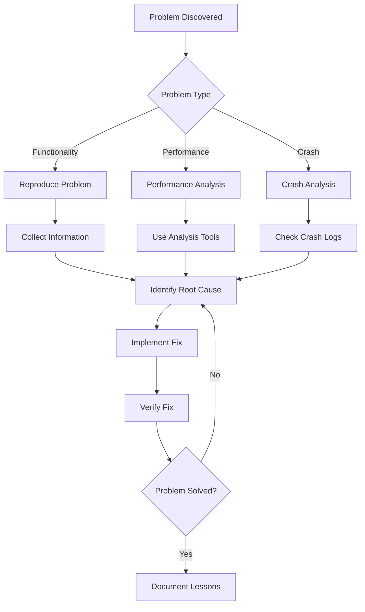

# Chapter 23: Debugging & Troubleshooting

## Overview

When developing Claude Code plugins and extensions, debugging and troubleshooting are inevitable skills. This chapter will demonstrate systematic debugging approaches, diagnostic processes, and solution tools through 10+ real-world problem cases, helping developers quickly locate and resolve issues.

**Chapter Highlights:**

- **Debugging Methodology**: Problem classification, diagnostic process, solution strategies
- **Common Problem Cases**: 10+ real-world problems and their solutions
- **Debugging Tools**: Built-in tools, external tools, custom tools
- **Performance Issues**: Memory leaks, CPU usage, slow response
- **Compatibility Issues**: Platform differences, version conflicts, dependency problems
- **Best Practices**: Preventive measures, logging strategies, error handling

## Debugging Methodology

### Problem Classification

```typescript
// Debugging problem classification
export type DebugProblemCategory =
  | 'functionality'    // Functionality issues: features not working or producing incorrect results
  | 'performance'     // Performance issues: slow execution or high resource usage
  | 'compatibility'   // Compatibility issues: specific environment or version incompatibility
  | 'crash'          // Crash issues: process crashes or abnormal exits
  | 'memory'         // Memory issues: memory leaks or out of memory errors
  | 'concurrency'    // Concurrency issues: race conditions or deadlocks

export type DebugProblem = {
  category: DebugProblemCategory
  severity: 'critical' | 'high' | 'medium' | 'low'
  description: string
  reproduction?: string
  environment?: DebugEnvironment
  stack?: string
  logs?: string[]
}

export type DebugEnvironment = {
  platform: string
  nodeVersion: string
  claudeCodeVersion: string
  plugins: string[]
  settings: Record<string, unknown>
}
```

### Diagnostic Process



### Systematic Diagnostic Steps

```typescript
// src/debug/diagnostic.ts
export class DiagnosticProcess {
  async diagnose(problem: DebugProblem): Promise<DiagnosticResult> {
    // 1. Collect environment information
    const environment = await this.collectEnvironmentInfo()

    // 2. Select diagnostic strategy based on problem type
    let strategy: DiagnosticStrategy

    switch (problem.category) {
      case 'functionality':
        strategy = new FunctionalityDiagnostic()
        break
      case 'performance':
        strategy = new PerformanceDiagnostic()
        break
      case 'compatibility':
        strategy = new CompatibilityDiagnostic()
        break
      case 'crash':
        strategy = new CrashDiagnostic()
        break
      case 'memory':
        strategy = new MemoryDiagnostic()
        break
      case 'concurrency':
        strategy = new ConcurrencyDiagnostic()
        break
    }

    // 3. Execute diagnosis
    const result = await strategy.diagnose(problem, environment)

    // 4. Generate diagnostic report
    return {
      problem,
      environment,
      rootCause: result.rootCause,
      solutions: result.solutions,
      recommendations: result.recommendations,
      relatedIssues: result.relatedIssues,
    }
  }

  private async collectEnvironmentInfo(): Promise<DebugEnvironment> {
    return {
      platform: process.platform,
      nodeVersion: process.version,
      claudeCodeVersion: this.getClaudeCodeVersion(),
      plugins: this.getInstalledPlugins(),
      settings: this.getSettings(),
    }
  }

  private getClaudeCodeVersion(): string {
    try {
      const packageJson = JSON.parse(
        fs.readFileSync(
          join(__dirname, '../../../package.json'),
          'utf-8'
        )
      )
      return packageJson.version
    } catch {
      return 'unknown'
    }
  }

  private getInstalledPlugins(): string[] {
    // Implement plugin list retrieval
    return []
  }

  private getSettings(): Record<string, unknown> {
    // Implement settings retrieval
    return {}
  }
}

export interface DiagnosticResult {
  problem: DebugProblem
  environment: DebugEnvironment
  rootCause: string
  solutions: Solution[]
  recommendations: string[]
  relatedIssues: string[]
}

export interface Solution {
  description: string
  steps: string[]
  code?: string
  risk?: 'low' | 'medium' | 'high'
}

// Diagnostic strategy interface
interface DiagnosticStrategy {
  diagnose(
    problem: DebugProblem,
    environment: DebugEnvironment
  ): Promise<{
    rootCause: string
    solutions: Solution[]
    recommendations: string[]
    relatedIssues: string[]
  }>
}
```

## Common Problem Cases

### Case 1: Plugin Loading Failure

**Problem Description**:
Custom plugin fails to load with error "Cannot find module".

**Diagnostic Process**:

```typescript
// 1. Check plugin path
const pluginPath = join(process.cwd(), '.claude-plugin', 'my-plugin')
console.log('Plugin path:', pluginPath)

// 2. Check plugin structure
try {
  const pluginManifest = join(pluginPath, '.claude-plugin', 'plugin.json')
  const exists = fs.existsSync(pluginManifest)
  console.log('Plugin manifest exists:', exists)

  if (!exists) {
    // List directory contents
    const files = fs.readdirSync(pluginPath)
    console.log('Plugin directory contents:', files)
  }
} catch (error) {
  console.error('Error checking plugin path:', error)
}

// 3. Check dependencies
try {
  const packageJson = join(pluginPath, 'package.json')
  const pkg = JSON.parse(fs.readFileSync(packageJson, 'utf-8'))
  console.log('Plugin dependencies:', pkg.dependencies)

  // Check if node_modules exists
  const nodeModules = join(pluginPath, 'node_modules')
  const nodeModulesExists = fs.existsSync(nodeModules)
  console.log('node_modules exists:', nodeModulesExists)
} catch (error) {
  console.error('Error checking dependencies:', error)
}
```

**Solutions**:

```typescript
// Solution 1: Install dependencies
// Run npm install in plugin directory
await exec('npm install', { cwd: pluginPath })

// Solution 2: Check plugin structure
const expectedStructure = [
  '.claude-plugin/plugin.json',
  '.claude-plugin/commands/',
  'package.json',
]

for (const file of expectedStructure) {
  const fullPath = join(pluginPath, file)
  if (!fs.existsSync(fullPath)) {
    console.error(`Missing required file: ${file}`)
    // Create missing files or directories
  }
}

// Solution 3: Validate plugin.json format
const manifestPath = join(pluginPath, '.claude-plugin', 'plugin.json')
try {
  const manifest = JSON.parse(fs.readFileSync(manifestPath, 'utf-8'))

  // Validate required fields
  if (!manifest.name) {
    throw new Error('plugin.json missing required "name" field')
  }
  if (!manifest.version) {
    throw new Error('plugin.json missing required "version" field')
  }

  console.log('Plugin manifest is valid')
} catch (error) {
  console.error('Invalid plugin.json:', error)
}
```

### Case 2: Tool Execution Permission Denied

**Problem Description**:
Custom tool execution prompts "Permission denied".

**Diagnostic Process**:

```typescript
// 1. Check tool definition
const toolDefinition = {
  name: 'myTool',
  description: 'My custom tool',
  parameters: {
    type: 'object',
    properties: {
      path: {
        type: 'string',
        description: 'File path to process',
      },
    },
    required: ['path'],
  },
}

// 2. Check permission settings
const permissionCheck = {
  scope: 'file_read',
  resource: toolDefinition.name,
}

console.log('Checking permissions:', permissionCheck)

// 3. Check user permission history
const permissionsHistory = getPermissionHistory()
console.log('Permission history:', permissionsHistory)

function getPermissionHistory() {
  // Get permission history from settings
  try {
    const settingsPath = join(getClaudeConfigHomeDir(), 'settings.json')
    const settings = JSON.parse(fs.readFileSync(settingsPath, 'utf-8'))
    return settings.permissionHistory || []
  } catch {
    return []
  }
}
```

**Solutions**:

```typescript
// Solution 1: Update permission settings
async function updatePermissionSettings() {
  const settingsPath = join(getClaudeConfigHomeDir(), 'settings.json')

  try {
    const settings = JSON.parse(fs.readFileSync(settingsPath, 'utf-8'))

    // Add tool permission
    if (!settings.enabledTools) {
      settings.enabledTools = {}
    }

    settings.enabledTools['myTool'] = true

    // Add file read permission
    if (!settings.enabledPlugins) {
      settings.enabledPlugins = {}
    }

    settings.enabledPlugins['myTool'] = {
      file_read: true,
      file_write: false,
    }

    // Write back settings
    fs.writeFileSync(settingsPath, JSON.stringify(settings, null, 2))
    console.log('Permissions updated successfully')
  } catch (error) {
    console.error('Failed to update permissions:', error)
  }
}

// Solution 2: Use fallback with permission
async function fallbackWithPermission() {
  // Use ask mode to request permission
  const permission = await askUser(
    'myTool needs file read permission. Grant permission?'
  )

  if (permission === 'allow') {
    // Execute operation
    console.log('Permission granted, executing tool...')
  } else {
    console.log('Permission denied, using fallback')
    // Use fallback solution
  }
}

async function askUser(question: string): Promise<'allow' | 'deny' | 'ask'> {
  // Implement user ask logic
  return 'allow'
}
```

### Case 3: Memory Leak

**Problem Description**:
Memory usage continuously grows after long-running operation.

**Diagnostic Process**:

```typescript
// 1. Monitor memory usage
function monitorMemory() {
  const snapshots: Array<{
    time: number
    heapUsed: number
    heapTotal: number
    external: number
  }> = []

  const interval = setInterval(() => {
    const usage = process.memoryUsage()

    snapshots.push({
      time: Date.now(),
      heapUsed: usage.heapUsed,
      heapTotal: usage.heapTotal,
      external: usage.external,
    })

    console.log('Memory usage:', usage)

    // Keep last 100 snapshots
    if (snapshots.length > 100) {
      snapshots.shift()
    }

    // Detect memory growth
    if (snapshots.length >= 10) {
      const oldest = snapshots[0]
      const newest = snapshots[snapshots.length - 1]
      const growth = newest.heapUsed - oldest.heapUsed
      const growthRate = growth / (newest.time - oldest.time)

      if (growthRate > 1024) { // 1KB/s growth rate
        console.warn('Possible memory leak detected!')
        console.log('Growth rate:', (growthRate / 1024).toFixed(2), 'KB/s')
      }
    }
  }, 1000)

  return interval
}

// 2. Heap snapshot analysis
function takeHeapSnapshot() {
  // Use v8 module
  const v8 = require('v8')

  const snapshot = v8.writeHeapSnapshot()
  console.log('Heap snapshot written to:', snapshot)

  return snapshot
}

// 3. Detect uncleaned resources
function detectUncleanedResources() {
  // Check unclosed file handles
  const openHandles = new Set()

  // Hook fs.open
  const originalOpen = fs.open
  fs.open = function(...args) {
    const callback = args[args.length - 1]

    if (typeof callback === 'function') {
      const newCallback = (err: Error | null, fd: number) => {
        if (!err) {
          openHandles.add(fd)
          console.log('File opened:', fd, 'Total open:', openHandles.size)
        }
        callback(err, fd)
      }

      args[args.length - 1] = newCallback
    }

    return originalOpen.apply(this, args)
  }

  // Hook fs.close
  const originalClose = fs.close
  fs.close = function(...args) {
    const callback = args[args.length - 1]

    if (typeof callback === 'function') {
      const fd = args[0]
      const newCallback = (err: Error | null) => {
        if (!err) {
          openHandles.delete(fd)
          console.log('File closed:', fd, 'Total open:', openHandles.size)
        }
        callback(err)
      }

      args[args.length - 1] = newCallback
    }

    return originalClose.apply(this, args)
  }

  console.log('Resource detection enabled')
}
```

**Solutions**:

```typescript
// Solution 1: Fix event listener leak
class EventEmitterManager {
  private listeners = new Map<string, Set<Function>>()

  on(event: string, listener: Function): void {
    if (!this.listeners.has(event)) {
      this.listeners.set(event, new Set())
    }

    this.listeners.get(event)!.add(listener)
  }

  off(event: string, listener: Function): void {
    const listeners = this.listeners.get(event)
    if (listeners) {
      listeners.delete(listener)

      // If no listeners, delete event
      if (listeners.size === 0) {
        this.listeners.delete(event)
      }
    }
  }

  emit(event: string, ...args: unknown[]): void {
    const listeners = this.listeners.get(event)
    if (listeners) {
      listeners.forEach(listener => {
        listener(...args)
      })
    }
  }

  removeAllListeners(event?: string): void {
    if (event) {
      this.listeners.delete(event)
    } else {
      this.listeners.clear()
    }
  }
}

// Solution 2: Use WeakMap
const cache = new WeakMap<object, any>()

function addToCache(key: object, value: any) {
  cache.set(key, value)
  // When key is no longer referenced, automatically removed from cache
}

// Solution 3: Periodic cleanup
class CleanupManager {
  private timers: Set<NodeJS.Timeout> = new Set()
  private intervals: Set<NodeJS.Timeout> = new Set()
  private watchers: Set<FSWatcher> = new Set()

  setTimeout(callback: (...args: any[]) => void, delay: number): NodeJS.Timeout {
    const timer = setTimeout(() => {
      callback(...args)
      this.timers.delete(timer)
    }, delay)

    this.timers.add(timer)
    return timer
  }

  setInterval(callback: (...args: any[]) => void, delay: number): NodeJS.Timeout {
    const interval = setInterval(() => {
      callback(...args)
    }, delay)

    this.intervals.add(interval)
    return interval
  }

  watch(path: string): FSWatcher {
    const watcher = fs.watch(path)
    this.watchers.add(watcher)
    return watcher
  }

  cleanup(): void {
    // Clean up all timers
    this.timers.forEach(timer => clearTimeout(timer))
    this.timers.clear()

    this.intervals.forEach(interval => clearInterval(interval))
    this.intervals.clear()

    // Close all watchers
    this.watchers.forEach(watcher => watcher.close())
    this.watchers.clear()
  }
}
```

### Case 4: Concurrent Race Conditions

**Problem Description**:
Multiple plugins operating on the same file simultaneously cause conflicts.

**Diagnostic Process**:

```typescript
// 1. Detect concurrent operations
class ConcurrencyDetector {
  private operations = new Map<string, Operation[]>()

  async trackOperation<T>(
    resource: string,
    operation: () => Promise<T>
  ): Promise<T> {
    // Record operation
    const opInfo: Operation = {
      type: 'file_operation',
      resource,
      startTime: Date.now(),
    }

    if (!this.operations.has(resource)) {
      this.operations.set(resource, [])
    }

    const resourceOps = this.operations.get(resource)!

    // Check for conflicting operations
    const conflictingOp = resourceOps.find(op =>
      op.type === 'file_operation' &&
      Date.now() - op.startTime < 1000 // operations within last 1 second
    )

    if (conflictingOp) {
      console.warn('Concurrent operation detected on:', resource)
      console.warn('Existing operation:', conflictingOp)
    }

    resourceOps.push(opInfo)

    try {
      const result = await operation()
      return result
    } finally {
      // Remove operation record
      const index = resourceOps.indexOf(opInfo)
      if (index > -1) {
        resourceOps.splice(index, 1)
      }
    }
  }

  getCurrentOperations(): Map<string, Operation[]> {
    return new Map(this.operations)
  }
}

type Operation = {
  type: string
  resource: string
  startTime: number
}

// 2. Detect deadlocks
class DeadlockDetector {
  private waitGraph = new Map<string, Set<string>>()

  async acquireLock(
    resource: string,
    owner: string,
    timeout: number = 5000
  ): Promise<boolean> {
    const startTime = Date.now()

    while (Date.now() - startTime < timeout) {
      if (!this.waitGraph.has(resource)) {
        this.waitGraph.set(resource, new Set())
        this.waitGraph.get(resource)!.add(owner)
        return true
      }

      // Check for circular wait
      if (this.detectCycle()) {
        console.error('Deadlock detected!')
        console.log('Wait graph:', this.waitGraph)
        return false
      }

      await sleep(100)
    }

    return false
  }

  releaseLock(resource: string, owner: string): void {
    const waiters = this.waitGraph.get(resource)
    if (waiters) {
      waiters.delete(owner)

      if (waiters.size === 0) {
        this.waitGraph.delete(resource)
      }
    }
  }

  private detectCycle(): boolean {
    const visited = new Set<string>()
    const recursionStack = new Set<string>()

    for (const [resource, waiters] of this.waitGraph) {
      if (this.detectCycleDFS(resource, visited, recursionStack)) {
        return true
      }
    }

    return false
  }

  private detectCycleDFS(
    resource: string,
    visited: Set<string>,
    recursionStack: Set<string>
  ): boolean {
    if (recursionStack.has(resource)) {
      return true // Cycle detected
    }

    if (visited.has(resource)) {
      return false
    }

    visited.add(resource)
    recursionStack.add(resource)

    const waiters = this.waitGraph.get(resource)
    if (waiters) {
      for (const waiter of waiters) {
        if (this.detectCycleDFS(waiter, visited, recursionStack)) {
          return true
        }
      }
    }

    recursionStack.delete(resource)
    return false
  }
}
```

**Solutions**:

```typescript
// Solution 1: Use file locks
class FileLock {
  private locks = new Map<string, Lock>()

  async acquire(
    path: string,
    timeout: number = 5000
  ): Promise<Lock | null> {
    const startTime = Date.now()

    while (Date.now() - startTime < timeout) {
      if (!this.locks.has(path)) {
        const lock: Lock = {
          path,
          owner: process.pid.toString(),
          acquiredAt: Date.now(),
        }
        this.locks.set(path, lock)
        return lock
      }

      const existingLock = this.locks.get(path)!

      // Check if lock is stale
      if (Date.now() - existingLock.acquiredAt > 30000) {
        console.warn('Stale lock detected, removing:', path)
        this.locks.delete(path)
        continue
      }

      await sleep(100)
    }

    return null
  }

  release(lock: Lock): void {
    if (this.locks.get(lock.path) === lock) {
      this.locks.delete(lock.path)
    }
  }

  async withLock<T>(
    path: string,
    operation: (lock: Lock) => Promise<T>,
    timeout?: number
  ): Promise<T> {
    const lock = await this.acquire(path, timeout)

    if (!lock) {
      throw new Error(`Failed to acquire lock for ${path}`)
    }

    try {
      return await operation(lock)
    } finally {
      this.release(lock)
    }
  }
}

type Lock = {
  path: string
  owner: string
  acquiredAt: number
}

// Usage example
const fileLock = new FileLock()

await fileLock.withLock('/path/to/file', async () => {
  // Safely operate on file
  const content = await fs.promises.readFile('/path/to/file', 'utf-8')
  const modified = content.toUpperCase()
  await fs.promises.writeFile('/path/to/file', modified)
})
```

### Case 5: Hook Not Triggering

**Problem Description**:
Registered PreToolUse Hook is not being triggered.

**Diagnostic Process**:

```typescript
// 1. Check hook registration
function checkHookRegistration() {
  const settings = loadSettings()

  console.log('Registered hooks:')

  // Check PreToolUse hooks
  if (settings.hooksConfig?.PreToolUse) {
    for (const hookConfig of settings.hooksConfig.PreToolUse) {
      console.log('  PreToolUse:', {
        pattern: hookConfig.pattern,
        enabled: hookConfig.enabled,
        hooks: hookConfig.hooks?.map(h => h.description || 'anonymous'),
      })
    }
  } else {
    console.log('  No PreToolUse hooks registered')
  }

  // Check other hooks
  for (const hookType of Object.keys(settings.hooksConfig || {})) {
    console.log(`  ${hookType}:`, settings.hooksConfig[hookType])
  }
}

// 2. Check hook pattern matching
function testHookPatternMatching() {
  const toolUse = {
    name: 'Bash',
    input: {
      command: 'npm install',
    },
  }

  const hookConfigs = loadSettings().hooksConfig?.PreToolUse || []

  for (const hookConfig of hookConfigs) {
    const matches = matchHookPattern(hookConfig.pattern, toolUse)

    console.log(`Hook pattern "${hookConfig.pattern}" matches:`, matches)

    if (matches) {
      console.log('  Hook is enabled:', hookConfig.enabled)

      for (const hook of hookConfig.hooks || []) {
        console.log('  Hook would execute:', hook.description)
      }
    }
  }
}

function matchHookPattern(pattern: string, toolUse: any): boolean {
  // Implement pattern matching logic
  if (pattern === '*') {
    return true
  }

  if (pattern.startsWith('/') && pattern.endsWith('/')) {
    // Regular expression
    const regex = new RegExp(pattern.slice(1, -1))
    return regex.test(toolUse.name)
  }

  // Exact match
  return pattern === toolUse.name
}

// 3. Check hook execution environment
function checkHookExecutionEnvironment() {
  // Check if in correct environment
  console.log('Current process:', {
    pid: process.pid,
    platform: process.platform,
    nodeVersion: process.version,
    cwd: process.cwd(),
  })

  // Check configuration files
  const configPaths = [
    join(process.cwd(), '.claude/config.json'),
    join(os.homedir(), '.claude/config.json'),
  ]

  for (const configPath of configPaths) {
    if (fs.existsSync(configPath)) {
      console.log('Config file found:', configPath)
      const config = JSON.parse(fs.readFileSync(configPath, 'utf-8'))
      console.log('Config:', config)
    }
  }
}
```

**Solutions**:

```typescript
// Solution 1: Fix hook pattern
// Wrong pattern
const wrongPattern = 'bash' // Case sensitive

// Correct patterns
const correctPatterns = [
  'Bash',           // Exact match
  '/bash/i',        // Regular expression (case insensitive)
  '*',             // Match all tools
  '/.*/',          // Regular expression (match all)
]

// Solution 2: Ensure hook is enabled
const hookConfig = {
  pattern: 'Bash',
  enabled: true,  // Ensure enabled
  hooks: [
    {
      pattern: 'npm install',
      enabled: true,
      description: 'Wait for package.json',
      execute: async ({ input }) => {
        // Hook logic
      },
    },
  ],
}

// Solution 3: Register hook in correct location
// Register in plugin
const plugin = {
  name: 'my-plugin',
  hooksConfig: {
    PreToolUse: [
      {
        pattern: 'Bash',
        enabled: true,
        hooks: [
          {
            pattern: 'npm install|npm rebuild',
            enabled: true,
            description: 'Wait for package.json',
            execute: async ({ input }) => {
              const { waitForFileChange } = await import('../utils/fileChanged.js')
              await waitForFileChange(join(process.cwd(), 'package.json'), 3000)
            },
          },
        ],
      },
    ],
  },
}
```

### Case 6: Lost Stream Output

**Problem Description**:
Child process standard output is not being captured.

**Diagnostic Process**:

```typescript
// 1. Check stdio configuration
function checkStdioConfiguration(childProcess: ChildProcess) {
  console.log('Child process stdio:', childProcess.stdio)

  if (!childProcess.stdout) {
    console.error('stdout is null - child process may not have stdout')
  }

  if (!childProcess.stderr) {
    console.error('stderr is null - child process may not have stderr')
  }

  // Check spawn options
  console.log('Spawn options:', {
    stdio: childProcess.stdio,
    shell: childProcess.spawnOptions?.shell,
    windowsHide: childProcess.spawnOptions?.windowsHide,
  })
}

// 2. Test simple command
async function testSimpleCommand() {
  console.log('Testing simple command: echo test')

  const { execSync } = require('child_process')

  try {
    const output = execSync('echo test', {
      encoding: 'utf-8',
      stdio: ['pipe', 'pipe', 'pipe'],
    })

    console.log('Command output:', output)
    console.log('Exit code:', 0)
  } catch (error) {
    console.error('Command failed:', error)
  }
}

// 3. Test spawn
async function testSpawn() {
  console.log('Testing spawn')

  const { spawn } = require('child_process')

  const child = spawn('echo', ['test'], {
    stdio: ['pipe', 'pipe', 'pipe'],
  })

  let output = ''

  child.stdout?.on('data', (data) => {
    console.log('stdout data:', data.toString())
    output += data.toString()
  })

  child.stderr?.on('data', (data) => {
    console.error('stderr data:', data.toString())
  })

  child.on('close', (code) => {
    console.log('Exit code:', code)
    console.log('Total output:', output)
  })
}
```

**Solutions**:

```typescript
// Solution 1: Configure stdio correctly
async function spawnWithCorrectStdio(command: string, args?: string[]) {
  const { spawn } = require('child_process')

  const child = spawn(command, args || [], {
    stdio: ['pipe', 'pipe', 'pipe'], // [stdin, stdout, stderr]
    shell: process.platform === 'win32', // Use shell on Windows
  })

  // Capture output
  const chunks: Buffer[] = []

  child.stdout?.on('data', (chunk) => {
    console.log('stdout chunk:', chunk)
    chunks.push(chunk)
  })

  child.on('close', (code) => {
    const output = Buffer.concat(chunks).toString()
    console.log('Final output:', output)
    console.log('Exit code:', code)
  })

  return child
}

// Solution 2: Use IPC to pass data
async function spawnWithIPC(command: string, args?: string[]) {
  const { spawn } = require('child_process')

  const child = spawn(command, args || [], {
    stdio: ['pipe', 'pipe', 'ipc'],
  })

  child.on('message', (message) => {
    console.log('IPC message:', message)
  })

  child.on('error', (error) => {
    console.error('Child error:', error)
  })

  return child
}

// Solution 3: Use pty (pseudo-terminal)
async function spawnWithPTY(command: string, args?: string[]) {
  const { spawn } = require('child_process')

  // Requires pty module: npm install pty
  const pty = require('pty')

  const ptyProcess = pty.spawn(command, args || [], {
    name: 'xterm-color',
    cols: 80,
    rows: 30,
    cwd: process.cwd(),
    env: process.env,
  })

  ptyProcess.on('data', (data) => {
    console.log('PTY data:', data.toString())
  })

  ptyProcess.on('exit', (exitCode) => {
    console.log('PTY exit code:', exitCode)
  })

  return ptyProcess
}
```

## Debugging Tools

### Built-in Debugging Tools

```typescript
// src/debug/tools.ts
export class DebugTools {
  // Enhanced logging
  static setupEnhancedLogging() {
    const originalLog = console.log
    const originalError = console.error
    const originalWarn = console.warn

    console.log = function(...args: any[]) {
      const timestamp = new Date().toISOString()
      originalLog(`[${timestamp}]`, ...args)
    }

    console.error = function(...args: any[]) {
      const timestamp = new Date().toISOString()
      const stack = new Error().stack?.split('\n')[2]
      originalError(`[${timestamp}]`, ...args, stack ? `\n${stack}` : '')
    }

    console.warn = function(...args: any[]) {
      const timestamp = new Date().toISOString()
      originalWarn(`[${timestamp}]`, ...args)
    }
  }

  // Performance monitoring
  static setupPerformanceMonitoring() {
    const performance = new PerformanceMonitor()
    performance.start()

    process.on('exit', () => {
      performance.stop()
      performance.report()
    })
  }

  // Memory monitoring
  static setupMemoryMonitoring() {
    const monitor = new MemoryMonitor()
    monitor.start(60000) // Report every 60 seconds

    process.on('exit', () => {
      monitor.report()
    })
  }

  // Operation tracing
  static setupOperationTracing() {
    const tracer = new OperationTracer()
    tracer.enable()

    return tracer
  }
}

class PerformanceMonitor {
  private startTime: number = 0
  private operations = new Map<string, number[]>()

  start(): void {
    this.startTime = Date.now()
  }

  recordOperation(name: string, duration: number): void {
    if (!this.operations.has(name)) {
      this.operations.set(name, [])
    }

    this.operations.get(name)!.push(duration)
  }

  stop(): void {
    const totalTime = Date.now() - this.startTime

    console.log('\n=== Performance Report ===')
    console.log(`Total time: ${totalTime}ms`)

    for (const [name, durations] of this.operations) {
      const avg = durations.reduce((a, b) => a + b, 0) / durations.length
      const max = Math.max(...durations)
      const count = durations.length

      console.log(`\n${name}:`)
      console.log(`  Count: ${count}`)
      console.log(`  Average: ${avg.toFixed(2)}ms`)
      console.log(`  Max: ${max}ms`)
      console.log(`  Total: ${durations.reduce((a, b) => a + b, 0)}ms`)
    }
  }

  report(): void {
    this.stop()
  }
}

class MemoryMonitor {
  private snapshots: Array<{
    time: number
    heapUsed: number
    heapTotal: number
  }> = []

  private interval?: NodeJS.Timeout

  start(reportInterval: number): void {
    this.interval = setInterval(() => {
      this.takeSnapshot()
    }, reportInterval)
  }

  stop(): void {
    if (this.interval) {
      clearInterval(this.interval)
    }
  }

  private takeSnapshot(): void {
    const usage = process.memoryUsage()

    this.snapshots.push({
      time: Date.now(),
      heapUsed: usage.heapUsed,
      heapTotal: usage.heapTotal,
    })

    // Keep last 100 snapshots
    if (this.snapshots.length > 100) {
      this.snapshots.shift()
    }
  }

  report(): void {
    if (this.snapshots.length < 2) {
      console.log('Not enough data for memory report')
      return
    }

    const first = this.snapshots[0]
    const last = this.snapshots[this.snapshots.length - 1]

    const duration = last.time - first.time
    const growth = last.heapUsed - first.heapUsed
    const growthRate = (growth / duration) * 1000 // bytes/ms

    console.log('\n=== Memory Report ===')
    console.log(`Duration: ${(duration / 1000).toFixed(2)}s`)
    console.log(`Initial heap: ${(first.heapUsed / 1024 / 1024).toFixed(2)} MB`)
    console.log(`Final heap: ${(last.heapUsed / 1024 / 1024).toFixed(2)} MB`)
    console.log(`Growth: ${(growth / 1024 / 1024).toFixed(2)} MB`)
    console.log(`Growth rate: ${(growthRate / 1024).toFixed(2)} MB/s`)
  }
}

class OperationTracer {
  private enabled = false
  private operations = new Map<string, number[]>()

  enable(): void {
    this.enabled = true
  }

  disable(): void {
    this.enabled = false
  }

  trace<T>(name: string, operation: () => T): T {
    if (!this.enabled) {
      return operation()
    }

    const start = Date.now()
    console.log(`[TRACE] Entering: ${name}`)

    try {
      const result = operation()

      const duration = Date.now() - start
      console.log(`[TRACE] Exiting: ${name} (${duration}ms)`)

      this.recordOperation(name, duration)

      return result
    } catch (error) {
      const duration = Date.now() - start
      console.log(`[TRACE] Exiting: ${name} (${duration}ms) - ERROR`)
      throw error
    }
  }

  private recordOperation(name: string, duration: number): void {
    if (!this.operations.has(name)) {
      this.operations.set(name, [])
    }

    this.operations.get(name)!.push(duration)
  }

  report(): void {
    console.log('\n=== Operation Trace Report ===')

    for (const [name, durations] of this.operations) {
      const avg = durations.reduce((a, b) => a + b, 0) / durations.length
      const total = durations.reduce((a, b) => a + b, 0)

      console.log(`\n${name}:`)
      console.log(`  Calls: ${durations.length}`)
      console.log(`  Total: ${total}ms`)
      console.log(`  Average: ${avg.toFixed(2)}ms`)
    }
  }
}
```

## Best Practices

### 1. Problem Prevention

- **Type Checking**: Use TypeScript for strict type checking
- **Input Validation**: Validate all external inputs
- **Error Handling**: Comprehensive try-catch and error handling
- **Resource Management**: Use RAII pattern for resource management

### 2. Logging Strategy

- **Level-based Logging**: Use different log levels
- **Structured Logging**: Use structured log formats
- **Log Rotation**: Implement log file rotation
- **Sensitive Information**: Avoid logging sensitive information

### 3. Testing Strategy

- **Unit Testing**: Test individual functions
- **Integration Testing**: Test component integration
- **End-to-end Testing**: Test complete workflows
- **Boundary Testing**: Test boundary conditions

### 4. Monitoring & Alerting

- **Performance Monitoring**: Monitor response time and resource usage
- **Error Monitoring**: Monitor error rates and error types
- **Availability Monitoring**: Monitor service availability
- **Alert Mechanisms**: Set appropriate alert thresholds

## Summary

Core points of debugging and troubleshooting:

1. **Systematic Approach**: Use structured diagnostic processes
2. **Problem Classification**: Correctly identify problem types
3. **Tool Support**: Use appropriate debugging tools
4. **Documentation**: Record problems and solutions
5. **Continuous Improvement**: Learn and improve from problems
6. **Preventive Measures**: Take measures to prevent common issues

Mastering debugging skills enables quick problem location and resolution, improving development efficiency.
