# Chapter 3: Core Concepts and Terminology

> **Chapter Goal**: Master Claude Code's core concepts and terminology system, establishing a systematic cognitive framework

---

## 📚 Learning Objectives

After completing this chapter, you will be able to:

- [ ] Understand Claude Code's 30+ core concepts
- [ ] Master the overall architecture and data flow
- [ ] Familiarize with key design pattern applications
- [ ] Build a clear concept map and knowledge system

---

## 🔑 Prerequisites

Before reading this chapter, it's recommended to master:

- **Basic Programming Concepts**: Functions, objects, modules, asynchronous programming
- **Design Pattern Basics**: Understanding of common design patterns (Singleton, Factory, Observer, etc.)
- **React Fundamentals**: Understanding of components, state, props (helpful for understanding Ink)

**Prerequisite Chapter**: [Chapter 1: Project Overview and Background](../en/chapter1-introduction-EN.md)

**Dependencies**:
```
Chapter 1 → Chapter 3 (This Chapter) → Chapter 5, Chapter 7
```

---

## 3.1 Core Concept System

Claude Code's core concepts can be divided into the following major categories:

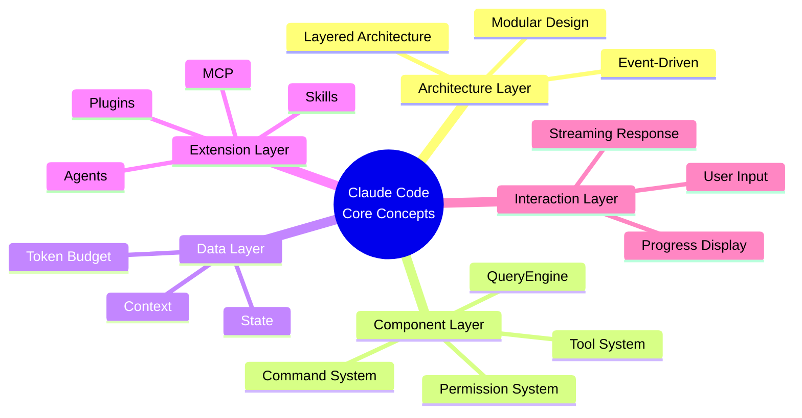

---

## 3.2 Core Concepts Explained

### 3.2.1 QueryEngine

**Definition**: QueryEngine is the core component of Claude Code, responsible for interacting with the Claude API and coordinating tool calls.

**Core Responsibilities**:

1. **API Interaction Management**
   ```typescript
   // File: src/QueryEngine.ts
   // Lines: 150-200

   interface QueryEngine {
     // Send query to Claude API
     query(messages: Message[]): AsyncStream<Response>
     
     // Handle streaming response
     handleStream(stream: AsyncStream<Response>): void
   }
   ```

2. **Tool Orchestration**
   - Detect AI intent
   - Select appropriate tools
   - Execute tool calls
   - Aggregate tool results

3. **Context Management**
   - Maintain conversation history
   - Compress context
   - Manage token budget

**Workflow**:

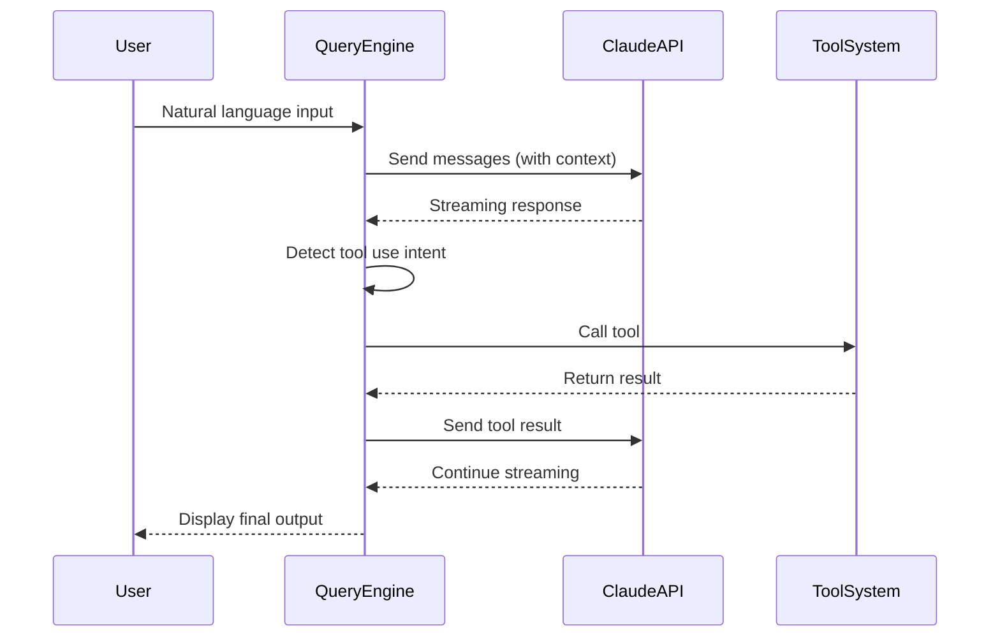

**Key Features**:

- ✅ **Streaming**: Real-time AI response display
- ✅ **Concurrency Control**: Support multiple parallel tool calls
- ✅ **Error Recovery**: Graceful degradation on tool failure
- ✅ **Token Optimization**: Auto-compress context to fit token limits

---

### 3.2.2 Tool

**Definition**: Tool is a functional unit that AI can call, each encapsulating specific operational capabilities.

**Tool Interface**:

```typescript
// File: src/Tool.ts
// Lines: 45-80

export interface Tool<Input, Output> {
  // Tool metadata
  name: string                    // Unique tool identifier
  description: string             // Tool functionality description
  inputSchema: z.ZodType<Input>  // Input validation schema
  
  // Execute function
  execute: (
    input: Input,
    context: ToolUseContext
  ) => AsyncGenerator<ToolResult>
}
```

**Tool Categories** (60+ tools):

| Category | Tool Count | Example Tools | Purpose |
|----------|-----------|---------------|---------|
| **File Operations** | 8+ | FileReadTool, FileWriteTool, FileEditTool | Read, write, edit files |
| **Search Tools** | 2+ | GlobTool, GrepTool | File finding, content search |
| **Shell Tools** | 2+ | BashTool, PowerShellTool | Execute command-line operations |
| **Web Tools** | 2+ | WebSearchTool, WebFetchTool | Web search, content fetching |
| **MCP Tools** | 4+ | MCPTool, ListMcpResourcesTool | MCP protocol integration |
| **Task Management** | 5+ | TaskCreateTool, TaskUpdateTool | Task creation and tracking |
| **Agent Tools** | 1+ | AgentTool | Sub-agent management |

**Tool Lifecycle**:

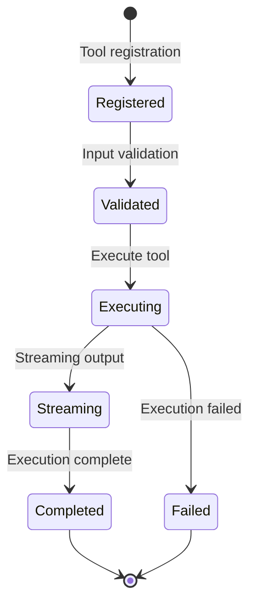

**Builder Pattern**:

```typescript
// File: src/Tool.ts
// Lines: 200-250

// Create tool using buildTool
export const FileReadTool = buildTool({
  name: 'FileReadTool',
  description: 'Read the content of a file',
  
  // Input validation
  inputSchema: z.object({
    filePath: z.string()
  }),
  
  // Execution logic
  async* execute(input, context) {
    try {
      const content = await readFile(input.filePath)
      yield { success: true, data: content }
    } catch (error) {
      yield { success: false, error: error.message }
    }
  }
})
```

---

### 3.2.3 Command

**Definition**: Command is a slash command that users can directly call, providing quick functional access.

**Command Interface**:

```typescript
// File: src/Command.ts
// Lines: 30-60

export interface Command {
  name: string                      // Command name
  description: string               // Command description
  parameters?: z.ZodType           // Parameter validation
  execute: (params: any) => Promise<void>
}
```

**Command Categories** (100+ commands):

| Category | Command Count | Examples | Functionality |
|----------|--------------|----------|---------------|
| **Core Commands** | 3 | help, exit, clear | Basic operations |
| **Configuration Management** | 3 | config, model, theme | System configuration |
| **Session Management** | 3 | session, resume, memory | Session control |
| **Git Integration** | 4 | commit, review, diff, branch | Git operations |
| **Feature Commands** | 4 | agents, skills, plugins, mcp | Feature management |
| **Development Commands** | 3 | ide, hooks, tasks | Development tools |

**Command Execution Flow**:

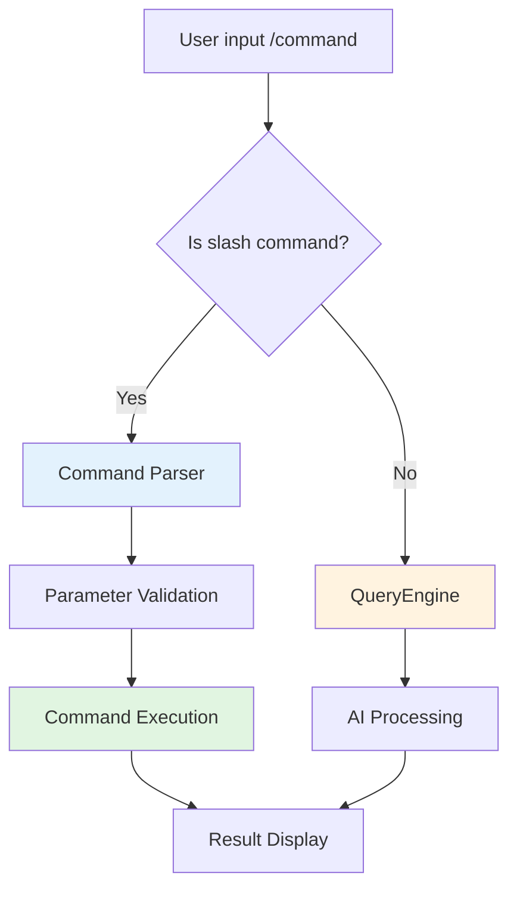

---

### 3.2.4 Permission System

**Definition**: The permission system controls tool usage permissions, protecting system security.

**Three Permission Modes**:

| Mode | Features | Use Cases |
|------|----------|-----------|
| **Default** | All operations require user confirmation | Learning, debugging environments |
| **Auto** | AI classifier-based automatic decisions | Trusted environments, automation |
| **Bypass** | Allow all operations | Advanced users, full trust |

**Permission Decision Flow**:

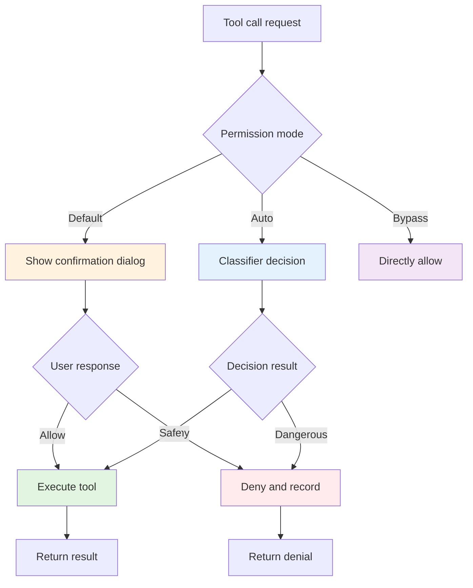

**Permission Rules**:

```typescript
// File: src/permissions/permissionRuleParser.ts
// Lines: 100-150

// Rule syntax examples
const rules = [
  // Allow all file read operations
  'allow FileReadTool *',
  
  // Allow write operations in specific directory
  'allow FileWriteTool /tmp/*',
  
  // Deny dangerous delete operations
  'deny BashTool rm -rf *',
  
  // Shell pattern matching
  'allow BashTool git *',
  'deny BashTool rm *'
]
```

**Denial Tracking**:

```typescript
// Record all permission denial history
interface DenyRecord {
  timestamp: Date
  tool: string
  operation: string
  reason: string
  userDecision: 'allow' | 'deny'
}
```

---

### 3.2.5 Context

**Definition**: Context manages conversation history and AI interaction state information.

**Context Composition**:

```typescript
// File: src/context/ContextManager.ts
// Lines: 50-100

interface Context {
  // Message history
  messages: Message[]
  
  // Token usage
  tokenUsage: {
    input: number
    output: number
    total: number
  }
  
  // Compression state
  compressionState: {
    compressed: boolean
    strategy: CompressionStrategy
    ratio: number
  }
}
```

**Context Compression Strategies**:

| Strategy | Algorithm | Compression Ratio | Use Cases |
|----------|-----------|-------------------|-----------|
| **Snip** | Trim middle content | 30-50% | Long conversations |
| **Reactive** | Keep key messages | 40-60% | Complex tasks |
| **Micro** | Extreme compression | 60-80% | Token limits |

**Compression Triggers**:

```typescript
// Trigger compression when token usage exceeds budget
if (context.tokenUsage.total > TOKEN_BUDGET * 0.8) {
  context = compact(context, {
    strategy: 'Snip',
    keepKeyMessages: true
  })
}
```

---

### 3.2.6 Agent

**Definition**: Agent is an independent AI sub-assistant that can handle specific tasks in parallel.

**Agent Types**:

| Type | Functionality | Use Cases |
|------|--------------|-----------|
| **Explore Agent** | Codebase exploration | Large-scale search, module analysis |
| **Plan Agent** | Task planning | Architecture design, implementation planning |
| **Verify Agent** | Code verification | Code review, testing validation |

**Agent Lifecycle**:

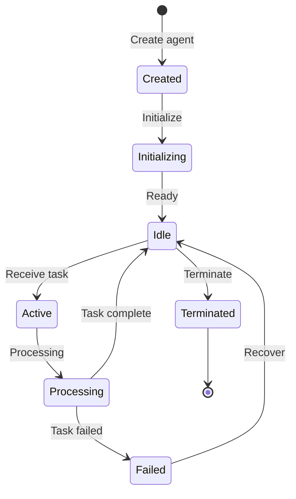

**Agent Memory Sharing**:

```typescript
// Agents can share memory
interface AgentMemory {
  // Shared data storage
  sharedData: Map<string, any>
  
  // Data synchronization
  sync(agentId: string, data: any): void
  
  // Data reading
  read(agentId: string, key: string): any
}
```

---

### 3.2.7 MCP (Model Context Protocol)

**Definition**: MCP is the Model Context Protocol, used to extend AI model capabilities.

**MCP Architecture**:

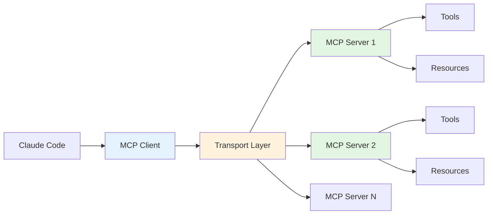

**Transport Layer Types**:

| Type | Features | Use Cases |
|------|----------|-----------|
| **Stdio** | Standard input/output based | Local processes |
| **SSE** | Server-Sent Events | HTTP connections |
| **WebSocket** | Bidirectional real-time | Long-lived connections |

**MCP Tool Integration**:

```typescript
// MCP tools automatically convert to Claude Code tools
const mcpTool = {
  name: 'mcp.server.database.query',
  description: 'Execute database query',
  execute: async (input) => {
    // Call MCP server
    return await mcpClient.callTool('database.query', input)
  }
}
```

---

### 3.2.8 State

**Definition**: State is the global application state, managing all runtime state information.

**State Structure**:

```typescript
// File: src/state/AppState.ts
// Lines: 20-80

interface AppState {
  // User session
  session: {
    id: string
    startTime: Date
    lastActivity: Date
  }
  
  // Configuration
  config: {
    logLevel: LogLevel
    permissionMode: PermissionMode
    theme: Theme
  }
  
  // Statistics
  stats: {
    queriesExecuted: number
    toolsUsed: Map<string, number>
    errors: Error[]
  }
}
```

**State Management**:

- **Storage**: Zustand for state management
- **Persistence**: Automatic save to filesystem
- **Subscription**: Support component subscription to state changes

```typescript
// State subscription example
const unsubscribe = AppState.subscribe(
  (state) => state.config.logLevel,
  (logLevel) => {
    console.log('Log level changed:', logLevel)
  }
)
```

---

## 3.3 Architecture Patterns

### 3.3.1 Layered Architecture

Claude Code adopts a clear layered architecture:

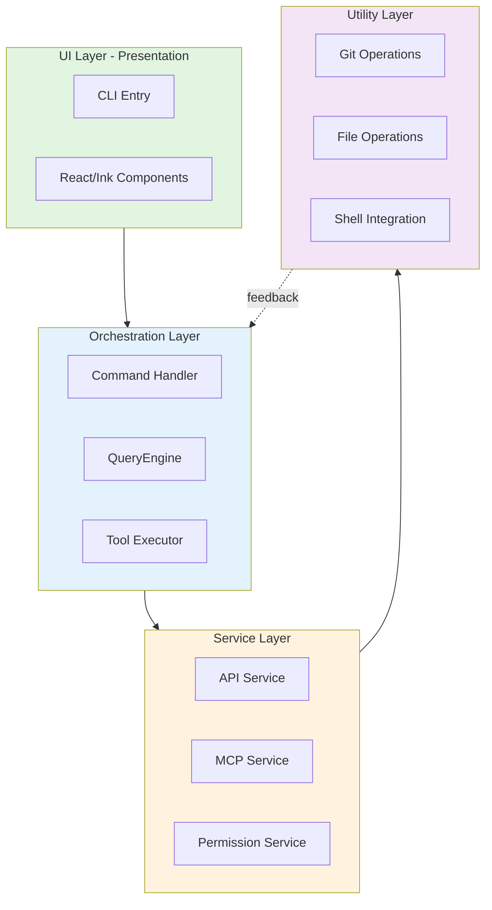

**Layer Responsibilities**:

- **UI Layer**: User interaction, result display
- **Orchestration Layer**: Request processing, task coordination
- **Service Layer**: Business logic, external integration
- **Utility Layer**: Basic operations, system calls

---

### 3.3.2 Event-Driven

The system adopts an event-driven architecture:

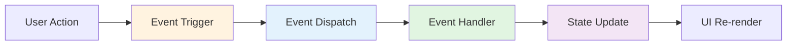

**Event Types**:

| Event | Trigger Time | Handler |
|------|-------------|---------|
| `query:start` | Query starts | QueryEngine |
| `tool:execute` | Tool call | ToolExecutor |
| `permission:request` | Permission request | PermissionSystem |
| `context:compact` | Context compression | ContextManager |

---

### 3.3.3 Design Pattern Applications

**Key Design Patterns**:

| Pattern | Application Location | Purpose |
|---------|---------------------|---------|
| **Singleton** | QueryEngine, AppState | Global unique instance |
| **Factory** | getCommand(), getAllTools() | Object creation |
| **Builder** | buildTool() | Complex object construction |
| **Strategy** | Permission System | Interchangeable algorithms |
| **Observer** | Hook System | State monitoring |
| **Adapter** | MCP Tools | Interface adaptation |
| **Command** | Slash Commands | Operation encapsulation |

**Example: Builder Pattern**

```typescript
// Use Builder Pattern to create tools
const tool = buildTool({
  // Configure tool
  name: 'MyTool',
  description: 'My custom tool',
  inputSchema: z.object({
    param: z.string()
  }),
  
  // Implement logic
  async* execute(input, context) {
    yield { success: true, data: '...' }
  }
})
```

---

## 3.4 Data Flow

### 3.4.1 User Input Processing Flow

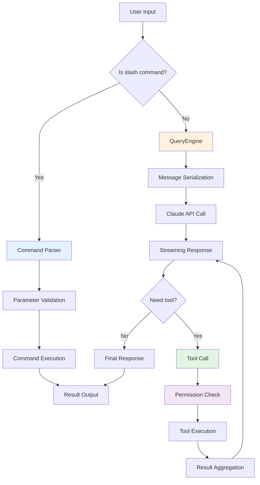

---

### 3.4.2 AI Conversation Flow

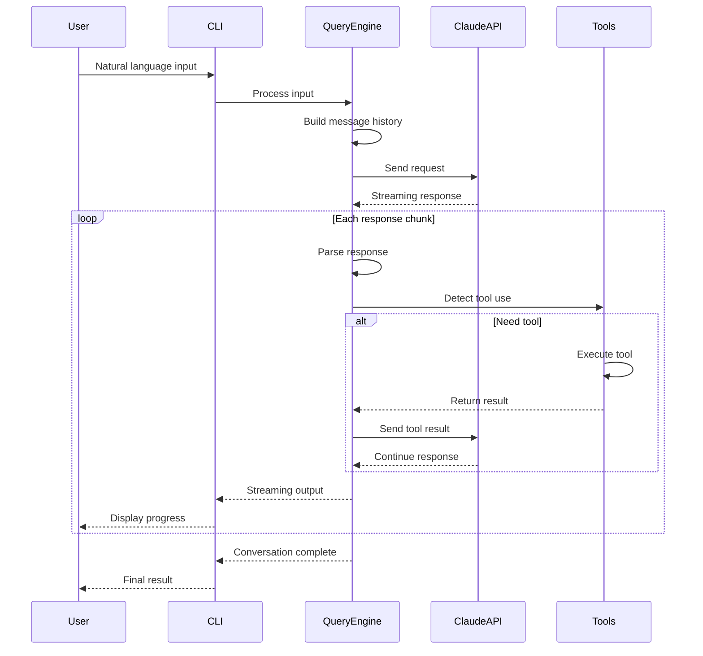

---

### 3.4.3 State Management Flow

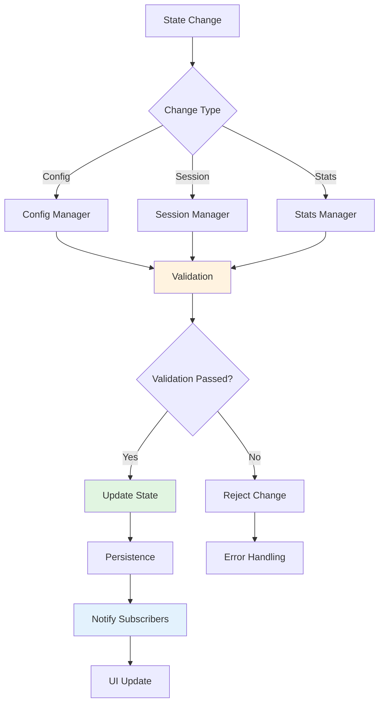

---

## 3.5 Design Principles

### 3.5.1 KISS (Keep It Simple, Stupid)

**Principle**: Keep it simple, avoid over-engineering.

**Application Example**:

```typescript
// ✅ Good: Simple and direct
function readFile(path: string): Promise<string> {
  return fs.readFile(path, 'utf-8')
}

// ❌ Bad: Over-complicated
class FileReadingOrchestrator {
  private readonly strategy: ReadingStrategy
  private readonly cache: CacheManager
  private readonly validator: PathValidator
  
  async orchestrateReadingOperation(
    path: string,
    options: ReadingOptions
  ): Promise<Result<string>> {
    // Too many abstraction layers...
  }
}
```

---

### 3.5.2 DRY (Don't Repeat Yourself)

**Principle**: Avoid repetition, extract commonalities.

**Application Example**:

```typescript
// ❌ Repeated code
function validateToolName(name: string): boolean {
  return name.length > 0 && name.length < 50
}

function validateCommandName(name: string): boolean {
  return name.length > 0 && name.length < 50
}

// ✅ Extract commonality
function validateName(name: string): boolean {
  return name.length > 0 && name.length < 50
}
```

---

### 3.5.3 SOLID Principles

**Single Responsibility Principle (SRP)**

```typescript
// ✅ Each class has only one responsibility
class QueryEngine {
  async query(messages: Message[]): Promise<Response> {
    // Only responsible for querying
  }
}

class ContextManager {
  compact(context: Context): Context {
    // Only responsible for context compression
  }
}
```

**Open-Closed Principle (OCP)**

```typescript
// ✅ Open for extension, closed for modification
interface Tool {
  execute(input: any): Promise<Result>
}

// Adding new tools doesn't require modifying existing code
class NewTool implements Tool {
  async execute(input: any): Promise<Result> {
    // New implementation
  }
}
```

**Dependency Inversion Principle (DIP)**

```typescript
// ✅ Depend on abstractions, not concrete implementations
interface PermissionService {
  check(tool: string): Promise<boolean>
}

class QueryEngine {
  constructor(
    private permissionService: PermissionService  // Depend on abstraction
  ) {}
}
```

---

### 3.5.4 YAGNI (You Aren't Gonna Need It)

**Principle**: Don't over-engineer, only implement currently needed features.

**Application Example**:

```typescript
// ❌ Over-engineering: Implement features that might never be used
interface Tool {
  execute(input: any): Promise<Result>
  rollback(): Promise<void>        // Might not need
  audit(): Promise<AuditLog>       // Might not need
  benchmark(): Promise<Metric>     // Might not need
}

// ✅ YAGNI: Only implement necessary features
interface Tool {
  execute(input: any): Promise<Result>
}
```

---

## 3.6 Concept Relationship Map

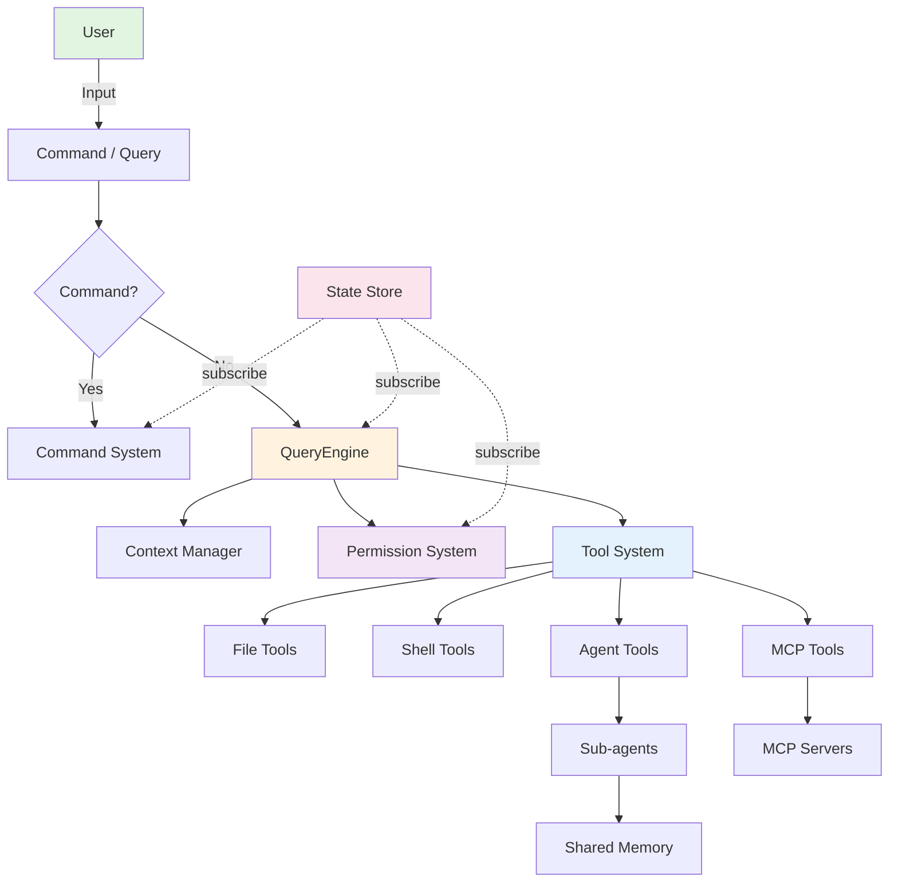

---

## 📊 Chapter Summary

### Core Concepts Summary

| Category | Core Concepts | Count |
|----------|--------------|-------|
| **Architecture Layer** | QueryEngine, Tool, Command, Permission | 4 |
| **Data Layer** | Context, State, Token Budget | 3 |
| **Extension Layer** | MCP, Agent, Plugin, Skill | 4 |
| **System Layer** | UI, Transport, Event, Hook | 4 |
| **Design Layer** | Patterns, Principles, Architecture | 3 |

**Total**: 30+ core concepts

### Concept Hierarchy

```
Level 1: Basic Concepts
  ├─ Tool
  ├─ Command
  └─ Permission

Level 2: Core Components
  ├─ QueryEngine
  ├─ Context
  └─ State

Level 3: Extension Mechanisms
  ├─ MCP
  ├─ Agent
  └─ Plugin

Level 4: Architecture Design
  ├─ Layered Architecture
  ├─ Event-Driven
  └─ Design Patterns
```

---

## 🎯 Learning Check

After completing this chapter, you should be able to:

- [ ] Explain QueryEngine's core responsibilities and workflow
- [ ] Describe the Tool interface and tool lifecycle
- [ ] Distinguish use cases for three permission modes
- [ ] Understand the necessity and strategies of context compression
- [ ] Master the basic architecture of MCP protocol
- [ ] Apply design principles to analyze code structure

---

## 🚀 Next Steps

**Next Chapter**: [Chapter 4: First Claude Application](../en/chapter4-first-app-EN.md)

**Learning Path**:

```
Chapter 1: Project Overview
  ↓
Chapter 2: Environment Setup
  ↓
Chapter 3: Core Concepts (This Chapter) ✅
  ↓
Chapter 4: First Application ← Next
  ↓
Chapter 5: QueryEngine Deep Dive
```

**Practice Recommendations**:

1. **Review Core Concepts**
   - Draw concept relationship diagrams
   - Write concept comparison tables
   - Summarize design principle applications

2. **Read Source Code**
   - View `src/Tool.ts` to understand tool implementation
   - View `src/QueryEngine.ts` to understand query flow
   - View `src/permissions/` to understand permission mechanism

3. **Prepare for Practice**
   - Familiarize with development environment
   - Understand project structure
   - Prepare to write your first application

---

## 📚 Further Reading

### Related Chapters
- **Prerequisite Chapter**: [Chapter 1: Project Overview and Background](../en/chapter1-introduction-EN.md)
- **Following Chapter**: [Chapter 4: First Claude Application](../en/chapter4-first-app-EN.md)
- **Deep Dive Chapter**: [Chapter 5: QueryEngine Deep Dive](../en/chapter5-queryengine-EN.md)

### External Resources
- [Design Patterns: Elements of Reusable Object-Oriented Software](https://refactoring.guru/design-patterns)
- [SOLID Principles](https://en.wikipedia.org/wiki/SOLID)
- [Event-Driven Architecture](https://martinfowler.com/articles/201701-event-driven.html)
- [MCP Protocol Specification](https://modelcontextprotocol.io)

---

## 🔗 Quick Reference

### Core Components

```typescript
// QueryEngine
await queryEngine.query([
  { role: 'user', content: 'Hello' }
])

// Tool
const tool = buildTool({
  name: 'MyTool',
  description: '...',
  inputSchema: z.object({}),
  async* execute(input, context) {
    yield { success: true }
  }
})

// Command
const command = {
  name: 'mycommand',
  description: '...',
  execute: async (params) => {
    // Implementation
  }
}
```

### Design Patterns

```typescript
// Singleton
class QueryEngine {
  private static instance: QueryEngine
  static getInstance(): QueryEngine {
    if (!QueryEngine.instance) {
      QueryEngine.instance = new QueryEngine()
    }
    return QueryEngine.instance
  }
}

// Builder
const tool = buildTool({
  name: '...',
  description: '...',
  // ...
})

// Strategy
interface PermissionStrategy {
  check(tool: string): Promise<boolean>
}
```

---

**Version**: 1.0.0  
**Last Updated**: 2026-04-03  
**Maintainer**: Claude Code Tutorial Team
