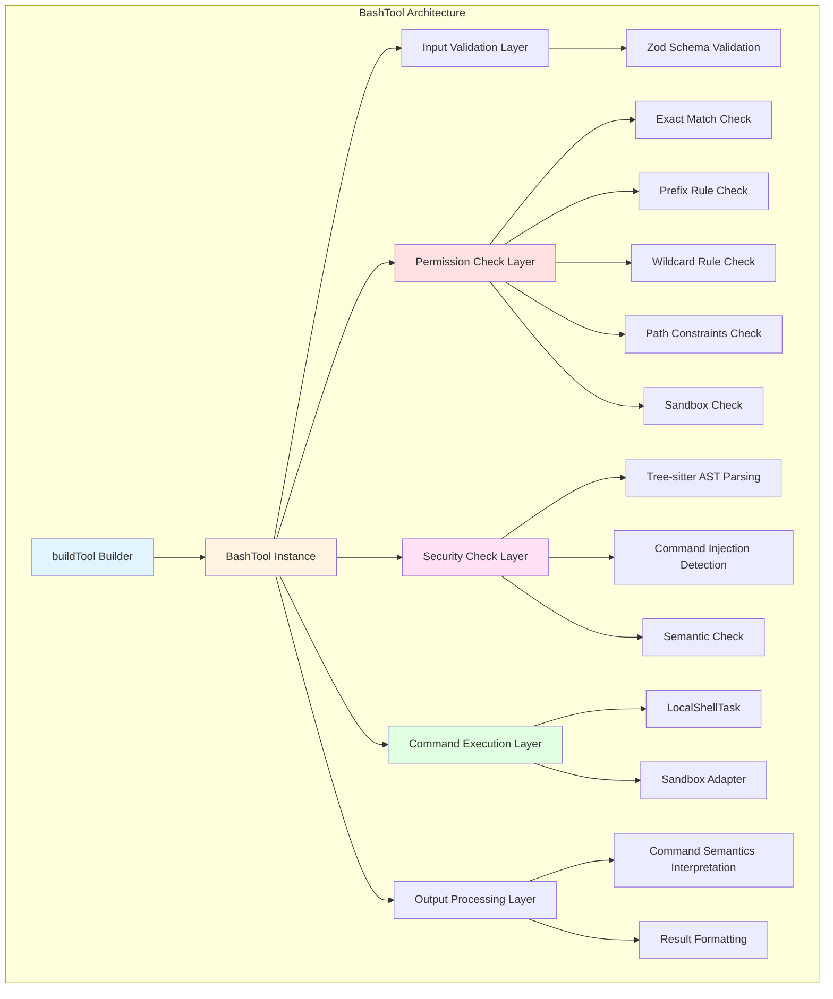
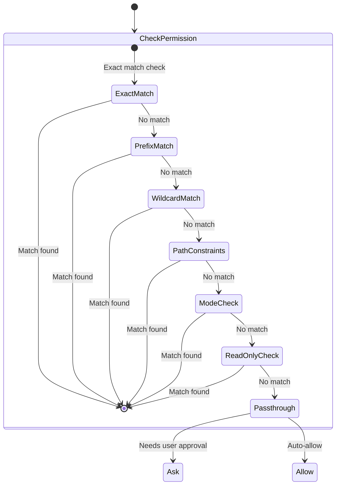
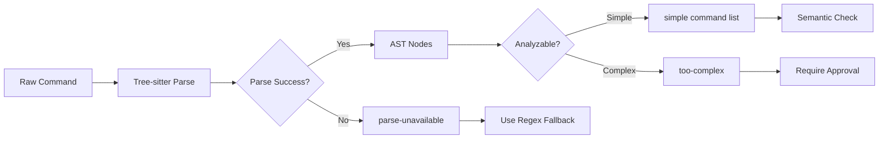
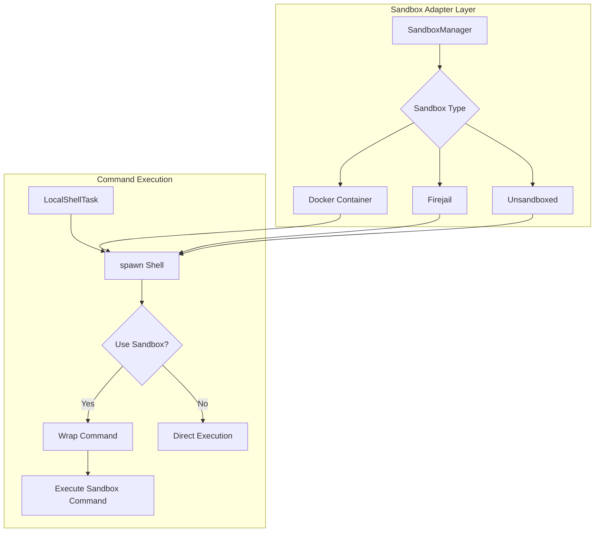
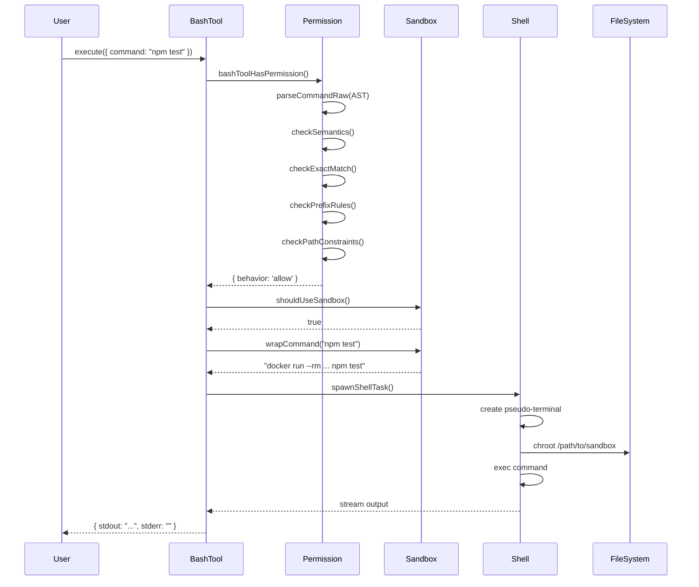

# Chapter 6: BashTool and Command Execution

## Overview

BashTool is one of the most core tools in Claude Code, responsible for safely executing shell commands. It not only provides command execution capabilities, but more importantly, constructs a multi-layered security protection system to ensure that AI assistants don't cause accidental damage to the system when executing commands.

This chapter will deeply analyze BashTool's implementation mechanisms, including:

- **Command Parsing and Security Checks**: How to use Tree-sitter AST to parse commands and detect potential injections
- **Permission System Integration**: Implementation of three-tier permission modes (default/auto/bypass)
- **Sandbox Isolation**: How to execute commands in restricted environments
- **Cross-platform Compatibility**: How to handle differences across operating systems
- **Command Semantics**: How to correctly interpret exit codes from different commands

## Architecture Design

### Overall Architecture



### Core Components

BashTool consists of the following core components:

1. **BashTool.tsx** (~1000 LOC): Main tool definition using `buildTool` builder pattern
2. **bashPermissions.ts** (~2600 LOC): Complete permission checking system
3. **bashSecurity.ts**: Command injection detection and security verification
4. **bashParser.ts**: Command parsing and tokenization
5. **bashCommandHelpers.ts**: Command operator handling
6. **commandSemantics.ts**: Command semantics interpretation
7. **SandboxManager**: Sandbox isolation management

## Source Code Analysis

### 1. BashTool Definition

```typescript
// src/tools/BashTool/BashTool.tsx
export const BashTool = buildTool({
  name: BASH_TOOL_NAME,
  searchHint: 'execute shell commands',
  maxResultSizeChars: 30_000,
  strict: true,
  
  // Dynamic description generation
  async description({ description }) {
    return description || 'Run shell command';
  },
  
  // Concurrency safety: read-only commands can execute concurrently
  isConcurrencySafe(input) {
    return this.isReadOnly?.(input) ?? false;
  },
  
  // Read-only command detection
  isReadOnly(input) {
    const compoundCommandHasCd = commandHasAnyCd(input.command);
    const result = checkReadOnlyConstraints(input, compoundCommandHasCd);
    return result.behavior === 'allow';
  },
  
  // Input Schema (using Zod validation)
  get inputSchema() {
    return z.strictObject({
      command: z.string(),
      timeout: z.number().optional(),
      description: z.string().optional(),
      run_in_background: z.boolean().optional(),
      dangerouslyDisableSandbox: z.boolean().optional(),
    });
  },
  
  // Output Schema
  get outputSchema() {
    return z.object({
      stdout: z.string(),
      stderr: z.string(),
      rawOutputPath: z.string().optional(),
      interrupted: z.boolean(),
      backgroundTaskId: z.string().optional(),
      returnCodeInterpretation: z.string().optional(),
      noOutputExpected: z.boolean().optional(),
    });
  },
  
  // Permission check hook
  async hasPermission(input, context) {
    return bashToolHasPermission(input, context);
  },
  
  // Core execution logic
  async *execute(input, context, options) {
    // Implementation details below
  },
});
```

**Design Points:**

- **Builder Pattern**: Uses `buildTool` for unified tool definition interface
- **Schema Validation**: Uses Zod for runtime type validation, ensuring input/output safety
- **Concurrency Control**: Read-only commands can execute concurrently for better performance
- **Permission Hook**: Permission checking before execution for security protection

### 2. Input Schema Design

```typescript
const fullInputSchema = z.strictObject({
  command: z.string().describe(
    'The command to execute'
  ),
  
  timeout: semanticNumber(z.number().optional()).describe(
    `Optional timeout in milliseconds (max ${getMaxTimeoutMs()})`
  ),
  
  description: z.string().optional().describe(
    `Clear, concise description of what this command does in active voice.`
  ),
  
  run_in_background: semanticBoolean(z.boolean().optional()).describe(
    'Set to true to run this command in the background.'
  ),
  
  dangerouslyDisableSandbox: semanticBoolean(z.boolean().optional()).describe(
    'Set this to true to dangerously override sandbox mode.'
  ),
  
  // Internal field: simulated sed edit result
  _simulatedSedEdit: z.object({
    filePath: z.string(),
    newContent: z.string()
  }).optional(),
});
```

**Design Points:**

1. **Semantic Validation**: Uses `semanticNumber` and `semanticBoolean` to support natural language input (e.g., "yes", "true", "1")
2. **Dangerous Operation Marking**: `dangerouslyDisableSandbox` field name clearly indicates risk
3. **Internal Field Hiding**: `_simulatedSedEdit` not exposed to model to prevent bypassing permission checks
4. **Strict Object**: Uses `strictObject` to reject extra fields, preventing injection attacks

## Permission Check System

### Three-Tier Permission Modes



### Permission Check Flow

```typescript
// src/tools/BashTool/bashPermissions.ts
export async function bashToolHasPermission(
  input: z.infer<typeof BashTool.inputSchema>,
  context: ToolUseContext,
): Promise<PermissionResult> {
  
  // 1. AST Security Parsing
  const astRoot = await parseCommandRaw(input.command);
  let astResult = astRoot 
    ? parseForSecurityFromAst(input.command, astRoot)
    : { kind: 'parse-unavailable' };
  
  // 2. Handle overly complex commands
  if (astResult.kind === 'too-complex') {
    return {
      behavior: 'ask',
      decisionReason: {
        type: 'other',
        reason: astResult.reason,
      },
      message: createPermissionRequestMessage(BashTool.name),
    };
  }
  
  // 3. Semantic-level checks
  if (astResult.kind === 'simple') {
    const sem = checkSemantics(astResult.commands);
    if (!sem.ok) {
      return {
        behavior: 'ask',
        decisionReason: {
          type: 'other',
          reason: sem.reason,
        },
        message: createPermissionRequestMessage(BashTool.name),
      };
    }
  }
  
  // 4. Check sandbox auto-allow
  if (SandboxManager.isSandboxingEnabled() &&
      SandboxManager.isAutoAllowBashIfSandboxedEnabled()) {
    const sandboxResult = checkSandboxAutoAllow(
      input,
      appState.toolPermissionContext
    );
    if (sandboxResult.behavior !== 'passthrough') {
      return sandboxResult;
    }
  }
  
  // 5. Exact match check
  const exactMatchResult = bashToolCheckExactMatchPermission(
    input,
    appState.toolPermissionContext
  );
  if (exactMatchResult.behavior === 'deny') {
    return exactMatchResult;
  }
  
  // 6. Classifier check (using AI model)
  if (isClassifierPermissionsEnabled()) {
    const classifierResult = await classifyBashCommand(
      input.command,
      getCwd(),
      descriptions,
      behavior,
      signal
    );
    
    if (classifierResult.matches && 
        classifierResult.confidence === 'high') {
      return {
        behavior: behavior, // 'deny' or 'ask'
        decisionReason: {
          type: 'classifier',
          classifier: 'bash_allow',
          reason: `Allowed/Denied by prompt rule: "${classifierResult.matchedDescription}"`,
        },
      };
    }
  }
  
  // 7. Command operator check (pipes, redirects, etc.)
  const operatorResult = await checkCommandOperatorPermissions(
    input,
    bashToolHasPermission,
    astRoot
  );
  if (operatorResult.behavior !== 'passthrough') {
    return operatorResult;
  }
  
  // 8. Split subcommands and check each
  const subcommands = splitCommand(input.command);
  const subcommandResults = new Map<string, PermissionResult>();
  
  for (const subcommand of subcommands) {
    const result = await bashToolCheckPermission(
      { command: subcommand },
      appState.toolPermissionContext
    );
    subcommandResults.set(subcommand, result);
  }
  
  // 9. Aggregate subcommand results
  const deniedSubresult = Array.from(subcommandResults.values())
    .find(r => r.behavior === 'deny');
  if (deniedSubresult) {
    return {
      behavior: 'deny',
      decisionReason: {
        type: 'subcommandResults',
        reasons: subcommandResults,
      },
    };
  }
  
  const askSubresult = Array.from(subcommandResults.values())
    .find(r => r.behavior === 'ask');
  if (askSubresult) {
    return {
      behavior: 'ask',
      decisionReason: {
        type: 'subcommandResults',
        reasons: subcommandResults,
      },
      suggestions: generateSuggestions(subcommandResults),
    };
  }
  
  // 10. All allowed
  return {
    behavior: 'allow',
    updatedInput: input,
    decisionReason: {
      type: 'subcommandResults',
      reasons: subcommandResults,
    },
  };
}
```

**Permission Check Order (Important):**

1. **Deny Rules First**: Any matching deny rule returns immediately
2. **Ask Rules Second**: No deny, but has ask rules
3. **Allow Rules Last**: Only checked if no deny/ask
4. **Path Constraints**: Path constraint checking
5. **Mode Check**: auto/bypass/default modes
6. **Read-only Check**: Read-only commands auto-allow

### Permission Rule Types

```typescript
type ShellPermissionRule =
  | { type: 'exact'; command: string }
  | { type: 'prefix'; prefix: string }
  | { type: 'wildcard'; pattern: string }

// Examples:
// exact: "npm test"
// prefix: "npm run:*"
// wildcard: "git *"
```

**Matching Logic:**

```typescript
function filterRulesByContentsMatchingInput(
  input: z.infer<typeof BashTool.inputSchema>,
  rules: Map<string, PermissionRule>,
  matchMode: 'exact' | 'prefix',
): PermissionRule[] {
  const command = input.command.trim();
  
  // Strip output redirections
  const { commandWithoutRedirections } = 
    extractOutputRedirections(command);
  
  // Strip safe wrappers (timeout, time, nice, nohup)
  const strippedCommand = stripSafeWrappers(commandWithoutRedirections);
  
  return Array.from(rules.entries()).filter(([ruleContent]) => {
    const bashRule = bashPermissionRule(ruleContent);
    
    switch (bashRule.type) {
      case 'exact':
        return bashRule.command === strippedCommand;
      
      case 'prefix':
        // Ensure word boundary: prefix must be followed by space or end
        return strippedCommand === bashRule.prefix ||
               strippedCommand.startsWith(bashRule.prefix + ' ');
      
      case 'wildcard':
        return matchWildcardPattern(bashRule.pattern, strippedCommand);
    }
  }).map(([, rule]) => rule);
}
```

## Security Check Mechanisms

### Tree-sitter AST Parsing



**Why Tree-sitter?**

1. **Correctness**: Complete understanding of Shell syntax, avoiding regex false positives
2. **Security**: Detect command injection (`$()`, `` ` ``, `\$(...)`)
3. **Structured**: Provides AST for precise analysis
4. **Cross-platform**: Supports bash, zsh, fish and more

```typescript
// Parse command with Tree-sitter
const astRoot = await parseCommandRaw(input.command);

if (astResult.kind === 'simple') {
  // Successfully parsed as simple command list
  const commands = astResult.commands; // SimpleCommand[]
  
  // Each command contains:
  // - argv: Parameter array (quotes processed)
  // - redirects: Redirect list
  // - envVars: Environment variable assignments
  // - text: Original source code fragment
  
  for (const cmd of commands) {
    console.log('Command:', cmd.argv);
    console.log('Redirects:', cmd.redirects);
  }
}
```

### Command Injection Detection

```typescript
// src/tools/BashTool/bashSecurity.ts
export async function bashCommandIsSafeAsync(
  command: string,
  onDivergence?: () => void,
): Promise<{
  behavior: 'allow' | 'ask' | 'passthrough';
  message?: string;
  isBashSecurityCheckForMisparsing?: boolean;
}> {
  const checks = [
    checkForBacktickSubstitution,
    checkForCommandSubstitution,
    checkForArithmeticExpansion,
    checkForTildeExpansion,
    checkForProcessSubstitution,
    checkForCommandChaining,
    checkForRedirectionInjection,
  ];
  
  for (const check of checks) {
    const result = await check(command);
    if (!result.safe) {
      return {
        behavior: 'ask',
        message: result.reason,
      };
    }
  }
  
  return {
    behavior: 'passthrough',
  };
}

// Detect command substitution $(...)
function checkForCommandSubstitution(command: string): SafetyCheckResult {
  // Detect $() and $((...) forms
  const pattern = /\$\([^)]*\)/;
  if (pattern.test(command)) {
    return {
      safe: false,
      reason: 'Command substitution detected. This could lead to command injection.',
    };
  }
  return { safe: true };
}

// Detect backtick command substitution
function checkForBacktickSubstitution(command: string): SafetyCheckResult {
  const pattern = /`[^`]*`/;
  if (pattern.test(command)) {
    return {
      safe: false,
      reason: 'Backtick command substitution detected.',
    };
  }
  return { safe: true };
}
```

### Semantic-level Checks

```typescript
// src/utils/bash/ast.ts - checkSemantics
export function checkSemantics(
  commands: SimpleCommand[]
): { ok: true } | { ok: false; reason: string } {
  
  for (const cmd of commands) {
    const baseCommand = cmd.argv[0];
    
    // Dangerous command blacklist
    const DANGEROUS_COMMANDS = new Set([
      'eval',      // Execute arbitrary code
      'exec',      // Replace process
      ':>',        // Empty output redirect (might overwrite files)
    ]);
    
    if (DANGEROUS_COMMANDS.has(baseCommand)) {
      return {
        ok: false,
        reason: `Command '${baseCommand}' is not allowed for security reasons.`,
      };
    }
    
    // Detect shell-specific builtins
    if (ZSH_BUILTINS.has(baseCommand)) {
      return {
        ok: false,
        reason: `Zsh-specific builtin '${baseCommand}' detected. Use bash-compatible commands.`,
      };
    }
  }
  
  return { ok: true };
}
```

### Safe Wrapper Stripping

```typescript
// src/tools/BashTool/bashPermissions.ts
export function stripSafeWrappers(command: string): string {
  const SAFE_WRAPPER_PATTERNS = [
    // timeout: supports various flag combinations
    /^timeout[ \t]+(?:(?:--(?:foreground|preserve-status|verbose)|...)+[ \t]+)*(?:--[ \t]+)?\d+(?:\.\d+)?[smhd]?[ \t]+/,
    /^time[ \t]+(?:--[ \t]+)?/,
    /^nice(?:[ \t]+-n[ \t]+-?\d+|[ \t]+-\d+)?[ \t]+(?:--[ \t]+)?/,
    /^stdbuf(?:[ \t]+-[ioe][LN0-9]+)+[ \t]+(?:--[ \t]+)?/,
    /^nohup[ \t]+(?:--[ \t]+)?/,
  ];
  
  const ENV_VAR_PATTERN = /^([A-Za-z_][A-Za-z0-9_]*)=([A-Za-z0-9_./:-]+)[ \t]+/;
  const SAFE_ENV_VARS = new Set([
    'NODE_ENV', 'RUST_BACKTRACE', 'LANG', 'TERM', 'TZ', ...
  ]);
  
  let stripped = command;
  let previousStripped = '';
  
  // Phase 1: Strip environment variables
  while (stripped !== previousStripped) {
    previousStripped = stripped;
    const envVarMatch = stripped.match(ENV_VAR_PATTERN);
    if (envVarMatch) {
      const varName = envVarMatch[1];
      if (SAFE_ENV_VARS.has(varName)) {
        stripped = stripped.replace(ENV_VAR_PATTERN, '');
      }
    }
  }
  
  // Phase 2: Strip wrapper commands
  previousStripped = '';
  while (stripped !== previousStripped) {
    previousStripped = stripped;
    for (const pattern of SAFE_WRAPPER_PATTERNS) {
      stripped = stripped.replace(pattern, '');
    }
  }
  
  return stripped.trim();
}
```

**Why Strip Wrappers?**

- **timeout 10 npm install** → actual command is `npm install`
- **NODE_ENV=prod node server** → environment variables don't affect permission checks
- After stripping, it can correctly match `Bash(npm install:*)` rules

## Sandbox Isolation

### Sandbox Architecture



### Sandbox Auto-allow

```typescript
function checkSandboxAutoAllow(
  input: z.infer<typeof BashTool.inputSchema>,
  toolPermissionContext: ToolPermissionContext,
): PermissionResult {
  const command = input.command.trim();
  
  // 1. Check explicit deny/ask rules for full command
  const { matchingDenyRules, matchingAskRules } = 
    matchingRulesForInput(input, toolPermissionContext, 'prefix');
  
  if (matchingDenyRules[0] !== undefined) {
    return {
      behavior: 'deny',
      message: `Permission denied for: ${command}`,
      decisionReason: { type: 'rule', rule: matchingDenyRules[0] },
    };
  }
  
  // 2. For compound commands, check each subcommand
  const subcommands = splitCommand(command);
  if (subcommands.length > 1) {
    for (const sub of subcommands) {
      const subResult = matchingRulesForInput(
        { command: sub },
        toolPermissionContext,
        'prefix'
      );
      
      if (subResult.matchingDenyRules[0] !== undefined) {
        return {
          behavior: 'deny',
          message: `Permission denied for subcommand: ${sub}`,
        };
      }
    }
  }
  
  if (matchingAskRules[0] !== undefined) {
    return {
      behavior: 'ask',
      message: createPermissionRequestMessage(BashTool.name),
    };
  }
  
  // 3. No explicit rules, sandbox auto-allow
  return {
    behavior: 'allow',
    updatedInput: input,
    decisionReason: {
      type: 'other',
      reason: 'Auto-allowed with sandbox (autoAllowBashIfSandboxed enabled)',
    },
  };
}
```

**Sandbox Security Points:**

1. **Respect Explicit Rules**: Deny rules still apply even with `autoAllowBashIfSandboxed`
2. **Subcommand Checks**: Each subcommand in compound commands is checked
3. **Sandbox Escape Prevention**: Commands like `sudo`, `doas`, `pkexec` are blocked

## Command Execution Flow

### Execution Sequence Diagram



### Core Execution Logic

```typescript
// Simplified execution flow
async function executeBashCommand(
  input: BashToolInput,
  context: ToolUseContext
): AsyncGenerator<ToolCallProgress, Out> {
  
  // 1. Check if sandbox should be used
  const useSandbox = shouldUseSandbox(input);
  
  // 2. Prepare command
  let command = input.command;
  if (useSandbox) {
    command = SandboxManager.wrapCommand(command);
  }
  
  // 3. Create shell task
  const task = await spawnShellTask({
    command,
    cwd: getCwd(),
    timeout: input.timeout || getDefaultTimeoutMs(),
    env: process.env,
  });
  
  // 4. Stream output
  const accumulator = new EndTruncatingAccumulator({
    maxSize: TOOL_SUMMARY_MAX_LENGTH,
  });
  
  try {
    for await (const line of task.output) {
      accumulator.append(line);
      
      yield {
        type: 'progress',
        content: line,
      };
    }
    
    // 5. Get final result
    const result = await task.waitForCompletion();
    
    return {
      stdout: accumulator.toString(),
      stderr: result.stderr,
      interrupted: result.interrupted,
      returnCodeInterpretation: interpretCommandResult(
        command,
        result.exitCode,
        result.stdout,
        result.stderr
      ).message,
    };
    
  } catch (error) {
    if (error instanceof ShellError) {
      return {
        stdout: accumulator.toString(),
        stderr: error.message,
        interrupted: false,
      };
    }
    throw error;
  }
}
```

## Command Semantics

### Command Semantics Configuration

```typescript
// src/tools/BashTool/commandSemantics.ts
const COMMAND_SEMANTICS: Map<string, CommandSemantic> = new Map([
  // grep: 0=found, 1=not found, 2+=error
  ['grep', (exitCode, _stdout, _stderr) => ({
    isError: exitCode >= 2,
    message: exitCode === 1 ? 'No matches found' : undefined,
  })],
  
  // diff: 0=same, 1=different, 2+=error
  ['diff', (exitCode, _stdout, _stderr) => ({
    isError: exitCode >= 2,
    message: exitCode === 1 ? 'Files differ' : undefined,
  })],
  
  // test/[: 0=condition true, 1=condition false, 2+=error
  ['test', (exitCode, _stdout, _stderr) => ({
    isError: exitCode >= 2,
    message: exitCode === 1 ? 'Condition is false' : undefined,
  })],
]);
```

**Why Need Semantics?**

- **grep returns 1**: No matches found, not an error
- **diff returns 1**: Files differ, not an error
- **test returns 1**: Condition is false, not an error

Without semantics, these normal cases would be incorrectly marked as failures.

## Cross-platform Compatibility

### Path Handling

```typescript
// Windows path conversion
function windowsPathToPosixPath(path: string): string {
  // C:\Users\Ken → /c/Users/Ken
  return path.replace(/^([A-Z]):\\/, '/$1/')
               .replace(/\\/g, '/');
}

// Path expansion (supports ~ and environment variables)
function expandPath(path: string): string {
  // ~/project → /home/user/project
  // $HOME/project → /home/user/project
  return path.replace(/^~\//, `${process.env.HOME}/`)
             .replace(/\$HOME\//g, `${process.env.HOME}/`);
}
```

### Shell Detection

```typescript
function detectShell(): string {
  if (process.platform === 'win32') {
    return process.env.COMSPEC || 'cmd.exe';
  }
  
  // Prefer bash
  if (process.env.SHELL?.includes('bash')) {
    return 'bash';
  }
  
  // Fallback to sh
  return 'sh';
}
```

## Security Best Practices

### 1. Defense in Depth

BashTool employs multi-layer defense:

```
┌─────────────────────────────────────┐
│  User Confirmation Layer            │
├─────────────────────────────────────┤
│  Permission Rules Layer             │
├─────────────────────────────────────┤
│  AI Classifier Layer (Haiku)        │
├─────────────────────────────────────┤
│  Semantic Check Layer               │
├─────────────────────────────────────┤
│  AST Parsing Layer (Tree-sitter)    │
├─────────────────────────────────────┤
│  Sandbox Isolation Layer            │
└─────────────────────────────────────┘
```

### 2. Principle of Least Privilege

- **Default Deny**: No explicit allow means deny
- **Read-First**: Read-only commands can auto-allow
- **Exact First**: Exact rules take precedence over prefix rules

### 3. Fail-Safe

```typescript
// Cannot parse → require approval
if (astResult.kind === 'parse-unavailable') {
  return {
    behavior: 'ask',
    reason: 'Cannot verify command safety',
  };
}

// Check timeout → require approval
if (parseTimeout) {
  return {
    behavior: 'ask',
    reason: 'Command analysis timed out',
  };
}
```

## Performance Optimization

### 1. Rule Matching Optimization

```typescript
// Pre-compute compound command status
const isCompoundCommand = new Map<string, boolean>();

for (const cmd of commandsToTry) {
  if (!isCompoundCommand.has(cmd)) {
    isCompoundCommand.set(cmd, splitCommand(cmd).length > 1);
  }
}

// Avoid re-parsing
```

### 2. Parallel Checks

```typescript
// Deny and Ask checks in parallel
const [denyResult, askResult] = await Promise.all([
  classifyBashCommand(command, cwd, denyDescriptions, 'deny'),
  classifyBashCommand(command, cwd, askDescriptions, 'ask'),
]);
```

### 3. Early Exit

```typescript
// Once deny is found, return immediately
if (matchingDenyRules[0] !== undefined) {
  return {
    behavior: 'deny',
    message: 'Permission denied',
  };
}
```

## Complete Examples

### Example 1: Simple Command

```typescript
// Input
{
  "command": "npm test",
  "description": "Run test suite"
}

// Permission check flow
1. AST Parse: ✓ simple
2. Semantic check: ✓ (npm is safe command)
3. Exact match: ✗ (no exact rule)
4. Prefix match: ✓ (Bash(npm test:*) exists)
5. Sandbox check: ✓ (not enabled)
6. Result: allow

// Execute
$ npm test
> test
> PASS

// Output
{
  "stdout": "> test\n> PASS\n",
  "stderr": "",
  "interrupted": false,
  "returnCodeInterpretation": undefined
}
```

### Example 2: Compound Command

```typescript
// Input
{
  "command": "cd src && npm run build && cd ..",
  "description": "Build project"
}

// Permission check flow
1. AST Parse: ✓ simple
2. Split subcommands: ["cd src", "npm run build", "cd .."]
3. Check each subcommand:
   - "cd src": ✓ (within project)
   - "npm run build": ✓ (matches Bash(npm run:*) )
   - "cd ..": ✓ (relative path)
4. Check cd+git: ✗ (no git command)
5. Check multi-cd: ✓ (only 2 cd commands)
6. Result: ask (needs approval)

// After user approval, execute
$ cd src && npm run build && cd ..
> build
> Built in 2.3s

// Output
{
  "stdout": "> build\n> Built in 2.3s\n",
  "stderr": "",
  "interrupted": false
}
```

### Example 3: Pipeline Command

```typescript
// Input
{
  "command": "cat file.txt | grep pattern | head -10",
  "description": "Search for pattern in file"
}

// Permission check flow
1. Detect pipes: ✓ (3 segments)
2. Split segments: ["cat file.txt", "grep pattern", "head -10"]
3. Check each segment:
   - "cat file.txt": ✓ (read-only)
   - "grep pattern": ✓ (read-only)
   - "head -10": ✓ (read-only)
4. All read-only: allow
5. Result: allow (auto-allow)

// Execute
$ cat file.txt | grep pattern | head -10
line 1: pattern found
line 2: pattern found
...

// Output
{
  "stdout": "line 1: pattern found\nline 2: pattern found\n...",
  "stderr": "",
  "interrupted": false
}
```

## Debugging and Troubleshooting

### Enable Debug Logging

```bash
# Set environment variables
export CLAUDE_CODE_DEBUG=bash
export CLAUDE_CODE_DISABLE_COMMAND_INJECTION_CHECK=false

# Run Claude Code
claude-code
```

### Common Issues

**Q: Command denied without clear reason?**

A: Check the following:
1. Is there a `Bash(*:*)` deny rule?
2. Does the command contain dangerous subcommands?
3. Is the command trying to access paths outside the project?

**Q: Sandbox command execution fails?**

A: Confirm:
1. Docker/Firejail is correctly installed
2. Sandbox configuration is correct
3. Command is in the sandbox whitelist

**Q: Compound command permission check too slow?**

A: Consider:
1. Use prefix rules instead of exact rules
2. Reduce number of subcommands
3. Enable sandbox auto-allow

## Summary

BashTool is a well-designed command execution tool that ensures safety through the following mechanisms:

1. **Multi-layer Security Checks**: Permission rules → AI classifier → Semantic checks → AST parsing → Sandbox isolation
2. **Tree-sitter AST**: Accurately parses Shell syntax, detects command injection
3. **Permission System Integration**: Supports exact/prefix/wildcard rules
4. **Sandbox Isolation**: Execute dangerous commands in restricted environments
5. **Command Semantics**: Correctly interprets exit codes from different commands
6. **Cross-platform Compatibility**: Handles Windows/macOS/Linux differences

**Key Design Principles:**

- **Defense in Depth**: Multi-layer security mechanisms
- **Least Privilege**: Default deny, explicit allow
- **Fail-Safe**: Require approval when cannot verify
- **User Control**: Provide fine-grained permission configuration

BashTool's implementation demonstrates how to ensure system security while providing powerful functionality, which has important reference value for building AI-driven development tools.

## Further Reading

- **Tree-sitter Official Documentation**: https://tree-sitter.github.io/tree-sitter/
- **Bash Reference Manual**: https://www.gnu.org/software/bash/manual/
- **Docker Security Best Practices**: https://docs.docker.com/engine/security/
- **Shell Script Security Guide**: https://shellcheck.net/

## Next Chapter

Chapter 7 will dive into **Tool System (Tool System Architecture)**, introducing the design and organization of 60+ tools in Claude Code.
