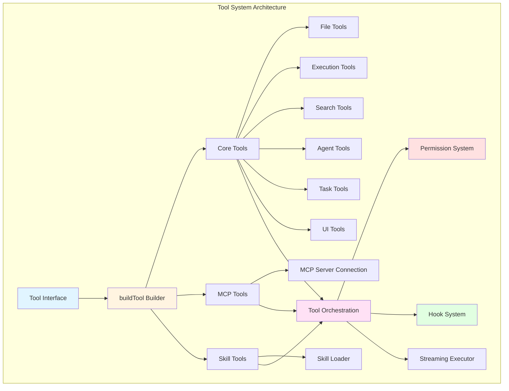
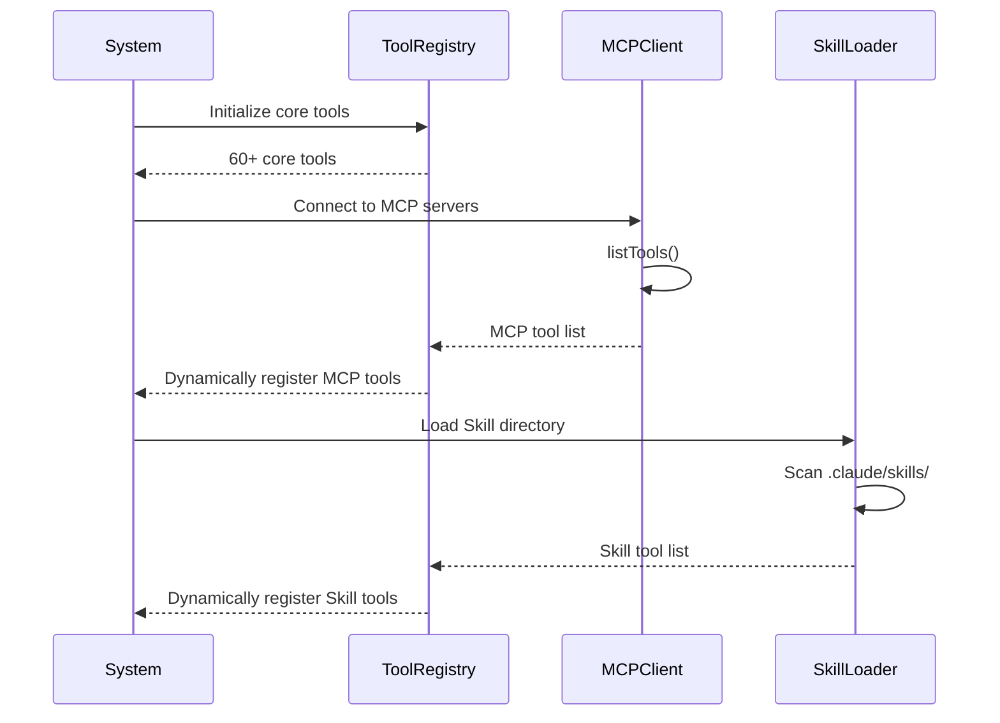
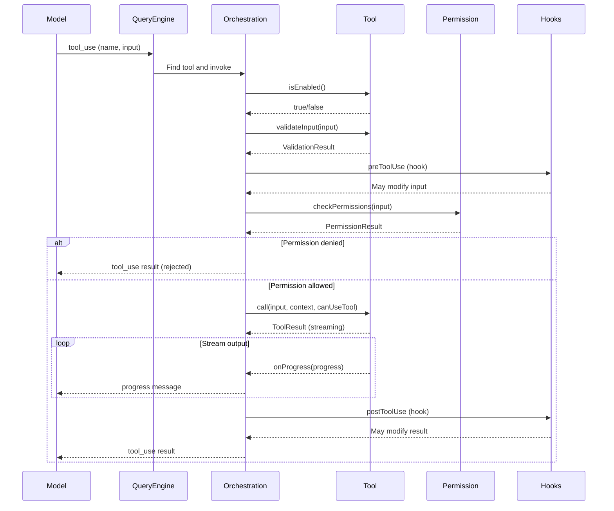
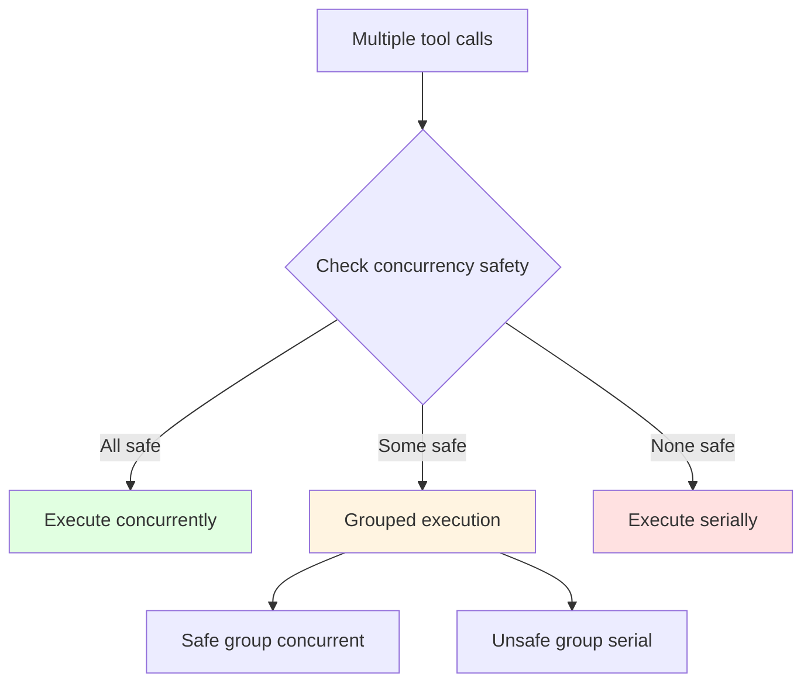

# Chapter 7: Tool System Architecture

## Overview

Claude Code's tool system is one of its core capabilities, providing 60+ carefully designed tools covering file operations, command execution, code analysis, team collaboration, task management, and more. This chapter will deeply analyze the tool system's architecture design, interface definitions, extension mechanisms, and best practices.

**Chapter Highlights:**

- **Tool Interface Design**: Unified tool definition interface and builder pattern
- **Tool Classification**: Functional categorization and organization of 60+ tools
- **Lifecycle Management**: Tool registration, lookup, and invocation flow
- **Permission System Integration**: Tool-level permission control
- **Extension Mechanisms**: How to add custom tools (MCP, Skill)
- **Concurrency Control**: Safety guarantees for tool execution

## Architecture Overview

### Overall Architecture



### Core Components

1. **Tool.ts**: Core interface definitions and type system
2. **buildTool**: Tool builder providing default implementations
3. **toolOrchestration.ts**: Tool orchestration and execution logic
4. **toolExecution.ts**: Tool executor
5. **toolHooks.ts**: Tool hook system
6. **MCPTool**: MCP protocol adapter
7. **SkillTool**: Skill loader

## Tool Interface Design

### Core Tool Type

```typescript
// src/Tool.ts
export type Tool<
  Input extends AnyObject = AnyObject,
  Output = unknown,
  P extends ToolProgressData = ToolProgressData,
> = {
  // Basic metadata
  name: string
  aliases?: string[]
  searchHint?: string
  
  // Schema definitions
  readonly inputSchema: Input
  readonly inputJSONSchema?: ToolInputJSONSchema
  outputSchema?: z.ZodType<unknown>
  
  // Core methods
  call(
    args: z.infer<Input>,
    context: ToolUseContext,
    canUseTool: CanUseToolFn,
    parentMessage: AssistantMessage,
    onProgress?: ToolCallProgress<P>,
  ): Promise<ToolResult<Output>>
  
  description(
    input: z.infer<Input>,
    options: {
      isNonInteractiveSession: boolean
      toolPermissionContext: ToolPermissionContext
      tools: Tools
    },
  ): Promise<string>
  
  prompt(options: {
    getToolPermissionContext: () => Promise<ToolPermissionContext>
    tools: Tools
    agents: AgentDefinition[]
  }): Promise<string>
  
  // Security methods
  isEnabled(): boolean
  isConcurrencySafe(input: z.infer<Input>): boolean
  isReadOnly(input: z.infer<Input>): boolean
  isDestructive?(input: z.infer<Input>): boolean
  validateInput?(
    input: z.infer<Input>,
    context: ToolUseContext,
  ): Promise<ValidationResult>
  checkPermissions(
    input: z.infer<Input>,
    context: ToolUseContext,
  ): Promise<PermissionResult>
  
  // UI rendering methods
  renderToolUseMessage(
    input: Partial<z.infer<Input>>,
    options: { theme: ThemeName; verbose: boolean },
  ): React.ReactNode
  
  renderToolResultMessage?(
    content: Output,
    progressMessages: ProgressMessage<P>[],
    options: {
      style?: 'condensed'
      theme: ThemeName
      tools: Tools
      verbose: boolean
    },
  ): React.ReactNode
  
  renderToolUseProgressMessage?(
    progressMessages: ProgressMessage<P>[],
    options: {
      tools: Tools
      verbose: boolean
    },
  ): React.ReactNode
  
  // Advanced features
  interruptBehavior?(): 'cancel' | 'block'
  isSearchOrReadCommand?(input: z.infer<Input>): {
    isSearch: boolean
    isRead: boolean
    isList?: boolean
  }
  isOpenWorld?(input: z.infer<Input>): boolean
  requiresUserInteraction?(): boolean
  shouldDefer?: boolean
  alwaysLoad?: boolean
  maxResultSizeChars: number
  strict?: boolean
}
```

### Design Points

**1. Generic Design**

```typescript
Tool<Input, Output, Progress>
```

- **Input**: Zod Schema for input parameters
- **Output**: Output result type
- **Progress**: Progress data type

**2. Optional Methods**

Most methods are optional, with only core methods required:

```typescript
// Required methods
call()          // Execute tool
description()   // Generate description
prompt()        // Generate prompt
inputSchema     // Input Schema

// Optional methods (have defaults)
isEnabled()             // Default: true
isConcurrencySafe()     // Default: false
isReadOnly()            // Default: false
checkPermissions()      // Default: allow
userFacingName()        // Default: use name
```

**3. Type Safety**

```typescript
// Input type automatically inferred
type Input = z.infer<typeof tool.inputSchema>

// Output type explicitly specified in call() method
async function call(
  args: Input,  // Type-safe input
  ...
): Promise<ToolResult<Output>>
```

## buildTool Builder

### Builder Pattern

```typescript
// src/Tool.ts
type DefaultableToolKeys =
  | 'isEnabled'
  | 'isConcurrencySafe'
  | 'isReadOnly'
  | 'isDestructive'
  | 'checkPermissions'
  | 'toAutoClassifierInput'
  | 'userFacingName'

const TOOL_DEFAULTS = {
  isEnabled: () => true,
  isConcurrencySafe: (_input?: unknown) => false,
  isReadOnly: (_input?: unknown) => false,
  isDestructive: (_input?: unknown) => false,
  checkPermissions: (
    input: { [key: string]: unknown },
    _ctx?: ToolUseContext,
  ): Promise<PermissionResult> =>
    Promise.resolve({ behavior: 'allow', updatedInput: input }),
  toAutoClassifierInput: (_input?: unknown) => '',
  userFacingName: (_input?: unknown) => '',
}

export function buildTool<D extends AnyToolDef>(def: D): BuiltTool<D> {
  return {
    ...TOOL_DEFAULTS,
    userFacingName: () => def.name,
    ...def,
  } as BuiltTool<D>
}
```

**Default Value Strategy (Fail-Closed)**

| Method | Default | Rationale |
|--------|---------|-----------|
| `isEnabled` | `true` | Enabled by default, explicitly disabled |
| `isConcurrencySafe` | `false` | Assume unsafe, explicitly mark safe |
| `isReadOnly` | `false` | Assume writes, must mark read-only |
| `isDestructive` | `false` | Default non-destructive |
| `checkPermissions` | `allow` | Delegate to global permission system |

### Usage Example

```typescript
// Simple tool (define only required parts)
export const SimpleTool = buildTool({
  name: 'simple_tool',
  inputSchema: z.strictObject({
    message: z.string(),
  }),
  
  async call(input, context, canUseTool, parentMessage) {
    return {
      data: { result: `Hello ${input.message}` },
    };
  },
  
  async description() {
    return 'A simple example tool';
  },
  
  async prompt() {
    return 'Use this tool to greet users';
  },
});

// Complete tool (override all methods)
export const CompleteTool = buildTool({
  name: 'complete_tool',
  searchHint: 'perform complex operations',
  maxResultSizeChars: 30_000,
  strict: true,
  
  inputSchema: z.strictObject({
    path: z.string(),
    content: z.string(),
  }),
  
  outputSchema: z.object({
    success: z.boolean(),
    message: z.string(),
  }),
  
  // Core methods
  async call(input, context, canUseTool, parentMessage, onProgress) {
    onProgress?.({
      toolUseID: parentMessage.id,
      data: { type: 'progress', message: 'Processing...' },
    });
    
    return {
      data: { success: true, message: 'Done' },
    };
  },
  
  async description(input) {
    return `Process file at ${input.path}`;
  },
  
  async prompt() {
    return 'Use this tool for file operations';
  },
  
  // Security methods
  isEnabled() {
    return process.env.FEATURE_ENABLED === 'true';
  },
  
  isConcurrencySafe(input) {
    // Read-only operations can be concurrent
    return this.isReadOnly?.(input) ?? false;
  },
  
  isReadOnly(input) {
    return input.path.startsWith('/readonly/');
  },
  
  isDestructive(input) {
    return input.path.includes('delete');
  },
  
  async validateInput(input, context) {
    if (!input.path.startsWith('/')) {
      return {
        result: false,
        message: 'Path must be absolute',
        errorCode: 400,
      };
    }
    return { result: true };
  },
  
  async checkPermissions(input, context) {
    const permissionResult = await checkFileAccessPermission(
      input.path,
      context.getAppState().toolPermissionContext
    );
    return permissionResult;
  },
  
  // UI methods
  renderToolUseMessage(input, options) {
    return <ToolUseMessage toolName="complete_tool" input={input} />;
  },
  
  renderToolResultMessage(content, progressMessages, options) {
    return <ToolResultMessage result={content} />;
  },
  
  renderToolUseProgressMessage(progressMessages, options) {
    return <ToolProgress progress={progressMessages} />;
  },
  
  // Advanced features
  interruptBehavior() {
    return 'block'; // Block interruption
  },
  
  isSearchOrReadCommand(input) {
    return {
      isSearch: false,
      isRead: true,
    };
  },
  
  toAutoClassifierInput(input) {
    return `${input.path}: ${input.content.substring(0, 50)}`;
  },
});
```

## Tool Classification System

### By Function

```mermaid
graph TD
    A[60+ Tools] --> B[File Operations 12]
    A --> C[Command Execution 5]
    A --> D[Search & Analysis 8]
    A --> E[Agent System 6]
    A --> F[Task Management 7]
    A --> G[Team Collaboration 4]
    A --> H[UI Interaction 8]
    A --> I[MCP Integration Dynamic]
    A --> J[Skill Extension Dynamic]
    
    B --> B1[FileRead]
    B --> B2[FileWrite]
    B --> B3[FileEdit]
    B --> B4[Glob]
    B --> B5[NotebookEdit]
    
    C --> C1[Bash]
    C --> C2[PowerShell]
    C --> C3[REPL]
    
    D --> D1[Grep]
    D --> D2[ToolSearch]
    D --> D3[LSP]
    D --> D4[WebSearch]
    D --> D5[WebFetch]
    
    E --> E1[AgentTool]
    E --> E2[AskUserQuestion]
    E --> E3[EnterPlanMode]
    E --> E4[ExitPlanMode]
    
    F --> F1[TaskCreate]
    F --> F2[TaskList]
    F --> F3[TaskGet]
    F --> F4[TaskUpdate]
    
    G --> G1[TeamCreate]
    G --> G2[TeamDelete]
    G --> G3[SendMessage]
```



### Core Tool List

#### 1. File Operation Tools

| Tool | Function | Read-Only | Concurrency-Safe |
|------|----------|-----------|------------------|
| **FileRead** | Read file contents | ✓ | ✓ |
| **FileWrite** | Write file | ✗ | ✗ |
| **FileEdit** | Edit file (string replace) | ✗ | ✗ |
| **Glob** | File pattern matching | ✓ | ✓ |
| **NotebookEdit** | Edit Jupyter Notebook | ✗ | ✗ |

**Example: FileRead Tool**

```typescript
export const FileReadTool = buildTool({
  name: 'read_file',
  searchHint: 'read file contents',
  maxResultSizeChars: Infinity, // Never persist, avoid loops
  
  inputSchema: z.strictObject({
    file_path: z.string(),
    offset: z.number().optional(),
    limit: z.number().optional(),
  }),
  
  isReadOnly: () => true,  // Read-only operation
  isConcurrencySafe: () => true,  // Can execute concurrently
  
  isSearchOrReadCommand(input) {
    return { isRead: true, isSearch: false };
  },
  
  async call(input, context, canUseTool) {
    const content = await context.readFileState.read(
      input.file_path,
      { offset: input.offset, limit: input.limit }
    );
    
    return {
      data: { content },
    };
  },
  
  async description(input) {
    return `Read ${input.file_path}`;
  },
  
  async prompt() {
    return 'Read the contents of a file';
  },
});
```

#### 2. Command Execution Tools

| Tool | Function | Sandbox | Permission |
|------|----------|---------|-----------|
| **Bash** | Execute Shell commands | ✓ | ✓ |
| **PowerShell** | Execute PowerShell commands | ✓ | ✓ |
| **REPL** | Interactive REPL | ✗ | ✓ |

**Example: Bash Tool Features**

```typescript
export const BashTool = buildTool({
  name: BASH_TOOL_NAME,
  searchHint: 'execute shell commands',
  maxResultSizeChars: 30_000,
  
  // Concurrency safety: read-only commands are concurrent
  isConcurrencySafe(input) {
    return this.isReadOnly?.(input) ?? false;
  },
  
  // Read-only detection
  isReadOnly(input) {
    return checkReadOnlyConstraints(input);
  },
  
  // Destructive operation detection
  isDestructive(input) {
    const DESTRUCTIVE_COMMANDS = ['rm', 'mv', 'cp', 'delete'];
    const cmd = input.command.split(' ')[0];
    return DESTRUCTIVE_COMMANDS.includes(cmd);
  },
  
  // Permission check
  async checkPermissions(input, context) {
    return bashToolHasPermission(input, context);
  },
  
  // Classifier input (for security classification)
  toAutoClassifierInput(input) {
    return input.command;
  },
  
  // Search/read command detection
  isSearchOrReadCommand(input) {
    return isSearchOrReadBashCommand(input.command);
  },
});
```

#### 3. Search & Analysis Tools

| Tool | Function | Speed | Use Case |
|------|----------|-------|----------|
| **Grep** | Regex search | Fast | Code search |
| **Glob** | File pattern matching | Fast | File lookup |
| **LSP** | Language Server Protocol | Medium | Code analysis |
| **WebSearch** | Web search | Slow | Online info |
| **WebFetch** | Fetch web pages | Slow | Content extraction |

**Example: Grep Tool**

```typescript
export const GrepTool = buildTool({
  name: 'grep',
  searchHint: 'search files with regex patterns',
  maxResultSizeChars: 30_000,
  
  inputSchema: z.strictObject({
    pattern: z.string(),
    path: z.string().optional(),
    glob: z.string().optional(),
  }),
  
  isReadOnly: () => true,
  isConcurrencySafe: () => true,
  
  isSearchOrReadCommand() {
    return { isSearch: true, isRead: false };
  },
  
  async call(input, context) {
    const results = await ripgrepSearch({
      pattern: input.pattern,
      path: input.path,
      glob: input.glob,
    });
    
    return {
      data: { results },
    };
  },
  
  async description(input) {
    return `Search for "${input.pattern}"`;
  },
  
  async prompt() {
    return 'Search for a pattern in files using ripgrep';
  },
});
```

#### 4. Agent System Tools

| Tool | Function | Use Case |
|------|----------|----------|
| **AgentTool** | Launch sub-agent | Task decomposition |
| **AskUserQuestion** | Ask user | Collect information |
| **EnterPlanMode** | Enter planning mode | Architecture design |
| **ExitPlanMode** | Exit planning mode | Implementation |

**Example: AgentTool**

```typescript
export const AgentTool = buildTool({
  name: 'agent',
  searchHint: 'delegate to specialized agents',
  maxResultSizeChars: 50_000,
  
  inputSchema: z.strictObject({
    name: z.string(),
    subagent_type: z.string(),
    prompt: z.string(),
    model: z.string().optional(),
  }),
  
  isConcurrencySafe: () => true,  // Agents can run concurrently
  
  async call(input, context, canUseTool, parentMessage, onProgress) {
    const agent = await loadAgent(input.subagent_type);
    
    // Stream agent progress
    for await (const progress of agent.run(input.prompt)) {
      onProgress?.({
        toolUseID: parentMessage.id,
        data: progress,
      });
    }
    
    return {
      data: { result: agent.finalResult },
    };
  },
  
  async description(input) {
    const agent = getAgentInfo(input.subagent_type);
    return `Delegate to ${agent.userFacingName}`;
  },
  
  async prompt() {
    return 'Use this tool to delegate work to specialized agents';
  },
});
```

#### 5. Task Management Tools

| Tool | Function |
|------|----------|
| **TaskCreate** | Create task |
| **TaskList** | List tasks |
| **TaskGet** | Get task details |
| **TaskUpdate** | Update task status |
| **TaskOutput** | Read task output |

#### 6. Team Collaboration Tools

| Tool | Function |
|------|----------|
| **TeamCreate** | Create team |
| **TeamDelete** | Delete team |
| **SendMessage** | Send message |

#### 7. UI Interaction Tools

| Tool | Function |
|------|----------|
| **AskUserQuestion** | Ask user |
| **ConfigTool** | Configuration management |
| **BriefTool** | Attachment management |
| **SyntheticOutputTool** | Synthetic output |

## Lifecycle Management

### Tool Registration Flow



### Tool Lookup

```typescript
// src/Tool.ts
export function toolMatchesName(
  tool: { name: string; aliases?: string[] },
  name: string,
): boolean {
  return tool.name === name || (tool.aliases?.includes(name) ?? false)
}

export function findToolByName(tools: Tools, name: string): Tool | undefined {
  return tools.find(t => toolMatchesName(t, name))
}

// Usage example
const bashTool = findToolByName(tools, 'bash');
const grepTool = findToolByName(tools, 'grep');
// Support alias lookup
const searchTool = findToolByName(tools, 'search'); // 'search' is alias for 'grep'
```

### Tool Invocation Flow



## Permission System Integration

### Tool-Level Permissions

```typescript
// Tools can customize permission checks
export const FileDeleteTool = buildTool({
  name: 'file_delete',
  
  // Custom permission check
  async checkPermissions(input, context) {
    // 1. Check if file is within allowed directories
    const pathResult = checkPathConstraints(
      input.file_path,
      context.getAppState().toolPermissionContext
    );
    if (pathResult.behavior !== 'allow') {
      return pathResult;
    }
    
    // 2. Check for explicit delete permission
    const explicitPermission = checkExplicitPermission(
      'file_delete',
      input.file_path,
      context.getAppState().toolPermissionContext
    );
    if (explicitPermission) {
      return explicitPermission;
    }
    
    // 3. Fall back to global permission system
    return {
      behavior: 'passthrough',
      message: 'Requesting permission to delete file',
    };
  },
  
  // Destructive operation marker
  isDestructive: () => true,
});
```

### Permission Hook Matching

```typescript
// Tools can provide permission pattern matchers
export const BashTool = buildTool({
  name: 'bash',
  
  // Prepare permission matcher for hooks
  async preparePermissionMatcher(input) {
    const parsed = await parseForSecurity(input.command);
    if (parsed.kind !== 'simple') {
      return () => true;  // Cannot parse, conservative
    }
    
    const subcommands = parsed.commands.map(c => c.argv.join(' '));
    return (pattern) => {
      const prefix = permissionRuleExtractPrefix(pattern);
      return subcommands.some(cmd => {
        if (prefix !== null) {
          return cmd === prefix || cmd.startsWith(`${prefix} `);
        }
        return matchWildcardPattern(pattern, cmd);
      });
    };
  },
});
```

**Use Case:**

```typescript
// User configures permission hooks
{
  "hooks": {
    "pre_compact": [
      {
        "if": "Bash(git push)*",
        "then": "reject"
      },
      {
        "if": "Bash(npm test)*",
        "then": "accept"
      }
    ]
  }
}

// Hook system calls preparePermissionMatcher
const matcher = await tool.preparePermissionMatcher(input);
const shouldReject = matcher("git push");
```

## Concurrency Control

### Concurrency Safety Determination

```typescript
// Read-only tools can execute concurrently
export const FileReadTool = buildTool({
  isReadOnly: () => true,
  isConcurrencySafe: () => true,  // Read operations are concurrent-safe
});

// Bash tool determines based on command content
export const BashTool = buildTool({
  isConcurrencySafe(input) {
    // If tool is read-only, it's concurrent-safe
    if (this.isReadOnly?.(input)) {
      return true;
    }
    // Otherwise not safe
    return false;
  },
});
```

### Concurrent Execution Strategy



**Real Example:**

```typescript
// Scenario: Model calls multiple tools simultaneously
const toolUses = [
  { name: 'read_file', input: { file_path: 'a.txt' } },  // Concurrent-safe
  { name: 'read_file', input: { file_path: 'b.txt' } },  // Concurrent-safe
  { name: 'bash', input: { command: 'echo hello' } },     // Concurrent-safe (read-only)
  { name: 'bash', input: { command: 'npm install' } },   // Not safe
];

// Orchestration layer groups
const safeTools = [
  toolUses[0],  // read_file
  toolUses[1],  // read_file
  toolUses[2],  // bash echo (read-only)
];

const unsafeTools = [
  toolUses[3],  // bash npm install (write)
];

// Execute safe tools concurrently
const safeResults = await Promise.all(
  safeTools.map(tool => executeTool(tool))
);

// Execute unsafe tools serially
for (const tool of unsafeTools) {
  await executeTool(tool);
}
```

## Extension Mechanisms

### MCP Tool Extension

**MCP (Model Context Protocol)** is a standard protocol for dynamic tool extension.

```typescript
// MCP tool dynamic loading
class MCPClient {
  async connectToServer(serverConfig: MCPConfig) {
    const client = new Client(serverConfig.name, {
      capabilities: {}
    });
    
    await client.connect(transport);
    
    // Get tool list from server
    const toolsResult = await client.listTools();
    
    // Convert to Claude Code tools
    return toolsResult.tools.map(mcpTool => 
      this.createMCPTool(mcpTool, client)
    );
  }
  
  createMCPTool(mcpTool, client): Tool {
    return buildTool({
      name: `mcp__${this.serverName}__${mcpTool.name}`,
      mcpInfo: { 
        serverName: this.serverName, 
        toolName: mcpTool.name 
      },
      
      inputSchema: convertJSONSchemaToZod(mcpTool.inputSchema),
      inputJSONSchema: mcpTool.inputSchema,
      
      async call(input, context) {
        const result = await client.callTool({
          name: mcpTool.name,
          arguments: input,
        });
        
        return {
          data: result.content,
          mcpMeta: result._meta,
        };
      },
      
      async description() {
        return mcpTool.description;
      },
      
      async prompt() {
        return mcpTool.description;
      },
      
      isMcp: true,
    });
  }
}
```

### Skill Tool Extension

**Skill** is user-defined tool scripts.

```typescript
// Skill loader
class SkillLoader {
  async loadSkillsFromDirectory(skillDir: string): Promise<Tool[]> {
    const skillFiles = await glob('**/*.md', { cwd: skillDir });
    
    return Promise.all(
      skillFiles.map(file => this.loadSkill(file))
    );
  }
  
  async loadSkill(skillFile: string): Promise<Tool> {
    const content = await fs.readFile(skillFile, 'utf-8');
    const frontmatter = extractFrontmatter(content);
    
    return buildTool({
      name: frontmatter.name,
      description: frontmatter.description,
      
      inputSchema: z.object({
        prompt: z.string(),
      }),
      
      async call(input, context) {
        // Execute code in Skill
        const result = await executeSkillCode(
          content,
          input.prompt,
          context
        );
        
        return { data: result };
      },
    });
  }
}
```

## Tool Orchestration

### Orchestration Layer Responsibilities

```typescript
// src/services/tools/toolOrchestration.ts
export class ToolOrchestrator {
  async executeToolUse(
    toolUse: ToolUseBlockParam,
    context: ToolUseContext,
  ): Promise<{
    result: ToolResultBlockParam
    newMessages?: Message[]
  }> {
    // 1. Find tool
    const tool = findToolByName(context.options.tools, toolUse.name);
    if (!tool) {
      throw new Error(`Tool not found: ${toolUse.name}`);
    }
    
    // 2. Validate input
    if (tool.validateInput) {
      const validation = await tool.validateInput(
        toolUse.input,
        context
      );
      if (!validation.result) {
        return this.createRejectedResult(
          toolUse,
          validation.message
        );
      }
    }
    
    // 3. Check if enabled
    if (!tool.isEnabled()) {
      throw new Error(`Tool is disabled: ${tool.name}`);
    }
    
    // 4. Pre-hook hooks
    const hookResult = await this.runPreHooks(
      tool,
      toolUse.input,
      context
    );
    if (hookResult.behavior === 'reject') {
      return this.createRejectedResult(
        toolUse,
        hookResult.message
      );
    }
    
    // 5. Permission check
    const permissionResult = await tool.checkPermissions(
      hookResult.updatedInput ?? toolUse.input,
      context
    );
    
    if (permissionResult.behavior === 'deny') {
      return this.createRejectedResult(
        toolUse,
        permissionResult.message
      );
    }
    
    if (permissionResult.behavior === 'ask') {
      // Request user approval
      const userDecision = await this.requestPermission(
        tool,
        permissionResult,
        context
      );
      
      if (userDecision === 'deny') {
        return this.createRejectedResult(
          toolUse,
          'User denied permission'
        );
      }
    }
    
    // 6. Execute tool
    const finalInput = permissionResult.updatedInput ?? toolUse.input;
    const result = await this.executeToolCall(
      tool,
      finalInput,
      context,
      hookResult.parentMessage
    );
    
    // 7. Post-hook hooks
    const postHookResult = await this.runPostHooks(
      tool,
      finalInput,
      result,
      context
    );
    
    return {
      result: postHookResult.result,
      newMessages: postHookResult.newMessages,
    };
  }
  
  private async executeToolCall(
    tool: Tool,
    input: unknown,
    context: ToolUseContext,
    parentMessage: AssistantMessage,
  ): Promise<ToolResultBlockParam> {
    const canUseTool = this.createCanUseToolFn(context);
    const progressMessages: ProgressMessage[] = [];
    
    const onProgress: ToolCallProgress = (progress) => {
      progressMessages.push({
        type: 'progress',
        message_id: parentMessage.id,
        ...progress,
      });
      
      // Send progress message in real-time
      context.setToolJSX?.({
        jsx: tool.renderToolUseProgressMessage?.(
          progressMessages,
          { tools: context.options.tools, verbose: context.options.verbose }
        ),
        shouldHidePromptInput: false,
      });
    };
    
    // Call tool
    const toolResult = await tool.call(
      input,
      context,
      canUseTool,
      parentMessage,
      onProgress
    );
    
    // Convert result
    return tool.mapToolResultToToolResultBlockParam(
      toolResult.data,
      parentMessage.id
    );
  }
}
```

## Advanced Features

### 1. Deferred Loading

```typescript
export const HeavyTool = buildTool({
  name: 'heavy_tool',
  shouldDefer: true,  // Deferred loading
  searchHint: 'perform heavy computation',
  
  inputSchema: z.strictObject({
    query: z.string(),
  }),
  
  // ... other methods
});
```

**How It Works:**

```typescript
// In system prompt, deferred tools show only summary
{
  "name": "heavy_tool",
  "defer_loading": true,
  "description": "Use ToolSearch to find and load this tool"
}

// When model needs to use it, first call ToolSearch
{
  "name": "tool_search",
  "query": "heavy computation"
}

// ToolSearch returns full tool definition
{
  "name": "heavy_tool",
  "description": "Full description...",
  "input_schema": { ... }
}
```

### 2. Always Load

```typescript
export const CriticalTool = buildTool({
  name: 'critical_tool',
  alwaysLoad: true,  // Always show full definition in prompt
  
  // ... other methods
});
```

**Use Cases:**

- Tools model must see on first turn
- Core tools (Bash, FileRead, etc.)
- Security-critical tools

### 3. Grouped Rendering

```typescript
export const GrepTool = buildTool({
  name: 'grep',
  
  renderGroupedToolUse(toolUses, options) {
    // Multiple grep calls can be grouped
    const totalMatches = toolUses.reduce(
      (sum, t) => sum + (t.result?.output.matchCount || 0),
      0
    );
    
    return (
      <GrepGroupSummary
        toolUses={toolUses}
        totalMatches={totalMatches}
      />
    );
  },
});
```

### 4. Transparent Wrapper

```typescript
export const REPLTool = buildTool({
  name: 'repl',
  isTransparentWrapper: () => true,  // Delegate rendering to inner tools
  
  // renderToolUseMessage returns null
  // Inner tool messages display directly
});
```

## Best Practices

### 1. Tool Naming Conventions

```typescript
// ✅ Good naming (clear, descriptive)
export const FileReadTool = buildTool({ name: 'read_file' });
export const GrepTool = buildTool({ name: 'grep' });
export const AgentTool = buildTool({ name: 'agent' });

// ❌ Avoid naming (vague, abbreviations)
export const FileTool = buildTool({ name: 'file_op' });  // Too generic
export const SearchTool = buildTool({ name: 'srch' });    // Abbreviated
```

### 2. Schema Design

```typescript
// ✅ Good Schema (detailed, described)
export const GoodTool = buildTool({
  inputSchema: z.strictObject({
    file_path: z.string()
      .describe('Absolute path to the file')
      .min(1),
    max_results: z.number()
      .describe('Maximum number of results to return')
      .optional()
      .default(100),
  }),
});

// ❌ Avoid Schema (missing descriptions)
export const BadTool = buildTool({
  inputSchema: z.object({
    path: z.string(),  // No description, relative or absolute?
    n: z.number(),     // Abbreviation, unclear meaning
  }),
});
```

### 3. Error Handling

```typescript
export const RobustTool = buildTool({
  name: 'robust_tool',
  
  async call(input, context) {
    try {
      const result = await performOperation(input);
      return { data: result };
    } catch (error) {
      // Provide useful error messages
      if (error instanceof FileNotFoundError) {
        return {
          data: {
            error: `File not found: ${input.file_path}`,
            suggestion: 'Check the file path and try again',
          },
        };
      }
      
      // Handle unknown errors
      return {
        data: {
          error: 'An unexpected error occurred',
          details: error.message,
        },
      };
    }
  },
});
```

### 4. Progress Reporting

```typescript
export const ProgressReportingTool = buildTool({
  name: 'progress_tool',
  
  async call(input, context, canUseTool, parentMessage, onProgress) {
    // Report initial progress
    onProgress?.({
      toolUseID: parentMessage.id,
      data: { 
        type: 'progress', 
        message: 'Starting operation...',
        percentage: 0,
      },
    });
    
    // Execute operation and update progress
    let progress = 0;
    for (const item of input.items) {
      await processItem(item);
      
      progress += 100 / input.items.length;
      onProgress?.({
        toolUseID: parentMessage.id,
        data: { 
          type: 'progress', 
          message: `Processed ${progress.toFixed(0)}%`,
          percentage: progress,
        },
      });
    }
    
    // Report completion
    onProgress?.({
      toolUseID: parentMessage.id,
      data: { 
        type: 'complete', 
        message: 'Operation completed',
      },
    });
    
    return { data: { success: true } };
  },
  
  renderToolUseProgressMessage(progressMessages) {
    return (
      <ProgressBar 
        progress={progressMessages}
        showPercentage={true}
      />
    );
  },
});
```

### 5. Read-Only Tool Optimization

```typescript
export const OptimizedReadTool = buildTool({
  name: 'optimized_read',
  
  // Mark as read-only
  isReadOnly: () => true,
  
  // Read-only tools can execute concurrently
  isConcurrencySafe: () => true,
  
  // Search/read command marker (collapsible display)
  isSearchOrReadCommand() {
    return { isRead: true, isSearch: false };
  },
  
  // No permission check needed (read-only operation)
  async checkPermissions(input, context) {
    return { behavior: 'allow', updatedInput: input };
  },
});
```

## Complete Example

### Example: Custom File Monitoring Tool

```typescript
// Custom tool: Monitor file changes
export const FileWatchTool = buildTool({
  name: 'file_watch',
  searchHint: 'monitor file changes',
  maxResultSizeChars: 10_000,
  
  inputSchema: z.strictObject({
    file_path: z.string().describe('Path to the file to watch'),
    duration_ms: z.number()
      .describe('How long to watch in milliseconds')
      .default(5000),
    pattern: z.string()
      .optional()
      .describe('Regex pattern to match changes'),
  }),
  
  outputSchema: z.object({
    changes: z.array(z.object({
      timestamp: z.number(),
      content: z.string(),
    })),
    totalChanges: z.number(),
  }),
  
  // Security methods
  isEnabled() {
    return process.platform !== 'win32';  // Unix only
  },
  
  isReadOnly: () => true,  // Only monitoring, not modifying
  isConcurrencySafe: () => true,
  
  isSearchOrReadCommand() {
    return { isRead: true, isSearch: false };
  },
  
  // Permission check
  async checkPermissions(input, context) {
    // Must be within project directory
    const projectRoot = getProjectRoot();
    if (!input.file_path.startsWith(projectRoot)) {
      return {
        behavior: 'deny',
        message: 'Can only watch files within project directory',
      };
    }
    return { behavior: 'allow', updatedInput: input };
  },
  
  // Core execution
  async call(input, context, canUseTool, parentMessage, onProgress) {
    const watcher = fs.watch(input.file_path);
    const changes: Array<{ timestamp: number; content: string }> = [];
    const startTime = Date.now();
    
    onProgress?.({
      toolUseID: parentMessage.id,
      data: { type: 'progress', message: 'Watching for changes...' },
    });
    
    return new Promise((resolve, reject) => {
      const timeout = setTimeout(() => {
        watcher.close();
        resolve({
          data: { changes, totalChanges: changes.length },
        });
      }, input.duration_ms);
      
      watcher.on('change', () => {
        const content = fs.readFileSync(input.file_path, 'utf-8');
        changes.push({ timestamp: Date.now(), content });
        
        onProgress?.({
          toolUseID: parentMessage.id,
          data: { 
            type: 'progress', 
            message: `Detected ${changes.length} changes`,
          },
        });
      });
      
      watcher.on('error', (error) => {
        clearTimeout(timeout);
        reject(error);
      });
    });
  },
  
  // Metadata methods
  async description(input) {
    return `Watch ${input.file_path} for ${input.duration_ms}ms`;
  },
  
  async prompt() {
    return 'Monitor a file for changes over a period of time';
  },
  
  userFacingName(input) {
    return input ? `Watch ${path.basename(input.file_path)}` : 'File Watch';
  },
  
  getActivityDescription(input) {
    return `Watching ${path.basename(input.file_path)}`;
  },
  
  toAutoClassifierInput(input) {
    return `watch ${input.file_path}`;
  },
  
  // UI rendering
  renderToolUseMessage(input, options) {
    return (
      <ToolUseMessage 
        toolName="file_watch"
        input={`file_path: ${input.file_path}, duration: ${input.duration_ms}ms`}
      />
    );
  },
  
  renderToolResultMessage(content, progressMessages) {
    return (
      <FileWatchResult 
        changes={content.data.changes}
        totalChanges={content.data.totalChanges}
        progressMessages={progressMessages}
      />
    );
  },
  
  renderToolUseProgressMessage(progressMessages) {
    const latest = progressMessages[progressMessages.length - 1];
    return (
      <FileWatchProgress 
        message={latest?.data.message || 'Watching...'}
        changes={latest?.data.changes || 0}
      />
    );
  },
});
```

## Debugging and Testing

### Tool Testing

```typescript
import { describe, it, expect } from 'vitest';
import { FileReadTool } from './FileReadTool';

describe('FileReadTool', () => {
  it('should be read-only and concurrency-safe', () => {
    expect(FileReadTool.isReadOnly?.()).toBe(true);
    expect(FileReadTool.isConcurrencySafe?.()).toBe(true);
  });
  
  it('should be enabled by default', () => {
    expect(FileReadTool.isEnabled()).toBe(true);
  });
  
  it('should validate input', async () => {
    const context = createMockContext();
    const result = await FileReadTool.validateInput?.(
      { file_path: '/etc/passwd' },
      context
    );
    
    expect(result?.result).toBe(true);
  });
  
  it('should reject invalid input', async () => {
    const context = createMockContext();
    const result = await FileReadTool.validateInput?.(
      { file_path: '' },  // Empty path
      context
    );
    
    expect(result?.result).toBe(false);
    expect(result?.message).toContain('file path');
  });
});
```

### Debugging Tools

```typescript
// List all tools
function listAllTools(tools: Tools) {
  return tools.map(tool => ({
    name: tool.name,
    aliases: tool.aliases,
    enabled: tool.isEnabled(),
    concurrencySafe: tool.isConcurrencySafe({}),
    readOnly: tool.isReadOnly({}),
    destructive: tool.isDestructive?.({}),
  }));
}

// Find tools by pattern
function findToolsByPattern(tools: Tools, pattern: string) {
  return tools.filter(tool => 
    tool.name.includes(pattern) ||
    tool.searchHint?.includes(pattern) ||
    tool.aliases?.some(alias => alias.includes(pattern))
  );
}

// Test tool invocation
async function testTool(
  tool: Tool,
  input: unknown,
  context: ToolUseContext
) {
  console.log(`Testing tool: ${tool.name}`);
  console.log(`Input:`, input);
  
  // Check permissions
  const permission = await tool.checkPermissions(input, context);
  console.log(`Permission:`, permission.behavior);
  
  if (permission.behavior !== 'allow') {
    console.log('Permission denied, skipping execution');
    return;
  }
  
  // Execute tool
  const result = await tool.call(
    input,
    context,
    () => true,  // canUseTool
    {} as AssistantMessage,
    undefined    // onProgress
  );
  
  console.log(`Result:`, result.data);
  return result;
}
```

## Performance Considerations

### 1. Defer Heavy Tools

```typescript
export const HeavyAnalysisTool = buildTool({
  name: 'heavy_analysis',
  shouldDefer: true,  // Load only when needed
  
  async call(input, context) {
    // Dynamic import of heavy dependencies
    const { analyze } = await import('./heavy-analyzer');
    const result = await analyze(input);
    return { data: result };
  },
});
```

### 2. Cache Tool Descriptions

```typescript
class CachedDescriptionTool {
  private descriptionCache = new Map<string, string>();
  
  async description(input, options) {
    const cacheKey = JSON.stringify(input);
    
    if (this.descriptionCache.has(cacheKey)) {
      return this.descriptionCache.get(cacheKey)!;
    }
    
    const desc = await this.generateDescription(input, options);
    this.descriptionCache.set(cacheKey, desc);
    return desc;
  }
}
```

### 3. Batch Operation Optimization

```typescript
export const BatchFileReadTool = buildTool({
  name: 'batch_read_files',
  
  inputSchema: z.strictObject({
    file_paths: z.array(z.string()),
  }),
  
  async call(input, context) {
    // Concurrently read multiple files
    const results = await Promise.all(
      input.file_paths.map(async (filePath) => {
        try {
          const content = await context.readFileState.read(filePath);
          return { filePath, content, success: true };
        } catch (error) {
          return { filePath, error: error.message, success: false };
        }
      })
    );
    
    return { data: { results } };
  },
});
```

## Summary

The Tool System is one of Claude Code's core capabilities, achieving powerful extensibility through the following design principles:

1. **Unified Interface**: All tools implement the same Tool interface
2. **Builder Pattern**: buildTool provides default implementations, simplifying tool development
3. **Type Safety**: Generic design ensures compile-time type checking
4. **Permission Integration**: Tool-level permission control
5. **Concurrency Control**: isConcurrencySafe ensures execution safety
6. **Extension Mechanisms**: MCP and Skill support dynamic extension
7. **UI Integration**: Rich rendering methods support custom UI

**Key Design Principles:**

- **Fail-Closed Defaults**: Unsafe behaviors require explicit marking
- **Progressive Enhancement**: Simple tools only need core methods
- **Composition Over Inheritance**: Complex functionality through tool composition
- **Separation of Concerns**: Orchestration, permissions, hooks each have their role

The Tool System implementation demonstrates how to maintain simplicity while supporting a complex ecosystem of 60+ tools, providing valuable reference for building extensible AI assistant systems.

## Further Reading

- **Tool Development Guide**: `examples/simple-tool/CurrentTimeTool.ts`
- **MCP Protocol Spec**: https://modelcontextprotocol.io/
- **Zod Documentation**: https://zod.dev/
- **React Ink Documentation**: https://github.com/vadimdemedes/ink

## Next Chapter

Chapter 8 will dive into **Permissions System**, introducing the three-tier permission modes (default/auto/bypass) implementation details.
