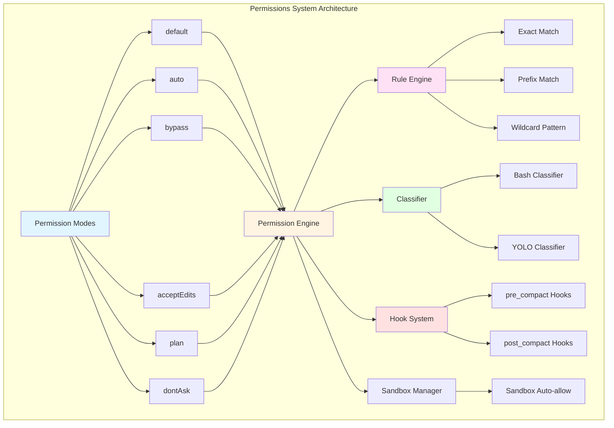
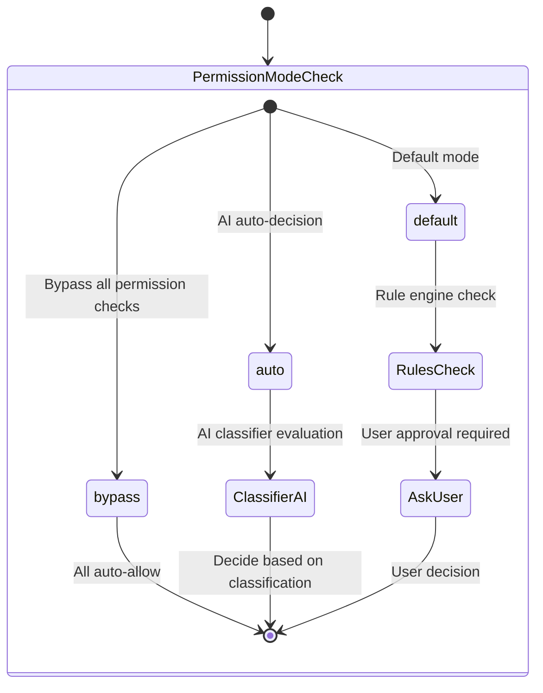
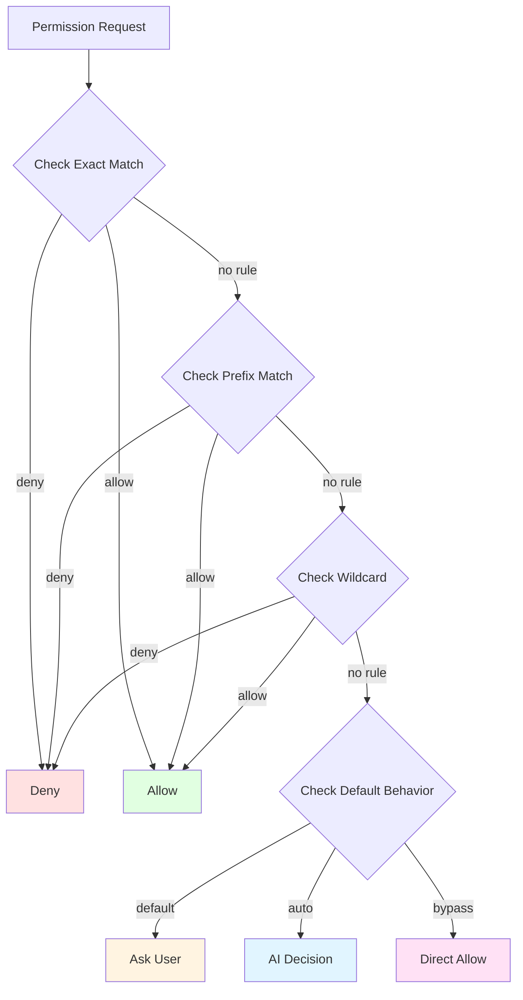
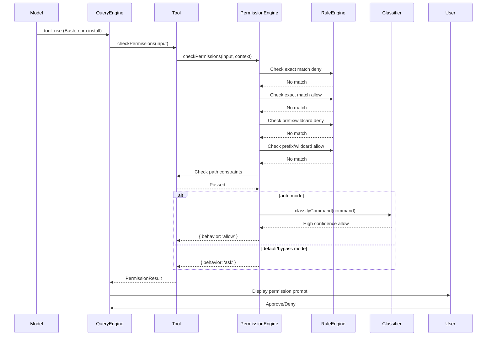
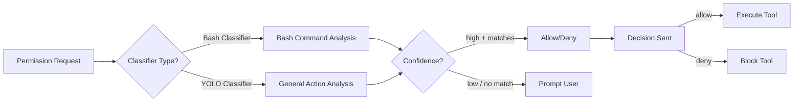

# Chapter 8: Permissions System

## Overview

Claude Code's permissions system is the core of its security model, ensuring that the AI assistant does not cause accidental damage when executing sensitive operations through multiple layers of protection. This chapter will deeply analyze the permission system's architecture design, three-tier permission modes, rule engine, classifier integration, and best practices.

**Key Points:**

- **Three-tier Permission Modes**: Design and use cases for default, auto, and bypass modes
- **Permission Rule System**: Three matching patterns - exact/prefix/wildcard
- **Permission Check Flow**: Complete chain from tool invocation to decision-making
- **Classifier Integration**: AI-driven permission decisions (Haiku)
- **Denial Tracking Mechanism**: Preventing permission prompt fatigue
- **Hook System**: pre/post_compact hook integration
- **Sandbox Integration**: Interaction between sandbox mode and permissions

## Architecture Overview

### Overall Architecture



### Core Components

1. **PermissionMode**: Permission mode definitions
2. **PermissionResult**: Permission decision result
3. **PermissionRule**: Permission rule definitions
4. **permissions.ts**: Core permission checking logic
5. **classifierDecision**: AI classifier decision-making
6. **denialTracking**: Denial tracking state
7. **PermissionUpdate**: Permission update mechanism

## Permission Modes Explained

### Three-tier Permission Modes



### 1. Default Mode

**Characteristics:**
- ✅ Security-first, requires explicit approval
- ✅ Suitable for learning and development environments
- ✅ User has full control over permissions
- ❌ Requires frequent confirmation

**Behavior:**

```typescript
// Permission check flow in default mode
async function checkPermissionInDefaultMode(
  tool: Tool,
  input: unknown,
  context: ToolUseContext
): Promise<PermissionResult> {
  // 1. Check exact match deny rules
  const denyResult = checkExactMatchDenyRules(tool, input, context);
  if (denyResult) {
    return { behavior: 'deny', decisionReason: denyResult };
  }
  
  // 2. Check exact match allow rules
  const allowResult = checkExactMatchAllowRules(tool, input, context);
  if (allowResult) {
    return { behavior: 'allow', updatedInput: allowResult.input };
  }
  
  // 3. Check prefix and wildcard rules
  const patternResult = checkPatternRules(tool, input, context);
  if (patternResult) {
    return patternResult;
  }
  
  // 4. Check path constraints
  const pathResult = await checkPathConstraints(tool, input, context);
  if (pathResult) {
    return pathResult;
  }
  
  // 5. Ask user
  return {
    behavior: 'ask',
    message: createPermissionRequestMessage(tool.name),
  };
}
```

**Use Cases:**
- First-time use of Claude Code
- Handling sensitive files (such as .env, config files)
- Executing destructive operations (rm, git push)
- Uncertain about command safety

### 2. Auto Mode

**Characteristics:**
- ✅ AI auto-decision, reduces user interruption
- ✅ Smart judgment based on rules and classifiers
- ✅ Auto-allow safe operations
- ❌ Requires GrowthBook feature flag

**Behavior:**

```typescript
// Permission check flow in auto mode
async function checkPermissionInAutoMode(
  tool: Tool,
  input: unknown,
  context: ToolUseContext
): Promise<PermissionResult> {
  // 1. Check explicit deny rules (highest priority)
  const denyResult = checkExactMatchDenyRules(tool, input, context);
  if (denyResult) {
    return { behavior: 'deny', decisionReason: denyResult };
  }
  
  // 2. Check explicit allow rules
  const allowResult = checkExactMatchAllowRules(tool, input, context);
  if (allowResult) {
    return { behavior: 'allow', updatedInput: allowResult.input };
  }
  
  // 3. Call AI classifier for decision
  const classifierResult = await classifyBashCommand(
    tool.name,
    input,
    context,
    'allow',  // Ask classifier: should we allow?
    context.abortController.signal
  );
  
  if (classifierResult.matches && classifierResult.confidence === 'high') {
    // High confidence allow
    return {
      behavior: 'allow',
      updatedInput: input,
      decisionReason: {
        type: 'classifier',
        classifier: 'bash_allow',
        reason: classifierResult.matchedDescription,
      },
    };
  }
  
  // 4. Low confidence or uncertain, ask user
  return {
    behavior: 'ask',
    message: createPermissionRequestMessage(tool.name),
  };
}
```

**Classifier Decision Example:**

```typescript
// Classifier evaluation: Is this a safe read operation?
const classifierInput = {
  tool: 'Bash',
  command: 'cat file.txt',
  context: {
    workingDirectory: '/home/user/project',
    recentHistory: ['ls -la', 'pwd'],
  },
};

// Classifier response
const classifierResult = {
  matches: true,
  confidence: 'high',
  reason: 'This is a safe file read operation within the project directory',
  matchedDescription: 'Bash(cat file.txt:*) is a safe read operation',
};

// Result: Auto-allow, no user confirmation needed
```

**Use Cases:**
- Experienced developers
- Repetitive tasks (builds, tests)
- Read-only operations
- Automation scripts

### 3. Bypass Mode

**Characteristics:**
- ✅ Completely bypass permission checks
- ✅ Highest privileges, full trust
- ⚠️ Only for trusted environments
- ❌ Extremely high security risk

**Behavior:**

```typescript
// Permission check flow in bypass mode
async function checkPermissionInBypassMode(
  tool: Tool,
  input: unknown,
  context: ToolUseContext
): Promise<PermissionResult> {
  // Directly return allow, no checks performed
  return {
    behavior: 'allow',
    updatedInput: input,
    decisionReason: {
      type: 'mode',
      mode: 'bypass',
    },
  };
}
```

**Safety Restrictions:**

```typescript
// Safety protection for bypass mode
function enableBypassModeSafely(): boolean {
  // 1. Check kill switch
  if (!isBypassPermissionsKillSwitchEnabled()) {
    console.warn('Bypass permissions mode is disabled by kill switch');
    return false;
  }
  
  // 2. Check environment variable
  if (process.env.NODE_ENV === 'production') {
    console.warn('Bypass permissions mode is not allowed in production');
    return false;
  }
  
  // 3. Check if in local development environment
  if (!isLocalDevelopmentEnvironment()) {
    console.warn('Bypass permissions mode is only allowed in local development');
    return false;
  }
  
  return true;
}
```

**Use Cases:**
- Local development environment
- CI/CD pipelines (isolated environment)
- Fully trusted personal projects
- **Not recommended for production environments**

### Other Modes

#### acceptEdits Mode

```typescript
// acceptEdits mode
{
  mode: 'acceptEdits',
  
  // File editing tools auto-allow
  'FileEdit*': 'allow',
  'FileWrite*': 'allow',
  
  // Other tools still require permission checks
  'Bash*': 'ask',
  'AgentTool*': 'ask',
}
```

#### plan Mode

```typescript
// plan mode (planning mode)
{
  mode: 'plan',
  
  // Save original mode when entering plan mode
  prePlanMode: 'default',
  
  // Certain operations prohibited in plan mode
  'git push': 'deny',
  'rm -rf': 'deny',
  'FileWrite': 'ask',
  
  // Analysis operations auto-allow
  'Grep': 'allow',
  'Glob': 'allow',
}
```

#### dontAsk Mode

```typescript
// dontAsk mode (don't ask mode)
{
  mode: 'dontAsk',
  
  // Execute if there are clear rules, otherwise deny
  'FileRead*': 'allow',
  'Bash(npm test)': 'allow',
  
  // Operations without rules are denied (don't ask)
  'Bash(rm *)': 'deny',  // Deny deletion
  'Bash(git push)': 'deny',  // Deny push
}
```

## Permission Rule System

### Rule Types

```mermaid
graph LR
    A[Permission Rule] --> B{Type?}
    
    B -->|exact| C[Exact Match<br/>Bash(npm test)]
    B -->|prefix| D[Prefix Match<br/>Bash(npm:*)]
    B -->|wildcard| E[Wildcard<br/>Bash(git *)]
    
    C --> F{Behavior?}
    D --> F
    E --> F
    
    F -->|allow| G[Allow Execution]
    F -->|deny| H[Deny Execution]
    F -->|ask| I[Ask User]
```

### Rule Syntax

#### 1. Exact Match Rules

```typescript
// Rule format
{
  toolName: 'Bash',
  ruleContent: 'npm test',
  behavior: 'allow'
}

// Matching logic
function matchesExactRule(
  toolName: string,
  command: string,
  rule: PermissionRule
): boolean {
  if (toolName !== rule.toolName) return false;
  
  // Exact match
  return command === rule.ruleContent;
}

// Example
{
  toolName: 'Bash',
  ruleContent: 'npm test',
  behavior: 'allow'
}
// ✅ Matches: 'npm test'
// ❌ Does not match: 'npm test --watch'
// ❌ Does not match: 'npm run test'
```

#### 2. Prefix Match Rules

```typescript
// Rule format
{
  toolName: 'Bash',
  ruleContent: 'npm test:*',
  behavior: 'allow'
}

// Matching logic
function matchesPrefixRule(
  toolName: string,
  command: string,
  rule: PermissionRule
): boolean {
  const prefix = rule.ruleContent;
  
  // Check if it starts with prefix, followed by space or end
  if (command === prefix) return true;
  if (command.startsWith(prefix + ' ')) return true;
  
  return false;
}

// Example
{
  toolName: 'Bash',
  ruleContent: 'npm test:*',
  behavior: 'allow'
}
// ✅ Matches: 'npm test'
// ✅ Matches: 'npm test --watch'
// ✅ Matches: 'npm test -- --coverage'
// ❌ Does not match: 'npm run test'
// ❌ Does not match: 'npm build'
```

#### 3. Wildcard Pattern Rules

```typescript
// Rule format
{
  toolName: 'Bash',
  ruleContent: 'git *',
  behavior: 'allow'
}

// Matching logic
function matchesWildcardRule(
  toolName: string,
  command: string,
  rule: PermissionRule
): boolean {
  const pattern = rule.ruleContent;
  
  // Convert wildcard pattern to regex
  // git * → /^git .*$/
  const regexPattern = pattern
    .replace('*', '.*')
    .replace('?', '.');
  
  const regex = new RegExp(`^${regexPattern}$`);
  return regex.test(command);
}

// Example
{
  toolName: 'Bash',
  ruleContent: 'git *',
  behavior: 'allow'
}
// ✅ Matches: 'git status'
// ✅ Matches: 'git log'
// ✅ Matches: 'git push origin main'
// ❌ Does not match: 'git status && echo' (compound command)
```

### Rule Priority



**Priority Rules:**

1. **Deny Priority**: Any deny rule match immediately denies
2. **Exact Match Priority**: exact takes precedence over prefix/wildcard
3. **User Settings Priority**: userSettings > projectSettings > localSettings
4. **More Specific Rules Priority**: `Bash(npm test:*)` takes precedence over `Bash(npm:*)`

### Rule Storage

```typescript
// Permission rules are layered by source
interface PermissionRulesBySource {
  // User global settings (highest priority)
  userSettings?: PermissionRule[]
  
  // Project settings (.claude/settings.json)
  projectSettings?: PermissionRule[]
  
  // Local settings
  localSettings?: PermissionRule[]
  
  // CLI flags (command line arguments)
  flagSettings?: PermissionRule[]
  
  // Policy settings (enterprise policies)
  policySettings?: PermissionRule[]
  
  // Command line arguments
  cliArg?: PermissionRule[]
  
  // Session rules (temporary for current session)
  session?: PermissionRule[]
}

// Example configuration
{
  "userSettings": {
    "Bash(npm test:*)": "allow",
    "Bash(rm *)": "deny"
  },
  
  "projectSettings": {
    "Bash(git push):*": "ask",
    "FileRead(.env:*)": "deny"
  },
  
  "localSettings": {
    "Bash(*test*)": "allow"
  }
}
```

## Permission Check Flow

### Complete Check Chain



### Core Check Function

```typescript
// src/utils/permissions/permissions.ts
export async function checkPermission(
  tool: Tool,
  input: unknown,
  context: ToolUseContext,
): Promise<PermissionResult> {
  const toolName = getToolNameForPermissionCheck(tool);
  const mode = context.mode;
  
  // 1. bypass mode: direct allow
  if (mode === 'bypass') {
    return {
      behavior: 'allow',
      updatedInput: input,
      decisionReason: { type: 'mode', mode: 'bypass' },
    };
  }
  
  // 2. Check exact match deny rules (all modes check this)
  const denyResult = checkExactMatchDenyRules(
    toolName,
    input,
    context
  );
  if (denyResult) {
    return {
      behavior: 'deny',
      message: `Permission denied by ${denyResult.source}`,
      decisionReason: denyResult.decisionReason,
    };
  }
  
  // 3. Check exact match allow rules (all modes check this)
  const allowResult = checkExactMatchAllowRules(
    toolName,
    input,
    context
  );
  if (allowResult) {
    return {
      behavior: 'allow',
      updatedInput: allowResult.updatedInput,
      decisionReason: allowResult.decisionReason,
    };
  }
  
  // 4. auto mode: call classifier
  if (mode === 'auto') {
    const classifierResult = await checkAutoModeClassifier(
      tool,
      input,
      context
    );
    
    if (classifierResult.behavior !== 'passthrough') {
      return classifierResult;
    }
  }
  
  // 5. Check prefix and wildcard rules
  const patternResult = checkPatternRules(tool, input, context);
  if (patternResult) {
    return patternResult;
  }
  
  // 6. Check path constraints
  const pathResult = await checkPathConstraints(
    tool,
    input,
    context
  );
  if (pathResult) {
    return pathResult;
  }
  
  // 7. Hook checks
  const hookResult = await checkHooks(tool, input, context);
  if (hookResult) {
    return hookResult;
  }
  
  // 8. Default: ask user
  return {
    behavior: 'ask',
    message: createPermissionRequestMessage(toolName),
    suggestions: generateSuggestions(tool, input),
  };
}

function checkExactMatchDenyRules(
  toolName: string,
  input: unknown,
  context: ToolPermissionContext
): PermissionResult | null {
  // Iterate through all deny rules from all sources
  for (const source of PERMISSION_RULE_SOURCES) {
    const rules = context.alwaysDenyRules[source] || [];
    
    for (const ruleString of rules) {
      const rule = permissionRuleFromString(ruleString);
      
      // Tool name must match
      if (rule.toolName !== toolName) continue;
      
      // Exact match input
      if (inputsAreEqual(input, rule.input)) {
        return {
          behavior: 'deny',
          message: `Permission denied by ${source}`,
          decisionReason: {
            type: 'rule',
            rule: { source, ruleBehavior: 'deny', ruleValue: rule },
          },
        };
      }
    }
  }
  
  return null; // No matching rules
}
```

## Classifier Integration

### AI Classifier Architecture



### Bash Classifier

```typescript
// src/utils/permissions/bashClassifier.ts
export async function classifyBashCommand(
  toolName: string,
  input: BashToolInput,
  context: ToolPermissionContext,
  behavior: 'allow' | 'deny' | 'ask',
  signal: AbortSignal,
  isNonInteractiveSession: boolean
): Promise<ClassifierResult> {
  // 1. Build classifier prompt
  const prompt = await buildBashClassifierPrompt({
    toolName,
    command: input.command,
    behavior,
    descriptions: getBashPromptDescriptions(context, behavior),
    cwd: getCwd(),
  });
  
  // 2. Call AI model
  const response = await anthropic.messages.create({
    model: 'claude-3-5-haiku-20241022',
    max_tokens: 100,
    messages: [{ role: 'user', content: prompt }],
  });
  
  // 3. Parse response
  const content = response.content[0]?.text || '';
  return parseClassifierResponse(content);
}

// Build classifier prompt
async function buildBashClassifierPrompt(params): Promise<string> {
  const { toolName, command, behavior, descriptions, cwd } = params;
  
  return `You are a permission classifier for ${toolName} commands.

Behavior: ${behavior}
Command: ${command}
Working Directory: ${cwd}

Available permission descriptions:
${descriptions.map(d => `- ${d}`).join('\n')}

Analyze this command and determine if it should be ${behavior}ed.
Respond in JSON format:
{
  "matches": true/false,
  "confidence": "high" | "medium" | "low",
  "reason": "Brief explanation of your decision"
}`;
}

// Parse classifier response
function parseClassifierResponse(
  response: string
): ClassifierResult {
  try {
    const parsed = JSON.parse(response);
    return {
      matches: parsed.matches,
      confidence: parsed.confidence || 'medium',
      reason: parsed.reason || '',
    };
  } catch (error) {
    // Parse failed, return default
    return {
      matches: false,
      confidence: 'low',
      reason: 'Failed to parse classifier response',
    };
  }
}
```

**Classifier Example:**

```bash
# Input command
npm install --save-dev jest

# Classifier evaluation
{
  "matches": true,
  "confidence": "high",
  "reason": "This is a common development dependency installation command that is safe to auto-approve"
}

# Result: Auto-allow
```

### YOLO Classifier

```typescript
// src/utils/permissions/yoloClassifier.ts
export async function classifyYoloAction(
  tool: Tool,
  input: unknown,
  context: ToolUseContext
): Promise<YoloClassifierResult> {
  // YOLO = "You Only Live Once" - for quick assessment of high-risk operations
  
  const prompt = `You are a safety classifier for ${tool.name}.

Action: ${formatActionForClassifier(tool, input)}

Evaluate if this action is SAFE or DANGEROUS.
- SAFE: Read operations, file creation in project
- DANGEROUS: File deletion, git push, system changes

Respond with JSON:
{
  "shouldBlock": true/false,
  "reason": "Explanation"
}`;

  const response = await anthropic.messages.create({
    model: 'claude-3-5-haiku-20241022',
    max_tokens: 200,
    messages: [{ role: 'user', content: prompt }],
  });
  
  const result = JSON.parse(response.content[0].text);
  
  return {
    shouldBlock: result.shouldBlock,
    reason: result.reason,
    model: 'claude-3-5-haiku-20241022',
    durationMs: Date.now() - startTime,
  };
}
```

**YOLO Classifier Use Cases:**

- **acceptEdits mode**: Quick assessment of whether file edits are safe
- **dontAsk mode**: Quick decision to allow or deny
- **High-risk operations**: Assess safety of destructive operations

## Denial Tracking Mechanism

### Problem: Permission Prompt Fatigue

```typescript
// Problem: Frequent permission prompts cause user fatigue
// Scenario: User is prompted every time they run tests
1. bash: 'npm test' → ask
2. User chooses: allow
3. bash: 'npm test' → ask again
4. User chooses: allow
5. ... and so on

// Result: User gets frustrated, may choose "always allow", reducing security
```

### Solution: Denial Tracking

```typescript
// src/utils/permissions/denialTracking.ts
export interface DenialTrackingState {
  // Denial count
  denialCount: number
  
  // Success count
  successCount: number
  
  // Last denial timestamp
  lastDenialTimestamp?: number
  
  // Last success timestamp
  lastSuccessTimestamp?: number
  
  // Denied operations
  deniedOperations: Map<string, number>
}

const DENIAL_LIMITS = {
  // Fallback to prompting after 3 denials
  FALLBACK_TO_PROMPTING: 3,
  
  // Clear tracking after 5 successes
  CLEAR_AFTER_SUCCESSES: 5,
};

export function recordDenial(
  state: DenialState,
  operation: string
): void {
  state.denialCount++;
  state.lastDenialTimestamp = Date.now();
  
  const currentCount = state.deniedOperations.get(operation) || 0;
  state.deniedOperations.set(operation, currentCount + 1);
}

export function recordSuccess(
  state: DenialState,
  operation: string
): void {
  state.successCount++;
  state.lastSuccessTimestamp = Date.now();
  
  // Clear denial tracking after 5 successes
  if (state.successCount >= DENIAL_LIMITS.CLEAR_AFTER_SUCCESSES) {
    resetDenialTrackingState(state);
  }
}

export function shouldFallbackToPrompting(
  state: DenialStateState
): boolean {
  // Fallback to asking when denial count exceeds threshold
  return state.denialCount >= DENIAL_LIMITS.FALLBACK_TO_PROMPTING;
}
```

### Practical Application

```typescript
// Example: Permission check for Bash tool
async function checkBashPermissionWithTracking(
  input: BashToolInput,
  context: ToolUseContext
): Promise<PermissionResult> {
  const state = context.localDenialTracking;
  
  // 1. Check for explicit rules
  const explicitResult = checkExplicitRules(input, context);
  if (explicitResult) {
    if (explicitResult.behavior === 'allow') {
      recordSuccess(state, input.command);
    } else {
      recordDenial(state, input.command);
    }
    return explicitResult;
  }
  
  // 2. Check if should fallback to asking
  if (shouldFallbackToPrompting(state)) {
    return {
      behavior: 'ask',
      message: createPermissionRequestMessage('Bash'),
    };
  }
  
  // 3. Few denials, try auto-allow
  if (state.denialCount < DENIAL_LIMITS.FALLBACK_TO_PROMPTING) {
    return {
      behavior: 'allow',
      updatedInput: input,
      decisionReason: {
        type: 'other',
        reason: 'Auto-allowed based on denial tracking state',
      },
    };
  }
  
  // 4. Ask user
  return {
    behavior: 'ask',
    message: createPermissionRequestMessage('Bash'),
  };
}
```

**Effect:**

```bash
# Scenario: User frequently runs npm test

# 1st-2nd time: Ask
$ npm test
❓ Permission to run 'npm test'? [Allow] [Deny]

# 3rd time: Detect repetition, start tracking
$ npm test
ℹ️ Tracking permission requests for 'npm test'

# 4th-5th time: Still ask (gathering data)
$ npm test
❓ Permission to run 'npm test'? [Always Allow]

# 6th time: Detect Always Allow pattern
$ npm test
✅ Auto-allowed based on denial tracking

# Subsequent: No prompt, auto-execute
$ npm test
✅ Running tests...
```

## Hook System

### Pre-compact Hooks

```typescript
// Hooks executed before permission check
export async function runPreCompactHooks(
  tool: Tool,
  input: unknown,
  context: ToolUseContext
): Promise<{
  behavior?: 'allow' | 'reject'
  updatedInput?: unknown
  parentMessage?: AssistantMessage
}> {
  const hooks = context.options.hooks?.pre_compact || [];
  
  for (const hook of hooks) {
    const result = await executeHook(hook, {
      toolName: tool.name,
      input,
      context,
    });
    
    // Hook can reject operation
    if (result.behavior === 'reject') {
      return {
        behavior: 'reject',
        decisionReason: {
          type: 'hook',
          hookName: hook.name,
          reason: result.reason,
        },
      };
    }
    
    // Hook can modify input
    if (result.updatedInput) {
      input = result.updatedInput;
    }
  }
  
  return {};
}
```

**Hook Configuration Example:**

```json
{
  "hooks": {
    "pre_compact": [
      {
        "name": "block-dangerous-commands",
        "if": "Bash(rm -rf *)",
        "then": "reject",
        "reason": "Dangerous command blocked by policy"
      },
      {
        "name": "require-test-coverage",
        "if": "Bash(npm test)",
        "then": "accept",
        "reason": "Tests are required before deployment"
      }
    ]
  }
}
```

### Post-compact Hooks

```typescript
// Hooks executed after permission check
export async function runPostCompactHooks(
  tool: Tool,
  input: unknown,
  result: PermissionResult,
  context: ToolUseContext
): Promise<void> {
  const hooks = context.options.hooks?.post_compact || [];
  
  for (const hook of hooks) {
    await executeHook(hook, {
      toolName: tool.name,
      input,
      result,
      context,
    });
  }
}
```

**Use Cases:**

```json
{
  "hooks": {
    "post_compact": [
      {
        "name": "log-allowed-operations",
        "if": "Bash(npm install)",
        "then": "log",
        "reason": "Log all package installations for audit trail"
      },
      {
        "name": "notify-security-team",
        "if": "Bash(git push)",
        "then": "notify",
        "reason": "Alert security team on git push operations"
      }
    ]
  }
}
```

## Sandbox Integration

### Sandbox Auto-allow

```typescript
// Permission check in sandbox mode
async function checkPermissionWithSandbox(
  tool: Tool,
  input: unknown,
  context: ToolUseContext
): Promise<PermissionResult> {
  // 1. Check if using sandbox
  const useSandbox = await shouldUseSandbox(tool, input, context);
  if (!useSandbox) {
    // Not using sandbox, normal permission check
    return checkPermission(tool, input, context);
  }
  
  // 2. Check auto-allow in sandbox mode
  const autoAllowEnabled = SandboxManager.isAutoAllowBashIfSandboxedEnabled();
  if (autoAllowEnabled) {
    return checkSandboxAutoAllow(tool, input, context);
  }
  
  // 3. Normal permission check
  return checkPermission(tool, input, context);
}

async function checkSandboxAutoAllow(
  tool: Tool,
  input: unknown,
  context: ToolPermissionContext
): Promise<PermissionResult> {
  // 1. Still check explicit deny rules
  const denyResult = checkExactMatchDenyRules(tool, input, context);
  if (denyResult) {
    return denyResult;
  }
  
  // 2. Check explicit ask rules
  const askResult = checkExactMatchAskRules(tool, input, context);
  if (askResult) {
    return askResult;
  }
  
  // 3. Sandbox auto-allow (safe isolated environment)
  return {
    behavior: 'allow',
    updatedInput: input,
    decisionReason: {
      type: 'sandbox',
      reason: 'Auto-allowed in sandbox environment',
    },
  };
}
```

**Sandbox Configuration:**

```json
{
  "sandbox": {
    "enabled": true,
    "autoAllowBashIfSandboxed": true,
    "excludedCommands": [
      "sudo",
      "doas",
      "pkexec"
    ],
    "allowedPaths": [
      "/home/user/project",
      "/tmp"
    ]
  }
}
```

## Permission Update Mechanism

### Update Types

```typescript
// Permission update operations
type PermissionUpdate =
  // Add rules
  | {
      type: 'addRules'
      destination: 'userSettings' | 'projectSettings' | 'localSettings'
      rules: PermissionRuleValue[]
      behavior: 'allow' | 'deny' | 'ask'
    }
  
  // Replace rules
  | {
      type: 'replaceRules'
      destination: 'userSettings' | 'projectSettings' | 'localSettings'
      rules: PermissionRuleValue[]
      behavior: 'allow' | 'deny' | 'ask'
    }
  
  // Remove rules
  | {
      type: 'removeRules'
      destination: 'userSettings' | 'projectSettings' | 'localSettings'
      rules: PermissionRuleValue[]
      behavior: 'allow' | 'deny' | 'ask'
    }
  
  // Switch mode
  | {
      type: 'setMode'
      destination: 'userSettings' | 'projectSettings' | 'localSettings'
      mode: 'default' | 'auto' | 'bypass'
    }
  
  // Add working directory
  | {
      type: 'addDirectories'
      destination: 'userSettings' | 'projectSettings'
      directories: string[]
    }
  
  // Remove working directory
  | {
      type: 'removeDirectories'
      destination: 'userSettings' | 'projectSettings'
      directories: string[]
    }
```

### Update Examples

```typescript
// Example: Add permission rules
async function addPermissionRules() {
  const update: PermissionUpdate = {
    type: 'addRules',
    destination: 'localSettings',
    rules: [
      { toolName: 'Bash', ruleContent: 'npm test:*' },
      { toolName: 'Bash', ruleContent: 'git status:*' },
      { toolName: 'Grep', ruleContent: '*' },
    ],
    behavior: 'allow',
  };
  
  await applyPermissionUpdate(update);
  await persistPermissionUpdates(update);
}

// Example: Switch permission mode
async function setPermissionMode() {
  const update: PermissionUpdate = {
    type: 'setMode',
    destination: 'projectSettings',
    mode: 'auto',
  };
  
  await applyPermissionUpdate(update);
  await persistPermissionUpdates(update);
}
```

### Permission Suggestion Generation

```typescript
// Intelligently generate permission suggestions based on tool and input
export function generatePermissionSuggestions(
  tool: Tool,
  input: unknown,
  context: ToolUseContext
): PermissionUpdate[] {
  const suggestions: PermissionUpdate[] = [];
  
  // 1. Try to extract prefix rule
  const prefix = extractCommandPrefix(tool, input);
  if (prefix) {
    suggestions.push({
      type: 'addRules',
      destination: 'localSettings',
      rules: [{ toolName: tool.name, ruleContent: `${prefix}:*` }],
      behavior: 'allow',
    });
  }
  
  // 2. For read-only operations, suggest allow rules
  if (tool.isReadOnly?.(input)) {
    suggestions.push({
      type: 'addRules',
      destination: 'localSettings',
      rules: [{ toolName: tool.name, ruleContent: `${extractInputSummary(input)}:*` }],
      behavior: 'allow',
    });
  }
  
  return suggestions;
}

// Example
// Tool call: Bash({ command: 'npm test --watch' })
// Generated suggestion:
{
  suggestions: [{
    type: 'addRules',
    destination: 'localSettings',
    rules: [{ toolName: 'Bash', ruleContent: 'npm test --watch:*' }],
    behavior: 'allow'
  }]
}
```

## Complete Example

### Example: Complex Permission Check Flow

```typescript
// Scenario: User runs 'git push origin main'
async function examplePermissionCheck() {
  const tool = BashTool;
  const input = { command: 'git push origin main' };
  const context = createMockContext('default');
  
  // 1. Permission check
  const result = await checkPermission(tool, input, context);
  
  console.log('Permission check result:', result.behavior);
  
  // Result:
  // {
  //   behavior: 'ask',
  //   message: 'Permission rule \'Bash(git push:*)\' from localSettings requires approval',
  //   suggestions: [{
  //     type: 'addRules',
  //     destination: 'localSettings',
  //     rules: [{ toolName: 'Bash', ruleContent: 'git push:*' }],
  //     behavior: 'allow'
  //   }]
  // }
  // }
  
  // 2. User chooses "Always Allow"
  // 3. Rule is saved to localSettings
  
  // 4. Next execution of same command
  const result2 = await checkPermission(tool, input, context);
  
  // Result:
  // {
  //   behavior: 'allow',
  //   updatedInput: input,
  //   decisionReason: {
  //     type: 'rule',
  //     rule: {
  //       source: 'localSettings',
  //       ruleBehavior: 'allow',
  //       ruleValue: { toolName: 'Bash', ruleContent: 'git push:*' }
  //     }
  //   }
  // }
}
```

## Debugging and Testing

### Permission Check Debugging

```typescript
// Enable permission debug logging
export function debugPermissionCheck(
  tool: Tool,
  input: unknown,
  context: ToolUseContext
): void {
  console.log('=== Permission Check Debug ===');
  console.log('Tool:', tool.name);
  console.log('Input:', input);
  console.log('Mode:', context.mode);
  
  // Display all matching rules
  console.log('\nDeny Rules:');
  for (const source of PERMISSION_RULE_SOURCES) {
    const rules = context.alwaysDenyRules[source] || [];
    const matching = rules.filter(r => r.toolName === tool.name);
    if (matching.length > 0) {
      console.log(`  ${source}:`, matching);
    }
  }
  
  console.log('\nAllow Rules:');
  for (const source of PERMISSION_RULE_SOURCES) {
    const rules = context.alwaysAllowRules[source] || [];
    const matching = rules.filter(r => r.toolName === tool.name);
    if (matching.length > 0) {
      console.log(`  ${source}:`, matching);
    }
  }
  
  console.log('=========================\n');
}

// Usage example
debugPermissionCheck(BashTool, { command: 'npm test' }, context);
```

### Permission Rule Testing

```typescript
import { describe, it, expect } from 'vitest';
import { checkExactMatchPermissions } from './permissions';

describe('Permission Rules', () => {
  it('should match exact bash command', async () => {
    const context = createMockContext({
      alwaysAllowRules: {
        localSettings: ['Bash(npm test)'],
      },
    });
    
    const result = await checkExactMatchPermissions(
      BashTool,
      { command: 'npm test' },
      context
    );
    
    expect(result.behavior).toBe('allow');
  });
  
  it('should not match different command', async () => {
    const context = createMockContext({
      alwaysAllowRules: {
        localSettings: ['Bash(npm test)'],
      },
    });
    
    const result = await checkExactMatchPermissions(
      BashTool,
      { command: 'npm build' },
      context
    );
    
    expect(result.behavior).not.toBe('allow');
  });
  
  it('should match prefix rule', async () => {
    const context = createMockContext({
      alwaysAllowRules: {
        localSettings: ['Bash(npm:*)'],
      },
    });
    
    const result = await checkExactMatchPermissions(
      BashTool,
      { command: 'npm install' },
      context
    );
    
    expect(result.behavior).toBe('allow');
  });
});
```

## Security Best Practices

### 1. Default Deny Strategy

```typescript
// ✅ Good practice: Default requires approval
export const SecureTool = buildTool({
  async checkPermissions(input, context) {
    // Without explicit allow rule, ask user
    return {
      behavior: 'ask',
      message: 'This operation requires approval',
    };
  },
});

// ❌ Bad practice: Default auto-allow
export const InsecureTool = buildTool({
  async checkPermissions(input, context) {
    // Without explicit deny rule, auto-allow
    return {
      behavior: 'allow',
      updatedInput: input,
    };
  },
});
```

### 2. Layered Rule Design

```typescript
// ✅ Good practice: From general to specific
{
  // User settings: General rules (low priority)
  "userSettings": {
    "Bash(*:*)": "ask",  // Most operations ask
    "Bash(npm:*)": "allow",  // NPM operations allow
    "Bash(git:*)": "ask",   // Git operations ask
  },
  
  // Project settings: Project-specific rules (medium priority)
  "projectSettings": {
    "Bash(npm test:*)": "allow",  // Tests auto-allow
    "Bash(npm build:*)": "ask",   // Builds ask
    "Bash(npm install:*)": "ask", // Installations ask
  },
  
  // Local settings: Current session rules (high priority)
  "localSettings": {
    "Bash(npm test --watch)": "allow",  // Current session auto-allow
  },
}

// Priority: localSettings > projectSettings > userSettings
```

### 3. Additional Validation for Sensitive Operations

```typescript
export const FileDeleteTool = buildTool({
  async checkPermissions(input, context) {
    // 1. Check base permission rules
    const baseResult = await checkBasePermissions(input, context);
    if (baseResult.behavior === 'deny') {
      return baseResult;
    }
    
    // 2. Additional validation: Sensitive paths
    const sensitivePaths = [
      '.env',
      '.git',
      'node_modules',
      'dist',
      'build',
    ];
    
    const filePath = input.file_path.toLowerCase();
    for (const sensitive of sensitivePaths) {
      if (filePath.includes(sensitive)) {
        return {
          behavior: 'deny',
          message: `Cannot delete sensitive path: ${input.file_path}`,
          decisionReason: {
            type: 'safetyCheck',
            reason: 'Operation blocked: sensitive directory',
            classifierApprovable: false,
          },
        };
      }
    }
    
    // 3. Check if within project directory
    const projectRoot = getProjectRoot();
    if (!input.file_path.startsWith(projectRoot)) {
      return {
        behavior: 'deny',
        message: 'Cannot delete files outside project directory',
      };
    }
    
    return { behavior: 'ask' };
  },
});
```

### 4. Permission Prompt Optimization

```typescript
// ✅ Good practice: Clear, actionable prompts
function createGoodPermissionMessage(
  tool: string,
  command: string,
  reason: string
): string {
  return `${tool} command requires approval: ${command}

Reason: ${reason}

Options:
[Allow] [Deny] [Always Allow for '${command}']`;
}

// ❌ Bad practice: Vague, unfriendly prompts
function createBadPermissionMessage(
  tool: string,
  command: string,
  reason: string
): string {
  return `Permission required for ${tool}.
Command: ${command}.
This is for security purposes.`;
}
```

## Summary

The Permissions System is the core of Claude Code's security model, ensuring system safety through the following mechanisms:

1. **Three-tier Permission Modes**: default, auto, and bypass adapt to different use cases
2. **Flexible Rule System**: Three matching patterns - exact/prefix/wildcard
3. **Multi-layer Protection**: Rules → Classifiers → Hooks → Sandbox
4. **Smart Decision-making**: AI classifiers reduce user interruption in auto mode
5. **User Experience Optimization**: Denial tracking mechanism prevents prompt fatigue
6. **Extensibility**: Hook system allows custom permission logic

**Key Design Principles:**

- **Fail-Closed**: Default deny, explicit allow
- **Layered Design**: Multi-level rules, progressive refinement
- **User Control**: User always has final decision
- **Smart Assistance**: AI helps reduce decision burden
- **Security First**: Uncertain behaviors require user confirmation

The Permissions System implementation demonstrates how to maintain system security while providing powerful functionality, which has important reference value for building secure and reliable AI assistant systems.

## Further Reading

- **Permission Mode Configuration**: `docs/permissions/modes.md`
- **Rule Syntax Reference**: `docs/permissions/syntax.md`
- **Classifier API**: `src/utils/permissions/bashClassifier.ts`
- **Hook System**: `src/utils/hooks.ts`

## Next Chapter

Chapter 9 will explore **Context Management** in depth, covering Token calculation strategies, context compression algorithms, and source code analysis.
