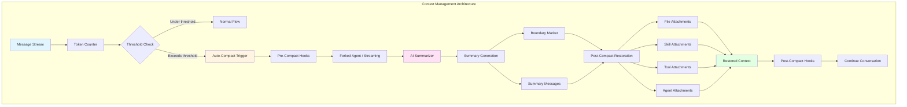
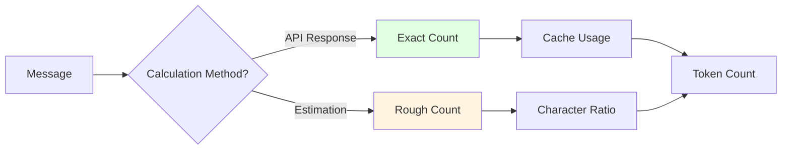
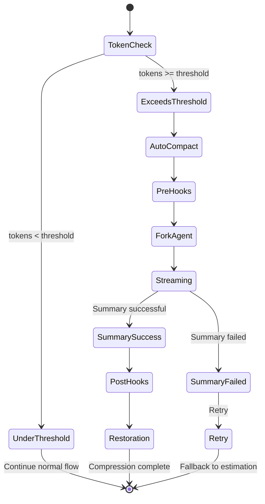
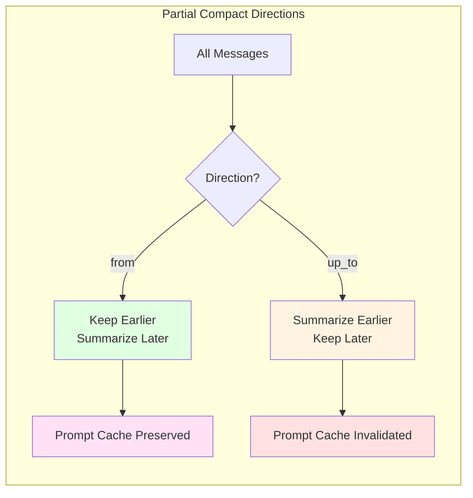

# Chapter 9: Context Management

## Overview

Claude Code's context management system is one of its core performance optimization mechanisms, responsible for intelligently managing conversation history, controlling token usage, and automatically compressing conversations when approaching context limits. This chapter will deeply analyze the context management architecture design, token calculation strategies, compression algorithms, and source code implementation.

**Key Points:**

- **Token Calculation Strategies**: Combination of precise calculation and estimation
- **Context Compression Algorithms**: Automatic and manual compression
- **Compression Trigger Mechanism**: Automatic trigger based on token threshold
- **Post-Compression Restoration**: Intelligent restoration of file state, skills, and tools
- **Prompt Cache Optimization**: Cache sharing and reuse strategies
- **Partial Compaction**: Selective preservation of historical messages

## Architecture Overview

### Overall Architecture



### Core Components

1. **Token Counter**: Token counting
2. **Compaction Manager**: Compression management
3. **Forked Agent**: Branch agent (for cache sharing)
4. **Summary Generator**: Summary generation
5. **Attachment Builder**: Attachment building
6. **Hook System**: Hook system
7. **State Cache**: State cache

## Token Calculation Strategies

### Calculation Methods



### 1. Precise Calculation (API Response)

```typescript
// src/utils/tokens.ts
export function tokenCountFromLastAPIResponse(
  messages: Message[]
): number {
  let totalTokens = 0;
  
  for (const message of messages) {
    if (message.type === 'assistant') {
      // Extract accurate token count from API response
      const usage = message.usage;
      if (usage) {
        totalTokens += usage.input_tokens || 0;
        totalTokens += usage.cache_read_input_tokens || 0;
        totalTokens += usage.cache_creation_input_tokens || 0;
      }
    }
  }
  
  return totalTokens;
}
```

**Characteristics:**
- ✅ Precise and reliable
- ✅ Includes cache statistics
- ❌ Only available after API call
- ❌ Not suitable for pre-calculation

### 2. Rough Estimation

```typescript
// src/services/tokenEstimation.ts
const BYTES_PER_TOKEN = 4; // Average 4 bytes per token

export function roughTokenCountEstimation(text: string): number {
  if (!text) return 0;
  
  // Calculate byte count
  const byteLength = Buffer.byteLength(text, 'utf8');
  
  // Rough estimation: bytes / 4
  return Math.ceil(byteLength / BYTES_PER_TOKEN);
}

export function roughTokenCountEstimationForMessages(
  messages: Message[]
): number {
  let totalTokens = 0;
  
  for (const message of messages) {
    // Estimate token count for message content
    const content = JSON.stringify(message);
    totalTokens += roughTokenCountEstimation(content);
  }
  
  return totalTokens;
}
```

**Characteristics:**
- ✅ Fast calculation
- ✅ Suitable for pre-calculation
- ⚠️ Lower precision (error ~±20%)
- ❌ Doesn't consider encoding characteristics

### 3. Hybrid Strategy

```typescript
// src/utils/tokens.ts
export function tokenCountWithEstimation(
  messages: Message[]
): number {
  // Prefer precise count
  const exactCount = tokenCountFromLastAPIResponse(messages);
  if (exactCount > 0) {
    return exactCount;
  }
  
  // Fallback to estimation
  return roughTokenCountEstimationForMessages(messages);
}
```

**Use Cases:**

| Scenario | Method | Reason |
|----------|--------|--------|
| After API call | Precise count | Have accurate usage data |
| Compaction trigger check | Estimation | Need quick decision |
| Budget allocation | Estimation | Plan ahead |
| Cost statistics | Precise count | Accurate billing |

### 4. Token Counting API

```typescript
// src/services/tokenEstimation.ts
export async function countTokensWithAPI(
  content: string
): Promise<number | null> {
  if (!content) {
    return 0;
  }
  
  const message: Anthropic.Beta.Messages.BetaMessageParam = {
    role: 'user',
    content: content,
  };
  
  return countMessagesTokensWithAPI([message], []);
}

export async function countMessagesTokensWithAPI(
  messages: Anthropic.Beta.Messages.BetaMessageParam[],
  tools: Anthropic.Beta.Messages.BetaToolUnion[],
): Promise<number | null> {
  try {
    const model = getMainLoopModel();
    const provider = getAPIProvider();
    
    // Choose counting method based on provider
    if (provider === 'bedrock') {
      return await countTokensWithBedrock(messages, tools);
    } else if (provider === 'vertex') {
      return await countTokensWithVertex(messages, tools);
    } else {
      // Anthropic API
      return await countTokensWithAnthropic(messages, tools);
    }
  } catch (error) {
    logError(error);
    return null;
  }
}
```

**Notes:**
- Token counting API consumes quota
- Suitable for scenarios requiring high precision
- Falls back to estimation on failure

## Context Compression Algorithms

### Compression Trigger Mechanism



### Automatic Compaction Trigger

```typescript
// src/utils/context.ts
const AUTO_COMPACT_THRESHOLD = 150_000; // Token threshold
const AUTO_COMPACT_HEADROOM = 20_000; // Reserved space

export function shouldAutoCompact(
  currentTokens: number,
  estimatedNextTurn: number
): boolean {
  // Current tokens + next turn estimate >= threshold
  return (
    currentTokens + estimatedNextTurn >=
    AUTO_COMPACT_THRESHOLD - AUTO_COMPACT_HEADROOM
  );
}
```

### Complete Compaction Flow

```typescript
// src/services/compact/compact.ts
export async function compactConversation(
  messages: Message[],
  context: ToolUseContext,
  cacheSafeParams: CacheSafeParams,
  suppressFollowUpQuestions: boolean,
  customInstructions?: string,
  isAutoCompact: boolean = false,
  recompactionInfo?: RecompactionInfo,
): Promise<CompactionResult> {
  try {
    // 1. Check message count
    if (messages.length === 0) {
      throw new Error(ERROR_MESSAGE_NOT_ENOUGH_MESSAGES);
    }
    
    // 2. Calculate pre-compaction token count
    const preCompactTokenCount = tokenCountWithEstimation(messages);
    
    // 3. Execute pre_compact hooks
    const hookResult = await executePreCompactHooks(
      {
        trigger: isAutoCompact ? 'auto' : 'manual',
        customInstructions: customInstructions ?? null,
      },
      context.abortController.signal,
    );
    
    // 4. Merge user instructions and hook instructions
    customInstructions = mergeHookInstructions(
      customInstructions,
      hookResult.newCustomInstructions,
    );
    
    // 5. Generate compaction prompt
    const compactPrompt = getCompactPrompt(customInstructions);
    const summaryRequest = createUserMessage({
      content: compactPrompt,
    });
    
    // 6. Call AI to generate summary (using forked agent or streaming)
    const summaryResponse = await streamCompactSummary({
      messages: messages,
      summaryRequest,
      appState: context.getAppState(),
      context,
      preCompactTokenCount,
      cacheSafeParams,
    });
    
    // 7. Extract summary text
    const summary = getAssistantMessageText(summaryResponse);
    if (!summary) {
      throw new Error(
        'Failed to generate conversation summary - response did not contain valid text content'
      );
    }
    
    // 8. Save current file state
    const preCompactReadFileState = cacheToObject(context.readFileState);
    
    // 9. Clear cache
    context.readFileState.clear();
    context.loadedNestedMemoryPaths?.clear();
    
    // 10. Generate post-compaction attachments (parallel execution)
    const [
      fileAttachments,
      asyncAgentAttachments,
    ] = await Promise.all([
      createPostCompactFileAttachments(
        preCompactReadFileState,
        context,
        POST_COMPACT_MAX_FILES_TO_RESTORE,
      ),
      createAsyncAgentAttachmentsIfNeeded(context),
    ]);
    
    // 11. Add other attachments
    const postCompactFileAttachments: AttachmentMessage[] = [
      ...fileAttachments,
      ...asyncAgentAttachments,
    ];
    
    // Add plan attachment
    const planAttachment = createPlanAttachmentIfNeeded(context.agentId);
    if (planAttachment) {
      postCompactFileAttachments.push(planAttachment);
    }
    
    // Add skill attachment
    const skillAttachment = createSkillAttachmentIfNeeded(context.agentId);
    if (skillAttachment) {
      postCompactFileAttachments.push(skillAttachment);
    }
    
    // Re-declare tools and agents
    // ... (tool delta attachments, agent listing attachments, MCP instruction attachments)
    
    // 12. Execute session_start hooks
    const hookMessages = await processSessionStartHooks('compact', {
      model: context.options.mainLoopModel,
    });
    
    // 13. Create compaction boundary marker
    const boundaryMarker = createCompactBoundaryMessage(
      isAutoCompact ? 'auto' : 'manual',
      preCompactTokenCount ?? 0,
      messages.at(-1)?.uuid,
    );
    
    // Preserve discovered tools
    const preCompactDiscovered = extractDiscoveredToolNames(messages);
    if (preCompactDiscovered.size > 0) {
      boundaryMarker.compactMetadata.preCompactDiscoveredTools = [
        ...preCompactDiscovered,
      ].sort();
    }
    
    // 14. Create summary messages
    const transcriptPath = getTranscriptPath();
    const summaryMessages: UserMessage[] = [
      createUserMessage({
        content: getCompactUserSummaryMessage(
          summary,
          suppressFollowUpQuestions,
          transcriptPath,
        ),
        isCompactSummary: true,
        isVisibleInTranscriptOnly: true,
      }),
    ];
    
    // 15. Calculate post-compaction token count
    const truePostCompactTokenCount = roughTokenCountEstimationForMessages([
      boundaryMarker,
      ...summaryMessages,
      ...postCompactFileAttachments,
      ...hookMessages,
    ]);
    
    // 16. Log analysis event
    logEvent('tengu_compact', {
      preCompactTokenCount,
      postCompactTokenCount: tokenCountFromLastAPIResponse([summaryResponse]),
      truePostCompactTokenCount,
      isAutoCompact,
      // ... other metrics
    });
    
    // 17. Reset cache read baseline
    if (feature('PROMPT_CACHE_BREAK_DETECTION')) {
      notifyCompaction(
        context.options.querySource ?? 'compact',
        context.agentId,
      );
    }
    markPostCompaction();
    
    // 18. Re-append session metadata
    reAppendSessionMetadata();
    
    // 19. Write session transcript segment
    if (feature('KAIROS')) {
      void sessionTranscriptModule?.writeSessionTranscriptSegment(messages);
    }
    
    // 20. Execute post_compact hooks
    const postCompactHookResult = await executePostCompactHooks(
      {
        trigger: isAutoCompact ? 'auto' : 'manual',
        compactSummary: summary,
      },
      context.abortController.signal,
    );
    
    return {
      boundaryMarker,
      summaryMessages,
      attachments: postCompactFileAttachments,
      hookResults: hookMessages,
      userDisplayMessage: postCompactHookResult.userDisplayMessage,
      preCompactTokenCount,
      postCompactTokenCount: tokenCountFromLastAPIResponse([summaryResponse]),
      truePostCompactTokenCount,
      compactionUsage: getTokenUsage(summaryResponse),
    };
  } catch (error) {
    // Only show error notification for manual /compact
    if (!isAutoCompact) {
      addErrorNotificationIfNeeded(error, context);
    }
    throw error;
  } finally {
    context.setStreamMode?.('requesting');
    context.setResponseLength?.(() => 0);
    context.onCompactProgress?.({ type: 'compact_end' });
    context.setSDKStatus?.(null);
  }
}
```

### Prompt Cache Optimization

```typescript
// Use forked agent to share main conversation's prompt cache
const promptCacheSharingEnabled = getFeatureValue_CACHED_MAY_BE_STALE(
  'tengu_compact_cache_prefix',
  true,
);

if (promptCacheSharingEnabled) {
  try {
    // Forked agent reuses main conversation's cached prefix
    // (system prompt, tools, context messages)
    const result = await runForkedAgent({
      promptMessages: [summaryRequest],
      cacheSafeParams,
      canUseTool: createCompactCanUseTool(),
      querySource: 'compact',
      forkLabel: 'compact',
      maxTurns: 1,
      skipCacheWrite: true,
      overrides: { abortController: context.abortController },
    });
    
    const assistantMsg = getLastAssistantMessage(result.messages);
    if (assistantMsg && getAssistantMessageText(assistantMsg)) {
      // Success: cache hit, low cost
      logEvent('tengu_compact_cache_sharing_success', {
        preCompactTokenCount,
        outputTokens: result.totalUsage.output_tokens,
        cacheReadInputTokens: result.totalUsage.cache_read_input_tokens,
        cacheCreationInputTokens: result.totalUsage.cache_creation_input_tokens,
        cacheHitRate: result.totalUsage.cache_read_input_tokens > 0
          ? result.totalUsage.cache_read_input_tokens /
            (result.totalUsage.cache_read_input_tokens +
              result.totalUsage.cache_creation_input_tokens +
              result.totalUsage.input_tokens)
          : 0,
      });
      return assistantMsg;
    }
  } catch (error) {
    // Failure: fallback to streaming
    logError(error);
    logEvent('tengu_compact_cache_sharing_fallback', {
      reason: 'error',
      preCompactTokenCount,
    });
  }
}

// Fallback: Use regular streaming
// ... (streaming logic)
```

**Cache Sharing Advantages:**
- ✅ Lower API cost (cache_read is cheaper)
- ✅ Faster compression response (reuse cache)
- ✅ Reduce cache_creation (shared prefix)
- ⚠️ Requires fork mechanism support

## Partial Compaction

### Compaction Directions



### Partial Compaction Implementation

```typescript
// src/services/compact/compact.ts
export async function partialCompactConversation(
  allMessages: Message[],
  pivotIndex: number,
  context: ToolUseContext,
  cacheSafeParams: CacheSafeParams,
  userFeedback?: string,
  direction: PartialCompactDirection = 'from',
): Promise<CompactionResult> {
  try {
    // 1. Split messages based on direction
    const messagesToSummarize =
      direction === 'up_to'
        ? allMessages.slice(0, pivotIndex)
        : allMessages.slice(pivotIndex);
    
    // 2. Process messages to keep
    const messagesToKeep =
      direction === 'up_to'
        ? allMessages
            .slice(pivotIndex)
            .filter(
              m =>
                m.type !== 'progress' &&
                !isCompactBoundaryMessage(m) &&
                !(m.type === 'user' && m.isCompactSummary),
            )
        : allMessages.slice(0, pivotIndex).filter(m => m.type !== 'progress');
    
    // 3. Validate sufficient messages to compact
    if (messagesToSummarize.length === 0) {
      throw new Error(
        direction === 'up_to'
          ? 'Nothing to summarize before the selected message.'
          : 'Nothing to summarize after the selected message.',
      );
    }
    
    // 4. Calculate pre-compaction token count
    const preCompactTokenCount = tokenCountWithEstimation(allMessages);
    
    // 5. Execute pre_compact hooks
    const hookResult = await executePreCompactHooks(
      {
        trigger: 'manual',
        customInstructions: null,
      },
      context.abortController.signal,
    );
    
    // 6. Merge user feedback and hook instructions
    let customInstructions: string | undefined;
    if (hookResult.newCustomInstructions && userFeedback) {
      customInstructions = `${hookResult.newCustomInstructions}\n\nUser context: ${userFeedback}`;
    } else if (hookResult.newCustomInstructions) {
      customInstructions = hookResult.newCustomInstructions;
    } else if (userFeedback) {
      customInstructions = `User context: ${userFeedback}`;
    }
    
    // 7. Generate partial compaction prompt
    const compactPrompt = getPartialCompactPrompt(customInstructions, direction);
    const summaryRequest = createUserMessage({
      content: compactPrompt,
    });
    
    // 8. Call AI to generate summary
    // ... (similar to full compaction)
    
    // 9. Generate post-compaction attachments (skip content in preserved messages)
    const [
      fileAttachments,
      asyncAgentAttachments,
    ] = await Promise.all([
      createPostCompactFileAttachments(
        preCompactReadFileState,
        context,
        POST_COMPACT_MAX_FILES_TO_RESTORE,
        messagesToKeep, // Skip files in preserved messages
      ),
      createAsyncAgentAttachmentsIfNeeded(context),
    ]);
    
    // 10. Create boundary marker (with preserved segment metadata)
    const boundaryMarker = createCompactBoundaryMessage(
      'manual',
      preCompactTokenCount ?? 0,
      lastPreCompactUuid,
      userFeedback,
      messagesToSummarize.length,
    );
    
    // 11. Add preserved segment relink metadata
    const anchorUuid =
      direction === 'up_to'
        ? (summaryMessages.at(-1)?.uuid ?? boundaryMarker.uuid)
        : boundaryMarker.uuid;
    
    return {
      boundaryMarker: annotateBoundaryWithPreservedSegment(
        boundaryMarker,
        anchorUuid,
        messagesToKeep,
      ),
      summaryMessages,
      messagesToKeep, // Unique to partial compaction
      attachments: postCompactFileAttachments,
      hookResults: hookMessages,
      userDisplayMessage: postCompactHookResult.userDisplayMessage,
      preCompactTokenCount,
      postCompactTokenCount,
      compactionUsage,
    };
  } catch (error) {
    addErrorNotificationIfNeeded(error, context);
    throw error;
  } finally {
    context.setStreamMode?.('requesting');
    context.setResponseLength?.(() => 0);
    context.onCompactProgress?.({ type: 'compact_end' });
    context.setSDKStatus?.(null);
  }
}
```

**Use Cases:**
- **from direction**: Preserve early context, compact recent messages (good for long-term projects)
- **up_to direction**: Preserve recent context, compact early messages (good for current tasks)

## Post-Compaction Restoration

### File State Restoration

```typescript
// src/services/compact/compact.ts
const POST_COMPACT_MAX_FILES_TO_RESTORE = 5;
const POST_COMPACT_TOKEN_BUDGET = 50_000;
const POST_COMPACT_MAX_TOKENS_PER_FILE = 5_000;

export async function createPostCompactFileAttachments(
  readFileState: Record<string, { content: string; timestamp: number }>,
  toolUseContext: ToolUseContext,
  maxFiles: number,
  preservedMessages: Message[] = [],
): Promise<AttachmentMessage[]> {
  // 1. Collect file paths from preserved messages (avoid duplicates)
  const preservedReadPaths = collectReadToolFilePaths(preservedMessages);
  
  // 2. Sort recent files by timestamp
  const recentFiles = Object.entries(readFileState)
    .map(([filename, state]) => ({ filename, ...state }))
    .filter(
      file =>
        !shouldExcludeFromPostCompactRestore(
          file.filename,
          toolUseContext.agentId,
        ) && !preservedReadPaths.has(expandPath(file.filename)),
    )
    .sort((a, b) => b.timestamp - a.timestamp)
    .slice(0, maxFiles);
  
  // 3. Read file contents in parallel
  const results = await Promise.all(
    recentFiles.map(async file => {
      const attachment = await generateFileAttachment(
        file.filename,
        {
          ...toolUseContext,
          fileReadingLimits: {
            maxTokens: POST_COMPACT_MAX_TOKENS_PER_FILE,
          },
        },
        'tengu_post_compact_file_restore_success',
        'tengu_post_compact_file_restore_error',
        'compact',
      );
      return attachment ? createAttachmentMessage(attachment) : null;
    }),
  );
  
  // 4. Filter files within token budget
  let usedTokens = 0;
  return results.filter((result): result is AttachmentMessage => {
    if (result === null) {
      return false;
    }
    const attachmentTokens = roughTokenCountEstimation(jsonStringify(result));
    if (usedTokens + attachmentTokens <= POST_COMPACT_TOKEN_BUDGET) {
      usedTokens += attachmentTokens;
      return true;
    }
    return false;
  });
}
```

**Exclusion Rules:**
- Plan files
- CLAUDE.md files (all types)
- Files already in preserved messages

### Skill Content Restoration

```typescript
// src/services/compact/compact.ts
const POST_COMPACT_MAX_TOKENS_PER_SKILL = 5_000;
const POST_COMPACT_SKILLS_TOKEN_BUDGET = 25_000;

export function createSkillAttachmentIfNeeded(
  agentId?: string,
): AttachmentMessage | null {
  // 1. Get invoked skills
  const invokedSkills = getInvokedSkillsForAgent(agentId);
  
  if (invokedSkills.size === 0) {
    return null;
  }
  
  // 2. Sort by most recent use time
  let usedTokens = 0;
  const skills = Array.from(invokedSkills.values())
    .sort((a, b) => b.invokedAt - a.invokedAt)
    .map(skill => ({
      name: skill.skillName,
      path: skill.skillPath,
      // Truncate to budget limit
      content: truncateToTokens(
        skill.content,
        POST_COMPACT_MAX_TOKENS_PER_SKILL,
      ),
    }))
    .filter(skill => {
      // 3. Filter skills within total budget
      const tokens = roughTokenCountEstimation(skill.content);
      if (usedTokens + tokens > POST_COMPACT_SKILLS_TOKEN_BUDGET) {
        return false;
      }
      usedTokens += tokens;
      return true;
    });
  
  if (skills.length === 0) {
    return null;
  }
  
  return createAttachmentMessage({
    type: 'invoked_skills',
    skills,
  });
}

// Skill truncation function
const SKILL_TRUNCATION_MARKER =
  '\n\n[... skill content truncated for compaction; use Read on the skill path if you need the full text]';

function truncateToTokens(content: string, maxTokens: number): string {
  if (roughTokenCountEstimation(content) <= maxTokens) {
    return content;
  }
  const charBudget = maxTokens * 4 - SKILL_TRUNCATION_MARKER.length;
  return content.slice(0, charBudget) + SKILL_TRUNCATION_MARKER;
}
```

### Tool and Agent Restoration

```typescript
// Tool delta attachments (declare new tools only)
for (const att of getDeferredToolsDeltaAttachment(
  context.options.tools,
  context.options.mainLoopModel,
  messagesToKeep ?? [], // Skip already declared tools
  { callSite: 'compact_full' },
)) {
  postCompactFileAttachments.push(createAttachmentMessage(att));
}

// Agent listing attachments (declare new agents only)
for (const att of getAgentListingDeltaAttachment(context, [])) {
  postCompactFileAttachments.push(createAttachmentMessage(att));
}

// MCP instruction attachments (declare new MCP tools only)
for (const att of getMcpInstructionsDeltaAttachment(
  context.options.mcpClients,
  context.options.tools,
  context.options.mainLoopModel,
  [])) {
  postCompactFileAttachments.push(createAttachmentMessage(att));
}
```

### Async Agent Restoration

```typescript
export async function createAsyncAgentAttachmentsIfNeeded(
  context: ToolUseContext,
): Promise<AttachmentMessage[]> {
  const appState = context.getAppState();
  const asyncAgents = Object.values(appState.tasks).filter(
    (task): task is LocalAgentTaskState => task.type === 'local_agent',
  );
  
  return asyncAgents.flatMap(agent => {
    // Skip retrieved agents and current agent
    if (
      agent.retrieved ||
      agent.status === 'pending' ||
      agent.agentId === context.agentId
    ) {
      return [];
    }
    
    return [
      createAttachmentMessage({
        type: 'task_status',
        taskId: agent.agentId,
        taskType: 'local_agent',
        description: agent.description,
        status: agent.status,
        deltaSummary:
          agent.status === 'running'
            ? (agent.progress?.summary ?? null)
            : (agent.error ?? null),
        outputFilePath: getTaskOutputPath(agent.agentId),
      }),
    ];
  });
}
```

## Compaction Prompt Engineering

### Full Compaction Prompt

```typescript
// src/services/compact/prompt.ts
export function getCompactPrompt(
  customInstructions?: string
): string {
  return `Please summarize the conversation so far. Focus on:
1. Key topics discussed
2. Important decisions made
3. Code changes and their rationale
4. Outstanding questions or tasks
5. Context needed for continuing the conversation

${customInstructions ? `Additional instructions: ${customInstructions}\n` : ''}

Provide a concise summary that would allow someone to understand the conversation without reading the entire transcript.`;
}
```

### Partial Compaction Prompt

```typescript
export function getPartialCompactPrompt(
  customInstructions?: string,
  direction: PartialCompactDirection = 'from',
): string {
  const directionText =
    direction === 'from'
      ? 'summarize the messages AFTER this point'
      : 'summarize the messages BEFORE this point';
  
  return `Please summarize ${directionText} in the conversation.

Focus on:
1. Key context from this portion
2. Important decisions or changes
3. Relevant code or configurations
4. Any pending tasks or questions

${customInstructions ? `Additional context: ${customInstructions}\n` : ''}

The summary should maintain continuity with the rest of the conversation.`;
}
```

### User Summary Message

```typescript
export function getCompactUserSummaryMessage(
  summary: string,
  suppressFollowUpQuestions: boolean,
  transcriptPath?: string
): string {
  let message = `Conversation summary:\n\n${summary}`;
  
  if (!suppressFollowUpQuestions) {
    message += `\n\nWhat would you like to do next?`;
  }
  
  if (transcriptPath) {
    message += `\n\n[Previous conversation context: ${transcriptPath}]`;
  }
  
  return message;
}
```

## Compaction Boundary Markers

### Boundary Message Structure

```typescript
// src/utils/messages.ts
export function createCompactBoundaryMessage(
  trigger: 'auto' | 'manual',
  preCompactTokenCount: number,
  logicalParentUuid?: string,
  userContext?: string,
  messagesSummarized?: number,
): SystemCompactBoundaryMessage {
  const boundary: SystemCompactBoundaryMessage = {
    type: 'system',
    messageType: 'compact_boundary',
    timestamp: Date.now(),
    uuid: crypto.randomUUID(),
    isMeta: true,
    message: {
      type: 'compact_boundary',
      trigger,
      preCompactTokenCount,
      logicalParentUuid,
    },
    compactMetadata: {
      trigger,
      preCompactTokenCount,
      postCompactTokenCount: 0, // Updated later
      timestamp: Date.now(),
      ...(userContext && { userContext }),
      ...(messagesSummarized && { messagesSummarized }),
    },
  };
  
  return boundary;
}
```

### Preserved Segment Metadata

```typescript
export function annotateBoundaryWithPreservedSegment(
  boundary: SystemCompactBoundaryMessage,
  anchorUuid: UUID,
  messagesToKeep: readonly Message[] | undefined,
): SystemCompactBoundaryMessage {
  const keep = messagesToKeep ?? [];
  if (keep.length === 0) return boundary;
  
  return {
    ...boundary,
    compactMetadata: {
      ...boundary.compactMetadata,
      preservedSegment: {
        headUuid: keep[0]!.uuid,
        anchorUuid,
        tailUuid: keep.at(-1)!.uuid,
      },
    },
  };
}
```

**Metadata Purposes:**
- **Relink**: Fix message chain (head → anchor → tail)
- **Dedup**: Skip already preserved content
- **Navigation**: Quickly locate preserved segment

## Error Handling and Retry

### Prompt Too Long Retry

```typescript
const MAX_PTL_RETRIES = 3;
const PTL_RETRY_MARKER = '[earlier conversation truncated for compaction retry]';

export function truncateHeadForPTLRetry(
  messages: Message[],
  ptlResponse: AssistantMessage,
): Message[] | null {
  // 1. Remove previous retry marker
  const input =
    messages[0]?.type === 'user' &&
    messages[0].isMeta &&
    messages[0].message.content === PTL_RETRY_MARKER
      ? messages.slice(1)
      : messages;
  
  // 2. Group by rounds
  const groups = groupMessagesByApiRound(input);
  if (groups.length < 2) return null;
  
  // 3. Calculate groups to drop
  const tokenGap = getPromptTooLongTokenGap(ptlResponse);
  let dropCount: number;
  
  if (tokenGap !== undefined) {
    // Precise calculation
    let acc = 0;
    dropCount = 0;
    for (const g of groups) {
      acc += roughTokenCountEstimationForMessages(g);
      dropCount++;
      if (acc >= tokenGap) break;
    }
  } else {
    // Fallback: drop 20%
    dropCount = Math.max(1, Math.floor(groups.length * 0.2));
  }
  
  // 4. Keep at least one group
  dropCount = Math.min(dropCount, groups.length - 1);
  if (dropCount < 1) return null;
  
  // 5. Drop oldest groups
  const sliced = groups.slice(dropCount).flat();
  
  // 6. Add synthetic marker
  if (sliced[0]?.type === 'assistant') {
    return [
      createUserMessage({ content: PTL_RETRY_MARKER, isMeta: true }),
      ...sliced,
    ];
  }
  
  return sliced;
}
```

### Streaming Retry

```typescript
const MAX_COMPACT_STREAMING_RETRIES = 2;

// In streamCompactSummary
const retryEnabled = getFeatureValue_CACHED_MAY_BE_STALE(
  'tengu_compact_streaming_retry',
  false,
);
const maxAttempts = retryEnabled ? MAX_COMPACT_STREAMING_RETRIES : 1;

for (let attempt = 1; attempt <= maxAttempts; attempt++) {
  let hasStartedStreaming = false;
  let response: AssistantMessage | undefined;
  
  // ... streaming logic
  
  if (response) {
    return response;
  }
  
  if (attempt < maxAttempts) {
    logEvent('tengu_compact_streaming_retry', {
      attempt,
      preCompactTokenCount,
      hasStartedStreaming,
    });
    
    // Exponential backoff
    await sleep(getRetryDelay(attempt), context.abortController.signal, {
      abortError: () => new APIUserAbortError(),
    });
    continue;
  }
  
  // Final failure
  throw new Error(ERROR_MESSAGE_INCOMPLETE_RESPONSE);
}
```

## Performance Optimization

### Parallel Attachment Generation

```typescript
// Generate multiple attachments in parallel (non-dependent)
const [
  fileAttachments,
  asyncAgentAttachments,
] = await Promise.all([
  createPostCompactFileAttachments(
    preCompactReadFileState,
    context,
    POST_COMPACT_MAX_FILES_TO_RESTORE,
  ),
  createAsyncAgentAttachmentsIfNeeded(context),
]);
```

### Image Stripping

```typescript
// Strip images before compaction (reduce token consumption)
export function stripImagesFromMessages(messages: Message[]): Message[] {
  return messages.map(message => {
    if (message.type !== 'user') {
      return message;
    }
    
    const content = message.message.content;
    if (!Array.isArray(content)) {
      return message;
    }
    
    let hasMediaBlock = false;
    const newContent = content.flatMap(block => {
      if (block.type === 'image') {
        hasMediaBlock = true;
        return [{ type: 'text' as const, text: '[image]' }];
      }
      if (block.type === 'document') {
        hasMediaBlock = true;
        return [{ type: 'text' as const, text: '[document]' }];
      }
      // Handle images in tool_result
      if (block.type === 'tool_result' && Array.isArray(block.content)) {
        let toolHasMedia = false;
        const newToolContent = block.content.map(item => {
          if (item.type === 'image') {
            toolHasMedia = true;
            return { type: 'text' as const, text: '[image]' };
          }
          if (item.type === 'document') {
            toolHasMedia = true;
            return { type: 'text' as const, text: '[document]' };
          }
          return item;
        });
        
        if (toolHasMedia) {
          hasMediaBlock = true;
          return [{ ...block, content: newToolContent }];
        }
      }
      return [block];
    });
    
    if (!hasMediaBlock) {
      return message;
    }
    
    return {
      ...message,
      message: {
        ...message.message,
        content: newContent,
      },
    } as typeof message;
  });
}
```

### Cache Clearing

```typescript
// Clear cache after compaction (free memory)
context.readFileState.clear();
context.loadedNestedMemoryPaths?.clear();
```

## Monitoring and Analysis

### Compaction Event Logging

```typescript
logEvent('tengu_compact', {
  preCompactTokenCount,
  postCompactTokenCount: compactionCallTotalTokens,
  truePostCompactTokenCount,
  autoCompactThreshold: recompactionInfo?.autoCompactThreshold ?? -1,
  willRetriggerNextTurn:
    recompactionInfo !== undefined &&
    truePostCompactTokenCount >= recompactionInfo.autoCompactThreshold,
  isAutoCompact,
  querySource: querySourceForEvent,
  queryChainId: context.queryTracking?.chainId ?? '',
  queryDepth: context.queryTracking?.depth ?? -1,
  isRecompactionInChain: recompactionInfo?.isRecompactionInChain ?? false,
  turnsSincePreviousCompact: recompactionInfo?.turnsSincePreviousCompact ?? -1,
  previousCompactTurnId: recompactionInfo?.previousCompactTurnId ?? '',
  compactionInputTokens: compactionUsage?.input_tokens,
  compactionOutputTokens: compactionUsage?.output_tokens,
  compactionCacheReadTokens: compactionUsage?.cache_read_input_tokens ?? 0,
  compactionCacheCreationTokens: compactionUsage?.cache_creation_input_tokens ?? 0,
  compactionTotalTokens: compactionUsage
    ? compactionUsage.input_tokens +
      (compactionUsage.cache_creation_input_tokens ?? 0) +
      (compactionUsage.cache_read_input_tokens ?? 0) +
      compactionUsage.output_tokens
    : 0,
  promptCacheSharingEnabled,
  // Context analysis metrics
  ...tokenStatsToStatsigMetrics(analyzeContext(messages)),
});
```

### Context Analysis

```typescript
// src/utils/contextAnalysis.ts
export interface ContextAnalysis {
  totalMessages: number;
  totalTokens: number;
  userMessages: number;
  assistantMessages: number;
  toolUseMessages: number;
  toolResultMessages: number;
  systemMessages: number;
  imageBlocks: number;
  documentBlocks: number;
  textBlocks: number;
  thinkingBlocks: number;
}

export function analyzeContext(messages: Message[]): ContextAnalysis {
  const analysis: ContextAnalysis = {
    totalMessages: messages.length,
    totalTokens: 0,
    userMessages: 0,
    assistantMessages: 0,
    toolUseMessages: 0,
    toolResultMessages: 0,
    systemMessages: 0,
    imageBlocks: 0,
    documentBlocks: 0,
    textBlocks: 0,
    thinkingBlocks: 0,
  };
  
  for (const message of messages) {
    switch (message.type) {
      case 'user':
        analysis.userMessages++;
        break;
      case 'assistant':
        analysis.assistantMessages++;
        break;
      case 'system':
        analysis.systemMessages++;
        break;
    }
    
    // Analyze content blocks
    if (Array.isArray(message.message.content)) {
      for (const block of message.message.content) {
        switch (block.type) {
          case 'text':
            analysis.textBlocks++;
            break;
          case 'image':
            analysis.imageBlocks++;
            break;
          case 'document':
            analysis.documentBlocks++;
            break;
          case 'thinking':
            analysis.thinkingBlocks++;
            break;
          case 'tool_use':
            analysis.toolUseMessages++;
            break;
          case 'tool_result':
            analysis.toolResultMessages++;
            break;
        }
      }
    }
  }
  
  analysis.totalTokens = roughTokenCountEstimationForMessages(messages);
  
  return analysis;
}
```

## Best Practices

### 1. Compaction Timing

```typescript
// ✅ Good: Compact early, keep safe headroom
const SAFE_HEADROOM = 20_000;

if (currentTokens + estimatedNext >= threshold - SAFE_HEADROOM) {
  await compactConversation(messages, context);
}

// ❌ Bad: Wait until exceeding threshold
if (currentTokens >= threshold) {
  await compactConversation(messages, context); // May be too late
}
```

### 2. Attachment Budget Management

```typescript
// ✅ Good: Tiered budgets
const budgets = {
  files: 50_000,
  skills: 25_000,
  tools: 10_000,
  agents: 5_000,
};

// ❌ Bad: Unlimited restoration
const allFiles = await restoreAllFiles(readFileState); // May exceed budget
```

### 3. Cache Sharing Priority

```typescript
// ✅ Good: Try cache sharing first
if (promptCacheSharingEnabled) {
  try {
    return await runForkedAgent({ ... });
  } catch (error) {
    logError(error);
    // Fallback to streaming
  }
}

// ❌ Bad: Direct streaming
return await queryModelWithStreaming({ ... }); // Expensive
```

## Summary

Context Management is the core of Claude Code's performance optimization, ensuring efficient conversation management through the following mechanisms:

1. **Smart Token Calculation**: Combination of precise calculation and estimation
2. **Automatic Compaction Trigger**: Threshold-based automatic compaction
3. **Efficient Compaction Algorithms**: Forked agent cache sharing
4. **Intelligent Restoration Mechanism**: Incremental restoration of files, skills, and tools
5. **Flexible Partial Compaction**: Support for selective history preservation
6. **Comprehensive Error Handling**: Multi-layer retry mechanism

**Key Design Principles:**

- **Performance First**: Cache sharing reduces costs
- **User Experience**: Automatic compaction reduces interruptions
- **Incremental Restoration**: Only restore necessary content
- **Fault-Tolerant Design**: Multi-layer retry ensures reliability
- **Comprehensive Monitoring**: Detailed event tracking

The Context Management implementation demonstrates how to efficiently manage context in large language model applications, which has important reference value for building high-performance AI assistant systems.

## Further Reading

- **Token Calculation Strategies**: `src/utils/tokens.ts`
- **Compaction Prompts**: `src/services/compact/prompt.ts`
- **Context Analysis**: `src/utils/contextAnalysis.ts`
- **Forked Agent**: `src/utils/forkedAgent.ts`

## Next Chapter

Chapter 10 will explore **MCP Integration** in depth, covering MCP protocol parsing, service discovery, and source code analysis.
